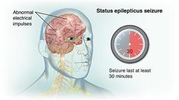
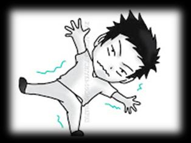
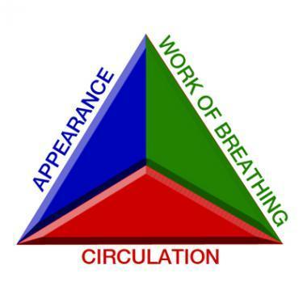
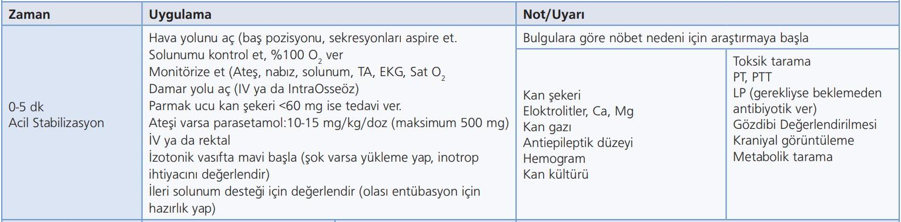
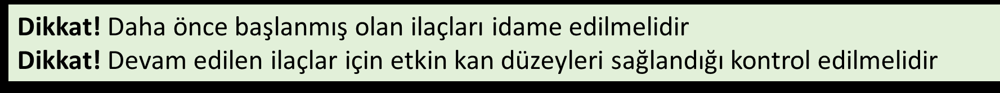
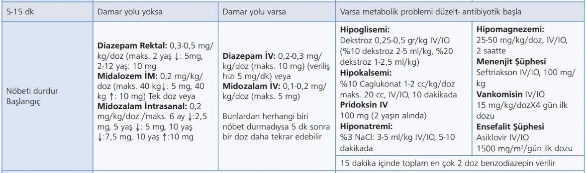
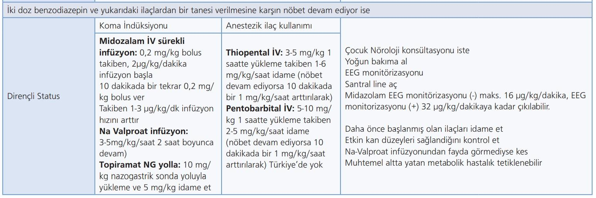
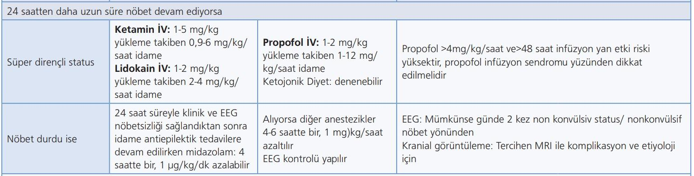
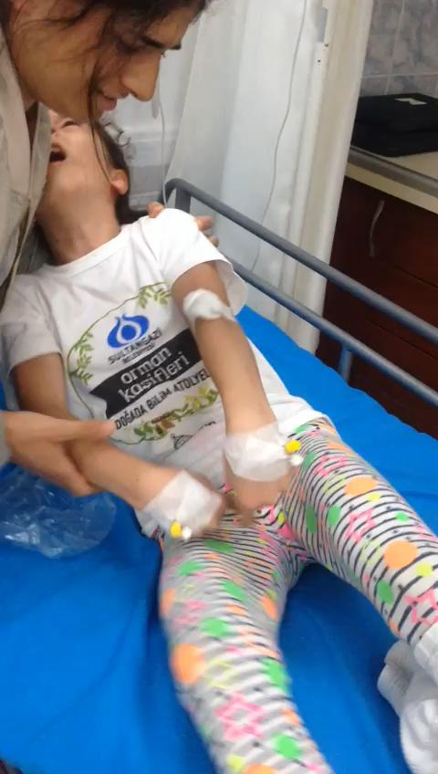
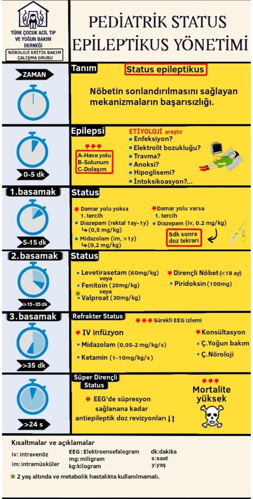

# STATUS EPİLEPTİKUS VE YÖNETİMİ

**Hazırlayan:** Dr. Öğr. Üyesi Şule Demir

---

## İÇİNDEKİLER

1. [Tanım](#tanım)
2. [Epidemiyoloji](#epidemiyoloji)
3. [Risk Faktörleri](#risk-faktörleri)
4. [Status Epileptikus Evreleri](#status-epileptikus-evreleri)
5. [Acil Değerlendirme](#acil-değerlendirme)
6. [Stabilizasyon ve Tedavi](#stabilizasyon-ve-tedavi)
7. [İlaç Tedavisi - 3 Evre](#ilaç-tedavisi)
8. [Prognoz](#prognoz)
9. [Olgu Örneği](#olgu-örneği)

---

## TANIM



### Epileptik Nöbet

**Beyinde anormal, aşırı veya senkronize nöronal aktivite** sonucu oluşan **bulgu ve/veya semptomlar bütünüdür.**

### Status Epileptikus (SE)

**Beyinde anormal, aşırı veya senkronize nöronal aktivite** sonucu oluşan **nöbet aktivitesinin uzaması durumudur.**



### Önem

⚠️ **Status epileptikus çocukluk çağında:**
- **En sık görülen**
- **Ciddi**
- **Sıklıkla yaşamı tehdit eden**
- **Nörolojik acil durumdur!**

---

## EPİDEMİYOLOJİ

### Genel Bilgiler

- SE bir **hastalık değil**, çok sayıda etiyolojisi olabilen bir **semptomdur**
- **En sık 5 yaş altındaki çocuklarda** görülür
- Çocuk acil servis başvurularının **%1.5'i nöbetler**
- Acil servise nöbet nedeniyle başvuran hastaların **%6-7'si SE**

### Yaşa Göre Dağılım

- **En sık:** 0-1 yaş (**135-150/100.000**)
- Adölesan yaşa doğru azalır

### En Sık Tip

**Febril status epileptikus** en sık görülen tipidir

### Mortalite

- Çocuklarda SE mortalite yaklaşık **%3**

---

## RİSK FAKTÖRLERİ

### Status Epileptikus Risk Faktörleri

| Kategori | Risk Faktörleri |
|----------|----------------|
| **İlaç İlişkili** | • Çoklu antiepileptik ilaç kullanımı<br>• AEİ (antiepileptik ilaç) kesimi/değişimi<br>• İlaç ilişkili nöbetler |
| **Enfeksiyonlar** | • Santral sinir sistemi enfeksiyonları<br>• Menenjit, ensefalit |
| **Hipoksik-İskemik** | • Anoksik hasar<br>• Perinatal hipoksik iskemik ensefalopati |
| **Metabolik** | • Metabolik bozukluklar<br>• Hipoglisemi, hiponatremi, hipokalsemi |
| **Travmatik** | • Travmatik beyin hasarı |
| **Konjenital** | • Serebral disgenezi<br>• Önceden olan beyin hasarı |
| **Nörodejeneratif** | • Progresif nörodejeneratif hastalık |
| **Nöbet Özellikleri** | • Uzamış febril nöbet<br>• İlk nöbetin SE olması<br>• Erken yaşta başlayan nöbetler<br>• Sekonder jeneralize fokal nöbetler |
| **EEG Bulguları** | • EEG'de zemin aktivite bozukluğu |
| **Diğer** | • İdiyopatik/Kriptojenik |

---

## STATUS EPİLEPTİKUS ZAMANLAMA VE KRİTİK NOKTALAR

### Nöbet Süresi ve Kritik Zaman Noktaları

```
Nöbet Başlangıcı
       ↓
   ┌───────────────────────────────────────────────────┐
   │                                                   │
   │    0-5 dk          t1 (5 dk)         t2 (30 dk) │
   │     │               │                    │       │
   ├─────┼───────────────┼────────────────────┼───────┤
   │                     ▲                    ▲       │
   │                     │                    │       │
   └─────────────────────┼────────────────────┼───────┘
                         │                    │
              STATUS EPİLEPTİKUS      UZUN DÖNEM HASAR
               BAŞLANGICI            BAŞLANGICI
            (ACİL TEDAVİ BAŞLA!)   (NÖRONAL ÖLÜM)
```

### Kritik Bilgiler

**İlk 5 Dakika (t1 öncesi):**
- Nöbetler **ilk 5 dakikada** kendiliğinden durabilir
- **5. dakikada durmadıysa** kendiliğinden durma şansı **düşüktür**

**t1 noktası (5. dakika) - Status Epileptikus Başlangıcı:**
- **Acil tedavi başlanmalıdır!**
- Nöbetin sonlandırılmasından sorumlu mekanizmaların **başarısızlığı**
- Anormal derecede uzamış nöbetlere neden olan mekanizmaların **başlatılması**

**t2 noktası (30. dakika) - Uzun Dönem Olumsuz Sonuçlar:**
- **Nöronal ölüm**
- **Nöronal hasar**
- **Nöronal ağ değişikliği**
- **Fonksiyonel defisitler**

---

## GENEL UZLAŞI - ÖNEMLİ!

### Acil Serviste Yaklaşım

1. ✅ **Acil servislere aktif nöbetle başvuran her çocuk status epileptikus olarak kabul edilmeli**

2. ✅ **İlk 5 dakikalık dönemde acil tedaviye başlanmalıdır**

3. ✅ **Erken müdahale** nöbetin durmasını **kolaylaştırır**

4. ✅ **Erken tanı ve uygun tedavi:**
   - Nörolojik hasar oranını azaltır
   - Mortalite oranını en aza indirir

---

## STATUS EPİLEPTİKUS EVRELERİ

### Zaman Bazlı Evreler

| Evre | Süre | Tanım |
|------|------|-------|
| **1. Erken SE** | **0-15 dakika** | Nöbetin ilk 15 dakikalık dönemi |
| **2. Uzamış SE** | **15-60 dakika** | Nöbetin devam ettiği 15-60 dk arası dönem |
| **3. Dirençli SE (Refrakter SE)** | **>60 dakika** | İlk ve ikinci basamak antiepileptik verilmesine rağmen süren ya da 1 saatten uzun süren nöbet |
| **4. Süper Dirençli SE** | **>24 saat** | 24 saatten uzun süren, çoklu antiepileptiklere rağmen devam eden nöbet |

---

## İLK 15 DAKİKALIK KRİZ YÖNETİMİ ⚡

### EN KRİTİK DÖNEM: 0-15 DAKİKA

**İlk 15 dakika status epileptikus yönetiminde EN ÖNEMLİ dönemdir!**

Bu süreçte üç ana hedef vardır:
1. ✅ **Yaşamsal fonksiyonları stabilize etmek** (ABCDE)
2. ✅ **Nöbeti durdurmak** (Benzodiazepin)
3. ✅ **Altta yatan nedenleri tespit ve tedavi etmek**

---

### ZAMAN ÇİZELGESİ: İLK 15 DAKİKA

```
0-2 dk    │ • Hızlı değerlendirme (ÇDÜ)
          │ • Yatak başı kan şekeri
          │ • Monitorizasyon başlat
          │
2-5 dk    │ • ABCDE stabilizasyonu
          │   - A: Havayolu aç (koklama pozisyonu)
          │   - B: %100 O2 ver
          │   - C: Damar yolu aç
          │   - D: Bilinç değerlendir (USAY)
          │   - E: Vücut kontrolü, ateş
          │
5 dk      │ ⚡ KRİTİK NOKTA: NÖBET HALA DEVAM EDİYOR MU?
          │
5-10 dk   │ • BİRİNCİ İLAÇ (Benzodiazepin)
          │   - Midazolam IV: 0.1-0.2 mg/kg
          │   - Diazepam rektal: 0.3-0.5 mg/kg
          │   - Midazolam IM/bukkal: 0.2 mg/kg
          │ • Metabolik sorunları düzelt
          │   - Hipoglisemi → Dekstroz
          │   - Hipokalsemi → Ca-glukonat
          │   - Hiponatremi → %3 NaCl
          │
10-15 dk  │ • Nöbet devam ediyorsa:
          │   BENZODİAZEPİN TEKRAR (5-10 dk sonra)
          │ • Entübasyon ihtiyacını değerlendir
          │ • Sürekli monitorizasyon devam
          │
15 dk     │ ⚡ NÖBET HALA DEVAM EDİYORSA:
          │   → UZAMIŞ SE (2. EVRE)
          │   → 2. BASAMAK İLAÇ (Fenitoin/Levetirasetam/Valproat)
```

---

### İLK 15 DAKİKADA YAPILMASI GEREKENLER - DETAYLI

#### 📍 0-2 DAKİKA: HIZLI DEĞERLENDİRME

**Çocuk Değerlendirme Üçgeni (ÇDÜ):**
```
    GÖRÜNÜM: Anormal
   (Konvülziyon, bilinç kapalı)
         /\
        /  \
       /    \
      / ÇDÜ  \
     /        \
    /          \
   /____________\
SOLUNUM:      DOLAŞIM:
Anormal       Değişken
(Apne riski,  (Taşikardi,
 sekresyon)    hipertansiyon)
```

**Acil Yapılacaklar:**
1. ✅ **Yatak başı kan şekeri ölç** (0-2 dk içinde MUTLAKA)
2. ✅ **Monitörizasyon başlat:**
   - EKG
   - SpO2
   - Kan basıncı
   - Ateş

#### 📍 2-5 DAKİKA: ABCDE STABİLİZASYONU

| Bileşen | Değerlendirme | Acil Müdahale |
|---------|---------------|---------------|
| **A - Airway** | • Havayolu açık mı?<br>• Sekresyon var mı?<br>• Dişler kenetli mi? | • **Koklama pozisyonu** ver<br>• Sekresyonları aspire et<br>• **Oral airway** yerleştir<br>• ⚠️ Travma varsa boyun stabilizasyonu |
| **B - Breathing** | • Solunum var mı?<br>• SpO2 düzeyi?<br>• Göğüs hareketleri? | • **%100 Oksijen** ver (rezervuarlı maske)<br>• Apne varsa **BMV başla**<br>• Hedef SpO2 >94% |
| **C - Circulation** | • Nabız?<br>• Kapiller dolum?<br>• Kan basıncı? | • **IV/IO damar yolu** aç<br>• Şok varsa **20 ml/kg SF** bolus<br>• Kan şekeri <60 mg/dl ise **dekstroz** ver |
| **D - Disability** | • Bilinç düzeyi (USAY)?<br>• Pupiller?<br>• Nöbet tipi? | • Kan şekeri değerlendir<br>• GKS hesapla<br>• Fokal/jeneralize ayırt et |
| **E - Exposure** | • Ateş?<br>• Travma?<br>• Döküntü? | • Ateş >38.5°C ise **antipiretik**<br>• Tüm vücut muayenesi<br>• Menenjit belirtileri? |

#### 📍 5-10 DAKİKA: BİRİNCİ İLAÇ TEDAVİSİ

**⚡ 5. DAKİKA = KRİTİK KARAR NOKTASI**

**Nöbet hala devam ediyorsa → Hemen Benzodiazepin ver!**

**DAMAR YOLU VAR İSE (Tercih Sırası):**

| Sıra | İlaç | Doz | Maksimum | Uygulama |
|------|------|-----|----------|----------|
| **1. Tercih** | **Midazolam IV** | 0.1-0.2 mg/kg | 5 mg | 2-3 dk yavaş IV puşe |
| 2. Seçenek | Diazepam IV | 0.2 mg/kg | 10 mg | Maks 5 mg/dk hızla |

**DAMAR YOLU YOK İSE (Tercih Sırası):**

| Sıra | İlaç | Doz | Maksimum (yaşa göre) | Uygulama |
|------|------|-----|----------------------|----------|
| **1. Tercih** | **Midazolam IM** | 0.2 mg/kg | 13-40 kg: 5 mg<br>>40 kg: 10 mg | Deltoid/vastus lateralis kas<br>**Tek doz!** |
| 2. Seçenek | Midazolam Bukkal | 0.2-0.3 mg/kg | <5 yaş: 5 mg<br>5-10 yaş: 7.5 mg<br>>10 yaş: 10 mg | Yanak iç mukozasına |
| 3. Seçenek | Diazepam Rektal | 0.3-0.5 mg/kg | <2 yaş: 5 mg<br>2-12 yaş: 10 mg<br>>12 yaş: 20 mg | Rektal yolla |

**⚠️ ÖNEMLİ UYARILAR:**
- IV/IO ilaçlar **mutlaka yavaş puşe** (solunum arresti riski!)
- IM ilaç verilmişse **asla tekrar etme** (uzamış sedasyon riski)
- Benzodiazepin sonrası **solunum izlemi kritik**
- BMV ekipmanı hazır olmalı

---

### ⚠️⚠️⚠️ KRİTİK BENZODİAZEPİN UYARILARI ⚠️⚠️⚠️

**BENZODİAZEPİNLERLE İLGİLİ MUTLAKA BİLİNMESİ GEREKENLER:**

| Uyarı | Açıklama | Önlem |
|-------|----------|-------|
| **🔴 APNE RİSKİ** | Benzodiazepinler **solunum depresyonu** yapar | • **Mutlaka yavaş IV puşe** (2-3 dk)<br>• SpO2 sürekli izle<br>• **BMV ekipmanı hazır olsun**<br>• Apne gelişirse hemen BMV başla |
| **🔴 HİPOTANSİYON** | Özellikle hızlı verilirse kan basıncı düşer | • Yavaş puşe<br>• TA monitorizasyonu<br>• Sıvı hazır olsun |
| **🔴 UZAMIŞ SEDASYON** | Özellikle IM yolda birikme riski | • **IM ilaç ASLA tekrar edilmez**<br>• Yalnız **1 kez** verilir<br>• Tekrar gerekirse IV/IO yol aç |
| **🔴 DİAZEPAM AMPULÜNün İÇERİĞİ** | **Benzil alkol + Propilen glikol** içerir | • **Hiperosmolarite** yapabilir<br>• **Laktik asidoz** riski<br>• **Gasping sendromu** (yenidoğanda)<br>• Mümkünse **Midazolam tercih et** |
| **🔴 MİDAZOLAM UZUN İNFÜZYON** | Uzun süre infüzyonda **taşiflaksi** (tolerans) gelişir | • İnfüzyon süresi kısıtlı tutulmalı<br>• Etkisizleşirse başka ilaca geç |

**📌 EN ÖNEMLİ KURAL:**
> **Benzodiazepin verdikten sonra ilk 5 dakika MUTLAKA yakın solunum izlemi!**
>
> Apne gelişirse hemen BMV başla, gerekirse entübe et!

---

#### 📍 5-10 DAKİKA: METABOLİK DÜZELTİLER

**Eş zamanlı olarak metabolik sorunlar düzeltilmeli:**

| Metabolik Sorun | Tespit | Acil Tedavi | Doz |
|----------------|--------|-------------|-----|
| **Hipoglisemi** | KŞ <60 mg/dl | **Dekstroz IV/IO** | • Bebek/çocuk: **D10: 2.5-5 ml/kg**<br>• Ergen: **D25: 1-2 ml/kg** |
| **Hipokalsemi** | Ca <7 mg/dl<br>Tetani bulguları | **%10 Ca-glukonat** | **1-2 ml/kg IV** (10 dakikada) |
| **Hiponatremi** | Na <125 mEq/L | **%3 NaCl** | **3-5 ml/kg IV** (10-15 dk'da) |
| **Hipomagnezemi** | Mg düşük<br>Tetani | **MgSO4** | **25-50 mg/kg IV** (30 dk'da) |
| **Piridoksin eks.** | <2 yaş bebek | **Piridoksin** | **100 mg IV** |

#### 📍 10-15 DAKİKA: YENİDEN DEĞERLENDİRME

**Nöbet durdu mu? ✓**
- ✅ Monitorizasyona devam
- ✅ Nörolojik muayene
- ✅ Altta yatan neden araştır
- ✅ İkincil değerlendirme (öykü, fizik muayene)

**Nöbet devam ediyor mu? ✗**
- ⚡ **BENZODİAZEPİN TEKRAR** (5-10 dk sonra, tek doz daha)
  - Aynı ilaç verilir
  - Aynı doz veya yarı doz
  - **IM ilaç verilmişse tekrar etme!**

**15. Dakikada hala nöbet varsa:**
- 🔴 **UZAMIŞ SE tanısı**
- 🔴 **2. BASAMAK İLAÇ** başlanmalı (Fenitoin/Levetirasetam/Valproat)
- 🔴 **Yoğun bakım** konsültasyonu

---

### İLK 15 DAKİKADA SÜREKLİ MONİTÖRİZASYON

**Hasta sürekli izlenmeli:**

| Parametre | İzlem Sıklığı | Hedef/Normal |
|-----------|---------------|--------------|
| **SpO2** | Sürekli | >94% |
| **Kalp hızı** | Sürekli | Yaşa göre normal |
| **Kan basıncı** | Her 5 dk | Yaşa göre hipotansiyon sınırı üstünde |
| **Solunum** | Sürekli | Apne yok, göğüs hareketleri yeterli |
| **Bilinç** | Her müdahale sonrası | USAY - Uyanık hedef |
| **Nöbet aktivitesi** | Sürekli | Nöbet durması |

---

### İLK 15 DAKİKADA ENTÜBASYON DEĞERLENDİRMESİ

**Entübasyon endikasyonları (acil):**

| Durum | Açıklama |
|-------|----------|
| ✅ **Apne** | Spontan solunum yok |
| ✅ **Yetersiz ventilasyon** | BMV'ye rağmen SpO2 <90% |
| ✅ **Hava yolu kontrolü kaybı** | Aspirasyon riski, gag refleksi yok |
| ✅ **GKS ≤8** | Derin koma, hava yolu koruması yok |
| ✅ **Dirençli SE** | 15 dk'dan uzun süren nöbet |

**Entübasyon hazırlığı:**
- RSI (Rapid Sequence Intubation) protokolü
- Preoksijenasyon (%100 O2)
- İlaçlar hazır: Sedatif + Kas gevşetici
- Aspirasyon ekipmanı hazır

---

### İLK 15 DAKİKA: YAPILANLAR KONTROL LİSTESİ ✓

**Mutlaka yapılması gerekenler:**

```
☐ Monitorizasyon (EKG, SpO2, TA)
☐ Yatak başı kan şekeri (0-2 dk)
☐ Havayolu açıklığı sağlandı
☐ %100 Oksijen verildi
☐ Damar yolu açıldı (IV/IO)
☐ BENZODİAZEPİN verildi (5. dk)
☐ Metabolik düzeltme (hipoglisemi, hipokalsemi vb.)
☐ Nöbet izlemi yapıldı
☐ Solunum izlemi (apne riski!)
☐ Entübasyon hazırlığı değerlendirildi
☐ 10-15. dk: Nöbet devam ediyorsa BENZODİAZEPİN TEKRAR
☐ 15. dk: Hala nöbet varsa → 2. BASAMAK İLAÇ
```

---

### KRİTİK HATALAR - YAPILMAMASI GEREKENLER ❌

| Hata | Neden Yanlış | Doğrusu |
|------|-------------|---------|
| ❌ 5 dk bekle-gör | Nöbet kendiliğinden durmaz, beyin hasarı artar | ✅ 5. dk benzodiazepin VER |
| ❌ Damar yolu açana kadar bekle | Zaman kaybı | ✅ IM/Bukkal/Rektal yoldan hemen ilaç ver |
| ❌ Hızlı IV puşe | Solunum arresti riski | ✅ 2-3 dk yavaş puşe |
| ❌ IM ilaç tekrarı | Birikme, uzamış sedasyon | ✅ IM tek doz, tekrar etme |
| ❌ Kan şekeri ölçmeden ilaç | Hipoglisemik nöbeti kaçırırsın | ✅ İlk 0-2 dk kan şekeri ölç |
| ❌ Monitörsüz tedavi | Komplikasyonları kaçırırsın | ✅ Önce monitörize et |
| ❌ BMV ekipmanı hazır değil | Benzodiazepin apne yaparsa müdahale edemezsin | ✅ BMV hazır olsun |

---

### ÖZET: İLK 15 DAKİKA ALGORİTMASI

```
NÖBET BAŞLANGICI
       ↓
   0-2 dk: ÇDÜ + KAN ŞEKERİ + MONİTÖRİZASYON
       ↓
   2-5 dk: ABCDE STABİLİZASYONU
       ↓
   5. dk: NÖBET DEVAM EDİYOR MU?
       ↓
   EVET → BENZODİAZEPİN VER
       ↓
   5-10 dk: METABOLİK DÜZELTİLER
       ↓
   10. dk: NÖBET DEVAM EDİYOR MU?
       ↓
   EVET → BENZODİAZEPİN TEKRAR (tek doz daha)
       ↓
   15. dk: NÖBET DEVAM EDİYOR MU?
       ↓
   EVET → UZAMIŞ SE → 2. BASAMAK İLAÇ
       ↓
   Fenitoin/Levetirasetam/Valproat
```

---

## STATUS EPİLEPTİKUS FİZYOPATOLOJİSİ

### Erken Status Epileptikus (0-15 dakika)

**Kompansatuar Yanıt:**

| Beyin Değişiklikleri | Sistemik Etkiler |
|---------------------|------------------|
| • Beyin kan akımı **artar** | • **Hiperglisemi** |
| • Metabolizma **hızlanır** | • **Taşikardi** |
| • O2 ve glukoz tüketimi **artar** | • **Terleme** |
| • CO2 ve laktat üretimi **artar** | • **Hipertansiyon** |
| | • **Aritmiler** |
| | • **Laktik asidoz** |
| | • **Katekolamin deşarjı** |

### Uzamış Status Epileptikus (15-60 dakika)

**Dekompansasyon:**

| Beyin Değişiklikleri | Sistemik Komplikasyonlar |
|---------------------|--------------------------|
| • Serebral **otoregülasyon yetersiz** kalır | • **Hipoksi** |
| • Beyin kan akımı sistemik kan basıncına **bağımlı** kalır | • **Serebral iskemi** |
| | • **Hipoglisemi** |
| | • **Laktik asidoz** |
| | • **Bradikardi** |
| | • **Stress kardiyomiyopati** |
| | • **Akciğer ödemi** |
| | • **Rabdomiyoliz** → Akut böbrek yetmezliği |
| | • **Kemik kırıkları** |

---

## ACİL DEĞERLENDİRME

### Hızlı Öykü Alınması Gerekenler

| Kategori | Değerlendirme |
|----------|---------------|
| **Hastane Öncesi** | • Hastane öncesi antiepileptik uygulaması var mı? |
| **Epilepsi Öyküsü** | • Bilinen epilepsi var mı?<br>• Daha önce status öyküsü var mı? |
| **Tetikleyici Faktörler** | • Ne olabilir? (uyku deprivasyonu, ilaç kesimi, ateş) |
| **İlaçlar** | • Kullandığı ilaçlar neler?<br>• İlaç alerjisi var mı? |
| **Travma** | • Travma belirtisi var mı? |
| **Nöbet Özelliği** | • Fokal mi? Jeneralize mi?<br>• Süre? |

### Yatak Başı Acil Testler (0-2 dakika)

**Mutlaka yapılmalı:**
- ✅ **Yatak başı kan şekeri ölçümü** (0-2 dakika içinde)

### Rutin Laboratuvar İncelemeleri

**Temel testler:**
- Tam kan sayımı
- Kan gazı
- Elektrolitler (Na, K, Ca, Mg)
- Glukoz
- BUN, kreatinin

**Metabolik bozukluklar değerlendirilmeli:**
- Hiponatremi
- Hipoglisemi
- Hipokalsemi
- Hipomagnezemi

**Enfeksiyon bulguları:**
- Sepsis
- Menenjit bulguları

---

## HASTA ÖZELİNDE YAPILACAK TESTLER

### İleri Laboratuvar İncelemeleri

| Test | Endikasyon |
|------|------------|
| **Antiepileptik ilaç düzeyi** | Aldığı tedavi varsa |
| **Toksik tarama** | Zehirlenme şüphesi varsa |
| **Kan, idrar, dışkı, BOS kültürleri** | Ateş ve enfeksiyon şüphesi varsa |
| **Karaciğer fonksiyon testleri** | Valproat, fenitoin kullanımı |
| **Böbrek fonksiyon testleri** | Levetirasetam kullanımı |
| **Metabolik testler** | • 1 yaştan küçük bebek<br>• Metabolik hastalık şüphesi |

### Nörogörüntüleme Endikasyonları

**BT veya MRG yapılmalı:**

| Endikasyon |
|------------|
| ✅ **Travma öyküsü** ya da şüphesi varlığında |
| ✅ **Fokal nörolojik bulgu** varlığında |
| ✅ **Koma** durumunda |
| ✅ **Onkoloji hastasında** etiyoloji açıklanmadığında |
| ✅ **İlk afebril nöbet**te |
| ✅ **Kafa içi basınç artışı (KİBAS)** varlığında |

**Zamanlama:**
- Nöbet durduktan ve hasta **stabilize edildikten sonra**
- Mümkünse **ilk 60 dakika içinde** yapılmalı
- **BT öncelikle tercih edilir** (hızlı)
- Etiyoloji aydınlatılamazsa **MRG yapılabilir** (daha duyarlı ve spesifik)

---

## ELEKTROENSEFALOGRAFİ (EEG)

### EEG Endikasyonları

| Durum | Zamanlama |
|-------|-----------|
| **SE tanısında** | Her zaman |
| **SE'da EEG hemen yapılamıyorsa** | Mümkün olan en kısa sürede (İdeal **1-2 saat** içinde) |
| **Kritik hasta çocuklarda** | EEG monitorizasyonu (klinik eşlik etmeksizin elektrografik nöbetler) |
| **Bilinç değişikliği açıklanamadıysa** | Nonkonvülsif SE tanısında |
| **Parsiyel/Jeneralize ayrımı** | Tedavi planı için |

**Önemli:**
- EEG monitorizasyonunun çoğunlukla nöbet başlangıcından **15-60 dakika sonra** nonkonvülsif status epileptikusu ekarte etmek için yapılması önerilmektedir

---

## ÇOCUK DEĞERLENDİRME ÜÇGENİ (ÇDÜ) - Status Epileptikus'ta



### Nöbet Geçirmekte Olan Bir Çocuk

```
    GÖRÜNÜM: ANORMAL
   (Bilinç kapalı)
         /\
        /  \
       /    \
      / ÇDÜ  \
     /        \
    /          \
   /____________\
SOLUNUM:      DOLAŞIM:
ANORMAL       NORMAL
(Takipne,     (Pembe cilt)
 burun kanadı,
 retraksiyonlar,
 sekresyonlar)
```

**Sonuç:** SSS Depresyonu + Solunum riski

---

## STABİLİZASYON VE TEDAVİ HEDEFLERİ

### Tedavi Hedefleri

1. ✅ **Havayolu, solunum ve dolaşımın sağlanması**
2. ✅ **Beynin yeterli oksijenasyonunun sağlanması**
3. ✅ **Hayatı tehdit edici durumları tanımak ve gerekli müdahaleyi yapmak**
4. ✅ **Komplikasyonların tedavi edilmesi**
5. ✅ **Altta yatan nedenin tedavi edilmesi**
6. ✅ **Nöbeti durdurmak ve tekrarını önlemek**
7. ✅ **Refrakter statusun yönetilmesi**

---

## STABİLİZASYON - ABCDE YAKLAŞIMI



### A - Havayolu (Airway)

| Adım | Uygulama |
|------|----------|
| **Pozisyon** | • **Koklama pozisyonu** (⚠️ Travmada dikkat!)<br>• Başa uygun pozisyon ver |
| **Sekresyon** | • Nazofarengeal sekresyonları **aspire et** |
| **Airway** | • Havayolu yeterli sağlanamıyorsa **oral airway** |

### B - Solunum (Breathing)

| Değerlendirme | Uygulama |
|---------------|----------|
| **Solunum çabası yeterli ise** | • **%100 oksijen** ver<br>• Tercihen **geri solumasız rezervuarlı maske** ile |
| **Solunum çabası yetersiz ise** | • **Balon-maske ventilasyonu** yap |

#### Balon-Maske Ventilasyon (BMV) Endikasyonları

**BMV gerekir:**
- Yetersiz göğüs hareketleri
- Oskültasyonda zayıf hava giriş-çıkışı
- Solunum çabasında azalma
- **Apne**
- Santral siyanoz gibi yetersiz oksijenasyon ve ventilasyon bulguları

#### İleri Havayolu Desteği (Entübasyon) Endikasyonları

**Entübasyon gerekir:**
- BMV yetersizliği veya ihtiyacın uzaması
- Ağır hipoksi (bradikardi, hipotansiyon, kötü perfüzyon)
- **Kafa içi basınç artışı (KİBAS) bulguları**
- **Dirençli SE**

### C - Dolaşım (Circulation)

| Adım | Uygulama |
|------|----------|
| **Monitorizasyon** | • Ateş, nabız, solunum, TA, SpO2, EKG |
| **Damar yolu** | • IV veya intraosseoz (IO) |
| **Sıvı** | • İzotonik vasıfta gerekli miktarda mayi başla<br>• **Şok bulguları varsa:** 20 ml/kg hızlı SF yükle |
| **İnotrop** | • İnotrop destek gerekliliğini değerlendir |

### D - Disability (Nörolojik)

**Parmak ucu kan şekeri bak:**
- **Hipoglisemik (<60 mg/dl) ise:**
  - Dekstroz **0.25-0.5 gr/kg, IV/IO**

### E - Exposure

**Ateşini değerlendir:**
- **Ateşi varsa:**
  - Parasetamol ver (**10-15 mg/kg**, maks: 500 mg, IV/Rektal)

---

## İLAÇ TEDAVİSİ - 3 EVRE PROTOKOLÜ

### Genel Prensipler



1. ✅ **İlk sıra ilaçlar:** Benzodiazepin grubundan biri
2. ✅ **En hızlı ulaşılıp uygulanabilecek** olan seçilir
3. ✅ **Doğru ve tam dozda** uygulanmalıdır
4. ✅ Nöbet durmadı ise **5-10 dakika sonra** bir kez daha **tekrar edilir**
5. ✅ IV/IO ilaçlar **yavaş puşe** edilmelidir
6. ✅ IM ilaç uygulandıysa **tek doz** yapılmalı, **tekrar edilmemelidir**

**⚠️ DİKKAT:**
- Benzodiazepinler uzamış sedasyon, apne, hipotansiyon yapabilirler
- Diazepam ampul benzil alkol/propilen glikol içerir → Hiperosmolarite, laktik asidoz, gasping sendromu
- Midazolam uzun infüzyonda taşiflaksi yaratabilir

---

## BİRİNCİ EVRE: BAŞLANGIÇ TEDAVİSİ (5-15 dakika)



### Hedef: Bir An Önce Nöbeti Durdur!

### DAMAR YOLU OLMAYAN HASTADA

#### 1. Diazepam (Rektal)

| Parametre | Değer |
|-----------|-------|
| **Doz** | 0.3-0.5 mg/kg/doz |
| **Maksimum Doz (Yaşa Göre)** | • Yenidoğan: **2.5 mg**<br>• <2 yaş: **5 mg**<br>• 2-12 yaş: **10 mg**<br>• 12-18 yaş: **20 mg** |

#### 2. Midazolam (Nazal/Bukkal)

| Parametre | Değer |
|-----------|-------|
| **Doz** | • Bukkal: **0.2-0.3 mg/kg/doz**<br>• Nazal: **0.3-0.5 mg/kg/doz** |
| **Maksimum Doz (Yaşa Göre)** | • <6 ay: **2.5 mg**<br>• <5 yaş: **5 mg**<br>• 5-10 yaş: **7.5 mg**<br>• 10-18 yaş: **10 mg** |
| **Uygulama** | • Her iki nazal boşluğa eşit ve yavaş puşe |

#### 3. Midazolam (İM)

| Parametre | Değer |
|-----------|-------|
| **Doz** | 0.2 mg/kg/doz |
| **Maksimum Doz (Kiloya Göre)** | • 13-40 kg: **5 mg**<br>• >40 kg: **10 mg** |
| **Önemli** | **Yalnız 1 kez yapılabilir** (uzamış sedasyon, apne, hipotansiyon riski) |

---

### DAMAR YOLU OLAN HASTADA

#### 1. Midazolam (IV) - Tercih Edilir

| Parametre | Değer |
|-----------|-------|
| **Doz** | 0.1-0.2 mg/kg/doz |
| **Maksimum Doz** | **5 mg** |
| **Uygulama** | Yavaş IV puşe |

#### 2. Diazepam (IV)

| Parametre | Değer |
|-----------|-------|
| **Doz** | 0.2 mg/kg/doz |
| **Maksimum Doz** | **10 mg** |
| **Veriliş Hızı** | En çok **5 mg/dk** |
| **Uyarı** | ⚠️ **Solunum arresti riski** - Yavaş puşe! |

#### 3. Lorazepam (Ativan) (IV)

**❌ Türkiye'de bulunmamaktadır**

| Parametre | Değer |
|-----------|-------|
| **Doz** | 0.1 mg/kg |
| **Veriliş Hızı** | En çok **2 mg/dk** |

---

## İKİNCİ EVRE: UZAMIŞ SE TEDAVİSİ (15-30 dakika)

### Nöbet Devam Ediyorsa

**Uzamış SE tedavisinde önerilen ilaçların birbirine üstünlüğünü gösteren kanıt yoktur.**

**İkinci sıra ilaçlardan herhangi biri tek doz olarak verilir.**

### İkinci Basamak İlaçlar (Birini Seç)

| İlaç | Doz | Maksimum Doz | Veriliş Hızı | Özellikler |
|------|-----|--------------|--------------|------------|
| **FENİTOİN** | 15-20 mg/kg/doz | 1000 mg | En çok 1-2 mg/kg/dk veya 50 mg/dk | • Bradikardi, hipotansiyon, aritmi riski (hızlı infüzyon yapma!)<br>• **Dekstrozla geçimsiz, SF içinde** infüze et<br>• Propilen glikol içerir<br>• Ekstravazasyon: Mor eldiven sendromu<br>• Zehirlenmelerde tercih edilmez |
| **LEVETİRASETAM** | 60 mg/kg/doz | 4500 mg | En çok 3-5 mg/kg/dk | • **Karaciğerde metabolize edilmiyor**<br>• Metabolik hastalık şüphesinde tercih edilebilir<br>• Renal yetmezlikte doz ayarlaması gerekir |
| **VALPROİK ASİT** | 20-40 mg/kg/doz | 3000 mg | En kısa 30 dk | • **Metabolik hastalıkta tercih edilmez**<br>• **Karaciğer hastalıklarında tercih edilmez**<br>• **2 yaş altında tercih edilmez**<br>• Hiperamonyemi, hepatotoksisite, agranulositoz riski |
| **FENOBARBİTAL** | 15-20 mg/kg/doz | 1000 mg | En çok 1-2 mg/kg/dk | • **2 yaş altında kullanılabilir**<br>• **Zehirlenmelerde (TSA) tercih edilir**<br>• ❌ IV formu Türkiye'de yok |

---

### İkinci Basamak İlaçların Özellikleri

#### Fenitoin (Dilantin)

**Etki Mekanizması:**
- Nöron içinde voltaj bağımlı Na kanallarını bloke ederek nöronun uyarılmasını engeller

**Yan Etkiler:**
- Bradikardi, hipotansiyon, aritmi (hızlı infüzyon yapma!)

**Önemli Noktalar:**
- ⚠️ **Dekstrozla geçimsizdir, SF içinde infüze edilmeli**
- Propilen glikol içerir
- Ekstravazasyonu **mor eldiven sendromu** yapabilir
- Zehirlenme durumlarında tercih edilmez

#### Levetirasetam (Keppra)

**Avantajları:**
- ✅ Karaciğerde metabolize edilmiyor
- ✅ Metabolik hastalık şüphesinde tercih edilebilir

**Dikkat:**
- Renal yetmezlikte doz ayarlaması gerekir

#### Valproik Asit (Depakin)

**Kontrendikasyonlar:**
- ❌ Metabolik hastalığı olan hastalarda tercih edilmez
- ❌ Karaciğer hastalıklarında tercih edilmez
- ❌ 2 yaş altında tercih edilmez

**Yan Etkiler:**
- İnfüzyonu hiperamonyemi, hepatotoksisite, agranulositoz yapabilir

#### Fenobarbital

**Avantajları:**
- ✅ 2 yaş altında kullanılabilir
- ✅ Zehirlenmelerde (trisiklik antidepresan) tercih edilir

**Dezavantaj:**
- ❌ IV formu Türkiye'de yok

---

## ÜÇÜNCÜ EVRE: DİRENÇLİ SE TEDAVİSİ (>30 dakika)



### Nöbet Hala Devam Ediyorsa

**İkinci sıra ilaçlardan verilmeyen verilir ya da aynı doz veya yarı dozda tekrar edilebilir.**

**Hastada halen nöbet devam ediyorsa:**
- Antiepileptik ilaçlar **sürekli infüzyon** şeklinde kullanılarak **koma indüksiyonu** yapılmalıdır
- Hastalar olası komplikasyonlar açısından **yoğun bakım koşullarında** izlenmeli
- Solunum değerlendirilip gerekirse **entübasyon** yapılmalıdır

---

### Üçüncü Basamak İlaçlar

#### 1. Midazolam (IV İnfüzyon) - İlk Seçenek

| Parametre | Değer |
|-----------|-------|
| **Başlangıç** | 0.2 mg/kg bolus |
| **İnfüzyon** | 1-3 µg/kg/dk |
| **Titre Etme** | • Her 10-15 dakikada 0.2 mg/kg ek bolus<br>• İnfüzyon hızı 1-3 µg/kg/dk artırılarak titre et |
| **Maksimum Doz** | • **EEG monitorizasyonu yoksa:** En fazla **16 µg/kg/dk**<br>• **EEG monitorizasyonu varsa:** En fazla **32 µg/kg/dk** (2 mg/kg/saat) |

#### 2. Valproik Asit (IV İnfüzyon)

| Parametre | Değer |
|-----------|-------|
| **İnfüzyon** | 3-5 mg/kg/saat |
| **Süre** | 2 saat boyunca devam edilebilir |
| **Hedef** | Kan düzeyi 75 mg/L |
| **Değerlendirme** | • Hastaya özel yararlı olup olmadığı değerlendirilir<br>• Fayda görülmediyse kesilmelidir (muhtemel altta yatan metabolik hastalık tetiklenebilir) |

#### 3. Topiramat (NG Yolla)

| Parametre | Değer |
|-----------|-------|
| **Özellik** | Geniş spektrumlu antiepileptik |
| **Yükleme** | 10 mg/kg nazogastrik sonda yoluyla |

---

## STATUS TEDAVİSİNİN SONLANDIRILMASI



### Kriterler

**24 saat nöbetsizlik ve burst süpresyon paterni olduysa:**

| İlaç | Azaltma Protokolü |
|------|-------------------|
| **Midazolam** | 4 saatte bir **1 µg/kg/dk** azalt |
| **Anestezikler** | 4-6 saatte bir **1 mg/kg/saat** azalt |

**Her azaltmada:**
- EEG kontrolü yapılmalı

---

## ALTERNATİF TEDAVİLER

Refrakter ve süper refrakter SE'de düşünülebilir:

1. **Ketojenik diyet**
2. **İmmünomodülasyon:**
   - Kortikosteroidler
   - ACTH
   - Plazmaferez
3. **Epilepsi cerrahisi**
4. **Vagal sinir stimülasyonu**
5. **Hipotermi**
6. **Elektrokonvülzif tedavi**

---

## SSS ENFEKSİYONU ŞÜPHESİ

### Önemli Uyarı

⚠️ **SSS enfeksiyonu şüphesi olan hastada:**
- **BOS örnekleme beklenmeden** ilk doz tedavileri verilmeli

### Menenjit Şüphesi Tedavisi

| İlaç | Doz |
|------|-----|
| **Seftriakson** | 100 mg/kg/gün IV/IO (ilk doz) |
| **Vankomisin** | 60 mg/kg/gün IV/IO (ilk doz) |

### Ensefalit Şüphesi Tedavisi

| İlaç | Doz |
|------|-----|
| **Asiklovir** | • 1500 mg/m²/gün **veya**<br>• 30 mg/kg/gün IV/IO (ilk doz) |

---

## METABOLİK SORUNLARIN DÜZELTİLMESİ

### Hipoglisemi (Semptomatik ve <60 mg/dl)

| Yaş Grubu | Tedavi |
|-----------|--------|
| **Bebekler ve 12 yaşına kadar** | • D10: **2.5-5 ml/kg** **veya**<br>• D25: **1-2 ml/kg** |
| **12 yaş ve üzeri ergenler** | • D25: **1-2 ml/kg** |
| **Alternatif (IM/SC)** | • Glukagon **0.5 mg** (<25 kg) **veya** **1 mg** (≥25 kg)<br>• Maksimum doz: 1 mg (0.03 mg/kg) |

### Hipokalsemi

| İlaç | Doz | Veriliş |
|------|-----|---------|
| **%10 Ca-glukonat** | 1-2 ml/kg/doz | IV/IO, **10 dakikada** |

### Hipomagnezemi

| İlaç | Doz | Veriliş |
|------|-----|---------|
| **MgSO4** | 25-50 mg/kg | IV/IO, **1/2 saatte** |

### Hiponatremi (Na <125 mEq/L)

| İlaç | Doz | Veriliş | Süre |
|------|-----|---------|------|
| **%3 NaCl** | 3-5 ml/kg | IV/IO, **10-15 dakikada** | Nöbet durana kadar |

**Not:**
- 6 ml/kg %3 NaCl ile serum Na **5 mEq/L** yükselir
- (1 ml/kg = ~1 mEq/L artış)

### Piridoksin Eksikliği

**Endikasyon:** İki yaşın altında ise akla gelmeli

| Durum | Doz |
|-------|-----|
| **Çocuk <2 yaş** | 100 mg IV/IO |
| **INH zehirlenme şüphesi** | 70 mg/kg IV/IO (maks 5 g) |

---

## İLK 15 DAKİKALIK GİRİŞİM DÖNEMİ

### Sürekli Monitorizasyon ve Değerlendirme

**Hasta sürekli:**
- ✅ Monitörize edilmeli
- ✅ Tekrar tekrar değerlendirilmeli
- ✅ Entübasyon ihtiyacı gözden geçirilmeli
- ✅ Tespit edilen metabolik sorun varsa düzeltilmeli

---

## PROGNOZ

### Prognozu Etkileyen Faktörler

**Prognoz şunlara bağlıdır:**
1. Nöbetin **süresi**
2. **Altta yatan neden**
3. Hastanın **yaşı**

### Mortalite

- Mortalite **altta yatan hastalık** veya **sistemik komplikasyonlara** bağlı oluşur:
  - Solunumsal komplikasyonlar
  - Kardiyovasküler komplikasyonlar
  - Metabolik komplikasyonlar

### Uzun Dönem Sekeller

**Status epileptikus geçiren çocuklarda uzun dönemde gelişebilir:**
- Epilepsi
- Kognitif bozukluklar
- Davranış problemleri
- Fokal nörolojik bozukluklar

---

## OLGU ÖRNEĞİ

### Hasta Bilgileri



**Beş yaş kız hasta**
- 112 ile **aktif konvülziyon geçirerek** acil servise babası eşliğinde getiriliyor

---

### Çocuk Değerlendirme Üçgeni (ÇDÜ)

```
    GÖRÜNÜM
   [ANORMAL]
   Bilinç kapalı
       /\
      /  \
     / SE \
    /______\
SOLUNUM    DOLAŞIM
[ANORMAL]  [NORMAL]
Takipne,    Pembe
retraksiyonlar
```

**Sonuç:** SSS Depresyonu + Solunum riski

**Bir sonraki müdahale:** Birincil değerlendirme ve ABC'nin sağlanması

---

### Birincil Değerlendirme (0-5 dakika)

| Bileşen | Bulgular | Müdahale |
|---------|----------|----------|
| **A - Havayolu** | Dişler kenetlenmiş, sekresyonlar artmış | • Baş geri-çene ileri manevrası<br>• Oral hava yolu yerleştirildi<br>• Sekresyonlar aspire edildi |
| **B - Solunum** | • Dışardan duyulan hırıltı ve fokurdama<br>• Solunum eforu artmış<br>• SpO2: %98 (oda havasında) | • 10-15 L/dk geri dönüşümsüz rezervuarlı maske<br>• SpO2: %100 oldu |
| **C - Dolaşım** | • KTA: 163/dk (taşikardik)<br>• Periferik ve santral nabızlar palpabıl<br>• Ekstremiteler sıcak<br>• KDZ <2 sn<br>• TA: 110/60 mmHg | • Damar yolu açıldı<br>• Yatak başı kan şekeri: 247 mg/dl<br>• 20 ml/kg SF takıldı |
| **D - Nörolojik** | • Bilinç: USAY-U (yanıtsız)<br>• GKS: 7 (2+0+2)<br>• Generalize tonik-klonik konvülziyon geçiriyor | • **0.2 mg/kg Midazolam IV** 2 dk yavaş puşe edildi |
| **E - Exposure** | • Travma izi yok<br>• Vücutta döküntü yok<br>• Deri turgoru normal<br>• Ateş: 36.3°C | Monitorizasyon devam |

---

## ÖZETLE - ÖNEMLİ NOKTALAR

### Ana İlkeler

1. ✅ **Status epileptikus sık görülen bir pediatrik nörolojik acildir**

2. ✅ **Acil servise nöbet geçirerek gelen hastayı status epileptikus kabul et!**

3. ✅ **Uygun yönetim şunları içerir:**
   - Solunum ve hemodinamik stabilitenin korunması
   - Uygun ilaçların uygun dozlarda **derhal** uygulanması
   - Potansiyel yaşamı tehdit eden nöbet nedenlerinin teşhisi ve yönetimi

4. ✅ **Altta yatan etiyolojinin tanınması ve yönetimi**

5. ✅ **Nöbetlerin antikonvülzanlar ile durdurulması**

6. ✅ **İkincil beyin hasarına yol açabilecek sistemik komplikasyonların tanınması ve yönetimi** eş zamanlı yapılmalıdır

---

## TEDAVİ PROTOKOLÜ ÖZET TABLOSU



| Evre | Zaman | İlaçlar | Dozlar |
|------|-------|---------|--------|
| **1. Başlangıç** | **0-15 dk** | **Benzodiazepin**<br>• Midazolam IV<br>• Diazepam rektal/IV<br>• Midazolam IM/bukkal/nazal | • 0.1-0.2 mg/kg IV<br>• 0.3-0.5 mg/kg rektal<br>• 0.2 mg/kg IM |
| **2. Uzamış SE** | **15-30 dk** | **2. Basamak** (birini seç)<br>• Fenitoin<br>• Levetirasetam<br>• Valproik asit<br>• Fenobarbital | • 15-20 mg/kg<br>• 60 mg/kg<br>• 20-40 mg/kg<br>• 15-20 mg/kg |
| **3. Dirençli SE** | **>30 dk** | **İnfüzyon**<br>• Midazolam<br>• Valproik asit<br>• Topiramat | • 0.2 mg/kg bolus + 1-3 µg/kg/dk inf<br>• 3-5 mg/kg/saat<br>• 10 mg/kg yükleme (NG) |

---

## KISALTMALAR

| Kısaltma | Açıklama |
|----------|----------|
| **SE** | Status Epileptikus |
| **AEİ** | Antiepileptik İlaç |
| **EEG** | Elektroensefalografi |
| **BOS** | Beyin Omurilik Sıvısı |
| **KİBAS** | Kafa İçi Basınç Artışı |
| **SSS** | Santral Sinir Sistemi |
| **ÇDÜ** | Çocuk Değerlendirme Üçgeni |
| **USAY** | Uyanık, Sözel uyarıya yanıt, Ağrılı uyarıya yanıt, Yanıtsız |
| **GKS** | Glasgow Koma Skalası |
| **KTA** | Kalp Tepe Atımı (Kalp hızı) |
| **TA** | Tansiyon Arteryel (Kan basıncı) |
| **KDZ** | Kapiller Dolum Zamanı |
| **SpO2** | Oksijen Saturasyonu |
| **IV** | İntravenöz |
| **IO** | İntraosseöz |
| **IM** | İntramüsküler |
| **NG** | Nazogastrik |
| **SF** | Serum Fizyolojik |
| **BMV** | Balon-Maske Ventilasyon |
| **TSA** | Trisiklik Antidepresan |
| **ACTH** | Adrenokortikotropik Hormon |
| **INH** | İzoniazid |
| **ABY** | Akut Böbrek Yetmezliği |
| **KMP** | Kardiyomiyopati |

---

**Son Güncelleme:** 2024
**Kaynak:** Çocuk Acil Tıp - Nöroloji Ders Notları
