# SIK GÖRÜLEN ZEHİRLENMELER VE ZEHİRLENMELERE YAKLAŞIM

**Hazırlayan:** Dr. Öğr. Üyesi Murat Ayar
**Bölüm:** Çocuk Acil

---

## İÇİNDEKİLER

1. [Giriş ve Epidemiyoloji](#giriş-ve-epidemiyoloji)
2. [Hangi Hastalarda Zehirlenme Düşünülmeli?](#hangi-hastalarda-zehirlenme-düşünülmeli)
3. [Tek Dozda Ölümcül Olabilen İlaçlar](#tek-dozda-ölümcül-olabilen-ilaçlar)
4. [Tıbbi Öykü ve Fizik Muayene](#tıbbi-öykü-ve-fizik-muayene)
5. [Toksidromlar](#toksidromlar)
6. [Laboratuvar ve Görüntüleme](#laboratuvar-ve-görüntüleme)
7. [Tedavi - Genel Yaklaşım](#tedavi---genel-yaklaşım)
8. [Dekontaminasyon](#dekontaminasyon)
9. [Aktif Kömür](#aktif-kömür)
10. [Tüm Barsak İrrigasyonu](#tüm-barsak-irrigasyonu)
11. [Gelişmiş Arındırma](#gelişmiş-arındırma)
12. [Antidotlar](#antidotlar)
13. [Takip ve Evrak İşleri](#takip-ve-evrak-işleri)
14. [Parasetamol Zehirlenmesi](#parasetamol-zehirlenmesi)
15. [Demir Zehirlenmesi](#demir-zehirlenmesi)
16. [Karbonmonoksit İntoksikasyonu](#karbonmonoksit-intoksikasyonu)

---

## GİRİŞ VE EPİDEMİYOLOJİ

- **Önlenebilir** bir mortalite ve morbidite sorunudur
- Zehirlenmelerin **%85'i <6 yaş** ve çoğunluğu kasıtsız veya kazara alım ile ilişkilidir
- Erişkinlere göre zehirlenme olasılığı daha az
- Zehirlenmelere bağlı ölümlerin **%8,2'sini** çocuklar oluşturur

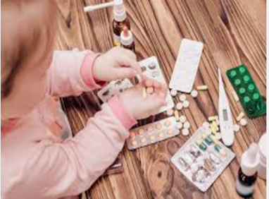

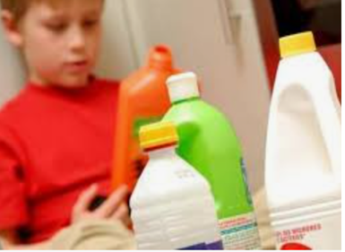


---

### Yaş Gruplarına Göre Dağılım

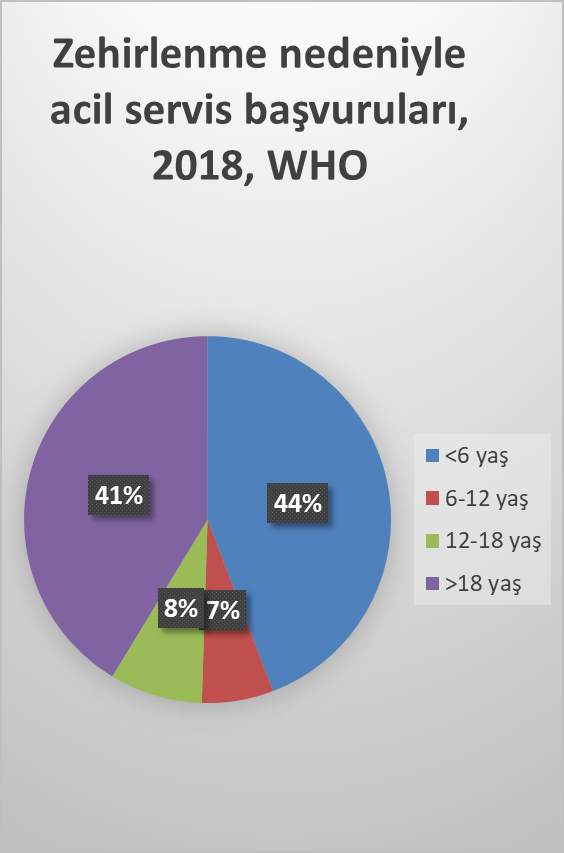

| Yaş Grubu     | Özellikler                                                                                                     |
| ------------- | -------------------------------------------------------------------------------------------------------------- |
| **<6 yaş**    | Erkeklerde daha sık, kaza sonucu, temizlik/kişisel bakım ürünleri, **%90 tedavi gerekmez**                     |
| **13-18 yaş** | Kızlarda daha sık, **%50 intihar girişimi**, %50 tedavi gerektirmez, ilaçlar; erkeklerde keyif verici maddeler |

---

### En Sık Zehirlenme Nedenleri

- **En sık oral yol** ile maruziyet (inhalasyon, oküler, topikal, parenteral izler)
- En sık zehirlenme nedeni: **İlaçlar**
- Ardından: temizlik ürünleri, kozmetik, kişisel bakım ürünleri, pestisidler, lokal preparatlar, zehirli bitkiler ve böcek ilaçları

**İlaçlar içerisinde en sık:**
- Parasetamol
- Ağrı kesiciler
- Öksürük ve soğuk algınlığı ilaçları
- Demir içeren ilaçlar
- Antihistaminikler
- Antidepresanlar

---

## HANGİ HASTALARDA ZEHİRLENME DÜŞÜNÜLMELİ?

- **Ani başlayan** belirti ve bulgular
- **Çoklu organ yetmezliği**
- **Bilinç değişikliği**
- **Kardiyopulmoner yetmezlik**
- **Açıklanamayan metabolik asidoz veya hipoglisemi**
- **Açıklanamayan konvülziyonlar**
- **Kafa karıştırıcı klinik bulgular**

---

## TEK DOZDA ÖLÜMCÜL OLABİLEN İLAÇLAR

> ⚠️ 10 kg'lık bir çocuk için tek tablet bile ölümcül olabilecek ilaçlar:

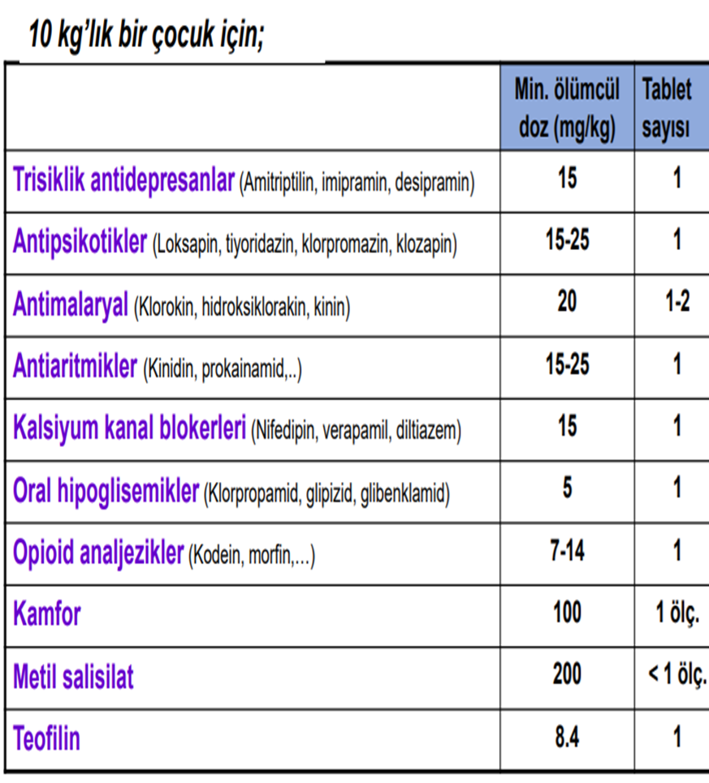

| İlaç Grubu                                                          | Min. Ölümcül Doz (mg/kg) | Tablet Sayısı |
| ------------------------------------------------------------------- | ------------------------ | :-----------: |
| **Trisiklik antidepresanlar** (Amitriptilin, imipramin, desipramin) | 15                       |       1       |
| **Antipsikotikler** (Loksapin, tiyoridazin, klorpromazin, klozapin) | 15-25                    |       1       |
| **Antimalaryal** (Klorokin, hidroksiklorakin, kinin)                | 20                       |      1-2      |
| **Antiaritmikler** (Kinidin, prokainamid)                           | 15-25                    |       1       |
| **Kalsiyum kanal blokerleri** (Nifedipin, verapamil, diltiazem)     | 15                       |       1       |
| **Oral hipoglisemikler** (Klorpropamid, glipizid, glibenklamid)     | 5                        |       1       |
| **Opioid analjezikler** (Kodein, morfin)                            | 7-14                     |       1       |
| **Kamfor**                                                          | 100                      |    1 ölç.     |
| **Metil salisilat**                                                 | 200                      |    <1 ölç.    |
| **Teofilin**                                                        | 8,4                      |       1       |

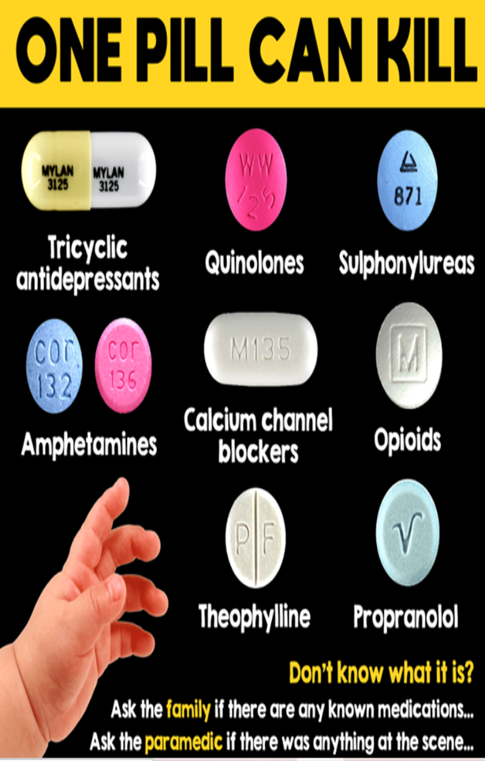

---

## TIBBİ ÖYKÜ VE FİZİK MUAYENE

### Tıbbi Öykü

- İlaç veya maddenin **içeriği, formu ve alınan miktarı**
- **Alım zamanı ve yolu**
- **Kasıtlı ya da kazara** maruz kalma
- Hastaneye gelene kadar **geçen süre**
- Ortaya çıkan **belirtiler**
- Başvuru öncesi **uygulanan işlemler**
- Etkenin **tek defada mı yoksa tekrarlayan dozlarda mı** alındığı

> ⚠️ Öykü yeterli veya tutarlı değilse → Fizik muayene bulguları ve toksidromlar yol göstericidir

### Fizik Muayene

- Öykü ve fizik muayene **eş zamanlı** yapılmalı
- **Vital bulgular** mutlaka değerlendirilmeli
- Fizik muayene **belirli aralıklarla tekrarlanmalı**
- Değerlendirilecekler: **Pupil boyutu, bilinç düzeyi, cilt, solunum, dolaşım, nöromusküler bulgular, karakteristik koku**
- **Toksidrom bulguları**
- Olası **travma ve çocuk istismarı** bulguları

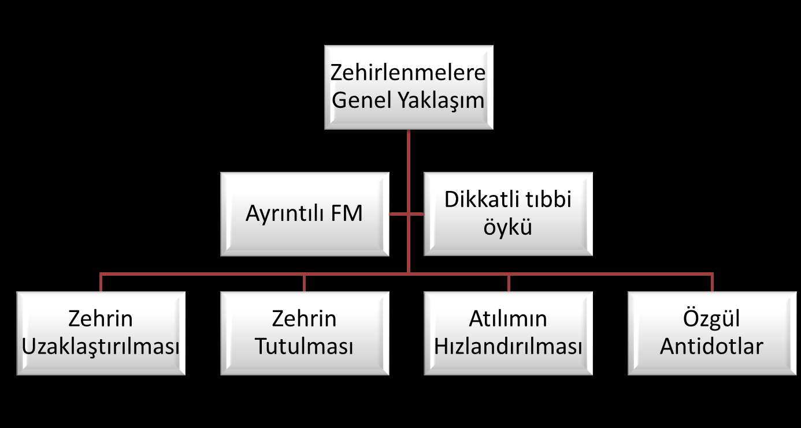

---

## TOKSİDROMLAR

> Bir madde ile maruziyet sonrası gözlemlenen bulgu ve semptomların kolleksiyonudur. Benzer, aynı grup ilaçların ortak bir klinik tablo oluşturmasıdır.

- Kesin klinik bulgular sayesinde **etiyolojik ajanın ayırıcı tanısı daraltılabilir**
- Zehirlenme öyküsü alınamayan hastalarda veya etkeni bilinmeyen zehirlenmelerde **tanıda yardımcı**
- Acil tanı ve tedavi için **yaşamı tehdit eden toksidromların bilinmesi gerekli**

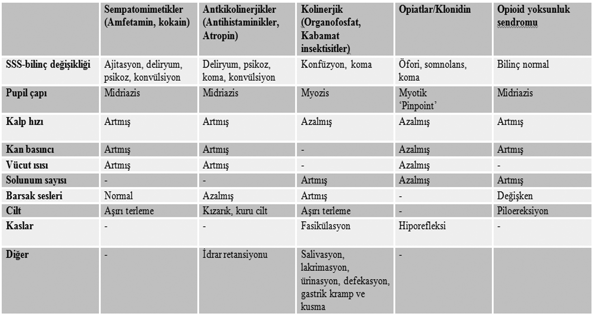

---

### Antikolinerjik Toksidrom

**Etkenler:**
- Antikolinerjikler (Atropin)
- Antihistaminikler
- Trisiklik antidepresanlar
- Antipsikotikler
- Antispazmotikler
- Antiparkinson ajanlar
- Bitki ve mantarlar

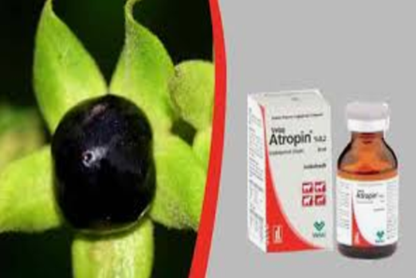

**Bulgular:**

| Bulgu       | Açıklama                                        |
| ----------- | ----------------------------------------------- |
| **SSS**     | Ajitasyon, koma, halüsinasyon, anlamsız konuşma |
| **Otonom**  | Hipertermi, flushing, midriazis                 |
| **Cilt**    | Deri ve mukozalar **kuru**                      |
| **KVS**     | Taşikardi, hipertansiyon                        |
| **Solunum** | Takipne                                         |
| **GİS**     | İleus                                           |
| **Üriner**  | Üriner retansiyon                               |

> 💡 **Hatırlatma:** "Tavşan gibi kırmızı, kemik gibi kuru, deli gibi çılgın, sıcak gibi ateşli" (*Red as a beet, dry as a bone, mad as a hatter, hot as a hare*)

---

### Sempatomimetik Toksidrom

**Etkenler:**
- Kokain
- Amfetamin ve türevleri
- Dekonjestanlar (Efedrin, psödoefedrin)
- Kafein
- Teofilin
- LSD (Liserjik Asid Dietilamid)

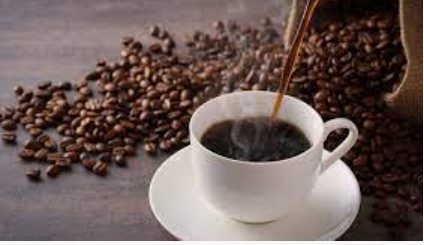

**Bulgular:**

| Bulgu            | Açıklama                         |
| ---------------- | -------------------------------- |
| **SSS**          | Ajitasyon, deliryum, psikoz      |
| **Otonom**       | Hipertermi, midriazis            |
| **Cilt**         | Deri ve mukozalar **terli**      |
| **KVS**          | Taşikardi, hipertansiyon, aritmi |
| **Solunum**      | Takipne                          |
| **Nöromusküler** | Titreme, hiperrefleksi, nöbet    |

**Tedavi:** Semptomatik destek tedavi

---

### Kolinerjik Toksidrom

**Etkenler:**
- Organofosfatlı insektisitler
- Karbamatlı insektisitler
- Kimyasal silahlar (Tabun, Sarin)
- Muskarin içeren mantarlar
- Kolin esterleri (Asetilkolin, metakolin)
- Kolinesteraz inhibitörleri (Fizostigmin, neostigmin)


**Muskarinik Bulgular (DUMBELS):**

| Bulgu | Açıklama                                  |
| ----- | ----------------------------------------- |
| **D** | Diare, diaforez (aşırı terleme)           |
| **U** | Ürinasyon                                 |
| **M** | Miyozis                                   |
| **B** | Bradikardi, bronş sekresyonunda artış     |
| **E** | Emezis (kusma)                            |
| **L** | Lakrimasyon                               |
| **S** | Salivasyon, aşırı halsizlik, hipotansiyon |

**Nikotinik Bulgular:**
- Midriazis
- Taşikardi
- Güçsüzlük
- Tremor
- Fasikülasyon
- Nöbet geçirme
- Uyku hali

**Tedavi:**
- **Atropin** (muskarinik bulgular için)
- **Pralidoksim (PAM)** (nikotinik bulgular için, kolinesteraz reaktivatörü)

---

### Opioid Toksidrom

**Etkenler:**
- Morfin
- Kodein
- Eroin
- Meperidin, Fentanyl, Tramadol
- Metadon
- Oksikodon

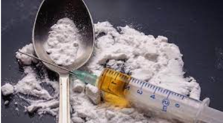

**Bulgular:**

| Bulgu           | Açıklama                                |
| --------------- | --------------------------------------- |
| **SSS**         | SSS depresyonu, koma                    |
| **Solunum**     | Solunum depresyonu                      |
| **Pupil**       | **Miyozis (pinpoint)** ← Karakteristik! |
| **KVS**         | Hipotansiyon, bradikardi                |
| **Vücut ısısı** | Hipotermi                               |
| **Refleksler**  | Hiporefleksi                            |
| **GİS**         | Barsak sesleri azalmış                  |

**Tedavi:** **Naloksan 0,01-0,1 mg/kg**

---

### Sedatif-Hipnotik Toksidrom

**Etkenler:**
- Benzodiazepinler
- Barbitüratlar
- Alkol
- SSS depresanları
- Kas gevşeticiler
- Anksiyolitik ilaçlar

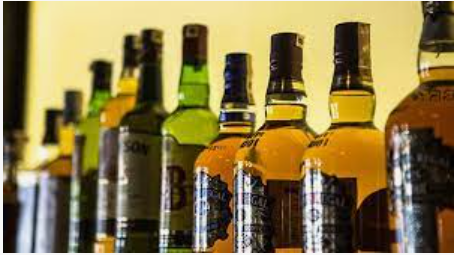

**Bulgular:**

| Bulgu           | Açıklama                                                  |
| --------------- | --------------------------------------------------------- |
| **SSS**         | SSS depresyonu, letarji, koma                             |
| **Nörolojik**   | Ataksi, konuşmada bozulma, konsantrasyon kaybı, nistagmus |
| **Vücut ısısı** | Hipotermi                                                 |
| **KVS**         | Bradikardi, hipotansiyon                                  |
| **Solunum**     | Solunum depresyonu                                        |
| **Pupil**       | Pupil çapı **değişken**                                   |

---

### Serotonin Sendromu

**Etkenler:**
- Selektif serotonin geri alım inhibitörleri (SSRI)
- Trisiklik antidepresanlar
- Monoamin oksidaz inhibitörleri

**Bulgular:**
- Değişken mental durum, SSS depresyonu
- Bulantı, kusma
- Baş dönmesi
- **Kas tonusunda artış**
- **Hiperrefleksi**
- Hipertermi
- Tremor
- Midriazis

---

## LABORATUVAR VE GÖRÜNTÜLEME

- **Glukoz**
- Arter kan gazı
- Elektrolitler
- Böbrek fonksiyon testleri
- Karaciğer fonksiyon testleri
- Tam idrar analizi
- **Kan-idrar toksikolojik tarama**
- **Serum ilaç düzeyi**
- **EKG**
- Direkt grafi

---

## TEDAVİ - GENEL YAKLAŞIM

Tedavi dört temel basamaktan oluşur:

```
         Zehirlenmiş Hasta
                ↓
    ┌───────────┼───────────┐
    ↓           ↓           ↓           ↓
 1. Destek   2. Dekon-   3. Gelişmiş  4. Antidot
  Tedavisi   taminasyon   Arındırma    Tedavisi
```

- Zehirlenmeye bağlı ciddi semptomların büyük bölümü **geri dönüşlü**
- Semptomları hızlı düzeltebilecek antidot sayısı **çok az**
- Prognozu belirleyen asıl faktör **destek tedavi**

### Destek Tedavisi

- **Havayolu yönetimi ve oksijenasyon**
- Elektrolit bozukluklarının ve metabolik sorunların düzeltilmesi
- **Kan basıncı kontrolü**
- Konvülziyonların ve ritim bozukluklarının tedavisi

> **«Toksin vücuttan atılana kadar yaşamsal işlevlerin desteklenmesi»**

---

## DEKONTAMİNASYON

| Tip                                  | Uygulama                                                                                                                                                      |
| ------------------------------------ | ------------------------------------------------------------------------------------------------------------------------------------------------------------- |
| **Cilt dekontaminasyonu**            | Kontamine giysi çıkartılır, etkilenen cilt bölgesi bol su ve sabunla yıkanır; vazelin ve alkol gibi maddeler suyla temizlenmeyen maddelerde tercih edilebilir |
| **Oküler dekontaminasyon**           | Göz bol su, serum fizyolojik (SF) veya ringer laktatla yıkanmalı                                                                                              |
| **Respiratuar dekontaminasyon**      | Hasta ortamdan uzaklaştırılarak **%100 konsantrasyonda oksijen** verilmeli                                                                                    |
| **Gastrointestinal dekontaminasyon** | Gastrik lavaj, aktif kömür, tüm barsak temizliği, endoskopik/cerrahi uygulamalar                                                                              |

### GİS Dekontaminasyonu Karar Algoritması

```
         Alınan madde TOKSİK Mİ?
                  ↓
          GİS Dekontaminasyonu
          ↙                ↘
İşlemin riski          İşlem faydalı
   var mı?              olacak mı?
```

---

### Mide Lavajı

- **Rutin kullanımı önerilmemektedir**
- Ancak aşağıdaki durumlarda kullanılabilir:
  - Zehirlenme etkeni **yaşamı tehdit edecek miktarda** alınmışsa
  - **Güçlü toksik etkiye** sahipse
  - **Erken dönemde** başvurduysa (1-2 saat içinde)
  - **Aktif kömüre bağlanmayan** bir madde alındıysa

> Antikolinerjikler ve opioid gibi **mide boşalmasını geciktiren** ya da enterik kaplı, yavaş salınan ilaçlarla olan zehirlenmelerde **2-4 saate kadar** uygulanabilir

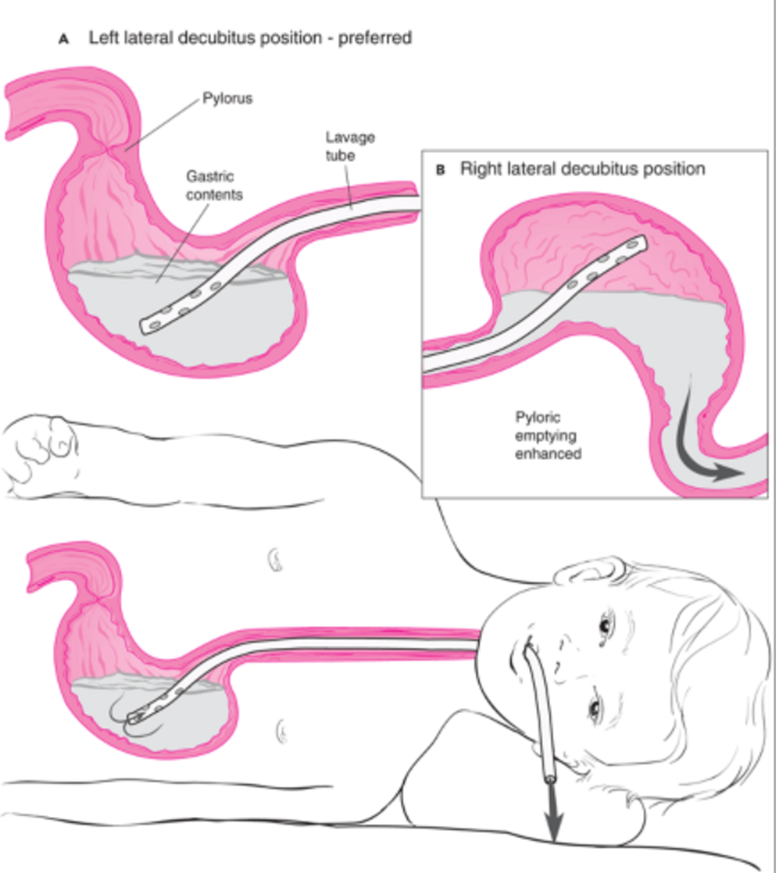

#### Uygulama Şekli

1. İşlem öncesi **havayolu güvenliği** sağlanmalı
2. Hasta **sol lateral dekübit pozisyonunda**, baş **15-20° aşağıda** tutularak
3. Küçük çocukta **16-28F**, adölesanda **36F** çaplı orogastrik tüp ile
4. **10-15 mL/kg** (en fazla 250 mL) **%0,09 veya %0,045 SF** ile uygulanır
5. Herhangi bir sıvı vermeden **ilk mide içeriği aspire** edilir
6. İşleme **berrak sıvı gelinceye kadar** devam edilir

#### Kontraendikasyonlar

- Havayolu koruyucu refleksleri olmayan ya da kaybolma ihtimali olan hastalar
- **Hidrokarbonlar** gibi uçucu özellikteki maddeler ile olan zehirlenmeler (tiner, gaz yağı, benzin)
- **Kostik-koroziv** madde alımı
- Gastrointestinal **kanama ya da perforasyon** riski olan hastalar

#### Komplikasyonlar

- Laringospazm
- Pnömotoraks
- Aspirasyon pnömonisi
- Hipoksi – hiperkapni
- Perforasyon, kanama
- Sıvı ve elektrolit bozukluğu (hipernatremi, hiponatremi)
- Konjunktival kanama
- Aritmi (neden aritmi yapar: vagus uyarısı ile)
- Kardiyak arrest

---

## AKTİF KÖMÜR

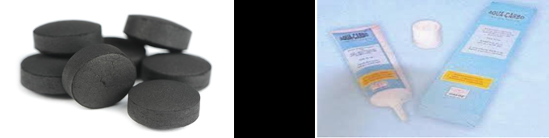

- Linyit, odun, petrol veya hindistan cevizi kabuğunun **500-900°C**'de ısıtılması ile oluşur
- İntestinal mukozayı **diyaliz membranı** gibi kullanarak toksinleri kandan bağırsak mukozasına çeker ve bağlar
- Küçük partikül büyüklüğü ve geniş yüzey alanı (1 gramı yaklaşık **950 m²** alan kaplar)
- Toksinleri **adsorbe ederek** enterohepatik sirkülasyonunu engeller
- Toksin midede ise aktif kömür **en etkili**
- Genellikle alımdan sonraki **ilk 1-2 saat** içinde verildiğinde çok etkili

### Dozlama

| Yaş                     | Doz                        |
| ----------------------- | -------------------------- |
| **<1 yaş**              | 0,5-1 g/kg veya 10-25 g    |
| **1-12 yaş**            | 0,5-1 g/kg (maksimum 50 g) |
| **Ergen ve erişkinler** | 25-100 g                   |

> İdeal oran: **Aktif Kömür / Toksin = 10 / 1**

### Kontraendikasyonlar

- Hava yolu bütünlüğünün sağlanamadığı durumlar
- **Hidrokarbon** zehirlenmeleri
- **Koroziv** alımlar
- İleus / perforasyon / kanama riski
- Endoskopi yapılacak ise
- İntestinal obstrüksiyon
- **Aktif kömüre bağlanamayan** bir madde ile zehirlenme

**Aktif kömüre bağlanmayan maddeler:**
- Ağır metaller (Fe, Zn, Cd)
- İnorganik anyonlar (Na, Li, Ca, K)
- Hidrokarbonlar
- Alkoller
- Uçucu yağlar
- Siyanid
- Solvent
- Pestisid

### Komplikasyonlar

- Aspirasyon
- Gastrointestinal yan etkiler (kusma, konstipasyon, ileus, perforasyon)
- Pnömotoraks

### Tekrarlayan Doz Aktif Kömür

**Endikasyonlar:**
- Gastrointestinal motiliteyi yavaşlatan ilaç alımı
- Yavaş salınan / yavaş emilen ilaç
- Enterohepatik veya enteroenterik siklusa katılan toksinlerle olan zehirlenmeler

**Doz:** 0,25-0,5 g/kg/doz, **1-4 saatte bir** uygulanabilir

**Tekrarlayan doz aktif kömür ile tedavi edilen ilaçlar:**
antikolinerjikler, karbamazepin, fenobarbital, fenitoin, teofilin, digoksin, kolşisin, salisilat

---

## TÜM BARSAK İRRİGASYONU

**Polietilen glikol elektrolit solüsyonu** (Golytely) ile yapılır.

**Amaç:** Gaitayı sıvı hale getirip, hap, ilaç paketi gibi maddelerin basınçla barsaktan atılımını sağlamak

### Endikasyonlar

1. Uzamış sekresyonu olan veya **enterik kaplı ilaç** zehirlenmelerinde
2. Aktif kömürün adsorbe edemediği ciddi zehirler (**demir içeren tablet, kurşun içeren yabancı cisim**)
3. Uyuşturucu madde içeren paket

### Dozlama

| Yaş                  | Doz               |
| -------------------- | ----------------- |
| **9 ay - 6 yaş**     | 500 mL/saat       |
| **6-12 yaş**         | 1000 mL/saat      |
| **Ergen ve erişkin** | 1500-2000 mL/saat |

**Uygulama yolu:** Oral veya nazogastrik (NG)

### Kontraendikasyonlar

- İleus, barsak tıkanıklığı, barsak perforasyonu
- Ciddi GİS kanaması
- Hemodinamik dengesizlik
- Dirençli kusma

---

### Endoskopi / Cerrahi

- Letal dozda ağır metal maruziyeti
- Farmakobezoar oluşumu
- Büyük uyuşturucu paket yutulması (cerrahi)

---

## GELİŞMİŞ ARINDIRMA

> Ciddi toksisite belirtileri olan ve yavaş eliminasyon hızına sahip toksik madde zehirlenmelerinde; zehirlenme şiddet ve süresini azaltmak amacıyla toksik maddelerin atılma oranını artıran yöntemlerdir. **Rutin bir uygulama değildir.**

- Tekrarlayan doz aktif kömür uygulaması
- **İdrar alkalinizasyonu**
- **Hemodiyaliz, hemoperfüzyon**
- **Lipit emülsiyon tedavisi**
- Plazmaferez
- **ECMO**

---

## ANTİDOTLAR

| Zehirlenme Etkeni                                       | Antidot                    |
| ------------------------------------------------------- | -------------------------- |
| Kolinesteraz inhibitörleri, muskarinik mantarlar        | **Atropin**                |
| Kalsiyum kanal blokeri, beta agonistler, hiperkalemi    | **Kalsiyum glukonat**      |
| Stimülanlar, sedatif hipnotik geri çekilme sendromu     | **Diazepam, midazolam**    |
| Benzodiazepinler                                        | **Flumazenil**             |
| Beta bloker, kalsiyum kanal blokerleri                  | **Glukagon**               |
| **Parasetamol**                                         | **N-asetil sistein (NAC)** |
| **Opiyat**                                              | **Naloksan**               |
| Sedatif hipnotik ve stimülan çekilmesi                  | **Fenobarbital**           |
| Heparin                                                 | **Protamin sülfat**        |
| Trisiklik AD, salisilat, metanol, fenobarbital, kinidin | **NaHCO₃**                 |
| **Karbonmonoksit**                                      | **Oksijen**                |
| Coumadin, fare zehiri                                   | **Vitamin K**              |

---

## TAKİP VE EVRAK İŞLERİ

### Takip

- Zehirlenme ile başvuran **tüm çocuk hastalar gözlem altına** alınmalı
- Toksik maddenin düzeyine, etki süresine, akut veya kronik toksisite durumuna, başka maddeler ile birlikte alınıp alınmadığına ve klinik bulguların şiddetine göre gözlem sürecine karar verilmeli
- Gözlem süresince **6-12 saatte hiçbir bulgu görülmemişse** taburcu edilebilir
- **İntihar amaçlı** zehirlenmelerde **psikiyatrik değerlendirme** yapılmalı
- Çocuk ihmali veya istismarı düşünülüyor ise **sosyal hizmet** görüşü alınmalı ve adli süreç başlatılmalı

### Evrak İşleri

| Kazara Zehirlenme                                                      | Özkıyım                            |
| ---------------------------------------------------------------------- | ---------------------------------- |
| Adli rapor                                                             | Adli rapor                         |
| İhmal varsa / tekrarlanan kazalar varsa sosyal hizmetler konsültasyonu | Sosyal hizmetler konsültasyonu     |
| Kazara zehirlenme formu                                                | Özkıyım ile zehirlenme formu       |
| Aileyi zehirlenmelerden korunma konusunda bilgilendir                  | **Çocuk psikiyatri konsültasyonu** |

---

## PARASETAMOL ZEHİRLENMESİ

### Toksik Doz

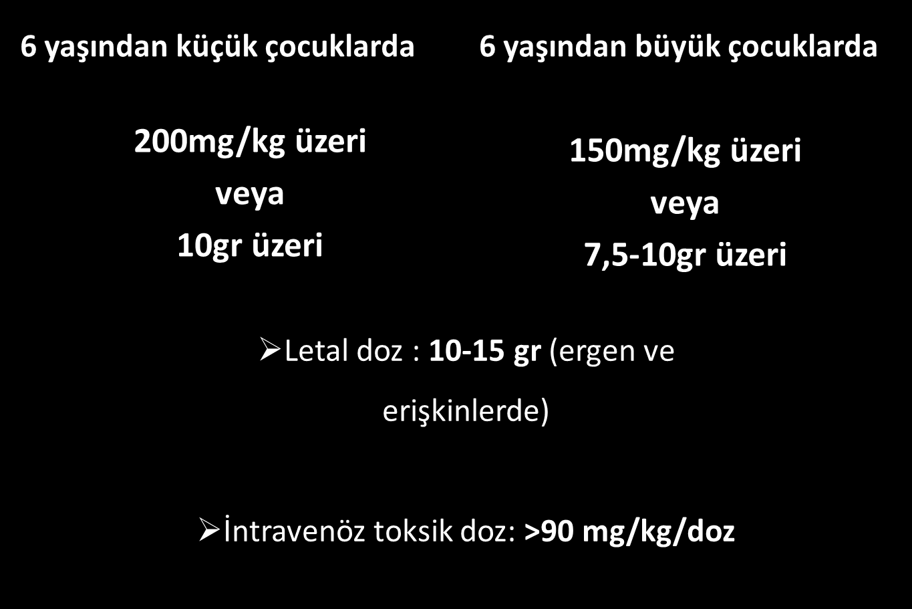

| Yaş Grubu  | Toksik Doz                                  |
| ---------- | ------------------------------------------- |
| **<6 yaş** | **200 mg/kg üzeri** veya **10 g üzeri**     |
| **≥6 yaş** | **150 mg/kg üzeri** veya **7,5-10 g üzeri** |

- **Letal doz:** 10-15 g (ergen ve erişkinlerde)
- **İntravenöz toksik doz:** >90 mg/kg/doz

#### Tekrarlanan Supraterapötik Alım

- 48 saat boyunca 24 saatlik sürede **150 mg/kg veya 6 g**
- <6 yaş çocuklarda önceki 72 saat veya daha uzun sürede 24 saatlik dönemde **100 mg/kg** veya daha fazla
- 24 saatlik periyotta 100 mg/kg veya 4 g (açlık, karaciğer hastalığı durumunda)
- ≤24 saat → Günde **200 mg/kg** veya >10 g
- 24-48 saat → Günde **150 mg/kg** veya >6 g
- \>48 saat → Günde **100 mg/kg** veya >4 g

---

### Parasetamol Metabolizması

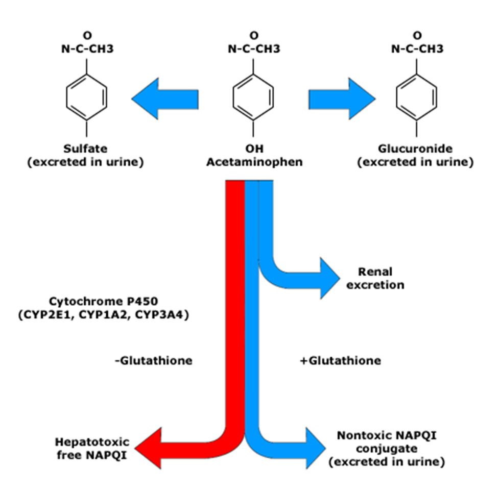

> Parasetamol normalde sülfat ve glukuronid konjugasyonu ile atılır. Doz aşımında bu yollar doygunluğa ulaşır ve **Sitokrom P450** (CYP2E1, CYP1A2, CYP3A4) üzerinden toksik metabolit **NAPQI** oluşur. Glutatyon yeterli ise NAPQI nontoksik konjugata dönüşür. Glutatyon tükenirse → **Hepatotoksik serbest NAPQI** birikir → Karaciğer hasarı!

---

### Klinik Bulgular

Parasetamol zehirlenmesinin **4 fazı** vardır:

| Faz        | Süre        | Bulgular                                                                                                                        |
| ---------- | ----------- | ------------------------------------------------------------------------------------------------------------------------------- |
| **1. Faz** | İlk 24 saat | Asemptomatik, bulantı, kusma, terleme, iştahsızlık                                                                              |
| **2. Faz** | 24-72 saat  | **Sessiz evre**, sağ üst kadran ağrısı ve hassasiyet, hepatotoksisite, nefrotoksisite, pankreatit                               |
| **3. Faz** | 3-4. gün    | **Fulminan KC yetmezliği** (kanama, koma, ensefalopati), böbrek yetmezliği, çoğul organ yetmezliği, **ölüm bu dönemde görülür** |
| **4. Faz** | 4-14. gün   | **İyileşme dönemi**, yaşayanlarda iyileşme 4. gün başlar, laboratuvar 7. günde düzelir. Tam hepatik rejenerasyon görülür        |

**KC transplantasyonu endikasyonları:**
- İlerleyici ensefalopati
- Hiperamonyemi
- Kanama-pıhtılaşma bozuklukları
- Böbrek yetmezliği

---

### Rumack-Matthew Nomogramı

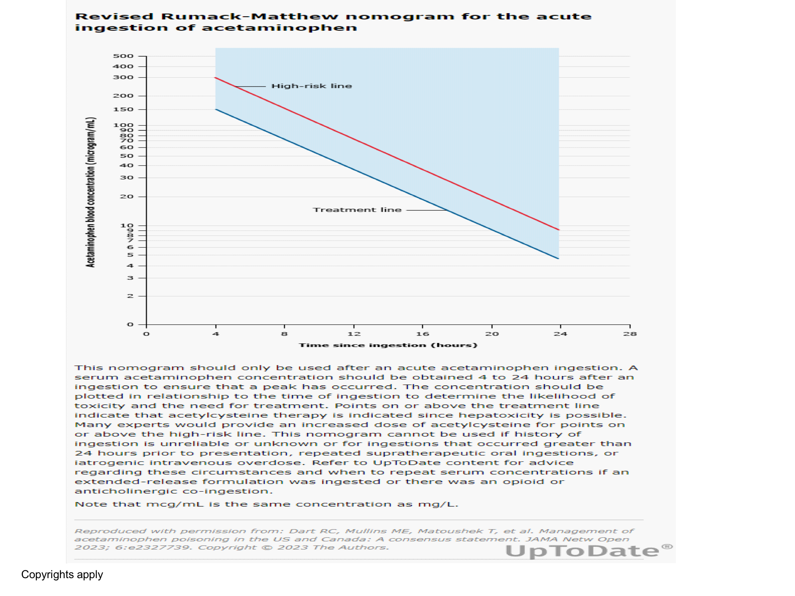

- Akut alım sonrası **4. saatte** kan parasetamol düzeyi bakılmalı ve nomogram üzerinde işaretlenmeli
- Kronik maruziyetlerde, alımın üzerinden 24 saat geçmişse ve yavaş salınımlı tablet alındıysa **nomogram ile değerlendirme yapılmaz**

---

### Tedavi

1. **Gastrik lavaj ve aktif kömür**
2. **N-asetil sistein (NAC)**
3. Hemodiyaliz
4. Karaciğer transplantasyonu

#### NAC Endikasyonları (bu slayt önemli!!!)

- **150 mg/kg'ın üzerinde** alımlarda ilk 8 saat içerisinde parasetamol düzeyi bakılamayacaksa
- 24 saatten uzun olmak üzere alım zamanı bilinmiyor ve parasetamol düzeyi **>10 mg/L** ise **(bu da önemli)**
- Rumack-Matthew nomogramına göre parasetamol düzeyi **tedavi sınırının üzerinde** ise
- Alımın üzerinden 24 saatten uzun süre geçmiş ve **hepatotoksisite bulguları** varsa

> ⚠️ **Alımdan sonraki ilk 8 saatte verilirse en etkilidir!!!**

#### NAC Protokolü (elinizde olsun ama ezberlemeyin)

|                 | Oral                                                                                               | İV                                                                      |
| --------------- | -------------------------------------------------------------------------------------------------- | ----------------------------------------------------------------------- |
| **Yükleme**     | 140 mg/kg                                                                                          | 150 mg/kg (maks 15 g)                                                   |
| **İdame**       | 70 mg/kg/doz, 4 saatte bir (17 doz)                                                                | 50 mg/kg (maks 5 g) → 4 saat sonra <br> 100 mg/kg (maks 10 g) → 16 saat |
| **Toplam süre** | 72 saat                                                                                            | **21 saat**                                                             |
| **Notlar**      | Alım sonrası 1 saat içinde kusma olursa doz tekrarlanır. Aktif kömür ile arasında 1-2 saat olmalßı | 40 mg/mL derişimde, SF veya %5 Dx içinde                                |

#### NAC Tedavi Sonlandırma Kriterleri

Aşağıdaki kriterlerin **tümü** karşılanmalıdır:

- Serum asetaminofen konsantrasyonu **<10 mcg/mL** (66 mikromol/L)
- **INR <2,0**
- ALT ve AST normal veya **%25-50 oranında düşmüş**
- Hasta klinik olarak iyi durumda (bulantı/kusma yok, karın ağrısı yok)

> Kriterlerin tümü karşılanmıyorsa: En az **6,25 mg/kg/saat İV** veya oral **4 saatte bir 70 mg/kg** olarak tedavi devam etmeli. Her **12 saatte bir** hasta yeniden değerlendirilmeli.

---

## DEMİR ZEHİRLENMESİ

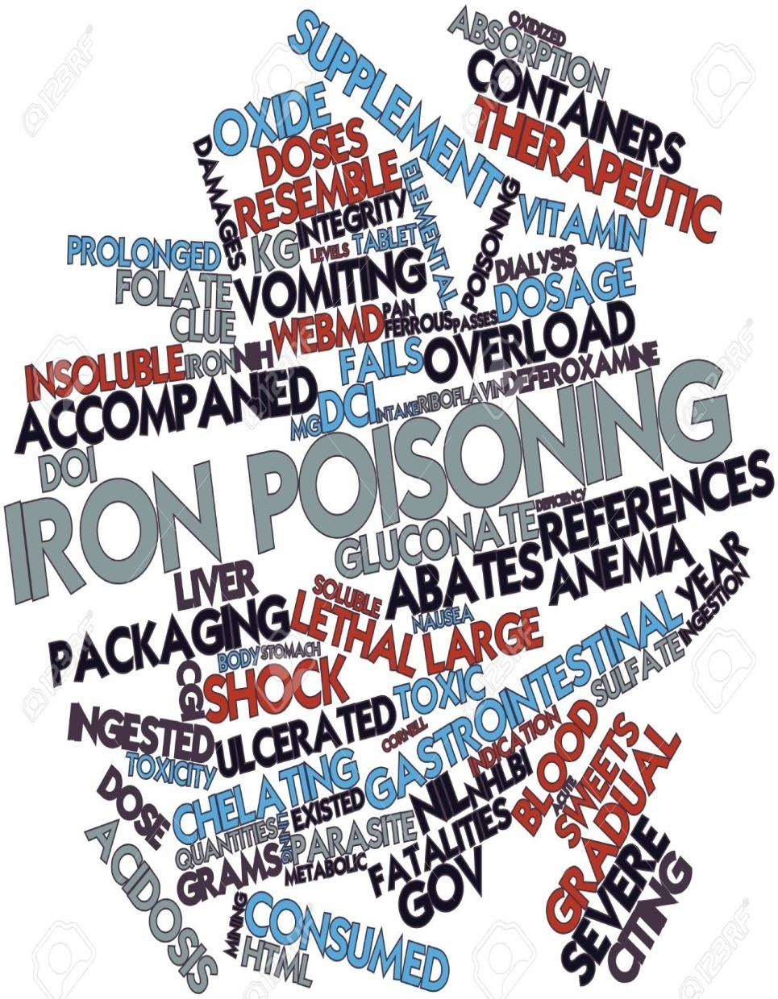

### Patofizyoloji

- Vücuttaki demirin çoğu **hemoglobine** bağlanır, geri kalanı **ferritin** olarak depolanır
- Dolaşımdaki demir **transferrine** bağlıdır
- **Serbest demir toksiktir** ve normalde vücutta serbest dolaşmaz
- Doz aşımında serbest demir hücresel savunma mekanizmalarını aşar → **yaygın hücresel hasar**

**Serbest demirin toksisite mekanizmaları:**

- Serbest radikaller gibi oksidanların üretimi için **katalizör** görevi görür
- **Mitokondriyal toksin** gibi davranarak oksidatif fosforilasyonu inhibe eder
- Elektron transport zincirini bozar → **Hipotansiyon**
- GİS'den emildiğinde hidrojen iyonları açığa çıkarak **metabolik asidoz**a neden olur
- **Negatif inotrop ve vazodilatör** etkiyle kardiyovasküler kollapsa neden olur

**Serbest oksijen radikallerinin etkileri:**
- Mukozal hücre nekrozu
- Kapiller geçirgenlikte bozulma
- Mitokondri lipid membranında bozukluk
- Krebs döngüsü enzimlerinde inhibisyon

**Lipid peroksidasyonunun etkileri:**
- Oksidatif fosforilasyonda bozulma
- Direkt etki ile vazodilatasyon
- Serum proteazlarında inhibisyon (ör. trombin)

---

### Toksik Doz

| Elementer Demir Dozu | Klinik                  |
| -------------------- | ----------------------- |
| **<20 mg/kg**        | Asemptomatik            |
| **20-40 mg/kg**      | Hafif GİS bulguları     |
| **40-60 mg/kg**      | Orta şiddette toksisite |
| **>60 mg/kg**        | Ciddi toksisite         |
| **>100 mg/kg**       | **Letal doz**           |

> Bizim için önemli olan **60 mg/kg** üzeri.
---

### Klinik Evreler

| Evre                  | Süre            | Bulgular                                                                                                                      |
| --------------------- | --------------- | ----------------------------------------------------------------------------------------------------------------------------- |
| **GİS evresi**        | İlk birkaç saat | Gİ doku üzerindeki koroziv etkiler → karın ağrısı, kusma, ishal. Ciddi alımlarda hemorajik nekroz, GİS perforasyonu ve kanama |
| **Sessiz evre**       | 6-24 saat       | GİS semptomları iyileşmesine rağmen metabolik asidoz ve hipovolemi ortaya çıkar                                               |
| **Sistemik evre**     | >24 saat        | Koma, şok, dirençli asidoz, koagülopati, kanama ve muhtemelen **ölüm**                                                        |
| **Hepatotoksik evre** | 2-5. gün        | Akut karaciğer yetmezliği, potansiyel fulminan KC yetmezliği                                                                  |
| **İyileşme evresi**   | 4-6 hafta       | GİS yapışıklıklar ve obstrüksiyon ile sonuçlanabilir                                                                          |

---

### Serum Demir Düzeyi

- Alımdan sonraki **4-6. saatte** bakılmalı
- Yavaş salınan tabletlerde alımdan sonraki **8. saatte** bakılmalı

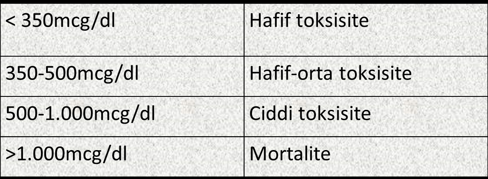

| Serum Demir Düzeyi  | Toksisite            |
| ------------------- | -------------------- |
| **<350 mcg/dL**     | Hafif toksisite      |
| **350-500 mcg/dL**  | Hafif-orta toksisite |
| **500-1000 mcg/dL** | Ciddi toksisite      |
| **>1000 mcg/dL**    | Mortalite            |

---

### Direkt Grafi

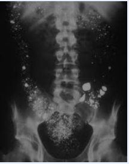

**40 mg/kg'ın üzerinde** elementer demir alımı veya belirgin klinik bulgusu olan hastalarda direkt grafi çekilmelidir.
> desferoksamin başla. (şelasyon tedavisi)
---

### Tedavi

1. **Destek tedavisi**
2. **Gastrik lavaj**
3. **Total barsak irrigasyonu**
4. **Desferoksamin** (şelasyon tedavisi)
5. Exchange transfüzyon
6. Continuous veno-venöz hemofiltrasyon

> ⚠️ Demir **aktif kömüre bağlanmaz!!!**

#### Desferoksamin Endikasyonları

- Ciddi klinik bulgular (**hipovolemik şok, bilinç bozukluğu, koma, inatçı kusma ve ishal**)
- **Yüksek anyon gap'li metabolik asidoz**
- Serum demir konsantrasyonu **>500 mcg/dL**
- Direkt grafide **demir tabletleri görülmesi**
- Tahmini alınan doz **>60 mg/kg**

#### Desferoksamin Dozu

- İntravenöz olarak **15 mg/kg/saat** infüzyon hızıyla **6 saatte** verilir
- Ciddi zehirlenmelerde **24 saatlik** infüzyon gerekebilir
- İlk 24 saatte doz **35 mg/kg/saat**'e kadar artırılabilir
- **Maksimum günlük doz: 6 g**

#### Desferoksamin Kesme Kriterleri

Aşağıdakiler sağlanırsa kesilebilir:
- Serum demir düzeyi **<350 mcg/dL**
- İdrar rengi **normal**
- Metabolik asidoz **yok**

**Yan etkiler:** Hipotansiyon, ARDS

---

## KARBONMONOKSİT İNTOKSİKASYONU

### Patofizyoloji

- CO, karbon içeren yakıtların **tam olmayan yanması** ile ortaya çıkan **kokusuz** bir gazdır
- CO hemoglobine oksijenden **200 kat daha yüksek afinite** ile bağlanarak Hb'nin oksijen taşıma kapasitesini bozar
- CO, **oksihemoglobin ayrışma eğrisinde sola kayma**ya neden olur → Hb'den dokulara oksijen sunumu azalır
- CO ayrıca **sitokrom oksidaza** bağlanarak hücresel solunumu inhibe eder

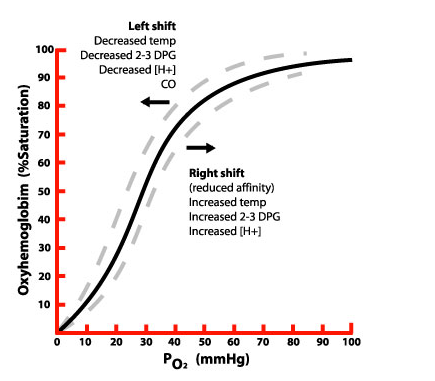

---

### Etiyoloji

- Ev yangınlarında çıkan **duman inhalasyonu**
- Otomobil veya bot egzozu
- Gazla çalışan **elektrik jeneratörleri**
- Petrol, benzin veya gazyağı ile çalışan **soba veya ocaklar**
- Bozuk ev fırınları

---

### Öykü

- CO maruziyetinin erken dönem belirtileri özgün değildir, **nezle benzeri hastalıkları taklit edebilir**
- **Aile üyelerinin sağlık durumu** sorgulanmalı (CO genelde birçok aile üyesini aynı anda hasta eder)

---

### Klinik Bulgular

| Hafif CO Zehirlenmesi | Orta/Ağır CO Zehirlenmesi |
| --------------------- | ------------------------- |
| Halsizlik             | Konfüzyon                 |
| Bulantı               | Senkop                    |
| Sersemlik             | Güçsüzlük                 |
| Baş ağrısı            | Anjina                    |
| Kusma                 |                           |

- Fizik muayenede **nazal mukozada kurum** olması → duman inhalasyonu yaralanmasını destekler
- Toksisitede **hipotansiyon ve taşikardi** sık görülür
- Hipoksi nedeniyle cilt, cilt altı ve kas dokusu travmaya duyarlı hale gelir

> ⚠️ **Karboksihemoglobin düzeyi ile klinik bulgular ve prognoz arasında ilişki yoktur. Önemli olan maruziyet süresidir!**

> ⚠️ **Pulse oksimetrede oksijen satürasyonu çoğunlukla normaldir!** (CO-Hb, oksimetre tarafından oksihemoglobin gibi algılanır)

---

### Karboksihemoglobin (COHb) Düzeyleri

| Değer        | Yorum                                 |
| ------------ | ------------------------------------- |
| **%0,5-1,5** | Normal aralık                         |
| **%3-7**     | Yenidoğan                             |
| **%4-9**     | Sigara içenler                        |
| **>%10**     | **Zehirlenme bulguları ortaya çıkar** |

---

### Laboratuvar

- Kan gazı
- Tam kan sayımı
- Kan şekeri
- BFT (Böbrek fonksiyon testleri)
- **CK, CK-MB, Troponin** (kardiyak hasar değerlendirmesi)
- TİT (Tam idrar tahlili)
- **EKG**

---

### Tedavi

- **Geri solumasız maske ile %100 oksijen**
- En az **4-6 saat** ya da COHb düzeyi **<%5** olana kadar oksijen tedavisi verilmeli
- Hb <10 g/dL ise **transfüzyon**
- İdrar çıkışının **1 mL/kg/saat** üzerinde tutulması

#### Hiperbarik Oksijen Tedavisi Endikasyonları

Aşağıdaki durumlarda **hiperbarik oksijen tedavisi düşünülmeli:**
- CO düzeyi **>%25**
- **Bilinç kaybı**
- Şiddetli **metabolik asidoz**
- Son organ iskemisine ait kanıtlar (EKG değişiklikleri, yükselmiş kardiyak biyobelirteçler, solunum yetmezliği, fokal nörolojik defisit veya değişmiş zihinsel durum)

**Hiperbarik oksijen yan etkileri:**
- Timpanik zar yırtılması
- Pnömotoraks
- Hipotansiyon
- Ritim bozuklukları
- Nöbet
- Oksijen toksisitesi

**Kontraendikasyonlar:**
- Hemodinamik instabilite
- Amfizem
- Kronik bronşit
- Uzamış KPR

---

## ÖZET VE ÖNEMLİ NOKTALAR

### Altın Kurallar

1. Zehirlenmeye bağlı ciddi semptomların büyük bölümü **reversibldir**
2. Bu hastaların önce **ABC ile stabilizasyonu** sağlanmalı
3. Yakın takip ve **destek tedavi**, antidot ile tedaviden çok daha fazla oranda prognozu iyileştirir
4. **Hastaların iyi görünmesi aldatıcı olabilir!**
5. Zehirlenme bulguları olmayan hastalar en az **4-6 saat** yakından takip edilmeli

---

### Klinik Pearls

| Konu                                   | Pearl                                           |
| -------------------------------------- | ----------------------------------------------- |
| **En sık zehirlenme yolu**             | Oral                                            |
| **En sık zehirlenme nedeni**           | İlaçlar                                         |
| **<6 yaş**                             | Erkek > Kız, kazara, %90 tedavi gerekmez        |
| **13-18 yaş**                          | Kız > Erkek, %50 intihar girişimi               |
| **Prognozu belirleyen**                | Destek tedavi                                   |
| **Parasetamol antidotu**               | N-asetil sistein (NAC) - ilk 8 saatte en etkili |
| **Opioid antidotu**                    | Naloksan                                        |
| **CO zehirlenmesi tedavisi**           | %100 O₂, hiperbarik O₂                          |
| **Demir antidotu**                     | Desferoksamin                                   |
| **Demir ve aktif kömür**               | Aktif kömüre bağlanmaz!                         |
| **Kolinerjik toksidrom tedavisi**      | Atropin + Pralidoksim                           |
| **Antikolinerjik toksidromda pupil**   | Midriazis                                       |
| **Opioid toksidromda pupil**           | Miyozis (pinpoint)                              |
| **CO zehirlenmesinde pulse oksimetre** | Yanıltıcı - normal gösterir!                    |

---

### Toksidrom Ayırıcı Tanı Özeti

| Bulgu              |     Antikolinerjik      |   Sempatomimetik    |   Kolinerjik   |         Opioid         | Sedatif-Hipnotik |
| ------------------ | :---------------------: | :-----------------: | :------------: | :--------------------: | :--------------: |
| **SSS**            | Ajitasyon, halüsinasyon | Ajitasyon, deliryum |   Konfüzyon    |    Depresyon, koma     | Depresyon, koma  |
| **Pupil**          |        Midriazis        |      Midriazis      |    Miyozis     | **Miyozis (pinpoint)** |     Değişken     |
| **Kalp hızı**      |            ↑            |          ↑          |       ↓        |           ↓            |        ↓         |
| **Kan basıncı**    |            ↑            |          ↑          |       ↓        |           ↓            |        ↓         |
| **Vücut ısısı**    |            ↑            |          ↑          |       -        |           ↓            |        ↓         |
| **Cilt**           |      Kuru, kızarık      |        Terli        | Terli, salgı ↑ |           -            |        -         |
| **Barsak sesleri** |
