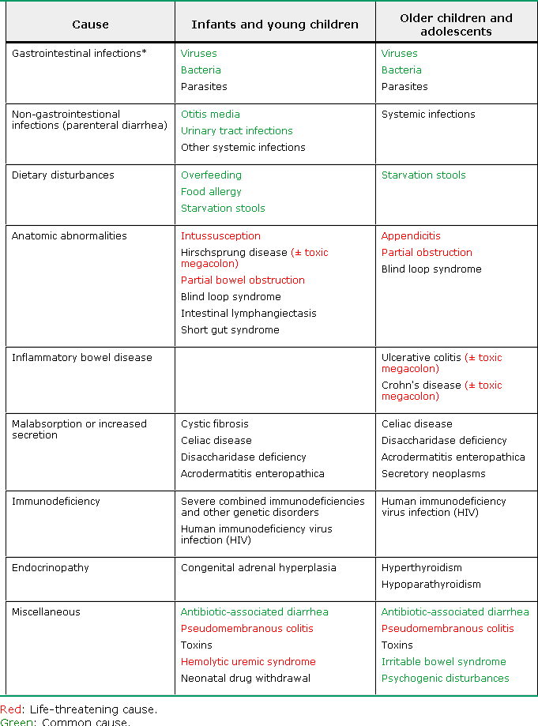
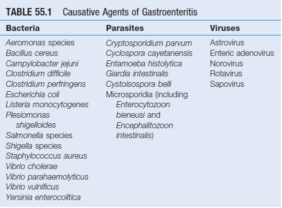
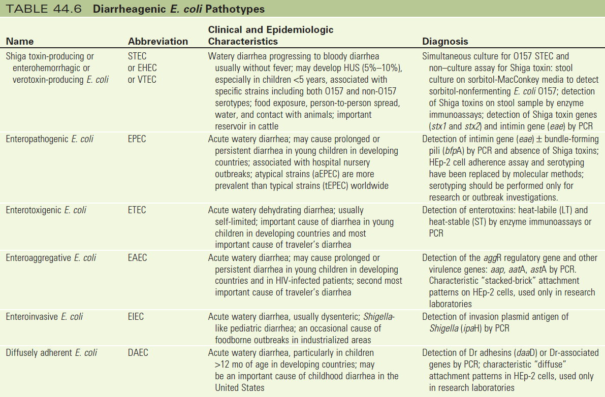
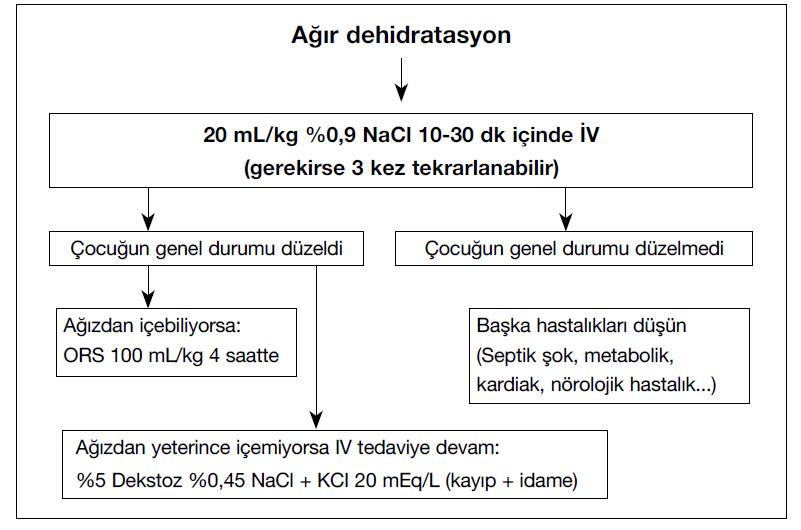

# ÇOCUKLARDA AKUT GASTROENTERİT VE DEHİDRATASYON

**Hazırlayan:** Doç. Dr. İlknur Çağlar
**Bölüm:** Aydın Adnan Menderes Tıp Fakültesi, Çocuk Enfeksiyon Hastalıkları Bilim Dalı

---

## İÇİNDEKİLER

1. [İshal Tanımı ve Sınıflandırma](#i̇shal-tanımı-ve-sınıflandırma)
2. [Risk Faktörleri](#risk-faktörleri)
3. [Klinik İpuçları](#klinik-i̇puçları)
4. [Viral Etkenler](#viral-etkenler)
5. [Bakteriyel Etkenler](#bakteriyel-etkenler)
6. [Paraziter Etkenler](#paraziter-etkenler)
7. [Hastanın Değerlendirilmesi ve Tanı](#hastanın-değerlendirilmesi-ve-tanı)
8. [Dehidratasyon Değerlendirmesi](#dehidratasyon-değerlendirmesi)
9. [Sıvı Tedavisi](#sıvı-tedavisi)
10. [Beslenme](#beslenme)
11. [Antibiyotik Tedavisi](#antibiyotik-tedavisi)
12. [İlave Tedaviler](#i̇lave-tedaviler)
13. [Yatış, Sevk ve Taburculuk](#yatış-sevk-ve-taburculuk)
14. [Önleme](#önleme)

---

## İSHAL TANIMI VE SINIFLANDIRMA

### Tanım

> **İshal:** 24 saat içinde ≥3 kez cıvık/su gibi dışkılama

| Yaş Grubu | Miktar Kriteri |
|---|---|
| Bebek ve küçük çocuk (<10 kg) | >20 g/kg/gün |
| Büyük çocuk ve genç | >250 g/gün |

💡 Anne sütü alan bebeklerde her beslenme sonrası dışkılama **normaldir!**

### Sınıflandırma

**Süreye göre:**

| Tip | Süre |
|---|---|
| **Akut** | Genelde <7 gün |
| **Uzamış** | 7-14 gün |
| **Persistan** | >14 gün |
| **Kronik** | >30 gün veya tekrarlayan |
| **Reküren** | İshalsiz 7 gün geçtikten sonra tekrar başlaması |

**Diğer sınıflandırmalar:**

| Kriter | Tipler |
|---|---|
| Oluşum mekanizması | Ozmotik / Sekretuvar |
| Gaita özelliği | Sulu / Kanlı (dizanterik) |
| İnflamasyon varlığı | İnflamatuvar / Non-inflamatuvar |
| Hastalık şiddeti | Hafif / Orta / Ağır |



### Genel Bakış

* En sık semptomlar: ishal, bulantı, kusma, karın ağrısı, ateş
* Fekal-oral yolla, insandan insana veya kontamine yiyecek-içeceklerle bulaş
* ⭐ Nedeni ne olursa olsun **kaybedilen sıvının yerine konması** esas ve acil olan durum!
* Etkenin gösterilmesi → tedavi planı, enfeksiyon kontrolü ve salgınların önlenmesi için önemli
* **En önemlisi önlemek!** El hijyeni, temiz su, temiz besin

---

## RİSK FAKTÖRLERİ

* ≤6 ay (hem ağır hem persistan ishal riski)
* Anne sütü almama, erken ek gıda
* Malnütrisyon
* Çinko eksikliği
* İmmün yetmezlik
* Düşük sosyoekonomik statü
* Kalabalık ortamda yaşama (>8 kişi/mutfak)
* Su ve tüketilecek gıdalarda hijyen eksikliği
* Kreşe gitme

---

## KLİNİK İPUÇLARI

| Bulgu | En Olası Patojenler |
|---|---|
| **Persistan veya kronik ishal** | Cryptosporidium, Giardia lamblia, Cyclospora, Cystoisospora belli, E. histolytica |
| **Gaitada makroskopik kan** | STEC, Shigella, Salmonella, Campylobacter, E. histolytica, noncholera Vibrio, Yersinia, Balantidium coli, Plesiomonas |
| **Yüksek ateş** | Bakteriyel veya E. histolytica düşündürmeli (STEC genelde **afebril**) |
| **Karın ağrısı** | STEC, Salmonella, Shigella, Campylobacter, Yersinia, noncholera Vibrio, C. difficile |
| **Ağır karın ağrısı + bol kanlı gaita** | STEC, Salmonella, Shigella, Campylobacter, Y. enterocolitica |
| **Persistan karın ağrısı + ateş** | Y. enterocolitica, Y. pseudotuberculosis → **akut apandisiti taklit edebilir** |
| **<24 saat süren bulantı-kusma** | S. aureus enterotoksin veya B. cereus (kısa-inkübasyon) |
| **1-2 gün süren ishal + kramplar** | C. perfringens veya B. cereus (uzun-inkübasyon) |
| **≤2-3 gün süren kusma, kansız ishal** | Norovirüs |
| **≥1 yıl süren kronik sulu ishal** | Brainerd ishali; postenfeksiyöz İBS |

---

## VİRAL ETKENLER

* Viral AGE genelde **kendi kendini sınırlayıcı**
* İshal, bulantı, kusma, abdominal kramplar, başağrısı, miyalji, düşük ateş
* Gaitada genelde mukus-kan yok (nadiren olabilir)
* Kusma sık
* En sık etkenler: Rotavirüs, Norovirüs, Adenovirüs, Astrovirüs



### Viral Etkenlerin Karşılaştırması

| Özellik | Rotavirüs | Norovirüs | Sapovirüs | Astrovirüs | Adenovirüs |
|---|---|---|---|---|---|
| **En sık yaş** | <5 yaş | Tüm yaşlar | <5 yaş | <2 yaş | <4 yaş |
| **Bulaş** | İnsandan insana, fekal-oral, eşyalarla | İnsandan insana, fekal-oral, kontamine su-besin | İnsandan insana, fekal-oral | İnsandan insana, fekal-oral | İnsandan insana, fekal-oral |
| **İnkübasyon** | 1-3 gün | 12-48 saat | 12-48 saat | 1-4 gün | 3-10 gün |
| **İshal** | Bol, sulu | Sulu, akut başlangıç | Sulu, hafif | Sulu, hafif | Sulu, uzayabilir |
| **Kusma** | %80-90 | >%50, baskın semptom | Nadir | Nadir | Nadir |
| **Ateş** | Sık | Nadir | Nadir | Nadir | Nadir |
| **Süre** | 2-8 gün | 1-5 gün | 1-4 gün | 1-5 gün | 3-10 gün |
| **Tanı** | Gaita EIA / lateks aglütinasyon | RT-PCR | RT-PCR | Gaita EIA | Gaita EIA |

### Rotavirüs

* ⭐ Dünyada çocukluk çağı ishallerinin **en sık etkeni**
* Her yıl özellikle <5 yaş binlerce çocukta mortalite
* Daha çok **soğuk havalarda**
* Bazen kusma ön planda
* Enfeksiyon sıklığı **aşılama yapılan ülkelerde** geriledi
* Gaita sulu-yumuşak, incelemede kan ve lökosit çok nadir
* Asemptomatik enfeksiyon sık, reenfeksiyon sık
* Bulaş: oral-fekal yolla, respiratuvar(?)
* Bulaştırıcılık: hastalık başlamadan birkaç gün önce → **10. güne kadar**

### Norovirüs

* Çocuklarda AGE'nin **en sık 2. nedeni**
* Tüm dünyada **bakteri-dışı gastroenterit salgınlarının en sık** nedeni
* Bütün yaş gruplarında, yıl boyunca (en sık 6-23 ay)
* Ortalama inkübasyon süresi 24-48 saat
* Düşük sayıda patojen enfeksiyon için yeterli
* Ani başlangıçlı kusma, kansız ishal
* Semptomlar genelde 12-60 saatte düzelir
* Pek çok genetik ve antijenik alt tipi var
* Aşısı **henüz yok**

### Astrovirüs

* Daha çok <2 yaş, yaşlılar ve immün yetmezliği olanlarda
* Okullarda, kreşlerde, hastane servislerinde ve bakımevlerinde **hafif AGE salgınları** yapar
* Asemptomatik olabilir
* 3 güne kadar süren ateş, halsizlik, sulu ishal
* Kusma sık değil

### Enterik Adenovirüs

* İnsan adenovirüslerinin A-F subgrupları mevcut; **Grup F** AGE ile ilişkili
* Grup F içerisindeki **serotip 40 ve 41** dünya çapında ishal salgınları yapabilir
* Tüm yıl boyunca, **yazları daha sık**
* Daha çok <4 yaş hastalık oluşturur
* Sulu ishal, kusma, düşük ateş, hafif dehidratasyon
* Kreş salgınları sık (asemptomatik atılım sık olduğu için)

---

## BAKTERİYEL ETKENLER

### Shigella

* **Dizanterinin en sık** sebeplerinden
* 4 serogrup: S. dysenteriae, S. flexneri, S. boydii, S. sonnei
* En sık 6 ay - 10 yaş arası
* Anne sütü alanlarda daha nadir
* Klinik: asemptomatik enfeksiyon / sulu ishal / dizanteri
* Shiga toksin 1 (Stx1) üreten suşlarla (en çok S. dysenteriae serotip 1) → **HÜS** gelişebilir
* Postenfeksiyöz komplikasyonlar: reaktif artrit, postenfeksiyöz İBS
* Çok az bakteri bile enfeksiyon için yeterli
* Bulaş: insandan insana, kontamine besinlerle, cinsel yol ve havuzlarla
* Genelde antibiyotiksiz iyileşir; ağır olgularda tedavi verilir

### Salmonella

* **Gastroenterit** en sık ilk 5 yaşta (S. Typhimurium ve S. Enteritidis)
* NTS (non-tifoidal Salmonella) dünya genelinde besin kaynaklı salgınlara yol açar
* Bulaş: hayvansal besinler (kümes, yumurta, et, mandıra), meyve-sebze, soğukkanlı hayvanlarla (kaplumbağa, iguana, yılan) temas

**Klinik bulgular:**
* Asemptomatik taşıyıcılık
* AGE
* Bakteriyemi
* Lokal enfeksiyonlar (apse, osteomiyelit, menenjit)
* Enterik (tifoid) ateş → ateş, karın ağrısı, hepatosplenomegali, daktilit, gül lekeleri, mental durum değişikliği, rölatif bradikardi (çocuklarda nadir)

* ⚠️ Antibiyotik tedavisi kullanıldığında bulaştırıcılık süresi uzar! (bazen 1 yılı geçer) → **HER HASTAYA ANTİBİYOTİK VERİLMİYOR**

**Salmonella enfeksiyonunda antibiyotik endikasyonları:**
* İmmün yetmezlik
* <3 ay çocuk
* Dissemine enfeksiyon, tifoid ateş veya organ tutulumu
* Hemoglobinopatiler
* Sıtma, şistozomiazis
* Kronik barsak hastalıkları ve anomalileri (kısa barsak sendromu, Crohn, ÜK)
* Gastrektomi

### Campylobacter

* C. jejuni ve C. coli en sık türler
* Bulaş: iyi pişmemiş kümes hayvanları, kontamine su kaynakları
* İshal, abdominal ağrı ve kramplar, titreme, ateş
* Gros rektal kanama, gaitada mukus + lökosit görülebilir (Shigella gibi)
* C. fetus → immün kompromize hastalarda bakteriyemi, ateş ve menenjit
* Komplikasyonlar: periodontit, İBH, reaktif artrit, **Guillain-Barré sendromu**, Miller Fisher sendromu

### Diyarejenik E. coli

7 tipi vardır:



| Tip | Klinik | Önemli Not |
|---|---|---|
| **STEC/EHEC** | Hafif sulu ishal → afebril kanlı ishal → hemorajik kolit → **HÜS** | ❌ **Antibiyotik verilmez!** |
| **EPEC** | Akut sulu ishal, persistan ishal | |
| **ETEC** | **Seyahat ishalinin en sık nedeni**, akut sulu ishal | Dehidratasyon riski! |
| **EIEC** | Dizanteri-benzeri klinik veya sulu ishal (Shigella'dan hafif) | Shigella gibi tedavi edilir |
| **EAEC** | Akut sulu, persistan, kanlı ishal, seyahat ishali | |
| **DAEC** | Akut sulu ve persistan ishal, ateşsiz kanlı ishal | Genelde >1 yaş çocuklarda |
| **AIEC** | İnflamatuvar barsak hastalığı ile ilişkili ishal | Yeni tanımlanmış |

> ⚠️ **HÜS:** Hemolitik anemi + trombositopeni + renal yetmezlik. Gelişme riski: **%5-10**. En sık E. coli O157:H7 neden olur. Tanı: bakterinin veya Shiga toksinin izole edilmesiyle.

### Vibrio cholerae

* **Kolera:** akut, ağır ishal → hızla rehidrate edilmezse saatler içinde ölüm
* Her yaştan insanı etkiler
* Bulaş: fekal-oral, iyi pişmemiş deniz besinleri
* Salgılanan toksinlerle ishal gelişir
* Salgınlar çok sık

### V. parahaemolyticus

* Suda, deniz kabuklularında, balık ve planktonlarda bulunur
* Kontamine besinlerin tüketimiyle ishal gelişir
* Abdominal kramplar, bulantı, kusma, başağrısı, hafif ateş
* Yara enfeksiyonları, hemorajik selülit, sepsis

### Yersinia enterocolitica

* Bulaş: kontamine süt, süt ürünleri ve sakatat tüketimi
* Ateş, sulu ishal, kanlı ishal
* Büyük çocuklarda karın ağrısı ve mezenter LAP → **akut apandisitle karışabilir!**
* Erişkinlerde poliartrit, artralji ve eritema nodozum
* ⚠️ **β-talasemi ve demir yükü fazla** olan hastalarda ağır Yersinia enfeksiyonu riski artmıştır

### Clostridium difficile

* ⭐ **Antibiyotik ilişkili ishalin en sık** nedeni
* İnsidansı artmakta
* Yenidoğan ve bebeklerde asemptomatik kolonizasyon sık (~%70)
* Risk faktörleri:
  * Antibiyotik ve antiasit tedavisi almak
  * Hastanede yatış
  * Malignansi
  * İnflamatuvar barsak hastalığı
  * Gastrointestinal beslenme gereçleri (gastrostomi/jejunostomi tüpleri)

### L. monocytogenes

* Fırsatçı patojen, **fatal olabilir**
* Sağlıklı insanlarda AGE, immün yetmezlikli hastalarda **invaziv hastalık**
* Normalde pek çok ortamda mevcut (toprak, su, besinler, insan ve hayvan dışkısı)
* Bulaş: peynir, kümes hayvanları, tütsülenmiş balık, sosis, dondurulmuş gıdalar
* Sulu ishal, bulantı, kusma, miyalji, kramplar
* ⚠️ Gebelikte listeria enfeksiyonu → fetal ölüm, preterm doğum ve **neonatal sepsis**

### Besin Zehirlenmeleri

| Etken | Bulaş | Klinik |
|---|---|---|
| **S. aureus** | Kontamine et ve tavuk | Bulantı, kusma, ishal; kendi kendini sınırlar |
| **C. perfringens** | Et ve tavuk (Tip A, C, D enterotoksinleri) | 14 saat sonra sulu ishal, karın ağrısı; <24 saatte geçer |
| **B. cereus** | ⭐ **Pirinç tüketimi** | 1) Emetik form: 1-6 saat (staf benzeri) 2) İshal formu: 6-24 saat |

> 💡 AGE semptomları + pirinç tüketimi öyküsü → **B. cereus** akla gelmeli!

---

## PARAZİTER ETKENLER

### Entamoeba histolytica

* **Amebik dizanteri:** Kanlı mukuslu ishal, ateş, dehidratasyon, elektrolit bozukluğu
* Komplikasyonlar: perforasyon, darlık, intüssepsiyon, fistül
* **Hepatik amebiazis:** Asemptomatik kolonizasyon sonrası KC apsesi, hassas hepatomegali, sarılık, kilo kaybı, ateş, iştahsızlık

### Giardia intestinalis (G. lamblia)

* **Kronik ishal ve malnütrisyon** (çocuklarda pek akut ishal yapmaz)
* Asemptomatik enfeksiyon / bol, sulu, kötü kokulu gaita, batın distansiyonu, bulantı-kusma
* Bulaş: giardia kisti içeren kontamine besin-su tüketimi, insandan insana
* Duyarlılığın arttığı durumlar:
  * İmmün yetmezlikler (hipogamaglobulinemi, sekretuvar IgA eksikliği)
  * Peptik ülser hastalığı
  * Biliyer hastalık
  * Pankreatit

### Cryptosporidium, Microsporidia, Isospora belli

* AIDS gibi immün süprese hastalarda ishal
* Bulaş: fekal-oral, kontamine besin ve su
* İshal salgınları yapabilir
* Kronik ishal, malabsorbsiyon yapabilir

### Strongyloides stercoralis

* Topraktan **deri yoluyla** ya da GİS'ten bulaşır
* Kanlı mukuslu ishal
* **Eozinofili** ve ürtikeryal döküntü

---

## HASTANIN DEĞERLENDİRİLMESİ VE TANI

### Değerlendirme

```
                 Hasta gerçekten ishal mi?
                          ↓
    ┌──────────┬──────────┼──────────┬──────────┐
    ↓          ↓          ↓          ↓          ↓
 Günlük    Oral alımı  Dehidratasyon  Genel   Gaitada
 ishal-     nasıl?     bulgusu var   durum   kan-mukus
 kusma                    mı?        nasıl?   var mı?
 sayısı?
```

### Öykü

* Şüpheli besin tüketimi
* Yakın zamanda endemik bir bölgeye seyahat / seyahat eden biriyle temas
* Son 2 ayda antibiyotik kullanımı
* Kreşe/okula gitme durumu
* Etrafında benzer semptomu olan birey varlığı

### Kan Testleri

* Kan gazları
* Kan biyokimyası (elektrolitler, böbrek fonksiyon testleri)
* Akut faz reaktanları

### Gaita Testleri

**Makroskopik:** Kıvam (su gibi / cıvık), kan-mukus varlığı

**Mikroskopik:**
* Fekal lökosit → Büyük büyütmede >50-100 PMNL: invaziv bakteriler, parazitler, İBH
* Parazit yumurtası ve parazit incelemesi (G. lamblia kist ve trofozoitleri, Strongyloides spp larvaları)
  * ⚠️ Taze gaitada E. dispar **nonpatojendir!**
* Fekal laktoferrin ve fekal kalprotektin (ikisinin de spesifisitesi düşük)

**Gaita kültürü** (her hastada gerekmez!):
* Kanlı ishal
* Dışkıda lökosit varlığı
* HÜS şüphesi (Shiga toksin üreten EHEC ve EAEC; E. coli O157:H7, O104:H4)
* İshal salgınlarında
* İmmün süprese hastalarda

**Antijen testleri:** Rotavirüs, adenovirüs antijeni

**Moleküler yöntemler:**
* Tüm virüs, bakteri ve parazitlere PCR ile bakılabilir
* Ancak **kolonizasyondan ayırt edilmeli!**
* Toksinlere de bakılabilir: STEC/EHEC'de Shiga toksin, C. difficile'de toksin A ve B

---

## DEHİDRATASYON DEĞERLENDİRMESİ

| Bulgu | Hafif (%3-5) | Orta (%6-9) | Ağır (≥%10) |
|---|---|---|---|
| **Genel görünüm** | İyi, alert | Huzursuz, irritabl | Letarjik, bilinç kapalı |
| **Susuzluk** | Normal su isteği | Susuzluk, çok istekli su içme | Su içme isteği çok az, içemez |
| **Nabız** | Normal | Hızlı | Hızlı ve zayıf VEYA yok |
| **Sistolik KB** | Normal | Normal veya düşük | Düşük |
| **Solunum** | Normal | Derin, takipne olabilir | Derin, takipne → HİPOPNE → APNE |
| **Ağız mukozası** | Islak / hafif kuru | Kuru | Çok kuru |
| **Ön fontanel** | Normal | Çökmüş | Belirgin çökmüş |
| **Gözler** | Normal | Çökmüş | Belirgin çökmüş |
| **Göz yaşı** | Var | Azalmış | Yok |
| **Cilt turgoru** | Normal | Azalmış | Geri dönmez (tenting) |
| **Cilt** | Normal | Soğuk | Soğuk, renk değişikliği, akrosiyanoz |
| **İdrar çıkışı** | Normal / hafif azalmış | Belirgin azalmış | Anüri |

---

## SIVI TEDAVİSİ

### Tedavi Planı

| Dehidratasyon Derecesi | Rehidratasyon | Kayıpların Yerine Konması (İdame) | Beslenme |
|---|---|---|---|
| **Yok / minimal** | Verilmez | Her ishal gaita için `10 mL/kg` ORS, her kusma için `2 mL/kg` ORS | Anne sütü devam, yaşına uygun beslenme |
| **Hafif-orta** | 3-4 saatte `50-100 mL/kg` ORS | Aynı şekilde | Aynı şekilde |
| **Ağır** | `20 mL/kg` RL/izotonik IV (dolaşım ve mental durum düzelene dek) → ardından ORS `100 mL/kg` 4 saatte veya yaşına uygun idame mayi | İçemiyorsa NG ile veya yaşına uygun dekstrozlu IV idame mayi | Aynı şekilde |

### Oral Replasman Sıvısı (ORS)

* İshalde glukoz ve sodyumun barsaklardan **beraber transportunu** sağlar
* Hipovoleminin düzeltilmesinde IV hidrasyon kadar etkili
* Evde de uygulanabilir
* Hastanede yatış süresini kısaltır, maliyeti azaltır, ciddi komplikasyon (flebit vb.) riskini azaltır
* Hafif-orta dehidratasyonda **ilk seçenek**

**DSÖ tarafından önerilen ORS içeriği:**

| Bileşen | Miktar |
|---|---|
| Toplam osmolarite | 245 mOsm/L |
| Glukoz | 75 mmol/L (13,5 g/L) |
| Na | 75 mEq/L |
| K | 15-25 mEq/L |
| Sitrat | 8-12 mmol/L |
| Cl | 50-80 mEq/L |

> 💡 Na/glukoz osmolarite oranı: **1/1**. Osmolariteyi düşürmenin gaita volümünü ve ishal süresini azalttığı gösterilmiştir.

⚠️ ORS başlanırken yaş, ishal etkeni ve ilk Na değeri önemli **değildir!**

### Hafif-Orta Dehidratasyon Tedavisi

**Rehidratasyon fazı:**
* ORS ile sıvı kaybı 3-4 saatte hızlıca replase edilir
* `50-100 mL/kg` ORS
* Sık sık ve az az (kaşıkla/şırıngayla) verilir
* Verilme hızı: Her 1-2 dakikada bir, 5 mL (bir çay kaşığı) → maks: saatte 150-300 mL
* İçmeyi reddederse **NG sonda** ile verilir
* Anne sütü alıyorsa mutlaka devam edilmeli

**İdame fazı:**
* Yaşına uygun beslenmeli
* Devam eden kusma ve ishaller ORS ile replase edilir
* Her sulu/cıvık gaita için `10 mL/kg`, her kusma için `2 mL/kg` ORS

### ORS Kontrendikasyonları

* Ağır dehidratasyon (IV tedavi verilir)
* Bilinç durumunda bozulma (aspirasyon riski)
* Batında ileus (ORS emilemez)
* Kısa barsak sendromu (ORS emilemez)
* Karbonhidrat malabsorbsiyonu (ORS emilemez)

> ⚠️ ORS alan hastada gaita çıkışı çok arttı ve sıvı açığı karşılanamıyorsa veya inatçı kusmalar mevcutsa → **IV hidrasyona geçilmeli**

### Ağır Dehidratasyon Tedavisi



```
                   Ağır dehidratasyon
                          ↓
        20 mL/kg %0,9 NaCl 10-30 dk içinde İV
           (gerekirse 3 kez tekrarlanabilir)
                          ↓
          ┌───────────────┴───────────────┐
          ↓                               ↓
  Genel durum düzeldi              Genel durum düzelmedi
          ↓                               ↓
  ┌───────┴────────┐              Başka hastalıkları düşün
  ↓                ↓              (Septik şok, metabolik,
Ağızdan          Ağızdan          kardiak, nörolojik...)
içebiliyorsa:    içemiyorsa:
ORS 100 mL/kg    IV tedaviye devam:
4 saatte         %5 Dekstroz %0,45 NaCl
                 + KCl 20 mEq/L
                 (kayıp + idame)
```

**Yanıt değerlendirmesi:**

| İyi Yanıt | Kötü Yanıt (Yüklenme Bulguları) |
|---|---|
| Bilinç düzeliyor | Gallop ritmi |
| Cilt perfüzyonu: sıcak, KDZ <2 sn | Bilateral akciğerlerde raller |
| Güçlü santral ve periferik nabızlar (distal = santral) | Solunum sıkıntısı (dispne, çekilme) |
| Sistolik KB yaşa göre ≥5. persentil | Azalmış oksijenasyon |
| İdrar çıkışı ≥1 mL/kg/sa | Hepatomegali |

**Yaşa göre minimum sistolik KB:**
* <1 ay: >60 mmHg
* 1-10 yaş: 70 mmHg + (2 × yaş)
* \>10 yaş: >90 mmHg

**Lab kontrol:** Elektrolitler (Na, K, Cl), BUN, kreatinin, ürik asit, kan gazları, HCO₃, laktat

### İdame Parenteral Tedavi

| Vücut Ağırlığı | Günlük Sıvı Miktarı |
|---|---|
| 0-10 kg | `100 mL/kg` |
| 11-20 kg | `1000 mL + 10 kg üstü her kg için 50 mL` |
| >20 kg | `1500 mL + 20 kg üstü her kg için 20 mL` |

**Günlük maksimum:** 2400 mL

**Günlük elektrolit gereksinimi:**
* Na ve Cl: 2-3 mEq/100 mL su/gün
* K: 1-2 mEq/100 mL su/gün
* Dekstroz: %5-10 konsantrasyonunda

---

## BESLENME

* Yaşına uygun beslenme, **en erken** zamanda (rehidratasyonun bitiminde) başlanmalı
* ⭐ **Anne sütü mutlaka devam edilmeli**
* Kompleks karbonhidratlar, taze meyveler, sebzeler, yağsız etler ve yoğurt önerilir
* ❌ Çok yağlı ve şekerli besinler verilmez
* ❌ Şekerli içecekler, meyve suları önerilmez
* Laktozsuz diyet rutin olarak önerilmese de denenebilir (anne sütü almıyorsa)

---

## ANTİBİYOTİK TEDAVİSİ

### Endikasyonlar

* Dizanterik ishallerde (Shigella, Salmonella, Campylobacter, dizanterik amebiazis)
* Kolera
* Bakteriyemi
* Ekstra-intestinal tutulum
* Malnütrisyon veya immün kompromize çocukta

> ❌ **STEC enfeksiyonunda antibiyotik verilmez!** (HÜS riskini artırabilir)

### Antibakteriyel Tedavi Seçenekleri

| Patojen | Endikasyon | İlk Seçenek | Alternatif |
|---|---|---|---|
| **Shigella** | Kanıtlı/şüpheli | Azitromisin, siprofloksasin, seftriakson | Sefiksim, nalidiksik asit, TMP/SMX, ampisilin (duyarlıysa) |
| **Salmonella (NTS)** | Yalnız yüksek riskli çocuklar (bakteriyemi ve ekstraintestinal komp. önlemek için) | Azitromisin, siprofloksasin, seftriakson | TMP/SMX, kloramfenikol (duyarlıysa) |
| **Campylobacter** | Dizanterik GE (ilk 3 günde en etkin) | Azitromisin, eritromisin | Siprofloksasin (duyarlıysa) |
| **STEC** | ❌ ANTİBİYOTİK VERİLMEZ | - | - |
| **ETEC/EAEC/EPEC** | Seyahat ishali | Azitromisin | Sefiksim, TMP/SMX, siprofloksasin |
| **EIEC** | Shigella gibi tedavi edilir | Aynı | Aynı |
| **V. cholerae** | Konfirme/şüpheli | Azitromisin | Siprofloksasin, doksisiklin |
| **C. difficile** | Orta ve ağır vakalar | Metronidazol | Vankomisin PO (40 mg/kg/gün), fidaxomisin; aldığı diğer antibiyotikler kesilir |

⚠️ Antibiyotik tedavisi seçiminde **lokal direnç durumu** gözetilmelidir.

### Anti-paraziter Tedavi

* Ağır giardiasis veya E. histolytica → **metronidazol**, ornidazol, tinidazol, nitazoksanid
* Cryptosporidiasis (immünkompromize) → nitazoksanid

### Akut Viral GE Tedavisi

* Genellikle kendi kendini sınırlar
* ❌ Spesifik antiviral tedavi yok
* ❌ Antibiyotik verilmez
* ⭐ Destek tedavisi esas (sıvı replasmanı, ishal diyeti)
* Dehidrate görünümdeki çocukta (kayıp >%5) → HCO₃, elektrolitler, BUN, kreatinin, ürik asit bakılmalı

---

## İLAVE TEDAVİLER

### Çinko Desteği

* DSÖ önermektedir
* Antioksidan ve antiinflamatuvar, GİS yapısı ve fonksiyonları için önemli eser element
* Özellikle Zn eksikliğinin sık olduğu ülkelerde, malnütrisyonu olan <5 yaş çocuklarda

| Yaş | Doz | Süre |
|---|---|---|
| <6 ay | `10 mg/gün` | 10-14 gün |
| ≥6 ay | `20 mg/gün` | 10-14 gün |

### Probiyotikler

* Yaşayan, nonpatojen mikroorganizmalar
* Kolon mikrobiyotasını düzenler ve enterik patojenlerle mücadele eder
* ORS'ye ilave edildiğinde AGE semptom şiddetini ve süresini azaltır
* Antibiyotik ilişkili ishali önler
* **ESPGHAN önerisi (IA):**
  * L. rhamnosus GG (Maflor damla)
  * S. boulardii (Reflor)

❌ Prebiyotikler önerilmez (ESPGHAN-IIB)

### Antiemetikler

* **Ondansetron:** Oral/IV kullanılabilir (sadece çok inatçı kusmalarda, 6 ay-12 yaş)
* Yan etki: ishal, hipoK, hipoMg, aritmi
* ❌ Deksametazon, dimenhidrinat, granisetron, metoklopramid önerilmez
* ❌ Antimotilite ilaçlar (loperamid), adsorbentler (diosmectite), anti-sekretuvar ilaçlar (rasekatodril), bizmut salisilat önerilmez

---

## YATIŞ, SEVK VE TABURCULUK

### Hastaneye Mutlaka Başvurması Gerekenler

* ≤2 ay bebekler (artmış dehidratasyon ve sepsis riski)
* Altta yatan kronik hastalık (KBY, immün yetmezlik vb.)
* Persistan kusma
* Sık ishal (24 saatte ≥8 kez)
* Ağır dehidratasyon bulguları

### Yatış Endikasyonları

* Yenidoğan ve ≤3 ay ateşli AGE (sepsis taraması + antibiyotik)
* Şok
* Ağır sıvı kaybı (vücut ağırlığının >%9 kaybı)
* Orta sıvı kaybı + oral alım yetersizse
* Ağır toksemi, şüpheli/kesin bakteriyemi
* Klinik giderek bozuluyorsa
* Nörolojik anormallik (letarji, nöbet)
* Sürekli devam eden ya da safralı kusma
* Oral rehidratasyonla başarı sağlanamadıysa
* Altta yatan kronik hastalık (immün yetmezlik, barsak obstrüksiyonu vb.)
* Sosyokültürel ve sosyoekonomik nedenler

### Sevk Kriterleri

* Müdahaleye rağmen devam eden:
  * Ciddi dehidratasyon
  * Hemodinamik bozukluk
  * Elektrolit/asid-baz dengesi bozukluğu
* Ekstraintestinal durum veya başka etiyoloji şüphesi (cerrahi patoloji, diğer enfeksiyonlar, inflamatuvar hastalıklar)
* İmmün yetmezlik
* >7 gün süren ishal

### Taburculuk Kriterleri

* Dehidratasyon bulguları ortadan kalktıysa
* ORS'yi tolere ediyorsa
* İnatçı kusmaları yoksa
* Hastalığın seyrini olumsuz etkileyecek ek hastalık yoksa
* Aile ORS'yi düzgün uygulayabilecek ve kontrole gelebilecekse

### Bulaşın Önlenmesi (Yatırılan Hastalarda)

* **Temas izolasyonu** + standart önlemler (el hijyeni, nonsteril eldiven, önlük, hastaya özel çarşaf/nevresim)
* Mümkünse tek kişilik odada yatırılmalı
* Çok zorda kalınırsa kohortlama

---

## ÖNLEME

* ⭐ **Rotavirüs aşısı**
* İlk 6 ay sadece anne sütü
* Su ve besinler temiz ve hijyenik olmalı
* El yıkama, atıkların hijyenik muhafaza edilmesi

**⚠️ ÖNEMLİ MESAJLAR:**

* İshal hem malabsorbsiyon/malnütrisyona hem de ölüme yol açtığı için önemli
* Sıvı-elektrolit kaybı **acilen** kapatılmalı
* **Ağızdan sıvı tedavisi** temel yaklaşım
* Beslenmeye mümkün olduğunca **ara verilmemeli**
* İshallerin çoğu viral veya toksinle oluşur → çoğu zaman **antibiyotik gerekmez**
* ❌ Antidiyareik ilaçlar kullanılmaz
* ⭐ Çinko: akut ishalli çocuklarda endike

---

## ÇIKMIŞ SORULAR

### 1. Blok - Soru 32

**Akut gastroenterit tablosuyla gelen 18 aylık bebeğe hangi tedavi yaklaşımı önerilmez?**

A) Loperamid ✅
B) Çinko desteği
C) Ondansetron
D) Anne sütüne devam etmek
E) Probiyotik vermek

> **💡 Açıklama:** **Loperamid** (antimotilite ajan) çocuklarda AGE tedavisinde **önerilmez!** Barsak motilitesini azaltarak bakteri ve toksinlerin atılımını geciktirir, toksik megakolon ve ileus riskini artırır. Özellikle küçük çocuklarda SSS depresyonu yapabilir. Çinko desteği (DSÖ önerisi), ondansetron (inatçı kusmalarda), anne sütüne devam ve probiyotik (L. rhamnosus GG, S. boulardii) AGE tedavisinde önerilen yaklaşımlardır.

***

### 2. Blok - Soru 10

**Dört yaşında erkek çocuk, 24 saattir devam eden günde 7 kez sulu dışkılama ve 4 kez kusma ile acile getiriliyor. Ateş 38°C. Muayenede cilt turgoru azalmış, KDZ 3 sn, gözler çökük, mukozalar kuru, nabız 180/dk, solunum 50/dk, derin soluma. İdrar çıkışı 10 saattir yok. Na 148, K 3,1, pH 7,25, HCO₃ 13. İlk tedavi yaklaşımı ne olmalıdır?**

A) Damar yolu açmaya gerek yok, evde izlem
B) Yalnızca oral rehidratasyon solüsyonu
C) Bikarbonatlı sıvı ile dikkatli yavaş IV rehidratasyon
D) Hızlı IV %0,9 NaCl bolus ✅
E) %10 dekstroz solüsyonla IV bolus

> **💡 Açıklama:** Bu hastada **ağır dehidratasyon** bulguları mevcuttur: ① Cilt turgoru azalmış, gözler çökük, mukozalar kuru, ② KDZ 3 sn (perfüzyon bozukluğu), ③ Taşikardi (180/dk), takipne (50/dk), derin soluma (Kussmaul → metabolik asidoz), ④ Anüri (10 saattir), ⑤ Metabolik asidoz (pH 7,25, HCO₃ 13). Ağır dehidratasyonda ilk tedavi: **20 mL/kg %0,9 NaCl (izotonik) hızlı IV bolus** (10-30 dk içinde, gerekirse 3 kez tekrarlanabilir). Asidoz sıvı replasmanı ile düzelir; bikarbonatlı sıvıya genelde gerek yoktur.
