# DÖKÜNTÜLÜ HASTALIKLARA YAKLAŞIM

**Hazırlayan:** Prof. Dr. Soner S. Kara
**Bölüm:** ADÜ Tıp Fakültesi - Çocuk Enfeksiyon Hastalıkları

**UÇEP Kategorisi:** Döküntülü enfeksiyöz hastalıklar TT-K, Meningokokal hastalıklar A-K

---

## İÇİNDEKİLER

1. [Genel Yaklaşım](#genel-yaklaşım)
2. [Kızamık (Rubeola)](#kızamık-rubeola)
3. [Kızamıkçık (Rubella)](#kızamıkçık-rubella)
4. [Eritema Enfeksiyozum (5. Hastalık)](#eritema-enfeksiyozum-5-hastalık)
5. [Roseola İnfantum (6. Hastalık)](#roseola-i̇nfantum-6-hastalık)
6. [Suçiçeği (Varisella)](#suçiçeği-varisella)
7. [Herpes Zoster (Zona)](#herpes-zoster-zona)
8. [Enteroviral Döküntülü Hastalıklar](#enteroviral-döküntülü-hastalıklar)
9. [Meningokoksemi](#meningokoksemi)
10. [Kızıl (Scarlatina)](#kızıl-scarlatina)
11. [Kawasaki Hastalığı](#kawasaki-hastalığı)
12. [Epstein-Barr Virüs (EBV)](#epstein-barr-virüs-ebv)
13. [Herpes Simpleks Virüs (HSV)](#herpes-simpleks-virüs-hsv)
14. [Eritema Multiforme ve Stevens-Johnson Sendromu](#eritema-multiforme-ve-stevens-johnson-sendromu)

---

## GENEL YAKLAŞIM

### Tanım

Enfeksiyöz ajanın kendisinin, toksinlerinin veya konağın immün yanıtının yol açtığı patolojik değişiklikler sonucu deride meydana gelen lezyonlara **döküntü (rash)** adı verilir.

⚠️ Ateş ve döküntü enfeksiyon dışı birçok hastalıkta da görülebilir.

### Öyküde Sorgulanması Gerekenler

* Aşılanma durumu
* Temas öyküsü, çevrede benzer hastalık
* Mevsim
* Prodromal dönem varlığı ve belirtileri
* Döküntünün karakteri, başladığı bölge, dağılımı, süresi
* Döküntü-ateş ilişkisi ve eşlik eden belirtiler
* Medikal tedavi, seyahat öyküsü (mesela antihistaminik ilaç)
* Bilinen kalp kapak hastalıkları, splenektomi, immün yetmezlik
* Alerji varlığı

### Fizik Muayene

* ✅ Aydınlık ortamda, eldiven ile yapılmalı (cerrahi eldiven)
* Vital bulgular, bilinç durumu değerlendirilmeli (hipotansiyon eşlik edebilir)
* Müköz membranlar, saçlı deri, kasıklar, tırnaklar, koltuk altları mutlaka muayene edilmeli
* Organ tutulumu bulguları (LAP, HSM, yeni üfürüm, nörolojik defisit)

### Döküntü Tipleri

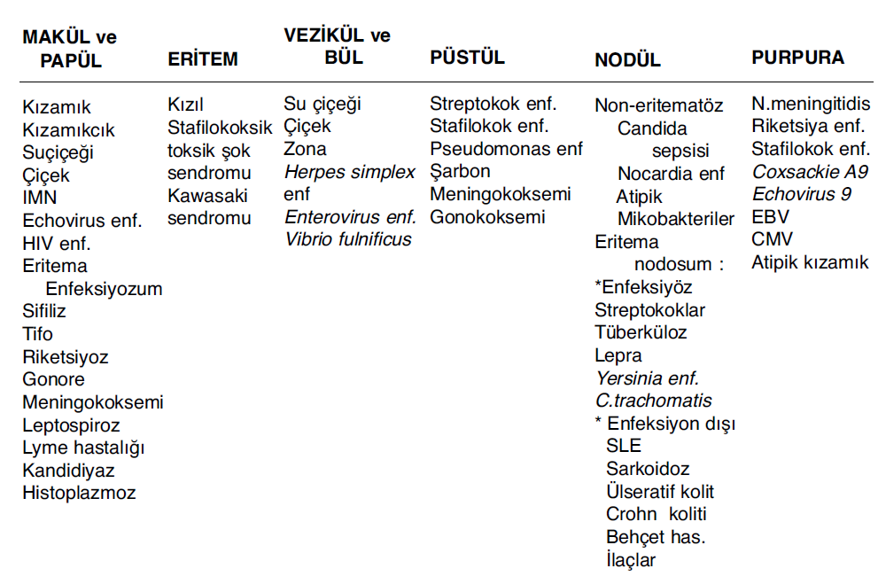
(tabloda olmayan monkeypox )
| Lezyon      | Tanım                                                                                |
| ----------- | ------------------------------------------------------------------------------------ |
| **Makül**   | Deriden kabarık/çökük olmayan, sınırları belli renk değişikliği (çoğunlukla kırmızı) |
| **Papül**   | Solid, deriden kabarık, çapı <0,5 cm   (genelde ikisini beraber makülopapüler)       |
| **Plak**    | Papüllerin birleşmesiyle oluşan geniş kabarıklık                                     |
| **Vezikül** | Sıvı içeren, deriden kabarık, çapı <0,5 cm                                           |
| **Bül**     | Vezikül gibi ancak çapı >0,5 cm               (içi berrak su dolu)                   |
| **Püstül**  | Pürülan sıvı içeren deriden kabarık lezyon                                           |
| **Peteşi**  | Kırmızımsı-mor, basmakla solmayan, <*3 mm                                            |
| **Purpura** | Basmakla solmayan, 3 mm - 1 cm                                                       |
| **Ekimoz**  | Basmakla solmayan, >1 cm                                                             |

> Vaskülitlerde de solmuyor.
>

**🚨 Çocukta ateş ve döküntü:** Hafif seyirli bir hastalıktan yaşamı tehdit edici ciddi hastalığa kadar geniş bir spektrum. **Meningokoksemi şüphesinde hızlı ampirik tedavi!!**

---

## KIZAMIK (RUBEOLA)

| Özellik            | Detay                                 |
| ------------------ | ------------------------------------- |
| **Etken**          | Measles virüs / Paramyxoviridae / RNA |
| **Bulaş**          | Solunum (damlacık çekirdeği)          |
| **İnkubasyon**     | 8-12 gün                              |
| **Bulaştırıcılık** | Döküntü öncesi 4 gün → sonrası 4 gün  |

⚠️ Yüz yüze temas şart değil! Hastanın bulunduğu odada **1 saate kadar** canlı kalmaktadır.

> Solunum yolu ile bulaşanlar:
> - tüberküloz
> - su çiçeği
### Klinik

* Yüksek ateş, enantem, öksürük, konjunktivit, belirgin ekzantem

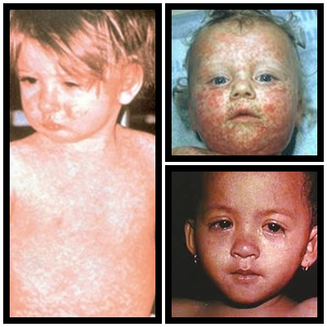

### Koplik Lekesi

* ⭐ **Patognomonik** bulgu
* Yanakta, premolar dişler hizasında
* Mavi-beyaz renkte, tuz tanesi büyüklüğünde, etrafı kırmızı halka ile çevrili lekeler
* Döküntüden 1-4 gün içinde (%50-70) belirir, 24 saat içinde kaybolur

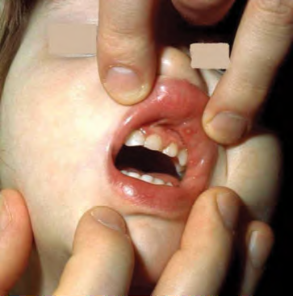

### Döküntü

* **Makülopapüler**
* Alından, kulak arkasından başlar → gövdeye doğru yayılır
* Birleşme eğiliminde
* El-ayak tutulumu %50
* Başladığı şekilde 1 hafta içinde geriler
* Deskuamasyon (+)

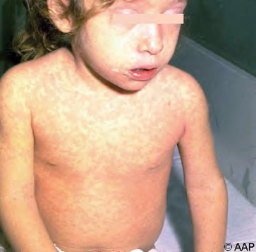

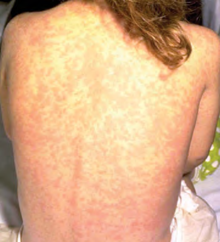

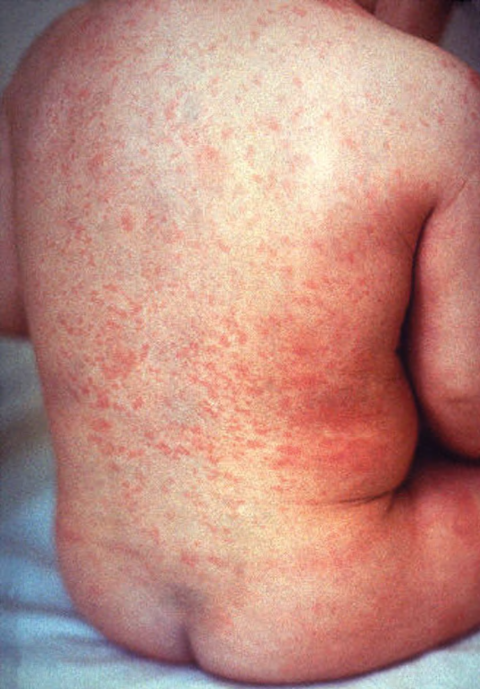

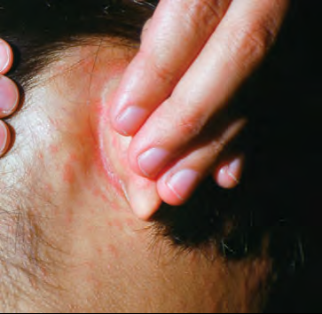

### Komplikasyonlar ve Tedavi

* En sık komplikasyonlar: **otit** ve **pnömoni**
* Tedavi: Destek + **Vitamin A** (özgün antiviral yok) (iki gün süreyle)
* Temas sonrası profilaksi: İlk **72 saatte aşı** ya da ilk **6 gün IVIG**
> immunyetmezliği varsa 6 gün IVIG
---

## KIZAMIKÇIK (RUBELLA)

> "3 gün kızamığı"

| Özellik            | Detay                                |
| ------------------ | ------------------------------------ |
| **Etken**          | Rubella virüs / Togaviridae / RNA    |
| **Bulaş**          | Solunum yolu                         |
| **İnkubasyon**     | 14-21 gün                            |
| **Bulaştırıcılık** | Döküntü öncesi 5 gün → sonrası 6 gün |

### Klinik

* Ateş, boğaz ağrısı, başağrısı, halsizlik
* **Lenfadenopati** (özellikle retroauriküler, postservikal, suboksipital)
* **Forcheimer spots:** Döküntü ile birlikte boğazda gül renkli lekeler

### Döküntü

* Pembe, makülopapüler
* Saçlı deri ve yüzden başlar
* ❌ Lezyonlar birleşmez
* ❌ Soyulma ve hiperpigmentasyon görülmez

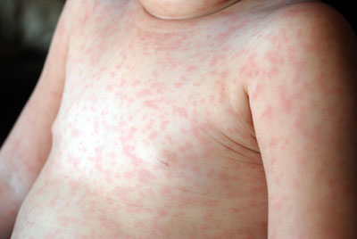

### Konjenital Rubella Sendromu

⚠️ Aşılanma programı yeterli olmayan ülkelerde genetik olmayan konjenital **sağırlık ve körlüklerin en sık nedenlerinden!**

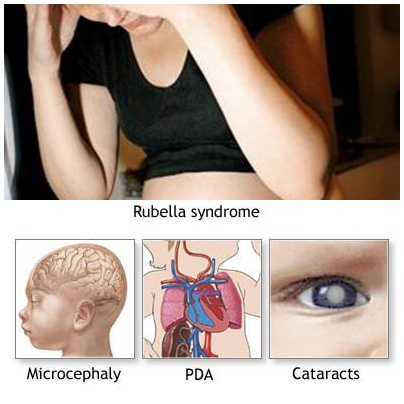

### Korunma

* **KKK aşısı** → 12. ve 48. ayda olmak üzere 2 doz

---

## ERİTEMA ENFEKSİYOZUM (5. HASTALIK)

| Özellik        | Detay                         |
| -------------- | ----------------------------- |
| **Etken**      | Parvovirus B19 / Parvoviridae |
| **Yaş**        | 5-15 yaş                      |
| **Mevsim**     | Geç kış / bahar               |
| **Bulaş**      | Solunum yolu                  |
| **İnkubasyon** | 4-28 gün (ortalama 16-17)     |

* Prodrom: hafif, düşük ateş, başağrısı, ÜSYE
* Hastalar ateşsiz ve iyi görünümlü
* **Bulaştırıcılık döküntü ile biter!**

### Döküntü (3 Evreli Makülopapüler)

1. Yüzde **"tokat yemiş" görünümü**
2. Gövdede ve ekstremite proksimal, ekstansör yüzlerde **dantela tarzı** döküntü (el ve ayaklar korunur)
3. Deskuamasyon olmadan iyileşir

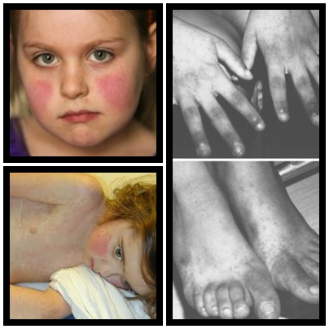

**⚠️ ÖNEMLİ:**

* Kronik hemolitik anemi ve immün yetmezlik hastalarını **aplastik krize** sokabilir
* Aplastik krizdeki hastaların bulaştırıcılığı devam eder → izolasyon (1 hafta veya ateş düşene kadar)

---

## ROSEOLA İNFANTUM (6. HASTALIK)

> Ekzantem Subitum

| Özellik        | Detay                  |
| -------------- | ---------------------- |
| **Etken**      | HHV-6, HHV-7 / DNA     |
| **İnkubasyon** | 10 gün                 |
| **Pik yaş**    | 6-15 ay (%95'i <3 yaş) |

### Klinik

* **Yüksek ateş** 3-5 gün devam eder → ateşin düşmesiyle **döküntü ortaya çıkar!**
* Nagayama spots (uvulopalatoglossal bileşkede ülserler)
* SSS bulguları olabilir (pulsatil fontanel, ensefalit, konvülsiyon)
> Tanı koydğunuzda ilacı bırakıyoruz?
### Döküntü

* Gül renkli, birbirinden ayrı yerleşimli, küçük (2-5 mm) makülopapüler
* **Gövdeden** başlayıp ekstremitelere, yüze, boyuna yayılır
* Kaşıntılı değil, 1-3 gün içinde solar

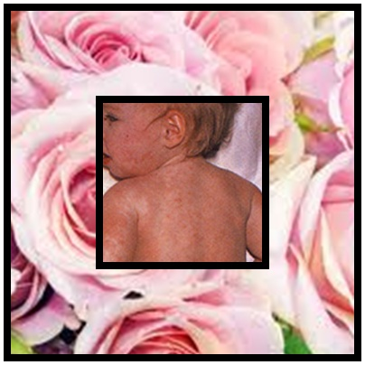

### Laboratuvar

* PY'de ilk 24-36 saat PMNL hakimiyeti, lökositoz
* 48.saatten sonra mononükleer hücre hakimiyeti, lökopeni

---

## SUÇİÇEĞİ (VARİSELLA)

| Özellik            | Detay                                                     |
| ------------------ | --------------------------------------------------------- |
| **Etken**          | Varicella-Zoster Virüs (VZV) / Herpesviridae / DNA        |
| **İnkubasyon**     | 10-21 gün                                                 |
| **Mevsim**         | Geç kış / bahar                                           |
| **Bulaştırıcılık** | Döküntüden 24-48 saat önce → tüm lezyonlar krutlanana dek |

* Ev içi temasta hastalık geçirme riski **%90**
* Doğal enfeksiyon sonrası bağışıklık **hayat boyu**
* İmmünitesi sağlam insanlarda döküntü görülmeden olmaz!
> bütün lezyonlar kabuklanana kadar bulaş devam eder. bir kere geciken hayat boyu görülmez.
> 
### Döküntü

* Saçlı deri, yüz ve gövdede başlar
* **"Gül yaprakları üzerinde çiğ tanesi"** görünümü → düzensiz kenarlı eritematöz makül üzerinde berrak su dolu veziküller
* ⭐ **Aynı anda değişik evrelerde lezyonlar** (papül, vezikül, kabuklanma)
* Kaşıntılı
* Orofarenks, mukoz membranlarda vezikül/ülser sık
* <300 lezyon (12-1968)
* Yaygın skar beklenmez

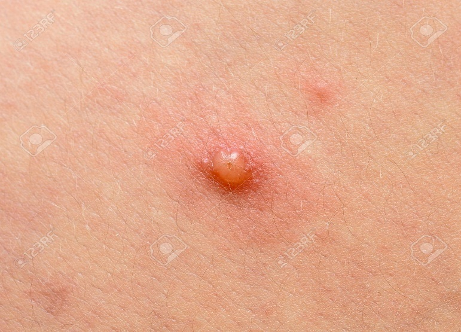

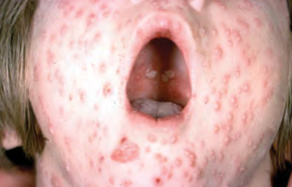

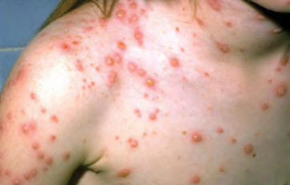

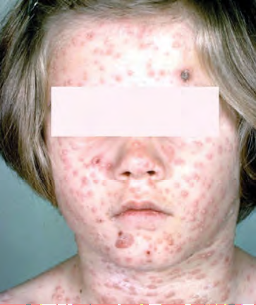

### Komplikasyonlar

| Komplikasyon                   | Detay                                           |
| ------------------------------ | ----------------------------------------------- |
| **Bakteriyel süperenfeksiyon** | Nekrotizan fasiit, pnömoni                      |
| **Nörolojik**                  | Ensefalit, serebellar tutulum, konvülsiyon, GBS |
| **Hematolojik**                | Trombositopeni                                  |
| **Renal**                      | Nefrit, HÜS                                     |
| **Kaçak varisella**            | Aşılı hastalarda, daha hafif seyirli            |
| **Reye sendromu**              | Salisilat kullananlarda risk!                   |

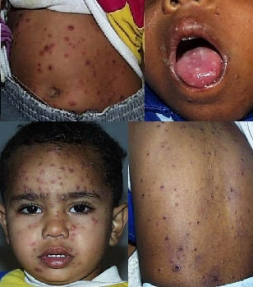

### Konjenital Varisella Sendromu

* 8-20. haftalar arası suçiçeği geçiren anne → bebekte **%1-2** risk
* Fetal ölüm, ekstremite hipoplazisi, cilt skarları, göz ve SSS anomalileri

### Neonatal Varisella

* 🚨 En riskli dönem: Annenin doğumdan **5 gün önce - 2 gün sonra** suçiçeği çıkarması
* Bebeğe **VZIG / IVIG** (400 mg/kg tek doz) verilir
> Yenidoğan için çok riskli
### Tanı

* **Klinik!**
* PCR (vezikülden sürüntü, BOS)
* Tzanck testi (multinükleer dev hücreler)
* Kültür, seroloji

### Tedavi

**Her hastaya antiviral tedavi gerekmiyor!**

#### Oral Asiklovir Endikasyonları

* ≥12 yaş aşısız çocuklar
* Kronik cilt ve pulmoner hastalığı olanlar
* Diabetes mellitus
* Uzun süreli salisilat kullananlar
* **Ev içi temas (daha çok vezikül çıkar!)** (önemli)
* **Doz:** `Asiklovir 80 mg/kg/gün, 4 dozda (maks: 800 mg/doz)`, 5 gün, 24 saat içinde başlanmalı
>**Banyo yapsın mı? Evet ama liflenmeyecek. Tırnakları keseceksin.**
> İz bırakır mı? Eğer kaşımazsa iz bırakmaz.
#### İV Asiklovir Endikasyonları

* İmmünsüprese konak
* Ciddi komplikasyonlar (pnömoni, hepatit, ensefalit, trombositopeni)
* Neonatal varisella
* **Doz:** `1500 mg/m²/gün, 3 dozda` veya `30 mg/kg/gün, 3 dozda`, 72 saat içinde başlanmalı
> Mutlaka Antihistaminik vereceksin. Atarax Şurup
> 
> Evdeki kişilere de tedavi uygulanmalı; mesela abisi varsa oral asiklovir vereceksin
>

> Asiklovir verdiğin hastaya da mutlaka hidrasyonu yap
#### Temas Sonrası Profilaksi

* İmmün yetmezlik yok ve ≥1 yaş → ilk **5 gün** içinde **AŞI**
* İmmün yetmezlik var → ilk **10 gün** içinde (tercihen ilk 96 saat) **VariZIG / IVIG**

---

## HERPES ZOSTER (ZONA)

* Bir ya da birkaç dermatom bölgesini tutan ağrılı, kaşıntılı, veziküler erüpsiyon
* Suçiçeğini intrauterin veya ilk 1 yaşta geçirenlerde çocukluk döneminde zona riski ↑
* İmmün yetmezliklerde zona **dissemine** olur!
* İmmün yetmezlik yoksa asiklovir tedavisi endikasyonu yoktur

>**yenidoğanda bile görülebilir!**

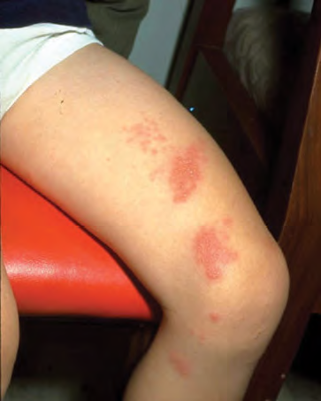

---

## ENTEROVİRAL DÖKÜNTÜLÜ HASTALIKLAR

100'den fazla serotip → En sık klinik prezentasyon: **nonspesifik febril hastalık** (bebeklerde bakteriyel sepsisle karıştırılabilir)

### El-Ayak-Ağız Hastalığı

> enterovirüslerin en sık görülen hastalığı
> daha çok kreş çocuklarında görülür.
* **Etken:** Coxsackievirüsler, Enterovirus 71
* Dil, bukkal mukoza, damak, diş etlerinde veziküler lezyonlar
* El, ayak, kalçada makülopapüler, veziküler ve/veya püstüler lezyonlar

> Binlerce suşu var bu yüzden birden fazla kez görülebilir.
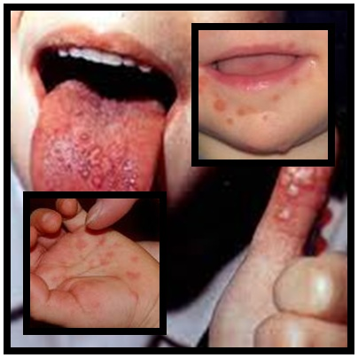

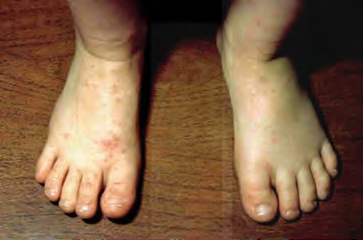

### Herpanjina

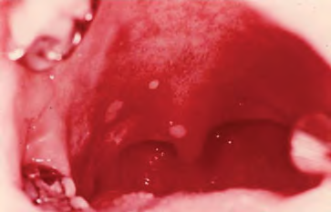
> Çocuğun en çok konforunu bozan aftlar.
### Enterovirüslerin Tüm Klinik Bulguları

1. **Solunumsal:** Nezle, farenjit, herpanjina, stomatit, bronşiolit, pnömoni
2. **Cilt:** El-ayak-ağız hastalığı, onikomadezis, nonspesifik ekzantemler
3. **Nörolojik:** Aseptik menenjit, ensefalit, motor paralizi
4. **GIS/GÜS:** Kusma, diyare, hepatit, pankreatit, orşit
5. **Göz:** Akut hemorajik konjunktivit, üveit
6. **Kalp:** Miyoperikardit
7. **Kas:** Plörodini, iskelet miyozitleri

### Tedavi

* Özgün tedavisi yok
* Miyokarditte, immün yetmezlikte ve yenidoğanlarda IVIG faydalı olabilir

---

## MENİNGOKOKSEMİ

| Özellik         | Detay                                                            |
| --------------- | ---------------------------------------------------------------- |
| **Etken**       | N. meningitidis, Gram (-) oksidaz (+) diplokok                   |
| **Serogrupler** | En sık 8 serogrup: **A**, **B**, **C**, X, **Y**, Z, **W135**, L |
| **Bulaş**       | Damlacık ve temas (öpüşme, yakın temas, ortak gereçler)          |

* ⭐ **Asemptomatik taşıyıcılar** en önemli bulaş kaynağı!
* En yüksek insidans **ilk 1 yaşta**, ergenlik-genç erişkinlikte tekrar pik

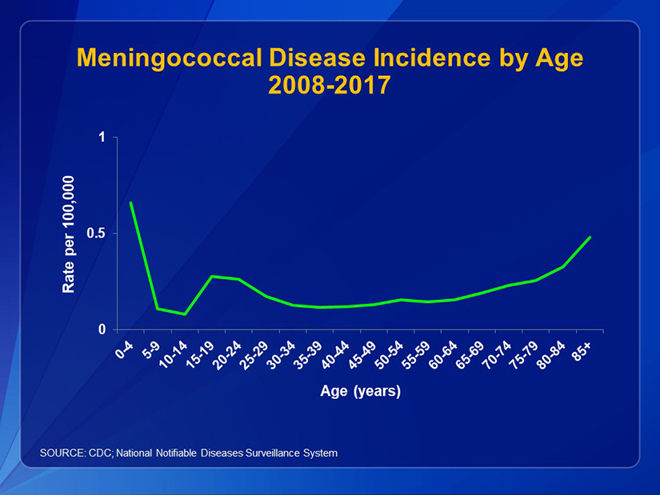

### Klinik Bulgular

**İlk dönem (viral ÜSYE benzeri):**
* Ateş, titreme, iritabilite/letarji
* Boğaz ağrısı, kusma/ishal, solunum semptomları
* Erken dönemde olguların **%10**'unda makülopapüler döküntü (viral benzeri)
* ⚠️ Genelde kış aylarında olduğu için bulgular ilk başta **grip zannedilebilir!**

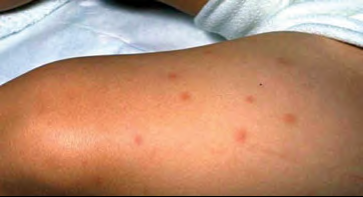

**İlk 12 saatten sonra bulgular oturmaya başlar:**
* Meningeal iritasyon bulguları
* ⭐ Basmakla solmayan, **peteşiyel-purpurik döküntü** (>%80)
* Ekstremitelerde soğukluk, kapiller dolum zamanında uzama

**⚠️ ÖNEMLİ:** Hasta tam olarak soyulmalı, basınç uygulanan bel ve lastik bölgelerine dikkat edilmeli!

> **Meningokok hastalığı tanısı için en önemli şey hastayı soyup bakmaktır.**
### Fulminan Meningokoksemi

Birkaç saatte **septik şoka** ilerler:

* Yaygın peteşi ve purpura → **purpura fulminans** (%15-25)
* Taşikardi, takipne, hipotansiyon
* Konfüzyon → koma
* Koagülopati, hipokalemi, asidoz
* Adrenal kanama, renal yetmezlik, miyokardiyal yetmezlik

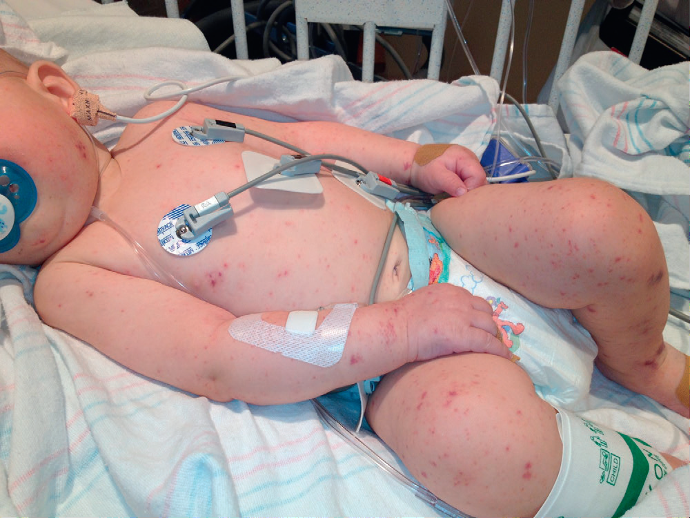

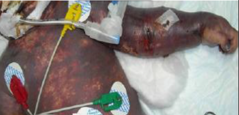
> Kesin ölür bu (up)

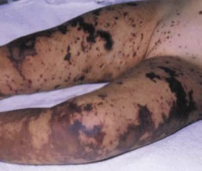

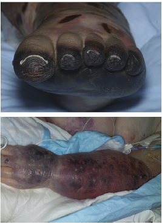

### Meningokokal Menenjit

* Klinik ve lab bulguları diğer bakteriyel menenjitler gibi
* Menenjit semptomları hastalığın yaklaşık **12-15. saatinde**
* <1 yaşta ort 15 saatte, daha büyük çocuklarda ≥24. saat

### Tedavi

* 🚨 **SEFTRİAKSON / SEFOTAKSİM** → 5-7 gün

### Komplikasyonlar

* **Waterhouse-Friderichsen sendromu** (adrenal kanama)
* En sık: **sağırlık** (%5-10)
* Ekstremite ampütasyonları, cilt defektleri
* Hidrosefali, körlük, subdural efüzyon/ampiyem

### Temas Sonrası Profilaksi

**Yüksek risk (profilaksi önerilir):**
* Ev içi temas (özellikle <2 yaş)
* Son 7 gün içinde: kreş arkadaşları, öpme, ortak gereç kullananlar, aynı ortamda uyuyanlar
* Ağızdan ağıza resüsitasyon veya temas önlemsiz entübasyon yapanlar

**Düşük risk (profilaksi önerilmez):**
* Sıradan temas (oral sekresyonlarına direkt temas yok)
* İndirekt temas

| İlaç               | Doz                                                           |
| ------------------ | ------------------------------------------------------------- |
| **Rifampisin**     | `10 mg/kg/doz (maks: 600 mg)` PO, 12 saatte bir, toplam 4 doz |
| **Seftriakson**    | <15 yaş: `125 mg` İM tek doz; ≥15 yaş: `250 mg` İM tek doz    |
| **Siprofloksasin** | `20 mg/kg` PO tek doz (maks: 500 mg)                          |

---

## KIZIL (SCARLATİNA)

| Özellik            | Detay                                           |
| ------------------ | ----------------------------------------------- |
| **Etken**          | GAS (eritrojenik toksin)                        |
| **İnkubasyon**     | 1-7 gün                                         |
| **Bulaştırıcılık** | Antibiyotik tedavisi başlandıktan sonra 24 saat |

### Klinik

> Aslında kendi kendine geçer ama tedavi etmezsen romatizmal ateş yapabilir.
* Prodrom: 12-24 saat süren ateş, boğaz ağrısı, başağrısı, kusma
* Orofarenks: GAS farenjiti ile aynı
* Dil: Önce **beyaz dil** → deskuamasyonla birlikte **kırmızı (çilek) dil**

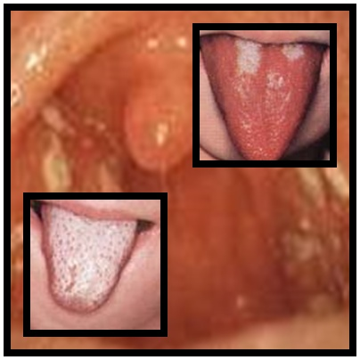

### Döküntü

* **Boyundan** başlayıp gövde ve ekstremitelere yayılır
* Yaygın, papüler, cilde parlak kırmızı veren eritematöz döküntü
* Dirsek, aksilla, kasıklarda yoğun → **Pastia çizgileri**
* Ağız çevresinde döküntü olmaz → **peroral solukluk** (5. hastalıkta da görülür)
* 3-4 gün içinde solar, ardından **deskuamasyon**

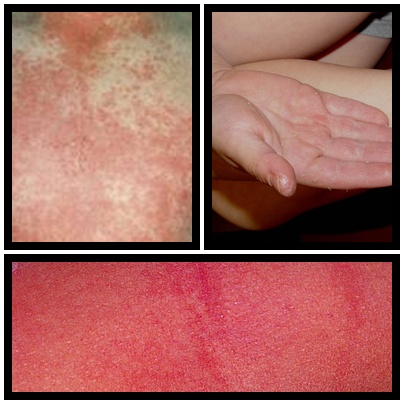

### Tedavi

* İM/PO **penisilin**, PO **amoksisilin**

---

## KAWASAKİ HASTALIĞI

* En sık **6 ay - 5 yaş**
* Etyoloji bilinmiyor → **Vaskülit**
* ⭐ Gelişmiş toplumlarda çocuklarda **kazanılmış kalp hastalığının en yaygın nedeni**
* 🚨 Koroner arter anevrizması, miyokard infarktüsü, ani ölüm riski

### Tanı Kriterleri

**En az 5 gündür süren ateş + aşağıdakilerden 4'ü:**

1. **Konjunktivit:** Bilateral nonpürülan (kıpkırmızı gözler)
2. **Mukoza değişiklikleri:** Dudaklarda eritem ve çatlaklar, orofarenks hiperemisi, çilek dili
3. **Ekstremite bulguları:** El ve ayaklarda eritem-şişlik, parmak uçlarında soyulma
4. **Polimorf döküntü** (vezikül hariç hepsi)
5. **Servikal LAP:** >1,5 cm

> **En kritik tutulumu koroner arterler.**
> 
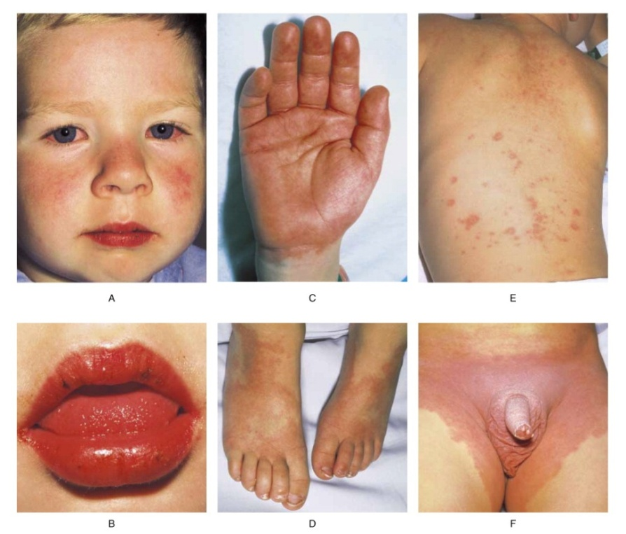

### Tedavi

* **IVIG** `2 g/kg` tek doz
* **Aspirin** İlk önce anti inflamatuar dozda.

---

## EPSTEİN-BARR VİRÜS (EBV) (öpücük hastalığı)

* Human Herpesvirus 4 (HHV-4), gamma-herpes virüs
* **Enfeksiyöz mononükleozun en sık nedeni** (>%90)
* İnsanlar bilinen tek rezervuar
* Erişkinlerin ~**%90**'ı EBV serolojisi (+)
* İnkübasyon: **30-50 gün**

### Klinik (Enfeksiyöz Mononükleoz)

* **Ateş + Farenjit + LAP** (klasik triad)
* Damakta peteşiler
* HSM (hepatosplenomegali)
* Bebeklerde ve küçük çocuklarda enfeksiyon genelde fark edilmeden geçirilir

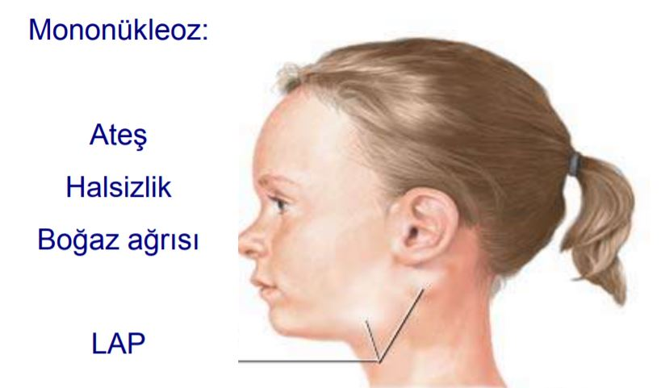

### Döküntü

* ⚠️ **Ampisilin/amoksisilin** kullanan hastalarda döküntü çok daha sık!

### Komplikasyonlar

| Sistem          | Komplikasyonlar                                                                    |
| --------------- | ---------------------------------------------------------------------------------- |
| **Hematolojik** | Trombositopeni, hemolitik anemi, hemofagositik lenfohistiositoz, **dalak rüptürü** |
| **Nörolojik**   | Aseptik menenjit, ensefalit, GBS, "Alice harikalar diyarında" sendromu             |
| **Diğer**       | Pnömoni, miyokardit, orşit                                                         |

### EBV ve Onkojenez

* X-linked lenfoproliferatif sendrom
* Post-transplant lenfoproliferatif sendrom
* **Burkitt lenfoma** (endemik Burkitt'te %100, sporadik Burkitt'te %20)
* Hodgkin hastalığı, nazofarinks karsinomu

### Tanı

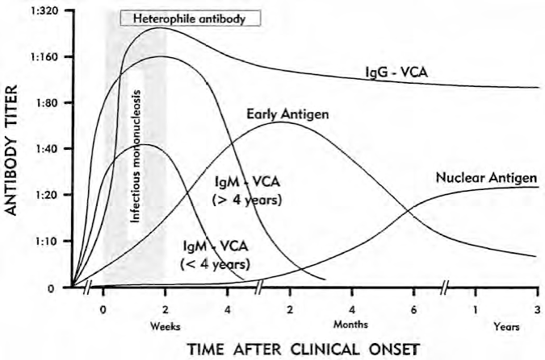

| Test                                          | Özellik                                 |
| --------------------------------------------- | --------------------------------------- |
| **Heterofil antikor (Paul-Bunnell/Monospot)** | İlk 2 haftada saptanır, 6 ayda kaybolur |
| **VCA IgM (+)**                               | Akut enfeksiyon (ilk artan)             |
| **VCA IgG (+)**                               | Ömür boyu pozitif kalır                 |
| **EBNA (-)**                                  | Akut enfeksiyonda negatif               |

**Akut enfeksiyon tanısı:** ≥%10 atipik lenfositoz + heterofil antikor (+) veya VCA IgM (+) + anti-EBNA (-)

### Tedavi
* **Özgül antiviral tedavi yok**
* ❌ **Antibiyotik verilmez!** Alıyorsa kesilir
* Kısa süreli steroid endikasyonları: havayolu obstrüksiyonu, masif splenomegali, miyokardit, hemolitik anemi, HLH
* ⚠️ Splenomegali varsa **temas ve dövüş sporları yasak** (düzelene kadar)

---

## HERPES SİMPLEKS VİRÜS (HSV)

* İnsanları enfekte eden 9 herpesvirüs türünden **en sık HSV-1 ve HSV-2**
* HSV-1: yüz ve belin üst kısmında
* HSV-2: genital herpes ve belden alt kısımda (tam tersi de olabilir)
* Primer enfeksiyondan sonra periyodik **reaktivasyon**
* 7 yaşına kadar çocukların ~**%25**'i HSV-1 (+)
* **Bebekleri öpme**
### Neonatal Herpes

* Bulaş: enfekte maternal genital yoldan, doğum sırasında
* Annenin **primer enfeksiyonunda** bebeğe bulaş riski reaktivasyona göre daha yüksek

**3 form:**

| Form               | Özellik                         | Oran |
| ------------------ | ------------------------------- | ---- |
| **Lokalize (SEM)** | Cilt, göz, ağız tutulumu        | %45  |
| **SSS hastalığı**  | Cilt tutulumu ±                 | %30  |
| **Dissemine**      | Multipl organ tutulumu, SSS (+) | %25  |

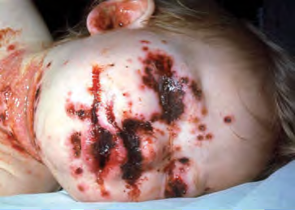

**🚨 Neonatal herpes düşündüren durumlar:**

* Sepsis bulguları + kültürlerde üreme yok + ağır KC disfonksiyonu + tüketim koagülopatisi → **Neonatal herpes akla gelmeli**
* Ateş + veziküler döküntü + nöbet + anormal BOS → **Herpes ensefaliti akla gelmeli**

### Yenidoğan Dönemi Sonrası Klinik

* ⭐ Çoğu primer herpes enfeksiyonu **asemptomatik**

#### Gingivostomatit (semptomatik tedavi)

* Çocukluk çağındaki **en sık** klinik bulgu (HSV-1)
* Ateş, iritabilite, ağrılı submandibular LAP
* Ağız içi-gingivada ülserler ve perioral veziküler lezyonlar

#### Genital Herpes

* Adölesan ve erişkinlerde en sık primer herpes tutulumu (sıklıkla HSV-2)
* 🚨 Prepubertal dönemde genital HSV-2 → **cinsel istismar** akılda tutulmalı!

#### Egzema Herpeticum

* Atopik dermatiti olan hastalarda
* Ciltte erozif lezyonlar, hemorajik kabuklar, veziküller
* **Asiklovir tedavisi şart**

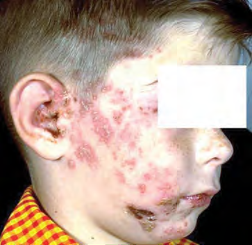

#### Herpetik Dolama (Whitlow)

* Distal parmaklarda tek ya da multipl veziküler lezyonlar

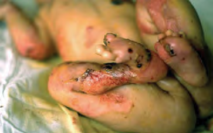

#### HSV Ensefaliti

* **HSV-1** (primer/reküren)
* Akut başlar: ateş, bilinç bozukluğu, kişilik değişikliği, nöbet
* EEG/MRG: **temporal tutulum** + uyumlu klinik → HSV ensefaliti akla gelmeli
* BOS: pleositoz, lenfosit hakimiyeti
* ❌ Tedavi edilmediğinde fulminan seyir, koma ve ölüm

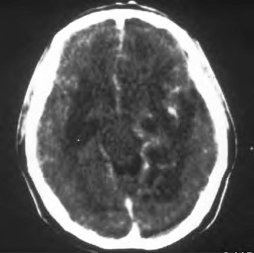

#### HSV Keratit

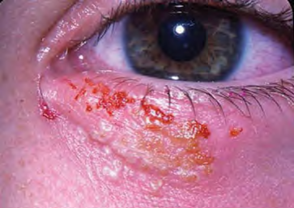

### Latent Enfeksiyon ve Reaktivasyon

* HSV bir kez geçirildikten sonra hayat boyu **latent** kalır
* Herpes labialis: trigeminal ganglion
* Genital herpes: sakral dorsal kök ganglion
* Erken dönemde (tercihen ilk 24 saatte) antiviral başlanmalı

### Tanı

* Klinik
* **Vezikül sıvısından PCR** (ilk seçenek)
* SSS enfeksiyonunda **BOS PCR**
* Lp yapamasan da **temporal MRG** çekilmeli
* Hücre kültürü
* Seroloji akut dönemde faydalı değil

### Tedavi

* **Asiklovir** ilk tercih
* Valasiklovir, famsiklovir, foskarnet
* SSS hastalığında tedavi süresi en az **21 gün**
* Neonatal HSV sonrası **6 ay** oral asiklovir süpresyon tedavisi

---

## ERİTEMA MULTİFORME VE STEVENS-JOHNSON SENDROMU

### Eritema Multiforme

* Akut, kendini sınırlayıcı
* Mukozal tutulum çok az veya yok
* Etyoloji: En sık **HSV**, mikoplazma

**Döküntü:**
* ⭐ **Target (hedef) lezyon** → patognomonik
* Periferik dağılımlı, simetrik maküller
* Yer değiştirir, fikse değil

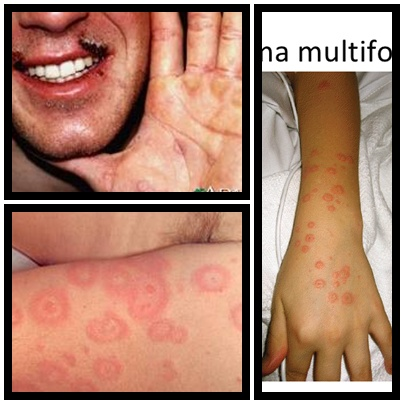

**Tedavi:** HSV için asiklovir, sistemik/topikal steroid

### Stevens-Johnson Sendromu (SJS)

> Eritema Multiforme Major — 🚨 **Acil bir durumdur!**

**Etyoloji:**
* %50'sinde neden bilinmiyor
* M. pneumoniae
* İlaçlar (penisilin, sulfonamid, antikonvülzanlar, analjezikler)

**Klinik:**
* **Yaygın mukozal tutulum**
* Stomatit ve konjunktivit sık
* Büyük, ortası koyu renkli plaklar üzerinde veziküller ve büller
* Süre: 2-6 hafta
* >%30 tutulum → **Toksik Epidermal Nekroliz (TEN)**

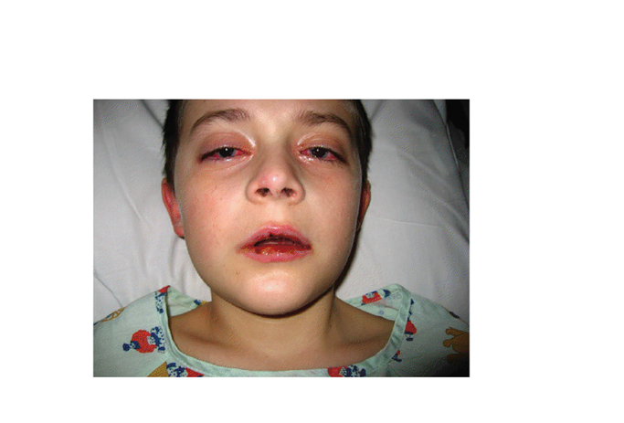

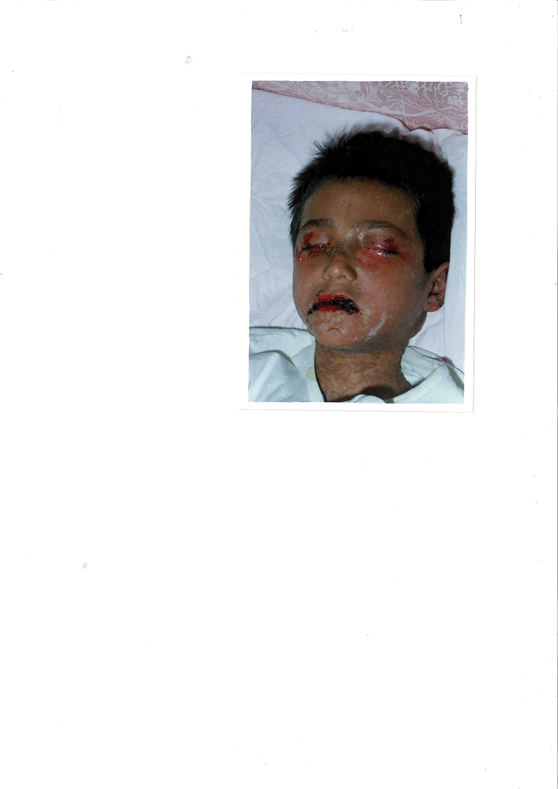

---

## ÇIKMIŞ SORULAR

### 1. Blok - Soru 2

**Aşağıdakilerden hangisi orta boyutlu damarları tutan vaskülittir?**

A) Kawasaki ✅
B) Henoch-Schönlein
C) Takayasu artriti
D) Wegener
E) Mikroskobik polianjitis

> **💡 Açıklama:** Kawasaki hastalığı **orta boyutlu damarları** tutan bir vaskülittir ve özellikle **koroner arterleri** tutar. Henoch-Schönlein (IgA vasküliti) küçük damar vasküliti, Takayasu büyük damar (aort ve dalları) vasküliti, Wegener (GPA) ve mikroskobik polianjitis ise küçük damar vaskülitleridir. Kawasaki'de en korkulan komplikasyon **koroner arter anevrizmasıdır**.

***

### 1. Blok - Soru 19

**İntrauterin hayatta enfekte olunca sağırlık yapan, aşı ile önlenebilen virüs?**

A) Kızamık
B) Su çiçeği
C) Rubella ✅
D) CMV
E) Hepatit B

> **💡 Açıklama:** **Konjenital rubella sendromu (KRS)** klasik triadı: ① Sensorinöral işitme kaybı (en sık bulgu, **%60-75**), ② Göz bulguları (katarakt, glokom, retinopati), ③ Kardiyak anomaliler (PDA, pulmoner stenoz). CMV de konjenital sağırlık yapabilir ancak aşısı yoktur. Rubella aşısı KKK (kızamık-kızamıkçık-kabakulak) içinde uygulanır ve KRS'yi önler.

***

### 2. Blok - Soru 1

**Çocuklarda viral ensefalitin en sık etkeni nedir?**

A) EBV
B) CMV
C) VZV
D) Enterovirüs
E) HSV ✅

> **💡 Açıklama:** **HSV (Herpes Simpleks Virüs)**, özellikle **HSV-1**, çocuklarda sporadik viral ensefalitin en sık nedenidir. Temporal lob tutulumu karakteristiktir. Tedavide **asiklovir 10 mg/kg/doz, 8 saatte bir, 14-21 gün IV** uygulanır. Tedavisiz mortalite **%70-80**'dir; erken tedavi ile %20'ye düşer. BT/MR'da temporal lob tutulumu, BOS'ta lenfositik pleositoz ve PCR ile HSV DNA pozitifliği tanıyı destekler.

***

### 2. Blok - Soru 22

**Hangisi yenidoğanda ağır miyokardit nedenidir?**

A) Herpes Simplex Virus
B) Koksaki B ✅
C) Kızamık
D) Adenovirus
E) Toksoplazma

> **💡 Açıklama:** **Koksaki B virüsü** (Enterovirus ailesinden) yenidoğan döneminde **ağır miyokardit** ve ensefalomiyokarditin en sık etkenidir. Doğum sırasında veya postnatal bulaşır. Yüksek mortalite oranı vardır. Koksaki virüsler ayrıca **el-ayak-ağız hastalığı** (Koksaki A16, EV71) ve **herpanjina** (Koksaki A) gibi döküntülü hastalıklara da neden olur.

***

### 2. Blok - Soru 23

**4 yaşında daha önce herhangi bir hastalık geçirmemiş, aşıları tam erkek çocuk. 3 gün süren ateş ve halsizlik sonrası gelişen döküntü var. Ateş ilk 2 gün 39°C'ye kadar yükselmiş, hafif öksürük, burun akıntısı var, konjunktivit yok. 3. günün sabahı ateş belirgin düşmüş, öğleden sonra gövdede döküntü tespit edilmiş. Döküntü gövdede yoğun, gül pembe renkte, 2-4 mm çaplı, birbinden ayrı, makül; papül yok, kaşıntı yok. Ön tanınız nedir?**

A) Kızamık
B) Kızamıkçık
C) Roseola infantum ✅
D) Eritema infeksiyozum
E) İlaç döküntüsü

> **💡 Açıklama:** Roseola infantum (ekzantema subitum, altıncı hastalık) **HHV-6** etkeniyle oluşur. Klinik seyri çok tipiktir: ① **3-5 gün yüksek ateş** (39-40°C), ② Ateş düştükten sonra **gövdeden başlayan makülopapüler döküntü**, ③ Döküntü çıktığında çocuk **iyi görünümlüdür**. Kızamıktan farkı: konjunktivit, Koplik lekesi ve kataral bulgular **yoktur**, döküntü ateş düştükten **sonra** çıkar (kızamıkta ateşle birlikte çıkar).

***

### 2. Blok - Soru 24

**Kawasaki hastalığının tedavisinde ne kullanılır?**

A) Aspirin – IVIG ✅
B) IL-1 inhibitörü
C) Antiviral
D) Geniş spektrumlu antibiyotik
E) NSAİİ

> **💡 Açıklama:** Kawasaki hastalığının standart tedavisi: ① **IVIG 2 g/kg tek doz** (ilk 10 gün içinde verilmeli), ② **Yüksek doz aspirin** (80-100 mg/kg/gün, 4 dozda) ateş düşene kadar → ardından **düşük doz aspirin** (3-5 mg/kg/gün) 6-8 hafta. Erken IVIG tedavisi koroner arter anevrizması riskini **%25'ten %5'in altına** düşürür. Aspirin hem antiinflamatuar hem antitrombotik etki sağlar.

***

### 2. Blok - Soru 54

**Aşağıdaki olgulardan hangisine kızamık aşısı uygulanabilir?**

A) Beş aylık, anne sütü alan bebek
B) HIV enfeksiyonu olan bir yaşında bebek ✅
C) Üç yaşında, akut orta kulak enfeksiyonu olan, ateşli çocuk
D) Konjenital ağır kombine immün yetmezlik tanısı konulan 13 aylık bebek
E) Daha önce hiç kızamık aşısı olmamış 24 haftalık gebe

> **💡 Açıklama:** Kızamık aşısı **canlı atenüe** bir aşıdır. ❌ 5 aylık bebekte maternal antikorlar aşı etkinliğini azaltır (ilk doz **12. ayda**). ❌ Ağır kombine immün yetmezlik (SCID) mutlak kontrendikasyondur. ❌ Gebelik kontrendikasyondur. ❌ Ateşli akut hastalık göreceli kontrendikasyondur. ✅ **HIV enfeksiyonu** olan ancak **ağır immünsupresyonu olmayan** çocuklara KKK aşısı uygulanabilir (CD4 oranı ≥%15 olmalı).

***

### 3. Blok - Soru 48

**Hangisi yenidoğanda ağır miyokardit nedenidir?**

A) Herpes Simplex Virus
B) Koksaki B ✅
C) Kızamık
D) Adenovirus
E) Toksoplazma

> **💡 Açıklama:** Bu soru 2. Blok Soru 22 ile aynıdır. **Koksaki B** yenidoğan miyokarditinin en önemli etkenidir. Enterovirus ailesine ait olan Koksaki virüsleri perinatal dönemde bulaşarak fulminan miyokardite yol açabilir. Erken tanı ve destekleyici tedavi hayat kurtarıcıdır.
