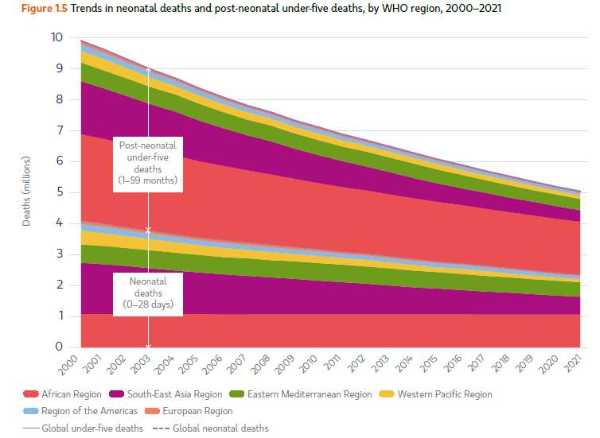
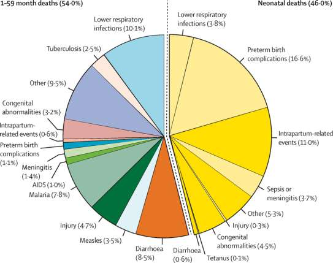
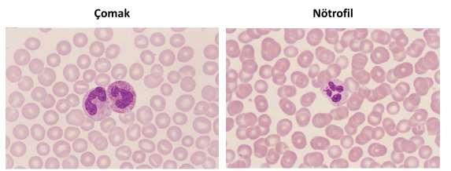
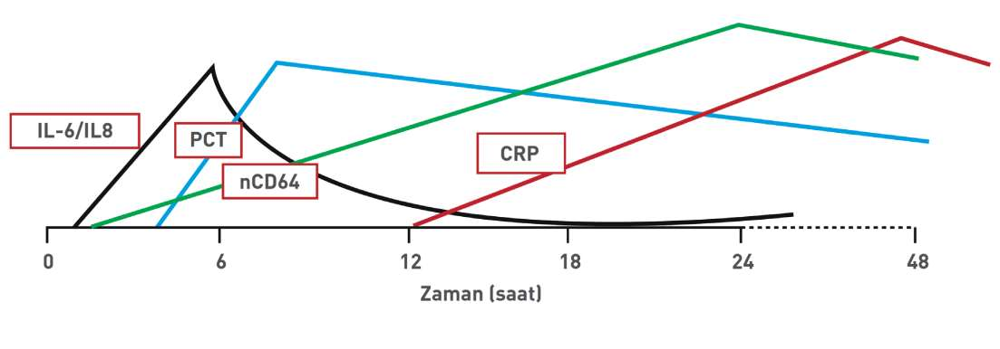

# YENİDOĞAN SEPSİS VE MENENJİTİ

**Hazırlayan:** Doç. Dr. İlknur Çağlar
**Bölüm:** ADÜ Çocuk Enfeksiyon Hastalıkları Bilim Dalı

---

## İÇİNDEKİLER

1. [Epidemiyoloji](#epidemiyoloji)
2. [Terminoloji ve Tanımlar](#terminoloji-ve-tanımlar)
3. [Risk Faktörleri](#risk-faktörleri)
4. [Erken ve Geç Başlangıçlı Sepsis](#erken-ve-geç-başlangıçlı-sepsis)
5. [Klinik Bulgular](#klinik-bulgular)
6. [Laboratuvar ve Tanı](#laboratuvar-ve-tanı)
7. [Tedavi](#tedavi)
8. [Yenidoğan Menenjiti](#yenidoğan-menenjiti)
9. [Komplikasyonlar ve Prognoz](#komplikasyonlar-ve-prognoz)

---

## EPİDEMİYOLOJİ

> 5 yaş altı çocuk ölümlerinin **%47'si yenidoğan döneminde**, tüm yenidoğan ölümlerinin **%8-15'i** sepsis ve menenjit nedeniyledir.





| Parametre | Değer |
|---|---|
| **İnsidans** | 1000 canlı doğumda 1-10 |
| **Dünya genelinde yıllık olgu** | ~3 milyon |
| **Mortalite** | %5-10 |

* Gestasyon yaşı ↓ → Sıklık ↑
* Doğum ağırlığı ↓ → Sıklık ↑

---

## TERMİNOLOJİ VE TANIMLAR

### Gestasyon Yaşına Göre

| Tanım | Gestasyon Haftası |
|---|---|
| Term yenidoğan | ≥37 hafta |
| Geç preterm | 34-37 hafta |
| Orta preterm | 32-33 hafta |
| Çok preterm | 28-32 hafta |
| Aşırı preterm | <28 hafta |

### Doğum Ağırlığına Göre

| Tanım | Ağırlık |
|---|---|
| Düşük doğum ağırlığı | <2500 g |
| Çok düşük doğum ağırlığı | <1500 g |
| Aşırı düşük doğum ağırlığı | <1000 g |

### Yenidoğan Sepsisi Tanımı

> Yaşamın ilk **28 gününde** enfeksiyona ait sistemik bulguların olduğu ve kan kültüründe özgül bir etkenin üretildiği klinik sendromdur.

| Tip | Tanım |
|---|---|
| **Kanıtlanmış sepsis** | Etkenin saptandığı |
| **Klinik sepsis** | Etkenin saptanamadığı |

### Başlama Zamanına Göre

| Tip | Zaman |
|---|---|
| **Erken başlangıçlı sepsis** | İlk 3 gün (<72 saat) |
| **Geç başlangıçlı sepsis** | 4-30. günler |
| **Çok geç başlangıçlı sepsis** | 30. günden taburcu olana kadar |

---

## RİSK FAKTÖRLERİ

* Prematürite
* Düşük doğum ağırlığı
* **Erken membran rüptürü** (>18 saat)
* Koryoamniyonit
* Maternal peripartum enfeksiyon
* GBS sepsis olan bebek doğurma öyküsü
* Fetal stres
* Çoğul gebelik
* İnvaziv girişimler

### Maternal Koryoamniyonit Tanısı

**Maternal ateş** + en az 2'si:
* Maternal lökositoz
* Maternal taşikardi
* Fetal taşikardi
* Uterin hassasiyet / kötü kokulu amnion sıvısı

---

## ERKEN VE GEÇ BAŞLANGIÇLI SEPSİS

| Özellik | Erken Başlangıçlı | Geç Başlangıçlı |
|---|---|---|
| **Zaman** | İlk 3 gün | 4-30 gün |
| **Bulaş** | Vertikal, doğum kanalından | Vertikal, postnatal çevreden |
| **Seyir** | Fulminan, çoklu organ tutulumu | Akut/sinsi, **menenjit sık** |
| **Tutulum** | Çoklu organ | Çoklu organ / fokal enfeksiyon (pnömoni, osteomiyelit) |

### Etkenler

| Erken Başlangıçlı | Geç Başlangıçlı |
|---|---|
| ⭐ **GBS**, E. coli | ⭐ **KNS**, S. aureus |
| Viridan streptokoklar | Candida, E. coli |
| Enterokoklar, KNS | Enterokoklar, Klebsiella |
| S. aureus, H. influenzae | Pseudomonas, GBS |
| L. monocytogenes, Klebsiella | L. monocytogenes |

---

## KLİNİK BULGULAR

### Genel Bulgular

* İyi görünmeyen bebek
* Hipoaktivite, huzursuzluk
* Beslenme güçlüğü, emmeme
* Dolaşım bozukluğu, ödem
* Isı düzensizliği (bebeklerin **2/3'ünde** ateş ya da hipotermi)

### Sistemik Bulgular

| Sistem | Bulgular |
|---|---|
| **Solunum** | Apne, inleme, takipne, burun kanadı solunumu, çekilme, siyanoz, ventilatör ihtiyacı |
| **Kardiyovasküler** | Taşikardi, bradikardi, hipotansiyon, periferik dolaşım bozukluğu, KDZ >3 sn |
| **GİS** | Beslenme intoleransı, kusma, distansiyon, ishal, sarılık, hepatomegali, NEK |
| **Hematolojik** | Peteşi, purpura, sarılık, kanama |
| **Cilt** | Püstül, apse, omfalit, sklerema, kutis marmaratus |
| **Nörolojik** | Huzursuzluk, uykuya eğilim, hipotonisite, nöbet |

> ⚠️ Sepsis klinik bulguları olan **tüm yenidoğanlar** hastaneye yatış gerektirir!

### Ayırıcı Tanı

* Respiratuar distres sendromu (RDS)
* Patent duktus arteriozus (PDA)
* İntraventriküler kanama (IVK)
* Hipoksik iskemik ensefalopati (HİE)
* Konjenital kalp hastalığı
* Metabolik bozukluklar

---

## LABORATUVAR VE TANI

### Tetkikler

* Hemogram, immatür nötrofil / total nötrofil sayısı (İ/T oranı)
* CRP, prokalsitonin
* Kültürler (kan, BOS, idrar, trakea aspiratı)
* Bulgulara göre PAAG, kafa içi ve batın görüntülemesi

### Kan Kültürü

* ⭐ **Altın standart**
* >1 mL kan gerekir
* Duyarlılık: %50-80
* %90'ı **48 saat** içinde ürer
* PZR ile saatler içinde etken belirlenebilir
* ⚠️ Kontaminasyon riski!

### BOS Kültürü

* Her sepsis ön tanılı bebeğe **LP yapılmalı**
* Mümkünse antibiyotik başlanmadan önce
* LP kontrendike ise beklemeden antibiyotik başla

### İdrar Kültürü

* **Geç sepsisli** bebeklerde
* Üriner kateter veya suprapubik aspirasyon ile

### Hemogram ve İ/T Oranı



* Beyaz küre: ilk 24 saatte 6.000-30.000/mm³, sonra 5.000-20.000/mm³
* ⚠️ Sepsisli bebeklerin **%50'sinde** lökosit normal
* **Nötropeni** (<1000/mm³) → tanıda değerli, özgüllüğü yüksek
* **İ/T oranı >0,2** → anlamlı, yenidoğan sepsisi için **en duyarlı gösterge**
  * Negatif öngörüsel doğruluğu yüksek
* **Trombositopeni** (<100.000/mm³) → geç belirteç

### Akut Faz Belirteçlerinin Zamansal Değişimi



| Belirteç | Yükselme Zamanı | Özellik |
|---|---|---|
| **IL-6 / IL-8** | İlk saatler (0-6 saat) | En erken yükselen |
| **Prokalsitonin (PCT)** | 4-8 saat | <2 ng/mL normal |
| **CRP** | 12-24 saat | <1 mg/dL normal, daha geç yükselir |

> 💡 Tümü yüksek **negatif öngörüsel değere** sahiptir (negatifse sepsis olasılığı düşük)

---

## TEDAVİ

### Erken Sepsiste Tedavi

| Durum | Tedavi | Süre |
|---|---|---|
| **Standart ampirik** | `Ampisilin + Gentamisin` | 7-10 gün |
| **Menenjit varlığı/olasılığı** | `Ampisilin + Sefotaksim` | Etken ve BOS'a göre |

### Geç Sepsiste Tedavi

| Kaynak | Tedavi | Süre |
|---|---|---|
| **Toplum kaynaklı** | `Ampisilin + Gentamisin` veya `Ampisilin + Sefotaksim` | 7-10 gün |
| **Hastane kaynaklı** | `Vankomisin + Gentamisin` veya `Vankomisin + Seftazidim` | 10-14 gün |

* Menenjit varsa tedavi **sefotaksim veya seftazidim** içermeli
* Dirençli bakteri veya mantar sepsisinde uygun antimikrobiyal

### Tedavi Algoritması

```
         Erken ya da Geç Başlangıçlı Sepsis
                      ↓
    Tam tanısal değerlendirme yap
    (TKS, LP, kültürler, CRP/PCT)
    Antibiyotik başla, klinik ve lab izle
                      ↓
    ┌─────────────────┼──────────────────┐
    ↓                 ↓                  ↓
  Bebek iyi,     Bebek iyi değil    Kültürlerde
  lab normal,    veya lab anormal,   üreme var
  kültür (-)     kültür (-)       (Kanıtlanmış sepsis)
    ↓                 ↓                  ↓
  Sepsis tanısı   Klinik sepsis     Antibiyotik tedavisi
  dışlanır        Klinik ve lab     7-10 gün, menenjit ise
  36-48 saatte    bulgularına göre  14-21 gün devam
  abx kesilir     7-10 gün tedavi
```

---

## YENİDOĞAN MENENJİTİ

### Epidemiyoloji

| Parametre | Değer |
|---|---|
| Gelişmiş ülkelerde insidans | 1000 canlı doğumda 0,25 |
| Gelişmemiş ülkelerde insidans | 1000 canlı doğumda 0,8-6,1 |
| Mortalite | %10-15 |

### Etkenler

| Dönem | Etkenler |
|---|---|
| **İlk 72 saat** | %70 → **GBS ve E. coli**; diğer: gram (-) çomaklar, L. monocytogenes, enterokoklar, stafilokoklar |
| **Geç başlangıçlı** | KNS, S. aureus, E. coli, Klebsiella türleri |

### Klinik

* ⚠️ Klinik belirti ve bulgular menenjite **özgü değil!**
* Emmeme, hipoaktivite, huzursuzluk, letarji, tremor
* Apne, nöbet, fontanel bombeliği
* Kusma, solunum sıkıntısı, vücut sıcaklığı değişiklikleri
* Yenidoğan sepsisine **%20-25** eşlik eder
* Kan kültüründe **%15-38** üreme olmayabilir

> ⚠️ **Sepsis düşünülen her bebeğe LP yapılmalıdır!**

### Yenidoğanda BOS Bulguları

* Doğum haftası, doğum ağırlığı ve postnatal yaşa göre değişken

| Parametre | Normal Sınır |
|---|---|
| **Pleositoz** | >20-30 hücre/mm³ |
| **Protein** | Preterm >125-150 mg/dL, term >100 mg/dL |
| **Glukoz** | Preterm <20 mg/dL, term <30 mg/dL |
| **Kan şekeri oranı** | Eş zamanlı kan şekerinin **%70-80'inden** az olması |

### LP Soruları

**LP tekrar edilir mi?**
* Travmatik LP'den **24-48 saat** sonra
* Gram (+) menenjitlerde **48 saat**, gram (-) menenjitlerde **72 saat** sonra negatifleşme kontrolü

**Tedavi başlandıktan sonra LP yapılır mı?**
* Anneye antibiyotik verilmişse → yapılabilir
* Genel durum bozukluğu nedeniyle LP yapılamamışsa → yapılabilir
* Kültür negatif olabilir; hücre sayımı ve biyokimya değerlendirilir

### Tedavi

| Kaynak | Tedavi |
|---|---|
| **Toplum kökenli** | `Ampisilin + Sefotaksim` |
| **Sağlık hizmeti ilişkili** | `Vankomisin + Sefotaksim` |

**Tedavi süresi:**
* Gram (+) etken → en az **14 gün**
* Gram (-) çomak → **21 gün** veya negatif kültürden sonra 14 gün (hangisi daha uzunsa)
* Dirençli etken → **meropenem**
* Ventrikülit, beyin absesi, infarkt, kanama → tedavi **6-8 hafta**

---

## KOMPLİKASYONLAR VE PROGNOZ

### Komplikasyonlar

**Kısa vadeli:**
* Ventrikülit, beyin absesi, infarkt, kanama (MR ile değerlendir; tedavi 6-8 hafta)

**Uzun vadeli:**
* %21-38'inde hafif defisitler
* **%24-29'unda** ağır nörolojik sekeller (işitme kaybı, mental retardasyon, nöbet)
* Hidrosefali

### Kötü Prognostik Faktörler

* Prematürelik, düşük doğum ağırlığı
* Bulguların başlamasıyla tedaviye başlanması arasındaki sürenin **>1 gün** olması
* BOS protein **>3 g/dL**, çok düşük BOS glukozu
* Lökopeni
* Uzamış nöbetler, fokal nörolojik defisitler, koma
* Mekanik ventilasyon, inotrop kullanımı
* BOS sterilizasyonunun gecikmesi

---

## ÖNEMLİ NOKTALAR

* Yenidoğan ölümleri, 5 yaş altı ölümlerin yaklaşık **yarısını** oluşturur
* Sepsis ve menenjit yenidoğan döneminde önemli bir ölüm nedeni
* Tanısı ve tedavisi mümkün
* Klinik belirti ve bulguları **değişken ve özgül değil**
* ⚠️ **Şüphe eşiğinin düşük olması** ve erken tanı önemli
* İlk müdahale sonrası yenidoğan yoğun bakım merkezine **sevk** gerekli
* Sepsis düşünülen her bebeğe **LP yapılmalı**
* Antibiyotik tedavisi herhangi bir nedenle **geciktirilmemeli**

---

## ÇIKMIŞ SORULAR

### 2. Blok - Soru 11

**Normal vajinal doğum ile 35. gestasyonel haftada, 2200 g doğan erkek bebekte, doğumdan 18 saat sonra solunum sıkıntısı, hipotonisite ve emmede azalma gelişiyor. Annenin doğumdan önce ateşi ve lökositozu varmış, amniyon suyu kötü kokuluymuş. En olası etken ve tedavi yaklaşımı kombinasyonu hangisidir?**

A) Koagülaz negatif stafilokok – Vankomisin + meropenem
B) Listeria – Vankomisin + sefotaksim
C) Grup B streptokok – Ampisilin + gentamisin ✅
D) Pseudomonas – Seftazidim + vankomisin
E) Candida – Flukonazol

> **💡 Açıklama:** Bu vaka tipik bir **erken başlangıçlı sepsis** tablosudur: ① İlk 72 saat içinde bulgular (<18 saat), ② Maternal risk faktörleri (ateş, lökositoz, kötü kokulu amnion sıvısı = **koryoamniyonit**), ③ Geç preterm (35 hafta), düşük doğum ağırlığı (2200 g). Erken başlangıçlı sepsiste en sık etken **GBS (Grup B Streptokok)** ve E. coli'dir. Ampirik tedavi: **Ampisilin + Gentamisin** (GBS, Listeria ve gram (-) basilleri kapsar).

***

### 3. Blok - Soru 10

**Aşağıdakilerden hangisi yenidoğan menenjiti için risk faktörü değildir?**

A) Erken membran rüptürü
B) Apgar skorlaması 1. dakikada 6, 5. dakikada 9 ✅
C) 28. gebelik haftasında doğum
D) 1000 gram doğum
E) Annede ateş, lökositoz, taşikardi olması

> **💡 Açıklama:** Yenidoğan sepsis ve menenjiti risk faktörleri: prematürite (28 hafta = çok preterm), düşük doğum ağırlığı (1000 g = aşırı düşük), erken membran rüptürü (>18 saat), koryoamniyonit (annede ateş, lökositoz, taşikardi). Apgar skoru 1. dk 6, 5. dk 9 olan bebek hızla düzelmiş, iyi adaptasyon göstermiş demektir → bu **risk faktörü değildir**. Düşük Apgar (1. dk <6 **ve** 5. dk <6) risk faktörü olabilir, ancak 5. dk 9 olan bebek iyidir.
