# SANTRAL SİNİR SİSTEMİ ENFEKSİYONLARI

**Hazırlayan:** Doç. Dr. İlknur Çağlar
**Bölüm:** ADÜ Çocuk Enfeksiyon Hastalıkları Bilim Dalı

---

## İÇİNDEKİLER

1. [Tanım ve Terminoloji](#tanım-ve-terminoloji)
2. [Patofizyoloji](#patofizyoloji)
3. [Bakteriyel Menenjit Etkenleri](#bakteriyel-menenjit-etkenleri)
4. [Risk Faktörleri](#risk-faktörleri)
5. [Klinik Bulgular](#klinik-bulgular)
6. [Fizik Muayene](#fizik-muayene)
7. [Meningeal İrritasyon Bulguları](#meningeal-i̇ritasyon-bulguları)
8. [Tanısal Yaklaşım](#tanısal-yaklaşım)
9. [BOS Bulguları](#bos-bulguları)
10. [Antibiyoterapi](#antibiyoterapi)
11. [Deksametazon Kullanımı](#deksametazon-kullanımı)
12. [Komplikasyonlar ve Prognoz](#komplikasyonlar-ve-prognoz)
13. [İzolasyon ve Önleme](#i̇zolasyon-ve-önleme)
14. [Aseptik (Viral) Menenjit](#aseptik-viral-menenjit)
15. [Ensefalitler](#ensefalitler)

---

## TANIM VE TERMİNOLOJİ

> SSS enfeksiyonları **tıbbi acildir** → Hemen tanı konulmalı ve tedavi başlanmalıdır!

* Tedavi edilmezse mortalite **~%100**
* Uygun tedavi sonrasında bile morbidite ve mortalite olabilir

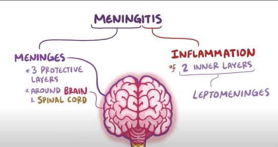

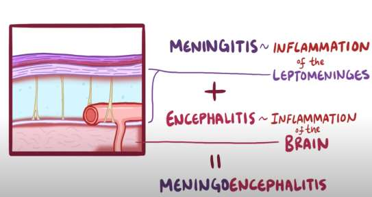

| Terim | Tanım |
|---|---|
| **Menenjit** | Leptomeninksler (araknoid + pia mater) inflamasyonu |
| **Ensefalit** | Beyin parankiminin inflamasyonu |
| **Meningoensefalit** | Hem meningeal hem parankimal tutulum |

### Menenjit Sınıflandırması

**Etkene göre:**
* **Aseptik** (= viral menenjit): Bakteriyel etken saptanmaz
* **Bakteriyel**

**Süreye göre:**
* **Akut**
* **Kronik** (>4 hafta devam eden)

---

## PATOFİZYOLOJİ

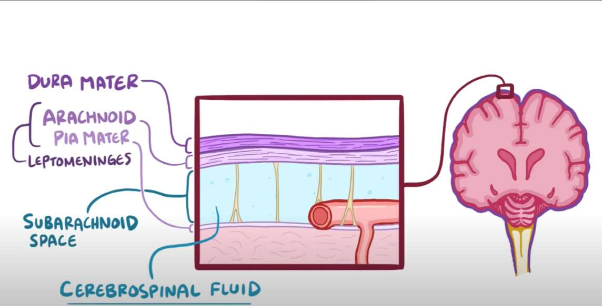

### Bulaş Yolları

```
        Hematojen Yol                              Direkt Yol
             ↓                                         ↓
  Bakteriyel kolonizasyon                   • Cilt, burun, kulak enfeksiyonu
  (nazofarinks / cilt)                      • Anatomik defekt
             ↓                                 → Travma / Kırık
  Kan dolaşımı enfeksiyonu                     → Konjenital
             ↓                                 → Cerrahi
  Kan-beyin bariyerini geçme                • BOS kaçağı
             ↓                              • Medikal cihazlar (şant, implant)
  Subaraknoid boşlukta inflamasyon
             ↓
  Nöronal ve duyusal hasar
```

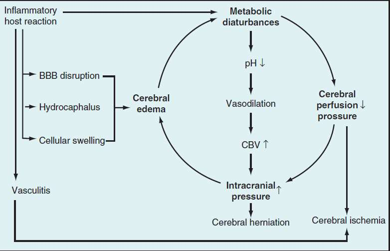

---

## BAKTERİYEL MENENJİT ETKENLERİ

Sağlıklı çocuklarda tüm dünyada en sık 3 etken:
1. **Streptococcus pneumoniae**
2. **Neisseria meningitidis**
3. **Haemophilus influenzae tip b (Hib)**

⚠️ Hib ve pnömokok aşılaması sonrası insidanslarında belirgin azalma!

### Yaş Gruplarına Göre Etkenler

| Bakteri | <1 ay | 1-3 ay | >3-35 ay | 3-9 yaş | 10-18 yaş |
|---|---|---|---|---|---|
| **S. pneumoniae** | %1-4 | %14 | %45 | %47 | %21 |
| **N. meningitidis** | %1-3 | %12 | %34 | %32 | %55 |
| **Grup B Streptokok** | %50-60 | %39 | %11 | %5 | %8 |
| **L. monocytogenes** | %2-7 | - | - | - | - |
| **E. coli** | %20-30 | - | - | - | - |

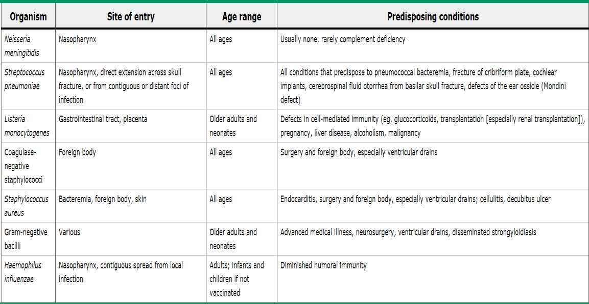

---

## RİSK FAKTÖRLERİ

### Kolaylaştırıcı Faktörler

* Çok küçük yaş (özellikle yenidoğan)
* İmmün yetmezlik (kompleman eksikliği, immünsüpresif ilaç, malignite)
* Splenektomi
* Yakın dönemde menenjit geçiren bireyle temas
* Yakın dönemde ÜSYE, ASYE, infektif endokardit geçirme
* Meningokokal hastalık açısından endemik bölgelere seyahat
* Penetran kafa travması
* Otore/rinore (konjenital defektler, Mondini displazisi)
* Koklear implant
* Anatomik defektler (dermal sinüs, üriner sistem anomalileri)
* Yakın dönemde nöroşirürji ameliyatı (VP şant)
* Kronik sistemik hastalık (diyabet, renal yetmezlik)

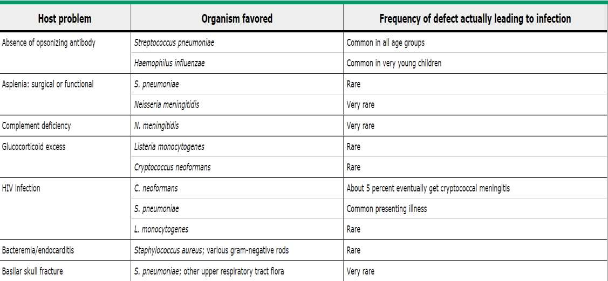

---

## KLİNİK BULGULAR

⚠️ Klinik yaşa göre değişken, **patognomonik belirti yoktur!**

### Seyir Tipleri

1. **Progresif seyir:** Birkaç gün içinde gelişir, öncesinde ateşli hastalık olabilir
2. **Akut ve fulminan seyir:** Sepsis ve menenjit bulguları birkaç saatte ortaya çıkar, ağır beyin ödemi eşlik eder

### Genel Semptomlar

* Ateş, başağrısı
* Bulantı, kusma
* İrritabilite, iştahsızlık
* Konfüzyon, bilinç değişikliği
* Sırt ağrısı ve ense sertliği

> Klasik tablo: **Ateş + meningeal inflamasyon bulguları + bilinç değişiklikleri** (<%45 hastada)

⚠️ Başvuruda koma olması **kötü prognostik** bulgudur!

### İnfantta Klinik

* ⚠️ **Nonspesifik belirtiler!**
* Vücut sıcaklığı değişiklikleri (hipo/hipertermi %60; normotermi %40)
* Beslenme değişiklikleri (azalma, kusma)
* Bilinç değişiklikleri (huzursuzluk, avutulamama, yüksek sesle ağlama, uykulu/güçsüz)
* Nöbet (%20-50)
* **Fontanel dolgunluğu/kabarıklığı** ("kafada yumru tarifi")
* İshal, solunum sıkıntısı
* ⚠️ **Ense sertliği nadir!**

### Büyük Çocukta Klinik

* Ateş, başağrısı
* Bilinç değişikliği (letarji, irritabilite, konfüzyon)
* Fotofobi
* Bulantı-kusma, sırt ağrısı, ense sertliği
* Nöbet (%20 tanı öncesi, %25 hastanede yatarken — genellikle kompleks; Hib ve pnömokok ile sık)
* 💡 **Antibiyotik kullanımını sorgula!** (Kültürü etkiler)

---

## FİZİK MUAYENE

### İnfantta Fizik Muayene

* Vital bulgular ve genel görünümü değerlendir (taşikardi, takipne sık)
* Aktivitede azalma, apati, etrafa ilgisizlik
* **Fontanel dolgunluğu**, sütürlerde ayrılma
* Nörolojik bulgular: irritabilite, letarji, hipotoni, nöbetler
* Dolaşım bozukluğu ve solunum sıkıntısı bulguları sık
* Cilt bulguları: peteşi, purpura, DİK
* **Baş çevresi ölçümü** (KİBA için günlük takip!)
* Ense sertliği muayenesi yapılmalı

### Büyük Çocukta Fizik Muayene

* Bilinç, vital bulgular ve genel görünüm değerlendirilir
* **Glasgow Koma Skalası** ile bilinç takibi
* Ense sertliği, Kernig (+), Brudzinski (+)
* Nöbet? Fokal nörolojik bulgu? (parezi, kraniyal sinir felci)
* **KİBA değerlendir:**
  * ⚠️ **Cushing triadı** (hipertansiyon, bradikardi, solunum depresyonu) → **geç bulgudur!**
  * Papilödem, diplopi, kraniyal sinir (3, 4, 6) felci
* Cilt bulguları, diğer enfeksiyon odakları

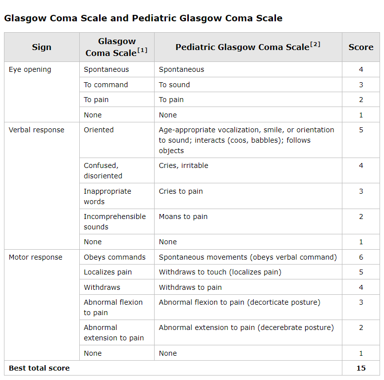

---

## MENİNGEAL İRRİTASYON BULGULARI

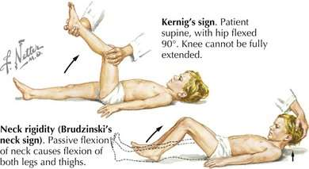

| Bulgu | Teknik |
|---|---|
| **Ense sertliği** | Çenenin göğüs ön duvarına değdirilememesi, boynun pasif hareketlerinde kısıtlılık |
| **Kernig bulgusu** | Kalça 90° fleksiyonda iken diz tam olarak ekstansiyona getirilemez |
| **Brudzinski bulgusu** | Boyun pasif fleksiyonda iken her iki bacak kalça ve dizden fleksiyona gelir |

* Tanı anında çocuk hastaların **%60-80**'inde MİB mevcut
* ❌ Komada veya fokal/difüz nörolojik defisiti olan hastalarda MİB ortaya çıkmayabilir
* ❌ Küçük çocuklarda MİB hastalığın geç döneminde ortaya çıkabilir

### Ense Sertliği Yapabilen Diğer Durumlar

* Servikal lenfadenit (Kawasaki dahil), retrofaringeal apse
* Üst lob pnömonileri
* Kas spazmları, miyozit
* Klavikula kırığı, boyun ve kafa yaralanmaları
* Konjenital durumlar (tortikollis, iskelet malformasyonları)
* Beyin ve spinal kord tümörleri
* Subaraknoid kanama, psödotümör serebri
* Distonik reaksiyon, Sandifer sendromu

---

## TANISAL YAKLAŞIM

### Kan Tetkikleri

* SIADH açısından elektrolit takibi
* Lökosit: sıklıkla normal (yüksek veya düşük)
* ⚠️ Trombositopeni!
* CRP, prokalsitonin (viral-bakteriyel ayrımı **yaptırmaz**, seri CRP izlemde kullanılabilir)
* Koagülasyon, D-dimer, fibrinojen (DİK?)
* Laktat
* **İki ayrı kan kültürü** (%50-90 pozitif; antibiyotik yoksa!)

### Kime Kraniyal BT Çekelim?

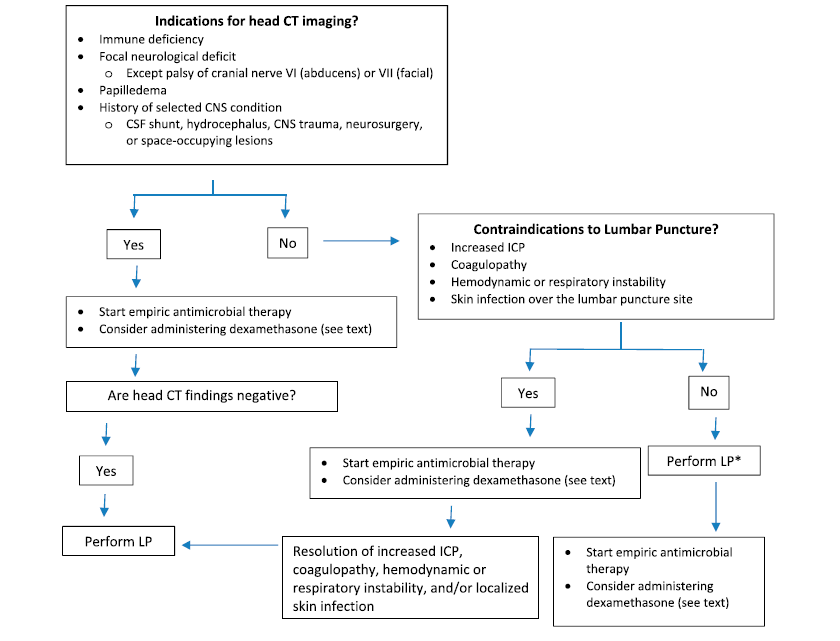

* Herniasyon riski / KİBA
* İmmün yetmezlik
* Sağ-sol şantlı kalp hastalığı
* SSS ile ilişkili durumlar (şant, hidrosefali, SSS travması, beyin cerrahisi, kafa içi yer kaplayan lezyon)

**⚠️ KİBA bulguları:**
* Bilinç değişikliği
* Dekortike veya deserebre postür
* Fokal nörolojik bulgular / nöbet
* Anormal pupil muayenesi
* Papilödem
* Cushing triadı

### LP Kontrendikasyonları

* Kafa içi basınç artışı (herniasyon riski)
* Kanama riski (INR >1,4; trombosit <50.000)
* Hemodinamik veya respiratuar instabilite
* LP alanına cilt enfeksiyonu
* Spinal anormallikler

> ⚠️ Tomografi endikasyonu varsa veya LP kontrendike ise **antibiyotiği geciktirme!**
> (Meningokoklar 15 dk - 2 saatte, pnömokoklar ~10 saatte steril oluyor)

### Lomber Ponksiyon

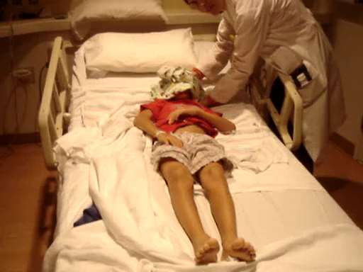

* **L3-L4** arasından girilir (superior iliac crest laterali)
* Komplikasyonlar: postspinal başağrısı, epidermoid tümör, enfeksiyon, serebral herniasyon (KİBA varsa!), spinal hematom

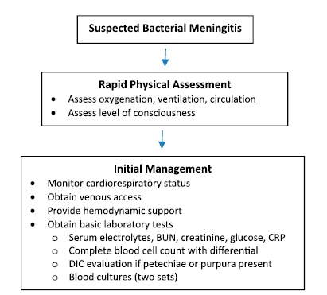

---

## BOS BULGULARI

### BOS İncelemesinde Bakılanlar

* Hücre sayımı ve tipi
* Glukoz, protein, eş zamanlı kan şekeri
* Gram boyama
* Kültür
* Viral ve bakteriyel PCR

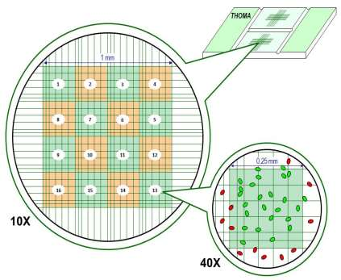

### Normal BOS Bulguları (>3 ay çocuklarda)

* Hücre sayısı: **<6 WBC/mm³** (PMNL **hiç olmamalı**)
* Glukoz: **>45 mg/dL**
* Protein: **<45 mg/dL**

> ⚠️ Ateşi olan bir çocukta tek bir PMNL görülse bile kültür sonuçları çıkana kadar **antibiyotik tedavisi başlanmalıdır!**

**1, 2 ve 3. aylarda BOS bulguları:**
* Hücre sayısı: 6 / 3 / 3 hücre/mm³
* Protein: 75 / 59 / 40 mg/dL

💡 Travmatik LP'de hücre sayımı önemsenmez; protein, glukoz, gram boyama ve kültür sonuçları değerlendirilir.

### SSS Enfeksiyonlarında BOS Bulguları Karşılaştırması

| BOS Bulgusu | Viral Menenjit | Bakteriyel Menenjit | Viral Ensefalit | Parsiyel Tedavi Edilmiş | Fungal Menenjit | TBC Menenjiti |
|---|---|---|---|---|---|---|
| **Lökosit/mm³** | <1000, lenfosit hakim | >1000, PMNL hakim | Nadir >1000, PML hakim | >1000, PMNL hakim | <500, lenfosit hakim | <300, erken PMNL → sonra lenfosit |
| **Protein (mg/dL)** | N veya <100 | >100-150 | N | 60 - >100 | >100-200 | >200-300 |
| **Glukoz (mg/dL)** | N | <40 | N | <40-N | <40 | <40 |
| **Kan/BOS glukoz oranı** | N | <0,4 | N | <0,4 | <0,4 | <0,4 |

---

## ANTİBİYOTERAPİ

### Antibiyotik Seçim Prensipleri

* **Bakterisidal** olmalı
* **Kan-beyin bariyerini geçmeli** (inflamasyon ile geçiş artar, **mutlaka IV verilmeli!**)
* Yeterli BOS düzeyine ulaşmalı
* Olası etkenlere etkili olmalı:
  * Aşılı çocuklarda → N. meningitidis ve S. pneumoniae
  * Eksik aşılı/aşısız → Hib
  * <3 ay infantlarda → GBS, E. coli, L. monocytogenes

### Ampirik Antibiyoterapi

**Çocuklarda (>3 ay):**

| İlaç | Doz | Hedef Etkenler |
|---|---|---|
| **Seftriakson** | `100 mg/kg/gün IV, 2 dozda (maks: 4 g/gün)` | N. meningitidis, S. pneumoniae, Hib, GBS, E. coli |
| veya **Sefotaksim** | `300 mg/kg/gün IV, 3-4 dozda (maks: 12 g/gün)` | Aynı spektrum |
| **+ Vankomisin** | `60 mg/kg/gün IV, 4 dozda (maks: 4 g/gün)` | Dirençli pnömokoklar, S. aureus |

**<3 ay infantlarda ek olarak:**

| İlaç | Doz | Hedef Etkenler |
|---|---|---|
| **+ Ampisilin** | `300 mg/kg/gün IV, 3-4 dozda (maks: 12 g/gün)` | GBS, L. monocytogenes |

### Tedavi Süresi

> Prensip: Uygun antibiyotiğin **ateşsiz en az 5 gün** veya toplamda **en az 7-10 gün**

| Etken | Süre |
|---|---|
| **N. meningitidis** | 7 gün |
| **H. influenzae** | 10 gün |
| **S. pneumoniae** | 10-14 gün |
| **Grup B Streptokok** | 10-14 gün |
| **S. aureus** | En az 14 gün |
| **L. monocytogenes** | 14-21 gün |
| **Gram (-) enterik basiller** | 21 gün veya BOS steril olduktan sonra 14 gün |

---

## DEKSAMETAZON KULLANIMI

* **Hib menenjiti** için endike
* Risk analizi yapılarak **>6 hafta** çocuklarda **pnömokok menenjitinde** de verilebilir
* ⚠️ Antibiyotiğin **ilk dozundan 1 saat önce** ya da ilk dozdan sonraki **ilk 1 saat içinde** verilmeli (daha geç verilirse faydası yok!)
* **Doz:** `Deksametazon 0,15 mg/kg/doz, her 6 saatte bir, 2 gün süreyle`
* Hib menenjitinden sonra **işitme kaybı** dışında uzun dönem komplikasyonları ve mortaliteyi olumlu etkilemez

---

## KOMPLİKASYONLAR VE PROGNOZ

### Komplikasyonlar

| Akut | Subakut | Kronik |
|---|---|---|
| Şok | Uygunsuz ADH sekresyonu (SIADH) | ⭐ **İşitme kaybı** (en sık geç komplikasyon) |
| Dehidratasyon | Konvülsiyonlar | Ataksi |
| Beyin ödemi | Subdural efüzyon/ampiyem | Konuşma bozukluğu |
| DİK | Beyin absesi | Görme anomalileri |
| Asidoz | Persistan ateş | Öğrenme güçlükleri |
| Hipoglisemi | Hemiparezi/quadriparezi | Motor gelişme bozukluğu |
| | | Konvülsif hastalıklar |
| | | Hidrosefali, diabetes insipidus |

> ⚠️ **Sağırlık tedaviden bağımsızdır!** Erken tanı ve uygun tedavi başlansa bile çoğu hastada **engellenemiyor**. Mutlaka taburculuk sırasında ve sonrasında **işitme ve gelişim kontrolleri** yapılmalıdır.

### Kontrol LP Endikasyonları

* İlk 24 saatte klinik düzeldiyse kontrol LP'ye **gerek yok**
* **Neonatal menenjitte** tedavinin 24-48. saatinde kontrol LP yapılmalı
* Beklenen antibiyotiğin 24-36. saatinde klinik yanıt alınamadıysa yapılmalı
* Antibiyotik dirençli mikroorganizmayla menenjitte 48-72. saatte bakteriyel sterilizasyon gösterilmeli

### Kötü Prognostik Faktörler

* Küçük yaş
* Mikroorganizmanın tipi (özellikle **pnömokok**) ve yüksek inokülasyon miktarı (>10⁷ CFU/mL)
* Tanı anında düşük Glasgow koma skoru
* Antibiyotik başladıktan **>72 saat** sonra hâlâ süren nöbetler
* Düşük BOS glukozu
* BOS sterilizasyonu için geçen zamanın uzaması
* Malnütrisyon

### Takip Sırasında

* Yakın vital bulgu, bilinç ve nöbet takibi
* Optimal sıvı dengesi
* Günlük nörolojik muayene
* <18 ay çocuklarda **günlük baş çevresi takibi**
* SIADH açısından: serum elektrolitleri, vücut ağırlığı, idrar volümü ve dansitesi

---

## İZOLASYON VE ÖNLEME

### İzolasyon

* Standart izolasyon önlemleri → tüm hastalar için
* **Damlacık izolasyonu** → N. meningitidis ve Hib
  * Tedavinin 24 saati dolana dek
  * Ayrı oda
  * Hastane personeli cerrahi maske ile yaklaşacak (<1 m)

### Kemoproflaksi

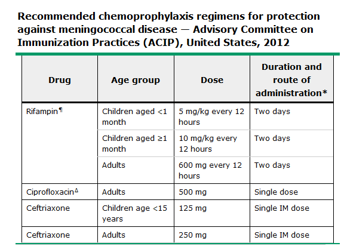

### Aşılar

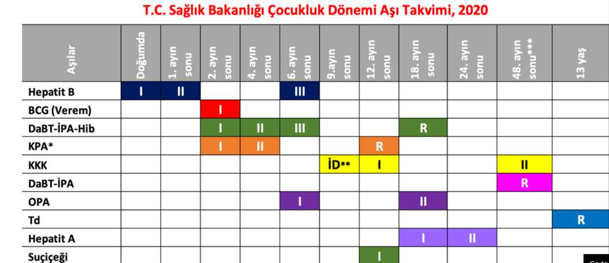

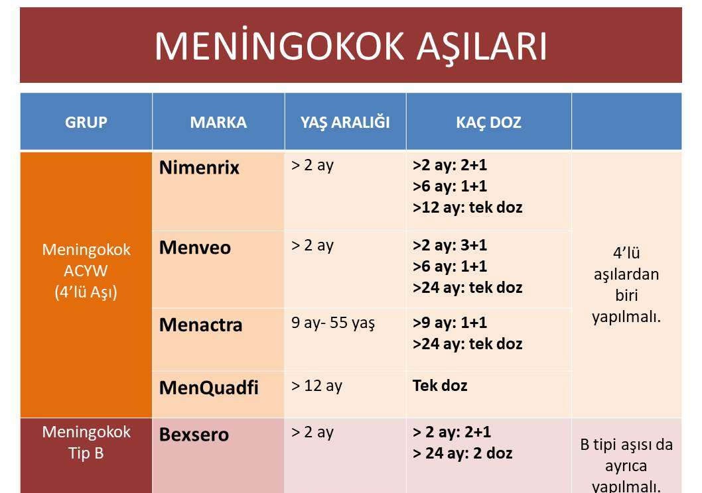

* ⭐ **Pnömokok, Hib ve meningokok aşılamaları** her çocuğa önerilmelidir

---

## ASEPTİK (VİRAL) MENENJİT

### Tanım

* Akut başlar, kendi kendini sınırlar
* Ateş, MİB ile karakterize
* BOS'ta mononükleer pleositoz + normal/hafif artmış protein
* Bakteriyolojik olarak **steril BOS**

> ⭐ **Enterovirüsler** tüm aseptik menenjitlerin **%85**'inde etkendir!

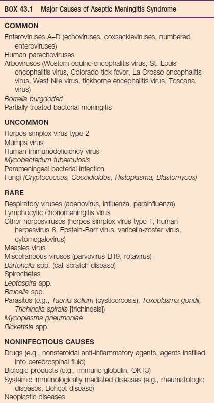

### Viral Menenjit – Ensefalit Farkı

| Özellik | Viral Menenjit | Viral Ensefalit |
|---|---|---|
| **Tutulum** | Meningeal | Parankim |
| **Bilinç** | Korunmuş | Bilinç değişiklikleri |
| **Nörolojik bulgular** | Yok | Nöbetler, kraniyal sinir felçleri, paraliziler, anormal refleksler |

> ⚠️ Virüsler genellikle **meningoensefalit** yapar!

### Klinik

* Yaşa, bağışıklık durumuna ve etkene göre değişir
* Bakteriyel menenjite benzer ama **daha hafif**
* Ateş, başağrısı, irritabilite
* Bulantı, kusma, ishal
* Döküntü, konjunktivit
* Fotofobi, MİB semptom ve bulguları
* Fontanel bombeliği
* ❌ Fokal nörolojik disfonksiyon yok
* Diğer sistem tutulumlarıyla ilgili bulgular olabilir (miyokardit, perikardit, el-ayak-ağız hastalığı)

### Laboratuvar

* BOS'ta pleositoz (+) ancak bakteri üremesi yok
* BOS lökosit: birkaç hücre – birkaç bin hücre (ortalama 100-500 hc/mm³)
* İlk etapta PMNL hakim → sonrasında **lenfosit** hakim
* BOS proteini hafif artmış/N, BOS glukoz N
* ⚠️ **BOS analizi tam olarak virüs-bakteri ayrımı yaptırmaz!**
* Viral çalışma (viral kültür, PCR) gönderilmeli

### Tedavi

> ⚠️ Her hasta **öncelikle bakteriyel menenjit gibi** ele alınmalıdır!

* Hastanede yatış gerekir
* Destek tedavisi: sessiz sakin bir odada istirahat
* Asetaminofen verilebilir (❌ aspirin verilmez)
* İntravenöz sıvı desteği
* **Ampirik tedavi:** HSV veya TBC düşünülürse başlanabilir
* Ampirik antibiyotikler: bakteriyel menenjit şüphesi varsa sonuçlar çıkana kadar verilir

### Prognoz

* Çoğu tamamen iyileşir (TBC menenjiti ve parameningeal enfeksiyonlar hariç)
* Enteroviral menenjit **benign seyirli**
* Bilateral audiometri önerilir

---

## ENSEFALİTLER

### Tanım

> **Ensefalit:** Beyin parankiminin inflamasyonu → Ateş + başağrısı + **nörolojik disfonksiyon**

* Mental durum, davranış ve kişilik değişikliği
* Motor ya da duyusal defisitler, konuşma ve hareket bozuklukları
* Hemiparezi ve parestezi, nöbetler
* Çoğu hastada meningeal inflamasyon da mevcut → **meningoensefalit**

| | |
|---|---|
| En sık ensefalit etkeni | **Enterovirüsler** |
| Mortalitesi en yüksek ensefalit etkeni | **Herpes virüsler** |

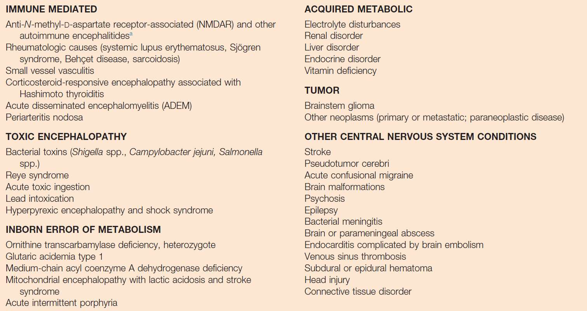

### Klinik (Yaş, İmmünite, Etkilenen Beyin Alanına Göre)

**Yenidoğan ve bebekler:**
* Nonspesifik klinik
* Ateş, nöbet, emmede zayıflık, irritabilite, letarji, dolaşım bozukluğu
* Sistemik enfeksiyon dışlanmalı

**Büyük çocuk ve ergenler:**
* Ateş
* Lokalize nörolojik değişiklikler (hemiparezi, kraniyal sinir defektleri)
* Psikiyatrik semptomlar, duygusal labilite
* Hareket bozuklukları, ataksi
* Nöbetler, stupor, letarji, koma

### Etkenlere Göre Klinik Özellikler

**Enterovirüsler (Coxsackie virüsler, EV71):**
* Aseptik menenjit, ensefalit, el-ayak-ağız hastalığı, rombensefalit

**Epstein-Barr virüs:**
* İnfeksiyöz mononükleoz, serebellar ataksi, Alice Harikalar Diyarında sendromu

**Herpes simplex virüs (HSV) tip 1 ve 2:**
* HSV-1 → reaktivasyon sonrası ensefalit
* HSV-2 → yenidoğanlarda
* **Temporal lob** nöbetleri (apraksi, dudak şapırdatma), koku halüsinasyonları, davranış anormallikleri

**Kızamık virüsü:**
* Kızamık inklüzyon cisimciği ensefaliti: enfeksiyondan **1-6 ay** sonra
* **SSPE** (Subakut sklerozan panensefalit): enfeksiyondan **>5 yıl** sonra → progresif demans, miyoklonus, nöbetler → ölüm

**Kuduz virüsü:**
* Aşıyla önlenebilir
* Isırık yerinde parestezi
* Ensefalitik form: hidrofobi, ajitasyon, deliryum
* Paralitik form: asendan paralizi

### Tanı

* Stabilizasyon, monitorizasyon
* Detaylı anamnez, fizik inceleme
* LP **şart!** → BOS hücre sayımı, glukoz, protein, gram boyama, bakteri kültürü, **HSV PCR**, enterovirüs PCR
* **EEG** en kısa sürede çekilmeli
* En iyi görüntüleme: **MRG** (mümkün değilse BT)

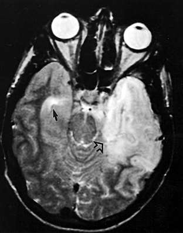

### Karakteristik BOS Bulguları

* BOS WBC: 0-500 hc/µL arası, **lenfosit hakimiyeti** (ancak ilk 24-48 saatte nötrofil hakim!)
* BOS pleositozu erken dönemde veya immün yetmezliklilerde **olmayabilir**
* RBC genelde yok → **varsa:** travmatik LP / HSV / La Crosse / başka nekrotizan ensefalit
* Protein düzeyi hafif yüksek (genelde <150 mg/dL)
* Glukoz normal ya da hafif azalmış (HSV ve kabakulakta ılımlı azalma olabilir)

### Klinik Olarak Olası Ensefalit Tanısı

Başka nedeni olmayan **24 saatten uzun süren bilinç değişikliği** + aşağıdakilerden **≥2'si:**

* Başvurudan önceki veya sonraki 72 saat içinde ateş ≥38°C
* Önceden var olan nöbet bozukluğuna bağlanamayan genel veya kısmi nöbetler
* Yeni başlayan fokal nörolojik bulgular
* BOS pleositozu
* Nörogörüntülemede akut ensefaliti düşündüren beyin bulgusu
* EEG'de ensefalit ile uyumlu anormallik

### Tedavi

* **Destek tedavisi:** Solunum desteği, mayi, antipiretikler, antiepileptikler, anti-ödem tedavisi (deksametazon veya mannitol)
* **Ampirik IV asiklovir** (HSV PCR (+) ise **21 gün** süreyle)
* Grip sezonunda influenza A-B için **oseltamivir**
* VZV → asiklovir
* EBV → asiklovir denenebilir
* CMV → gansiklovir

### Kötü Prognostik Faktörler

* Akut dönemde koma, konvülsiyon veya fokal nörolojik bulgular
* Genç yaş (<5 yaş)
* Yoğun bakım gereksinimi
* **HSV ensefaliti**
* MRG'de difüzyon kısıtlılığı
* Mortalite en yüksek olanlar: **HSV** ve Eastern equine encephalitis virüsleri

### Komplikasyonlar

* Status epileptikus, serebral ödem
* Uygunsuz ADH sendromu
* Kardiyorespiratuar yetmezlik
* HSV'de DİK
* Öğrenme problemleri, gelişme geriliği, davranış problemleri
* Motor defisitler, görme defektleri, işitme bozukluğu

> ⚠️ HSV mortalite ve morbiditesi oldukça yüksek. Asiklovir tedavisi erken başlanan olgularda bile yüksek oranda **nöropsikiyatrik sekeller** bildirilmiştir.

---

## ÖNEMLİ MESAJLAR

* SSS enfeksiyonları mortalitesi ve morbiditesi yüksek enfeksiyonlardır
* Erken ve doğru müdahale ile tedavi mümkün
* Özellikle küçük çocuklarda klinik belirsiz olabilir
* Şüphe edildiğinde gerekli kan tetkikleri ve görüntüleme sonrası **LP ve BOS değerlendirmesi** yapılmalıdır
* Yaşa ve eşlik eden ensefalit komponentine uygun şekilde **ampirik antibiyoterapi** düzenlenmeli ve **gecikmeden** uygulanmalıdır
* İleri basamak sağlık merkezine uygun sevk sağlanmalıdır
* İzlemde **işitme kaybı**, diğer nörolojik ve gelişimsel bozukluklar takip edilmelidir
* ⭐ **Pnömokok, Hib, meningokok aşılamaları** her çocuğa önerilmelidir

---

## ÇIKMIŞ SORULAR

### 2. Blok - Soru 1

**Çocuklarda viral ensefalitin en sık etkeni nedir?**

A) EBV
B) CMV
C) VZV
D) Enterovirüs
E) HSV ✅

> **💡 Açıklama:** **HSV** (özellikle HSV-1) çocuklarda **sporadik viral ensefalitin en sık** nedenidir. Temporal lob tutulumu karakteristiktir. Tedavide IV asiklovir 14-21 gün verilir. Tedavisiz mortalite %70-80'dir. ⚠️ Dikkat: En sık *ensefalit* etkeni enterovirüsler olsa da, *sporadik* ve *mortalitesi en yüksek* ensefalit etkeni HSV'dir. Soru "viral ensefalitin en sık etkeni" olarak HSV'yi doğru cevap kabul etmiştir.

***

### 3. Blok - Soru 9

**Bakteriyel menenjitli hastada deksametazonun verilmesinin amacı nedir?**

A) Sıvı dengesini sağlamak
B) BOS glukozunu yükseltmek
C) Nöbet sıklığını azaltmak
D) İşitme kaybı ve nörolojik sekel oranını azaltmak ✅
E) Kan beyin bariyerini güçlendirmek

> **💡 Açıklama:** Deksametazon özellikle **Hib menenjitinde** endikedir ve >6 hafta çocuklarda pnömokok menenjitinde de verilebilir. Amacı **işitme kaybı ve nörolojik sekel** oranını azaltmaktır. Antibiyotiğin ilk dozundan **1 saat önce** veya ilk dozdan sonraki **1 saat içinde** verilmeli; daha geç verilirse faydası yoktur. Doz: `0,15 mg/kg/doz, 6 saatte bir, 2 gün`.

***

### 3. Blok - Soru 10

**Aşağıdakilerden hangisi yenidoğan menenjiti için risk faktörü değildir?**

A) Erken membran rüptürü
B) Apgar skorlaması 1. dakikada 6, 5. dakikada 9 ✅
C) 28. gebelik haftasında doğum
D) 1000 gram doğum
E) Annede ateş, lökositoz, taşikardi olması

> **💡 Açıklama:** Yenidoğan menenjiti risk faktörleri: prematürite, düşük doğum ağırlığı, erken membran rüptürü (>18 saat), koryoamniyonit (annede ateş, lökositoz, taşikardi). Apgar skoru 1. dk 6, 5. dk 9 olan bebek hızlı adaptasyon göstermiş demektir → bu durum menenjit risk faktörü **değildir**. 28 haftalık doğum (çok preterm) ve 1000 g doğum (aşırı düşük doğum ağırlığı) ise önemli risk faktörleridir.
