# ÇOCUKLARDA TÜBERKÜLOZ VE BRUSELLA

**Hazırlayan:** Prof. Dr. Soner S. Kara
**Bölüm:** ADÜ Tıp Fakültesi - Çocuk Enfeksiyon Hastalıkları

**UÇEP Kategorisi:** Tüberküloz TT-K-İ, Ekstrapulmoner TBC ÖnT

---

## İÇİNDEKİLER

1. [Giriş ve Epidemiyoloji](#giriş-ve-epidemiyoloji)
2. [Etken](#etken)
3. [Bulaş Yolları](#bulaş-yolları)
4. [Patogenez ve İmmünite](#patogenez-ve-i̇mmünite)
5. [Çocuk Tüberkülozunda Evreler](#çocuk-tüberkülozunda-evreler)
6. [Klinik Bulgular](#klinik-bulgular)
7. [Primer Pulmoner TBC](#primer-pulmoner-tbc)
8. [Plevral Efüzyon](#plevral-efüzyon-tbc-plörezisi)
9. [Ekstrapulmoner TBC](#ekstrapulmoner-tbc)
10. [Dissemine (Miliyer) TBC](#dissemine-miliyer-tbc)
11. [Tüberkülin Deri Testi (TDT)](#tüberkülin-deri-testi-tdt)
12. [IGRA Testleri](#igra-testleri)
13. [Radyoloji](#radyoloji)
14. [Mikrobiyoloji](#mikrobiyoloji)
15. [Tedavi](#tedavi)
16. [İzolasyon](#i̇zolasyon)
17. [Brusella](#brusella)

---

## GİRİŞ VE EPİDEMİYOLOJİ

Tüberküloz (TBC) dünyada morbidite ve mortaliteye yol açan **en önemli enfeksiyöz hastalıklardan** biridir.

### Global Bakış

* Dünya nüfusunun yaklaşık **üçte birinin** TBC basili ile enfekte olduğu düşünülmektedir
* **Aktif TB:** Her yıl milyonlarca yeni olgu → buzdağının sadece ucu
* **Latent TB:** "Gizli epidemi" → dünya nüfusunun 1/3'ü enfekte

### Ülkemizde Tüberküloz

* 2017 yılı olgu sayısı: **12.046 / 81 milyon**
* İnsidans hızı: **14,6 / 100.000**

### Çocuklarda Durum

* ⚠️ Malnütrisyon, HIV ve yoksulluk riski arttırmaktadır
* TBC az görülen gelişmiş ülkelerde çocuk olguları tüm olguların **%5**'i
* TBC sık görülen gelişmekte olan ülkelerde tüm olguların **%25**'ine varan oranlar

---

## ETKEN

> **Mycobacterium tuberculosis** — Hücre duvarı lipidden zengin, aside rezistan bir basil (ARB). Aerobik, sporsuz, hareketsiz.

### Boyama Yöntemleri

* **Ziehl-Neelsen** ve **Kinyoun** boyaları
* Florokrom metodu (auramine ve rhodamine boyaları)

### Mycobacterium tuberculosis Kompleks Üyeleri

| Tür                 | Özellik                                                  |
| ------------------- | -------------------------------------------------------- |
| **M. tuberculosis** | İnsanlarda TBC'nin en sık etkeni                         |
| **M. bovis**        | BCG aşısı içerisinde yer alır; büyük baş hayvanlarda TBC |
| **M. africanum**    | Batı Afrika'da pulmoner TBC'de sık                       |
| **M. canetti**      | Nadir                                                    |

### M. bovis Hakkında Önemli Noktalar

* Pastörize olmamış süt ve süt ürünleriyle bulaşır
* GIS TBC → küçük çocuklarda ve immün yetmezliklilerde sık
* ⚠️ **İntrinsek pirazinamid direnci** mevcuttur
* M. tuberculosis ile klinik olarak ayrımı güçtür (TUS sorusu)

---

## BULAŞ YOLLARI
> sıklıkla solunum yolu ile bulaşır
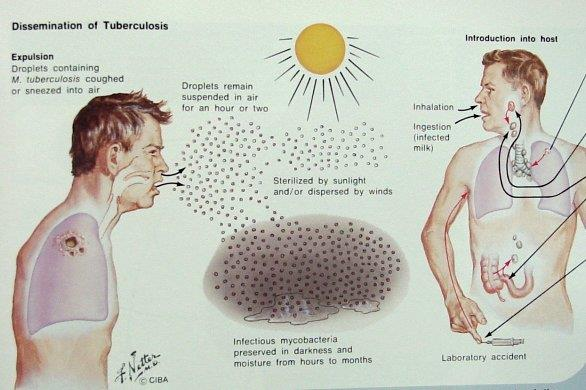

### Anneden Bebeğe Bulaş

* Umbilikal ven yoluyla
* Enfekte amniyon sıvısının aspire edilmesi veya yutulması
* 🚨 Ancak **doğum sonrası bulaş riski daha yüksektir!**

### Bulaşma Riskinin Yüksek Olduğu Durumlar

* TBC'li bireyle **yakın temas** (özellikle aile içi)
* Basil kaynağı ile birlikte geçirilen sürenin uzaması
* Kalabalık yerler (toplama kampı, sığınma evi, yurt vb.)
* Ortamda AC, bronş ya da larinks TBC olan kişi
* Balgamda **ARB (+)** kişi
* Aerosol oluşturan tıbbi işlemler (bronkoskopi, balgam indüksiyonu vb.)
* Altta yatan hastalığı olanlar
* İV ilaç bağımlıları
> N95 maske takman lazım.

### Bulaş Riskini Azaltan Faktörler

* ✅ Ortamın havalandırılması
* ✅ UV ve güneş ışığı → canlı basil sayısını azaltır

**⚠️ ÖNEMLİ:**

* Mutlaka **aile taraması** yapılmalıdır!
* TBC olan bir çocuğun ev halkında **%1-5** ihtimalle TBC'li bir birey mevcuttur

---

## PATOGENEZ VE İMMÜNİTE

### Patogenez

```
          TB Basili İnhalasyonu
                  ↓
     ┌────────────┴────────────┐
     ↓                         ↓
 Hemen öldürülür       Primer Enfeksiyon
                              ↓
                ┌─────────────┴─────────────┐
                ↓                           ↓
     Lokalize Enfeksiyon           Dissemine Hastalık
       (Primer TBC)                  (Akut Hastalık)
                ↓
     ┌─────────┴──────────┐
     ↓                    ↓
 Stabilizasyon       Progresyon
  (Latent TBC)
     ↓
 Re-aktivasyon
 (%90 latent kalır)
```

### İmmünite

* **Hücresel immünite** çok önemlidir!
* Hücresel immünite enfeksiyondan **2-12 hafta** sonra ortaya çıkmaya başlar

**Predispozisyon yaratan nadir genetik durumlar:**

* İnterleukin 12 reseptör B1 (IL-12RB1) defekti
* İnterferon-γ (IFN-γ) aks defekti
> tusta soruluyor bu ikisi
---

## ÇOCUK TÜBERKÜLOZUNDA EVRELER

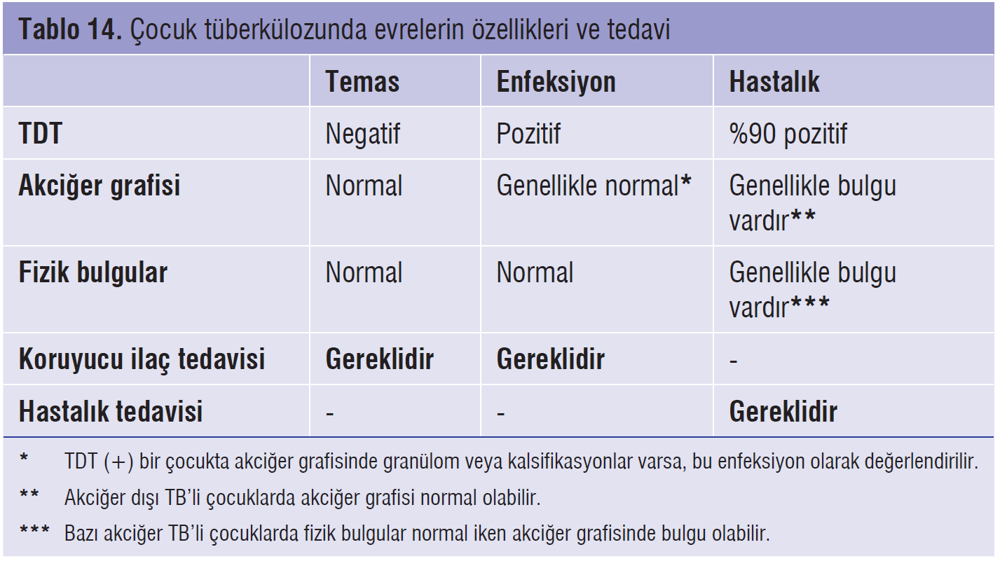

| Evre                           | TDT     | AC Grafisi                    | Bulgu | Özellik                           |
| ------------------------------ | ------- | ----------------------------- | ----- | --------------------------------- |
| **1. TEMAS**                   | Negatif | Normal                        | Yok   | TDT pozitifleşmesi ort. 8 haftada |
| **2. ENFEKSİYON (Latent TBC)** | Pozitif | Normal / Fibrotik / Kalsifiye | Yok   | Hasta değil, bulaştırıcı değil    |
| **3. HASTALIK**                | Pozitif | Patolojik                     | Var   | Primer veya Reaktivasyon          |

**🚨 KRİTİK UYARI:**

* **<5 yaş** temaslı çocuklarda TDT pozitifleşmeden, yoğun lenfohematojen yayılımla **dissemine TBC** (miliyer TBC ve TBC menenjiti) gelişebilir!
* Bu nedenle temas evresinde **<5 yaş tüm temaslı çocuklar** ve **immün yetmezliği olan tüm çocuklar** koruma tedavisi almalıdır

### Latent TBC

* Bu çocuklar hasta değil ve bulaştırıcı değil
* Tedavi edilmezlerse ileri dönemde hastalık aktif hale gelebilir
* Enfeksiyondan hastalığa ilerlemede **ilk 2 yıl** önemli
> Semptom yok ama TDT pozitif → latent TBC → koruma tedavisi başla.
### Aktif TBC Hastalığı

* Pulmoner hastalık → çocukların **%75**'inde, erişkinlerin **%85**'inde
* Pulmoner TBC genellikle enfeksiyondan **6-24 ay** içinde gelişir
* Yaş ↑ → dissemine hastalık riski ↓
* ⚠️ Ergenlikte insidans tekrar artar
* Hayat boyu reaktivasyon riski her 10 yılda **%10** ↓

---

## KLİNİK BULGULAR

### Semptomlar

* Asemptomatik olabilir
* Klinik semptomlar en sık **0-1 yaş** arasında ve **ergenlerde**
* En sık: **kronik öksürük** ve **ateş**
* Kilo kaybı, gece terlemesi, halsizlik, iştahsızlık
* Hemoptizi, eritema nodozum, konvülsiyon
> Hemoptizi en sık nedeni: ÜSYE
> 
**⚠️ ÖNEMLİ:** Asemptomatik olma olasılığı nedeniyle TDT (+) olan bir çocukta mutlaka TBC hastalığı araştırılmalıdır!

### Fizik Muayene Bulguları

* Lokalize ral ve wheezing
* Solunum seslerinde fokal azalma
* Kilo alamama ve gelişme geriliği
* LAP (lenfadenopati)
* Dissemine TBC'de HSM (hepatosplenomegali)

### Rutin Laboratuvar

* BK sayısı, CRP, ESH
* İlaçlar başlanmadan önce **KC enzimleri** ve **ürik asit**
* **⚠️ TBC saptanan hastalarda **HIV serolojisi** de bakılmalıdır (miliyer TBC)**

---

## PRİMER PULMONER TBC

> Pediatrik TBC'nin **en sık formu**

### Ghon (Primer) Kompleksi

**Ghon kompleksi** = Primer odak (genellikle AC'de) + Lenfanjit + Bölgesel LAP (genellikle hiler veya paratrakeal)

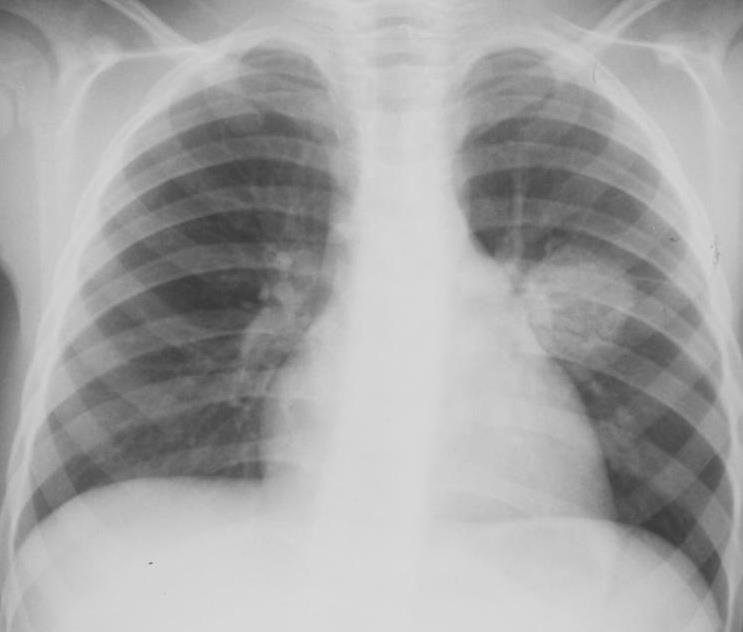

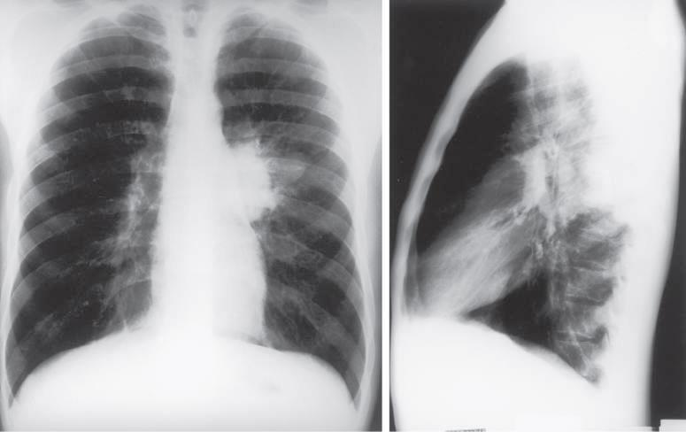
> en sık gördüğümüz ac grafisi bu. LAP
> 
**💡 Primer TBC'li çocuklar bulaştırıcı değildir:**

* Az sayıda TBC basili
* ARB **%95** oranında negatif
* Balgam kültürü **%60** oranında negatif
* Genellikle balgam çıkaramazlar. *Ergenlik döneminden sonra bulaşıcı olabiliyor balgam çıktığı için.*

### Primer Progresif AC TBC

* Lokal progresif hastalık → nadir fakat **ciddi**
* Primer odak ortasında kazeöz odak gelişir
* Basil dolu kaviteden çevre bronşlara açılarak AC içerisinde disseminasyon oluşur
* Öksürük, yüksek ateş ve konstitüsyonel semptomlar sık
* ✅ Uygun tedavi ile komplikasyonsuz düzelebilir

### Latent / Reaktivasyon AC TBC

* **Erişkin TBC tipi** → adölesanlarda sık görülür
* AC **üst loblarda** infiltrasyon veya kavitasyon
* 🚨 **Bu form bulaşıcıdır!**
* ✅ Uygun tedaviyle prognoz oldukça iyi

---

## PLEVRAL EFÜZYON (TBC PLÖREZİSİ)

* Basilin plevral boşluğa geçişiyle oluşur
* **<6 yaş** nadir
* Büyük efüzyonlar aylar-yıllar sonra gelişir

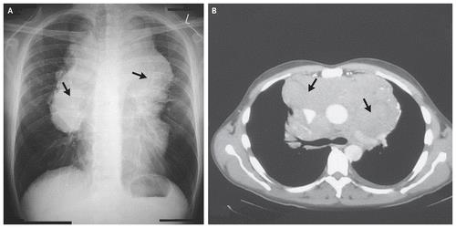

### Klinik

* Ani başlangıç
* Ateş, nefes darlığı, göğüs ağrısı
* Azalmış solunum sesleri
* Radyolojik düzelme aylar sonra
* ⚠️ Kronik olgularda **skolyoz** komplikasyonu gelişebilir

---

## EKSTRAPULMONER TBC

* Çocuklarda daha sık → **%25**
* Basil, bölgesel lenf nodlarından **lenfatik ve hematojen** yayılımla ekstrapulmoner organlara yayılır

```
     LENFATİK VE HEMATOJEN YAYILIM

    İSKELET               AKCİĞER

    BÖBREK      ← BASİL →   LENF NODU

    MENİNKS                  MİLİYER
```

### Tutulum Zamanlaması

| Form                              | Süre                                  |
| --------------------------------- | ------------------------------------- |
| **Miliyer ve TBC menenjiti**      | Enfeksiyondan 2-6 ay sonra (en erken) |
| **Lenf nodu / Endobronşiyal TBC** | 3-9 ay                                |
| **Kemik ve eklem TBC**            | Yıllar (tedavisiz çocukların %5'inde) |
| **Renal TBC**                     | 5-25 yıl sonra                        |

### TBC Lenfadeniti (Skrofula)

* ⭐ **En sık ekstrapulmoner TBC formu**
* En sık **baş-boyun bölgesinde**
* Ağrısız, soliter, hareketsiz, sert olmayan, genelde tek taraflı
* Beta-laktam antibiyotiklere **yanıtsız** LAP
* TDT genelde pozitif, PAAG genelde normal
* Kesin tanı: histopatolojik/mikrobiyolojik inceleme

> AMA en çok korktuğumuz miliyer TBC.
### SSS Tüberkülozu

Çocuklardaki **en ciddi** TBC komplikasyonlarından biri. Fatalite yüksek.

```text
**3 klinik form:**

1. TBC menenjiti
2. Tüberkülom
3. Spinal TBC
```

#### TBC Menenjiti

* En sık görüldüğü yaş: **6 ay - 4 yaş**
* En sık tutulan kraniyel sinirler: **3, 6 ve 7**
* Hidrosefali, vaskülit, enfarktlar ve serebral ödem
* SIADH gelişip elektrolit imbalansına neden olabilir

**Semptomlar 3 evrede değerlendirilir:**

| Evre        | Bulgular                                                                        | Prognoz              |
| ----------- | ------------------------------------------------------------------------------- | -------------------- |
| **1. Evre** | 1-2 hafta nonspesifik (ateş, başağrısı, iritabilite). Fokal nörolojik bulgu yok | ✅ Çok iyi            |
| **2. Evre** | Letarji, ense sertliği, nöbet, Kernig-Brudzinski (+), kraniyel sinir felçleri   | ⚠️ Orta               |
| **3. Evre** | Koma, hemi/parapleji, deserebre postür, vital bozulma                           | ❌ Ağır sekeller/ölüm |

**BOS bulguları:**

| Parametre    | Değer                                        |
| ------------ | -------------------------------------------- |
| Hücre sayısı | 10-500 hücre/μL (erken PMNL, sonra lenfosit) |
| Glukoz       | <40 mg/dL (bazen <20 mg/dL)                  |
| Protein      | 400-5000 mg/dL                               |

* Hastaların **%50**'sinde TDT negatif, PAAG normal olabilir
* ARB, TBC kültürü, PCR negatif olabilir!
* En sık geç dönem bulgu: baziler tutulum + komünikan hidrosefali

#### Tüberkülom

* Kazeöz tüberküllerin tümör şeklinde birleşmesi → beyin tümörüyle karıştırılır
* Tek ya da multipl
* En sık: baş ağrısı, fokal nörolojik bulgular, konvülsiyonlar
* İlk 1 hafta tedaviye **kortikosteroidler** eklenir (beyin ödemini azaltmak için)

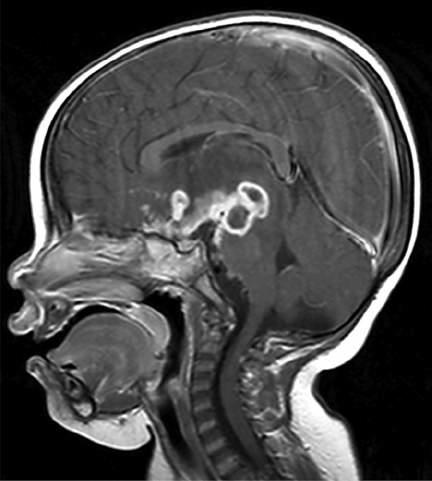

### Kas-İskelet TBC

* En sık **vertebralar** tutulur
* **Pott hastalığı:** Vertebral korpuslar destrükte olur → gibbus deformitesi ve kifoz gelişir
* İskelet TBC'si tüberkülozun **geç komplikasyonudur**
* Tedavide medikal tedavi yeterlidir

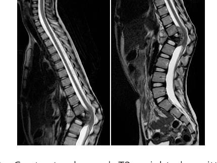

### Diğer Ekstrapulmoner Formlar

| Form                | Özellik                                                                        |
| ------------------- | ------------------------------------------------------------------------------ |
| **TBC perikarditi** | En sık kardiyak tutulum; konstriktif perikardit → perikardiyektomi gerekebilir |
| **TBC peritoniti**  | Palpasyonda irregüler ağrısız kitle; karın ağrısı, asit, ateş                  |
| **TBC enteriti**    | En sık jejunum, ileum (Peyer plakları) ve apendiks                             |
| **GÜS TBC**         | Nadir, inkübasyon yıllar sürer; steril piyüri ve mikroskobik hematüri          |

---

## DİSSEMİNE (MİLİYER) TBC

* Lenfohematojen yolla yayılır
* En sık **bebeklerde** görülür; nadiren ergenlerde
* Dalak, KC, cilt tutulumu
* En sık lezyonlar: AC'ler, dalak, KC ve kemik iliği

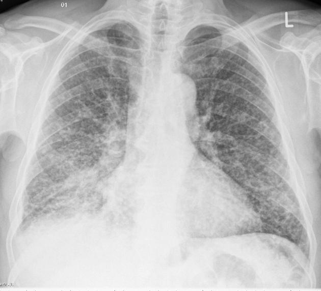

### Klinik Özellikler

* Klinik akut olabileceği gibi, yavaş ve gürültüsüz de ilerleyebilir
* Multipl organ tutulumu: HSM, lenfadenit, cilt lezyonları
* Menenjit veya peritonit → **%20-40** hastada
* Cilt lezyonları: papülonekrotik tüberkülidler, nodüller, purpura
* TDT hastaların **%40**'ında pozitif
* Hastalar genelde **nedeni bilinmeyen ateş** ile başvurur
* ⭐ En önemli ipucu: **TBC bireyle temas öyküsü**
> **TBC nin en sık tutulum şekli lenfadenit**
>

### Koroid Tüberkül

* Miliyer TBC'nin **geç dönem göz bulgusu**
* %13-87 hastada saptanır → **diagnostik** değer taşır

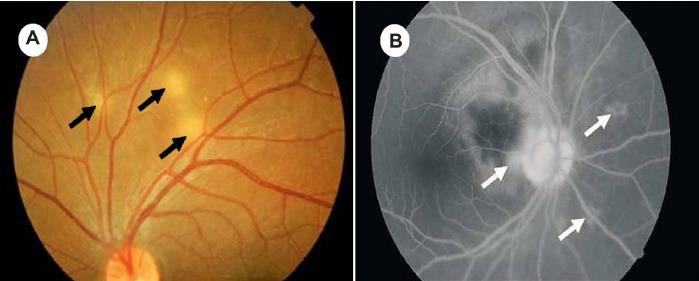

### Seyir

* Ateş 2-3 haftada düşer
* PAAG bulguları **aylar** sonra düzelir
* KC ve Kİ biyopsisi erken dönemde tanısal

---

## TÜBERKÜLİN DERİ TESTİ (TDT)

> PPD (Purified Protein Derivative), Mantoux TDT — **Gecikmiş tipte (Tip IV) aşırı duyarlılık reaksiyonu**

* TBC basiliyle enfekte kişilerde reaksiyon gelişir
* Tedavi sonrası **negatifleşmez** → tedavi başarısını değerlendirmekte kullanılmaz

### Uygulama

* Tercihen ön kolun 2/3 iç yüzüne **0,1 mL** PPD solüsyonu **intradermal** enjekte edilir
* Enjeksiyon sonrası 6-10 mm çapında kabarıklık oluşmalı
* **48-72 saat** sonra değerlendirilir (96. saate kadar değerlendirilebilir)
* ❌ Eritem ölçülmez → ✅ **Endürasyon** ölçülür
* Tüm reaksiyonlar **milimetre** olarak kaydedilir

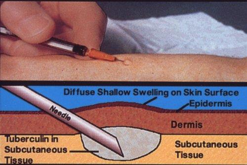

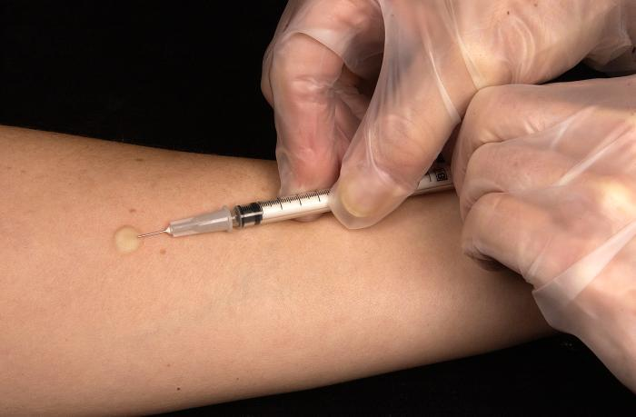

**⚠️ ÖNEMLİ:**

* Test uygun yapılmadıysa hemen tekrar edilmelidir
* İlk 24 saatte gelişen alerjik reaksiyonlar pozitiflik olarak değerlendirilmez
* BCG aşısı sonrasında oluşan PPD reaksiyonu aşının koruyuculuğunu göstermez

### TDT Yorumu

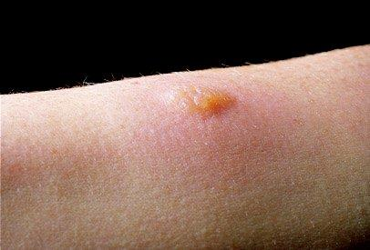

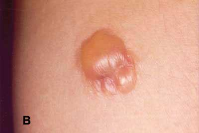

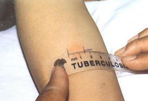

| Durum                         | Pozitiflik Eşiği |
| ----------------------------- | ---------------- |
| BCG **aşısız** çocuk          | ≥**10 mm**       |
| BCG **aşılı** çocuk           | ≥**15 mm**       |
| İmmün yetmezlikli (HIV dahil) | ≥**5 mm**        |

### TDT Yalancı Negatiflik (%10-40)

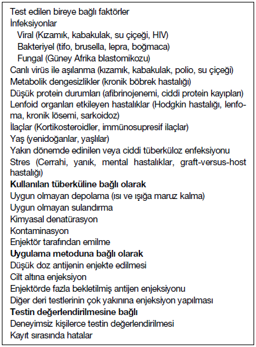

* ⚠️ Negatif deri testi TBC hastalığını **ekarte ettirmez!**
* Aktif TBC hastalarında PPD **%25**'e varan oranlarda yalancı negatif
* Özellikle miliyer ve menenjit TBC gibi ağır formlarda (sonradan pozitifleşebilir)

### TDT Yalancı Pozitiflik Nedenleri

* NTM enfeksiyonu
* BCG aşısı → yanlış yorum
* Booster (duyarlandırma) etkisi

**💡 Not:** Herkese test yapılmamalıdır! TBC'li hasta ile bilinen/tahmin edilen temas öyküsü varsa yapılmalıdır. **Rutin TDT taraması önerilmez.**

---

## IGRA TESTLERİ

> Interferon-Gamma Release Assays — IFN-γ tabanlı testler

Daha önce TBC ile karşılaşan hastaların T hücrelerinden **M. tuberculosis** antijenlerine (**ESAT-6**, **CFP-10**, **TB7.7**) özgü salgılanan IFN-γ miktarını ölçer.


### İki Ticari Tip

| Test                         | Prensip                                                          |
| ---------------------------- | ---------------------------------------------------------------- |
| **QuantiFERON-TB Gold PLUS** | ELISA temelli, tam kanda IFN-γ düzeyi ölçümü                     |
| **T-SPOT.TB**                | ELISPOT temelli, IFN-γ salgılayan lenfosit/monosit sayısı ölçümü |

### IGRA'ların Avantajları

* ✅ BCG ile **çapraz reaksiyon göstermez** (ESAT-6 ve CFP-10 BCG'de yoktur)
* ✅ Pek çok NTM ile çapraz reaksiyon göstermez (4 NTM hariç: M. kansasii, M. szulgai, M. marinum, M. flavescens)

### PPD - IGRA Ortak Özellikleri

* Her ikisi de TBC enfeksiyon/hastalık ayrımı **yapamaz**
* İmmün yetmezliklilerde her ikisi de dikkatli yorumlanmalı

### Test Tercihi

| Durum                                          | Tercih               |
| ---------------------------------------------- | -------------------- |
| **<5 yaş** çocuk                               | PPD                  |
| **≥5 yaş**, BCG yapılmış çocuk                 | IGRA                 |
| ≥5 yaş, PPD için gelmesi riskli çocuk          | IGRA                 |
| İlk IGRA sonucu sınırda                        | PPD veya IGRA        |
| İlk test negatif + TBC/progresyon riski yüksek | PPD ve IGRA birlikte |

---

## RADYOLOJİ

**⚠️ ÖNEMLİ:** Mutlaka `ön-arka ve yan` AC grafileri birlikte çekilmelidir (primer odak ve LAP açısından)!

### Radyolojik Bulgular

* PPD pozitifleştiği anda grafilerde primer kompleks saptanabilir
* Sıklıkla **hiler, paratrakeal ve subkarinal** lenf nodları tutulur
* Bütün loblar eşit oranda tutulabilir
* ❌ Apikal kaviter lezyonlar (erişkin reaktivasyon) çocuklarda **görülmez**

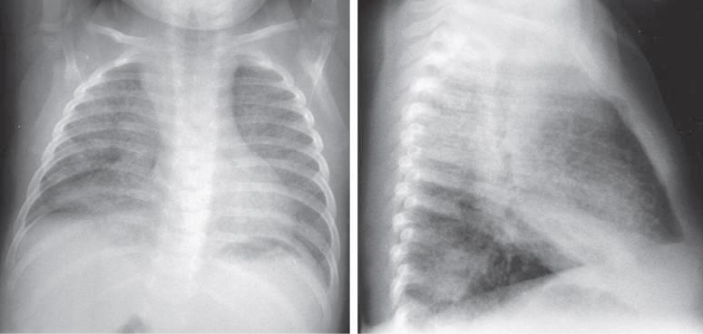

### Diğer Radyolojik Bulgular

| Bulgu               | Özellik                                            |
| ------------------- | -------------------------------------------------- |
| **Atelektazi**      | Büyümüş lenf nodlarının bronşa basısı ile          |
| **Hiperinflasyon**  | Nadiren bronş tıkanmasına bağlı                    |
| **Plevral efüzyon** | Daha çok adölesan yaşta                            |
| **Miliyer pattern** | 2-3 mm büyüklüğünde multipl nodüller               |
| **Kalsifikasyon**   | Hiler LAP genellikle 6. aydan sonra kalsifiye olur |

**💡 Önemli Notlar:**

* BT → düz grafilerde gözlenemeyen parankimal nodüller ve LAP'leri saptayabilir
* AC grafisi normal olan hastalara BT **önerilmez**
* Başarılı tedaviye rağmen hiler LAP **2-3 yıl** kalabilir
* Tedavinin kesilmesi için normal radyolojik kontrole gerek yoktur

---

## MİKROBİYOLOJİ

### Örnek Alma

* **Balgam** veya **açlık mide suyu** örneklerinde basil aranır
* Duyarlılığı artırmak için örneklerin **3 gün arka arkaya** alınması önerilir
* Diğer yöntemler: bronkoskopik lavaj, indüksiyon ile uyarılmış balgam

> **💡 Bilgi Düşümü: Açlık Mide Suyu (AMS) Nedir ve Neden Tercih Edilir?**
> * **Neden Alınır?** Küçük çocuklar (özellikle <5 yaş) balgam çıkaramazlar ve refleks olarak solunum yollarındaki sekresyonları (dolayısıyla TBC basillerini) yutarlar. Gece boyunca yutulup midede biriken bu basil içeren balgamı yakalamak için AMS alınır.
> * **Nasıl Alınır?** Hasta sabah uyanır uyanmaz, henüz yataktan kalkmadan, hareket etmeden ve **hiçbir şey yiyip içmeden önce** (genellikle 8-10 saatlik açlık sonrası) bir nazogastrik tüp vasıtasıyla mideye girilerek biriken sıvı enjektörle çekilir. 
> * **Önemli Nokta:** Mide asidinin pH'ı çok düşüktür ve uzun süre temas ederse TBC basillerini öldürebilir veya kültürde üremesini bozabilir. Bu nedenle alınan örnek hiç bekletilmeden laboratuvara ulaştırılmalı ve hemen nötralize edilmelidir. Duyarlılığı artırmak için rutin olarak birbirini izleyen 3 sabah (3 ardışık gün) alınır.
### Sonuçlar

| Yöntem                         | Duyarlılık                                 | Süre        |
| ------------------------------ | ------------------------------------------ | ----------- |
| **ARB (asidorezistan basil)**  | Çocuklarda %5-10                           | Hızlı sonuç |
| **Kültür (Löwenstein-Jensen)** | 3 gün arka arkaya alınan örneklerde %30-40 | 6-8 hafta   |
| **BACTEC**                     | Daha yüksek                                | Daha hızlı  |
| **PCR**                        | Değişken                                   | Hızlı       |

**⚠️ ÖNEMLİ:**

* ARB pozitifliği kesin M. tuberculosis olduğunu göstermez (NTM'de de pozitiftir)
* PCR negatif çıkması TBC'yi **ekarte ettirmez**, pozitif çıkması da kesin hastalığı göstermez

### Diğer Tanı Yöntemleri

* Biyopsi: kazeifiye granülomlar ve ARB görülmesi çok değerli
* Plevral sıvıda **ADA (Adenozin Deaminaz)** yüksekliği → TBC tanısını destekler (≥40 Ü daha değerli; ADA2 izoenzimi daha spesifik)

> Herhangi bir çocukta TDT (+) ve TBC hastalığı ile uyumlu fizik ve radyolojik bulgular varsa → **TBC hastalığı**

---

## TEDAVİ

* Hastanın yaşı ne kadar küçükse yaygınlaşma olasılığı o kadar yüksek → **en kısa sürede tedaviye başlanmalı**
* Çocuğu enfekte eden erişkin hastanın mümkünse **kültür ve ilaç direnci** sonuçları bilinmeli
* 💡 Çocuklarda TBC ilaç yan etkileri çok daha az görülür

### 1. Koruyucu Tedavi (Temas ve Enfeksiyon Evresinde)

| Durum                         | İlaç                | Doz                           | Süre        |
| ----------------------------- | ------------------- | ----------------------------- | ----------- |
| Standart                      | İzoniazid (INH)     | `10 mg/kg/gün (maks: 300 mg)` | **6 ay**    |
| INH direnci varsa             | Rifampisin (RIF)    | `10 mg/kg/gün (maks: 600 mg)` | **4 ay**    |
| Çok ilaca dirençli TBC teması | Birden fazla ilaçla | Kişiye özel                   | Kişiye özel |
| İmmün yetmezlik               | İzoniazid (INH)     | `10 mg/kg/gün (maks: 300 mg)` | **9 ay**    |

### 2. Kombine Tedavi (TBC Hastalığında)

#### Pulmoner TBC (Standart)

```
İlk 2 ay (Yoğun faz):  INH + RIF + PZA (üçlü)
Sonra 4 ay (İdame faz): INH + RIF (ikili)
─────────────────────────────────────────────
Toplam:                  6 ay
```

* Her ay poliklinik kontrolü

#### Ekstrapulmoner TBC (Kemik-Eklem, Miliyer, SSS)

```
İlk 2 ay (Yoğun faz):  INH + RIF + PZA + EMB/SM (dörtlü)
Sonra 7-10 ay (İdame):  INH + RIF (ikili)
─────────────────────────────────────────────
Toplam:                  9-12 ay
```

### Anti-TBC İlaç Dozları

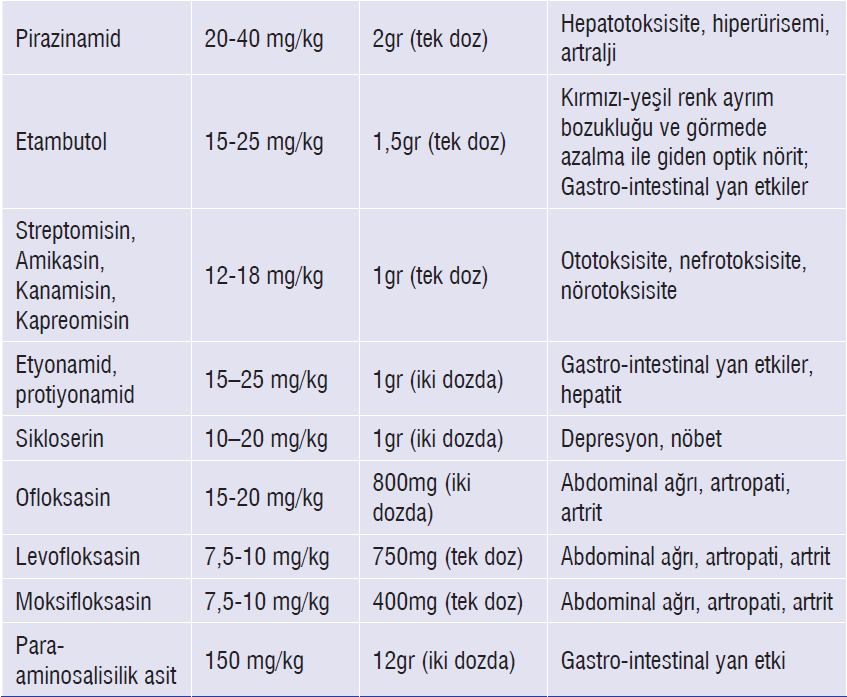

### İlaç Yan Etki Takibi (INH ve RIF)

* Alerji öyküsü olanlarda kontraendike

**İlaçların kesilmesi gereken durumlar:**

* Semptom ± transaminazlar **5X** ↑
* Hepatit semptomu + transaminazlar **3X** ↑
* Başka belirgin neden yokken bilirubin >**1,5 mg/dL**

### Kortikosteroid Endikasyonları

Aşağıdaki durumlarda tedaviye kortikosteroid eklenir:

* TBC menenjiti
* Perikard ve plevra tüberkülozu (antiinflamatuar etki)
* Miliyer TBC (hipoksi geliştiyse)
* Peribronşial ve endobronşial TBC (bronş basısını azaltmak için)

**Doz:** `Prednizolon 1-2 mg/kg/gün`, 14 gün verilir → 4-8 hafta içinde doz azaltılarak kesilir

### Tedavi Takibi ve Sonuçlar

* ✅ **2/3** hasta: radyolojik olarak sekelsiz iyileşir
* ⚠️ **1/3** hastada: fibrozis, kalsifikasyon, bronşiektazi
* Tedavi sonrasında çocuklarda **%20-50** kalsifikasyon (+)
* Radyolojik düzelme: %40'ında 6 ayda, %30'unda 1 yılda, geri kalanında daha uzun sürede
* 💡 Tam radyolojik düzelme olmaması tedavi süresinin uzatılması için bir neden **değildir**

---

## İZOLASYON

⚠️ Özellikle preadölesan dönemdeki çocuklar genellikle **bulaştırıcı kabul edilmez!**
> ergenlikten sonra bulaştırıcıdır.
> 
**İzolasyon gerektiren durumlar:**

* Kaviter AC TBC
* Balgamda ARB (+)
* Laringeal tutulum
* Yaygın AC tutulumu
* Orofaringeal işlem yapılan kongenital TBC yenidoğanlar

---

## BRUSELLA

### Etken

> **Brucella** — Aerobik, küçük, hareketsiz, gram-negatif kokobasil

| Tür               | Kaynak      |
| ----------------- | ----------- |
| **B. abortus**    | Sığır       |
| **B. melitensis** | Koyun, keçi |
| **B. suis**       | Domuz       |
| **B. canis**      | Köpek       |

### Epidemiyoloji

* ⚠️ **Ülkemiz bruselloz açısından endemiktir!**
* Risk grupları: çiftçiler, hayvancılık yapanlar, veterinerler, kasaplar, laboratuvar personeli
* İnkübasyon süresi: temas sonrası **3-4 hafta** (<1 hafta - birkaç ay)

### Bulaş Yolları

* Enfekte hayvanların düşük materyallerine temas
* ****Pastörize olmamış süt** ve süt ürünleri tüketimi**
* Kontamine aerosollerin inhalasyonu
* Nadiren insandan insana (transplasental, anne sütü, kan transfüzyonu)

### Klinik Bulgular

Hastalık **herhangi bir organ sistemini** tutabilir. `Ama en çok tuttuğu yerler kemik, eklem.`

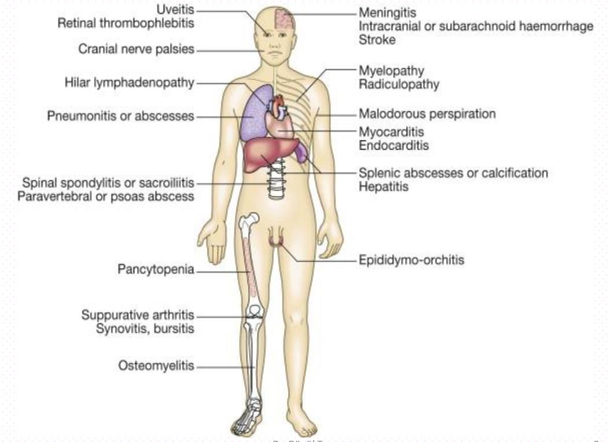

**Nonspesifik yakınmalar:**

* Ateş, gece terlemesi, halsizlik
* İştahsızlık, yorgunluk, kilo kaybı
* Artralji, miyalji, karın ağrısı, başağrısı

**Fizik muayene:** LAP, HSM, artrit

* ⭐ **En sık komplikasyon:** Osteoartiküler tutulum
* ⚠️ Gebelikte bruselloz → spontan abortus, preterm doğum, ölü doğum, fetal ölüm

### Tanı

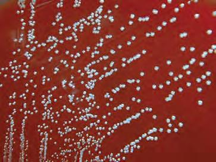

* **Detaylı öykü şart!** (Hayvan teması, pastörize olmamış süt tüketimi)
* Kesin tanı: etkenin kan, kemik iliği veya diğer dokularda **gösterilmesi** (PCR veya kültür)
* ⚠️ Kültür için klinisyen laboratuvarı **uyarmalı**, kültürler en az **3 hafta** inkübe edilmeli!
* En sık tanı yöntemi: **Seroloji** → Serum aglütinasyon testleri ≥**1/160** titrede veya ≥2 hafta arayla en az **4 kat** titre artışı

### Tedavi

| Yaş Grubu  | Tedavi                                                 | Süre              |
| ---------- | ------------------------------------------------------ | ----------------- |
| **<8 yaş** | `TMP-SMX + Rifampisin`                                 | En az **6 hafta** |
| **≥8 yaş** | `Doksisiklin + Rifampisin / Streptomisin / Gentamisin` | En az **6 hafta** |

**Komplike olgularda (endokardit, menenjit, spondilit, osteomiyelit):**

* **3'lü tedavi**, süre **4-6 ay**

**⚠️ ÖNEMLİ:**

* Tedavi süresi uzun olmalı ve **kombine tedavi** verilmelidir
* Nörobrusellozda steroid endikasyonu **yoktur**

---

## ÇIKMIŞ SORULAR

### 1. Blok - Soru 33

**13 yaşında erkek hasta 1 aydır devam eden inatçı ateş, kuru öksürük, gece terlemesi ve kilo kaybı şikayetleriyle geliyor. Akciğer grafisinde üst lobda kaviter lezyon ve TDT 18 mm saptanıyor. Aşağıdakilerden hangisi bulaştırıcılık açısından en fazla endişe verir?**

A) TDT > 15 mm
B) Kilo kaybı
C) Balgamda ARB pozitifliği ✅
D) Gece terlemesi
E) Ailede temas olması

> **💡 Açıklama:** Çocuklar genellikle **paucibacillary** (az basilli) oldukları için bulaştırıcı kabul edilmezler. Ancak kaviter lezyon varlığında basil yükü artar ve **balgamda ARB pozitifliği** bulaştırıcılığın en önemli göstergesidir. TDT yüksekliği yalnızca enfeksiyonu gösterir, bulaştırıcılık hakkında bilgi vermez. Kaviter AC TBC, balgamda ARB (+) ve laringeal tutulum **izolasyon gerektiren** durumlardır.

***

### 2. Blok - Soru 13

**10 yaşında erkek hasta ateşi ve öksürüğü var. Daha önce 2 defa pnömoni tanısı almış. Amoksisilin-klavulanik asit kullanmasına rağmen bir işe yaramamış. Önceki AC grafileriyle karşılaştırıldığında hiler LAP saptanıyor. Ara ara gece terlemesi oluyor. Akciğerde konsolidasyon alanları saptanıyor. Ailede TBC öyküsü yok. 2 ay önce dedesi benzer sebeplerden hastanede yatmış. TDT pozitif, BCG skar izi var. Ön tanı ve onu destekleyen en güçlü bulgu nedir?**

A) Primer akciğer tüberkülozu: antibiyotik kullanımına rağmen uzun süre iyileşememe ve hiler LAP görülmesi ✅
B) Viral pnömoni
C) Atipik pnömoni
D) Astım
E) Bakteriyel pnömoni

> **💡 Açıklama:** Primer pulmoner TBC'nin önemli ipuçları: ① **Antibiyotiğe yanıtsız pnömoni** (standart tedaviye rağmen düzelmeyen pnömoni TBC düşündürmelidir), ② **Hiler lenfadenopati** (primer TBC'nin en karakteristik radyolojik bulgusu), ③ **TDT pozitifliği**, ④ **Temas öyküsü** (dedede benzer yakınmalar → kaynak olgu olabilir). Ailede "TBC öyküsü yok" denilmesi yanıltmamalı; dede henüz tanı almamış bir TBC hastası olabilir.

***

### 3. Blok - Soru 11

**Altı yaşında çocuk, BCG aşısı 4 yaşında yapılmış, babada AC TBC var, çocuğun her şeyi normal ama TDT 17 mm. En olası sebep nedir?**

A) BCG aşısı sebebiyle yalancı pozitif
B) Primer pulmoner TBC hastası
C) TBC teması
D) TBC enfeksiyonu ✅
E) Aktif ekstrapulmoner TBC

> **💡 Açıklama:** BCG aşısı yapılmış çocuklarda TDT yorumu önemlidir. BCG aşısına bağlı reaksiyon genellikle **10 mm'nin altında** kalır ve zamanla azalır. TDT ≥**15 mm** olan BCG'li çocuklarda reaksiyon aşıya değil, **gerçek M. tuberculosis enfeksiyonuna** bağlıdır. Babada AC TBC olması → temas var. Çocuğun klinik ve radyolojik bulguları normal → **hastalık yok**. Sonuç: TBC enfeksiyonu (latent TBC) → **koruyucu tedavi** (INH 10 mg/kg/gün, 6 ay) endikasyonu vardır.
