# ATEŞLİ ÇOCUĞA YAKLAŞIM - ALGOR İTMALAR

**Bölüm:** Genel Pediatri
**Format:** Mermaid Flowcharts

---

## İÇİNDEKİLER

1. [Tanımlar: Ateş vs Hipertermi](#tanımlar-ateş-vs-hipertermi)
2. [Ateş Ölçüm Yöntemleri](#ateş-ölçüm-yöntemleri)
3. [Ana Karar Ağacı](#ana-karar-ağacı)
4. [Yenidoğan (0-28 Gün) Algoritması](#yenidoğan-0-28-gün-algoritması)
5. [29-90 Gün Algoritması](#29-90-gün-algoritması)
6. [Düşük Risk Kriterleri (Boston/Philadelphia/Pittsburgh/Rochester)](#düşük-risk-kriterleri)
7. [3-36 Ay Algoritması](#3-36-ay-algoritması)
8. [İBE Risk Faktörleri](#ibe-risk-faktörleri)
9. [Antipiretik Tedavi](#antipiretik-tedavi)
10. [Normal Vital Bulgular](#normal-vital-bulgular)

---

## TANIMLAR: ATEŞ VS HİPERTERMİ

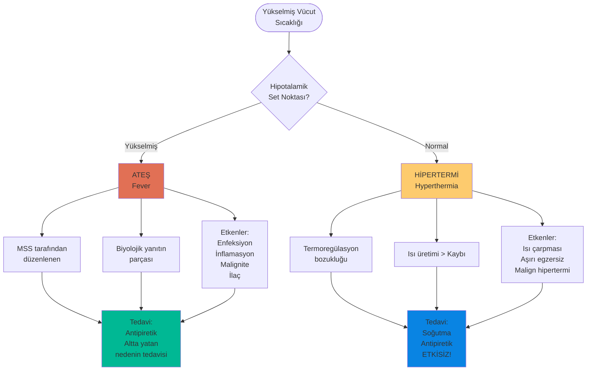

---

## ATEŞ ÖLÇÜM YÖNTEMLERİ

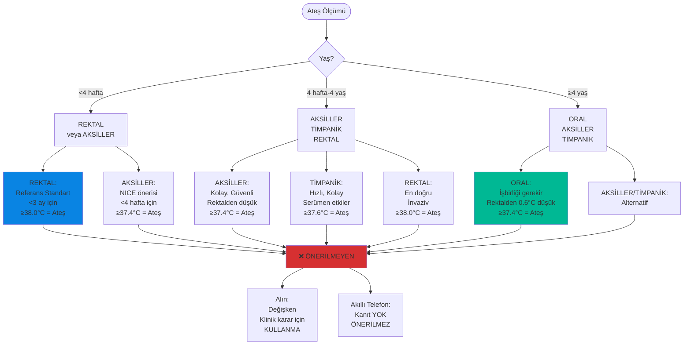

---

## ANA KARAR AĞACI

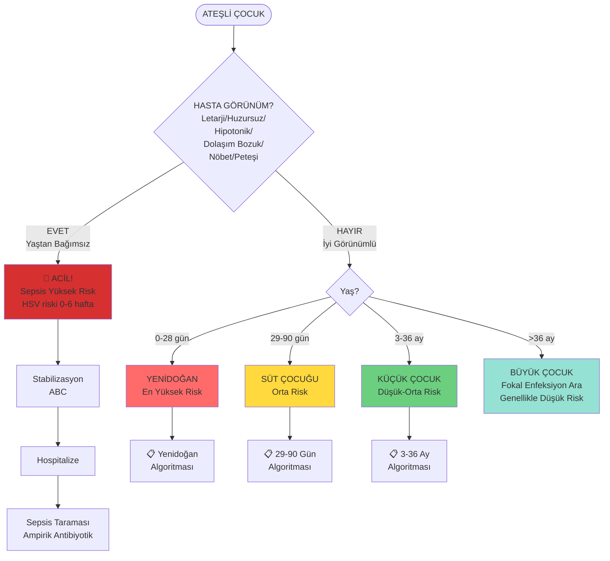

---

## YENİDOĞAN (0-28 GÜN) ALGORİTMASI

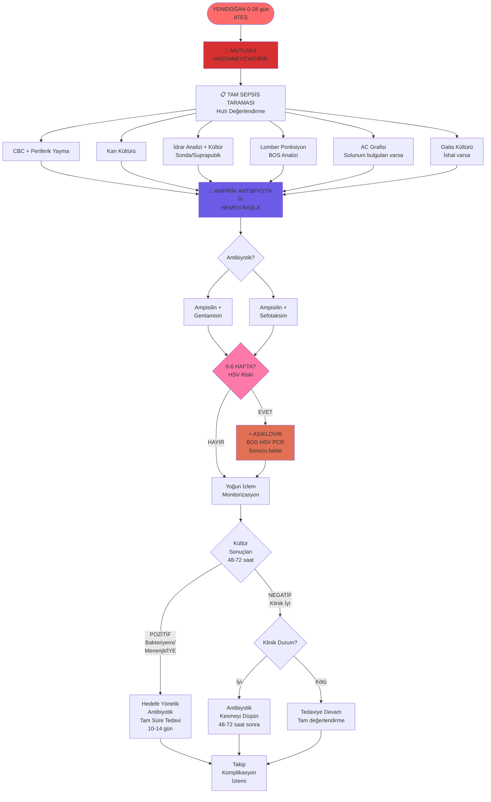

---

## 29-90 GÜN ALGORİTMASI

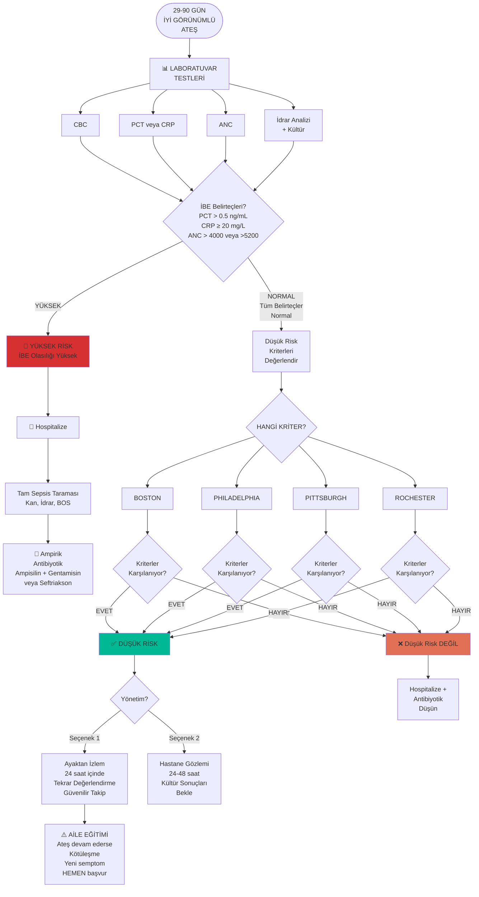

---

## DÜŞÜK RİSK KRİTERLERİ

### BOSTON KRİTERLERİ

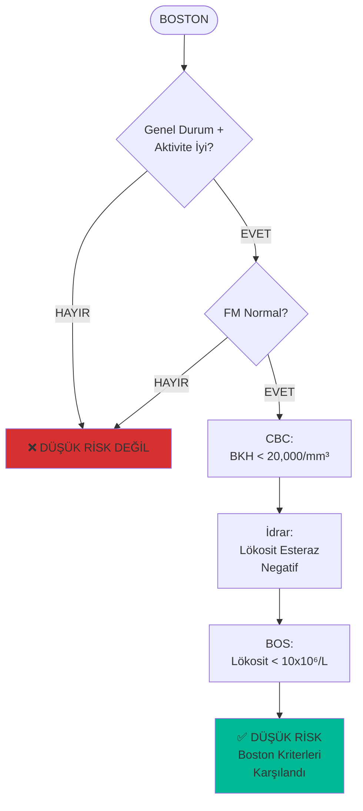

### PHILADELPHIA PROTOKOLÜ

```mermaid
flowchart TD
    Start([PHILADELPHIA]) --> C1{Genel Durum +<br/>Aktivite İyi?}
    C1 -->|EVET| C2{FM Normal?}
    C1 -->|HAYIR| Fail

    C2 -->|EVET| C3[CBC:<br/>BKH < 15,000/mm³<br/>İmmatür/Total<br/>Nötrofil < 0.2]
    C2 -->|HAYIR| Fail

    C3 --> C4[İdrar:<br/>BKH < 10/hpf<br/>Gram Boyama (-)]

    C4 --> C5[BOS:<br/>BKH < 8/mm³<br/>Gram Boyama (-)]

    C5 --> C6[AC Grafi:<br/>İnfiltrasyon (-)]

    C6 --> C7[Gaita:<br/>Eritrosit (-)<br/>Bol Lökosit (-)<br/>İshalde]

    C7 --> Pass[✅ DÜŞÜK RİSK<br/>Philadelphia<br/>Karşılandı]

    Fail[❌ DÜŞÜK RİSK DEĞİL]

    style Pass fill:#00b894
    style Fail fill:#d63031
```

### PITTSBURGH REHBERİ

```mermaid
flowchart TD
    Start([PITTSBURGH]) --> C1{Genel Durum +<br/>Aktivite İyi?}
    C1 -->|EVET| C2{FM Normal?}
    C1 -->|HAYIR| Fail

    C2 -->|EVET| C3[CBC:<br/>BKH 5,000-15,000/mm³<br/>Çomak < 1500/mm³]
    C2 -->|HAYIR| Fail

    C3 --> C4[İdrar:<br/>BKH < 9/mm³<br/>Gram Boyama (-)]

    C4 --> C5[BOS:<br/>BKH < 5/mm³<br/>Gram Boyama (-)<br/>Travmatize LP:<br/>BKH/KKH < 1:500]

    C5 --> C6[AC Grafi:<br/>İnfiltrasyon (-)]

    C6 --> C7[Gaita:<br/>BKH < 5/hpf<br/>İshalde]

    C7 --> Pass[✅ DÜŞÜK RİSK<br/>Pittsburgh<br/>Karşılandı]

    Fail[❌ DÜŞÜK RİSK DEĞİL]

    style Pass fill:#00b894
    style Fail fill:#d63031
```

### ROCHESTER KRİTERLERİ

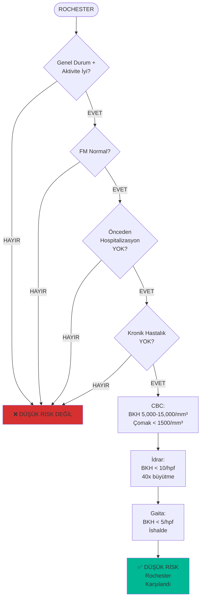

---

## 3-36 AY ALGORİTMASI

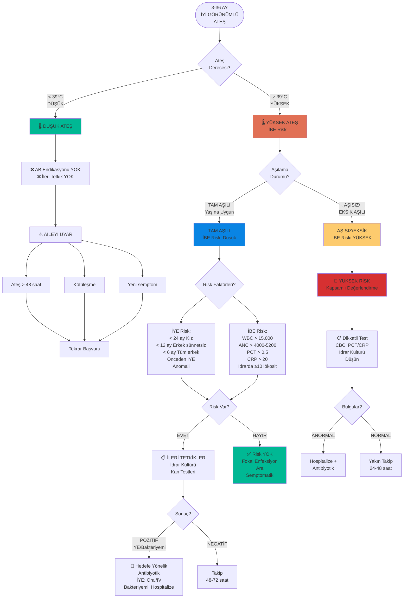

---

## İBE RİSK FAKTÖRLERİ

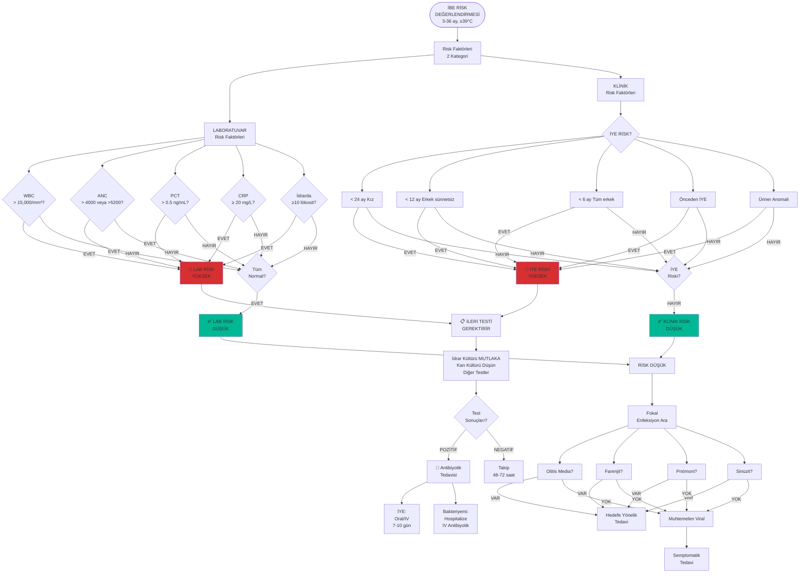

---

## ANTİPİRETİK TEDAVİ

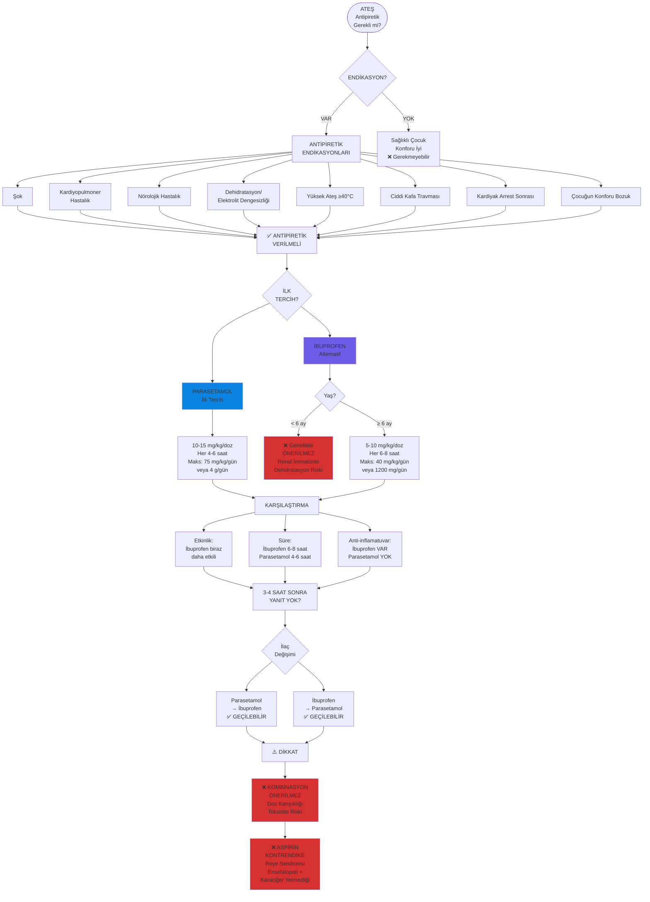

---

## NORMAL VİTAL BULGULAR

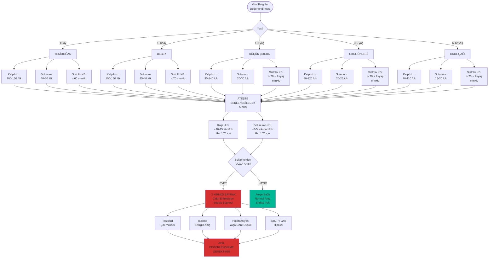

---

## NEREDE YAYINLAYACAĞIZ?

### Platform Uyumluluğu

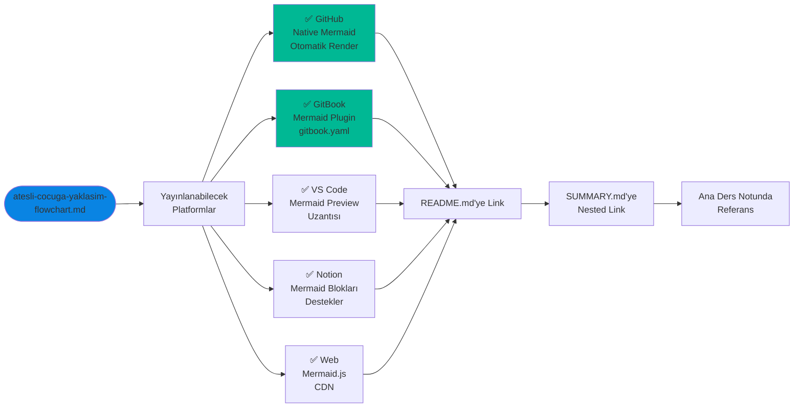

### Önerilen Kullanım

1. **Ana ders notunda bağlantı:**
```markdown
📊 **Görsel Algoritmalar:** [Flowcharts](atesli-cocuga-yaklasim-flowchart.md)
```

2. **SUMMARY.md'de nested:**
```markdown
* [Ateşli Çocuğa Yaklaşım](genel/atesli-cocuga-yaklasim.md)
  * [📊 Algoritmalar](genel/atesli-cocuga-yaklasim-flowchart.md)
```

3. **README.md'ye:**
```markdown
## 📊 Görsel Algoritmalar
- [Ateşli Çocuğa Yaklaşım Flowcharts](genel/atesli-cocuga-yaklasim-flowchart.md)
```

---

**Kaynak:** Pediatri Ders Notları
**Format:** Mermaid Flowcharts
**Tarih:** 2024
