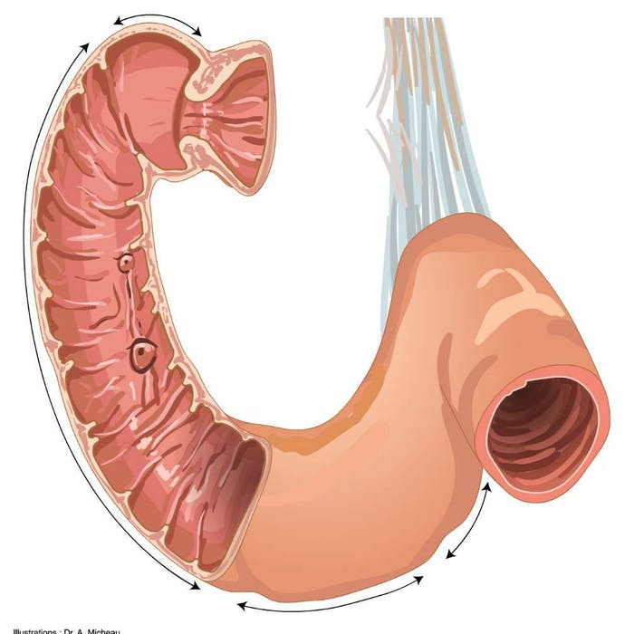
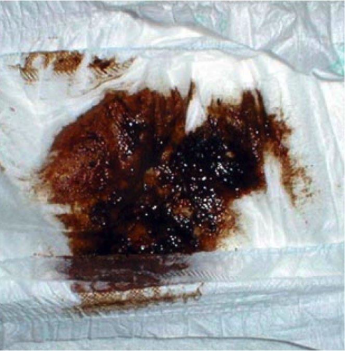
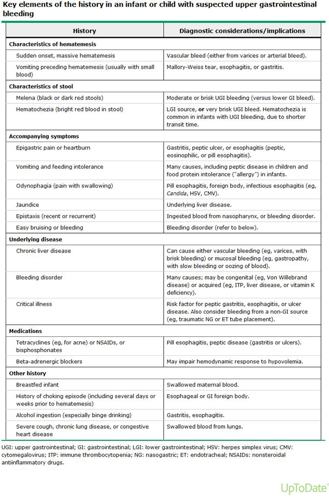
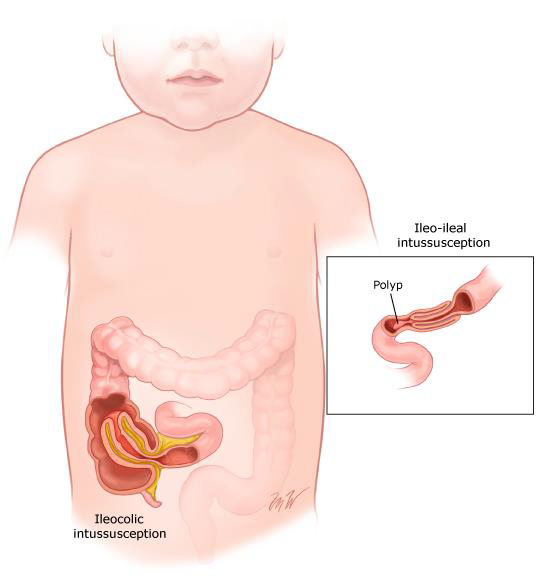

# GASTROİNTESTİNAL SİSTEM KANAMALARINA YAKLAŞIM

**Hazırlayan:** Dr. Öğr. Üyesi Murat Ayar
**Bölüm:** Çocuk Acil

---

## İÇİNDEKİLER

1. [Giriş ve Tanımlar](#giriş-ve-tanımlar)
2. [Üst GİS Kanamaları](#üst-gis-kanamaları)
3. [Üst GİS Kanamalarında Etiyoloji](#üst-gis-kanamalarında-etiyoloji)
4. [Tanı](#tanı)
5. [Tedavi](#tedavi)
6. [Akut Varis Kanamasına Yaklaşım](#akut-varis-kanamasına-yaklaşım)
7. [Alt GİS Kanamaları](#alt-gis-kanamaları)
8. [Alt GİS Kanamalarında Etiyoloji](#alt-gis-kanamalarında-etiyoloji)
9. [İnvaginasyon](#invaginasyon)
10. [Meckel Divertikülü](#meckel-divertikülü)
11. [Alt GİS Kanamalarında Tanı ve Tedavi](#alt-gis-kanamalarında-tanı-ve-tedavi)
12. [Portal Hipertansiyon](#portal-hipertansiyon)

---

## GİRİŞ VE TANIMLAR

Çocuklarda gastrointestinal sistem (GİS) kanamaları; ağızdan anüse kadar uzanan kanalın **herhangi bir bölgesinde** meydana gelebilir. Etiyolojide hayatı tehdit edici ağır varis kanamaları olabileceği gibi basit bir anal fissür de olabilir.

### Temel Tanımlar

| Terim                              | Tanım                                                                                                          |
| ---------------------------------- | -------------------------------------------------------------------------------------------------------------- |
| **Üst GİS kanaması**               | **Treitz ligamentinin proksimalinden** (özofagus, mide ve duodenum) kaynaklanan kanamalar                      |
| **Alt GİS kanaması**               | **Treitz ligamentinin distalinden** (ince bağırsak ve kolon) kaynaklanan kanamalar                             |
| **Odağı bulunamayan GİS kanaması** | Gözle görülür veya gizli olabilir                                                                              |
| **Gizli kanama**                   | Gözle tanımlanamayan, dışkıda gizli kan pozitifliği ve/veya **demir eksikliği anemisine** neden olan kanamalar |
| **Hematemez**                      | **Taze kırmızı** veya **kahve telvesi** görünümlü kanın kusma ile çıkarılması                                  |
| **Melena**                         | Sindirilmiş kanın (**koyu veya siyah renkli, katran benzeri**) rektal yolla çıkarılması                        |
| **Hematokezya**                    | **Taze kanın** rektal yol ile atılması                                                                         |

---

## ÜST GİS KANAMALARI

- Klinik olarak genellikle **hematemez** şeklinde kusma veya **melena** şeklinde dışkılama ile gelirler
- Masif üst GİS kanamalarında da **hematokezya** görülebilir
- Kırmızı olması kanamanın **yeni olduğunun**, mide asidi ile yeterli temas süresinin olmadığının göstergesidir

### Melena Hakkında Önemli Bilgiler

- Melena görülmesi için en az **50-60 mL** kanın sindirilmesi (GİS'te en az **6 saat** durması) gerekmektedir
- Melena olması, sadece hematemez olmasına göre **daha fazla miktarda kanamayı** gösterir
- Siyah, katran benzeri görünüm hemoglobinin bağırsak bakterileri tarafından **hematine oksitlenmesinin** sonucudur

---

## ÜST GİS KANAMALARINDA ETİYOLOJİ

- Yaş gruplarına ve ülkelerin sosyoekonomik durumuna göre değişir
- Düşük-orta gelirli ülkelerde **varise bağlı kanamalar** daha sık
- Genel olarak **gastrit ve ülserler** ilk sırayı (%25-80), **özofagus varis kanamaları** ikinci sırayı (%15-40) alır

### Yaş Grubuna Göre Etiyoloji

#### Yenidoğan Dönemi

- **Maternal kan yutulması**
- Koagülasyon bozuklukları
- **Yenidoğanın hemorajik hastalığı** (Vitamin K eksikliği)
- Vasküler malformasyonlar
- Travma (nazogastrik tüpe bağlı)
- **Stres gastrit/ülser**
- Nekrotizan enterokolit (NEC)
- Besin alerjisi (alt GİS kanama daha sıktır)
- Munchausen sendromu (ebeveyn tarafından)
- Annenin nonsteroidal ilaç kullanması
- Maternal trombositopeni

#### 1 Ay - 1 Yaş

- **Gastrit** (strese bağlı)
- İlaçlar
- **İnek sütü protein alerjisi** (alt GİS kanama daha sıktır)
- Vasküler malformasyonlar
- Mallory-Weiss sendromu
- Koagülasyon bozuklukları
- Özofajitler
- Munchausen sendromu
- Duplikasyon kistleri
- Özofageal ve gastrik "web"ler
- Yabancı cisim

#### 1 Yaş - 5 Yaş

- Özofajitler
- İlaçlara bağlı
- Mallory-Weiss sendromu
- **Gastrik ve duodenal ülserler**
- **Kostik madde içimi**
- Özofagus varisleri
- Vaskülitler
- Munchausen sendromu
- Dieulafoy lezyonları / vasküler malformasyonlar
- Duplikasyon kistleri
- Stromal tümörler ve diğer maligniteler
- Burun-ağız içi kanamalarının yutulması

#### 5 Yaş - 18 Yaş

- **Özofagus varisleri**
- **Gastrik ve duodenal ülserler**
- Reflü özofajit
- İlaçlar
- Mallory-Weiss sendromu
- **Crohn hastalığı**
- **H. pylori gastriti**
- Vasküler lezyonlar
- Vaskülitler
- Munchausen sendromu

---

## TANI

### Öykü

- Kanamanın **ne zaman başladığı, miktarı, rengi-görünümü** ve tekrarlayıcı özellikte olup olmadığı sorgulanmalı
- Kusma veya dışkı rengini değiştirebilen **yiyecek ve/veya ilaç alımı** sorgulanmalı
- Kullanılan ilaçlar (**aspirin, antikoagülan, steroidler ve diğer antiinflamatuvar ilaçlar**) gastrik erozyon ve ülser yönünden sorgulanmalı
- **Kronik karaciğer hastalığı** hikayesi → özofagus varis kanaması açısından uyarıcı

### Fizik Muayene

**Genel → Birincil → İkincil → Üçüncül** değerlendirme basamakları

- Kronik karaciğer hastalığı bulguları veya izole masif **splenomegali** → varis kanaması düşündürmeli
- **Epigastrik duyarlılık** → gastrit veya ülser
- Konjenital kalp hastalığı → mezenterik iskemi
- Mukozalarda kahverengi pigmentasyon → polipler
- İnfantil kolik → inek sütü ve diğer protein duyarlılıkları
- Bazı hastalıklar için **pozitif aile öyküsü** (İBH, GİS tümörleri) sorgulanmalı

### Ciddi Kanama Bulguları

> ⚠️ **Aşağıdaki bulgular ciddi kanamayı gösterir:**

- **Taşikardi** (KTA >20/dk artış)
- **Hipotansiyon**
- **Bilinç değişikliği**
- Ekstremitelerde **soğukluk**
- **Uzamış kapiller dolum zamanı**
- **Hb >2 g/dL üzerinde düşüş**
- Melena veya hematokezya

### Laboratuvar Tetkikler

- **Hemogram**
- Koagülasyon parametreleri
- Biyokimya
- **Kan grubu**

> 💡 Çocuklarda **BUN/Kreatinin oranının >30** olması üst GİS kanamasını alt GİS kanamasından ayırmada yararlıdır. 
> 
> **Neden?** Bu durumun iki temel mekanizması aşağıdakilerdir:
> 1. **Kanın Sindirilmesi (Artmış Üre Üretimi):** Üst GİS kanamasında bağırsak lümenine dolan kan, yüksek proteinli bir öğün gibi davranır. Kan proteinleri (özellikle hemoglobin) sindirilerek amino asitlere parçalanır, ince bağırsaktan emilir ve karaciğerde üreye (BUN) dönüştürülür. Alt GİS kanamalarında kanın ince bağırsakta sindirilip emilebileceği yeterli mesafe olmadığı için bu durum görülmez.
> 2. **Azalmış Renal Perfüzyon (Prerenal Azotemi):** Kanamanın getirdiği hacim kaybı (hipovolemi) böbreğe giden kan akımını azaltır. Böbrekler, azalan kan akımına yanıt olarak üre (BUN) geri emilimini artırır. Kreatinin düzeyi bu durumdan veya kan proteinlerinin emiliminden aynı derecede etkilenmediği için nispeten sabit kalır. Sonuç olarak BUN değeri belirgin artarken kreatinin sabit kalır ve **BUN/Kreatinin oranı 30'un üzerine çıkar**.

### Görüntüleme Yöntemleri

| Yöntem                                               | Kullanım                                                                                                                                         |
| ---------------------------------------------------- | ------------------------------------------------------------------------------------------------------------------------------------------------ |
| **Direkt grafiler**                                  | Yabancı cisim, bağırsak obstrüksiyonu ve perforasyonu                                                                                            |
| **Batın USG**                                        | Portal ven akımı, karaciğer parankim yapısı, asit varlığı                                                                                        |
| **BT anjiografi / Konvansiyonel kateter anjiografi** | Kanama yerini saptama + girişimsel tedavi                                                                                                        |
| **Sintigrafi**                                       | 0,1 mL/dk hızındaki kanamaları saptayabilir → en duyarlı yöntem. Meckel divertikülü ve duplikasyonlarda gastrik mukoza tespitinde sık kullanılır |

### Nazogastrik Lavaj

- Üst GİS kanama tanısında **önemli**
- SF ile yapılabilir
- Taze kan ya da kahve telvesi (+)
- Mide içeriği (+/-)
- Safra (-)

> ⚠️ **Soğuk su ile lavaj önerilmez!**

### Endoskopik Tanı

- Üst GİS kanamalarında **en yararlı yöntem**
- Mukozal lezyonları (ülser, gastrit, Mallory-Weiss yırtığı), yabancı cisimler, vasküler anomaliler (hemanjiom), polipoid lezyonları gösterebilir
- Gerekirse **tedavi amaçlı** kullanılabilir

---

## TEDAVİ

### Tedavi İlkeleri

1. Hasta hemodinamisini **stabilize et** (intravasküler hacmi yerine koy, anemiyi düzelt, koagülopatiyi düzelt)
2. Kanamayı **durdur**
3. Tekrarını **önle**

### ABC Yaklaşımı

| Basamak             | Uygulama                                                                                |
| ------------------- | --------------------------------------------------------------------------------------- |
| **A - Airway**      | Baş geri çene ileri manevrası (infantlarda omuz altına, çocuklarda boyun altına destek) |
| **B - Breathing**   | Solunumu güvenceye al: maske O₂, balon maske, entübasyon                                |
| **C - Circulation** | Hızlıca damar yolu veya intraosseöz yol aç                                              |

**Eş zamanlı olarak:**
- Hemogram, glikoz, KCFT, BFT, koagülasyon, kan grubu ve kan gazı al
- Monitorize et
- Mallory-Weiss tariflemiyor ise **NG sonda** ile kontrol et
- NG SF ile irrigasyon
- **PPI tedavisi** başla
- Sıvı ve kan replasmanı açısından **yakın takip**
- Metabolik bozukluk veya koagülopatiyi altta yatan sebebe göre müdahale et
- **Çocuk Gastroenteroloji konsültasyonu** iste

### Sıvı Tedavisi
> (Sıvı açığı varsa)
- Öncelikle **iki sağlam ve yeterli çapta damar yolu** açılmalı
- Tam kan sayımı, kan grubu ve koagülasyon parametreleri çalışılmalı
- Hemodinamik olarak gerekli ise **sıvı yüklenmeli**
- Vital fonksiyonlar **yakın takip** edilmeli
- Hacim replasmanı ile hipotansiyon **30 dakika** içinde düzeltilemiyorsa → organ harabiyetlerini önlemek için **vazopressörler** başlanmalı

### Önemli Klinik Notlar

- Çocuklarda **taşikardinin** olması ağır kan kaybının bir göstergesidir
- Kan basıncı başlangıçta vazokonstrüksiyona bağlı olarak **normal ölçülebilir**
- **Hipotansiyon + uzamış kapiller dolum zamanı** → ağır (>%25) hipovoleminin göstergesi, **kollapsın öncüsü** olabilir
- Hemodinamik instabilite, devam eden kanama, nörolojik kötüleşme (ajitasyon, GCS <8) ve solunum sıkıntısı → **havayolu koruması** gerektirir
- Amaç Hb düzeyini **>8 g/dL** (7-9 g/dL arasında) tutmak

### Farmakolojik Tedavi

| İlaç                              | Açıklama                                                       |
| --------------------------------- | -------------------------------------------------------------- |
| **PPI** (Proton Pompa İnhibitörü) | İlk basamak medikal tedavi                                     |
| **Sükralfat**                     | Mukozal koruyucu                                               |
| **H2 reseptör blokerleri**        | Asit baskılama                                                 |
| **Somatostatin / Oktreotid**      | Kanamanın kontrol edilemediği varis dışı kanamalarda da etkili |

### Endoskopik Tedavi

Hastanın durumu stabilleştikten sonra hem tanı hem de gerekirse tedavi amaçlı endoskopi yapılabilir:
- Enjeksiyon
- Koterizasyon
- Endoklips
- Termokoagülasyon

---

## AKUT VARİS KANAMASINA YAKLAŞIM

> **Üst GİS kanaması ve ***splenomegalisi*** olan bir hastada aksi ispatlanıncaya kadar kanama **varis** olarak kabul edilmelidir.**

> ⚠️ Kronik karaciğer hastalarında mide ve duodenal ülser sıklığının yüksek olduğu da unutulmamalıdır.

### Nazogastrik Sonda

- Takılırken **dikkat** edilmeli → travmatik girişim kanaması olmayan bir hastayı kanaması var gibi gösterebilir
- Dikkatli takılan NG tüp kanamanın **devam edip etmediği** konusunda bilgi verir
- Kanı GİS'ten uzaklaştırarak olası **hepatik ensefalopati** gelişimini önler

### Farmakolojik Tedavi

Resüsitasyon ile birlikte portal basıncı azaltacak tedavilere **en kısa zamanda** başlanmalıdır. Vazoaktif ilaçların kullanılması **%75-80** oranında kanamayı durdurur ve yeniden kanama riskini azaltır.

| İlaç             | Etki                        |
| ---------------- | --------------------------- |
| **Somatostatin** | Splanknik vazokonstrüksiyon |
| **Oktreotid**    | Splanknik vazokonstrüksiyon |
| **Terlipressin** | Portal basınç düşürücü      |

### Diğer Tedavi Yöntemleri

- **Sengstaken-Blakemore Tüp** uygulaması (balon tamponad)
- **Endoskopik tedavi:** Bant ligasyonu, skleroterapi
- **TİPSS** (Transjuguler İntrahepatik Portosistemik Şant): Endoskopik ve tıbbi tedaviye rağmen durdurulamayan özofageal veya gastrik varis kanamalarında kurtarıcı olabilir
- **Cerrahi tedavi:** Tüm yöntemlere yanıt vermeyen durumlarda → transeksiyon, devaskülarizasyon, portosistemik şant

---

## ALT GİS KANAMALARI

- Çocuklarda alt GİS kanamaları üst GİS kanamalarına göre **daha nadir**
- Aile için endişe verici olmakla birlikte acil endoskopik veya cerrahi girişim **çok nadir** olarak gerekir

---

## ALT GİS KANAMALARINDA ETİYOLOJİ

### Yaş Grubuna Göre Alt GİS Kanama Nedenleri

| Yenidoğan                 | Süt Çocuğu           | Çocuk                  | Ergen                |
| ------------------------- | -------------------- | ---------------------- | -------------------- |
| Yutulmuş anne kanı        | **Anal fissür**      | **Anal fissür**        | Enfeksiyöz kolit     |
| Allerjik kolit            | Allerjik kolit       | **Polipler**           | **Polipler**         |
| Enfeksiyöz kolit          | Enfeksiyöz kolit     | Enfeksiyöz kolit       | **İBH**              |
| **NEC**                   | **İnvaginasyon**     | Vaskülit (HSP, FMF)    | Hemoroid             |
| İnvaginasyon              | Volvulus             | **Meckel divertikülü** | Anal fissür          |
| Malrotasyon               | Meckel divertikülü   | İnvaginasyon           | Meckel divertikülü   |
| Duplikasyon               | Malrotasyon          | HÜS                    | HÜS                  |
| Hirschsprung enterokoliti | Duplikasyon          | **İBH**                | Vaskülit (HSP, FMF)  |
|                           | Vasküler anomaliler  | Psödomembranöz kolit   | Psödomembranöz kolit |
|                           | Psödomembranöz kolit | Vasküler anomaliler    | İskemik kolit        |
|                           |                      |                        | Vasküler anomaliler  |

> 💡 Bebeklerde en sık sebep **anal fissür** iken daha büyük yaşlarda **enfeksiyöz ve inflamatuvar kolitler** ön plandadır.

---

### Anal Fissür

- Hemen hemen **her yaşta** görülür
- **Taze kırmızı renkte çizgisel kanama** ile bulgu verir
- Özellikle sık görüldüğü dönemler:
  - **Tamamlayıcı beslenmeye geçiş dönemi** (4-6 ay)
  - **Tuvalet eğitimi** dönemi (3-4 yaş civarı)
  - **Okul başlangıcı** (6 yaş)

### İnek Sütü Protein Alerjisi (Allerjik Proktokolit)

- Yenidoğan veya erken süt çocukluğu döneminde **dışkıda kan veya mukuslu dışkılama** ile ortaya çıkar
- Sağlıklı görünen, kilo alımı iyi olan bebeklerde **anal fissür dışlandıktan sonra** düşünülmeli
- **Alerjenin eliminasyonu** ile çoğu olguda şikayetler birkaç günde düzelir
- Hastaların çoğu **9-12. aylarda** alerjen besini tolere edebilir

---

## İNVAGİNASYON

### Genel Özellikler

- **3-36 ay** yaş aralığı
- Etiyoloji çoğunlukla **idiyopatik**
- Diğer yaş gruplarında veya tekrarlayan olgularda **lider nokta** aranmalı:
  - Meckel divertikülü
  - Polipler
  - Lenfoma (özellikle lenfoma)
  - HSP
  - Kistik fibrozis
  - HÜS
  - Paraziter hastalıklar

### Klinik Bulgular

- **Ani başlayan ağrı**, huzursuzluk
- **Kusma**
- Sağ üstte ele gelen **sosis şeklinde abdominal kitle** hissi
- Sağ altta **boşluk hissi**
- **Kanlı, çilek jölesi gaita**
- **Uyku hali (letarji)!!!**

> **Bazen bu hastalar menenjitle karıştırılır.**

### Tedavi

İlk olarak **cerrahi müdahale** düşünülmelidir:
- **Hidrostatik** (salin/baryum) veya **pnömatik** (hava) lavman ile redüksiyon
- Açık redüksiyon

---

## MECKEL DİVERTİKÜLÜ

### Genel Özellikler

- **Omfalomezenterik kanalın** tam olarak oblitere olmaması sonucu gelişir
- GİS'in **en sık görülen konjenital anomalisi**
- Prevalans: **%4-11**
- Divertiküllerin yaklaşık **%50'sinde** heterotropik **gastrik mukoza** bulunur
- Komşu ileal mukozada **ülserasyona bağlı kanamalar** görülebilir

### Klinik

Öncesinde sağlıklı olan çocuklarda:
- **Ağrısız**
- **Taze**
- **Tekrarlayan**
- Kendi kendini sınırlayıcı
- Bazen hayatı tehdit edecek kadar şiddetli kanama

---

## ALT GİS KANAMALARINDA TANI VE TEDAVİ

### Öykü

- Eşlik eden hastalık varlığı (KC hastalığı, İBH, geçirilmiş intestinal operasyon)
- Kanama ve dışkılama şekli (ağrılı olup olmadığı, ishalin eşlik edip etmediği, dışkı üzerinde parlak kanama)
- İlaç kullanımı (NSAİİ)

### Fizik Muayene

- **Antropometrik ölçümler** (malnütrisyon açısından)
- Ayrıntılı **batın muayenesi** (karın içi patolojiler yönünden)
- **Rektal muayene** (fissür, fistül, rektal polip açısından)

### Laboratuvar

- **Tam kan sayımı ve koagülasyon parametreleri**
- Kolit düşünülen olgularda enfeksiyöz ve inflamatuvar nedenler yönünden tetkik

### Endoskopik Tanı

- Alt GİS kanamalarında üst GİS'in aksine **acil endoskopik girişim çok nadir** gerekir
- Daha çok **tanı amaçlı** kullanılır

### Görüntüleme

- **Sintigrafi:** Meckel divertikülü veya intestinal duplikasyonlarda heterotropik gastrik mukozanın gösterilmesinde duyarlı (%60-80)
- Özellikle **ağrısız, bol miktarda alt GİS kanaması** olan bebeklerde **kolonoskopiden önce** tercih edilmeli

### Nedene Yönelik Tedavi

| Neden                | Tedavi                                                                          |
| -------------------- | ------------------------------------------------------------------------------- |
| **Allerjik kolit**   | Diyet (allerjen eliminasyonu)                                                   |
| **Enfeksiyöz kolit** | Antibiyoterapi                                                                  |
| **Polipler**         | Polipektomi                                                                     |
| **İBH**              | Steroid, mesalazin, immünsüpresif                                               |
| **Anjiodisplaziler** | Bipolar elektrokoagülasyon, argon plazma koagülasyon, enjeksiyon skleroterapisi |

---

## PORTAL HİPERTANSİYON

### Tanım

- Portal ven basıncının **patolojik artışı**
- Çocuklarda erişkinden farklıdır: en sık neden **prehepatik obstrüksiyon** (özellikle portal ven trombozu)
- Klinik önem: **varis kanaması** ve **büyüme-gelişme sorunları** ile morbidite/mortaliteye yol açar

### Etiyoloji

#### Prehepatik (en sık)

- **Portal ven trombozu (PVT)**, splenik ven trombozu, arteriohepatik fistül
- Neonatal riskler: **umbilikal ven kateteri, sepsis, omfalit**
- Konjenital portal ven anomalileri

#### İntrahepatik

- Biliyer atrezi sonrası siroz
- Metabolik hastalıklar (**Wilson, α1-antitripsin eksikliği, PFIC**)
- Kronik hepatitler, otoimmün hepatit

#### Posthepatik (nadir)

- **Budd-Chiari sendromu**
- Sağ kalp yetmezliği
- VCİ obstrüksiyonu

### Klinik Bulgular

| Bulgu                            | Açıklama                                   |
| -------------------------------- | ------------------------------------------ |
| **Splenomegali**                 | En sık bulgu   !!!                         |
| **Hipersplenizm**                | Trombositopeni, anemi, lökopeni            |
| **Özofagus-gastrik varisler**    | Hematemez / melena → **en dramatik bulgu** |
| **Büyüme-gelişme geriliği**      | Malnütrisyon                               |
| **Asit ve hepatik ensefalopati** | Daha çok intrahepatik nedenlerde           |

### Tanı

- GİS kanama ve açıklanamayan splenomegalide **akla gelmeli**
- **USG + Doppler** → ilk basamak (portal ven akımı, trombüs, kollateraller)
- **Endoskopi** → varis varlığının ve evresinin gösterilmesi
- **BT/MR** → vasküler anatomi

### Tedavi

#### Akut Varis Kanaması

1. Hızlı **stabilizasyon** (sıvı, kan)
2. **Vazoaktif ajanlar** (oktreotid, terlipressin)
3. **Antibiyotik profilaksisi** (spontan bakteriyel peritonit ve enfeksiyon önleme)
4. Erken **endoskopi: bant ligasyonu** (skleroterapiye üstün)

#### Profilaksi

| Tip                     | Yöntem                                                                                      |
| ----------------------- | ------------------------------------------------------------------------------------------- |
| **Primer profilaksi**   | Kanıtlar sınırlı; NSBB (non-selektif beta bloker) çocukta standart değil, rutinde önerilmez |
| **Sekonder profilaksi** | Tekrarlayan bant ligasyonu, skleroterapi, şant cerrahisi, KC nakli                          |

---

## ÖZET VE ÖNEMLİ NOKTALAR

### Altın Kurallar

1. Çocuklarda en sık portal hipertansiyon nedeni **prehepatik portal ven trombozu**
2. **Splenomegali** en sık bulgu, **varis kanaması** en önemli komplikasyon
3. Tanıda **USG-Doppler** ve **endoskopi** temel
4. Akut kanamada: **vazoaktif + antibiyotik + bant ligasyonu**
5. **BUN/Kreatinin >30** → üst GİS kanaması lehine
6. Melena için en az **50-60 mL** kan ve **6 saat** GİS'te kalma gerekir
7. Bebeklerde en sık alt GİS kanama nedeni **anal fissür**
8. Meckel divertikülü → GİS'in **en sık konjenital anomalisi**
9. İnvaginasyon → **3-36 ay**, çilek jölesi gaita, letarji

### Klinik İpuçları

| Konu                                           | İpucu                                    |
| ---------------------------------------------- | ---------------------------------------- |
| **Üst GİS kanama tanısında en yararlı yöntem** | Endoskopi                                |
| **Üst-alt GİS ayrımında**                      | BUN/Kreatinin >30 → üst GİS              |
| **Üst GİS + splenomegali**                     | Aksi ispatlanıncaya kadar varis kanaması |
| **Vazoaktif ilaçların etkinliği**              | %75-80 oranında kanamayı durdurur        |
| **Hedef Hb düzeyi**                            | >8 g/dL (7-9 g/dL arası)                 |
| **Hipotansiyon düzelmiyorsa**                  | 30 dk içinde → vazopressör               |
| **Bebeklerde alt GİS kanaması**                | En sık anal fissür                       |
| **İnvaginasyon yaş aralığı**                   | 3-36 ay                                  |
| **İnvaginasyon klasik triadı**                 | Ağrı + kusma + kanlı gaita               |
| **Meckel tanısında**                           | Sintigrafi (Tc-99m)                      |
| **Portal HT en sık nedeni (çocuk)**            | Prehepatik - portal ven trombozu         |
| **Portal HT en sık bulgusu**                   | Splenomegali                             |
| **NG lavajda**                                 | Soğuk su ile lavaj önerilmez!            |

---
