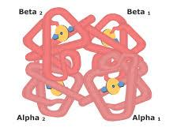
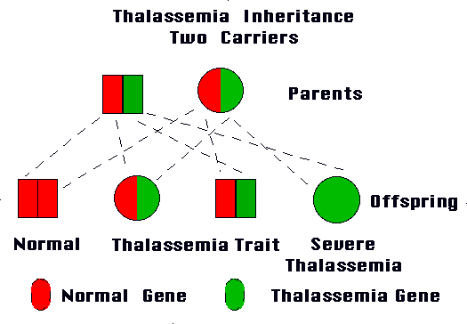
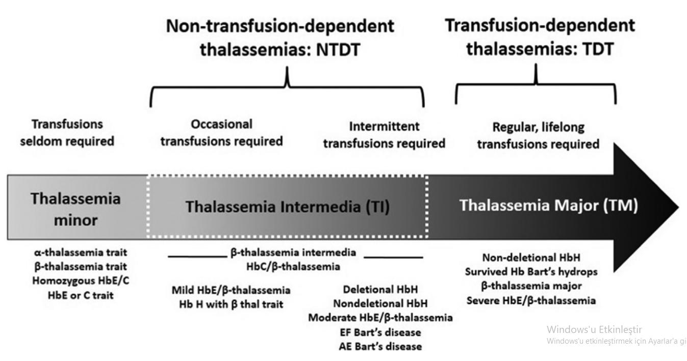
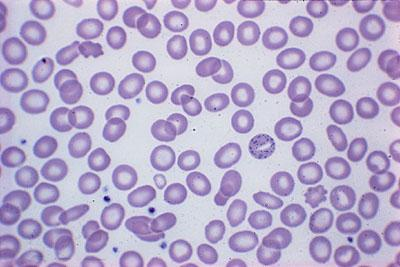
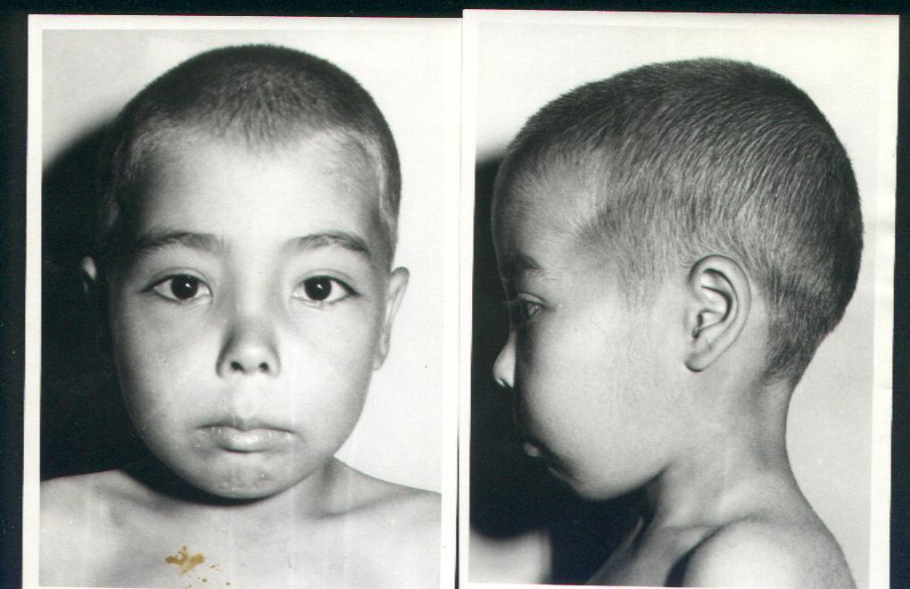
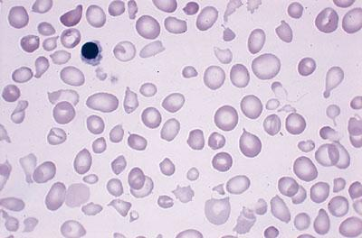
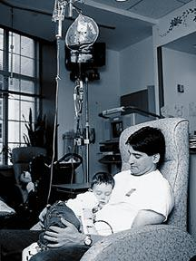
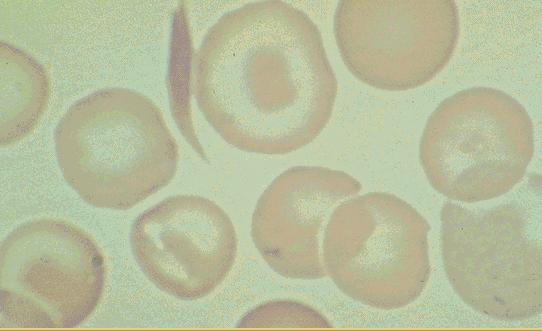
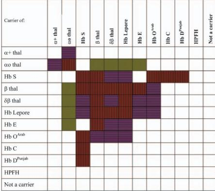
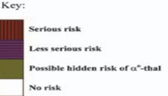

# Hemoglobinopatiler

**Hazırlayan:** Dr. Yusuf Ziya Aral **Bölüm:** ADÜ Tıp Fakültesi, Çocuk Hematolojisi ve Onkolojisi Bilim Dalı (2025)

***

## İÇİNDEKİLER

1. [Normal Hemoglobin Yapısı](#normal-hemoglobin-yapısı)
2. [Hemoglobinopatilere Genel Bakış](#hemoglobinopatilere-genel-bakış)
3. [Sık Bulunan Anormal Hemoglobinler](#sık-bulunan-anormal-hemoglobinler)
4. [Talasemi Sendromları](#talasemi-sendromları)
5. [Beta Talasemi Minör](#beta-talasemi-minör)
6. [Talasemi İntermedia](#talasemi-intermedia)
7. [Talasemi Major](#talasemi-major)
8. [Alfa Talasemi Sendromları](#alfa-talasemi-sendromları)
9. [Orak Hücreli Anemi](#orak-hücreli-anemi)
10. [Genetik Danışma](#genetik-danışma)
11. [Kısaltmalar](#kısaltmalar)

***

## NORMAL HEMOGLOBİN YAPISI



*Şekil: Hemoglobin molekülünün üç boyutlu yapısı. Her hemoglobin molekülü 2 alfa ve 2 beta globin zincirinden oluşur. Her alt birim bir hem grubu (demir içeren porfirin halkası) taşır.*

### Normal Erişkin Hemoglobin Dağılımı

| Hemoglobin Tipi | Oran | Zincir Yapısı |
| --------------- | ---- | ------------- |
| **HbA** | **%96** | 2 alfa + 2 beta (α₂β₂) |
| **HbA2** | **%2.5-3.5** | 2 alfa + 2 delta (α₂δ₂) |
| **HbF** | **<%1** | 2 alfa + 2 gama (α₂γ₂) |

***

## HEMOGLOBİNOPATİLERE GENEL BAKIŞ

### Tanım

Hemoglobinopatiler, hemoglobin genlerindeki (alfa, beta, gama, delta) **mutasyonlara** bağlı olarak gelişen kalıtsal hastalıklardır.

**İki temel mekanizma:**

| Tip | Mekanizma | Sonuç |
| --- | --------- | ----- |
| **Yapısal hemoglobin varyantları** | Globin zincirinde aminoasit değişikliği | Anormal hemoglobin (HbS, HbC, HbE, HbD) |
| **Talasemi sendromları** | Globin zinciri sentezinde azalma/yokluk | Zincir dengesizliği → Hemoliz |

* Günümüzde **1000'in üzerinde** anormal hemoglobin bildirilmiştir

***

## SIK BULUNAN ANORMAL HEMOGLOBİNLER

| Hemoglobin | Mutasyon | Özellik |
| ---------- | -------- | ------- |
| **HbS** | β6 Glu→Val | **Polimer** oluşturur → Oraklaşma |
| **HbD** | β121 Glu→Gln | Türkiye'de **2. sıklıkta** |
| **HbE** | β26 Glu→Val | **Talasemi fenotipi** oluşturur |
| **HbC** | β6 Glu→Lys | **Kristal** oluşturur |

**Türkiye'deki sıklık sıralaması:**

1. **HbS** (en sık)
2. **HbD** (ikinci sık)
3. **HbE** (üçüncü sık)

> **Klinik Önemi:** HbS polimer, HbC kristal, HbE talasemi fenotipi oluşturduğundan **homozigot** şekilleri ağır hemolitik anemi yapar.

***

## TALASEMİ SENDROMLARI

### Tanım

Hemoglobin molekülünü oluşturan globin zincirlerinden birinin veya daha fazlasının **yapılamaması veya az miktarda yapılması** ile karakterize, **OR** (nadiren OD) geçiş gösteren kalıtsal bir hastalıktır.

***

### Kalıtım



*Şekil: Talasemi kalıtım paterni. Her iki ebeveyn de taşıyıcı (trait) olduğunda: %25 normal, %50 talasemi trait (taşıyıcı), %25 ağır talasemi (major) olasılığı vardır.*

***

### Genetik

* **Beta talasemi** → Çoğunlukla **mutasyonlar** neden olur
* **Alfa talasemi** → Çoğunlukla **delesyonlar** neden olur

**Türkiye'de en sık mutasyonlar:**

| Klinik Tablo | En Sık Mutasyon |
| ------------ | --------------- |
| Talasemi major | Homozigot **IVS-I-110** |
| Talasemi intermedia | **IVS-I-6** |

***

### Türkiye'de Beta Talasemi Taşıyıcılığı

**Genel sıklık:** %2.1 (dağılım: %0.6-13)

| Bölge | Sıklık | Bölge | Sıklık |
| ----- | ------ | ----- | ------ |
| **Antalya** | **%13.1** (en yüksek) | İstanbul | %4.5 |
| Edirne | %6.4 | İzmir | %4.8 |
| Urfa | %6.4 | Aydın | %5.1 |
| Antakya | %4.6 | Mersin | %2.3 |
| Adana | %3.7 | Denizli | %2.6 |
| D.bakır | %3.6 | Isparta | %2.4 |
| Kırklareli | %3.4 | Bursa | %1.7 |
| Muğla | %4.5 | K.maraş | %0.7 |

***

### Talasemi Sınıflandırması



*Şekil: Talasemilerin klinik sınıflandırma spektrumu. Soldan sağa transfüzyon ihtiyacı artar. **NTDT (Transfüzyona Bağımlı Olmayan):** Talasemi minör, talasemi intermedia. **TDT (Transfüzyona Bağımlı):** Talasemi major. Her klinik tablonun altında ilişkili genotipik alt tipler belirtilmiştir.*

| Sınıf | Tanım | Transfüzyon |
| ----- | ----- | ----------- |
| **Talasemi minör (trait)** | 1 gen defektif | Gerekmez |
| **Talasemi intermedia** | 2 gen defektif, hafif fenotip | Nadiren gerekir |
| **Talasemi major** | 2 gen defektif, ağır fenotip | Düzenli, ömür boyu |

***

## BETA TALASEMİ MİNÖR

### Genel Özellikler

* **1 beta globin geni** defektiftir
* Klinik olarak **bulgu vermez**
* **Tedavi gereksinimi yoktur**

***

### Periferik Yayma



*Şekil: Beta talasemi minörde periferik yayma. Hipokromi (soluk eritrositler), mikrositoz (küçük eritrositler), target (hedef) hücreleri ve hafif anizositoz izlenmektedir.*

**Periferik yayma bulguları:**

* Hipokromi, mikrositoz
* Anizositoz, poikilositoz
* **Target (hedef) hücreleri**
* Bazofilik stippling

***

### Laboratuvar

| Parametre | Bulgu |
| --------- | ----- |
| **MCV** | ↓ Düşük |
| **Eritrosit sayısı (KK)** | ↑ Yüksek |
| **RDW** | Normal (veya hafif ↑, <16) |
| **Mentzer indeksi (MCV/KK)** | **<13** |
| **RDW indeksi (MCV/KK x RDW)** | **<220** |
| **HbA2** | **>%3.5** (olguların %95'inde yüksek — **tanı koydurur**) |
| **HbF** | %50 olguda %1-5 arası artış |

> **Klinik İpucu:** HbA2 > %3.5 olması beta talasemi taşıyıcılığı için **tanı koydurucudur**. Ancak eşlik eden demir eksikliği varsa HbA2 düşebilir → Önce demir tedavisi ver, sonra elektroforez bak!

***

## TALASEMİ İNTERMEDİA

### Genel Özellikler

* **2 beta globin geni** defektiftir (ancak fenotip daha hafif)
* Klinik olarak **geç başlangıç** gösterir (**4 yaşından sonra**)
* **Transfüzyon gereksinimi yoktur**
* HbF düzeyleri **>%20**
* HbA2 normal, düşük veya hafif yüksek olabilir

> hem anneden hem babadan.  hbf ile intermedia ve major ayırımı yapamayız

***

### NTDT İlişkili Morbiditeler / Komplikasyonlar

* Ekstramedüller hematopoez -sık
* **Tromboz** -sık
* Kardiyak problemler: Sağ kalp yetmezliği, **pulmoner hipertansiyon** - sık
* **Bacak ülserleri** - sık
* Kemik hastalığı
* Hepatobiliyer bozukluklar
* Endokrin bozukluklar
* Böbrek problemleri

> İlk dördünü bil.
***

## TALASEMİ MAJOR

### Klinik Seyir

**Zaman çizelgesi:**

```
Doğum ──→ Normal (HbF yüksek: %70-90)
  │
  ▼
0-3 ay ──→ Asemptomatik (HbF koruyucu)
  │
  ▼
3 ay ──→ Gama gen yapımı durur, Beta gen yapımı başlar
  │         Anemi belirginleşmeye başlar
  ▼
6-12 ay ──→ Solukluk, irritabilite, anoreksi
  │           Karında büyüme (hepatosplenomegali)
  ▼
12 ay+ ──→ HbF %1'e iner (normal süt çocuğu düzeyi)
  │
  ▼
İleri yaş ──→ Kemik değişiklikleri, pigmentasyon
               Demir birikimi komplikasyonları
```

> **Neden 3 aydan sonra?** Fetüste ve yenidoğanda HbF (α₂γ₂) baskındır. Doğumdan sonra gama zinciri üretimi azalır, beta zinciri üretimi artmalıdır. Beta genindeki defekt nedeniyle bu geçiş gerçekleşemez → Anemi ortaya çıkar.

***

### Fizik Muayene Bulguları



*Şekil: Talasemi majorde kraniofasiyal değişiklikler. Medüller hematopoezin artmasına bağlı olarak frontal bossing (alın çıkıntısı), burun kökü basıklığı ve maksiller kemik genişlemesi izlenmektedir. Bu değişiklikler ilk 6 aydan itibaren gelişmeye başlar.*

**Erken dönem (6-12 ay):**

* Solukluk, irritabilite, anoreksi
* Gelişme geriliği
* Skleralarda sarılık
* Hepatomegali

**Geç dönem (ileri yaş):**

* **Kraniofasiyal değişiklikler:**
  * Burun kökü basıklığı
  * Frontal bossing
  * Maksillada belirginlik → Diş problemleri, ısırma/çiğneme bozuklukları
* Deride pigmentasyon artışı ve koyulaşma (demir birikimi)

***

### Komplikasyonlar

#### 1. Kraniofasiyal ve Kemik Değişiklikleri

* İlk 6 ay içinde başlar
* **Medüller hematopoez**in artışını gösterir
* Burun kökü basık, frontal bossing
* Maksiller deformite → Diş problemleri

#### 2. Ekstramedüller Hematopoez

* **Hepatosplenomegali**
* **Hipersplenizm** → Kanama, infeksiyon; dalakta kan gölleniyor. pansitopeni.

#### 3. Demir Birikimi (Hemosiderozis)

Bu, talasemi majorun **en önemli mortalite nedenidir**.

| Organ | Komplikasyon |
| ----- | ------------ |
| **Karaciğer** | Hepatik fibrozis → Siroz |
| **Cilt** | Koyulaşma (demir, melanin üretimini artırır) |
| **Kalp** | **Kardiyomiyopati**, aritmiler, konjestif kalp yetmezliği, tekrarlayan perikardit |
| **Pankreas** | Diyabetes mellitus (**bronz diyabet**) |
| **Hipofiz** | Sekonder hipopituitarizm |
| **Paratiroid** | Hipoparatiroidi |
| **Tiroid** | Hipotiroidi |
| **Gonadlar** | **Puberta gecikmesi** |
| **Adrenal** | Adrenal yetmezlik |
| **Büyüme** | Büyüme gecikmesi |

***

### Laboratuvar

| Parametre | Bulgu |
| --------- | ----- |
| **Anemi tipi** | Hipokrom mikrositer |
| **Retikülositoz** | Var |
| **Periferik yayma** | Hipokromi, mikrositoz, anizositoz, poikilositoz, bazofilik noktalanma, **normoblastlar** |
| **Serum ferritini** | ↑ Artmış |
| **İndirekt bilirubin** | ↑ Artmış |
| **HbF** | **%30-99** |
| **HbA2** | %1-9 |
| **Kemik iliği** | Eritroid hiperplazi |



*Şekil: Talasemi majorde periferik yayma. Belirgin hipokromi, mikrositoz, target hücreleri, anizositoz ve poikilositoz izlenmektedir. Normoblastlar (çekirdekli eritrositler) da görülebilir.*

***

### Tedavi

#### İlk Kan Transfüzyonu Kararı



*Şekil: Talasemi majorde düzenli kan transfüzyonu uygulaması. Kronik transfüzyon programı, hastanın hemoglobin düzeyini 9-10.5 g/dL üzerinde tutmayı hedefler.*

**Endikasyonlar:**

1. İnfeksiyon gibi ilave bir faktör **olmaksızın** Hb <7 g/dL ve **2 haftadan uzun** süre <7 g/dL altında kalması
2. Hb >7 g/dL iken **splenomegali**, **kemik değişiklikleri** gelişmesi ve/veya başka nedene bağlanamayan **büyümede duraklama**

***

#### Splenektomi Endikasyonları

* Lökopeni ve trombositopeni varsa (**hipersplenizm** bulgusudur)
* Yıllık kan tüketimi normalin **1.5 katını** aşmışsa (**250 mL/kg/yıl**)
* Talasemi intermedialı olgularda: Hb'de ilerleyici düşüş ve/veya **dalak >6 cm**

***

#### Demir Şelasyon Tedavisi (sınavda sorulur)

**Başlama kriterleri:**

| Klinik Tablo | Kriter |
| ------------ | ------ |
| **Talasemi major** | Ferritin >1000 μg/L **veya** LIC ≥3.2 mg/g kuru KC dokusu |
| **Talasemi intermedia** | Ferritin >800 μg/L **veya** LIC ≥5 mg Fe/g dw |

**Kardiyak demir birikimi değerlendirmesi:**

* **T2\*-MRI** ile **10 yaş ve üzerindeki** olgularda başlanmalı

**Demir Şelatörleri:**

| İlaç | Uygulama Yolu | Doz/Özellik |
| ---- | ------------- | ----------- |
| **Desferrioksamin (Desferal)** | SC (pompa ile) veya IV | Klasik ajan |
| **Deferipron** | PO, **3 dozda** | Özellikle kardiyak demir için etkili |
| **Deferasiroks** | PO, **günde tek doz** | Hasta uyumu en iyi |

***

#### Kemik İliği Transplantasyonu (KİT)

* Talasemide **tek küratif tedavi** yöntemidir
* Özellikle **HLA uygun aile içi vericisi** olan **1. sınıf** bireylerde **erken dönemde** uygulanmalıdır

***

### Ölüm Nedenleri

1. **Konjestif kalp yetmezliği** (en sık)
2. **Aritmi**
3. **Sepsis** (splenektomiye sekonder)
4. **Multiorgan yetmezliği** (hemokromatozis nedeniyle)

***

## ALFA TALASEMİ SENDROMLARI

Alfa globin genleri **16. kromozomda** bulunur ve her bireyde **4 alfa geni** vardır (her kromozomda 2'şer).

| Tip | Defektif Gen Sayısı | Klinik |
| --- | ------------------- | ------ |
| **Sessiz taşıyıcılık** (α-talasemi-2) | 1 gen (–α/αα) | Asemptomatik, normal laboratuvar |
| **Alfa talasemi minör** (α-talasemi-1) | 2 gen (–α/–α veya ––/αα) | Hafif mikrositik anemi, klinik bulgu yok |
| **HbH hastalığı** | 3 gen (––/–α) | Orta-ağır hemolitik anemi, splenomegali |
| **Hidrops fetalis** (Hb Barts) | 4 gen (––/––) | **İntrauterin ölüm**, yaşamla bağdaşmaz |

```
Normal:    αα / αα    (4 gen)
                ↓ 1 gen kaybı
Sessiz:     -α / αα    (3 gen) → Asemptomatik
                ↓ 2 gen kaybı
Minör:      -α / -α    (2 gen) → Hafif anemi
        veya  -- / αα
                ↓ 3 gen kaybı
HbH:        -- / -α    (1 gen) → Hemolitik anemi
                ↓ 4 gen kaybı
Hidrops:    -- / --    (0 gen) → İntrauterin ölüm
```
> alfa talasemi 2 tusta sorulmuş
***

## ORAK HÜCRELİ ANEMİ

### Tanım

Orak hücreli anemi (OHA), **HbS** (β6 Glu→Val) mutasyonunun **homozigot** formudur. Beta globin zincirinde 6. pozisyondaki glutamik asit yerine valin gelmesiyle oluşur.

> parvovirus b19 aplastik kriz yapar.
***

### Taşıyıcılık (HbAS)

* HbS düzeyi: **%20-45**
* Klinik bulgu **vermez**
* Normal O₂ durumlarında **renal medulla hariç** problem oluşturmaz

**Renal medullada sorun nedeni:**

* O₂ düşüklüğü + Asidite + Yüksek tonisite → Vasküler ve fonksiyonel değişiklik
* İdrarı normal olarak konsantre **edemez**
* **HEMATÜRİ** olabilir

***

### Klinik

**OHA'nın temel bulguları:**

1. **Kronik hemolitik anemi**
2. **Vazooklüziv krizler**

***

### Periferik Yayma



*Şekil: Orak hücreli anemide periferik yayma. Orak şeklinde (hilal) eritrositler (drepanosit), target hücreleri ve poikilositoz izlenmektedir. Oraklaşma, deoksijenize ortamda HbS'in polimerizasyonuyla oluşur.*

***

### OHA'de Krizler

| Kriz Tipi | Tetikleyici | Bulgular | Tedavi |
| --------- | ----------- | -------- | ------ |
| **Aplastik kriz** | **Parvovirus B19** (en sık), diğer infeksiyonlar | Anemi, **retikülositopeni** | Transfüzyon; 7-10 günde kendiliğinden düzelir |
| **Hiperhemolitik kriz** | İlaçlar, infeksiyon, G6PD eksikliği | Hb/Htc ↓, retikülositoz ↑, ateş, ikter | Destek tedavisi |
| **Splenik sekestrasyon krizi** | — | **Ani splenomegali**, Hb'de ani düşüş, retikülositoz, karın ağrısı, bulantı-kusma | **Acil kan transfüzyonu** (hayat kurtarır!) |

**Splenik sekestrasyon krizi:**
>ÖNEMLİ BİR KOMPLİKASYON
* Yaygın değil ama **fatal** olabilir
* **4 ay - 5 yaş** arasında sık
* Çok miktarda kanın dalakta göllenmesi → Splenomegali
* Acil transfüzyon hayat kurtarır!

***

### Vazooklüziv Krizler

Oraklaşmış eritrositlerin mikrodamarları tıkaması sonucu gelişir.

| Kriz Tipi | Özellikler |
| --------- | ---------- |
| **Daktilit (El-ayak sendromu)** | El ve ayak küçük kemiklerinin ağrılı şişliği; **OHA'nın sıklıkla ilk bulgusudur**; 3-4 aylıkken başlayabilir, 2 yaşına kadar sık, 5 yaşından sonra nadir (hematopoez periferden santrale kayar) |
| **Kemik krizleri** | Uzun kemiklerde ağrı |
| **Abdominal krizler** | Sickle cell girdle sendromu |
| **SSS krizleri** | İnme, TIA |
| **Pulmoner krizler** | **Akut göğüs sendromu (Acute Chest Syndrome)** — ateş, göğüs ağrısı, pulmoner infiltrat, hipoksi |
| **Priapizm** | Peniste ağrılı, uzun süreli ereksiyon |
| **İntrahepatik vazooklüziv kriz** | Hepatik sekestrasyon |

> **Klinik İpucu:** Bir süt çocuğunda **daktilit** (el-ayak şişliği) görüldüğünde akla ilk gelmesi gereken tanılardan biri OHA'dır!

***

### Tanı

| Yöntem | Açıklama |
| ------ | -------- |
| **Oraklaşma testi** | Sodyum metabisülfit kullanılarak yapılır (tarama) |
| **HbS miktarı ölçümü** | HPLC (yüksek basınçlı likit kromatografisi) |
| **Moleküler tanı** | DNA analizi (kesin tanı) |

***

### Tedavi

#### Temel Prensipler

1. **HbF yapımını artırmak**
   * HbF yükselmesi → Hücre içi HbS polimerizasyonunu azaltır
   * **HİDROKSİÜRE:** Bu amaç için **en çok kullanılan ilaç**
2. **HbS solubilitesini veya oksijen afinitesini değiştirmek**
3. **Orak hücrelerin mikrovasküler bölgede tutulmasını azaltmak**
4. **Anormal geni değiştirmek** (gen tedavisi)

#### Transfüzyon

İki farklı amaçla yapılır:

1. Eritrositlerin **oksijen taşımasını** sağlamak (basit transfüzyon)
2. HbS içeren eritrositleri azaltarak mikrovasküler çevreyi düzeltmek → **Eritrosit exchange transfüzyonu**

***

### Korunma ve Ağrılı Krizlerin Tedavisi

**Genel prensipler:**

* **Hipoksi, dehidratasyon ve aşırı soğuktan** kaçınma
* Dağa tırmanma, basınçsız uçakta uçma, soğuk suda yüzme, aşırı soğukta oynamaktan kaçınma
* Sıvı alımının önemi
* Hafif ağrılarda ilaçların evde verilmesi

**Ağrılı krizlerin tedavisi:**

| Şiddet | İlaç Seçenekleri |
| ------ | ---------------- |
| **Hafif ağrı** | Kodein, aspirin veya asetaminofen |
| **Orta ağrı** | Oksikodon, meperidin |
| **Ciddi ağrı** | **Morfin**, meperidin |

**Hidrasyon:**

* Evde oral tedavi başarısız → Hastanede **2500-3000 cc/m²/gün** (1/3 veya 1/4 SF)

***

### Prognoz ve Ölüm Nedenleri

| Sıra | Ölüm Nedeni | Detay |
| ---- | ----------- | ----- |
| **1.** | **İnfeksiyon** (1-3 yaş sık) | Sepsis, menenjit — **en sık ölüm nedeni** (splenik disfonksiyon nedeniyle) |
| **2.** | Organ yetmezliği | Kalp, karaciğer, böbrek |
| **3.** | Vital organ damarlarında tromboz | Akciğer (erişkinlerde sık), beyin (adolesanda sık) |

***

## GENETİK DANIŞMA



*Şekil: Hemoglobinopati taşıyıcılarında çiftlerin genetik risk tablosu. Satır ve sütunlar farklı taşıyıcılık durumlarını gösterir. Renk kodları riski belirtir.*



*Şekil: Risk tablosu renk anahtarı. **Koyu kırmızı/mor:** Ciddi risk (ağır hastalıklı çocuk olasılığı yüksek). **Açık mor:** Daha az ciddi risk. **Yeşil/Koyu yeşil:** α⁰-talasemi gizli riski olasılığı. **Açık/Boş:** Risk yok.*

**Genetik danışma gereken durumlar:**

* Her iki ebeveyn de **beta talasemi taşıyıcısı** ise → %25 talasemi major riski
* Bir ebeveyn **HbS taşıyıcısı**, diğeri **beta talasemi taşıyıcısı** → HbS/beta-talasemi riski
* Her iki ebeveyn de **HbS taşıyıcısı** → %25 orak hücreli anemi riski

***

## KISALTMALAR

| Kısaltma | Açıklama |
| -------- | -------- |
| **HbA** | Hemoglobin A (normal erişkin hemoglobini) |
| **HbA2** | Hemoglobin A2 |
| **HbF** | Hemoglobin F (fetal hemoglobin) |
| **HbS** | Hemoglobin S (orak hemoglobin) |
| **HbC** | Hemoglobin C |
| **HbD** | Hemoglobin D |
| **HbE** | Hemoglobin E |
| **HbH** | Hemoglobin H (beta-4 tetrameri) |
| **OHA** | Orak Hücreli Anemi |
| **OR** | Otozomal Resesif |
| **OD** | Otozomal Dominant |
| **NTDT** | Non-Transfusion-Dependent Thalassemia (Transfüzyona Bağımlı Olmayan Talasemi) |
| **TDT** | Transfusion-Dependent Thalassemia (Transfüzyona Bağımlı Talasemi) |
| **KİT** | Kemik İliği Transplantasyonu |
| **HLA** | Human Leukocyte Antigen (İnsan Lökosit Antijeni) |
| **MCV** | Mean Corpuscular Volume (Ortalama Eritrosit Hacmi) |
| **KK** | Kırmızı Küre (Eritrosit) Sayısı |
| **RDW** | Red Cell Distribution Width (Eritrosit Dağılım Genişliği) |
| **LIC** | Liver Iron Concentration (Karaciğer Demir Yoğunluğu) |
| **HPLC** | High Performance Liquid Chromatography |
| **MRI** | Magnetic Resonance Imaging |
| **SC** | Subkutan |
| **IV** | İntravenöz |
| **PO** | Per Oral |
| **SSS** | Santral Sinir Sistemi |
| **G6PD** | Glukoz-6-Fosfat Dehidrogenaz |
| **IVS** | Intervening Sequence (İntron) |
| **TIA** | Transient Ischemic Attack (Geçici İskemik Atak) |

***

**Son Güncelleme:** 2025 **Kaynak:** Çocuk Hematolojisi ve Onkolojisi Ders Notları - Dr. Yusuf Ziya Aral

***

> **Klinik İpucu:** Mikrositik anemide Mentzer indeksi <13 ve RDW normal ise talasemi trait, Mentzer >13 ve RDW yüksek ise demir eksikliği düşün!

> **Hatırlatma:** Talasemi majorun tek küratif tedavisi KİT'tir. Demir şelasyonu yaşam süresini uzatır ama hastalığı iyileştirmez!
