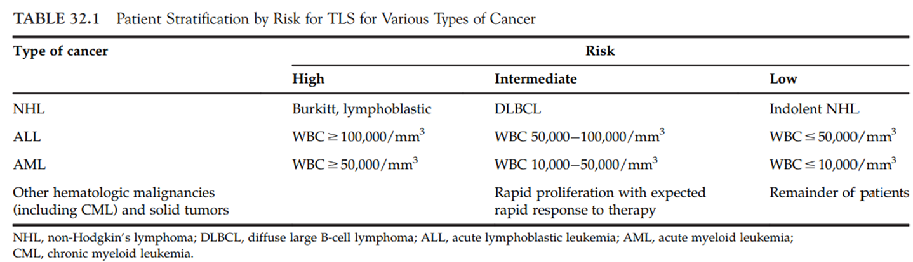
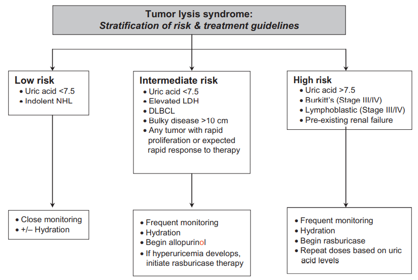
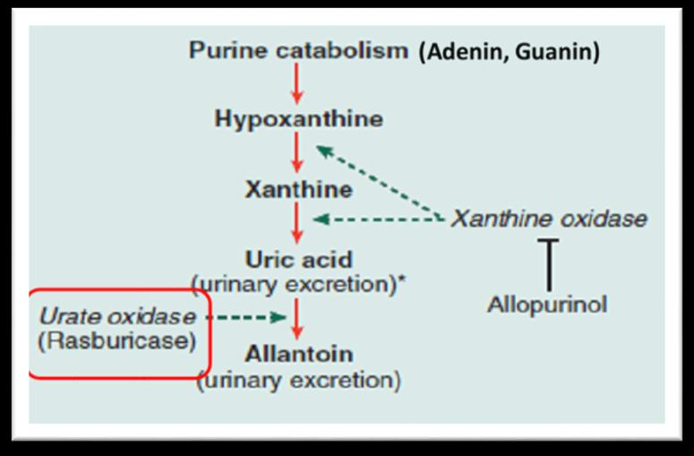
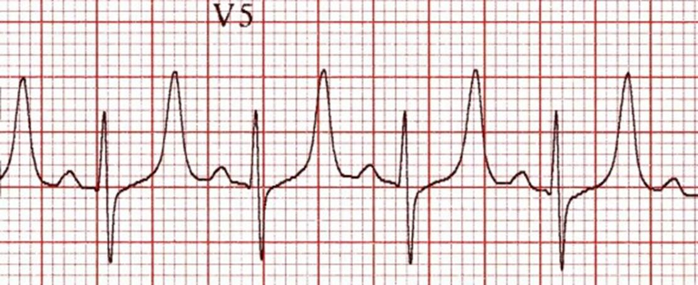
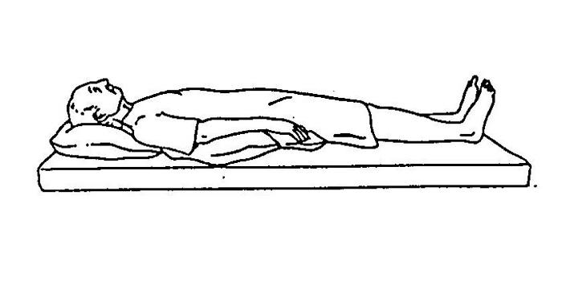

# Pediatrik Onkolojik Aciller

**Dr. Yusuf Ziya Aral**
Aydın ADÜ Tıp Fakültesi – Çocuk Hematolojisi ve Onkolojisi BD, 2025

---

## İçindekiler

- [Onkolojik Acil Durumlar – Genel Bakış](#onkolojik-acil-durumlar--genel-bakış)
- [Tümör Lizis Sendromu (TLS)](#tümör-lizis-sendromu-tls)
  - [Risk Faktörleri](#risk-faktörleri)
  - [Laboratuvar ve Klinik Bulgular](#laboratuvar-ve-klinik-bulgular)
  - [TLS – Risk Sınıflandırması ve Tedavi Algoritması](#tls--risk-sınıflandırması-ve-tedavi-algoritması)
  - [Hiperpotasemi](#hiperpotasemi)
  - [Hiperfosfatemi](#hiperfosfatemi)
  - [Hipokalsemi](#hipokalsemi)
  - [Böbrek Yetmezliği](#böbrek-yetmezliği)
- [Hiperlökositoz](#hiperlökositoz)
- [Hiperkalsemi](#hiperkalsemi)
- [Uygunsuz ADH Sendromu (SIADH)](#uygunsuz-adh-sendromu-siadh)
- [Vena Cava Superior (VCS) Sendromu](#vena-cava-superior-vcs-sendromu)
- [Spinal Kord Basısı](#spinal-kord-basısı)
- [Kemoterapötiklerin Damar Dışına Kaçması](#kemoterapötiklerin-damar-dışına-kaçması)
- [Tiflit (Nötropenik Enterokolit)](#tiflit-nötropenik-enterokolit)
- [Febril Nötropeni](#febril-nötropeni)
- [Kısaltmalar](#kısaltmalar)

***

## Onkolojik Acil Durumlar – Genel Bakış

Onkolojik acil durumlar; kanserin **ilk belirtisi** olarak, **tedavinin bir yan etkisi** olarak veya hastalığın **ilerlemesi/nüksetmesi** sırasında ortaya çıkabilir.

**Başlıca kategoriler:**
- **Metabolik acil durumlar:** Hiperlökositoz, tümör lizis sendromu ve buna bağlı elektrolit dengesizlikleri
- **Kardiyotorasik acil durumlar:** Vena cava superior sendromu ve mediastinal kitle
- **Akut karın süreçleri**
- **Böbrek fonksiyon bozukluğu ve hipertansiyon**
- **Nörolojik acil durumlar**
- **Endokrin acil durumlar**
- **Tedaviye bağlı acil durumlar**

***

## Tümör Lizis Sendromu (TLS)

Tümör hücrelerinin hızlı parçalanması sonucu hücre içi bileşenlerin dolaşıma salınmasıyla ortaya çıkan, potansiyel olarak hayatı tehdit eden metabolik bir acildir.

### Risk Faktörleri

- **Kitle:** Hepatosplenomegali, LAP, karında kitle
- **BK yüksekliği**
- **LDH yüksekliği:** > 1000 U/L

> **Tablo:** Kanser tipine göre TLS risk sınıflandırması. NHL'de Burkitt ve lenfoblastik tip yüksek riskli; ALL'de BK ≥ 100.000/mm³, AML'de BK ≥ 50.000/mm³ yüksek risk grubudur.

### Laboratuvar ve Klinik Bulgular

| Laboratuvar | Klinik |
|---|---|
| Ürik asit ≥ 8 mg/dL | Böbrek yetmezliği |
| Potasyum ≥ 6 mg/dL | Aritmi |
| Fosfor ≥ 6,5 mg/dL | Konvülsiyon |
| Kalsiyum ≤ 7 mg/dL | Ani ölüm |

### TLS – Risk Sınıflandırması ve Tedavi Algoritması

> **Algoritma:** Düşük riskli hastalarda yakın izlem ve hidrasyon yeterli. Orta riskli hastalarda allopürinol başlanır; hiperürisemi gelişirse rasburikaza geçilir. Yüksek riskli hastalarda (ürik asit > 7,5, Burkitt/lenfoblastik evre III-IV, mevcut böbrek yetmezliği) doğrudan rasburikaz başlanır.

> **Diyagram:** Pürin katabolizması yolu: Adenin/Guanin → Hipoksantin → Ksantin → Ürik asit → Allantoin. **Allopürinol** ksantin oksidazı inhibe ederek ürik asit oluşumunu engeller. **Rasburikaz** (ürat oksidaz) ise ürik asidi suda çözünür allantoine dönüştürerek böbreklerden atılımını kolaylaştırır.

### Hiperpotasemi

| | Serum K | Plazma K | EKG Değişikliği |
|---|---|---|---|
| **Psödohiperpotasemi** | Artmış | Artmış | Yok |
| **Gerçek hiperpotasemi** | Artmış | Normal | QRS genişlemesi, T sivrileşmesi |

> **EKG (V5 derivasyonu):** Hiperpotasemide karakteristik sivri, dar ve simetrik T dalgaları görülmektedir. BUNU HİÇ UNUTMAYIN.

**Hiperpotasemi Tedavisi:**

1. **İyon değiştirici reçine:** PO 0,5–1 g/kg
2. **Glukoz-İnsülin:** 1 g/kg glukoz + 0,3 Ü/kg insülin, 30 dakikalık infüzyon
   - Sadece potasyumu hücre içine sokar; K 2–4 saat sonra tekrar hücre dışına çıkar
   - Bu nedenle tedavi ancak **hemodialize kadar vakit kazanmak** amacına yöneliktir

**EKG değişiklikleri ortaya çıkarsa ek olarak:**

3. **Ca-glukonat %10'luk:** 0,5–1 mL/kg yavaş IV (bradikardiye dikkat!)
4. **NaHCO₃:** 2 mmol/kg IV puşe

### Hiperfosfatemi

- **Maksimal düzeyde hidrasyon:** 5000 mL/m²/gün'e kadar çıkılabilir
  - İdrar pH'ı 7'nin üzerine çıkarılmamalıdır
- **Eksojen ve endojen fosfat oluşumunu önlemek:**
  - Oral alım kesilir
  - Parenteral beslenme başlanır
  - Alüminyum hidroksit PO (150 mg/kg/gün, 4–6 dozda)

### Hipokalsemi

- **Semptomatikse ve fosfat normalse** tedavi verilir
- **%10'luk Ca-glukonat:** 0,5–1 mL/kg yavaş IV
- **Magnezyum düzeyi** kontrol edilmelidir
  - Hipomagnezemide: Mg-sülfat 0,2–0,8 mEq/kg IV
> Semptom yoksa tedavi verilmez.
### Böbrek Yetmezliği

TLS'de böbrek yetmezliği nedenleri:

1. Asit ortamda renal tübüllerde **ürik asidin çökmesi**
2. İdrar pH'ı > 7,5 olduğunda **hipoksantinin çökmesi**
3. Allopürinol tedavisinden sonra **hipoksantinin artması**
4. Serum fosfor × kalsiyum değeri > 60 olduğunda **kalsiyum fosfatın** renal tübüllerde ve renal kılcal damarlarda çökmesi
> Sınavlarda sormam.
> EN SON SINAVDA TLS HİDRASYON sorulmuş. 3000 (birim anlamadım)
***

## Hiperlökositoz

### Risk Faktörleri

| Kanser Tipi | Eşik BK Değeri |
|---|---|
| AML | > 200.000/mm³ |
| ALL ve KML | > 300.000/mm³ |

**Ek riskler:**
- < 1 yaş
- AML M4, M5 (lizozim aktivitesi fazla)
- MLL 11q23, t(4;11), inv16, Philadelphia pozitif ALL, Philadelphia-like ALL, FLT3-ITD

### Klinik Özellikler

1. **SSS:** Bulanık görme, konfüzyon, deliryum, papil ödemi
   - Beyin BT: kanama, lösemik plak
2. **Solunum:** Takipne, dispne, hipoksi
   - AC grafisi: pnömoni, lösemik emboli
3. **Genitoüriner:** Oligüri, anüri, priapizm (bir sebebi de hiperlökositoz)

> noktüri: gece idrar yapma.
> niktüri ise gece idrarı gündüzden fazlaysa.

### Tedavi

- **Tümör lizis sendromu profilaksisi:**
  - Hidrasyon + Allopürinol
  - **Sitoredüktif tedavi:** ALL'de prednizolon çok düşük dozda (0,1–0,2–0,5 mg/kg/gün) başlanır, tedrici olarak artırılır

- **Lökostaz:**
  - AÇT izlemi yapılarak hidrasyon
  - **Transfüzyondan kaçınılır** (Hb 8 g/dL üzerine çıkarılmaz)

- **Kanama:**
  - Trombosit < 20.000/mm³ ise trombosit süspansiyonu
  - Pıhtılaşma faktör eksikliği varsa TDP verilir

- **Exchange transfüzyon veya lökoforezis:**
  - Özellikle hipoksi gibi pulmoner ve/veya serebral semptom varlığında erkenden uygulanmalıdır

***

## Hiperkalsemi

### 4 Ana Neden

1. **Osteolitik kemik lezyonu** (özellikle T hücreli lösemi ve lenfoma)
2. Tümör dokusu tarafından salınan **paratiroid-benzeri hormonlara** (paraneoplastik sendrom) bağlı kemik demineralizasyonu
3. **İmmobilizasyon**
4. **Renal atılımda defekt**

### Semptomlar

Bulantı, kusma, kabızlık, poliüri, polidipsi, karın ağrısı, baş ağrısı, letarji, irritabilite, hipertansiyon, aritmi

### Tedavi

- Dehidratasyon ve elektrolit bozukluğunun düzeltilmesi
- **Renal kalsiyum atılımını artırma:** Hidrasyon + furosemid
- **Kemikten kalsiyum mobilizasyonunu azaltma:**
  - Bifosfonatlar (pamidronat)
  - Prednizon
- **Diğer:**
  - Egzersiz
  - Düşük kalsiyumlu diyet
  - Oral veya IV fosfat
  - Hemodiyaliz veya peritoneal diyaliz

***

## Uygunsuz ADH Sendromu (SIADH)

### Nedenler

- Stres, ağrı, cerrahi, mekanik ventilasyon, infeksiyonlar
- SSS ve pulmoner lezyonlar, lenfoma ve lösemi
- **İlaçlar:** Vinkristin, sitozin arabinozid, barbitürat ve opioidler

### Klinik

Oligüri, ağırlık artışı, yorgunluk, letarji, konfüzyon, konvülsiyon, koma

### Tanı Kriterleri

- Hipoosmolalite (< 280 mOsm/L)
- Artmış idrar osmolalitesi (> 500 mOsm/L)
- İdrar/serum osmolalite oranı > 1
- Hiponatremi (< 135 mEq/L) **ÖNEMLİ**
- Artmış idrar dansitesi

### Tedavi

- **Sıvı kısıtlaması:** İzotonik NaCl 500 mL/m²/gün
- **Furosemid:** 1 mg/kg
- **Na defisiti düzeltilmesi:** Na düzeltme hızı **2 mEq/L/saat** olmalı!!
- **Demeclocycline:** Renal tübüllerde ADH etkisini inhibe eder

***

## Vena Cava Superior (VCS) Sendromu

Ön mediastinal kitle nedeniyle Vena Cava Superior'un kompresyonu ve obstrüksiyonu sonucu oluşur.

### Etiyoloji

- **Sıklıkla malign tümörler:** NHL (lenfoblastik veya büyük hücreli lenfoma), Hodgkin hastalığı, ALL (özellikle T-hücreli)
- **Nadiren:** Malign teratom, tiroid CA, nöroblastom, rabdomiyosarkom, Ewing sarkomu; santral venöz kateterin oklüzyonu

> EN SIK SEBEP NON-HODGKİN LENFOMA
> T HÜCRELİ LÖSEMİ DÜŞÜN.

> **Akciğer grafisi:** Superior mediastende genişleme ve kitle görülmektedir (oklar). Sağ plevral efüzyon (*) eşlik etmektedir.

### Klinik Bulgular

- Nefes darlığı, baş ağrısı, yüzde şişlik, baş dönmesi
- Ortopne, pletore, siyanoz (yüz, boyun, üst ekstremite), kollateral venler, papil ödemi, pulsus paradoksus
- **Islak beyin sendromu:** Baş ağrısı, bilinç bulanıklığı, görme bozukluğu, senkop, stupor, konvülsiyon
- **Trakeal kompresyon varsa:** Öksürük, dispne, hava açlığı, wheezing

### Dikkat!

> **Supin pozisyon, stres ve sedasyon → Solunum arrestine yol açabilir!!!!**
> Hastayı entübe etmek gerekebilir.

> **İllüstrasyon:** Supin (sırtüstü) pozisyon VCS sendromlu hastalarda mediastinal kitlenin havayoluna basısını artırarak solunum arrestine neden olabilir.

### Tanı

- **Akciğer grafisi (2 yönlü):** Çoğu zaman superior mediastinal kitle ve genişlemeyi gösterir
- **BT:** Obstrüksiyon yanı sıra kitle ve LAP hakkında bilgi verir
- **MRG:** Daha duyarlıdır
- **Anestezi riski** nedeniyle doku tanısı için **ince iğne aspirasyonu** gibi en az invaziv girişimler tercih edilmelidir
- İnfeksiyöz ve vasküler nedenler dışlanınca en olası tanı **lenfomadır**

### Tedavi

- **Tromboz varsa:** Trombolitik tedavi + santral venöz kateterin çıkarılması
- **Radyoterapi:**
  - Lenfoblastik lenfoma **radyosensitiftir** → 200 cGy kadar düşük doz bile etkili olur. Mümkünse önce biyopsi yapılmalıdır
  - Hodgkin hastalığı ve teratom daha yüksek RT dozu gerektirir
- **Ödemi azaltmak için:** Prednizon 40 mg/m²/gün, 4 dozda
- **Biyopsiden sonra** spesifik KT başlanmalıdır

***

## Spinal Kord Basısı

- Kanserli çocukların **%5**'inde oluşur
- **½'sini sarkomlar** (Ewing sarkomu, rabdomiyosarkom, osteosarkom) oluşturur
- Kalanı: nöroblastom, lenfoma ve lösemi (kloroma)

### Klinik

- **Sırt ağrısı** (lokalize veya radiküler) → %80 olguda oluşur
- İnkontinans, üriner retansiyon, duyu ve kuvvet kaybı

### Tanı

- **Nörolojik muayene**
- **Direkt grafi:** %30–35 olguda anormallik saptanır
- **MRG:** En önemli tanı yöntemidir. Epidural kitleyi saptamada miyelografiye eşit etkinlikte, vertebral metastaz ve paravertebral kitleyi saptamada miyelografiye **üstündür**
- **BOS:** Subaraknoid hastalığı değerlendirmede önemli

### Tedavi

**A. Osteoporoz ve vertebral kollapsa bağlıysa:**
1. Laminektomi
2. Fiksasyon

**B. Tümöre sekonder:**

1. **Deksametazon**
   - *Progresif disfonksiyon ve önemli defisit:*
     - 1–2 mg/kg/gün yükleme dozu (maks: 10 mg); sonra 1,5 mg/kg/gün 4 dozda (maks doz: 4 mg)
   - *Hafif durağan defisit:*
     - 0,25–1 mg/kg/doz, günde 4 kez

2. **Steroid + RT**
   - Tümör dokusu ve üst-alt vertebraya uygulanır. Toplam: 2000–3000 cGy

3. **Steroide ek olarak kemoterapi:**
   - NBL, NHL, HL, Ewing sarkomu kemoterapiye duyarlıdır

4. **Steroide ek olarak dekompresif laminektomi + postop RT**

**C. Fizik tedavi:** Mümkün olduğunca erken başlanmalıdır

***

## Kemoterapötiklerin Damar Dışına Kaçması

### Vesikan Ajanlar

Doku hasarı yapma özelliği olan kemoterapötik ajanlar: **Doksorubisin, daunorubisin, aktinomisin, idarubisin, epirubisin, mitomisin, mechlorethamide, paclitaxel, vinblastin, vinkristin, vinorelbine**

Bu ajanlar lokal ağrı, hassasiyet, doku hasarı ve ağır nekroz yapabilir. Doku hasarı ve ilerleyici ülserasyon, ilacın hücre nükleik asidine bağlanması sonucudur.

### Tedavi

| Ajan | Tedavi |
|---|---|
| **Antrasiklinler** (daunorubisin, doksorubisin, idarubisin) | 24 saat süreyle **buz tatbiki** + ekstremitenin yükseltilmesi. Debridman, greft gerekebilir |
| **Mekloretamin** (mustargen) | İzotonik **sodyum tiosülfat** lokal injeksiyonları + soğuk uygulama |
| **Vinka alkoloidleri** (vinkristin, vinblastin) | **Sıcak kompres** + lokal **hiyalüronidaz** |

> **Not:** Antrasiklinlerde **soğuk**, vinka alkoloidlerinde **sıcak** uygulama yapılır — karıştırmamak önemlidir!

***

## Tiflit (Nötropenik Enterokolit)

Genellikle **çekumda lokalize** olan nekrotizan bir kolittir.

### Etiyoloji

- Özellikle **lösemili** hastalarda ve **kök hücre nakli** alıcılarında şiddetli nötropeni ortamında ortaya çıkar
- Mukozanın bakteriyel veya fungal etkenlerin istilası sonucu oluşur
  - **Gram negatif:** Pseudomonas, E. coli, Clostridium
  - **Fungal:** Candida, Aspergillus
- Kemoterapötik ajanların neden olduğu **mukozal yaralanma** ile bağlantılıdır
- **Komplikasyonlar:** Enfarktüs, perforasyon, peritonit veya septik şok

### Tanı

**Nötropenik bir hastada şüphelenilecek bulgular:**
- Sağ alt kadran ağrısı
- Bağırsak seslerinin yokluğu
- Bağırsak şişkinliği
- Derin palpasyonda hassasiyet veya sağ alt kadranda palpe edilebilen kitle

**Görüntüleme:**
- **Karın grafisi:** Pnömatozis intestinalis, peritonda serbest hava veya bağırsak duvarı kalınlaşması
- **USG:** Çekum bölgesinde bağırsak duvarının kalınlaşması
- **BT taraması** (kesin görüntüleme): Bağırsak duvarının yaygın kalınlaşması

### Tedavi

**Medikal:**
- Oral alımın kesilmesi
- Nazogastrik drenaj
- Geniş spektrumlu antibiyotikler (gram negatif, anaerobik ve antifungal kapsama)
- IV sıvı ve elektrolitler
- Eritrosit ve trombosit desteği
- Hipotansiyon varsa düzeltilmesi (vazopresörler)

**Cerrahi endikasyonlar:**
- Nötropeni ve trombositopeninin düzeltilmesine rağmen **kalıcı GİS kanaması**
- Karın grafisinde serbest hava (perforasyonu gösterir)
- Sepsis/hipotansiyona neden olan nekrotik bağırsak

***

## Febril Nötropeni

### Tanımlar

| | IDSA 2010 | COG 2004 | Flora 2004 |
|---|---|---|---|
| **Ateş** | 1 kez oral ≥ 38,3°C veya ≥ 38°C 1 saatten uzun süren | 1 kez oral ≥ 38,3°C veya 1 saat ara ile en az 2 defa ≥ 38°C | 1 kez aksiller ≥ 38°C veya 1 saat süre ile aksiller ≥ 37,5°C |
| **Nötropeni** | ANS < 500/mm³ veya 48 saat içinde < 500'e düşmesi beklenen | Hafif: 500–1000/mm³, Orta: 200–500/mm³, Ağır: < 200/mm³ | ANS < 500/mm³ veya ANS 500–1000 olup 24–48 saatte < 500'e düşmesi beklenen |

### Acile Başvuruda Yaklaşım

> **Febril nötropenide antibiyotik başlanması için standart zamanlama: 30–60 dakika**

- IV hidrasyon
- Yakın vital bulgu takibi (özellikle TA)
- Hemogram sonucuna göre transfüzyon ihtiyacı
- Takip eden merkezle irtibata geçilmeli

> 30–60 dk içinde hasta sevk edilemeyecekse, ilk doz antibiyotik **3. kuşak sefalosporin (seftriakson 50 mg/kg/doz)** şeklinde yapılıp sevk edilebilir.

**Antipsödomonal etkinlik gösteren antibiyotikler tercih edilmeli:**
- Piperasilin-tazobaktam
- Sefepim
- Karbapenemler

### Ampirik Tedavide Gram (+) Etkili İlaç Ne Zaman?

- Hemodinamik bozulma / ağır sepsis bulguları
- Radyolojik olarak gösterilmiş pnömoni
- Gram (+) üreme
- Klinik olarak ciddi kateter ilişkili enfeksiyon şüphesi
- Deri/yumuşak doku enfeksiyonu
- MRSA, VRE, penisilin dirençli streptokok kolonizasyonu
- Florokinolon profilaksisi / ampirik seftazidim verilen hastalarda ağır mukozit varlığında

### Ampirik Tedavinin Yeniden Düzenlenmesi

- Tedavi yanıtına göre ampirik tedavi yeniden düzenlenir
- Değerlendirme için belirli saatler (24–48 saat, 4–7 gün) önerilse de hastanın genel durumuna göre **her saatte değişiklik yapılabilir**

### Antifungal Tedavi

Fungal enfeksiyonlar özellikle düşünülmesi gereken durumlar:
- Glukokortikoidleri içeren tedavi fazlarında
- Uzamış nötropeni sonrasında
- Pulmoner veya SSS semptomları varlığında

> Mantar enfeksiyonunun ilk olası klinik kanıtı genellikle **antibiyotik sonrası > 4 gün süren ateştir.**
>
> ETRAFTA İNŞAAT VARSA ASPERGİLLOZ MANTAR GÖRÜLÜR.
***

## Kısaltmalar

| Kısaltma | Açılım |
|---|---|
| TLS | Tümör Lizis Sendromu |
| BK | Beyaz Küre |
| LDH | Laktat Dehidrojenaz |
| AML | Akut Miyeloid Lösemi |
| ALL | Akut Lenfoblastik Lösemi |
| KML | Kronik Miyeloid Lösemi |
| NHL | Non-Hodgkin Lenfoma |
| VCS | Vena Cava Superior |
| SSS | Santral Sinir Sistemi |
| SIADH | Uygunsuz Antidiüretik Hormon Sendromu |
| ANS | Absolute Nötrofil Sayısı |
| RT | Radyoterapi |
| KT | Kemoterapi |
| TDP | Taze Donmuş Plazma |
| AÇT | Aldığı çıkardığı takibi |
| NBL | Nöroblastom |
| HL | Hodgkin Lenfoma |
| IDSA | Infectious Diseases Society of America |
| COG | Children's Oncology Group |
| MRG | Manyetik Rezonans Görüntüleme |
| BT | Bilgisayarlı Tomografi |
| MRSA | Metisiline Dirençli Staphylococcus aureus |
| VRE | Vankomisine Dirençli Enterokok |
| PO | Per oral |
| IV | İntravenöz |
