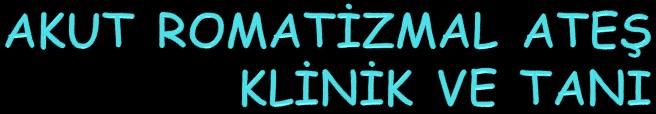
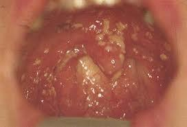
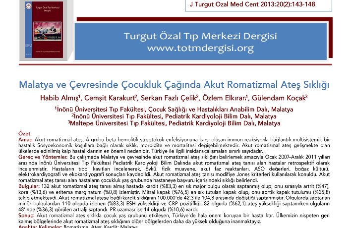

# Akut Romatizmal Ateş (ARA)

**Hazırlayan:** Dr. Serkan Fazlı Çelik **Bölüm:** Adnan Menderes Üniversitesi Çocuk Sağlığı ve Hastalıkları ABD

***

## İÇİNDEKİLER

1. [Tanım](akut-romatizmal-ates.md#tanim)
2. [GAS Enfeksiyonu ve ARA İlişkisi](akut-romatizmal-ates.md#gas-enfeksiyonu-ve-ara-iliskisi)
3. [Epidemiyoloji](akut-romatizmal-ates.md#epidemiyoloji)
4. [Patogenez](akut-romatizmal-ates.md#patogenez)
5. [Klinik Bulgular](akut-romatizmal-ates.md#klinik-bulgular)
6. [Tanı Kriterleri (Jones Kriterleri)](akut-romatizmal-ates.md#tani-kriterleri-jones-kriterleri)
7. [Majör Kriterler](akut-romatizmal-ates.md#major-kriterler)
8. [Minör Kriterler](akut-romatizmal-ates.md#minor-kriterler)
9. [Laboratuvar Bulguları](akut-romatizmal-ates.md#laboratuvar-bulgulari)
10. [Ayırıcı Tanı](akut-romatizmal-ates.md#ayirici-tani)
11. [Tedavi](akut-romatizmal-ates.md#tedavi)
12. [Profilaksi](akut-romatizmal-ates.md#profilaksi)
13. [Olgu Sunumları](akut-romatizmal-ates.md#olgu-sunumlari)

***

## TANIM

**Akut Romatizmal Ateş (ARA):** A grubu beta-hemolitik streptokok (GAS) ilişkili üst solunum yolları enfeksiyonlarından sonra görülen, **süpüratif olmayan enflamatuvar** bir konnektif doku hastalığıdır.

**Tutulan Dokular:**

* **Kalp** (en önemli - sekel bırakan)
* **Eklemler** (en sık)
* **Beyin** (kore)
* **Deri** (eritema marginatum)
* **Deri altı dokusu** (subkutan nodüller)

> **Anahtar Bilgi:** Kardiyak tutulum dışında diğer bulgular kendi kendine sınırlanır (self-limiting) ve sekelsiz iyileşir. Morbidite ve mortaliteyi etkileyen en önemli faktör **kalp tutulumudur**.

> 💡 **"ARA, eklemleri yalar, kalbi ısırır"**

**ARA vs RKH:**

| Terim                               | Açıklama                                                                                                          |
| ----------------------------------- | ----------------------------------------------------------------------------------------------------------------- |
| **Akut Romatizmal Ateş (ARA)**      | Jones kriterlerini karşılayan yeni olgu; kardiyak tutulum olabilir veya olmayabilir                               |
| **Romatizmal Kalp Hastalığı (RKH)** | Romatik aktivite göstermeyen ama kapak lezyonu bulunan yeni veya eski olgu; oskültasyon veya EKO ile desteklenmiş |

***

## GAS ENFEKSİYONU VE ARA İLİŞKİSİ

### A Grubu Streptokokal Hastalıklar

| Akut Enfeksiyonlar        | İmmün Post-streptokoksik Sekeller        |
| ------------------------- | ---------------------------------------- |
| Farenjit, tonsillit       | **Akut romatizmal ateş**                 |
| İmpetigo/piyodermi        | Akut glomerülonefrit                     |
| Otit, sinüzit, pnömoni    | Post-streptokoksik reaktif artrit (PSRA) |
| Nekrotizan fasiit/miyozit | PANDAS                                   |
| Osteomiyelit              |                                          |
| Kızıl ve erizipel         |                                          |
| Puerperal enfeksiyonlar   |                                          |
| Toksik şok sendromu       |                                          |

### Akut Farenjit

* Her çocuk yılda en az **1-8 kez** akut farenjit geçirir
* **%60-70**'i viral
* **%30-40**'ı bakteriyel (çoğu GAS'a bağlıdır)



*Şekil 1: GAS farenjitinde tonsillofarengeal eritem ve eksuda görünümü*

### GAS vs Viral Farenjit Ayırımı

| GAS Enfeksiyonunu Düşündüren                      | Viral Enfeksiyonu Düşündüren |
| ------------------------------------------------- | ---------------------------- |
| 5-15 yaş arasında olma                            | Her yaşta                    |
| Ani başlayan boğaz ağrısı                         | Konjunktivit                 |
| Ağrılı yutkunma                                   | Burun akıntısı               |
| Ateş                                              | Ses kısıklığı                |
| Baş ağrısı                                        | Öksürük                      |
| Bulantı, kusma, karın ağrısı                      | İshal                        |
| Tonsillofarengeal eritem ve eksuda                | Karakteristik eksantem       |
| Yumuşak damakta peteşiler ("doughnut" lezyonları) | Karakteristik enantem        |
| Hiperemik ve şiş uvula                            |                              |
| Hassas, büyümüş ön servikal LAP                   |                              |

***

## EPİDEMİYOLOJİ

### İnsidans

| Bölge                   | Oran            |
| ----------------------- | --------------- |
| Gelişmiş ülkeler        | 0.5-3/100.000   |
| Gelişmekte olan ülkeler | 200-300/100.000 |
| Türkiye (1972-1976)     | 20/100.000      |

* Her yıl tüm yaş gruplarında **470.000 yeni olgu/dünya**
* 5-14 yaş grubunda **340.000 yeni olgu/dünya**
* RKH nedeniyle **233.000-492.000 ölüm/yıl** (%95'i gelişmekte olan ülkelerden)

### Konakçıya Ait Faktörler

* **5-15 yaş** arasındaki çocuklar sıklıkla etkilenir
* **2 yaş altında ve 35 yaş üzerinde görülmez**
* 5 yaş altında artrit fazla, kore olmaz
* 5 yaş altında kardit olursa sekelleri daha fazla
* Erişkinlerde artrit daha fazla
* Rekürrensler adölesanda ve erken erişkin döneminde daha fazla
* Cinsiyet farkı yok, ancak **kore kızlarda fazla**

### Konakçı Yatkınlığını Destekleyen Kanıtlar

* GAS-ÜSYE sonrası hastaların küçük bir kısmında (**%3**) ARA gelişir
* Kardit geçirenlerde romatizmal ateş tekrar sıklığı **%50**
* Tek yumurta ikizi **%18.7**, çift yumurta ikizi **%2.5** (familyal yatkınlık)
* Etnik yatkınlık: Maoriler, Pasifik adaları halkı, Aborjinler, Samoanlar

### Çevresel Faktörler

* Gelişmekte olan ülkeler
* Kalabalık yaşam, yoksulluk
* Kötü beslenme
* Sağlık hizmetlerinin yetersiz oluşu
* **Mevsimsel farklılık:** Ilıman iklimlerde kış ve sonbaharda fazla (GAS-ÜSYE ile paralel)
* Tropikal iklimde ve coğrafi farklılık yok

### Streptokokal Enfeksiyon ile İlişki

* GAS epidemisi yoksa **%0.3**, epidemi halinde **%3-5** oranında ARA ortaya çıkar
* **Gerçek GAS farenjiti** ARA'ya neden olur; GAS taşıyıcılığı immün yanıt göstermez
* GAS taşıyıcılığı **%5-30** oranında (ülkelere göre değişir)
* Farenjitin şiddeti ile ARA gelişimi arasında ilişki yok; olguların **2/3'sinde farenjit hafif**tir
* **M proteini:** Virulans faktörü; insan kalbi ve beyni ile çapraz reaksiyon verir
  * Romatojenik suşlar: M 1, 3, 5, 6, 14, 18, 19, 24, 27, 29 serotipleri
  * Daha az: M 2, 4, 12, 22, 28

***

## PATOGENEZ

### Temel Mekanizma

GAS enfeksiyonu sonrası **duyarlı bireyde** moleküler benzerlik (molecular mimicry) mekanizması ile **doku hasarı** gelişir.

```
Çevresel Faktörler (kalabalık yaşam)
         ↓
Virülan GAS ile Enfeksiyon
         ↓
Duyarlı Konak + Yineleyen GAS enfeksiyonları
         ↓
GAS antijenleri ←→ Konak dokuları (moleküler benzerlik)
         ↓
Genetik olarak belirlenmiş konakçı faktörleri
         ↓
T-hücre aracılı ABARTILI İMMÜN YANIT → İlk ARA episodu
         ↓
Yineleyen enfeksiyonlar → Yineleyen ARA → RKH
```

### Latent Süre

GAS farenjitini takiben **10 gün - 5 haftada** (ortalama 18 gün) ARA bulguları başlar. Bu latent süre olayın **immünolojik bir mekanizma** ile geliştiğini destekler.

> **Kore için latent süre daha uzundur: 1-6 ay**

### Duyarlı Birey

* Otoimmün reaksiyonun asıl düzenleyicisi **6. kromozomdaki HLA Class II allelleri**dir
* Bu moleküller bazı streptokok antijenlerine karşı oluşan hümoral ve hücresel yanıtlarda rol alır
* **D8/17 B hücre alloantijenı:** ARA'da %85 oranında pozitif
* ARA'lı hastaların 1. derece yakınlarında D8/17 yüksek
* Diğer bileşenler: TNF-alfa gen polimorfizmi, ACE gen polimorfizmi

***

## KLİNİK BULGULAR

### Genel Özellikler

* Tanıyı doğru koymak son derece önemlidir
* **Akut** (ateş ve poliartrit) veya **subklinik** seyredebilir
* **Patognomik olan tek bir klinik veya laboratuvar bulgusu yoktur**
* Latent period tipiktir: **10 gün - 5 hafta** (korede 1-6 ay)

***

## TANI KRİTERLERİ (JONES KRİTERLERİ)

### Modifiye Jones Kriterleri (1992)

| Majör Kriterler     | Minör Kriterler                                       |
| ------------------- | ----------------------------------------------------- |
| Kardit              | Ateş                                                  |
| Poliartrit          | Artralji                                              |
| Kore                | Akut faz reaktanlarında yükselme (sedimantasyon, CRP) |
| Eritema marginatum  | EKG'de PR süresinin uzaması                           |
| Deri altı nodülleri |                                                       |

### Modifiye Jones Kriterleri (2015)


*Tablo 1: Akut romatizmal ateş tanısı, değiştirilmiş Jones ölçütleri, 2015*

**2015 Güncellemesindeki Temel Değişiklikler:**

| Özellik           | Düşük Riskli Topluluklar | Orta-Yüksek Riskli Topluluklar               |
| ----------------- | ------------------------ | -------------------------------------------- |
| **Kardit**        | Klinik ve/veya subklinik | Klinik ve/veya subklinik                     |
| **Artrit**        | Sadece poliartrit        | Monoartrit veya poliartrit veya poliartralji |
| **Ateş**          | ≥38.5°C                  | ≥38°C                                        |
| **Sedimantasyon** | ≥60 mm/sa                | ≥30 mm/sa                                    |
| **CRP**           | ≥3 mg/dL                 | ≥3 mg/dL                                     |

### İlk Atak ve Tekrar ARA'da Tanı

**İlk Atak ARA:**
* **2 majör kriter** VEYA
* **1 majör + 2 minör kriter**
* **+ Geçirilmiş GAS enfeksiyonu kanıtı**

**Tekrarlayan Atak ARA:**
* **2 majör kriter** VEYA
* **1 majör + 2 minör kriter** VEYA
* **1 majör + 2 minör** veya **3 minör**
* **+ Geçirilmiş GAS enfeksiyonu kanıtı**

**GAS Enfeksiyonu Kanıtları:**
* Geçirilmiş kızıl
* Streptokok antikor titrelerinde yükselme
* Boğaz kültürü pozitifliği
* Hızlı streptokok antijen testi pozitifliği

### RKH'de Rekürrens Durumu

* Majör kriter aranmaz
* **2 veya 3 minör kriter** (ateş, artralji veya akut faz reaktanlarında yükseklik) + **GAS enfeksiyonu kanıtı** tanı için yeterlidir

### Özel Durumlar

| Durum                                       | Açıklama                                                                                                      |
| ------------------------------------------- | ------------------------------------------------------------------------------------------------------------- |
| **Kore**                                    | Diğer kore nedenleri dışlanmış olmalı; geçirilmiş GAS kanıtı **aranmaz**                                      |
| **Sinsi/geç başlangıçlı kardit**            | Açıklayan başka bir neden yoksa; geçirilmiş GAS kanıtı **aranmaz**                                            |
| **Eritema marginatum ve subkutan nodüller** | Eskisi gibi nadiren tek başına majör bulgu kabul edilir                                                       |
| **Eklem bulguları**                         | Aynı hastada ya majör ya da minör bulgu kabul edilir (ikisi birden değil)                                     |
| **Subklinik kardit**                        | Yetersizlik akımlarının fizyolojik akımdan ayrılması koşuluyla majör kriter kabul edilebilir (**ekokardit!**) |
| **Poliartralji**                            | Yüksek riskli toplulukta diğer nedenler dışlanırsa **majör bulgu** kabul edilir                               |

***

## MAJÖR KRİTERLER

### Majör Kriterlerin Görülme Sıklığı

| Kriter                  | Sıklık     |
| ----------------------- | ---------- |
| **Artrit**              | %70        |
| **Kardit**              | %50 (>%75) |
| **Kore**                | %15        |
| **Eritema marginatum**  | %5         |
| **Deri altı nodülleri** | %5         |

***

### 1. Artrit (%70 - En Sık Majör Kriter)


*Şekil 2: ARA'da diz ekleminde artrit*


*Şekil 3: ARA'da ayak bileği ekleminde şişlik*

**Özellikleri:**

* **Büyük eklemler** tutulur: diz, dirsek, ayak ve el bilekleri
* Ağrı, şişlik, kızarıklık, sıcaklık artışı
* **Asimetrik, gezici** poliartrit/monoartrit
* Salisilatlara **çabuk yanıt verir** (48-72 saat)
* **Sekel bırakmaz**
* Birlikte kardit varsa kardit daha iyi seyirlidir
* Tedavi edilmese bile **2-3 haftada** iyileşir

> 💡 **Önemli:** Salisilatlara hızlı yanıt ARA artritini destekler. Yanıt yoksa tanıyı sorgula!

***

### 2. Kardit (%50 - En Önemli Majör Kriter)

**Klinik ve/veya subklinik olabilir.**

* Akut dönemde **ölüme yol açabilen** ve uzun dönemde **sekel bırakan** en önemli majör bulgudur
* İlk atakta **%40-50** oranında görülür
* Tekrarlayan ataklarda tutulum artar
* **Küçük çocuklarda daha sık ve daha ağır** seyreder; 25 yaşın üstünde nadir
* Kalbin üç tabakası tutulabilir: **endokardit, miyokardit, perikardit**

#### Endokardit


*Şekil 4: Romatizmal endokarditte mitral kapak tutulumu (oklar vejetasyonları gösteriyor)*

* En sık **mitral kapak** (%80), daha az sıklıkla **aort kapağı** (%20) tutulur
* Triküspid ve pulmoner tutulum çok nadir
* **Erken dönemde yetersizlik**, geç dönemde **darlık** bulguları
* **Tipik bulgu: üfürüm**

#### MY ve AY Üfürümü Karşılaştırması

| MY Üfürümü                                                | AY Üfürümü                                                |
| --------------------------------------------------------- | --------------------------------------------------------- |
| Apikal **pansistolik**                                    | Sol 3. İKA'da **erken diyastolik**                        |
| Yüksek frekanslı                                          | Yüksek frekanslı                                          |
| Yumuşak                                                   | Yumuşak                                                   |
| Ağır MY'de apikal middiyastolik üfürüm (**Carey-Coombs**) | **Dekreşendo**                                            |
|                                                           | Ağır AY'de apikal middiyastolik üfürüm (**Austin Flint**) |

#### Ekokardiyografi


*Şekil 5: Ekokardiyografide mitral yetersizlik (renkli Doppler)*

**EKO'da değerlendirilen parametreler:**
* Kardiyak tutulumun derecesi
* Miyokard kontraktilitesinin derecesi (EF)
* MY, AY varlığı ve derecesi
* Ventrikül boyutları
* Perikardit
* **Sessiz kardit** (subklinik kardit)

***

### 3. Kore (%15 - Sydenham Chorea / St. Vitus Dansı)

* **Bazal ganglion** ve **nükleus kaudatus**un inflamasyonu sonucu gelişir
* Latent period: **2-6 ay** (diğer bulgulara göre çok daha uzun)
* **Kızlarda ve adölesanlarda** daha sıktır
* **Sinsi başlar**; davranış bozuklukları tipiktir
* İstemsiz, amaçsız hareketler gözlenir; **uykuda azalır**
* Yazı yazma ve konuşma bozuklukları olur
* **Akut faz reaktanları ve streptokok antikorları negatiftir!**
* Ortalama **3 ayda** iyileşir (6-12 ay sürebilir)
* Olguların **%27**'sinde RKH vardır

> **Kritik:** Korede akut faz reaktanları ve streptokok antikorları negatif olabilir. Tanı için GAS kanıtı aranmaz!

***

### 4. Eritema Marginatum (%5)



*Şekil 6: Eritema marginatum - etrafı belirgin, ortası soluk eritematöz halkasal lezyonlar*

* Nadir görülür ve **karditle sık birlikte** görülür
* Etrafı daha belirgin, ortası soluk eritem (**halkasal**)
* **Ağrısız ve kaşıntısız**
* Gövdede ve ekstremitelerin iç kısımlarında
* Bastırılınca solar
* ARA için **patognomik değil**; ilaç reaksiyonlarında ve glomerülonefritte de görülebilir

***

### 5. Deri Altı Nodülleri (%5)


*Şekil 7: Dirsek ekstansör yüzde subkutan nodül*


*Şekil 8: Subkutan nodül - el bileği*

* Nadir görülen bir majör kriterdir
* Eklemlerin **ekstansör yüzlerinde** 0.5-2 cm'lik şişlikler
* **Ağır karditli vakalarda** daha sıktır
* **Aschoff nodüllerine** benzer
* Sekelsiz iyileşirler
* ARA için **patognomonik değildir**; romatoid artrit ve SLE'de de görülebilir

***

## MİNÖR KRİTERLER

| Kriter            | Düşük Riskli                        | Yüksek Riskli                       |
| ----------------- | ----------------------------------- | ----------------------------------- |
| **Ateş**          | ≥38.5°C                             | ≥38°C                               |
| **Artralji**      | Poliartralji                        | Monoartralji                        |
| **Sedimantasyon** | ≥60 mm/sa                           | ≥30 mm/sa                           |
| **CRP**           | ≥3 mg/dL                            | ≥3 mg/dL                            |
| **PR uzaması**    | EKG'de (kardit majör bulgu değilse) | EKG'de (kardit majör bulgu değilse) |


*Şekil 9: EKG'de PR süresinin uzaması (1. derece AV blok)*

> **Not:** PR uzaması, kardit majör bulgu olarak kullanıldıysa minör kriter olarak **sayılmaz**. Aynı şekilde eklem bulguları da aynı hastada ya majör ya da minör kabul edilir, ikisi birden kullanılmaz.

***

## LABORATUVAR BULGULARI

### Streptokok Enfeksiyonu Tanı Testleri

#### 1. Boğaz Kültürü

* GAS enfeksiyonu için **standart kriter**dir
* GAS farenjitli hastaların asemptomatik aile bireylerini taramak önerilmez
* Ancak **ARA geçiren çocukların aile bireyleri taranmalı** ve GAS pozitif olanlar tedavi edilmelidir

#### 2. Hızlı Streptokok Antijen Testi

* **Spesifitesi yüksek** ancak **sensitivitesi düşük**
* Negatif test GAS enfeksiyonunu dışlamaz
* Negatif olgularda **mutlaka boğaz kültürü** alınmalıdır

#### 3. Streptokok Antikor Testleri

| Antikor         | Yükselme Başlangıcı | Pik Zamanı | Not               |
| --------------- | ------------------- | ---------- | ----------------- |
| **ASO**         | ~1 hafta            | 3-6 hafta  | En sık kullanılan |
| **Anti-DNaz B** | 1-2 hafta           | 6-8 hafta  | En sık kullanılan |

**Antikor Sınıflandırması:**

| Hücre Dışı Ürünlere Karşı                  | Hücre İçi Ürünlere Karşı |
| ------------------------------------------ | ------------------------ |
| **Anti-streptolizin O (ASO)**              | Tipe özgü antikor        |
| Anti-streptokinaz                          | Anti-A karbohidrat       |
| Anti-hiyaluronidaz                         |                          |
| **Anti-deoksiribonükleaz B (Anti-DNaz B)** |                          |
| Anti-nikotinamidadenindinükleotidaz        |                          |

**Önemli Notlar:**
* Antikorlar aylarca yüksek kalabilir
* **Çocuklarda:** >320 Ü (Todd) üzeri anlamlı
* **Erişkinlerde:** >240 Ü (Todd) üzeri anlamlı

### Diğer Laboratuvar Bulguları

**EKG Bulguları:**
* PR süresinin uzaması (minör kriter)

**Radyolojik Bulgular:**
* Kardiyomegali

**Ekokardiyografik Bulgular:**
* Kardiyak tutulumun derecesi
* EF (miyokard kontraktilitesi)
* MY, AY varlığı ve derecesi
* Ventrikül boyutları
* Perikardit, sessiz kardit

***

## AYIRICI TANI

> ARA bir "everyday" hastalığı değildir, insidansı düşüktür. Tanımlayıcı bir laboratuvar testi yoktur. Sinsi başlangıç değişen klinik tablolara neden olmaktadır. Çoğu olgu klasik bir tablo göstermemektedir.

### Artrit ve Ateş Ayırıcı Tanısı

* Juvenil romatoid artrit (JİA)
* **Post-streptokoksik reaktif artrit (PSRA)**
* Sistemik lupus eritematozus (SLE)
* Mikst konnektif doku hastalığı
* Post-infeksiyöz reaktif artrit
* Serum hastalığı
* İnfeksiyöz artrit (gonokokal)
* İnfektif endokardit
* **Akut lösemi**
* **Kawasaki hastalığı**

### Kardit Ayırıcı Tanısı

* Masum üfürüm
* Mitral valv prolapsusu
* Doğumsal kalp hastalıkları
* İnfektif endokardit
* Hipertrofik kardiyomiyopati
* Miyokardit (viral veya idiopatik)
* Perikardit (viral veya idiopatik)

### Kore Ayırıcı Tanısı

* Sistemik lupus eritematozus
* İlaç zehirlenmesi (ekstrapiramidal sendrom)
* Wilson hastalığı
* Tik
* Koreoatetoid serebral palsi
* Ensefalit
* Familiyal kore (Huntington kore)
* İntrakranial tümör
* Metabolik (Lesch-Nyhan, hiperalaninemi, ataksi telanjiektazi)

***

## TEDAVİ

### 1. Genel Önlemler

* Mümkünse **hastanede kesin yatak istirahati** (yakın izlem için)
* Karditin eklenme riski yönünden ilk **2 hafta** içinde sık sık **kardiyak oskültasyon**

### 2. Streptokok Eradikasyonu

Boğazda enfeksiyon bulgusu ve/veya boğaz kültüründe üreme varsa:

| İlaç                                  | Doz                                                | Süre    |
| ------------------------------------- | -------------------------------------------------- | ------- |
| **Benzatin penisilin G** (ilk tercih) | ≥27-30 kg: 1.200.000 Ü İM, <27-30 kg: 600.000 Ü İM | Tek doz |
| Eritromisin                           | 40 mg/kg/gün, 4 dozda (max 1 g/gün)                | 10 gün  |
| Amoksisilin/ampisilin/sefaleksin      | Uygun dozda                                        | 10 gün  |

### 3. Antienflamatuvar Tedavi

#### a) Artrit / Hafif Kardit
---
| Aşama      | İlaç              | Doz                          | Süre          |
| ---------- | ----------------- | ---------------------------- | ------------- |
| 1. faz     | **Aspirin (ASA)** | 75-100 mg/kg/gün, 4 dozda PO | 15 gün        |
| 2. faz     | ASA (azaltılmış)  | 75 mg/kg/gün, 4 dozda PO     | 3-4 hafta     |
| **Toplam** |                   |                              | **5-6 hafta** |

---
#### b) Kardit

| Aşama  | İlaç                                                                                  | Doz                                        | Süre                             |
| ------ | ------------------------------------------------------------------------------------- | ------------------------------------------ | -------------------------------- |
| 1. faz | **Prednizolon (PRD)**                                                                 | 2 mg/kg/gün, 4 dozda PO + **tuzsuz diyet** | 2 hafta                          |
| Geçiş  | PRD azaltılır (2-3 günde bir 1 tablet azalt) + aynı gün **ASA 75 mg/kg/gün** başlanır |                                            | 15-21. gün                       |
| 2. faz | ASA tek başına                                                                        | 75 mg/kg/gün                               | PRD kesildikten sonra en az 1 ay |
---
> **Tuzsuz diyet sadece PRD alınırken uygulanır.**

### 4. Kalp Yetersizliği Tedavisi

PRD'ye ilaveten:
* Kesin yatak istirahati
* Oksijen
* Digoksin + diüretik
* Sıvı + tuz kısıtlaması

### 5. Kore Tedavisi

* Valproik asit
* Fenobarbital
* Diazepam

### 6. Yatak İstirahati

| Durum      | Yatak İstirahati | Kısmi İstirahat |
| ---------- | ---------------- | --------------- |
| **Artrit** | 2 hafta          | 2 hafta         |
| **Kardit** | 4 hafta          | 4 hafta         |

### 7. Egzersiz Kısıtlaması

* Sadece artrit geçirenlerde egzersiz kısıtlamasına **gerek yoktur**
* Hafif kardit geçirenlerde ve hafif sekel kalanlarda yarışma sporları dışında **hafif spora ve beden eğitimine izin** verilir

### 8. Kontrol

* Romatizmal ateş geçirenler: ortalama **yılda bir**
* Kardit geçirenler: en az **6 ayda bir** (yakınması olmasa bile!)

***

## PROFİLAKSİ

### Sekonder Profilaksi

| İlaç                                  | Doz            | Uygulama          |
| ------------------------------------- | -------------- | ----------------- |
| **Benzatin penisilin G** (ilk tercih) | 1.200.000 Ü İM | **3 haftada bir** |
| Eritromisin (penisilin alerjisi)      | 2x250 mg PO    | Her gün           |
| Sulfadiazin (penisilin alerjisi)      | 1x500 mg PO    | Her gün           |

### Profilaksi Süresi

| Durum                         | Süre                          |
| ----------------------------- | ----------------------------- |
| **Artrit (karditsiz)**        | 21 yaşına kadar (en az 5 yıl) |
| **Romatizmal kalp hastalığı** | **Ömür boyu**                 |

> **Kritik:** RKH'de profilaksi ömür boyudur! Bu, ARA'nın en önemli klinik sonucudur.

***

## OLGU SUNUMLARI

### Olgu 1: Dikkat! Her Artrit ARA Değildir

**Hasta:** M.E.M, 6 yaşında erkek

**Başvuru:**
* ARA ön tanısıyla sevk
* 1 gün önce bacaklarda ve kollarda ağrı, el ve ayak bileklerinde şişlik ve kızarıklık (eş zamanlı başlamış)
* 10 gün önce ÜSYE öyküsü
* Dış merkezde ARA tanısıyla penadur yapılmış

**Fizik İnceleme:**
* Sağ ayak bileği şiş, kızarık, hareket kısıtlılığı var

**Tetkikler:**
* Tele, EKG, EKO: Normal
* Boğaz kültürü: Üreme yok
* ASO: 650 Todd Ü, Sedim: 70 mm/sa, CRP: 24 mg/L

**Değerlendirme:**
* 1 majör (artrit) + 2 minör (ateş, akut faz yüksekliği) → ARA?
* Aspirin başlandı

**Seyir:**
* Yatışının 2. gününde vücutta **döküntüler** ortaya çıktı



*Şekil 10: Olgu 1'de ortaya çıkan purpurik döküntüler*

> **Gerçek Tanı: Henoch-Schönlein Purpurası (HSP)**

> 💡 **Ders:** ARA tanısı koymadan önce ayırıcı tanıyı mutlaka düşün!

***

### Olgu 2: Majör Kriter Yoksa ARA Tanısı Konabilir mi?

**Hasta:** B.E, 11 yaşında kız

**Başvuru:**
* 10 gün önce diz, ayak, el bileği ve parmaklarda ağrı
* Sabah sertliği var, kendiliğinden geçiyor
* Ateş yok
* Dış merkezde ARA nedeniyle aspirin başlanmış ama yararı olmamış
* Penadur kullanıyor

**Fizik İnceleme:**
* Genel durum iyi, ateş yok, üfürüm yok
* Artrit bulgusu yok, artralji var

**Tetkikler:**

| Parametre       | Değer      |
| --------------- | ---------- |
| WBC             | 14.600/mm3 |
| Periferik yayma | Normal     |
| CRP             | 35 mg/L    |
| Sedimantasyon   | 78 mm/sa   |
| ASO             | 3590 Ü     |
| Boğaz kültürü   | GAS (+)    |
| Tele, EKG, EKO  | Normal     |

**Değerlendirme:**
* Artralji (minör) + GAS enfeksiyonu kanıtı + akut faz yüksekliği → **Majör bulgu yok!**
* ARA tanısı **konamaz**

**Ayırıcı Tanı:**
* PSRA (Post-streptokoksik reaktif artrit)
* FMF
* JİA

#### PSRA Özellikleri

| Özellik             | PSRA                                                                      | ARA                   |
| ------------------- | ------------------------------------------------------------------------- | --------------------- |
| Latent süre         | **Daha kısa** (10 gün)                                                    | 10 gün - 5 hafta      |
| Artrit tipi         | Akut başlangıçlı, simetrik/asimetrik, **non-migratuar**, her eklemi tutan | Asimetrik, **gezici** |
| Seyir               | Persistan veya rekürren                                                   | Self-limited          |
| Salisilatlara yanıt | **Yetersiz**                                                              | Hızlı (48-72 saat)    |
| Kore/E. marginatum  | **Yok**                                                                   | Olabilir              |
| Kardit gelişimi     | Birkaç ay içinde gelişebilir                                              | İlk atakta %40-50     |
| Jones kriterleri    | **Tam uymuyor**                                                           | Uyar                  |

> 💡 **PSRA ve ARA aynı hastalığın farklı formları olabilir mi?** Tartışmalıdır.

***

### Olgu 3: Her Zaman Alternatif Tanıları Düşün!

**Hasta:** 14 yaşında erkek

**Başvuru:**
* 6 ay önce diz ve kalça eklemlerinde ağrı
* 3-4 hafta önce ÜSY enfeksiyonu geçirmiş
* Dış merkezde ARA düşünülerek aspirin başlanmış, penadur yapılmış

**Fizik İnceleme:**

| Bulgu | Değer                                  |
| ----- | -------------------------------------- |
| Ateş  | 36.7°C                                 |
| Kalp  | Mitral odakta 2/6 sistolik üfürüm      |
| KC    | 2 cm palpabl                           |
| Eklem | Her iki kalça eklem hareketleri ağrılı |

**Tetkikler:**

| Parametre       | Değer                           |
| --------------- | ------------------------------- |
| Sedim           | 63 mm/sa                        |
| CRP             | 85 mg/L                         |
| ASO             | 492 Ü                           |
| Boğaz kültürü   | Üreme yok                       |
| Akciğer grafisi | Kardiyomegali yok               |
| Pelvis grafisi  | Normal                          |
| USG             | KC-dalak hafif büyük            |
| **EKO**         | **Mitral yetersizlik 4.5 m/sn** |

**İlk Değerlendirme:**
* Kardit (majör) + Poliartralji + Sedim/CRP yüksek + ASO yüksek
* → **ARA tanısı** (1 majör + 3 minör), aspirin devam

**Ancak:**
* Her iki kalça eklem hareketleri ağrılı → **Brusella grup aglütinasyonları istendi**

| Test                   | Sonuç         |
| ---------------------- | ------------- |
| Brusella aglütinasyonu | **1/800 (+)** |
| Brusella IgG/IgM       | **(+)**       |
| Brusella Coombs        | **1/640 (+)** |

**Gerçek Tanı: BRUSELLOZ**

**Tedavi:** Rifampisin + Doksisiklin + Gentamisin → 1 haftada akut fazları ve eklem ağrıları geriledi

> 💡 **Ders:** Kalça ağrısı olan bir hastada **bruselloz** mutlaka akla gelmeli! ARA tanısını koymadan önce tüm olasılıkları değerlendir.

***

## SONUÇ

* Geçirilmiş boğaz enfeksiyonu, artrit, davranış değişikliği olan bir hastada **ARA açısından kardiyak değerlendirme** yapılması
* **Profilaktik tedavilerin** başlanması
* Hastalığın seyrini ve kardiyak prognozunu etkilemektedir

> 💡 **Unutma:** ARA tanısı koymak kadar, ARA **olmayan** bir hastaya gereksiz tanı koymamak da önemlidir!
