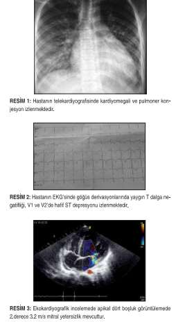
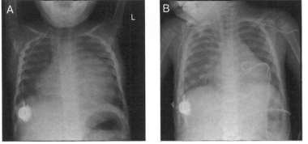
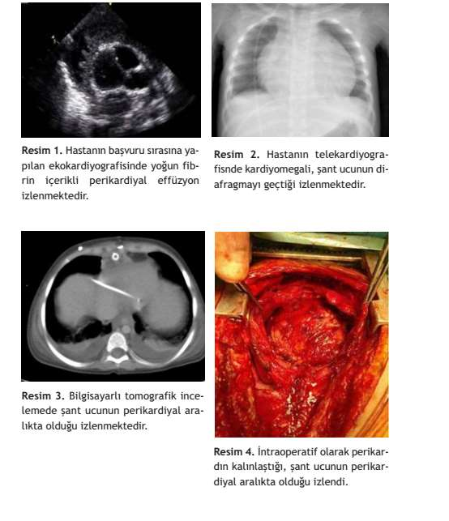

# EDİNSEL KALP HASTALIKLARI: MYOKARDİT, PERİKARDİT, ENDOKARDİT

**Hazırlayan:** Dr. Serkan Fazlı Çelik
**Bölüm:** Adnan Menderes Üniversitesi Çocuk Sağlığı ve Hastalıkları ABD

---

## İÇİNDEKİLER

1. [Miyokardit](#miyokardit)
2. [Perikardit](#perikardit)
3. [Enfektif Endokardit](#enfektif-endokardit)

---

## MYOKARDİT

### Tanım ve Patogenez

Miyokard kasının enflamatuvar hastalığıdır. Etken (bakteri, virüs) tarafından üretilen ekzotoksin/endotoksin miyokarda hasar verir.

```
Etken (bakteri, virüs)
        ↓
Ekzotoksin / Endotoksin
        ↓
    Miyokard Hasarı
        ↓
  Akut Miyokardit (enfektif, toksik)
        ↓
┌───────┼──────────────────────┐
↓       ↓                      ↓
Ölüm  İyileşme     Yabancı protein oluşumu
                               ↓
                        İmmün sistem
                               ↓
                   Antimiyokardiyal antikor
                               ↓
                      Kronik Miyokardit
                               ↓
                     Kardiyomiyopati
```

---

### Etiyoloji

| Etken Grubu                   | Örnekler                                                                                                                               |
| ----------------------------- | -------------------------------------------------------------------------------------------------------------------------------------- |
| **Virüsler**                  | Coxsackie A ve B, Echo, Adenovirüs, İnfluenza, Kızamık, Kızamıkçık, Kabakulak, HSV, EBV, CMV, Rinovirüs, Poliovirüs, Hepatit virüsleri |
| **Bakteriler**                | Meningokok, Klebsiella, Difteri, Salmonella, Klostridya, Tbc, Streptokok, Leptospira, Brusella                                         |
| **Riketsiyalar**              | Çeşitli riketsiya türleri                                                                                                              |
| **Protozoalar**               | Trypanosoma cruzi (Chagas), Toksoplazmozis, Amip                                                                                       |
| **Mantarlar**                 | Aktinomikoz, Koksidioidomikoz, Kandida                                                                                                 |
| **Toksik**                    | Difteri toksini                                                                                                                        |
| **İlaçlar**                   | Sulfonamidler, fenilbutazon vb.                                                                                                        |
| **Hipersensitivite/Otoimmün** | Romatoid artrit, romatizmal ateş, ülseratif kolit, SLE                                                                                 |

> 💡 **En sık etken virüslerdir**, özellikle **Coxsackie B** virüsü

---

### Klinik Bulgular

Hastalığın ağırlığını etkileyen faktörler:

* **Hastanın yaşı:** Yenidoğanda ağır seyreder
* **Enfeksiyon etkeni:**
  * Coxsackie B → yenidoğanda ağır
  * Kızamıkçık, HSV, Toksoplazma → süt çocuğunda ağır
* **Konakçının immün sistemi**

### Semptom ve Bulgular

| Semptomlar    | Bulgular                    |
| ------------- | --------------------------- |
| Halsizlik     | Taşikardi                   |
| Çabuk yorulma | Gallo ritmi                 |
| Kilo alamama  | Dispne                      |
| İştahsızlık   | İrregüler kalp sesleri      |
| Karın ağrısı  | Kalp seslerinin zayıflaması |
| Ateş          | Nabız zayıflığı             |
| Solukluk      | Kaba ve yaş raller          |
|               | Mitral yetersizliği         |

---

### Laboratuvar Bulguları

| Tetkik                       | Bulgular                                                                                             |
| ---------------------------- | ---------------------------------------------------------------------------------------------------- |
| **Tam kan sayımı**           | Lökositoz olabilir                                                                                   |
| **EKG**                      | Sinüs taşikardisi, PAT, ektopik atımlar, tam kalp bloğu, PR uzaması, ST-T değişiklikleri, QT uzaması |
| **Telekardiyografi**         | Normal veya kardiyomegali                                                                            |
| **Ekokardiyografi**          | Ventrikül fonksiyon bozukluğu                                                                        |
| **Radyonükleer çalışma**     | Talyum-201                                                                                           |
| **Sedimantasyon**            | ↑                                                                                                    |
| **Kardiyak enzimler**        | LDH, CK-MB, SGOT, SGPT, Troponin ↑                                                                   |
| **Virüs çalışmaları**        | İzolasyon, antikor titrasyonu                                                                        |
| **MRI**                      | Gallium-67 (biyopsi seçimi için)                                                                     |
| **Endomiyokardiyal biyopsi** | Histolojik çalışma, virüs kültürü                                                                    |



*Şekil 1: Miyokarditte kardiyomegali ve pulmoner konjesyon (telekardiyografi), yaygın T dalga negatifliği ve ST depresyonu (EKG), mitral yetersizlik (ekokardiyografi)*

---

### Tedavi

| İlaç / Yaklaşım           | Detay                                                |
| ------------------------- | ---------------------------------------------------- |
| **Yatak istirahati + O₂** | Temel destek                                         |
| **Monitorizasyon**        | Sürekli kardiyak izlem                               |
| **Dijital (Digoksin)**    | 0.03 mg/kg                                           |
| **Diüretik**              | Furosemid 1 mg/kg (total 2 mg/kg/gün), Spironolakton |
| **Dopamin**               | İnotropik destek                                     |
| **Dobutamin**             | İnotropik destek                                     |
| **Sodyum nitroprussid**   | Afterload azaltma                                    |
| **Lidokain**              | Ventriküler aritmi tedavisi                          |
| **Amiodaron**             | Aritmi tedavisi                                      |
| **İmmünosupresif tedavi** | ⚠️ Tartışmalı                                         |

---

## PERİKARDİT

### Fizyolojik Etkiler

Perikarditin etkisi şunlara bağlıdır:
* Miyokardın yapısı
> * Perikardiyal sıvının **miktarı**, **niteliği** ve **toplanma hızı**

---

### Akut Perikardit Etiyolojisi

| Kategori                 | Nedenler                                                                                                     |
| ------------------------ | ------------------------------------------------------------------------------------------------------------ |
| **Enfeksiyon**           | Bakteriler, mantarlar, parazitler, virüsler                                                                  |
| **Otoimmün hastalıklar** | Kollajen doku hastalıkları                                                                                   |
| **İlaçlar**              | Antikoagülanlar, antitrombotikler, ilaca bağlı "lupus-like" sendrom                                          |
| **Hipotiroidizm**        | Miksödem perikarditi                                                                                         |
| **İdiyopatik**           | En sık tanı                                                                                                  |
| **Malignensi**           | Primer veya metastatik                                                                                       |
| **Böbrek yetersizliği**  | Üremik perikardit                                                                                            |
| **Romatizmal ateş**      | ARA ilişkili                                                                                                 |
| **Terapötik işlemler**   | Kateter, kalp cerrahisi, transplantasyon, pil yerleştirme, postperikardiyotomi sendromu, RF ablasyon, travma |

---

### Semptom ve Bulgular

* Ateş
* Dispne
* Göğüs ağrısı
* **Frotman** (perikardiyal sürtünme sesi)
* Kalp seslerinin şiddetinde ↓

---

### Tamponad Bulguları

**⚠️ ÖNEMLİ - Kardiyak Tamponad:**

* **Hipotansiyon**
* Sistemik venöz basınçta ↑
* Dispne
* Taşikardi
* **Pulsus paradoksus** (inspiryumda sistolik TA'da >10 mmHg düşme)
* Nabız basıncında ↓

---

### Laboratuvar Bulguları

| Tetkik                | Bulgular                                                                                                                         |
| --------------------- | -------------------------------------------------------------------------------------------------------------------------------- |
| **Sedimantasyon**     | ↑                                                                                                                                |
| **Kardiyak enzimler** | ↑                                                                                                                                |
| **EKG**               | QRS voltaj ↓, ST segment ↑, PR segment depresyonu, T dalga amplitüdü ↓ veya ters T dalgası, **elektriksel alternans**, aritmiler |
| **Telekardiyografi**  | Kardiyomegali (su şişesi kalp)                                                                                                   |
| **Ekokardiyografi**   | Perikardiyal efüzyon, tamponad bulguları                                                                                         |
| **MRI**               | Perikard kalınlığı ve efüzyon                                                                                                    |
| **Kateterizasyon**    | Basınç ölçümü                                                                                                                    |

> **Perikardiyosentez:** Hem **tanı** hem **tedavi** amaçlı yapılır

> **Ekokardiyografi:** Perikardiyal efüzyon, tamponad bulguları
> 


*Şekil 2: Perikardiyal efüzyonda telekardiyografide kardiyomegali (A) ve tedavi sonrası düzelme (B)*

---

### Pürülan Perikardit

#### Etiyoloji

| Etken                     | Not                                                     |
| ------------------------- | ------------------------------------------------------- |
| **Staphylococcus aureus** | En sık, en ağır                                         |
| Haemophilus influenzae    | Çocuklarda sık                                          |
| Neisseria meningitidis    | Menenjit ile birlikte                                   |
| Streptokoklar             | A grubu beta-hemolitik strep., S. viridans, S. pyogenes |
| Pnömokoklar               |                                                         |
| Gram (-) basiller         | Salmonella, Klebsiella, Proteus, E. coli, Pseudomonas   |

> **Staphylococcus aureus:** En sık, en ağır 
#### Semptom ve Bulgular

* Hasta **sepsis tablosunda**dır
* Ateş, dispne, takipne
* Taşikardi, kardiyomegali
* **Tamponad** gelişebilir

#### Laboratuvar (çok önemli değil)

* Beyaz küre ↑
* Perikardiyal sıvıda PM lökositler
* Perikardiyal sıvı kültürü (TBC, mantar, virüs)
* Gram boyası, Ziehl-Neelsen (TBC için)
* Kan kültürü, akciğer aspirasyonu, torasentez, gerekirse BOS incelemesi

#### Tedavi

**1. Perikardiyal dekompresyon ve açık drenaj**

**2. Antibiyotik tedavisi:**

| Etken                                                         | Tedavi                                                | Süre              |
| ------------------------------------------------------------- | ----------------------------------------------------- | ----------------- |
| **S. aureus**                                                 | Nafsilin (penisilinaz dirençli penisilin)             | **En az 4 hafta** |
| S. aureus (penisilin alerjisi)                                | Vankomisin, klindamisin veya sefalosporin             | En az 4 hafta     |
| S. aureus (MRSA şüphesi)                                      | **Vankomisin**                                        | En az 4 hafta     |
| H. influenzae, meningokok, A grubu strep., pnömokok, koliform | **III. kuşak sefalosporin** (sefotaksim, seftriakson) | **2-3 hafta**     |
| Penisilin/sefalosporin dirençli pnömokok                      | Vankomisin + III. kuşak sefalosporin                  | 2-3 hafta         |

**3. Destekleyici tedavi:**
* O₂
* İzoproterenol
* Dijital ve diüretik
* Monitorizasyon

#### Mortaliteyi Etkileyen Faktörler

* ❌ Tanıda gecikme
* ❌ Cerrahi drenajın gecikmesi
* ❌ Kardiyak tamponad
* ❌ Ağır miyokard tutulumu
* ❌ Enfeksiyon etkeni (S. aureus en kötü prognoz)
* ❌ Hastanın yaşı (küçük yaş)
* ❌ Beslenme bozukluğu

---

### Viral Perikardit

**Etiyoloji:** Coxsackie grubu, RSV, Suçiçeği, İnfluenza, EBV, Ekovirüs, Kabakulak, HSV, Poliovirüs, Hepatit B

**Klinik:**
* Geçirilmiş ÜSYE öyküsü (**%40-75**)
* Ateş, göğüs ağrısı, karın ağrısı
* Kalpte sesler (frotman)
* Tamponad bulguları (nadir)
* Polimorf lökositlerde hafif ↑

**Tanı:** Nazofarinks ve rektal kültür, viral serolojik testler, perikardiyosentez (nadir yapılır)

**Tedavi ve Prognoz:**
* Genellikle **3-4 haftada spontan** geçer
* 1 hafta yatak istirahati
* Göğüs ağrısı için analjezik
* Kortikosteroidler nadiren gerekir
* Konstriksiyon nadiren gelişir
* Rekürrensler olabilir

---

### TBC Perikardit

**Bulaş Yolları:**
* **Komşuluk yolu:** Trakeobronşiyal sistem, perihiler lenf nodu, sternum ve vertebralar
* **Hematojen yol**

**4 Fazı:**

```
Kuru faz → Efüzyonlu faz → Absortif faz → Konstriktif faz
```

**Semptom ve Bulgular:**
* Dispne, öksürük, kilo kaybı, göğüs ağrısı
* Tamponad, şok
* Hepatomegali, jügüler venöz basınç ↑

**Tanı:**
* Aside dirençli basil aranması ve kültür (perikardiyal sıvı, mide yıkama suyu, balgam)
* **PPD pozitifliği** (≥15 mm)
* Perikardiyal biyopsi
* Diğer bir TBC odağı

**Tedavi:**
* **3-4 ilaç:** İzoniazid + Rifampisin + Pirazinamid + Streptomisin veya Etambutol
* Tedavi süresi: **9-18 ay**

---

### Konstriktif Perikardit

**Etiyoloji:** TBC, viral, travma, bakteriyel, mantar, idiyopatik

**Patofizyoloji:**
* Perikard kalın ve esnekliğini kaybetmiştir ki artık taş gibi olmuştur.
* Diastolik basınç ↑ ve diyastolik doluş ↓
* Stroke volüm ↓

**Tedavi:** **Perikardiyektomi**



*Şekil 3: Konstriktif perikarditte yoğun perikardiyal efüzyon (EKO), kardiyomegali (telekardiyografi), perikardiyal kalınlaşma (BT) ve cerrahi görünüm*

---

## ENFEKTİF ENDOKARDİT

### Etiyoloji

| Etken                                                 | Sıklık                                                           |
| ----------------------------------------------------- | ---------------------------------------------------------------- |
| **Streptococcus viridans**                            | **%50-60**                                                       |
| **Staphylococcus aureus**                             | **%20-60**                                                       |
| S. faecalis (Enterokok)                               | %10-20                                                           |
| S. pneumoniae                                         | %0-21                                                            |
| Gram (-) basiller (E. coli, Enterobakter, Klebsiella) | ≤%5                                                              |
| H. influenzae                                         | Prostetik kapak                                                  |
| Mantar ve mayalar                                     | Antibiyotik kullanan, prostetik materyeli olan, İV ilaç kullanan |

---

### Görüldüğü Durumlar

* **Konjenital kalp hastalıkları** (sekundum ASD **hariç**); en sık **VSD, Fallot tetralojisi, AS ve PDA**
* Romatizmal kapak hastalıkları
* Kalp cerrahisi sonrası
* İdiopatik hipertrofik subaortik stenoz
* Mitral yetersizliği olan MVP
* Ventriküloatriyal şant
* Diyaliz fistülü ve şant
* Transvenöz kalp pili

> ⚠️ **Sekundum ASD'de endokardit riski yoktur!**

---

### Patogenez

**Temel koşullar:**
1. Kanda enfeksiyon etkeninin bulunması (**bakteriyemi**)
2. Endokard veya endotel zedelenmesi

**İmmün mekanizma kanıtları:**
* Serumda romatoid faktör (+)
* Gama globülinlerde ↑
* Dolaşan antikor-antijen kompleksleri
* Kompleman seviyesinde ↓
* Glomerül bazal membranı ve kapak endotelinde IgG ve kompleman birikimi

---

### Semptom ve Klinik Bulgular

| Semptomlar | Bulgular               |
| ---------- | ---------------------- |
| Ateş       | Peteşi                 |
| Miyalji    | KY bulguları           |
| Artralji   | Embolik olaylar        |
| Yorgunluk  | Splenomegali           |
| Baş ağrısı | **Janeway lezyonları** |
|            | **Osler nodülleri**    |

#### Sol vs Sağ Taraf Endokarditi

| Sol Taraf                                  | Sağ Taraf                        |
| ------------------------------------------ | -------------------------------- |
| Periferik emboliler                        | Pulmoner emboliler               |
| Beyin, dalak, böbrekte **iskemi, enfarkt** | Tekrarlayan **pnömoni** atakları |
| **Mikotik anevrizmalar**                   |                                  |

#### İmmün Kompleks Fenomeni ile İlgili Bulgular

* Peteşiler
* **Roth lekeleri** (retinal kanama)
* **Osler nodülleri** (parmak pulpasında ağrılı nodüller)
* **Janeway lezyonları** (avuç içi/tabanda ağrısız eritematöz lezyonlar)
* Hematüri
* Serebral vaskülit
* Artralji

---

### Tanı Kriterleri

#### Patolojik Tanı
* Kültür veya histolojik muayene ile intrakardiyak apse, vejetasyon veya vejetasyondan kaynaklanan embolide **mikroorganizmanın gösterilmesi**
* Vejetasyon ve intrakardiyak apsenin **histolojik olarak gösterilmesi**

#### Duke Tanı Kriterleri

| Tanı Kategorisi | Gerekli Kriter Kombinasyonu                                |
| --------------- | ---------------------------------------------------------- |
| **Kesin Tanı**  | 2 Majör **VEYA** 1 Majör + 3 Minör **VEYA** 5 Minör kriter |

| Majör Kriterler                                               | Minör Kriterler                                                                     |
| ------------------------------------------------------------- | ----------------------------------------------------------------------------------- |
| 1. **Pozitif kan kültürü** (12 saat arayla alınan 2 kültürde) | 1. **Risk faktörü:** İV uyuşturucu kullanımı veya KKH + ateş >38.4°C                |
| 2. **EKO'da kitle:** Hareketli kitle (vejetasyon)             | 2. **Vasküler olaylar:** Arteriyel emboli, intrakranial kanama, Janeway lezyonları  |
| 3. **EKO'da apse:** Perianuler apse                           | 3. **İmmünolojik olaylar:** Glomerülonefrit, Osler nodülleri, Roth spotları, RF (+) |
| 4. **EKO'da ayrılma:** Protez kapakta kısmi ayrılma           | 4. Yukarıdaki kriteri karşılamayan **pozitif kan kültürü**                          |
| 5. **Yeni kapak yetmezliği:** Yeni kapak regürjitasyonu       |                                                                                     |

---

### Laboratuvar Bulguları

| Parametre           | Sıklık     |
| ------------------- | ---------- |
| Sedimantasyon ↑     | %71-94     |
| Pozitif kan kültürü | %68-98     |
| Anemi               | %19-79     |
| Romatoid faktör (+) | %25-55     |
| Hematüri            | %28-47     |
| Lökositoz           | Değişken   |
| Gama globülinler ↑  | Değişken   |
| EKO ile vejetasyon  | **%80-98** |

> ⚠️ **24 saatte farklı yerlerden 3-5 set kan kültürü** alınmalıdır (3-5 mL veya kültür vasatının %10'u kadar). Yavaş büyüyen mikroorganizmalar için kültür **3 hafta** bekletilmelidir.

---

### Negatif Kan Kültürü Nedenleri

* Daha önce antibiyotik alınması
* Riketsiya, virüs ve klamidya endokarditi
* Yavaş büyüyen mikroorganizmalar (Kandida, Hemofilus, Brusella)
* Anaerobik mikroorganizma enfeksiyonu
* Nonenfektif endokardit
* Sağ taraflı endokardit
* Fungal endokardit (özellikle Aspergillus)

---

### Komplikasyonlar

* Kapak veya koroner arter obstrüksiyonu
* Kapaklarda ülserasyon ve perforasyonlar
* Korda ve papiller adale rüptürleri
* Valsalva sinüs anevrizma ve rüptürü
* Anulus ve miyokard apseleri
* **Embolik olaylar**
* Serebral arter anevrizmaları
* Glomerülonefrit
* Hemorajik perikardit ve tamponad
* Prostetik kapaklarda paravalvüler yırtıklar

---

### Tedavi

**Genel İlkeler:**
* **Sinerjik etkili 2 bakterisidal antibiyotik**
* Prostetik kapak endokarditi için **2-3 antibiyotik**
* Tedavi en az **4-6 hafta** devam etmeli
* Prostetik kapak endokarditinde tedavi **6-8 hafta**
* Tedavinin 3-5. gününde alınan kan kültürü **negatif** olmalı
* Tedaviden 1 ay sonraki kan kültürü **negatif** olmalı
* Gerektiğinde **erken cerrahi** tedavi uygulanmalı

#### Erken Cerrahi Endikasyonları

**Kesin Endikasyonlar:**
* Erken gelişen şiddetli kalp yetersizliği (KY)
* Embolizasyon olmasa da büyük ve mobil sol taraflı vejetasyon
* Mantar endokarditi
* Sol kalp endokarditi (aort kapağı)

**Diğer Endikasyonlar:**
* Kapak harabiyetine sekonder KY
* Kalp bloğu gelişmesi
* Paravalvüler kaçaklar
* Enfeksiyonun devamı veya tekrarı
* Tedaviye cevap vermeyen kültür negatif endokarditler
* EKO'da vejetasyon + emboli

---

### Endokardit Profilaksisi

#### Profilaksi Gereken Kardiyak Durumlar

* Prostetik kalp kapakları (biyoprostetik ve homograft dahil)
* Kalp hastalığı olmasa bile **geçirilmiş endokardit öyküsü**
* Kardiyak malformasyonların çoğu
* Romatizmal ve kazanılmış diğer kapak hastalıkları (cerrahi sonrası dahil)
* Hipertrofik kardiyomiyopati
* MY olan MVP

#### Profilaksi Gerekmeyen Kardiyak Durumlar

* ✅ İzole sekundum ASD
* ✅ Rezidüel şantı olmayan ASD, VSD ve PDA ameliyatlarından 6 ay sonra
* ✅ Koroner arter bypass greft cerrahisi
* ✅ MY olmayan MVP
* ✅ Fonksiyonel ve masum üfürümler
* ✅ Kapak disfonksiyonu olmayan geçirilmiş Kawasaki hastalığı
* ✅ Kardiyak pacemaker ve defibrilatör implantasyonu

#### Profilaksi Gereken İşlemler

* Jinjiva kanaması yapan **tüm dental işlemler**
* Tonsillektomi, adenoidektomi
* Solunum yolları mukozası biyopsi ve cerrahi işlemleri
* Rijit skopla yapılan bronkoskopi
* Enfekte dokunun insizyon ve drenajı
* Genitoüriner ve gastrointestinal işlemler
* Kalp cerrahisi

#### Profilaksi Rutin Olarak Gerekmeyen İşlemler

* Orotrakeal entübasyon
* Kalp kateterizasyonu
* Sezeryan ameliyatı
* Tedavi amaçlı abortus
* İntrauterin alet yerleştirilmesi

---

## GENEL ÖZET TABLOSU

| Özellik                    | Miyokardit                  | Perikardit                    | Endokardit                   |
| -------------------------- | --------------------------- | ----------------------------- | ---------------------------- |
| **En sık etken**           | Virüsler (Coxsackie B)      | Virüsler / İdiyopatik         | S. viridans (%50-60)         |
| **Anahtar bulgu**          | Taşikardi, gallo ritmi, KY  | Frotman, göğüs ağrısı         | Ateş + üfürüm değişikliği    |
| **Tehlikeli komplikasyon** | Kardiyomiyopati             | Tamponad                      | Embolik olaylar              |
| **Tanı aracı**             | EKO + biyopsi + enzimler    | EKO + EKG + perikardiyosentez | Kan kültürü + EKO (Duke)     |
| **Tedavi**                 | Destek + dijital + diüretik | Etiyolojiye yönelik + drenaj  | 2 bakterisidal AB, 4-6 hafta |
| **Prognoz**                | Kronik → KMP riski          | Viral: iyi; Pürülan: kötü     | Erken tanı kritik            |

---

## KISALTMALAR

| Kısaltma | Açılım                                   |
| -------- | ---------------------------------------- |
| KY       | Kalp yetersizliği                        |
| KMP      | Kardiyomiyopati                          |
| MY       | Mitral yetersizliği                      |
| AY       | Aort yetersizliği                        |
| MVP      | Mitral valv prolapsusu                   |
| ASD      | Atriyal septal defekt                    |
| VSD      | Ventriküler septal defekt                |
| PDA      | Patent duktus arteriozus                 |
| FT       | Fallot tetralojisi                       |
| AS       | Aort stenozu                             |
| EKO      | Ekokardiyografi                          |
| EKG      | Elektrokardiyografi                      |
| TBC      | Tüberküloz                               |
| ÜSYE     | Üst solunum yolu enfeksiyonu             |
| RSV      | Respiratuvar sinsityal virüs             |
| HSV      | Herpes simpleks virüs                    |
| EBV      | Epstein-Barr virüs                       |
| CMV      | Sitomegalovirüs                          |
| MRSA     | Metisilin dirençli Staphylococcus aureus |
| RF       | Radyofrekans                             |
| AB       | Antibiyotik                              |
| PM       | Polimorfonükleer                         |
| PPD      | Tüberkülin deri testi                    |

---

## ÇIKMIŞ SORULAR

**1) Hangisi yenidoğanda ağır miyokardit nedenidir?** *(2. Blok S22, 3. Blok S48)*

A) Herpes Simplex Virus
B) **Koksaki B** ✅
C) Kızamık
D) Adenovirus
E) Toksoplazma

> **Açıklama:** Yenidoğanda miyokardite en sık neden olan ve **en ağır** seyreden etken **Coxsackie B** virüsüdür. Kızamıkçık, HSV ve Toksoplazma süt çocuğunda ağır seyreder ancak yenidoğan döneminde en ağır tablo Coxsackie B ile ilişkilidir. ⚠️ Bu soru 2 sınavda tekrar sorulmuş!

***

**2) Hangisi endokardit profilaksisinin rutin olarak gerektiği işlemlerdendir?** *(2. Blok S60, 3. Blok S51)*

A) **Kalp cerrahisi** ✅
B) Kalp kateterizasyonu
C) Rijit olmayan bronkoskopi
D) Tedavi amaçlı abortus
E) İntrauterin alet (RİA) yerleştirilmesi

> **Açıklama:** Endokardit profilaksisi gereken işlemler arasında **kalp cerrahisi**, jinjiva kanaması yapan dental işlemler, tonsillektomi/adenoidektomi, solunum yolları mukozası cerrahisi, rijit skopla bronkoskopi ve enfekte doku insizyon/drenajı yer alır. Kalp kateterizasyonu, sezeryan, abortus, İUA yerleştirme ve orotrakeal entübasyon **rutin profilaksi gerektirmez**. ⚠️ Bu soru 2 sınavda tekrar sorulmuş!
