# KONJENİTAL KALP HASTALIKLARI


---

## İÇİNDEKİLER

1. [Genel Bilgiler ve Etiyoloji](#genel-bilgiler-ve-etiyoloji)
2. [Sınıflama](#siniflandirma)
3. [Asiyanotik KKH - Soldan Sağa Şantlar](#asiyanotik-kkh---soldan-saga-santlar)
4. [Asiyanotik KKH - Ventrikül Çıkışı Darlıkları](#asiyanotik-kkh---ventrikul-cikisi-darliklari)
5. [Asiyanotik KKH - Kapak Hastalıkları](#asiyanotik-kkh---kapak-hastaliklari)
6. [Siyanotik KKH](#siyanotik-kkh)
7. [Genel Özet Tablosu](#genel-ozet-tablosu)

---

## GENEL BİLGİLER VE ETİYOLOJİ

### Sıklık

* Canlı doğum: **%0.5-0.8**
* Spontan düşük: %20
* Ölü doğum: %10
* Bir çocukta KKH varsa ikinci çocukta risk: **%3**

### Anne-Babada KKH Varsa Çocuktaki Risk

| Defekt Tipi        | Babada KKH (%) | Annede KKH (%) |
| ------------------ | -------------- | -------------- |
| Aort stenozu       | 3-8            | **13-18**      |
| ASD                | 1-7            | 4-14           |
| AV kanal           | 1              | **14**         |
| Aort koarktasyonu  | 2-8            | 4-6            |
| PDA                | 2-5            | 4-9            |
| Fallot tetralojisi | 1.5            | 2.5            |
| VSD                | 2              | **6-17**       |

> 💡 Annedeki KKH varlığı, babadakine göre çocuk için **daha yüksek risk** taşır

### Etiyoloji

| Neden                                                                                      | Oran    |
| ------------------------------------------------------------------------------------------ | ------- |
| **Multifaktöriyel**                                                                        | **%90** |
| Kromozom anomalileri (Trizomi 21, 18, 13, Turner)                                          | %5      |
| Ailevi/kalıtsal sendromlar (Noonan, Holt-Oram, Ellis-van Creveld, Marfan, Tüberoz skleroz) | %3-5    |
| Çevresel/teratojen (kızamıkçık, talidomid, ilaçlar, maternal DM, alkol, sigara)            | %2-3    |

### Teratojen Etkiler

| Teratojen       | İlişkili KKH                                   |
| --------------- | ---------------------------------------------- |
| **Rubella**     | PDA, pulmoner stenoz, septal defektler         |
| Alkol           | Septal defektler, PDA                          |
| Hidantoin       | PS, AS, koarktasyon, PDA                       |
| Trimetadion     | BAT, Fallot, hipoplastik sol kalp              |
| **Lityum**      | **Ebstein anomalisi**, triküspit atrezisi, ASD |
| **Maternal DM** | BAT, septal defektler, koarktasyon             |
| Fenilketonüri   | Fallot tetralojisi                             |
| **SLE**         | **Kalp bloğu**                                 |

---

## SINIFLANDIRMA

### Doğumsal Kalp Hastalıklarının Dağılımı

| Hastalık                                                         | Sıklık (%)   |
| ---------------------------------------------------------------- | ------------ |
| **VSD**                                                          | **25-30**    |
| ASD (sekundum)                                                   | 6-8          |
| PDA                                                              | 6-8          |
| Aort koarktasyonu                                                | 5-7          |
| Fallot tetralojisi                                               | 5-7          |
| Pulmoner valvüler stenoz                                         | 5-7          |
| Aort stenozu                                                     | 4-7          |
| BAT                                                              | 3-5          |
| Diğer (hipoplastik kalp, trunkus, TPVDA, triküspit atrezisi vb.) | Her biri 1-3 |

> ⚠️ **VSD en sık konjenital kalp hastalığıdır (%25-30)**

### Asiyanotik vs Siyanotik KKH

| Asiyanotik KKH              | Siyanotik KKH                 |
| --------------------------- | ----------------------------- |
| VSD                         | **Fallot tetralojisi**        |
| ASD                         | Pulmoner atrezi               |
| PDA                         | Triküspit atrezisi            |
| Endokardiyal yastık defekti | Ebstein anomalisi             |
| Aort koarktasyonu           | **BAT**                       |
| Aort stenozu                | Trunkus arteriozus            |
| Pulmoner stenoz             | Hipoplastik sol kalp sendromu |
|                             | TPVDA                         |
|                             | Çift çıkışlı sağ ventrikül    |

> Yani bu çocukların %80 i morarmaz (asiyanotik), %20 si morarır (siyanotik)
---

## ASİYANOTİK KKH - SOLDAN SAĞA ŞANTLAR

### 1. Ventriküler Septal Defekt (VSD)

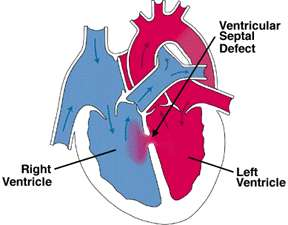

*Şekil 1: VSD'de soldan sağa şant*

#### Defekt Yerleşimi

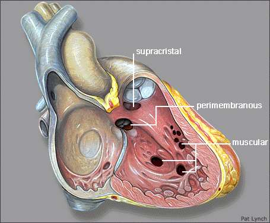

*Şekil 2: VSD defekt yerleşim tipleri - membranöz (en sık), musküler, suprakristal ve inlet*

| Tip                                | Sıklık           | Kapanma                                   |
| ---------------------------------- | ---------------- | ----------------------------------------- |
| **Membranöz**                      | **%70 (en sık)** | Triküspit septal leafleti ile             |
| Musküler                           | %5-20            | Kas hipertrofisi ile (**en sık kapanan**) |
| İnlet (AV kanal tipi)              | %5-8             | **Kapanmaz**                              |
| Outlet (suprakristal, subpulmonik) | %5-7             | Aortun sağ kuspisi ile                    |

* Spontan kapanma oranı: **%9-75** (en sık musküler kapanır)
* En sık **ilk 2 yaşta** kapanırlar

#### Klinik

| VSD Boyutu      | Klinik                                        | Oskültasyon                                     | EKG                                         |
| --------------- | --------------------------------------------- | ----------------------------------------------- | ------------------------------------------- |
| **Küçük**       | Asemptomatik                                  | **Şiddetli** pansistolik üfürüm                 | Normal                                      |
| **Orta**        | Büyüme-gelişme geriliği, egzersiz intoleransı | S2 biraz güçlü, mitralde relatif stenoz üfürümü | Sol ventrikül hipertrofisi, LA hipertrofisi |
| **Büyük**       | Yineleyen AC enfeksiyonları, KKY              | S2 daha güçlü, üfürüm **daha az** şiddetli      | Kombine ventrikül hipertrofisi              |
| **Eisenmenger** | Siyanoz (geri dönüşümsüz)                     |                                                 | Sağ ventrikül hipertrofisi                  |

> 💡 **Paradoks:** Küçük VSD'de üfürüm daha şiddetli, büyük VSD'de üfürüm daha hafiftir (Maladie de Roger)

#### Doğal Seyir

* Membranöz ve musküler VSD: İlk 6 ayda **%30-40** kapanır
* İnlet ve outlet defektler **kapanmaz**
* Büyük VSD'lerde **6-8 haftadan** sonra KKY
* PAH büyük VSD'lerde 6-12 aylarda gelişmeye başlar
* Eisenmenger sendromu (sağ-sol şant): Uzun süreli pulmoner hipertansiyon sonucu

#### Cerrahi Tedavi (sınavda sormayacak)

| Yaş              | Endikasyon                               |
| ---------------- | ---------------------------------------- |
| **<6 ay**        | Kontrol edilemeyen KY                    |
| **6 ay - 2 yaş** | Pulmoner HT (>1/2 sistemik) veya semptom |
| **>2 yaş**       | Qp/Qs >2                                 |

**Kontrendikasyon:**

| Tip     | Kriter                              |
| ------- | ----------------------------------- |
| Mutlak  | Rp/Rs >1 veya Rp >12 Wood ünitesi   |
| Relatif | Rp/Rs >0.75 veya Rp >8 Wood ünitesi |

---

### 2. Atriyal Septal Defekt (ASD)

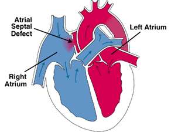

*Şekil 3: ASD'de soldan sağa şant*

#### ASD Tipleri

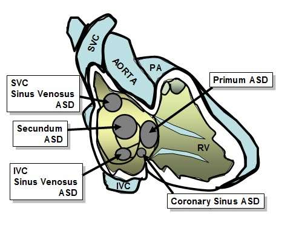

*Şekil 4: ASD tipleri - sekundum (en sık), primum, sinüs venozus ve koroner sinüs ASD*

| Tip                               | Sıklık                                   |
| --------------------------------- | ---------------------------------------- |
| **Sekundum ASD**                  | **%50-70 (en sık)**                      |
| Primum (kapaklara yakın olan) ASD | Endokardiyal yastık defekti ile birlikte |
| Sinüs venozus tipi                | Nadir                                    |

#### Klinik

* Çoğunlukla **asemptomatik**
* İnteratriyal septumdan geçen kan üfürüm yapmaz (düşük basınç farkı)
* **Pulmoner odakta relatif stenoz üfürümü** alınır
* Şant büyükse (Qp/Qs >1.5-2) triküspit odakta relatif stenoz üfürümü
* **S2'de geniş, sabit ikileşme** (patognomonik bulgu)

> ⚠️ **S2'de geniş, sabit ikileşme = ASD'yi düşün!(patognomonik bulgu)**

#### EKG ve Tele

* **EKG:** Sağ aks (+90/+180), **V1'de rsR' paterni** tipik
* **Tele:** Kardiyomegali, RA ve RV genişliği, belirgin PA konusu, pulmoner damar gölgelerinde artış

#### Doğal Seyir

* İlk 3 ayda saptanmışsa spontan kapanma:
  * < 3 mm: **%100** kapanır
  * 3-8 mm: **%80** kapanır
  * \>8 mm: Nadiren kapanır
* KY ve PAH **20-30 yaşlardan sonra** gelişir (%10 olguda bebeklikte KKY)
* Yetişkin çağda **atriyal aritmi** yapabilir
* **İzole sekundum ASD, bakteriyel endokardite zemin hazırlamaz!**

#### Tedavi

* **Qp/Qs >1.5** ise kapatılır
* **Cerrahi:** 3-4 yaşlarda (pulmoner vasküler direnç >10 ünite/m² ise kontrendike)
* **Kateterle kapatma** yapılabilir (sekundum ASD için)

---

### 3. Patent Duktus Arteriozus (PDA)

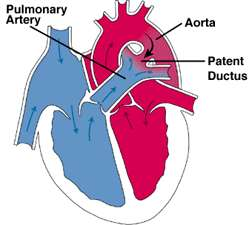

*Şekil 5: Patent duktus arteriozus - desandan aorta ile pulmoner arter arasında bağlantı*

* **Kız/Erkek: 3/1**
* Desandan aorta ile ana pulmoner arter arasında ilişki sağlar
> Gebeliğin ilk trimestrinde **rubella** enfeksiyonu → term bebekte PDA

#### Duktus Kapanma Fizyolojisi

* Term bebekte doğumu takiben ilk **12 saat** içinde fonksiyonel kapanma
* Anatomik kapanma **2-3 hafta** sonunda
* Bebeklerin **>%90**'ında 60. saatte duktus kapanmıştır

#### Klinik

* Küçük PDA: Asemptomatik
* Büyük PDA: KKY, AC enfeksiyonu, atelektazi; taşikardi ve dispne
* PAH gelişince yalnız **alt ekstremitelerde siyanoz** → **Diferansiyel siyanoz**
* **Sıçrayıcı nabız**, artmış nabız basıncı (sistolik ↑, diyastolik ↓)
* Sol klavikula altında **sürekli (continous) üfürüm** ("machinery" murmur)
* Şant büyükse apikal relatif MS üfürümü

> 💡 **Diferansiyel siyanoz (alt ekstremitede siyanoz, üst normal) = PDA + PAH**

#### Doğal Seyir ve Tedavi

* **Prematürede:** Spontan kapanabilir; sıvı kısıtlaması + **İbuprofen veya İndometazin ama kullanılmıyor**
* **Matürde:** Spontan kapanmaz
* Kateterle kapatma yapılabilir
* **6-24 ay** arasında opere edilebilir

---

### 4. Endokardiyal Yastık Defekti (EYD)

* **Komplet defekt:** ASD + VSD + Tek AV kapakta yetmezlik
* **Parsiyel defekt:** Bunların tek tek veya kombinasyonları
* **EKG:** RVH, **superior veya sol aks** (tipik bulgu)
* **Down sendromlu** çocukların **%40**'ında KKH var; bunların **%40**'ı EYD

> ⚠️ **Down sendromu + KKH = Endokardiyal yastık defektini düşün!**

#### Doğal Seyir ve Tedavi

* 1-2 aylıkken KKY gelişir, tekrarlayan AC enfeksiyonları
* Operasyonsuz çoğu olgu **2-3 yaşa** dek kaybedilir
* 6-12 ay arasında PAH gelişmeye başlar
* **Cerrahi:** 3-8 aylar arasında yapılır
* SBE profilaksisi gerekli

---

## ASİYANOTİK KKH - VENTRİKÜL ÇIKIŞI DARLIKLARI

### Ortak Özellikler

* **Sistolik ejeksiyon üfürümü**
* **Ventrikül hipertrofisi**
* **Poststenotik dilatasyon** (valvüler darlıkta)

---

### 1. Aort Stenozu (AS)

* **K/E: 1/4** (erkeklerde 4 kat sık)
* Valvüler, subvalvüler, supravalvüler tipleri var
* En sık **biküspid kapak** ile birlikte

> * Supravalvüler AS: **Williams sendromu** (elfin yüz=cin yüzü, infantil hiperkalsemi)
>
> Williams sendromu olan bütün hastalarda mutlaka aort stenozu açısından değerlendir! 

#### Klinik

| Derece      | Klinik                                         | EKG                        | Tele                       |
| ----------- | ---------------------------------------------- | -------------------------- | -------------------------- |
| Hafif-Orta  | Asemptomatik                                   | Normal olabilir            | Normal                     |
| Ağır        | Egzersizle göğüs ağrısı, yorgunluk, **senkop** | Sol ventrikül hipertrofisi | Aort topuzu geniş olabilir |
| Kritik (YD) | KKY tablosu                                    |                            |                            |

**Fizik Muayene:**
* Sağ üst sternal kenarda sistolik trill
* **2-4/6 sistolik ejeksiyon üfürümü** (sağ 2. İKA - apeks arası)
* Ağır AS: S2'de **paradoksal ikileşme**
* Kritik AS'li YD: KKY tablosunda **üfürüm olmayabilir**

#### Tedavi (Bunları bilmenize gerek yok)

| Durum                                           | Yaklaşım                                  |
| ----------------------------------------------- | ----------------------------------------- |
| Kritik AS (YD, KKY'de)                          | **Acil cerrahi veya balon valvüloplasti** |
| Gradiyent >75 mmHg veya kapak alanı <0.5 cm²/m² | Balon veya elektif cerrahi                |
| 50-75 mmHg, semptomatik veya artış              | Balon                                     |
| <50 mmHg, asemptomatik                          | Tedavi yok, izlem                         |
| Subvalvüler gradiyent >30 mmHg                  | Cerrahi                                   |
| Supravalvüler gradiyent >50 mmHg                | Cerrahi                                   |

---

### 2. Pulmoner Stenoz (PS)

* İnfundibuler stenoz: **Fallot tetralojisi**nde sık
* Periferik PS: **Williams** ve **postrubella sendromu**nda sık
* Hafif: Asemptomatik, pulmoner ejeksiyon klik + sistolik ejeksiyon üfürümü
* **EKG:** Sağ ventrikül hipertrofisi; kritik PS'de (YD) sol ventrikül hipertrofisi
* **Tele:** AC vaskülaritesi azalmış

**Tedavi:**
* Hafif-orta: Tedavi yok, takip
* Sağ ventrikül çıkış yolu basınç farkı **≥40 mmHg**: Ameliyat veya balon dilatasyonu
* Ciddi PS: **PGE₁ infüzyonu** → genel durum düzelince **balon valvüloplasti**

---

### 3. Aort Koarktasyonu

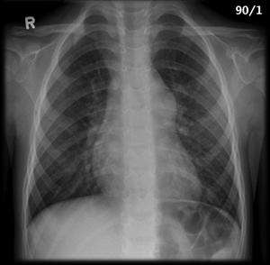

*Şekil 6: Aort koarktasyonunda telekardiyografik bulgular*

* Aort arkının lokalize konstriksiyonu
* %82 kompleks, %12 izole
* **%98** oranında sol a. subklavia çıkışının hemen distalinde (duktusun karşısı)
* Vakaların **%85**'inde **biküspid aort** bulunur
* **Turner sendromu**lu vakaların **%30**'unda bulunur
* Vakaların yarısında VSD, %60'ında ekstrakardiyak anomaliler

#### Klinik

* İlk 6 hafta içinde taşipne, taşikardi, beslenme bozukluğu, akut dolaşım kollapsı
* Sonradan asemptomatik olabilir, bazen bacaklarda yorgunluk
* **Femoral nabzın alınamaması** ile tanıdan şüphelenilir
* Üst ekstemitede kan basıncı alttan **en az 10-15 mmHg daha yüksek**
* İnen aortada sistolik ejeksiyon üfürümü (sol interskapular saha)

> ⚠️ **Femoral nabız alınamıyorsa veya kol-bacak TA farkı varsa → Koarktasyon düşün!**
>
> Normal insanlarda alt ekstremite tansiyonu daha yüksektir. 

#### Radyoloji ve EKG

* **Tele:** 3 belirtisi, baryumlu özefagus grafisinde **E belirtisi**, >5 yaş **kostalarda çentikleşme**
* **EKG:** 0-6 ay arası RVH (fetal RV volüm yükü), 2 yaşa kadar LVH gelişir

#### Tedavi

* **Ciddi koarktasyon** (KKY tablosu): **PGE₁ infüzyonu** → balon anjioplasti veya cerrahi
* Asemptomatik: Kol TA - bacak TA >20 mmHg veya eforla belirgin fark → cerrahi veya balon
* En uygun zaman: **2-4 yaş** arası

---

## ASİYANOTİK KKH - KAPAK HASTALIKLARI

### Mitral Stenoz

**4 temel dinleme bulgusu:**
1. Birinci kalp sesinde **sertleşme**
2. Mitral **açılma sesi**
3. Diastolik dekreşendo üfürüm (**mid-diastolik rulman**)
4. **Presistolik üfürüm** (atriyal fibrilasyonda duyulmaz - çünkü atriyum kasılmasına bağlı)

**EKG:** Sağ ventrikül hipertrofisi ve **sivri P dalgaları** (P mitrale)

### Mitral Yetersizlik

* En önemli bulgu: Apekste işitilen ve koltuk altına yayılan **pansistolik üfürüm**
* Sol atriyum ve ventrikül genişler

### Mitral Prolapsus (MVP)

* Mitral kapak yaprakçıklarının sistol sırasında atriyum içine çökmesi
* **Geç sistolik üfürüm** + **mid-sistolik klik** veya multipl klikler
* **Marfan sendromu** ve bağ doku hastalıklarında sık
* En sık **ASD ile birlikte**
* MY varsa → **endokardit profilaksisi** gerekli

### Aort Yetersizliği

* Kalbi **en çok büyüten** romatizmal kapak hastalığıdır
* S1 hafiflemiş, S2'den sonra başlayan diastolik **dekreşendo** üfürüm
* **Austin Flint üfürümü:** Aortik yetmezlik akımının mitral ön yaprakçık açılımını kısıtlamasına bağlı geç diastolik üfürüm (organik MS'den farkı: mitral açılma sesi duyulmaz, EKO'da sol atriyum normal)

---

## SİYANOTİK KKH

### Sınıflama

| Azalmış Pulmoner Kan Akımı   | Artmış Pulmoner Kan Akımı         |
| ---------------------------- | --------------------------------- |
| **Fallot tetralojisi**       | **BAT**                           |
| PS + VSD ile BAT             | Çift çıkışlı RV                   |
| Triküspit atrezisi           | Trunkus arteriozus                |
| PS ile çift çıkışlı RV       | **TPVDA**                         |
| PS ile tek ventrikül         | **Hipoplastik sol kalp sendromu** |
| Pulmoner atrezi (intakt İVS) | Tek ventrikül                     |
| Ebstein anomalisi            |                                   |

#### Semptom Farklılıkları

| Pulmoner Kan Akımı Azalmış | Pulmoner Kan Akımı Artmış |
| -------------------------- | ------------------------- |
| Çabuk yorulma              | Çabuk yorulma             |
| **Çömelme**                | Efor dispnesi             |
| **Hipoksik nöbet**         | Gelişme geriliği          |
| Efor dispnesi              | **Kalp yetmezliği**       |
| Gelişme geriliği           | **Pulmoner HT**           |
|                            | Sık AC enfeksiyonu        |
|                            | Siyanoz **hafif**         |

---

### 1. Fallot Tetralojisi

**Siyanotik KKH arasında en sık rastlananıdır.**

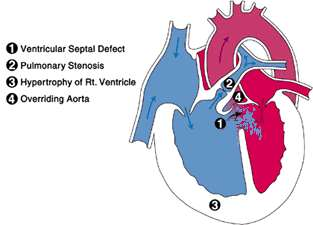

*Şekil 7: Fallot tetralojisinin 4 bileşeni: VSD, pulmoner stenoz, sağ ventrikül hipertrofisi, aortanın "overriding" pozisyonu*

**4 Bileşen:**
1. **VSD** (geniş)
2. **Pulmoner stenoz** (infundibuler ve/veya valvüler)
3. **Sağ ventrikül hipertrofisi**
4. **Aortanın sağa kayması** (overriding aorta)

> 💡 **Hemodinamiyi belirleyen PS şiddetidir.** Hafif PS → soldan sağa şant (asiyanotik Fallot); Ağır PS → sağdan sola şant (siyanotik Fallot)

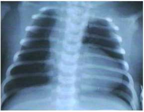

*Şekil 8: Fallot tetralojisinde telekardiyografide "tahta pabuç" (coeur en sabot) görünümü*

#### Hipoksik Nöbet

```
RV çıkış yolunda spazm veya SVR ↓
           ↓
    Sağ-sol şant ↑
           ↓
       Hipoksi ↑
           ↓
     Hiperpne gelişir
           ↓
  Sistemik venöz dönüş ↑
           ↓
    Sağ-sol şant daha da ↑
      (KISIR DÖNGÜ)
           ↓
Üfürüm kaybolur, siyanoz derinleşir
           ↓
Bilinç kaybı, konvülziyon → Eksitus
```

**⚠️ Hipoksik Nöbet Tedavisi:**

| Tedavi                  | Mekanizma                                      |
| ----------------------- | ---------------------------------------------- |
| **Diz-göğüs pozisyonu** | Sistemik venöz dönüş ↓, SVR ↑                  |
| **Morfin**              | Hiperpneyi önler                               |
| **Bikarbonat**          | Asidozun solunum merkezini uyarmasını engeller |
| **Oksijen**             | Hipoksiyi düzeltir                             |
| **Ketamin**             | Sedasyon + SVR ↑                               |
| **Propranolol**         | İnfundibuler spazmı çözer, kalp hızı ↓         |

#### Tedavi

* Genellikle yenidoğan döneminde tedavi gerekmez
* Çok ciddi siyanoz ve hipoksi → **Blalock-Taussig şant** ameliyatı
* **2 yaşlarında** tam düzeltme operasyonu

---

### 2. Büyük Arter Transpozisyonu (BAT)

**Yenidoğan döneminde en sık siyanoza neden olan KKH'dır.**

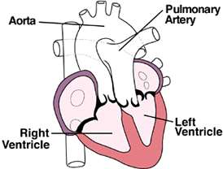

*Şekil 9: BAT - pulmoner arter sol ventrikülden, aorta sağ ventrikülden çıkar*

* **Erkeklerde 3 kat** daha fazla
* **Diyabetik anne** çocuklarında sık
* PA → LV'den, Aorta → RV'den çıkar
> * Yaşam için mutlaka **ASD, VSD veya PDA** gibi bir bağlantı gereklidir (en sık PFO)
* Doğumdan hemen sonra **siyanoz** (geniş VSD'de daha hafif)

#### Klinik ve Tanı

* Genellikle üfürüm **yok**
* **S2 tek** (P2 duyulamadığından) ve şiddetli
* Tüm vakalarda **disritmiler** sık (tam kalp bloğu, WPW)
* **EKG:** Sol prekordiyal derivasyonlarda Q bulunmaması + V4R ve V1'de Q dalgası
* **Tele:** "Yan yatan yumurta" (egg on a string) görünümü

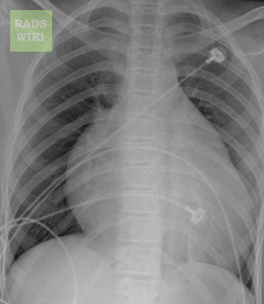

*Şekil 10: BAT'ta telekardiyografide "yan yatan yumurta" görünümü*

#### Tedavi

* KY ve asidoz → Medikal tedavi
* ASD yetersizse duktusu açık tutmak için **PGE₁ infüzyonu** + **Rashkind balon atriyal septostomi**

> **İlk **2 hafta** içinde **arteryel switch (Jatene)** ameliyatı**

---

### 3. Ebstein Anomalisi

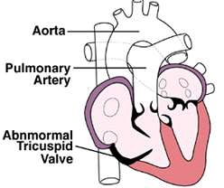

*Şekil 11: Ebstein anomalisi - triküspid kapağın normalden aşağıya yerleşimi*

* Triküspid kapak normalden **daha aşağıya** yerleşmiştir
* Sağ atriyum ve atrialize segment hipertrofik; **triküspid yetersizliği** var
* Foramen ovale ve ASD → sağ-sol şant
* **Paroksismal atriyal taşikardi** sık
* S2 **geniş çift** duyulur
* **Lityum** kullanımı ile ilişkili
* **Tele:** Büyük sağ atriyum, kardiyomegali, kalp kaidesinin darlığı

---

### 4. Trunkus Arteriozus

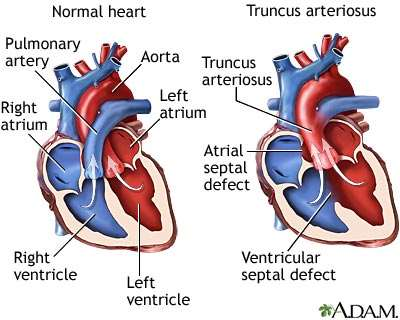

*Şekil 12: Trunkus arteriozus - aort ve pulmoner arter tek bir damar olarak çıkar*

* Kalpten aort ve pulmoner arter **tek bir damar** olarak çıkar
* **Di George sendromu** ile birliktelik: **%33**
* Geniş VSD nedeniyle kanlar karışır → siyanoz
* İlk günlerde siyanoz, ilk haftalarda KY bulguları
* **Tele:** Kardiyomegali, artmış pulmoner vaskülarizasyon
* **EKG:** RV veya kombine ventrikül hipertrofisi
* **Cerrahi:** PAH gelişmeden ilk **3-4 ay** içinde; **Rastelli ameliyatı**

---

### 5. Total Pulmoner Ven Drenaj Anomalisi (TPVDA)

* **Erkeklerde 4 kat** daha sık
* Pulmoner venler sol atriyum yerine sağ atriyuma veya sistemik venlere açılır
* Yaşam için mutlaka **ASD veya foramen ovale** gerekli

**4 Tipi:**

| Tip             | Drenaj Yeri                          |
| --------------- | ------------------------------------ |
| Suprakardiyak   | V. cava superiora                    |
| İntrakardiyak   | Koroner sinüs veya sağ atriyuma      |
| Subdiafragmatik | V. cava inferior veya porta hepatise |
| Mikst           | Karışık                              |

* **EKG:** RV hipertrofisi
* **Tele:** Kardiyomegali, artmış vasküler gölge; suprakardiyak tipte **"kardan adam"** veya **"8 rakamı"** görüntüsü
* **Tedavi:** KY tedavisi → 2-3. haftada pulmoner venler sol atriyum ile ağızlaştırılır

---

### 6. Hipoplastik Sol Kalp Sendromu

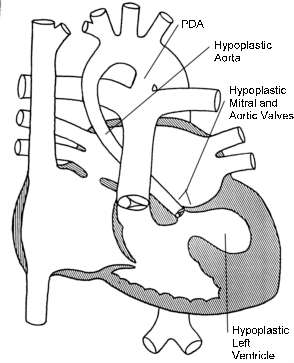

*Şekil 13: Hipoplastik sol kalp sendromu - sol ventrikül, asendan aort, mitral ve aort kapaklarının hipoplazisi*

* Sol ventrikül ve asendan aortun ileri derecede hipoplazisi
* Aort ve mitral kapakların atrezisi
* Sistemik dolaşım **duktus aracılığı** ile sağlanır
* İlk günlerde KY bulguları, 48. saatten itibaren siyanoz
* **Tedavi:** PGE₁ infüzyonu + **Norwood ameliyatı** veya **ortotopik kalp nakli**
* **Prognoz kötüdür** - çoğu hasta ilk günlerde/haftalarda kaybedilir

---

### 7. Pulmoner Atrezi (İntakt İVS)

* Sağ ventrikül hipoplazik
* Kan akışı: RA → FO → LA → LV → Aorta; pulmoner dolaşım duktus ile sağlanır
* Siyanoz, bradikardi, hipotoni, asidoz
* S2 tek, genellikle üfürüm yok
* **EKG:** Sol ventrikül hipertrofisi (paradoks)
* **Tedavi:** PGE₁ → Aortopulmoner şant → 2-4 yaşta **Fontan ameliyatı**

---

### 8. Triküspid Atrezisi

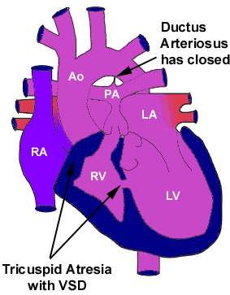

*Şekil 14: Triküspid atrezisi - kan FO aracılığı ile sol atriyuma geçer*

* Kan: RA → FO → LA → LV → VSD/PDA ile AC'lere
* Doğumdan sonra siyanoz
* **EKG:** **Sol aks sapması** ve sol ventrikül hipertrofisi (tipik!)
* **Tedavi:** PGE₁ → Blalock-Taussig şant → 2-4 yaşta **Fontan ameliyatı**

> 💡 **Siyanotik KKH + Sol aks sapması + LVH = Triküspid atrezisi**

---

## GENEL ÖZET TABLOSU

### Asiyanotik Kalp Hastalıkları
| KKH               | En Önemli İpucu                                     | Tele Bulgusu              | İlişkili Sendrom/Durum       |
| ----------------- | --------------------------------------------------- | ------------------------- | ---------------------------- |
| **VSD**           | En sık KKH, pansistolik üfürüm                      | AC kanlanması ↑           | -                            |
| **ASD**           | S2'de geniş sabit ikileşme, rsR'                    | PA konusu belirgin        | -                            |
| **PDA**           | Sürekli üfürüm, diferansiyel siyanoz                | AC kanlanması ↑           | Rubella                      |
| **EYD**           | Sol aks, AV kanal defekti                           |                           | **Down sendromu**            |
| **Koarktasyon**   | Femoral nabız ↓, kol-bacak TA farkı                 | 3 belirtisi, rib notching | **Turner sendromu**          |
| **AS**            | Sistolik ejeksiyon üfürümü, senkop                  | Aort topuzu geniş         | **Williams** (supravalvüler) |
| **PS**            | Ejeksiyon klik                                      | AC vaskülaritesi ↓        | -                            |
| **Mitral Stenoz** | Mitral açılma sesi, diyastolik rulman               | P mitrale (EKG)           | -                            |
| **Mitral Yetm.**  | Apekste pansistolik üfürüm                          | Sol kalp genişlemesi      | -                            |
| **MVP**           | Mid-sistolik klik + geç sistolik üfürüm             | -                         | **Marfan sendromu**          |
| **Aort Yetm.**    | Kalbi en çok büyüten kapak hast., dekreşendo üfürüm | Devasa gölge              | **Austin Flint üfürümü**     |

### Siyanotik Kalp Hastalıkları
| KKH                | En Önemli İpucu                        | Tele Bulgusu          | İlişkili Sendrom/Durum |
| ------------------ | -------------------------------------- | --------------------- | ---------------------- |
| **Fallot**         | Hipoksik nöbet, çömelme                | **Tahta pabuç**       | -                      |
| **BAT**            | YD'da en sık siyanoz, S2 tek           | **Yan yatan yumurta** | Maternal DM            |
| **Ebstein**        | PAT, triküspit kapağın aşağı yerleşimi | Büyük RA              | **Lityum**             |
| **Trunkus**        | Tek arter, siyanoz + KY                | AC kanlanması ↑       | **Di George**          |
| **TPVDA**          | Pulmoner venler yanlış yere açılır     | **Kardan adam / 8**   | -                      |
| **HLHS**           | Prognoz kötü, sol kalp hipoplazisi     |                       | -                      |
| **Triküspit atr.** | Sol aks + LVH + siyanoz                |                       | -                      |
| **Pulmoner atr.**  | Sol ventrikül hipertrofisi (paradoks)  | AC vaskülaritesi ↓    | -                      |

---

## PGE₁ İNFÜZYONU GEREKTİREN DURUMLAR

Duktusa bağımlı tüm siyanotik KKH'larda **PGE₁ infüzyonu** ile duktus açık tutulur:

* Kritik pulmoner stenoz / Pulmoner atrezi
* Triküspid atrezisi
* BAT (ASD yetersizse)
* Hipoplastik sol kalp sendromu
* Kritik aort stenozu
* Ciddi aort koarktasyonu

---

## KISALTMALAR

| Kısaltma | Açılım                                  |
| -------- | --------------------------------------- |
| KKH      | Konjenital kalp hastalığı               |
| VSD      | Ventriküler septal defekt               |
| ASD      | Atriyal septal defekt                   |
| PDA      | Patent duktus arteriozus                |
| EYD      | Endokardiyal yastık defekti             |
| AS       | Aort stenozu                            |
| PS       | Pulmoner stenoz                         |
| BAT      | Büyük arter transpozisyonu              |
| TPVDA    | Total pulmoner ven drenaj anomalisi     |
| HLHS     | Hipoplastik sol kalp sendromu           |
| KKY/KY   | Konjestif kalp yetersizliği             |
| PAH      | Pulmoner arter hipertansiyonu           |
| RVH/LVH  | Sağ/Sol ventrikül hipertrofisi          |
| SVR      | Sistemik vasküler rezistans             |
| MY/AY    | Mitral/Aort yetersizliği                |
| MS       | Mitral stenozu                          |
| MVP      | Mitral valv prolapsusu                  |
| SBE      | Subakut bakteriyel endokardit           |
| FO/PFO   | Foramen ovale / Patent foramen ovale    |
| İVS      | İnterventriküler septum                 |
| Qp/Qs    | Pulmoner akım / Sistemik akım oranı     |
| Rp/Rs    | Pulmoner rezistans / Sistemik rezistans |
| PGE₁     | Prostaglandin E1                        |

---

## ÇIKMIŞ SORULAR

**1) Sistemik lupus eritematozus hangi kalp hastalığı yapar?** *(1. Blok S3)*

A) Aort koarktasyonu
B) **Kalp bloğu** ✅
C) Aort yetmezliği
D) Biküspid aorta

> **Açıklama:** SLE'li annelerin bebeklerinde neonatal lupus gelişebilir. Anti-Ro (SSA) ve anti-La (SSB) antikorlarının transplasental geçişi, fetüste AV ileti sistemini etkileyerek **konjenital kalp bloğu**na neden olur. Bu durum teratojen etkiler tablosunda da yer almaktadır.

***

**2) Kalpten aort ve pulmoner arter tek bir damar olarak çıkar. Beraberinde kalp dışı anomaliler de sık görülür (DiGeorge sendromu). Geniş VSD nedeniyle sistemik ve venöz dönüş kanı karışır ve hasta siyanotik hale gelir. Hastalığın adı nedir?** *(1. Blok S9, 2. Blok S47, 3. Blok S47)*

A) **Trunkus Arteriozus** ✅
B) Triküspid Atrezisi
C) Ebstein Anomalisi
D) Büyük arter transpozisyonu
E) Hipoplastik sol kalp sendromu

> **Açıklama:** Trunkus arteriozusta kalpten tek bir büyük damar çıkar. **Di George sendromu** ile **%33** oranında birliktelik gösterir. Geniş VSD nedeniyle kanlar karışır ve siyanoz gelişir. ⚠️ Bu soru 3 sınavda da tekrar sorulmuş!

***

**3) Aşağıdaki hastalıkların hangisinde duktusun faydası yoktur?** *(1. Blok S10)*

A) Pulmoner stenoz
B) Aort stenozu
C) Aort Koarktasyonu
D) **VSD** ✅
E) Hipoplastik sol kalp sendromu

> **Açıklama:** PGE₁ infüzyonu ile duktus açık tutmak, **duktusa bağımlı** lezyonlarda hayat kurtarıcıdır (kritik PS, kritik AS, koarktasyon, HLHS, BAT, triküspid atrezisi, pulmoner atrezi). **VSD**'de zaten intrakardiyak şant vardır ve duktusun açık tutulmasının tedavide yeri yoktur; aksine pulmoner kan akımını artırarak kötüleşmeye neden olabilir.

***

**4) Fallot tetralojisinde hemodinamiyi belirleyen nedir?** *(2. Blok S17)*

A) VSD
B) **Pulmoner stenoz** ✅
C) PDA
D) Aort stenozu
E) ASD

> **Açıklama:** Fallot tetralojisinde hemodinamiyi belirleyen **pulmoner stenozdur (PS)**. PS hafifse şant soldan sağa olur (asiyanotik Fallot), PS ağırsa şant sağdan sola döner ve siyanoz gelişir (siyanotik Fallot). VSD geniş olsa da, PS'nin derecesi klinik tabloyu belirler.
