# PEDİATRİK EKG DEĞERLENDİRMESİ

---

## İÇİNDEKİLER

1. [Giriş ve Tarihçe](#giriş-ve-tarihçe)
2. [Temel Fizyoloji Hatırlatması](#temel-fizyoloji-hatırlatması)
3. [EKG Çekiminde Dikkat Edilecekler](#ekg-çekiminde-dikkat-edilecekler)
4. [Yenidoğan ve Yetişkin EKG Farkları](#yenidoğan-ve-yetişkin-ekg-farkları)
5. [Temel EKG Değerlendirme Akış Şeması](#temel-ekg-değerlendirme-akış-şeması)
6. [Ritim Değerlendirmesi](#ritim-değerlendirmesi)
7. [Kalp Hızı Hesaplama](#kalp-hızı-hesaplama)
8. [P Dalgası](#p-dalgası)
9. [İntervaller ve Segmentler](#i̇ntervaller-ve-segmentler)
10. [QRS Aksı](#qrs-aksı)
11. [QRS Amplitüdü ve Şekilleri](#qrs-amplitüdü-ve-şekilleri)
12. [Ventrikül Hipertrofisi](#ventrikül-hipertrofisi)
13. [Dal Blokları](#dal-blokları)
14. [ST-T Değişiklikleri](#st-t-değişiklikleri)
15. [T Dalgası ve U Dalgası](#t-dalgası-ve-u-dalgası)
16. [EKG Örnekleri](#ekg-örnekleri)

---

## GIRIŞ VE TARİHÇE

**⚠️ TEMEL İLKELER:**

1. **Erişkin EKG bilgileriyle pediyatrik EKG değerlendirilMEZ!**
2. **Tüm EKG'ler bir akış şemasıyla değerlendirilmelidir.**

### Kısa Tarihçe

* 1867 - Kalpten ilk elektriksel kayıt
* 1887 - İlk insan EKG'si yayınlandı
* **Einthoven:**
  * 1895 - Dalgaları isimlendirdi (P, Q, R, S, T)
  * 1912 - Einthoven Üçgeni'ni buldu
  * 1924 - Nobel ödülünü aldı
* 1924 - Goldberger ve göğüsten EKG kaydı

> > **Hem sözlüde hem yazılıda soruluyor.**
---

## TEMEL FİZYOLOJİ HATIRLATMASI

### Depolarizasyon ve Repolarizasyon

* **Bipolar kayıt:** (+) ve (-) kayıt uçları arasındaki potansiyel farkını ölçer
* **Dinlenme durumunda:** Hücre dışı (+), hücre içi (-) → 0 mV kayıt
* **Depolarizasyon:** Akım elektrot yönüne doğru ilerlerse → **pozitif kayıt** (yukarı sapma)
* **Repolarizasyon:** Akım elektrottan uzaklaşırsa → **negatif kayıt** (aşağı sapma)

### Elektriksel Vektör

> Herhangi bir anda, elektriksel akımın net yönüdür (negatiften pozitife doğru).

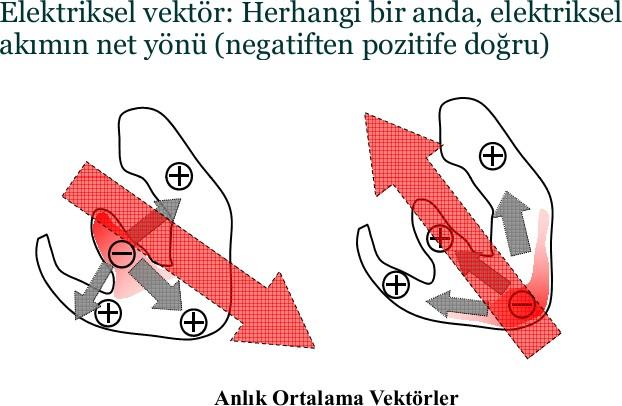

### EKG Derivasyonları ve Vektör Kuvvetleri

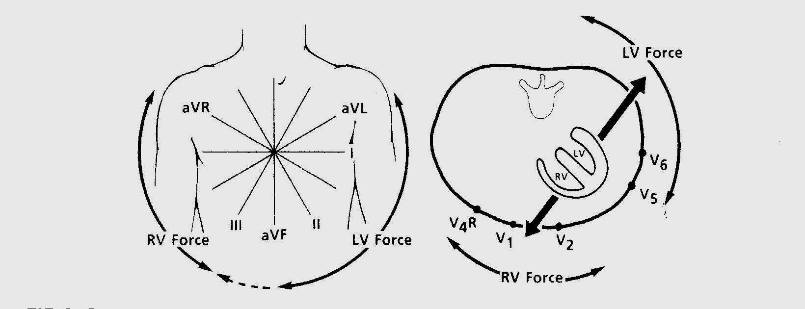

> Bu vektörlerin hepsi toplanıp bir değer elde edilir. Bu da depolarizasyonun yönünü gösterir.
>
> İlk depolarizasyon apexte olur.
---

## EKG ÇEKİMİNDE DİKKAT EDİLECEKLER

* Sakin durumda EKG çekilmelidir
* **Kalibrasyon çok önemli** (10 mm = 1 mV)
* EKG kayıt hızı **25 mm/saniye** olmalıdır
* Mümkünse **12 kanallı EKG** çekilmeli
* Makine yorumuna güvenilmemeli, **manuel değerlendirme** yapılmalı

### EKG Kağıdı Ölçüleri

| Ölçü                 | Değer         |
| -------------------- | ------------- |
| 1 küçük kare (yatay) | 0.04 saniye   |
| 1 büyük kare (yatay) | 0.20 saniye   |
| 1 küçük kare (dikey) | 1 mm = 0.1 mV |
| 1 büyük kare (dikey) | 5 mm = 0.5 mV |
| Kalibrasyon işareti  | 10 mm = 1 mV  |

---

## YENİDOĞAN VE YETİŞKİN EKG FARKLARI

**⚠️ ÖNEMLİ:** Pediyatrik EKG'yi erişkin kriterlerle yorumlamak **ciddi hatalara** yol açar!

| Özellik            | Yenidoğan/Çocuk                  | Erişkin         |
| ------------------ | -------------------------------- | --------------- |
| Baskın ventrikül   | **Sağ ventrikül** (3 yaşa kadar) | Sol ventrikül   |
| V1 T dalgası       | **Negatif** (7 günden sonra)     | Pozitif         |
| V1-V2 R dalgası    | **Uzun** (yüksek)                | Kısa            |
| V5-V6 S dalgası    | **Derin**                        | Kısa/yok        |
| V1'de rsR' paterni | Normal (bebek/küçük çocuk)       | Anormal (RBBB?) |
| Kalp hızı          | Daha yüksek                      | 60-100/dk       |
| QRS aksı           | Sağda (+125°, YD)                | +50° civarı     |

> 3 yaşına kadar çocuklarda RV baskın ventriküldür (özellikle yenidoğanlarda daha belirgin). V1'de (+) T dalgası varsa **RVH düşün!**

---

## TEMEL EKG DEĞERLENDİRME AKIŞ ŞEMASI

```
    ┌─────────────────────────────────────┐
    │    PEDİATRİK EKG DEĞERLENDİRME     │
    └──────────────┬──────────────────────┘
                   ↓
    1. RİTİM → NSR mi değil mi?
                   ↓
    2. HIZ → 1500 / KK sayısı
                   ↓
    3. P DALGASI → Atriyal dilatasyon?
                   ↓
    4. QRS AKSI → Yaşa uygun mu?
                   ↓
    5. İNTERVALLER → PR – QRS – QTc
                   ↓
    6. VENTRİKÜLER HİPERTROFİ → RVH / LVH?
                   ↓
    7. DAL BLOKLARI → RBBB / LBBB?
                   ↓
    8. ST DEĞİŞİKLİĞİ → İskemi / Perikardit?
    └─────────────────────────────────────┘
```

---

## RİTİM DEĞERLENDİRMESİ

### Normal Sinüs Ritmi (NSR) Kriterleri

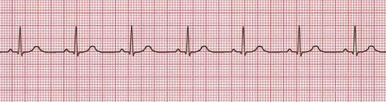

* Her QRS öncesi **P dalgası** var
* P dalgaları **morfolojik olarak aynı**
* PR aralıkları **sabit**
* P aksı **normal** (0° ile +90° arası → DI ve aVF'de pozitif)

### P Vektörünün Önemi

| Durum                                      | DI       | aVF      | Açıklama          |
| ------------------------------------------ | -------- | -------- | ----------------- |
| **A.** Normal sinüs uyarısı                | (+) P    | (+) P    | Normal            |
| **B.** Aşağı atriyal "koroner sinüs ritmi" | (+) P    | (-) P    | Ektopik           |
| **C.** Wandering pacemaker                 | Değişken | Değişken | Birden fazla odak |
| **D.** Dekstrokardi (ayna hayali)          | (-) P    | (+) P    | DI ve aVL'de (-)  |

---

## KALP HIZI HESAPLAMA

### Formül

> **Kalp Hızı = 1500 / R-R aralığı (küçük kare sayısı)**

**Örnek:** R-R arası 22 küçük kare → 1500/22 = **68/dk**

### Yaşa Göre Normal Kalp Hızı

| Yaş         | Normal Hız (/dk) |
| ----------- | ---------------- |
| Yenidoğan   | **110-150**      |
| 2 yaş       | **85-125**       |
| 4 yaş       | **75-115**       |
| 6 yaş üzeri | **60-100**       |

>Solunumsal sinüs aritmisi çocuklarda sık görülür ve normaldir.

> **Sinüs arrest:** eğer onlarca büyük kutu boyunca ritim yoksa sinüs arresti düşünülür.

---

## P DALGASI

### Normal P Dalgası Özellikleri

| Parametre   | Normal Değer             |
| ----------- | ------------------------ |
| P aksı      | **0° ile +90°** arası    |
| P amplitüdü | **1.5-3 mm**             |
| P süresi    | **Maksimum 0.10 saniye** |

* P aksı +90°-180° arasında ise → **atriyal inversiyon** düşün

### Atriyal Dilatasyon

#### Sağ Atriyal Dilatasyon (P Pulmonale)
* P dalgası amplitüdü **>3 mm** (DII'de)
* Sivri, yüksek P dalgası
* **Nedenleri:** Pulmoner stenoz, pulmoner hipertansiyon, triküspid atrezisi, Ebstein anomalisi

#### Sol Atriyal Dilatasyon (P Mitrale)
* P dalgası süresi **>0.10 saniye**
* Çentikli, çift tepeli P dalgası (DII'de)
* V1'de derin negatif terminal komponent
* **Nedenleri:** Mitral stenoz, mitral yetmezlik, sol ventrikül yetmezliği

---

## İNTERVALLER VE SEGMENTLER

### P, QRS ve T Amplitüd Ölçümleri

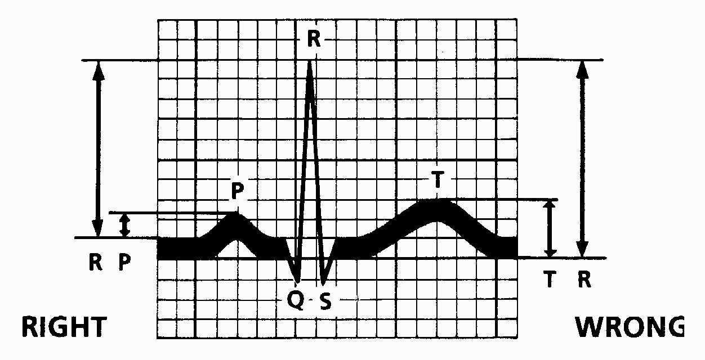

> Amplitüdler daima **bazal çizgiden** ölçülür (R-P arası değil, P başlangıcından).

---

### PR İntervali

* P dalgasının başlangıcından QRS'nin başlangıcına kadar
* **Normal:** Yaşa ve kalp hızına göre değişir

#### Anormal PR İntervali

| Durum           | Nedenleri                                                                            |
| --------------- | ------------------------------------------------------------------------------------ |
| **PR Uzaması**  | ARA (Akut Romatizmal Ateş), miyokardit, KKH, toksisite, hiperkalemi, iskemi, hipoksi |
| **Kısa PR**     | WPW sendromu, Pompe hastalığı                                                        |
| **Değişken PR** | Wandering atriyal pacemaker, Wenckebach (Mobitz Tip I) blok                          |

---

### QRS Süresi

* **Normal:** 0.04-0.08 saniye

#### QRS Süresinde Uzama Nedenleri

* Dal blokları (RBBB, LBBB)
* Preeksitasyon (WPW)
* İntraventriküler blok
* Ventrikül kaynaklı ritm bozukluğu
* Kalp piline ikincil atımlar

---

### QT İntervali ve QTc

QT intervali, **QRS başlangıcından T dalgasının sonuna** kadar olan süredir. Ventrikülün hem depolarizasyon hem de repolarizasyon süresini yansıtır. QT süresi kalp hızına bağlı olarak değişir: hız artınca QT kısalır, hız azalınca QT uzar. Bu nedenle ham QT değeri tek başına yeterli değildir; **kalp hızına göre düzeltilmiş QTc** kullanılır.

#### Bazett Formülü

> **QTc = QT / √RR**
>
> * QT ve RR **saniye** cinsinden ölçülür
> * RR = iki ardışık R dalgası arasındaki süre
> * Örnek: QT = 0.36 sn, RR = 0.64 sn → QTc = 0.36 / √0.64 = 0.36 / 0.8 = **0.45 sn**

#### Normal QTc Değerleri

| Yaş Grubu              | Normal QTc           | Sınır Değer                                |
| ---------------------- | -------------------- | ------------------------------------------ |
| İlk 6 ay               | **<0.49 saniye**     | Yenidoğanda fizyolojik olarak daha uzundur |
| 6 ay sonrası - erişkin | **0.35-0.44 saniye** | >0.44 sn uzamış kabul edilir               |

**⚠️ ÖNEMLİ:** QTc ölçümünde T dalgasının sonu bazen belirsiz olabilir. Bu durumda T dalgasının **inen koluna teğet** çizilir ve bazal çizgiyi kestiği nokta T sonu olarak kabul edilir ("tangent" yöntemi).

#### Uzun QT İntervali Nedenleri

* **Hipokalsemi** (en sık metabolik neden)
* Miyokardit
* **Uzun QT sendromu** (konjenital - LQTS; ailede ani ölüm hikayesi sorgula!)
* Serebrovasküler olay
* Diffüz miyokardiyal iskemi
* **İlaçlar:** makrolidler (eritromisin, azitromisin), antiaritmikler (amiodaron, sotalol), antihistaminikler, antipsikotikler

> Uzun QT sendromunda **Torsades de Pointes** (polimorfik ventriküler taşikardi) riski vardır → ani kardiyak ölüm!

#### Kısa QT İntervali Nedenleri

* **Hiperkalsemi**
* Dijital etkisi

**⚠️ Kısa QT Sendromu düşündüren durumlar:**
* Genç erişkinde tek başına atriyal fibrilasyon
* Kısa QT aralığı olan aile bireyi
* Ailede ani kardiyak ölüm hikayesi
* EKG'de uzun, sivri T dalgaları ile birlikte **<250 ms QTc**
* Kalp hızı yavaşladıkça QT intervalinin artmaması

---

## QRS AKSI

### Frontal ve Horizontal Derivasyonlar

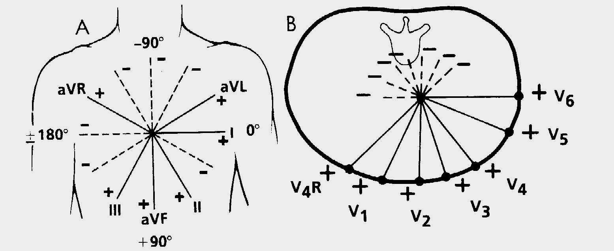

### Aks Belirleme Yöntemi

**DI** ve **aVF** derivasyonlarına bakılır:

```
                    - 90°
                      ↑
           KB        |        Sol
          ←──────────┼──────────→
     180°            |            0° (DI +)
           Sağ       |       Normal
                     ↓
                   + 90° (aVF +)
```

| DI  | aVF | Aks Yönü                             |
| --- | --- | ------------------------------------ |
| (+) | (+) | **Normal** (0° ile +90°)             |
| (-) | (+) | **Sağ aks sapması** (+90° ile +180°) |
| (+) | (-) | **Sol aks sapması** (0° ile -90°)    |
| (-) | (-) | **Kuzeybatı aks** (-90° ile ±180°)   |

### Yaşa Göre Normal QRS Aksı

| Yaş       | Ortalama Aks |
| --------- | ------------ |
| Yenidoğan | **+125°**    |
| 1 Ay      | **+90°**     |
| 3 Yaş     | **+60°**     |
| Erişkin   | **+50°**     |

### Göğüs Derivasyonlarında Aks Sapması

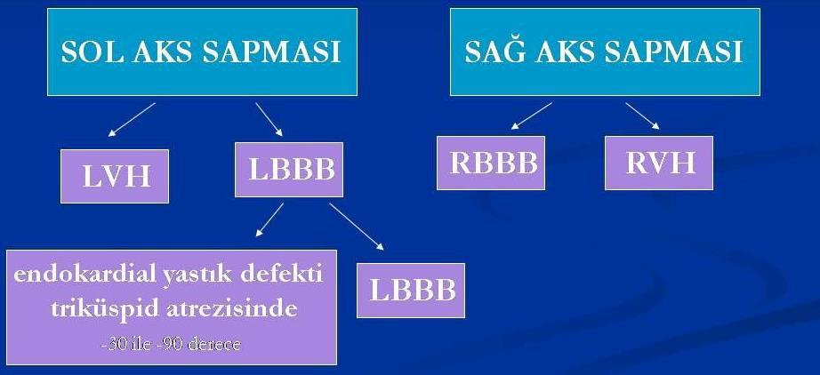

| Sapma Yönü          | Nedenleri                                                                  |
| ------------------- | -------------------------------------------------------------------------- |
| **Sol aks sapması** | LVH, LBBB, endokardiyal yastık defekti, triküspid atrezisi (-30° ile -90°) |
| **Sağ aks sapması** | RBBB, RVH                                                                  |

---

## QRS AMPLİTÜDÜ VE ŞEKİLLERİ

### R ve S Voltajları (Yaş ve Derivasyona Göre)

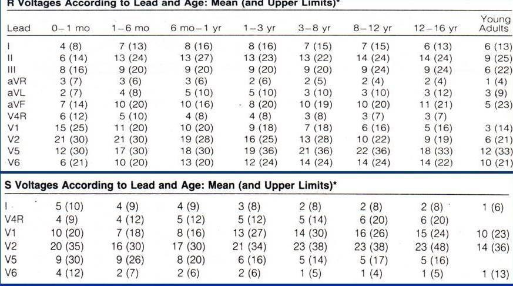

### Anormal QRS Amplitüdü

#### Artmış Amplitüd
* Ventrikül hipertrofileri
* Ventriküler iletim bozuklukları: RBBB, LBBB, preeksitasyon, intraventriküler blok

#### Azalmış Amplitüd (ekstremite derivasyonlarında <5 mm)
* Miyokardit
* Perikardiyal effüzyon, konstriktif perikardit
* Hipotiroidizm
* Normal yenidoğanlar
* Obesite

### V1'de QRS Şekilleri

> **V1'de rsR' paterni:** QRS süresi normal ve birinci ve ikinci R dalgasının voltajı anormal büyük değilse, yetişkinlerin tersine **bebek ve küçük çocuklarda normaldir.**

---

## VENTRİKÜL HİPERTROFİSİ

### Sağ Ventrikül Hipertrofisi (RVH)

* **Sağ aks sapması**
* V4R, V1 ve V2'de **yüksek R dalgası**; V6'da **derin S dalgası**
* **Anormal R/S Oranı:** V1 ve V2'de yaşa göre fazla ise; V6'da <1 ise
* V1'de **Q dalgası**
* V1'de **pozitif T dalgası** (7 günden sonra) ⚠️

### Sol Ventrikül Hipertrofisi (LVH)

* **Sol aks sapması**
* DI, DII, aVL, aVF, V5 ve V6'da **yüksek R**; V1 ve V2'de **derin S dalgası**
* Anormal R/S oranı: V1 ve V2'de azalması
* V5 ve V6'da **>5 mm Q dalgası**, **sivri T dalgası**

### Ventriküler Hipertrofi ile İletim Bozukluğunun Ayrımı

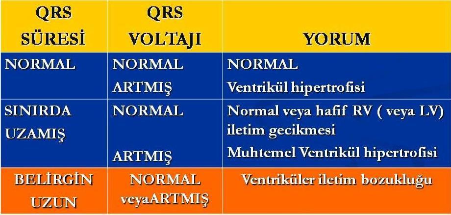

| QRS Süresi     | QRS Voltajı        | Yorum                                    |
| -------------- | ------------------ | ---------------------------------------- |
| Normal         | Normal             | **Normal**                               |
| Normal         | Artmış             | **Ventrikül hipertrofisi**               |
| Sınırda uzamış | Normal             | Normal veya hafif RV/LV iletim gecikmesi |
| Sınırda uzamış | Artmış             | **Muhtemel ventrikül hipertrofisi**      |
| Belirgin uzun  | Normal veya artmış | **Ventriküler iletim bozukluğu**         |

---

## DAL BLOKLARI

### Kalbin İleti Sistemi

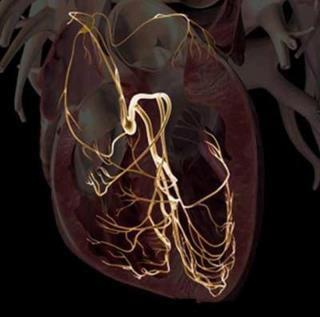

**İleti sırası:** SA düğüm → Atriyal iletim → AV düğüm → His hüzmesi → Sağ dal + Sol dal → Purkinje lifleri

---

### Sağ Dal Bloğu (RBBB) Kriterleri

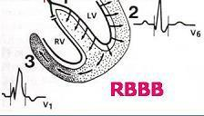

* **Sağ aks sapması**
* **QRS süresinde uzama**
* DI, V5 ve V6'da **geniş S** dalgası
* aVR, V4R, V1 ve V2'de **geniş R** dalgası
* **ST depresyonu** ve T dalgasında inversiyon

> RV depolarizasyonu gecikir → V1'de geniş R', V6'da geniş S

---

### Sol Dal Bloğu (LBBB) Kriterleri

* **Sol aks sapması**
* **QRS süresinde uzama** (initial ve terminal)
* DI, V1 ve V2'de **geniş S**; aVL, DI, V5 ve V6'da **geniş R** dalgası
* V5-6'da **ST depresyonu** ve T dalgasında inversiyon
* V5-6'da **Q dalgasının kaybı**

> LV depolarizasyonu gecikir → V1'de geniş S, V6'da geniş R

---

## ST-T DEĞİŞİKLİKLERİ

### Anormal ST Segment Nedenleri

* Perikardit
* Miyokardit
* Miyokard iskemisi ve infarktüs
* Hiperkalemi ve hipokalemi
* Ciddi ventrikül hipertrofisi
* Ventriküler anevrizma
* İlaç etkisi (dijital)
* İntrakranial patoloji

### ST Çökme Tipleri

| Tip   | Şekil                                      | Anlamı                 |
| ----- | ------------------------------------------ | ---------------------- |
| **A** | Yukarı eğimli ST çökmesi / J nokta çökmesi | **Normal varyant**     |
| **B** | Aşağı eğimli ST çökmesi                    | **Genellikle anormal** |
| **C** | Horizontal ST çökmesi                      | **Genellikle anormal** |

---

## T DALGASI VE U DALGASI

### T Dalgası

Prekordiyal T dalga konfigürasyonu **yaşla birlikte değişir:**

* **İlk hafta:** T dalgaları tüm prekordiyal derivasyonlarda **yukarı dönük** (pozitif)
* **İlk haftadan sonra:** T dalgaları V1-3'te **ters** (negatif) → "**Juvenil T dalga patterni**"
* **~8 yaşına kadar:** T dalga inversiyonu V1-3'te bu şekilde kalır
* **8 yaştan sonra:** T dalgaları V1-3'te tekrar yukarı dönük olur
* **Not:** Juvenil T dalga patterni adölesans ve erken erişkinliğe kadar devam edebilir (= **persistan juvenil T dalgaları**)

| Uzun, Sivri T Dalgası       | Yassı T Dalgası     |
| --------------------------- | ------------------- |
| Hiperkalemi                 | Normal yenidoğan    |
| LVH (volüm yüklenmesi)      | Hipotiroidizm       |
| Benign erken repolarizasyon | Hipokalemi          |
|                             | Dijital etkisi      |
|                             | Perikardit          |
|                             | Miyokardit          |
|                             | Miyokardiyal iskemi |

### U Dalgası

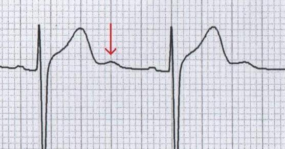

> U dalgası, T dalgasının sonundaki **ekstra bir pozitif sapma**dır.

**En yaygın nedenleri:**
* **Hipokalemi**
* Yavaş kalp hızlarında normal bulgu (ör. sinüs bradikardisi)

---

## EKG ÖRNEKLERİ

### Örnek 1: Sağ Aks Sapması + RVH (3 yaşında kız)

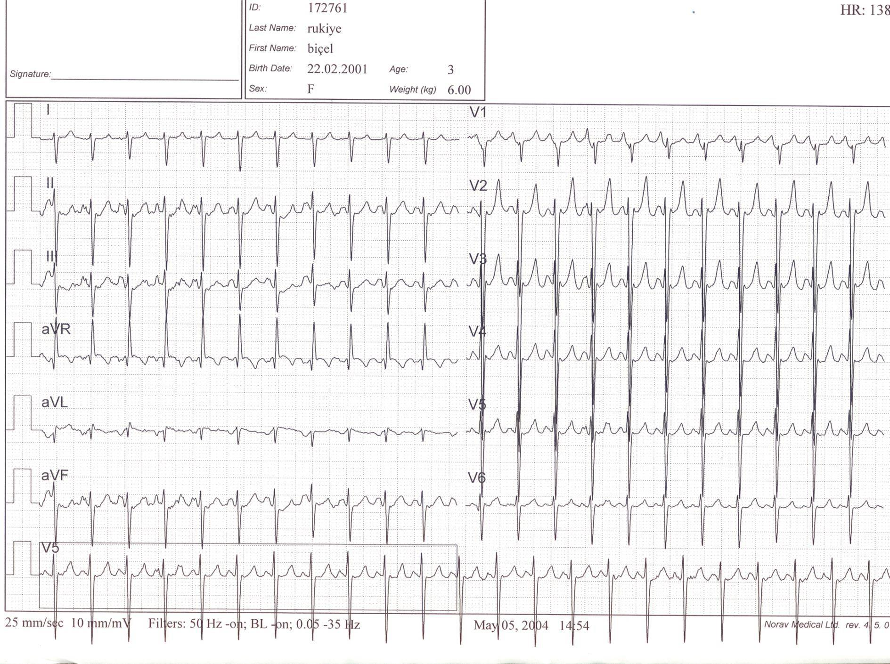

* DI'de negatif QRS, aVF'de pozitif QRS → **sağ aks sapması**
* V1-V2'de yüksek R dalgası → **RVH bulgusu**

---

### Örnek 2: WPW Sendromu

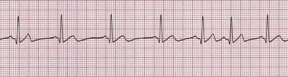

* Kısa PR intervali
* QRS başlangıcında **delta dalgası** (yumuşak eğim)
* QRS süresinde uzama

---

### Örnek 3: SVT (Supraventriküler Taşikardi)

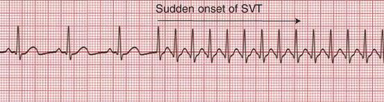

* **Sudden onset** - ani başlangıç
* Dar QRS kompleksli taşikardi
* P dalgaları seçilemiyor veya retrograd
* Hız genellikle **>220/dk** (süt çocuğu), **>180/dk** (büyük çocuk)

---

## ÖZET: PEDİATRİK EKG DEĞERLENDİRME KONTROL LİSTESİ

| Adım | Değerlendirme     | Kontrol                                            |
| ---- | ----------------- | -------------------------------------------------- |
| 1    | **Ritim**         | Her QRS öncesi P? P'ler aynı? PR sabit?            |
| 2    | **Hız**           | 1500/KK → Yaşa uygun mu?                           |
| 3    | **P dalgası**     | Aks (0-90°)? Amplitüd (1.5-3 mm)? Süre (<0.10 sn)? |
| 4    | **QRS aksı**      | DI ve aVF'ye bak → Yaşa uygun mu?                  |
| 5    | **PR intervali**  | Uzamış? Kısa? Değişken?                            |
| 6    | **QRS süresi**    | 0.04-0.08 sn? Uzamış → dal bloğu?                  |
| 7    | **QTc**           | Bazett: QT/√RR → 0.35-0.44 (ilk 6 ay <0.49)        |
| 8    | **R/S amplitüdü** | Yaşa göre tablo ile karşılaştır                    |
| 9    | **Hipertrofi**    | RVH? LVH? Voltaj + aks birlikte değerlendir        |
| 10   | **ST-T**          | Yükselme? Çökme? T inversiyonu yaşa uygun mu?      |

**⚠️ UNUTMA:**
* Pediyatrik EKG **erişkin kriterleriyle** değerlendirilMEZ
* Yaşa göre **normal değerler farklıdır**
* V1'de (+) T dalgası (7 günden sonra) = **RVH düşün**
* V1'de rsR' paterni küçük çocuklarda **normal** olabilir
* Tüm EKG'ler **sistematik akış şemasıyla** değerlendirilmeli

