# BAŞ-BOYUN-LENF BEZLERİ MUAYENESİ

**Hazırlayan:** Dr. Öğr. Üyesi Yusuf Ziya Aral
**Bölüm:** Çocuk Sağlığı ve Hastalıkları

---

## FONTANELLER

Baş muayenesinde fontanel ve sütürlerin değerlendirilmesi önemli yer tutmaktadır. Fontanel muayenesi yapılırken hastanın oturtulmuş ve sakin olmasına dikkat edilmelidir. Yatmakta olan ve ağlayan çocuklarda fontanel kabarık olarak palpe edilebilir ve hatalı yorumlara yol açabilir.

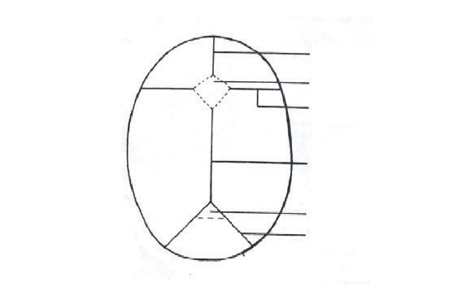

Doğuşta ön, arka ve yan fontaneller olmak üzere **6 adet fontanel** vardır. Yan fontaneller (2 sfenoid, 2 lambdoid) doğumu takiben kapanırlar. Arka fontanel üçgen şeklindedir, doğumda kapalı olabilir, iki-üç aydan sonra ise genellikle palpe edilmez. Yenidoğan bebekte arka fontanel açıklığı **>1 cm** ise konjenital hipotiroidi düşünülmelidir. Ön fontanel eşkenar dörtgen şeklindedir, **6-24 ay** arasında kapanır. Boyutları sütürden sütüre değil, diagonal olarak ölçülür ve "3x4 cm açıklıkta" şeklinde ifade edilir.

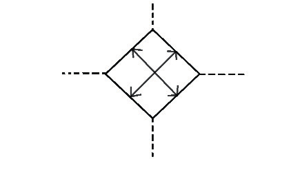

### Ön Fontanelin Geç Kapanması

Raşitizm, hidrosefali, konjenital hipotiroidi, osteogenezis imperfekta, malnutrisyon, Down sendromu, kleidokranial disostozis, Hurler sendromu ayırıcı tanıda akla gelmelidir.

### Ön Fontanelin Erken Kapanması

Mikrosefali, kraniosinostoz, hipertiroidi, hipofosfatazya ve hiperparatiroidi düşünülmelidir.

### Ön Fontanelin Normalden Geniş Olması

Raşitizm, konjenital hipotiroidi, osteogenezis imperfekta ve intrakraniyal basınç artışı ayırıcı tanıda düşünülmelidir.

### Fontanel Muayene Bulguları

* Normal süt çocuklarında fontanel hafifçe çökük olabilir.
* **Belirgin çöküklük:** Dehidratasyon ve malnutrisyon
* **Belirgin kabarıklık:** Menenjit, intrakranial kanama, subdural hematom, intrakranial tümör ve yer kaplayan diğer lezyonlar, vitamin A zehirlenmesi, hipofosfatazya
* Normal çocuklarda fontanel üzerinde pulsasyon alınabilir.
* **Şiddetli pulsasyon:** İntrakranial basınç artışı, arteriovenöz fistül, venöz sinüs trombozu, patent duktus arteriozus

---

## SÜTÜRLER

Normal spontan vajinal yol ile doğum sırasında baş doğum kanalından geçerken kafa kemikleri üst üste binebilir (**overriding, molding**), ancak ilk haftada baş normale döner.

Normalde yenidoğan döneminde sütürlerde **0.5 cm** açıklık vardır, **5-6. aydan** sonra kapanır ve palpe edilmezler. Kraniosinostozda sütürlerin hepsi ya da bazıları erken kapanmıştır.

### Kraniosinostoz Tipleri

* **Skafosefali:** Sagital sütürün erken kapanmasına bağlı başta kayık görünümü
* **Oksisefali (akrosefali veya kule kafa):** Koronal ve lambdoid sütürler erken kapanır
* **Plagiosefali:** Koronal sütür tek taraflı erken kapanır
* **Brakisefali:** İki koronal sütür erken kapanır
* **Trigonasefali:** Frontal sütür erken kapanır (üçgen kafa)

Kraniosinostoz izole olabileceği gibi **Apert** veya **Crouzon** sendromu gibi bir sendromun ya da hipertiroidi gibi hastalığın bulgusu olabilir.

---

## KAFADA ŞİŞLİK

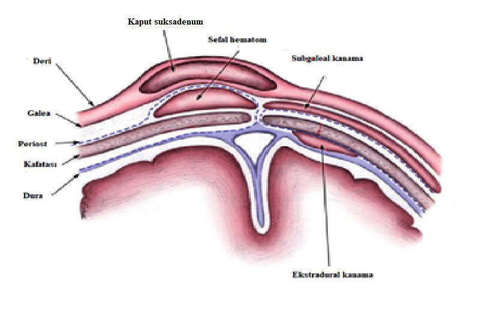

### Kaput Suksadenum

Yenidoğan bebeklerde doğum travmasına bağlı oluşan saçlı deri altı dokusunun ödemidir. En sık **oksipital** bölgede görülür, sütürleri atlayabilir, sınırları belirgin değildir. Genellikle bir hafta içinde iyileşir.

### Sefal Hematom

Doğum travmasına bağlı olarak kafa kemikleri ile periost arasına kanama söz konusudur. Kanama yavaş gelişebileceği için bebek **24-48 saatlik** olana kadar belirgin olmayabilir, sıklıkla **parietal** bölgede oluşur, **sütür atlamaz**. Hemoliz sonucu hiperbilirübinemi olabilir. Lineer veya çökme kırığı birlikte olabilir. İki hafta-3 ay içinde genellikle kendiliğinden rezorbe olur.

**⚠️ ÖNEMLİ:**

* Enfeksiyon riski nedeniyle ponksiyon yapılmamalıdır.
* Palpasyonla sefal hematomdan şüphelenildiğinde doğum travması mutlaka sorgulanmalıdır.

### Subgaleal Kanama

Kafatası periosteumu ile kafa derisi galea aponeurozu arasındaki potansiyel boşlukta kanamadır. Fark edilmediği takdirde **hipovolemik şok ve ölüme** yol açabilir. İki-üç haftada rezorbe olur.

---

## MİKROSEFALİ

> Baş çevresinin, yaş ve cinsiyetine göre verilen standart değerin (SD) **2 SD altında** olmasına veya **3. persentil altında** olmasına denir.

Mikrosefali izole bir bulgu olabileceği gibi, beyin gelişiminde duraklamaya, kafatası anomalilerine, TORCH enfeksiyonlarına, genetik sendromlara bağlı olabilir. Kraniosinostoz mikrosefali nedenlerinden biridir.

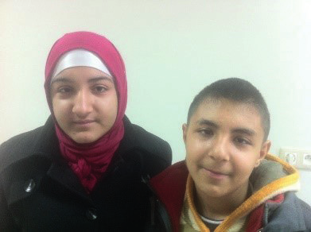

---

## MAKROSEFALİ

> Baş çevresinin yaş ve cinsiyetine göre belirlenen standart değerin **2 SD üstünde** olmasına denir.

En sık nedeni **hidrosefali**dir. Fontaneller kapanmadan önce hidranensefali, subdural hematom, subdural efüzyon, serebral araknoid kist, intrakranial tümör baş çevresinde hızla artışa neden olur. Ayrıca osteopetrozis, osteogenezis imperfekta, piknodizostozis, mukopolisakkaridoz, gangliosidoz ve Canavan hastalığı gibi bazı doğuştan metabolik hastalıklar makrosefaliye neden olur. Prematürelerin başları genel vücut ölçülerine göre daha büyük görünür.

---

## BAŞ SALLAMA

Spasmus nutans (başta sallama, tortikolis ve nistagmus varlığı), absans epilepsi, oküler albinizm, mental retarde hastalarda görülebilir.

> Aort yetmezliği olanlarda her sistolle birlikte baş sallama olmasına **"Musset belirtisi"** denir.

---

## BAŞIN TRANSİLLÜMİNASYONU

Karanlık bir odada, etrafına lastikten bir çerçeve geçirilmiş bir el feneri kullanılarak yapılır.

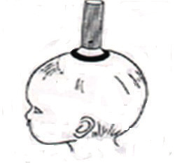

**⚠️ ÖNEMLİ:**

* Kaput suksadenum, sefal hematom, saçlı deride ödem, ekstravazasyon, koyu ve sık saçların bulunması halinde yanlış sonuç vereceği için yapılmamalıdır.

* El fenerinin etrafında **2 cm'den fazla** aydınlanma olmuşsa → subdural efüzyon
* Daha geniş bir aydınlanma olmuşsa → hidrosefali, hidranensefali, porensefali, Dandy-Walker malformasyonu

---

## MENİNGOSEL

Dura ve araknoid membrandan ibaret kesenin o bölgede lokalize spina bifida aracılığı ile spinal kanaldan dışarıya doğru herniye olmasıdır. Vertebral kolonun herhangi bir yerinde olabilirse de sıklıkla **lomber** ve **lumbosakral** bölgeyi tutar. Spina bifidanın en önemli ve en sık karşılaşılan tipidir.

---

## ENSEFALOSEL

Beyin dokusunun kafatasındaki bir açıklıktan kese şeklindeki fıtıklaşmasıdır. En sık **oksipital** bölgede görülür. Fıtıklaşmış yapı beyin dokusu ve zarları birlikte içeriyorsa **meningoensefalosel** olarak isimlendirilir.

---

## KRANİOTABES

Her iki elin avuç içleri hastanın temporal bölgesine konularak ve buradan destek alınarak parmak uçları ile oksipital bölge üzerine basılır. Ping-pong topu gibi içeriye çökme hissedilir, baskı kalkınca düzelir.

* Miadında yenidoğanlarda ilk **3-4 ayda**, prematürelerde ise ilk **5-6 ayda** alınması normaldir.
* Daha büyük bebeklerde görülmesi durumunda raşitizm, hidrosefali, hipofosfatazya, A hipervitaminozu, osteogenezis imperfekta ve konjenital sifiliz akla gelmelidir.

---

## BAŞIN PERKÜSYONU

Başın perküsyonu ile **kırık testi sesi (Macewan işareti)** olup olmadığına bakılır. Hastanın başı hafifçe yukarı kaldırılır. Kafanın bir tarafına kulak dayanmış olarak karşı taraftan direkt perküsyon uygulanır. Sütürleri ve fontaneli kapalı olan çocuklarda bu ses alınırsa **kafatası kırığı** ve **intrakranial basınç artması**ndan şüphelenmelidir.

Maksiller ve frontal bölgelerin perküsyonda hassas olması **sinüzit**in bir bulgusudur.

### Chvostek Belirtisi

> Zigomatik kemiğin hemen altına tek parmakla vurulduğunda, yüz kasları kasılırsa pozitiftir. Normal yenidoğan ve hipokalsemiye bağlı tetanide pozitiftir.

---

## BAŞIN OSKÜLTASYONU

Orbita üzerleri de dahil olmak üzere bütün beyin loblarının üzeri stetoskobun çan kısmı ile oskülte edilir.

* **3-4 yaşına kadar** normal olarak, ayrıca anemik ve ateşli çocuklarda sistolik üfürüm duyulabilir.
* Büyüklerde üfürüm duyulması halinde arterio-venöz fistül, anevrizma, beyin tümörü, tirotoksikoz ve aort koarktasyonu ayırıcı tanıda düşünülmelidir.
* Bazen çok şiddetli kardiak üfürümler kafanın oskültasyonu sırasında da işitilebilir.

---

## SAÇLAR

Term bebeklerin saçları prematüre bebeklere göre uzun ve sıktır. Postmatür bebeklerde daha uzundur. Bebeklerin saçları **4-5. haftada** dökülür, sonra yeniden çıkar.

### Alopesi

> Saç yokluğudur.

* **Diffüz alopesi:** Daha çok saç köklerindeki genetik bir anomaliden kaynaklanır veya sendromiktir.
* **Fokal alopesi:** Genellikle travmatiktir veya altta yatan kafa derisi lezyonlarıyla ilişkilidir.
* Kemoterapi alan ve radyoterapi uygulanan hastalarda saç dökülmesine sık rastlanır.
* Psikolojik bozukluklar, tifo, tiroid hastalıkları, Addison hastalığı, lupus, vitiligo gibi hastalıklarda da saç dökülmesi görülebilir.
* Tip II vitamin D'ye bağımlı riketste total alopesi olabilir.
* Vitamin A ve talyum gibi metal zehirlenmelerinde de saçlar dökülür.

### Alopesi Areata (Pelad)

Belirli bir alanda kısa bir sürede saçların kaybıdır, alanın kenarları belirgindir.

### Hirsutizm

Aşırı saç büyümesi; genetik, sendromik, metabolik, ilaca bağlı veya izole bir bulgu olabilir.

### Tinea Kapitis

Yuvarlak alanlar halinde saçlar dökülür, saçlar deriye yakın kısımdan kırılmıştır.

### Trikotillomani

Saçların koparılarak yenmesi, **Pika sendromu**nu akla getirmelidir.

### Saç Yapısındaki Değişiklikler

* **Kronik idiopatik hipoparatiroidide:** Saçlar, kaşlar ve kirpikler ince olup kaba bir dağılım gösterir.
* **Hipotiroidide:** Saçlar kuru, parlaklığını kaybetmiş ve kolay kırılır.
* **Hipertiroidide:** Saçlar incedir.
* **Ektodermal displazide:** Saçlar yoktur veya seyrektir.

### Dispigmentasyon

> Saçta renk değişikliğidir.

* **Kwashiorkor:** Saçlar cılız, seyrek ve kolay kırılır özellikte olup kızıla çalan renk değişikliği gösterir.
* **Bayrak işareti:** Kronik malnutrisyonlu bir hasta geçmişte malnutrisyon ve normal beslenme dönemleri geçirmişse bir saç teli boyunca normal ve dispigmente alanlar birbirini izler.
* **Menkes kinky hair sendromu:** Saçlar açık renkli olup kıvrımlar yapar. Gelişim geriliği olan hastalarda ayırıcı tanıda yol gösterici bir bulgudur.
* **Moniletriks:** Saç tellerinin gövdesini ilgilendiren OR (otozomal resesif) geçişli bir hastalıktır, kuru ve mat görünümlü saçlar kolay kırılır.
* **Argininosüksinik asidüri:** Saçlar kolay kırılır, saç mikroskobisinde trikoreksis nodoza denilen nodüler genişlemeler vardır.
* **Albinizm:** Saçlarda pigment yoktur. Chediak-Higashi sendromu ve Griscelli sendromunda okülokutanöz albinizm, Cross sendromunda ise hipopigmentasyon vardır.

### Diğer Saç Bulguları

* **Pedikülozis:** Saçta bit ve sirke olmasıdır.
* Ensede saç bitiminin normalden aşağıda olması: **Down sendromu**, **Turner sendromu**, **Klippel-Feil sendromu**nda görülür.

---

## SAÇLI DERİ

* **Seboreik dermatit:** Kirli sarı renkte kurutlar oluşur.
* Palpasyonda saçlı deride çökme kırığı ya da yumuşak doku kitlesi farkedilebilir.
* Çocuklarda **nöroblastom metastazları** yumrular halinde palpe edilir.

---

## YÜZ

Yüzün kaba hatlı olması konjenital hipotiroidizm, mukopolisakkaridozlar ve Coffin-Lowry sendromunda görülür. Yüzün yassı olması Apert, Carpenter, Down, Larsen ve Zellweger sendromlarının bir bulgusudur. Yüz, Silver-Russell ve Turner sendromlarında üçgen şeklinde olabilir.

Cushing sendromunda ve uzun süreli steroid kullananlarda **aydede yüz** görünümü vardır.

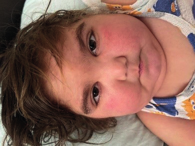

**Talasemi**de alın öne çıkık, burun kökü basık, zigomatikler belirgindir.

* **Sistemik lupus eritematozis:** Yanak ve burun kökünde malar rash denilen kelebek tarzı eritem
* **Mitral stenoz:** Yanaklarda fasies mitrale denilen eritem
* **Homosistinüri:** Yanaklar üzerinde malar flush denilen hiperemi
* **Eritema enfeksiyozum (5. hastalık):** Tokatlanmış yanak görünümü

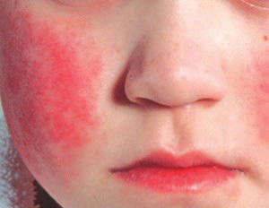

**Kızıl**da peroral solukluk, yanaklarda hiperemi görülür.

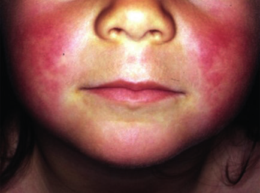

* **Polisitemi**de kırmızı yüz dikkat çeker.
* Ağzı devamlı açık çocuklar **adenoid vejetasyon** varlığı açısından değerlendirilmelidir.

### Mikrognati (Küçük Çene)

Pierre-Robin, Treacher-Collins, Franceschetti-Klein, Hallermann-Streiff, Rubinstein-Taybi, trizomi 13 ve 18, fetal alkol sendromlarında görülür.

### Prognatizm

> Mandibulanın büyümesi ve belirginleşmesidir.

Akromegali, Crouzon hastalığı ve kondrodistrofilerde görülür.

### Mandibulada Şişlik

Goldenhar sendromu, eozinofilik granülom, Burkitt lenfoması, Ewing sarkomu, osteojenik sarkom, dev hücreli tümör ve osteomiyelitte görülür.

### Diğer Yüz Bulguları

* **Temporomandibuler eklem çıkıkları:** Hasta ağzını kapatamaz.
* **Trismus** (ağzı açmada güçlük): Tetanoz başta olmak üzere beyin tümörleri, ensefalit ve fenotiazin zehirlenmesinde görülür.

### Parotis Bezi Şişliği

Kabakulak, parotis taşı, bakteriyel ve viral enfeksiyonlar, lösemi, tümör metastazları, diabetes mellitus, Mikulicz sendromu (tüberküloz ve lenfoma, lösemi gibi malignitelerde parotis bezi ile birlikte lakrimal ve submandibuler bezlerde de şişme görülmesidir) ayırıcı tanıda düşünülmelidir.

**Submandibuler tükrük bezleri** normalde palpe edilmez. Kabakulak, kistik fibrozis, taş, enfeksiyon, gingivit ve mikoplazma enfeksiyonlarında palpe edilebilirler.

---

## KAŞ VE KİRPİKLER

* Total alopesi olgularında kaş ve kirpik olmayabilir.
* **Albinizm** olgularında pigmentasyon yoktur.
* Bazı mukopolisakkaridozlarda (özellikle **Hurler sendromu**nda) genel hipertrikoz yanı sıra kaşlarda da kıl artışı vardır.
* **Cornelia de Lange** ve **Waardenburg** sendromlarında iki kaş orta hatta birleşmiştir (**sinofri**).
* **Hallermann-Streiff** sendromu ve kıkırdak-saç sendromunda kaş ve kirpiklerde hipotrikoz vardır.
* **Treacher-Collins** sendromunda alt göz kapağının 2/3 alt kısmında kirpik bulunmayabilir.
* Uzun ve kıvrık kirpikler herediter olabileceği gibi kronik enfeksiyonlu (tüberküloz gibi) ve malnutrisyonlu hastalarda da saptanabilir.
* Kirpiklerin göz kapaklarında tutunduğu bölgelerde hafif hiperemi ve pullanma ile karakterize enfeksiyona **blefarit**, kirpik köklerinin iltihabına **hordeolum (arpacık)** denir.

---

## AĞIZ

Ağız ve boğaz muayenesi için küçük çocuklar annenin ya da bakıcısının kucağına oturtulur. Bir elleriyle çocuğun kollarını sararken diğer elleriyle çocuğun başını sabitleştirir. Küçük çocuklarda muayene için sıklıkla dil basacağı kullanılır.

### Halitozis

> Ağzın kötü kokmasına halitozis denir.

Ağız hijyeninin kötü olması, adenoid vejetasyon, ağız ve boğazla ilgili enfeksiyonlarda halitozis olabilir. Bazı hastalıklarda ise nefeste özel kokular duyulur:

* **Asidoz** → aseton kokusu
* **Tifo ve difteri** → çürük doku ya da ölmüş fare kokusu
* **Üremi** → amonyak kokusu
* **Karaciğer koması** → fetor hepatikus denilen özel koku

### Ağız İçi Lezyonlar

* **Koplik lekeleri (kızamık):** Ağız mukozasında kırmızı zeminde tuz dökülmüş gibi beyaz lekeler olarak görülür.

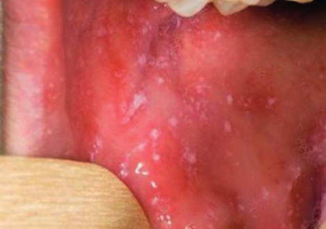

* **Herpangina:** Etken Coxsackie A virüsüdür. Ağız kavitesinin arka kısmında veziküler lezyonlar vardır.
* **Kabakulak:** Üst molar dişler hizasındaki Stenon kanalı ağzı hiperemik, şiş ve ağrılıdır.
* **Epstein incileri:** Yenidoğanda sert damakta, müköz salgı bezleri obstrüksiyonuna bağlı retansiyon kistidir. Spontan kaybolur.
* **Enantem:** Mukozada kırmızı döküntülerdir.
* **Aft:** Dudak ve yanakların iç kısmında, dilde, damakta veya diş etinde görülen oral ülserlerdir.
* **Stomatit:** Ağız içinde ülserasyon, eksüdasyon, iltihap (aftöz stomatit gibi).

### Membranöz Tonsillit (Kriptik Tonsillit)

A grubu beta hemolitik streptokok, EBV, CMV, adenovirüs, candida enfeksiyonları ve difteride görülür.

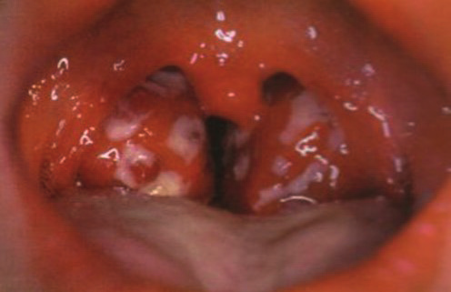

### Tonsil Asimetrisi

Enfeksiyon (peritonsiller apse), kronik inflamatuar süreç veya neoplazmadan (özellikle lenfoma) kaynaklanabilir.

---

## DUDAKLAR

### Yarık Dudak ve Yarık Damak

Fetüsün dudak yapısını oluşturan hücrelerin birleşmesi **4-5. haftada**, damak yapısını oluşturan hücrelerin birleşmesi ise **8-9. haftada** başlamaktadır. **12. haftanın** sonunda fetüsün damak ve dudak dokularının birleşmesi tamamlanmış olur. Birleşmenin tam olarak sağlanamaması durumunda fetüste oral yarıklar meydana gelir.

### Dudak Yapısı

Kalın veya ince dudaklar yapısal olabildiği gibi genetik sendromların özel bulgularından biri olabilir:
* **Williams sendromu:** Kalın alt dudaklar
* **Velo-kardio-fasiyal sendrom:** İnce üst dudaklar

### Dudak Rengi

* **Anemilerde** → soluk
* **Siyanotik hastalarda** → mor renkli
* **Ağır zehirlenmelerde, anoksi ve methemoglobinemide** → gri-mor renkli
* **Karbonmonoksit zehirlenmesinde** → kırmızı renkli
* **Peutz-Jeghers ve Leopard sendromu:** Dudaklarda kahverengi pigmentasyonlar

### Dudak Ödemi

Böcek sokmaları, ilaç alerjileri, anjionörotik ödem ve yaygın ödem yapan durumlarda ayrıca lokal enfeksiyon ve travmada dudaklar şiş ve ödemli görünümdedir.

### Dudak Lezyonları

* **Chelitis:** Ateşli hastalıklar sırasında dudakların kuruması, çatlaması ve pullanması. Güneşte yanma, rüzgarlı ve soğuk havada da görülebilir.
* **Chelozis:** Dudakların köşelerinde etrafa doğru uzanan derin ağrılı yarıklanma, maserasyon ve kabuklanma. Riboflavin eksikliğinde, immün yetmezlikli hastalarda enfeksiyonlar sonucu görülür.
* **Ragat:** Burundan dudaklara doğru uzanan sikatrisli yarıklar. Sifilizin tipik bulgularından biridir.
* **Perleş:** Streptokok ve monilia enfeksiyonları sırasında ağız köşelerinin çatlaması, masere olup kabuklanması.
* **Herpes labialis (uçuk):** Herpes simpleks enfeksiyonu sık olarak dudaklarda görülür.

---

## DİL

### Makroglossi

Konjenital hipotiroidi, Beckwith-Wiedemann sendromu, mukopolisakkaridoz, lenfanjiom, rabdomiyosarkom, kistik higroma, hemanjiom, mannosidoz, glikojenoz tip II, nörofibromatoziste görülebilir. Down sendromunda ağız içi küçük olduğu için dil dışarı sarkar. Dil kökündeki tiroglossal kist dilin büyümesine ve dışarı çıkmasına neden olur.

### Dil Yüzeyi Değişiklikleri

* **Coğrafik dil (harita dili):** Dilde üzeri düzgün, dilden hafifçe kabarık, kenarları gri-kırmızı renkte odaklar. Dilin mukozasının kendini yenilemesi nedeniyle ortaya çıkar.
* **Riboflavin eksikliği:** Dilin üzeri düz ve morumsu kırmızı renktedir (**Magenta dili**).
* **Ateşli hastalıklarda (özellikle tifo):** Dilin üzeri beyaz veya gri-kahverengi bir pasla kaplıdır.
* **Kızılda:** Önce beyaz, sonra kırmızı **çilek dili** görülür.
* **Siyanozlu hastalarda:** Dil mor renklidir.

### Dil Hareketleri

* **Spinal musküler atrofi tip 1 (Werdnig-Hoffman):** Dilde fasikülasyon
* **Hipertiroidizm, kore, amyotonia konjenita:** Dilde ince tremor
* **Beyin felci:** Dilde kaba tremor
* **Miyotonik distrofi:** Dil basacağı ile dile vurulan yerde çukurluk olur ve dil uzun süre kontrakte durumda kalır
* **Nervus hipoglossus felci:** Dil ağız içinde sağlam, ağız dışında hasta tarafa kayar

### Frenulum (Dilbağı)

Dilin hareketini kısıtlıyorsa veya bebeğin emme etkinliğini sınırlıyorsa **frenotomi** veya **frenuloplasti** uygulanabilir.

### Ranula

Dil altı bezlerinin mavi renkli retansiyon kistleridir.

---

## DİŞ ETİ

* **Gingivitis:** Dişeti iltihabı
* **Epulis:** Diş etinin selim tümörüdür
* **Diş eti hipertrofisi:** Gangliosidoz ve genetik sendromların bulgusu olabileceği gibi, difenilhidantoin alan çocuklarda, akut miyelomonositik lösemide, ağız yolu ile solunum yapanlarda, malnutrisyonda ve çeşitli vitamin eksikliklerinde görülebilir.

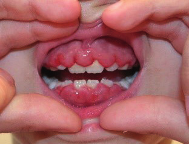

* **Diş eti kanaması:** Kanama diyatezi, enfeksiyonlar ve C vitamini eksikliğiyle oluşan skorbüt hastalığında görülür.
* **Kurşun zehirlenmesi:** Dişeti serbest kenarında mavi şerit gibi renklenme olur.

---

## DİŞLER

Dişlerde ilaçlara veya flor aşırı alımına bağlı kahverengi leke olabilir.

### Natal Diş

Bebek 1 veya 2 dişle doğabilir. Bu dişler **aspirasyon riski** nedeniyle çıkarılmalıdır.

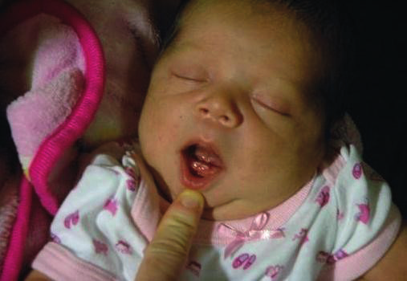

### Diş Gelişimi

Yaşına göre dişlerin gelişimi değerlendirilir. Diş gelişiminde genetik özellikler söz konusudur:

* İlk dişin çıkması sağlıklı çocuklarda **4-12 ayda** olur
* Önce alt kesici dişler (ortalama **6. ayın** sonunda) belirir
* **1 yaşında** genellikle 6-8 diş çıkar
* **24-30 aylıkken** 20 süt dişi çıkmış olmalıdır
* Yaklaşık **6 yaşta** alttaki kesici dişler dökülür, bunu ilk molar dişlerin belirmesi izler
* İkinci molar dişler genellikle **12 yaş** civarında çıkmaya başlar

### Diş Çıkmasında Gecikme

Hipopitüitarizm, hipotiroidi, kleidokranial dizostozis, Gardner sendromu, trizomi 21, progeria ve raşitizm gibi özel durumlarda görülür.

### Diğer Diş Bulguları

* **Anodontia:** Parsiyel veya total diş yokluğu
* **Hutchinson dişleri:** Üst kesicilerin kenarları çentiklidir, konjenital sifilizde görülür

---

## BURUN

Yenidoğan bir bebekte burundan hava pasajında tıkanıklık varsa bilateral veya unilateral **koanal atrezi**den şüphelenilmelidir. Şüpheli taraftan nasogastrik sonda geçirilemez.

* Yenidoğan bebekte kanlı-pürülan akıntı varsa **sifiliz** akla gelmelidir. Daha büyükte yabancı cisim, difteri düşünülür. 5-6 yaştan sonra sinüzit olabilir.
* **Epistaksis:** Burun kanamasıdır.

### Burun Şekli

* **Burun kökü basık/semer şeklinde:** Sifiliz, Down sendromu, konjenital hipotiroidi, Conradi sendromu ve kondrodistrofiler
* **Burun ve burun delikleri geniş ve dışa dönük:** Hurler ve Smith-Lemli-Opitz sendromları
* **Burun ince, sivri ve kıvrık (papağan görünümü):** Progeria, piknodizostoz ve Rubinstein-Taybi sendromu

### Burun Polipleri

Sinüzit, allerjik rinit ve Kartagener sendromunda burunda poliplere rastlanır. Tekrarlayan polip varsa **kistik fibrozis** araştırılmalıdır.

### Allerjik Selam

Allerjik rinitli çocuklarda kaşıntı nedeniyle burunlarını sık sık yukarı doğru bastırırlar. Bu nedenle burun üzerinde horizontal bir çizgi oluşabilir.

---

## BOYUN MUAYENESİ

Normalde süt çocuklarında boyun kısadır. **3-4 yaşa** kadar uzar.

### Kısa Boyun

Morquio hastalığı, Hunter sendromu, Hurler sendromu, Klippel-Feil sendromu, Goldenhar sendromu, platibazi, spondiloepifizyal displazide görülür.

### Boğa Boynu

Difteride gode bırakmayan ödem olur.

### Yele Boyun (Pterigium Colli)

Turner sendromunda görülür.

### Tortikolis

> Başın sağ ya da sol yana doğru eğilmesidir.

Sıklıkla sternokleidomastoid kasın 1/3 alt kısmında hematom nedeniyle yenidoğanlarda görülür. Atlanto-oksipital eklem çıkığı, çevresel enfeksiyonlar, servikal vertebra tümörü, retrofarengeal apse, servikal Pott hastalığı ve 11. kraniyal sinir paralizisinde tortikolis görülür.

### Boyun Kitleleri

* **Brankial kistler:** Sternokleidomastoid kasın 1/3 kısmında, ön bölgede 1-5 cm çapında unilokuler kistlerdir. Üzeri düzgün, gergin ve hareketli kistler olup bazen deriye fistülize olurlar.
* **Tiroglossal kanal kisti:** Boynun orta hattında, hyoid kıkırdağı civarında bulunur. Boynun üst kısmında, hasta dilini çıkarınca ve yutkununca yukarı doğru hareket eder.
* **Dermoid kistler:** Boynun orta hattında bulunur, deriye yapışıktır ve hareket etmezler.
* **Kistik higroma:** Çoğunlukla klavikulanın üzerinde, sternokleidomastoid kasın posteriorundadır. Yumuşak, kenarları tam olarak belirlenemeyen, hareketli lobüler görünümde, multilokulerdir. Üzerindeki deri ince ve mavimsi renktedir. Transillüminasyon yapılabilir.
* **Lipom:** Boyunda nadiren lobüle kitleler oluşturur.

---

## TRAKEA MUAYENESİ

Tek veya iki parmakla trakeanın orta hatta olup olmadığına bakılır. Trakea orta hattın hafif sağında palpe edilir.

---

## TİROİD BEZİ

* **Küçük çocuklarda:** Yatar pozisyonda bakılır. Bir taraf baş parmak, diğer taraf işaret parmağıyla palpe edilmelidir.
* **Büyük çocuklarda:** Otururken önden ve arkadan her iki elin işaret parmağı ile palpe edilir.

Yutkunma hareketi ile büyüklüğü, duyarlılığı, kıvamı, nodül varlığı ve yangısal belirtileri olup olmadığına bakılır.

---

## LENF BEZİ MUAYENESİ

Sistemik hastalık veya enfeksiyon belirtileri aramak için kapsamlı bir fizik muayene yapılmalıdır. Lenfatik sisteme, konjonktivaya, ağız boşluğuna ve cilde özel dikkat gösterilmelidir.

Lenfatik sistemin muayenesi karaciğer, dalak ve servikal ve servikal olmayan lenf düğümlerini içerir. Lenf düğümlerinin değerlendirilmesi aşağıdaki özellikleri içermelidir:

* Sayı
* Yer
* Boyut
* Şekil
* Kıvam
* Hassasiyet
* Hareketlilik
* Üzerindeki cildin rengi

### Servikal Lenfadenopati

> Preauriküler, parotid, jugulodigastrik, submental, submandibular, posterior servikal, yüzeysel servikal, derin servikal, oksipital ve posterior aurikuler (mastoid) dahil boyunda genişlemiş lenf düğümlerine denir.

Lenfadenopati, hem enfeksiyöz hem de enfeksiyöz olmayan lenf düğümlerini kapsar.

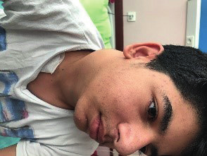

### Servikal Lenfadenit

> Boyunda genişlemiş, iltihaplı ve hassas lenf düğümleridir.

"Lenfadenit" ve "lenfadenopati" terimleri sıklıkla birbirinin yerine kullanılır.

* **Akut lenfadenit:** Birkaç gün içinde gelişir (ancak haftalar veya aylar sürebilir).
* **Subakut/kronik lenfadenit:** Haftalar veya aylar içinde gelişir.
* **Generalize lenfadenopati:** İki veya daha fazla bitişik olmayan lenf nodu bölgesinin (örn. servikal ve aksiller) genişlemesi.
