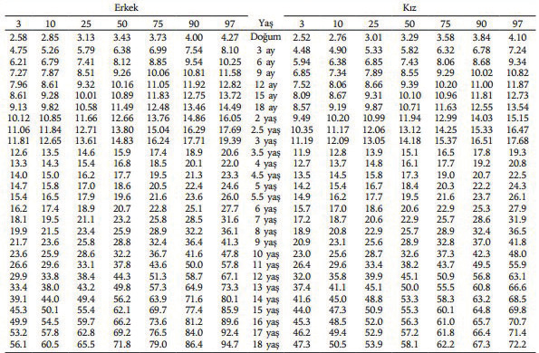
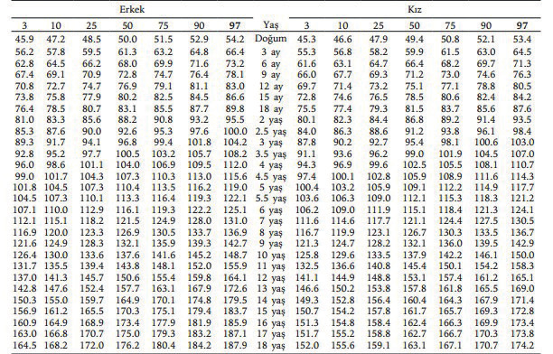

# BÜYÜME İZLEMİ

**Hazırlayan:** Prof. Dr. Tolga Ünüvar
**Bölüm:** Çocuk Sağlığı ve Hastalıkları

---

## NORMAL BÜYÜME

Büyümenin değerlendirilmesinde normal büyüme, çocukluk çağı ve ergenlik döneminin en önemli özelliğidir. Bazı istisna durumlar dışında iyi büyüme, sağlıklı gelişen bir çocuğun en önemli göstergesidir. Büyüme birden fazla faktörün etki ettiği, karmaşık ve uzun süreçli bir olay olsa da çocuklarda büyümenin seyri önceden tahmin edilebilir. Endokrin veya endokrin dışı birçok hastalığın ilk belirtisi büyümede bozulma olabileceği için **düzenli aralıklar ile tekrarlanan ve doğru boy ölçümleri** bir çocuğun büyümesinin değerlendirilmesinde çok önemlidir.

Bu nedenle sağlıklı çocuk izlemi doğumdan itibaren aşağıdaki aralıklarla yapılmaktadır:

* **1. hafta, 15. gün**
* **1, 2, 3, 4. ay**
* **6, 9, 12, 15, 18. ay**
* **2, 2.5, 3, 4, 5 yaş**
* Daha büyük çocuklarda **18 yaşına kadar yılda bir** izlem önerilmektedir.

---

## ÖLÇÜM

Büyüme değerlendirilirken boyun doğru bir şekilde ölçülmesi en önemli noktadır.

* **2 yaşından önce:** Yatar pozisyonda ölçüm yapılır. Sabit bir zemin üzerine monte edilmiş, baş tarafı sabit, diğer tarafı hareketli **infantometre** adı verilen ölçüm tahtaları kullanılır. Sabit tarafa çocuğun başı tam olarak yaslandıktan sonra, bacaklar gergin, ayak bileği 90 derece dorsifleksiyonda olacak şekilde hareketli taraf ile sıkıştırılır.
* **3 yaşından sonra:** Ayakta ölçüm yapılır. Duvara sabitlenmiş **stadiometre** adı verilen boy ölçerler kullanılmalıdır. Ölçüm esnasında çocuğun başının arka kısmı, üst torakal omurga ve gluteal bölge stadiometreye değmeli; topuklar bitişik ve ayakkabılar çıkarılmış vaziyette olmalıdır.
* **2-3 yaş arası:** Çocuğun fiziksel gelişimi ve uyumuna bağlı olarak her iki yöntem de kullanılabilir.

**⚠️ ÖNEMLİ:**

* İzlemde boy ölçümleri mümkünse **aynı alette** yapılmalı ve ölçüm aralıkları **en az 3 ay** olmalıdır.
* Büyüme lineer olmayıp sıçramalar tarzında gerçekleştiği için kısa aralıklar ile ölçümler yanlış sonuçlar verebilir.

### Büyüme Hızı

Boy uzama hızının standart sapmaları her yaşta çok değişkenlik gösterir. Normaline dair uluslararası bir veri yoktur ancak yaş ve cinsiyete göre **-1 SDS** (standart deviyasyon skoru) (≈ 25. persentilin) altında devam eden büyüme hızları **patolojik** olarak kabul edilir. Büyümeyi daha sağlıklı değerlendirebilmek için **büyüme hızı eğrileri** geliştirilmiştir.

Büyüme hızı fizyolojik olarak **mevsimsel farklılıklar** gösterebilmektedir:

* ☀️ Yaz ve ilkbahar aylarında büyüme **hızlanır**
* ❄️ Sonbahar ve kış aylarında büyüme hızı **azalır**

### Yaşa Göre Normal Büyüme Hızı

| Dönem | Büyüme Hızı |
|---|---|
| Doğum sonrası 1. yıl | **25 cm** |
| 2. yıl | **10 cm** |
| 3. yıl | **7 cm** |
| 4. yıl | **6 cm** |
| 4. yıldan ergenliğe kadar | **5 cm/yıl** |
| Ergenlik dönemi | Pubertal pik (↑ büyüme hormonu etkisiyle) |

Ergenlik döneminde salgılanan pubertal hormonların etkisiyle büyüme hormonu uyarılır ve **pubertal pik** gerçekleşir. Kızlarda pubertenin **erken evrelerinde**, erkeklerde ise **daha geç evrelerinde** boy uzama atağı ortaya çıkar.

**⚠️ Yetersiz Büyüme Kriterleri:**

* 4 yaşından önce: **< 7 cm/yıl**
* 6 yaşından önce: **< 6 cm/yıl**
* Ergenlik öncesi: **< 4,5 cm/yıl**

---

## BÜYÜME EĞRİLERİ

Çocukluk çağında büyümenin değerlendirilmesi ve izleminde **büyüme eğrileri** kullanılmaktadır. Büyüme eğrileri yaş ve cinsiyete göre sağlıklı çocukları temsil ettiği için **her toplum için farklıdır**. Ülkemizde boy, ağırlık, baş çevresi ve vücut kitle indeksi ölçümünde **ulusal büyüme eğrileri** kullanılmaktadır. Büyüme eğrilerinin belli aralıklar ile güncelleştirilmesi önerilmektedir.

Günlük pratikte kullanılan persentil bazlı eğrilerde aşağıdaki persentil eğrileri bulunmaktadır:

* **3, 10, 25, 50, 75, 90 ve 97. persentil**

> 3 ve 97. persentilin dışında kalan büyümelerde **SDS** veya **Z skoru** kullanımı daha iyi sonuç verir. Çünkü 3. persentil altında olan bir çocuğun 3. persentilin ne kadar altında olduğunu gösterememesi büyüme eğrilerinin dezavantajıdır.

**3-97. persentiller** arasında kalan büyüme için büyüme eğrileri kullanımı çok değerlidir.

Büyüme eğrileri sağlıklı çocuklardan elde edildiği için kendine özgü büyüme hızı olan bazı hastalıklar için **özel büyüme eğrileri** hazırlanmıştır:

* Prader-Willi sendromu
* Noonan sendromu
* Turner sendromu
* Down sendromu
* Akondroplazi

Büyüme eğrileri düzenli ve doğru olarak doldurulduğunda, eğrideki sapmalardan yola çıkarak çeşitli büyüme bozuklukları saptanabilmektedir.

**Şekil 1:** 0-18 yaş Türk çocuklarında vücut ağırlığı (kg) persentil değerleri.

**Şekil 2:** 0-18 yaş Türk çocuklarında boy uzunluğu (cm) persentil değerleri.

---

## VÜCUT ORANLARI

Vücut oranlarının ölçümü bazı büyüme bozukluklarının tanısında önemlidir.

> Sağlıklı bir çocukta **üst/alt oranı** doğumda **1,7** iken, bu oran 10 yaşında **1**'e düşer.

**Orantısız büyüme** görülen durumlar:

* İskelet displazileri
* Raşitizm
* Spinal radyasyon alan kanser hastaları

Tanı için değerlendirilen parametreler:

* **Baş çevresi**
* **Üst/alt vücut oranı**
* **Oturma yüksekliği/boy oranı**
* **Kulaç/boy oranı**

Ülkemizde oturma yüksekliği ve oturma yüksekliği/boy oranları için referans değerleri mevcuttur.
