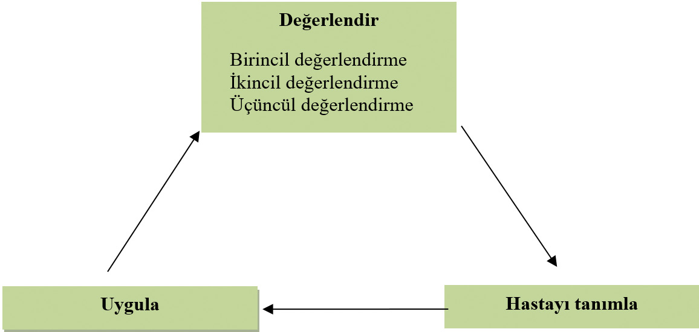
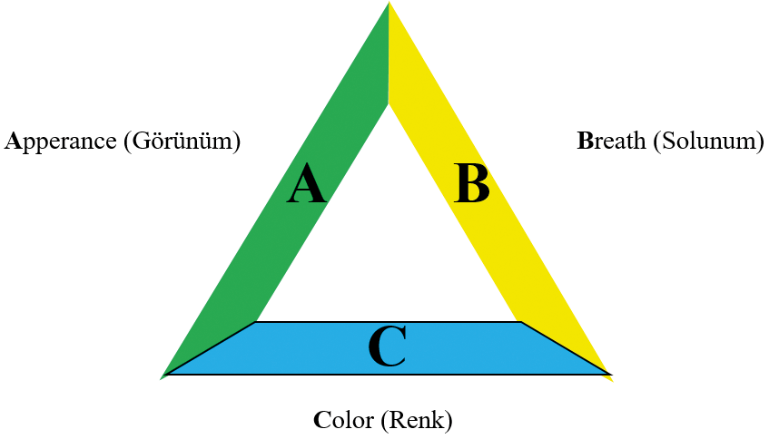

# ÇOCUK ACİLDE KRİTİK HASTA DEĞERLENDİRMESİ

**Hazırlayan:** Doç. Dr. Aykut Çağlar
**Bölüm:** Çocuk Sağlığı ve Hastalıkları

---

## GİRİŞ

Tüm dünyada ve ülkemizde tüm acil başvurularının önemli bir kısmını çocuklar oluştururken, yaklaşık **%5**'ini ise ciddi hastalık tablosu ile gelen çocuklar oluşturmaktadır. Çocuk acilde çalışan her hekimin, kritik hasta çocuğu zamanında tanıması ve etkin tedaviye başlaması mortalite ve morbiditenin azaltılmasında önemli role sahiptir. Her ne kadar aşılama programları ve ayaktan tedavi koşulları gelişmiş olsa da gün geçtikçe yeni hastalıklar ve sorunlar nedeni ile daha büyük ve teknolojik çocuk acillere gereksinim artmaktadır. Acilde çalışan sağlık personelinin ve hekimin her an yüksek sayıda hasta kabulü yapabileceğini ve bu hastalar arasından özellikle kritik hasta çocuğu ayırması gerektiğinin farkında olması beklenir.

Çocuk acilde hasta değerlendirilirken yapılan en önemli hatalardan biri **"çocuk erişkinin küçüğüdür"** varsayımıdır. Halbuki çocuklar fizyolojik, gelişimsel ve davranışsal olarak erişkinlerden önemli farklar içerir, bu farkların bilinmesi takip ve tedavi yönetiminde büyük önem arz eder. Çocuk hastaların yaşları küçüldükçe şikayetleri net olamayacağı için, değerlendirmek erişkinlere kıyasla daha zordur. Örneğin ağrıyı lokalize edemeyen küçük bir çocukta apandisit tanısı koymak erişkine kıyasla daha zorlu bir süreçtir. Ya da bir çocuk ajite ise bu durum hastane ortamından kaynaklanabileceği gibi bir bilinç değişikliğine de ait olabilir. Özellikle annenin çocuk üzerinde gördüğü değişiklikler mutlaka özenle değerlendirilmeli ve ailenin endişesi bir an önce bilgilendirilerek giderilmeye çalışılmalıdır.

### Çocukların Erişkinlerden Farkları

Çocuklar, erişkinlerden fizyolojik ve anatomik olarak da önemli farklara sahiptir:

* **Solunum sistemi:** Hava yolunda bronş çapı daha küçük ve alveolar kapasite tam olmadığı için solunum sıkıntısı ve solunum yetmezliğine daha eğilimlidirler. Ayrıca larinks yukarı yerleşimli olduğu için hava yolu yönetimi daha zordur.
* **Dolaşım sistemi:** Sıvı kaybı ya da enfeksiyon gibi farklı sebeplerle dolaşım yetmezliği sık gelişmesine karşın, kompansasyon mekanizmaları nedeniyle hipotansiyon daha geç görülür. Vücut yüzeyinin geniş olmasına bağlı hipotermi ve istemsiz sıvı kayıpları daha sık gelişmektedir.
* **Travma yönetimi:** Anatomik farklılıklar nedeni ile çoklu travma erişkinlere kıyasla daha sık görülürken, omurgada esneklik fazla olduğu için vertebral kırık olmadan spinal hasarlanma olasılığı daha fazladır.

Bu nedenle çocuk acilde çalışan personelin çocuk hasta değerlendirme konusunda deneyimli olması büyük önem arz etmektedir. Kritik çocuğun değerlendirilmesi sırasında hekim hem çocuğa hem de aileye gerekli güveni verebilmeli ve soğukkanlı bir şekilde sistematik olarak hastayı değerlendirmelidir.

Çocuk hastanın acilde değerlendirilmesi, hastanın kapıdan girmesiyle **pediatrik değerlendirme üçgeni** ile başlar. İlk izlenimde sorulara yanıtsız, solunumu olmayan ya da iç çekme tarzında soluyan hastalar hemen ileri yaşam desteğine alınırken, diğer hastalar birincil, ikincil ve üçüncül değerlendirme ile tanı ve tedavi sürecine yöneltilir. Acil servis hekimi her değerlendirme sonrasında karara varıp uygulamalı ve hastayı her zaman tekrar değerlendirmelidir.

---

## GENEL DEĞERLENDİRME VE PEDİATRİK DEĞERLENDİRME ÜÇGENİ (ABC)

> Genel değerlendirme, hastanın kapıdan içeri girmesi ile başlar ve hastaya dokunmadan, saniyeler içinde yapılır.

Genel değerlendirme için kullanılan **pediatrik değerlendirme üçgeni (ABC)** üç bileşenden oluşur: **Appearance** (Görünüm), **Breath** (Solunum) ve **Color** (Renk).

Yapılan ilk değerlendirmeden sonra hastalar altı patolojik durumdan en az biri yönünden değerlendirilir. Bu altı durum:

1. Stabil hasta
2. Solunum sıkıntısı
3. Solunum yetmezliği
4. Dolaşım yetmezliği
5. Kardiyopulmoner yetmezlik ya da arest
6. Santral sinir sistemi depresyonu

Genel değerlendirme sonrasında hasta, ilk olarak vital bulguları alınmak üzere izleme alınır.

### A. Appearance (Görünüm)

Hastanın ilk değerlendirmesinde en önemli basamaklardan biridir. Hastaya bakarak bilinci ve kas tonusu hakkında bilgi edinebiliriz. Bir hastanın genel görünümünü değerlendirirken:

* Çevre ile iletişimi
* Anne kucağında avutulabilirliği
* Bakışları
* Uygun konuşma/ağlama olup olmadığı
* Kas tonusu

değerlendirilir. Bir hastanın bilinci birçok hastalıkta etkilenebilir. Özellikle çok sık görülen **ajitasyonun bilinç değişikliğinin ilk aşaması ve hipoksinin en erken bulgusu** olabileceği unutulmamalıdır. Yine doku hipoksisinin geliştiği solunum ve dolaşım yetmezliğinde, ek olarak kas tonusunun azalması ile hipotonisiteye dikkat edilmelidir.

### B. Breath (Solunum)

Solunumun değerlendirilmesi sırasında dışarıdan duyulan solunum sesleri, solunum eforu ve rengi hep birlikte değerlendirilir. Hekim, hasta ile birlikte eş zamanlı nefes alıp vererek solunum paterni hatta ekspiryum süresi hakkında bile bilgi sahibi olabilir.

* **Stridor** → özellikle üst hava yolu darlıklarını düşündürür
* **Hışıltı (wheezing)** → alt hava yolu darlıklarına yönlendirir

Hastada interkostal, subkostal ya da suprasternal çekilmeler, burun kanadı solunumu ve nefes alma ile birlikte baş sallama hareketinin varlığı **solunum eforunun arttığının** bir göstergesidir ve solunum sıkıntısı olarak değerlendirilmelidir.

**⚠️ ÖNEMLİ:**

* Solunum eforunun artması ile beraber baş sallama hareketi, burun kanadı solunumu, siyanoz ve bilinç değişikliğinin görülmesi → solunum sıkıntısının ağır olduğunu ve hastanın **solunum yetmezliğinde** olabileceğini düşündürmelidir.

### C. Color (Renk)

Hastanın cildinde meydana gelen renk değişiklikleri dikkatle değerlendirilmelidir:

* **Solukluk ya da cildin alacalı görünümü** → vazokonstruksiyona bağlı dolaşım yetmezliğinin işareti
* **Siyanoz** → dolaşım ve/veya solunum yetmezliğini düşündürmelidir

---

## BİRİNCİL DEĞERLENDİRME (ABCDE)

Genel değerlendirme sonrası hasta, vital bulguların alınması için ilk olarak monitörize edilir. Vital bulgular hastanın yaşına uygun fizyolojik değerlere göre değerlendirilmelidir. Daha sonra hızlı bir şekilde hayati sorunları ekarte edebilmek adına birincil değerlendirmeye geçilir.

Birincil değerlendirme basamakları:

* **A** → Airway (Hava yolu)
* **B** → Breath (Solunum)
* **C** → Circulation (Dolaşım)
* **D** → Disability (Nörolojik değerlendirme)
* **E** → Exposure (Soyarak tam muayene)

Birincil değerlendirme basamak basamak sıra ile yapılmalı, hayati öneme sahip sorunlar hemen ekarte edilmeli ve hasta acil servisten çıkana kadar aralıklı olarak değerlendirme devam etmelidir.

### A. Hava Yolu (Airway)

Hava yolu açıklığı solunum desteğinin devamı için mutlaka sağlanmalıdır. Süt çocukluğu döneminde baş, oksipital çıkıntı belirgin olduğu için yatar pozisyonda iken fleksiyona eğilimlidir.

* **Süt çocuklarında** → omuzların altına destek konması
* **Büyük çocuklarda** → başın altına destek konması

Konulacak desteğin kalınlığı seçilirken, omuzun üzerinden geçen hayali bir çizgi ile kulakta **tragusun aynı seviyede olması** hedeflenmelidir.

**Baş geri-çene ileri** ya da **çene itme** manevraları kullanılarak hava yolu açıklığı sağlanabilir.

**⚠️ ÖNEMLİ:**

* Travma hastalarında spinal hasarlanma riski nedeni ile baş geri manevrası yapılmamalıdır.

Ağız içerisinde sekresyon olması durumunda kalın bir aspirasyon sondası ile ağız içi temizlenmelidir. Yeterli hava yolu açıklığı sağlanamayan hastalarda **oral ya da nazal hava yolu araçları** kullanılmalıdır.

Tüm bunlara rağmen yeterli açıklığının sağlanamadığı durumlarda ise:

* **Non-invaziv ventilasyon:** CPAP, BiPAP
* **Supraglottik:** Laringeal maske
* **İnfraglottik:** Entübasyon, krikotirotomi

gibi ileri hava yolu açma yöntemleri uygulanabilir.

### B. Solunum (Breathing)

Hava yolu açıklığı sağlanan hastada **solunum sayısı, eforu, göğüs ekspansiyonu, asimetri olup olmadığı, akciğer sesleri ve oksijen saturasyonu** hızla değerlendirilmelidir.

Spontan solunumunu devam ettirebilecek kritik hastalarda, stabil olana kadar yüksek konsantrasyonda oksijen verilmelidir. Bu nedenle hastanın saturasyonu normal olsa bile **geri solutmasız rezervuarlı oksijen maskesi ile 10-15 L/dk oksijen** başlanmalıdır. Spontan solunumunu devam ettiremeyecek olan olgularda ise ileri hava yolu yöntemlerine (entübasyon, krikotirotomi vb.) başvurulmalıdır.

Solunum sayısındaki değişiklikler birçok hastalıkta görülebilmektedir:

* **Taşipne** → solunum eforu artışı ile görülebileceği gibi metabolik asidoz durumunda eforsuz olarak da izlenebilir
* Akciğerde **stridor, ral, inspiryum/ekspiryum oranı** ve hava giriş çıkışı net olarak değerlendirilmelidir
* Solunum sesleri her alanda dinlenerek patoloji hakkında fikir sahibi olunmalıdır

**⚠️ ÖNEMLİ:**

* Solunum seslerinin tek taraflı alınamadığı, kalp seslerinin karşı tarafa yer değiştirdiği ve venöz dolgunluğun eşlik ettiği hastalarda mutlaka **pnömotoraks** düşünülmeli ve o anda müdahale edilmelidir.

### C. Dolaşım (Circulation)

Birincil değerlendirme sırasında dolaşımın değerlendirilmesi, fizik muayene ve damar yoluna erişimi içerir. Aşağıdaki parametreler dikkatle değerlendirilmelidir:

* Kalp atım hızı
* Kalp sesleri ve patolojik seslerin ayrımı
* Periferik ve santral nabızlar
* Kapiller dolum zamanı
* Arteriyel nabız basıncı

**Taşikardi**, çocuğun stresi ve ateş gibi basit nedenler ile ortaya çıkabileceği gibi dolaşım yetmezliği, solunum yetmezliği gibi daha ciddi durumların habercisi olabilir. Özellikle erişkinlerden farklı olarak çocuklarda kompansasyon yeteneği daha iyi olduğu için **şok tablosunda hipotansiyon olmadan taşikardinin gelişebileceği** unutulmamalıdır.

| Dönem | Bulgular |
|---|---|
| **Kompanse şok (erken dönem)** | Taşikardi, periferik nabızların zayıflığı, periferik soğukluk, solukluk, kapiller dolum zamanı 3-4 sn |
| **Dekompanse şok (geç dönem)** | Hipotansiyon, santral nabızların zayıflığı, kapiller dolum zamanının daha da uzaması |

### D. Nörolojik Değerlendirme (Disability)

Kritik hastanın hızlı nörolojik değerlendirmesinin yapıldığı basamaktır. Hastanın bilinci hızlı bir şekilde değerlendirilir ve devam eden süreçte de takip edilir.

Ciddi hastalıklarda, beyin perfüzyonunun bozulması ile şu bulgular gelişebilir:

* Bilinç değişikliği
* Musküler hipotoni
* Konvülziyonlar
* Pupil dilatasyonu

Pupillerin ışığa reaksiyonu, simetrik olup olmadığı ve boyutları özenle değerlendirilmelidir.

**⚠️ ÖNEMLİ:**

* Bilinç değişikliği letarjiden komaya kadar değişen ağırlıkta olabilir.
* İlk önce **ajitasyon** ile başlayabilir ve ajitasyon **hipoksinin en erken bulgularından** biridir.

Bilincin düzeyinin hasta başında objektif olarak değerlendirilmesi takip açısından büyük önem arz etmektedir. Bu nedenle **Glasgow Koma Skalası (GKS)** ya da **AVPU (USAY) skalası** kullanılmaktadır.

**Tablo: AVPU (USAY) Hızlı Bilinç Değerlendirme Skalası**

| Kısaltma | Türkçe | Açıklama |
|---|---|---|
| **A** (Alert) | **U** (Uyanık) | Hasta uyanık ve aktif |
| **V** (Verbal) | **S** (Sözel) | Sözel uyaranlar ile uyandırılabilir |
| **P** (Pain) | **A** (Ağrı) | Ağrılı uyaranlar ile uyandırılabilir |
| **U** (Unresponsive) | **Y** (Yanıtsız) | Sözel ve ağrılı uyaranlara yanıtsız |

### E. Soyarak Tüm Vücudun Değerlendirilmesi (Exposure)

Son olarak hastanın tamamen soyularak muayenesi yapılır ve mevcut durum açısından ipucu olabilecek bulgular aranır:

* Hastanın cildinde **döküntü** varlığı
* Travmaya yönelik **yaralanma boyutu**
* Süt çocuklarında **bez altı patolojileri**

Örneğin huzursuzluk şikayeti ile getirilen bir süt çocuğunda, penis ya da ayak parmakları etrafında dolanmış saç olması gibi bulgular bu basamakta dikkatle değerlendirilmelidir.

**⚠️ ÖNEMLİ:**

* Vücut yüzey alanı geniş olduğu için **hipotermiye izin vermeden** hızlı bir şekilde tamamlanmalıdır.

---

## İKİNCİL DEĞERLENDİRME

Genel ve birincil değerlendirme ile hastanın hayatını tehdit edecek durumlar tespit edilip müdahale edildikten sonra, hastanın tanısına yönelik daha ayrıntılı bir anamnez ve fizik muayene sürecinin başladığı ikincil değerlendirmeye geçilir.

Hastanın şikayeti ve bu şikayet ile ilişkilendirilebilecek sorular **BASİT Öykü** anımsatıcısına göre değerlendirilebilir. Bu basamakta ek olarak ayrıntılı sistemik muayene de özenle yapılmalıdır.

**Tablo: BASİT Öykü Anımsatıcısı ile Sorulacak Sorular**

| Harf | Açıklama |
|---|---|
| **B** | Belirti ve bulgular: kronolojik sıra ile öğrenilmeli ve ana şikayet not edilmelidir |
| **A** | Herhangi bir maddeye alerjisi olup olmadığı sorgulanmalıdır |
| **S** | En son ne zaman ve ne yemek yediği, bu yemeği tek başına yiyip yemediği sorgulanmalıdır |
| **İ** | Yakın zamanda ya da düzenli olarak kullandığı ilaçlar ve dozları not edilmelidir |
| **T** | Tıbbi özgeçmiş: perinatal, postnatal, aşı durumu, hastane yatış öyküsü ve soy geçmiş |
| **Öykü** | O anki şikayetlere zemin hazırlayan olaylar sorgulanmalıdır |

---

## ÜÇÜNCÜL DEĞERLENDİRME

İkincil değerlendirme ile beraber hasta hakkında daha çok fikir sahibi olunduktan sonra ön tanı ve ayırıcı tanılara yönelik gerekli **laboratuvar ve/veya görüntüleme tetkikleri** ile nihai tanıya ve tedaviye ulaşılmaya çalışılır. Ek tetkikler ile birlikte hastanın tekrar değerlendirildiği bu basamağa ise üçüncül değerlendirme denir.

**⚠️ ÖNEMLİ:**

* Tüm değerlendirme basamakları tamamlansa dahi acil servis içerisinde geçen süre zarfında hastanın belirti ve bulguları değişiklik gösterebilir, daha önce olmayan hayatı tehdit edici bir sorun gelişebilir.
* Bu nedenle hasta acil servisten çıkana kadar **tekrar tekrar değerlendirilmeli** ve uygulanan tedavi yanıtları özenle izlenmelidir.

---

## SONUÇ

Sonuç olarak acil serviste hasta değerlendirmesi gündüz poliklinik hizmetlerinden farklı olarak belirli bir algoritmayı izler. Bu bölümde çalışan hekim, hemşire ve personel çocuk hastanın normal ve anormal bulgularını, hayatı tehdit edici olabilecek durumları ayırabilecek beceride olmalıdır. Çalışan personel sadece hastaya değil aynı zamanda ailenin endişesine de odaklanmalı ve bu konuda gerekli destek ve özeni göstermelidir.
