# ÇOCUKLARDA NORMAL LABORATUVAR DEĞERLERİ

**Hazırlayan:** Dr. Öğr. Üyesi Mediha Akcan, Dr. Öğr. Üyesi Yusuf Ziya Aral
**Bölüm:** Çocuk Sağlığı ve Hastalıkları

---

## İÇİNDEKİLER

1. [Tam Kan Sayımı](#tam-kan-sayımı)
2. [Eritrositler](#eritrositler)
3. [Lökositler (Beyaz Kan Hücresi)](#lökositler-beyaz-kan-hücresi-bkh-wbc)
4. [Trombosit (Platelet)](#trombosit-platelet)
5. [Periferik Yayma](#periferik-yayma)
6. [Retikülosit](#retikülosit)
7. [İdrar Analizi](#i̇drar-analizi)
8. [Biyokimya](#biyokimya)

---

## TAM KAN SAYIMI

Tam kan sayımı için taze alınmış kapiller, venöz veya arteriyel kan örneği kullanılabilir. Kan sayımı için standart olarak bir antikoagülan olan potasyum etilendiamin tetraasetik asit (EDTA) tuzları içeren 4.5 ml **mor kapaklı tüpler** kullanılmalıdır. Kan örneği tüpün üzerinde belirtilen çizgiye kadar alınmalıdır. Tüp çalkalanmadan sadece alt-üst edilerek kan örneğinin EDTA ile karışması sağlanmalı ve **2-6 saat içinde** çalışılmalıdır. Örnekler +4 derecede en fazla 24 saat bekleyebilir. Serum giden koldan kan alınmamalı, fazla turnike uygulanmamalı, cihaza verilmeden önce lipemi, hemoliz, pıhtı ve soğuk aglütinin varlığı açısından tüpler gözle kontrol edilmelidir. Tablo I'de tam kan sayımı cihazının hatalı ölçüm nedenleri sunulmuştur.

Tam kan sayımı sonuçlarını değerlendirirken dikkat edilmesi gereken bir diğer nokta **hastanın yaşıdır**. Genellikle sonuç raporundaki kan değerleri erişkin değerleri referans alınarak düşük-yüksek diye belirtilir. Ama çocuklarda bu değerlerin çoğu yaşa göre değişkenlik gösterebileceği için ayrıca bir değerlendirme ve yorum gerektirir.

### Tablo I. Tam Kan Sayımı Cihazının Hatalı Ölçüm Nedenleri

| Dönem | Faktör | Açıklama |
|---|---|---|
| **Preanalitik dönem** | Hastanın kimliği | Yanlış hastadan kan örneği alınması |
| | Örnek alımı | Tüpe yetersiz veya aşırı kan alınması Antikoagülan ile iyi karıştırılmaması, pıhtılı örnek Yanlış ve uygun olmayan etiketleme |
| | Laboratuvara geliş süresi | Çok uzun olmamalı (<6 saat) |
| | Ortam ısısı | Örnek dondurulmamalı veya aşırı sıcağa maruz bırakılmamalı |
| | Fizyolojik faktörler | Yaş, cinsiyet, gebelik, sigara kullanma, yüksek irtifada yaşama, egzersiz, stres, gün içi değişiklikler |
| **Analiz dönemi** | Beklemiş kan | Sayımdan önce kanın iyice karışması sağlanmalıdır |
| | Cihaz hataları | Kalibre edilmemiş, kalite kontrolü yapılmamış cihazlar |
| | Kan kaynaklı faktörler | Lipemi, bilirubinemi, hemoliz Soğuk aglütininler ve kriyoglobulinler Aşırı yüksek lökosit sayısı ve lökosit kümeleri Anormal hemoglobin varlığı Parçalanmış eritrosit veya mikrosit varlığı Trombosit kümeleri |
| **Analiz sonrası** | Sonuç raporlama hataları | Hasta sonuçlarının karışması, sonuçların geç çıkması Kritik sonuçların bildirilmemesi |

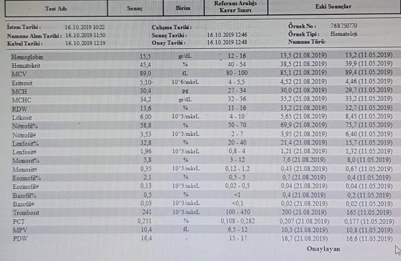

**Şekil 1.** Aydın Adnan Menderes Üniversitesi Uygulama ve Araştırma Hastanesi kan sayımı sonuç raporu

---

## ERİTROSİTLER

Eritroid seriyi değerlendirmek için kullanılan tam kan sayımı parametreleri **eritrosit sayısı (RBC)**, **hemoglobin (Hb)**, **hematokrit (Htc)**, **ortalama eritrosit hacmi (MCV)**, **ortalama eritrosit hemoglobini (MCH)**, **ortalama eritrosit hemoglobin konsantrasyonu (MCHC)** ve **eritrosit dağılım genişliği (RDW)**'dir.

### Eritrosit Sayısı (RBC)

Otomatik kan sayımı cihazlarında impedans veya optik saçılım yöntemi ile en az 10.000 eritrosit sayılarak bulunur. Uluslararası standart olarak önerilen birimi x 10¹²/L'dir.

### Hemoglobin (Hb)

Birimi **g/dL**'dir. Hb değerinin yaşa ve cinsiyete göre 2 standart sapma değerinin altında olması **anemi** olarak tanımlanmaktadır.

### Hematokrit (Htc)

Kan örneğindeki eritrositlerin toplam kan hacmine oranıdır. Birimi **yüzde (%)** olarak ifade edilir. Hb değerinin yaklaşık üç katıdır.

### Ortalama Eritrosit Hacmi (MCV)

Eritrositlerin büyüklüğünü gösterir. Birimi **femtolitre (fL)**'dir. Anemi tespit edildiğinde ilk değerlendirilecek parametredir. Bu parametreye göre anemilerin morfolojik sınıflaması yapılabilmektedir. Ama çocukluk yaş grubunda alt-üst sınırları değerlendirirken mutlaka çocuğun yaşına göre formüller kullanılarak normal aralık sınırları belirlenmelidir.

**⚠️ ÖNEMLİ:**

* 10 yaş altındaki çocuklar için MCV alt sınırı: **70 + yaş (yıl)**
* MCV üst sınırı: **84 + [0.6 x yaş (yıl)]**

### Ortalama Eritrosit Hemoglobini (MCH)

Kan örneğinde eritrosit başına düşen Hb miktarını gösterir. Birimi **pikogram (pg)**'dır. Normal sınır aralığı **27-31 pg** arasında değişir.

* <27 pg → **hipokromi**
* \>31 pg → **hiperkromi**

### Ortalama Eritrosit Hemoglobin Konsantrasyonu (MCHC)

Eritrosit içindeki Hb konsantrasyonunu verir. Birimi **%** olarak ifade edilir. **Hb x 10 / Htc** olarak hesaplanır. Bu özellikten dolayı kan sayımı cihazlarının kontrol parametresi olarak kullanılır.

### Kırmızı Küre Dağılım Genişliği (RDW)

Eritrosit büyüklüklerinin dağılım genişliğidir. **RDW-CV %11.5-14.5** arasında değişir. RDW değerinin artmış olması periferik yaymada **anizositoz** varlığına işaret eder.

### Tablo II. Yaşa Göre Eritrosit Belirteçleri (Ortalama ve -2 Standart Sapma)

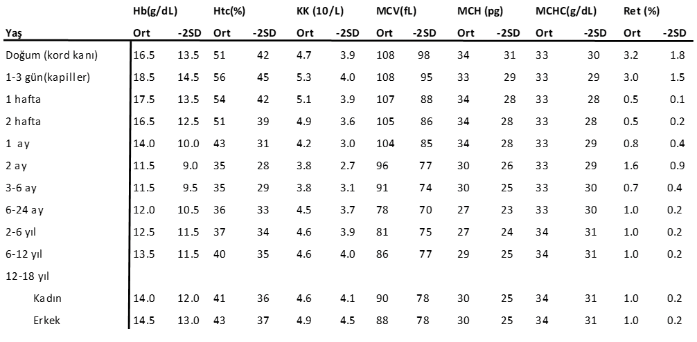

| Yaş | Hb (g/dL) Ort | Hb -2SD | Htc (%) Ort | Htc -2SD | KK (10¹²/L) Ort | KK -2SD | MCV (fL) Ort | MCV -2SD | MCH (pg) Ort | MCH -2SD | MCHC (g/dL) Ort | MCHC -2SD | Ret (%) Ort | Ret -2SD |
|---|---|---|---|---|---|---|---|---|---|---|---|---|---|---|
| Doğum (kord kanı) | 16.5 | 13.5 | 51 | 42 | 4.7 | 3.9 | 108 | 98 | 34 | 31 | 33 | 30 | 3.2 | 1.8 |
| 1-3 gün (kapiller) | 18.5 | 14.5 | 56 | 45 | 5.3 | 4.0 | 108 | 95 | 33 | 29 | 33 | 29 | 3.0 | 1.5 |
| 1 hafta | 17.5 | 13.5 | 54 | 42 | 5.1 | 3.9 | 107 | 88 | 34 | 28 | 33 | 28 | 0.5 | 0.1 |
| 2 hafta | 16.5 | 12.5 | 51 | 39 | 4.9 | 3.6 | 105 | 86 | 34 | 28 | 33 | 28 | 0.5 | 0.2 |
| 1 ay | 14.0 | 10.0 | 43 | 31 | 4.2 | 3.0 | 104 | 85 | 34 | 28 | 33 | 29 | 0.8 | 0.4 |
| 2 ay | 11.5 | 9.0 | 35 | 28 | 3.8 | 2.7 | 96 | 77 | 30 | 26 | 33 | 29 | 1.6 | 0.9 |
| 3-6 ay | 11.5 | 9.5 | 35 | 29 | 3.8 | 3.1 | 91 | 74 | 30 | 25 | 33 | 30 | 0.7 | 0.4 |
| 6-24 ay | 12.0 | 10.5 | 36 | 33 | 4.5 | 3.7 | 78 | 70 | 27 | 23 | 33 | 30 | 1.0 | 0.2 |
| 2-6 yıl | 12.5 | 11.5 | 37 | 34 | 4.6 | 3.9 | 81 | 75 | 27 | 24 | 33 | 31 | 1.0 | 0.2 |
| 6-12 yıl | 13.5 | 11.5 | 40 | 35 | 4.6 | 4.0 | 86 | 77 | 29 | 25 | 34 | 31 | 1.0 | 0.2 |
| 12-18 yıl (Kadın) | 14.0 | 12.0 | 41 | 36 | 4.6 | 4.1 | 90 | 78 | 30 | 25 | 34 | 31 | 1.0 | 0.2 |
| 12-18 yıl (Erkek) | 14.5 | 13.0 | 43 | 37 | 4.9 | 4.5 | 88 | 78 | 30 | 25 | 34 | 31 | 1.0 | 0.2 |

---

## LÖKOSİTLER (BEYAZ KAN HÜCRESİ, BKH, WBC)

Myeloid ve lenfoid seriyi değerlendirmede **lökosit sayısı** ve **lökosit formülü** kullanılır. Lökositleri **granüler hücreler** (nötrofil, eozinofil, bazofil) ve **agranüler hücreler** (lenfositler ve monositler) oluşturur. Lökosit değerleri çocuklarda yaşa göre değişkenlik gösterdiği için yaşa göre normal aralığın altındaki değerler **lökopeni**, üstündeki değerler **lökositoz** olarak tanımlanır.

**⚠️ ÖNEMLİ (Dörtler Kuralı):**

* Doğumdan itibaren ilk **4 gün** → nötrofil hakimiyeti
* **4 gün - 4 yaş** arası → lenfosit hakimiyeti
* **4 yaşından sonra** → tekrar nötrofil hakimiyeti

Lökosit formülündeki anormallikler dikkate alınarak periferik yayma ile doğrulaması yapılmalıdır.

### Lökosit Serisi ile İlgili Tanımlamalar

> **Lökomoid reaksiyon:** Lökosit sayısının >50.000/mm³ olup, periferik kanda myeloid öncüllerin artmış olması

> **Nötropeni:** Mutlak nötrofil sayısının 1 yaş altında <1000/mm³, 1 yaş üzerinde <1500/mm³ olmasıdır. Mutlak nötrofil sayısı = periferik yaymada (nötrofil + çomak yüzdesi) x total lökosit sayısı

> **Monositoz:** Monosit oranının lökosit formülünde >%10 olması

> **Eozinofili:** Eozinofiller %3-5, mutlak sayısı 350-500/mm³ arasında bulunur. Mutlak eozinofil sayısının >500/mm³ olması eozinofili olarak tanımlanır.

> **Bazofili:** Absolü bazofil sayısı oranının >%2 veya >200/mm³ olmasıdır.

### Tablo III. Yaşa Göre Normal Lökosit Değerleri

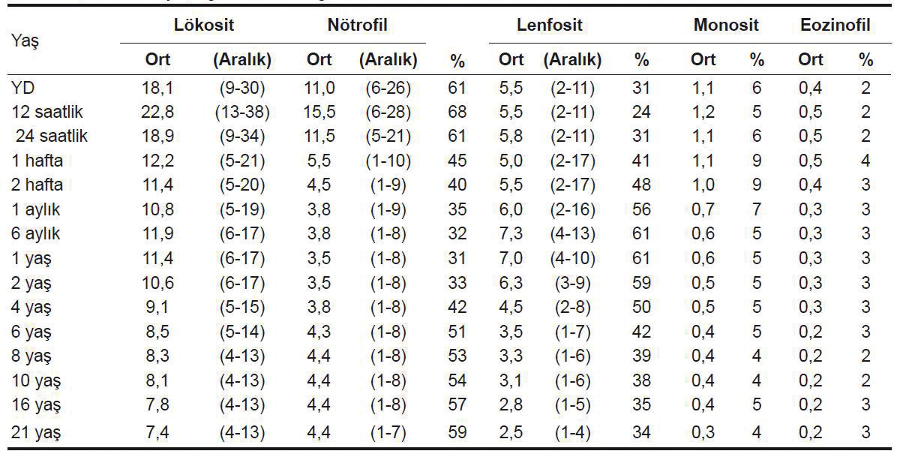

---

## TROMBOSİT (PLATELET)

Trombositler periferik kandaki en küçük hücresel eleman olup megakaryosit sitoplazma parçalarından oluşur, çekirdek içermezler. Sayıları çocukluk çağında değişkenlik göstermez. Normal aralığı **150.000-400.000/mm³** arasında değişir.

### Ortalama Trombosit Hacmi (OTH, MPV)

Trombosit boyutu hakkında ve kemik iliği yapım kapasitesi hakkında bilgi verir. Özellikle trombositopenilerin ayırıcı tanısı için önemlidir. Normal aralığı **7-11 fL** arasında değişir.

* Hacmi büyük trombositler → ↑ artmış trombopoez göstergesi
* **Trombositopeni + büyük trombosit:** immün trombositopeni, Bernard-Soulier sendromu
* **Mikrotrombositopeni** (küçük trombosit + trombositopeni): kemik iliğinde azalmış yapım → aplastik anemi, Wiskott-Aldrich sendromu

---

## PERİFERİK YAYMA

Uygun şartlarda hazırlanmış bir periferik yayma incelemesi hematolojik incelemelerin zorunlu bir parçasıdır. Kan sayımı cihazından elde edilmiş olan sonuçlarda anormal bulguların değerlendirilmesini, uyarıların teyit edilmesini sağlar.

### Periferik Yayma Hazırlama

Temiz bir lam üzerine damlatılan antikoagülanlı (hemogram tüpünden) veya antikoagülansız (parmak ucu, topuk) bir damla kan örneğinin ikinci bir lam ile önce geriye doğru çekilip tüm lam ucuna yaymanın dağılması sağlandıktan sonra **30-35 derecelik açı** ile lam boyunca hızlıca yayılması ile yapılır. Antikoagülansız kan örneği tercih edilmelidir.

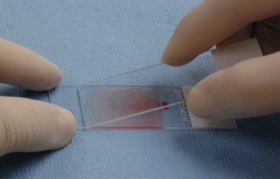

**Şekil 2.** Periferik yayma yapımı

Periferik yayma **Wright** veya **May-Grünwald-Giemsa** boyası ile boyanarak özellikle mikroskobun **x100** büyütme alanında incelemeye alınır. Her üç hücre serisi de morfolojik olarak görülebilecek anormallikler açısından değerlendirilmelidir. Periferik yayma değerlendirirken yaymada kalan su kabarcıkları ve boya artıkları artefakt olarak değerlendirilmelidir.

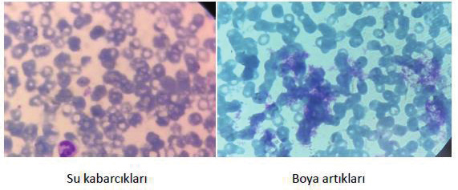

**Şekil 3.** Periferik yaymada kalan su kabarcıkları ve boya artıkları (ADÜ Çocuk Hematoloji BD arşivi)

### Eritrositler

Eritrositleri değerlendirmek için hücrelerin birbirine yakın ama üst üste gelmediği, rulo formasyonunun olmadığı alanlar seçilmelidir.

> **Rulo (rouleaux) formasyonu:** Kırmızı kan hücrelerinin para dizisi gibi yan yana gelmesidir.

Eritrositlerin değerlendirmesi **boyut**, **renk**, **ortadaki solukluk alanı**, **şekil**, **çekirdek** ve **inklüzyon cismi** değerlendirmesini içermelidir.

**Boyut:**
* Normal eritrosit boyutu bir lenfosit çekirdeği boyutunda olmalı veya iki normal eritrosit bir normal nötrofil içine sığabilmelidir → **normositoz**
* Eritrosit çapının normalden küçük olması → **mikrositoz**
* Eritrosit çapının normalden büyük olması → **makrositoz**
* Aynı yaymada farklı boyutlarda eritrositlerin bir arada olması → **anizositoz**

**Renk:**
* Normal eritrositler **pembe** renkli boyanır
* Genç eritrositler **mavi-mor** renkli boyanır
* Farklı renkteki eritrositlerin bir arada olması → **polikromazi**
* Santral solukluk alanı eritrositin **1/3**'ü kadar olmalıdır
* Santral solukluk alanının artması → **hipokromi**
* Santral solukluk azalmış koyu boyanmış eritrositler → **hiperkromik**

**Şekil:**
* Farklı şekillerdeki eritrositlerin bir arada olması → **poikilositoz**
* Artmış yüzey/volüm oranına bağlı şekil değişikliği → **hedef hücre** (target cell)
* Santral solukluk alanının tamamen kaybolduğu küreselleşmiş eritrositler → **sferosit**
* Üzerinde farklı boyutlarda 5-10 adet dikensi çıkıntısı olan eritrositler → **akantosit** (spur cell)
* Üzerinde eşit boylarda ve tüm yüzeye dağılmış dikensi çıkıntılar → **ekinosit** (burr cell)
* Miğfer, üçgen şekilli küçük parçalanmış eritrositler → **şistosit**
* Eritrosit membranı altında serbest Hb kabarcık alanı barındıran eritrositler → **kabarcık hücresi** (blister cell)
* Elips şeklinde eritrositler → **eliptosit**

**Hücre içeriği:**
* Eritrositler çekirdeklerini atarak kemik iliğinden perifere geçerler
* Çekirdekli eritrositler (**normoblastlar**): yenidoğanlarda (ilk 3-4 gün), kemik iliğini uyaran durumlarda, hemolitik anemilerde görülebilir
* **İnklüzyon cisimleri:** bazofilik noktalanma, Howell-Jolly cisimciği, Cabot halkası
* Bazı paraziter hastalıklarda (sıtma) parazit hücre içinde görülebilir

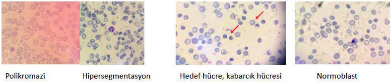

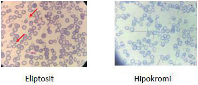

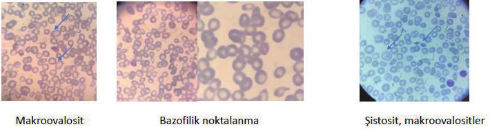

**Şekil 4.** Bazı eritrosit morfolojik anormallikleri (ADÜ Çocuk Hematoloji BD arşivi)

### Lökositler

Lökosit alt gruplarının morfolojisi incelenir. Hücreler çekirdek yapısı, sitoplazma rengi ve granül içeriğine göre değerlendirilir. **Lineer yöntem** veya **zigzag yöntemi** ile 100 çekirdekli hücre sayımı ile lökosit formülü yapılır. Normal bir lökosit formülünde nötrofil, lenfosit, bazofil, eozinofil, monosit görülebilir. Metamyelosit, myelosit gibi öncül hücrelerin veya blastik karakterde hücrelerin görülmesi **patolojiktir**.

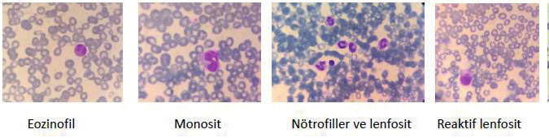

**Şekil 5.** Lökosit alt grupları (ADÜ Çocuk Hematoloji BD arşivi)

### Trombositler

Trombositler sayı ve şekil yönünden incelenir. Normal trombosit sayısı aralığı **150.000-400.000/mm³** kabul edilmektedir.

Periferik yaymada karşılığı:
* Her **10-20 eritrosite** bir trombosit sayılmalıdır
* Her **immersiyon alanında 5-15** trombosit görülmelidir
* Parmak ucundan yapılmış yaymada agregasyon kümeleri oluşması beklenir

**⚠️ ÖNEMLİ:** Kan sayımında trombositopenisi olan olguların mutlaka parmaktan yapılmış periferik yayma ile doğrulaması yapılmalıdır. **Pseudotrombositopeni** tanısı periferik yayma incelemesi ile konulabilir.

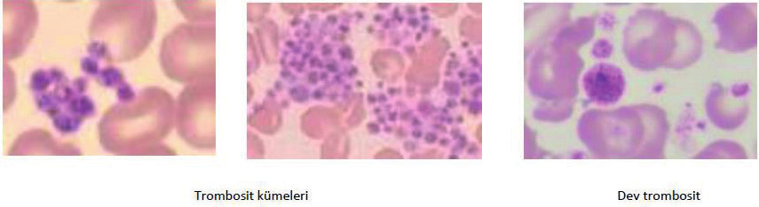

**Şekil 6.** Periferik yaymada trombosit kümeleri ve dev trombosit görünümü (ADÜ Çocuk Hematoloji BD arşivi)

---

## RETİKÜLOSİT

Retikülosit kemik iliğinden perifere salınan daha henüz tam olgunlaşmamış genç eritrositlerdir. RNA artıkları içerdikleri için Giemsa ile boyamada daha **mavimtırak** boyanırlar ve genç eritrosit oldukları için hacimleri normal eritrositlere göre daha büyüktür. Krezil viyole gibi supravital boyalarla periferik yayma boyanırsa manuel olarak da retikülosit sayımı yapılabilir.

* Normal değeri: **%1-2**
* Kemik iliği yapım kapasitesini gösteren önemli bir parametredir
* Özellikle anemik olgularda **düzeltilmiş retikülosit** hesaplanmalıdır

> **Düzeltilmiş retikülosit (%) = Retikülosit (%) x hasta Htc / normal Htc**

---

## İDRAR ANALİZİ

İdrar bakısı özellikle böbrek ve idrar yolları hastalıklarının tanısı ve klinik izlemi için önemli bir tetkiktir. İdrar analizi için temiz, kuru, tek kullanımlık ve kapaklı olan kaplar tercih edilmelidir. İdrar kabı üzerine hasta ile ilgili bilgiler kapakta değil, **idrar kabı üzerine** etiketlenmelidir.

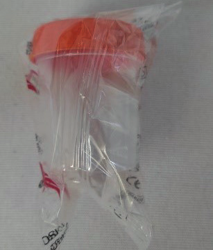

**Şekil 7.** Steril idrar kabı

### İdrar Örnekleri

**1. Spot idrar örneği:** Günün herhangi bir saatinde verilebilen idrar örneğidir. Tam idrar analizi ve mikroskobik incelemeler için kullanılabilen uygun idrar örneğidir. Genellikle sabah uykudan uyandıktan sonra toplanan ilk idrar örneği tercih edilir. En az **10 mL** idrar örneği alınmalıdır. İdeal olan oda sıcaklığında **30 dk** içinde analiz yapılmasıdır. İki saat içinde mutlaka bakılmalıdır.

**2. 24 saatlik idrar örneği:** İdrarla günlük atılımın önem taşıdığı bazı testlerde 24 saatlik idrar örneği toplanmalıdır. Tetkik edilen maddenin miktarı günlük idrar miktarına göre hesaplanır. Bazı tetkikler için (vanil mandelik asit, oksalat, bakır vb) idrarın koruyucu madde üzerine toplanması gerektiğinden toplama işlemi öncesi mutlaka tetkiki çalışacak laboratuvara danışılmalıdır.

**⚠️ ÖNEMLİ:** Bazı tetkikler için (vanil mandelik asit gibi) idrar toplamaya başlamadan önce özel diyet uygulamaları veya bazı ilaçların kesilmesi gerekebilir.

**24 saatlik idrar toplama yöntemi:**
* Toplama günü sabahı ilk idrar dışarı atılır
* Gün içerisinde ve gece yapılan tüm idrarlar toplama kabında toplanır
* Ertesi sabah yapılan ilk idrar da toplama kabına eklenir
* İdrar toplama süresince toplama kabı serin ve karanlık bir yerde (buzdolabı gibi) tutulmalıdır
* Toplanmış olan idrarın tamamı laboratuvara ulaştırılır

### İdrar Toplama Yöntemleri

Çocuklarda idrar örneği dört farklı yöntemle alınabilir.

#### 1. İdrar Torbası Yöntemi

İdrar kontrolü henüz başlamamış bebeklerde ve küçük çocuklarda sıklıkla başvurulan yöntemdir. İlk idrar testi için torba ile örnek alınabilir. Ama idrar kültürü için **kontaminasyon riski yüksek** olması nedeni ile güvenilir bir yöntem değildir.

**İdrar torbası takma adımları:**
- Torbayı takacak kişi ellerini sabun ile uygun şekilde yıkar. Havada ellerin kuruması beklenir.
- Bebek sırt üstü yatırıldıktan sonra steril gazlı bez, sabun ve su ile genital bölgeler, deri kıvrımları, makat ve çevresi yıkanır ve silinir. Kendiliğinden kuruması beklenir.
- İdrar torbası koruyucu ambalajından çıkartılır. Yapışkan kısmının üstündeki parça yapışkan kısmından kaldırılır.
- **Kız çocukta:** Deri kıvrımları gerilerek vajen görünür hale getirilir. Yapışkan kısım vajen-makat arasından başlanarak aşağıdan yukarıya doğru yapıştırılır.
- **Erkek çocukta:** Yukarıdan aşağıya doğru çocuğun penisi torbanın içinde kalacak şekilde yapıştırılır.
- İdrar torbası yapıştırıldıktan sonra bebek **dik pozisyonda** tutulmalıdır.
- İdrar torbası takıldıktan sonra **30 dakika** içinde idrar örneği alınamazsa idrar torbasının değiştirilmesi gerekir.

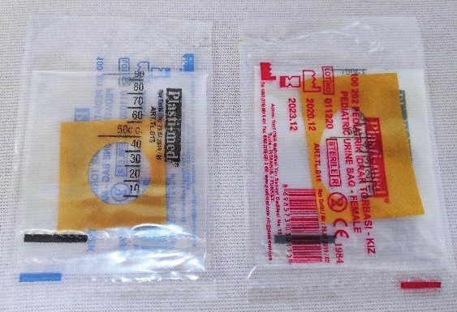

**Şekil 8.** Kız-erkek bebek idrar torbası

#### 2. Orta Akım İdrarı

İdrar kontrolünü sağlayabilen çocuklarda tercih edilir. Sabun ve su ile çocuğun genital bölgesi iyice temizlenir. İdrar örneğinin hiçbir yere değmemesi için:
- **Kız çocukta:** vajen yaprakları aralanarak ve gerilerek
- **Erkek çocukta:** sünnet derisi çekilerek

Çocuğun işemesi istenir. İşemeye başladıktan sonra ilk idrar dışarıya atılır. İşemenin ortasındaki idrar toplama kabına alınır.

#### 3. Sonda (Kateter) ile İdrar Örneği Alma

Torba kültüründe şüpheli üreme olanlarda veya suprapubik aspirasyon tercih edilmeyen olgularda steril olarak kateterizasyon yapılarak idrar örneği elde edilir.

- Son bir-iki saattir idrar yapmamış olan bebek beslenir
- Uygun yere bebek yatırılarak genital bölge temizliği yapılır
- Sonda takacak olan kişi el hijyenini sağladıktan sonra steril eldiven giyerek genital bölgeyi dezenfektan ile temizler
- Delikli steril yeşil örtüyü genital bölge açıkta kalacak şekilde yerleştirir
- Genital bölge steril su veya serum fizyolojik ile ıslatılmış gazlı bez ile tekrar silinir
- Steril şekilde açılmış idrar sondasını kayganlaştırıcı jel ile ucunu temas ettirdikten sonra idrar kanalına yerleştirir
- İlk gelen idrarın bir kısmı dışarıya akıtıldıktan sonra orta akım idrarı örnek için alınır

#### 4. Suprapubik Aspirasyon Yöntemi

Özellikle yenidoğanlar ve küçük bebekler için kullanılan **doğruluk oranı en yüksek** idrar örneği elde etme yöntemidir. Mümkünse öncesinde ultrasonografi ile mesanede idrar varlığı değerlendirilmelidir.

- Son bir-iki saattir idrar yapmadığı gözlenen bebek önce beslenir
- Bebek sırt üstü yatarken alt karın bölgesi antiseptik solüsyonla temizlenir
- Girişim yapılacak alan açıkta kalacak şekilde steril örtü yerleştirilir
- Uygun enjektör ile deriden **10-20 derece** açı yapılarak kalça kemiğinin ön yüzünün altına doğru enjektör yukarıdan aşağıya doğru **2-3 cm** derine sokulur
- İğne 1 cm kadar ilerletildikten sonra enjektörde negatif basınç uygulanarak idrar enjektöre çekilir

### İdrarın Fiziksel Özellikleri

#### İdrar Rengi

Normal idrar rengi sarının tonları şeklindedir. Konsantre idrar daha koyu sarı renkli iken, dilüe idrar daha açık renklidir. Sarı tonları haricindeki renkler patolojiktir.

**Tablo V. İdrarda Renk Değişikliği Yaratan Durumlar**

| Renk | Nedenler |
|---|---|
| Kırmızı renk | Kırmızı renkli gıdalar (pancar, şalgam) İlaçlar (rifampisin, nitrofurantoin) Eritrositüri, miyoglobinüri, hemoglobinüri |
| Sarı-turuncu renk | Bilirubin |
| Siyah renk | Alkaptonüri |
| Mavi renk | Metilen mavisi, indometazin |
| Çay-kola rengi | Glomerülonefrit |

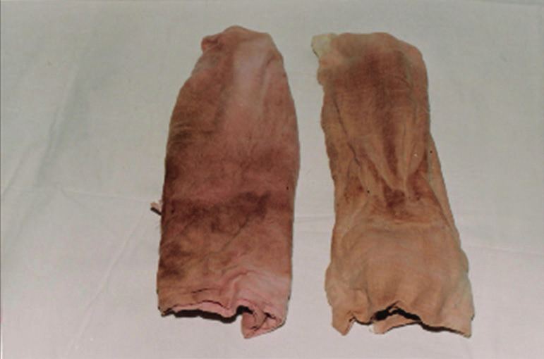

**Şekil 9.** Alkaptonüri (ADÜ Çocuk Nefroloji BD arşivi)

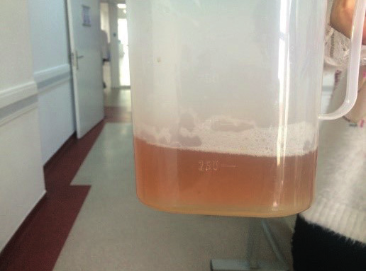

**Şekil 10.** Makroskopik hematüri (ADÜ Çocuk Nefroloji BD arşivi)

Normal idrar berraktır. Bulanık görünen idrarlarda idrarda mikroorganizma, eritrosit, lökosit, böbrek epitel hücresi varlığı araştırılmalıdır.

#### İdrar Kokusu

İdrarın kokusu özellikle bazı metabolik hastalıklar için ayırıcı tanıda önemli olabilmektedir.

**Tablo VI. İdrar Kokusunu Değiştiren Hastalıklar**

| Koku | Hastalık |
|---|---|
| Lahana kokusu | Tirozinemi |
| Yanmış şeker | Akçaağaç şurubu kokulu idrar hastalığı |
| Terli ayak kokusu | İzovalerik asidemi |
| Çürük meyve | Ketoasidoz |
| Küf kokusu | Fenilketonüri |

### İdrarın Kimyasal Özellikleri

- **İdrar pH:** 4.5-8 arasında değişir. Normal diyette genellikle 5-6 civarındadır. Alkali idrar idrar yolu enfeksiyonuna zemin hazırlar.
- **İdrar yoğunluğu (dansite):** Böbreğin idrarı konsantre etme yeteneğini değerlendirmek için kullanılır. **1003-1040** arasında değişir.
  * <1010 → **hipostenürik** (düşük yoğunluklu)
  * 1010-1022 → **izostenürik** (normal yoğunlukta)
  * \>1022 → **hiperstenürik** (yüksek yoğunlukta)
  * Dehidratasyon, proteinüri → ↑ idrar yoğunluğu
  * Diyabetes insipitus → ↓ idrar yoğunluğu
- **İdrar osmolaritesi:** Normal değerleri **300-1200 mOsm/kg** su arasında değişir.
- Normal idrarda glukoz, keton, ürobilinojen ve bilirubin **bulunmaz**.
- **Protein:** Normal idrarda <150 mg/gün veya <10 mg/gün protein bulunabilir.
  * Spot idrarda protein/kreatinin oranı: **<2 yaş → <0.5**, **>2 yaş → <0.2**
  * 24 saatlik idrarda protein atılımı: **<4 mg/m²/saat**
- **Eritrosit reaksiyonu:** Daldırma çubuğu ile pozitif çıkarsa hematüri, hemoglobinüri veya miyoglobinüri düşünülmelidir.
- **Lökosit esteraz ve nitrit reaksiyonu:** Tespit edilmesi halinde olgu idrar yolu enfeksiyonu açısından değerlendirilmelidir.

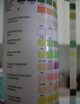

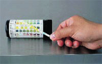

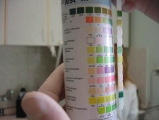

**Şekil 11.** Daldırma çubuğu örnekleri (ADÜ Çocuk Nefroloji BD arşivi)

### İdrarın Mikroskobik İncelemesi

İdrarın mikroskobik incelemesinin yapılabilmesi için idrar sedimenti hazırlanmalıdır. **10 mL** taze idrar **1500-3000 devir/dk** ile **3-5 dk** süresince santrifüj edilir. Santrifüj sonrası üstte kalan kısım atılır ve tüpün dibinde kalan yaklaşık 1 mL idrar süpernatan ile karıştırılır. Hazırlanan idrar sedimentinden bir damla lam üzerine damlatılarak **x40** objektif ile ışık mikroskobunda incelenir.

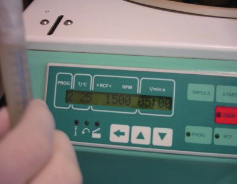

**Şekil 12.** İdrar santrifüj cihazı (ADÜ Çocuk Nefroloji BD arşivi)

**Mikroskobik bulgular:**

- **Eritrosit:** x40 büyütmede her sahada 0-1 eritrosit görülmesi normaldir. Her sahada ≥5 eritrosit görülmesi → **hematüri**
- **Lökosit:** x40 büyütmede her sahada 0-4 lökosit görülmesi normaldir. Lökosit >5 ise → **piyüri**
- **Epitel hücreleri:** Her idrar örneğinde 1-2 tane epitel hücresi görülebilir.
- **Bakteri:** İdrar örneği ideal şartlarda alınmışsa bakteri bulunmaması gerekir. Varsa genellikle hareket halinde görünürler.
- **Kristaller:** İdrar sedimentinin organik olmayan kısmıdır. En sık görülen kristal → **kalsiyum oksalat**. Altıgen görünümlü **sistin kristalleri** → sistinüri açısından çok anlamlıdır. Sistin kristalleri dışında kristallerin tek başlarına tanısal anlamı yoktur.
- **Silindirler:** Distal tübül ve toplayıcı kanalların lümeninde proteinlerin kümeleşmesi sonucu oluşurlar.
  * **Hiyalen silindirler:** İdrarda en sık görülen silindir, Tamm-Horsfall proteini oluşturur. Her alanda >2 görülmesi patolojiktir.
  * Patolojik silindirler: eritrosit, lökosit, yağ ve epitel silindirleri

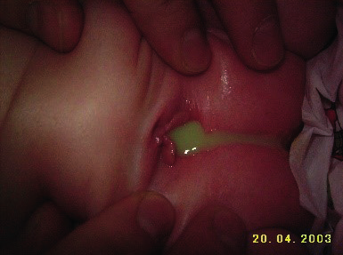

**Şekil 13.** Piyüri örneği (ADÜ Çocuk Nefroloji BD arşivi)

---

## BİYOKİMYA

Çocuklarda en önemli tetkik öncesi (preanalitik) değişken **hasta yaşıdır**. Test sonuçlarını doğru yorumlayabilmek için o teste ait yaş referans aralıklarının bilinmesi gereklidir. Yenidoğanlarda ise hastanın preterm-term olması da birçok sonucun değişken olmasına yol açmaktadır.

### Yaşa Göre Değişen Referans Aralıkları ile İlgili Özellikler

- Yenidoğan döneminde **glukoz, kalsiyum ve magnezyum** referans aralıkları ↓ düşükken, **bilirubin** düzeyi ↑ yüksektir.
- Yenidoğanda **kreatinin** değeri ilk birkaç gün annenin böbrek fonksiyonlarını yansıtır. Çocuklar erişkinlere göre daha az kas kitlesine sahip olduğundan kreatinin yaşla değişir.
- Çocuklarda **karaciğer enzim** düzeyleri erişkinlerden yüksektir.
- Serum **alkalen fosfataz (ALP)** düzeyinin değerlendirilmesinde çocuğun yaşı çok önemlidir.
- **Gama glutamil transferaz (GGT)** değerlendirirken mutlaka yaşa uygun referans değerleri kullanılmalıdır. Yenidoğan döneminde erişkinlerden **sekiz kat** daha yüksek değerler saptanabilir.
- Yenidoğan bebeklerin böbrekleri anatomik ve fonksiyonel olarak tam gelişmemiştir. Nefron sayısı erişkinle aynı olsa da boyut olarak küçüktür. Yaşamın ilk iki yılında önce glomerüler fonksiyon, sonra tübüler sekresyon gelişir.
- **Elektrolit** referans aralıkları da yaşa göre değişebilmektedir. Yenidoğanda **potasyum** üst sınırı 6-6.5 mEq/L olarak kabul edilirken, çocuklarda kan **fosfor** düzeyi erişkinlere göre daha yüksektir.
- Referans aralıklarını değerlendirirken testin çalışma yöntemi ve birimleri de gözden geçirilmelidir.

### Tablo VII. Çocuklarda Biyokimyasal Parametrelerin Yaşa Göre Normal Aralıkları

| Parametre | Yaş | Birim, Normal Aralık |
|---|---|---|
| **Alanin aminotransferaz (ALT, SGPT)** | | **U/L** |
| | 0-7 gün | 6-40 |
| | 8-30 gün | 10-40 |
| | 1-12 ay | 12-45 |
| | 1-19 yaş | 5-45 |
| **Alkalen Fosfataz (ALP)** | | **U/L** |
| | 1-9 yaş | 145-420 |
| | 10-11 yaş | 140-560 |
| | 12-13 yaş | 200-495 (K), 105-420 (E) |
| | 14-15 yaş | 130-525 (K), 70-230 (E) |
| | 16-19 yaş | 65-260 (K), 50-130 (E) |
| **Albumin** | | **g/dL** |
| | Premature | 1.8-3.0 |
| | Term <6 gün | 2.5-3.4 |
| | 8 gün-1 yaş | 1.9-4.9 |
| | 1-3 yaş | 3.4-4.2 |
| | 4-19 yaş | 3.5-5.6 |
| **Aspartat aminotransferaz (AST, SGOT)** | | **U/L** |
| | 0-7 gün | 30-100 |
| | 8-30 gün | 22-71 |
| | 1-12 ay | 22-63 |
| | 1-3 yaş | 20-60 |
| | 3-9 yaş | 15-50 |
| | 10-15 yaş | 10-40 |
| **Bilirubin** | | **mg/dL** |
| | 1 ay - erişkin | <1.0 |
| **Gama-glutamil transpeptidaz (GGT)** | | **U/L** |
| | Kordon kanı | 37-193 |
| | 0-1 ay | 13-147 |
| | 1-2 ay | 12-123 |
| | 2-4 ay | 8-90 |
| | 4 ay-10 yaş | 5-32 |
| | 10-15 yaş | 5-24 |
| **Kalsiyum, total** | | **mg/dL** |
| | Kord kanı | 9.0-11.5 |
| | Yenidoğan, 3-24 saat | 9.0-10.6 |
| | 24-48 saat | 7.0-12.0 |
| | 4-7 gün | 9.0-10.9 |
| | Çocuk | 8.8-10.8 |
| | Sonrasında | 8.4-10.2 |
| **Kreatinin** | | **mg/dL** |
| | 0-4 yaş | 0.03-0.5 |
| | 4-7 yaş | 0.03-0.59 |
| | 7-10 yaş | 0.22-0.59 |
| | 10-14 yaş | 0.31-0.88 |
| | >14 yaş | 0.50-1.06 |
| **Laktat dehidrogenaz (LDH)** | | **U/L** |
| | <1 yaş | 170-580 |
| | 1-9 yaş | 150-500 |
| | 10-19 yaş | 120-330 |
| **Magnezyum** | | **mg/dL** |
| | 0-6 gün | 1.2-2.6 |
| | 7 gün-2 yaş | 1.6-2.6 |
| | 2-14 yaş | 1.5-2.3 |
| **Fosfor** | | **mg/dL** |
| | 0-5 gün | 4.8-8.2 |
| | 1-3 yaş | 3.8-6.5 |
| | 4-11 yaş | 3.7-5.6 |
| | 12-15 yaş | 2.9-5.4 |
| | 16-19 yaş | 2.7-4.7 |
| **Potasyum** | | **mmol/L** |
| | 0-1 hafta | 3.2-5.5 |
| | 1 hafta-1 ay | 3.4-6.0 |
| | 1-6 ay | 3.5-5.6 |
| | 6 ay-1 yaş | 3.5-6.1 |
| | >1 yaş | 3.3-4.6 |
| **Sodyum** | | **mmol/L** |
| | Yenidoğan | 133-146 |
| | İnfant | 134-144 |
| | Çocuk | 134-143 |

---

## SONUÇ VE ÖNEMLİ NOKTALAR

**⚠️ ÖNEMLİ:**

* Sonuçları değerlendirirken mutlaka hastanın **yaşına** dikkat edilmelidir.
* Normal değerlerle karşılaştırma yaparken laboratuvarın **çalışma yöntemi** ve **birimine** mutlaka dikkat edilmelidir.
* Tam kan sayımındaki anormallikler olması durumunda **periferik yayma** değerlendirilmelidir.
* Her anormal laboratuvar değerinde mutlaka tetkik öncesi (**preanalitik**) fazda da hatalar olabileceği göz önünde bulundurulmalıdır.
