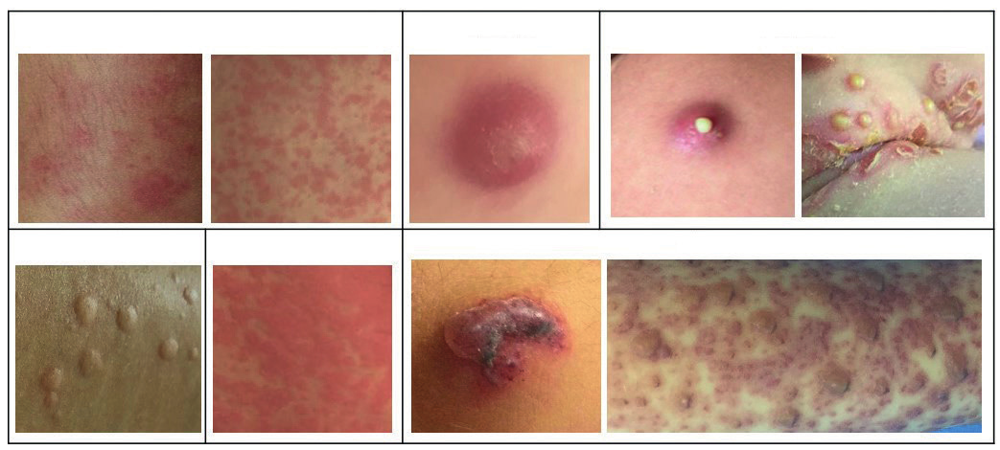
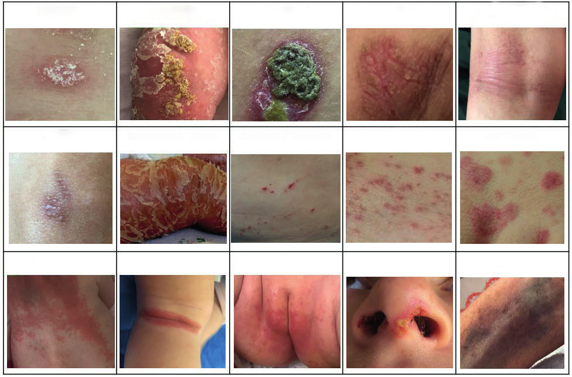
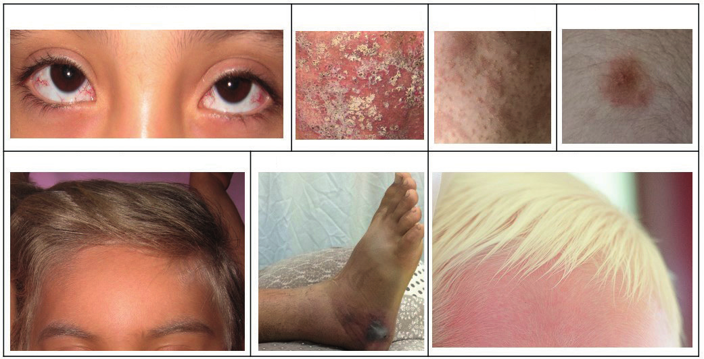
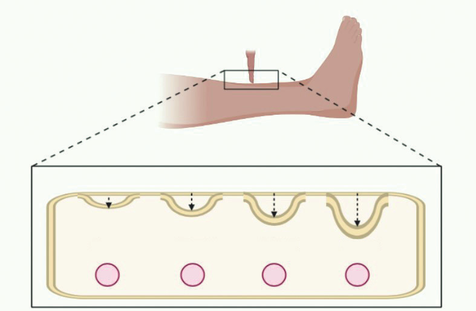
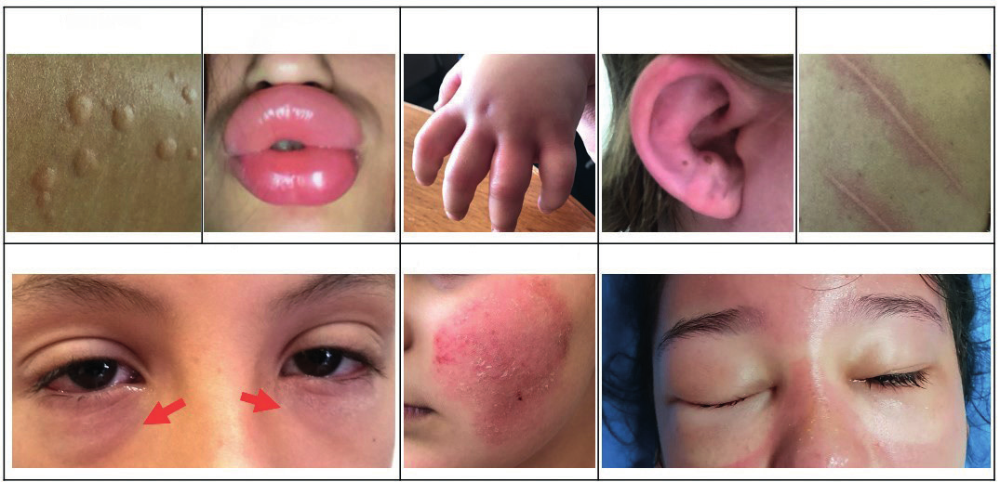
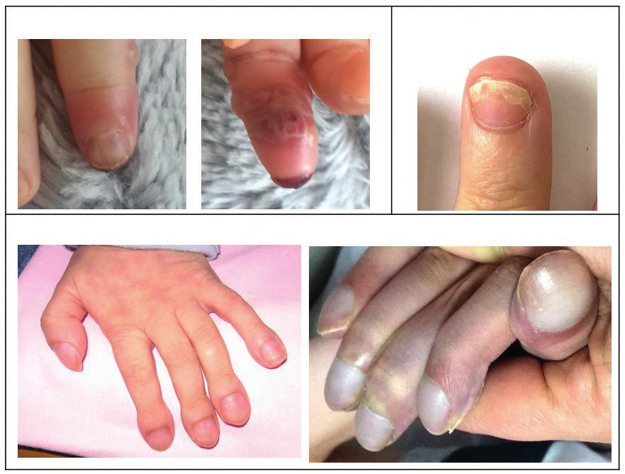

# DERİ MUAYENESİ

**Hazırlayan:** Arş. Gör. Dr. Zeynep Güleç Köksal, Doç. Dr. Pınar Uysal
**Bölüm:** Çocuk Sağlığı ve Hastalıkları

---

## İÇİNDEKİLER

1. [Giriş](#giriş)
2. [Öykü](#öykü)
3. [Derinin Muayenesi](#derinin-muayenesi)
   - [İnspeksiyon](#inspeksiyon)
   - [Deri Lezyonları](#deri-lezyonları)
   - [Palpasyon](#derinin-palpasyonu)
4. [Tırnaklar](#tırnaklar)
5. [Kıllar ve Saç](#kıllar-ve-saç)
6. [Özet](#özet)

---

## GİRİŞ

Deri vücut yüzeyini tamamen örterek dış etkilerden organizmayı koruyan en büyük organdır. Derinin görevi, mekanik, mikrobiyolojik, ozmotik, kimyasal, termal veya ışık gibi çevresel faktörlerin oluşturabileceği zararları en aza indirip bariyer görevi görmektedir. Ayrıca, vücut ısısının korunması, ısı değişikliklerinin düzenlenmesi, dokunma duyusunun algılanması ve D vitaminin sentezinde önemli rol oynamaktadır. Deriyi ilgilendiren **2000'den fazla hastalık** bulunmaktadır. Bu nedenle, her hekimin deri muayenesi ve hastalıkları konusunda tanı ve ayırıcı tanıya götürebilecek bilgi ve deneyime sahip olması gerekmektedir.

Deri hastalıklarının sıklığı yaşlara göre değişmektedir. Örneğin, yenidoğan döneminde doğuştan anomaliler, erken çocukluk döneminde bebek bezi dermatiti, atopik dermatit ve seboreik dermatit ön planda iken, daha büyük çocuklarda enfeksiyöz deri hastalıkları daha sık görülmektedir.

### Derinin Katmanları

Deri **epidermis**, **dermis** ve **hipodermis** olmak üzere üç tabakadan oluşur:

* **Epidermis:** Derinin en üst ve dış tabakası olup embriyolojik olarak ektodermden köken almaktadır. Çok katlı yassı epitelden meydana gelmiştir ve temel hücreleri keratinositlerdir. Keratinositler tırnak ve kıl yapısını oluşturan keratin proteini üretirler. İki kısımdan oluşmaktadır:
  * **a. Boynuzumsu tabaka:** Ölü keratinize hücrelerden oluşmaktadır.
  * **b. Alt tabaka:** Melanin ve keratin yapan hücrelerden oluşmaktadır.
* **Dermis:** Epidermisin beslenmesini sağlayan tabaka olup embriyolojik olarak mezodermden köken almaktadır. Bu tabakada damar yapıları, bağ dokusu, sebaseöz bezler ve kıl folikülleri bulunmaktadır. Dermisin ana bileşeni kollajen denilen fibröz proteindir. Mast hücreleri de dermiste bulunur.
* **Hipodermis (Subkutanöz doku):** Dermisin altında bulunan, yağ, ter bezleri ve geriye kalan kıl foliküllerini içermektedir.

---

## ÖYKÜ

Hasta veya ebeveynlerinden alınan dikkatli bir öykü hastalık yönetiminin temelini oluşturmaktadır. Cilt lezyonlarının **ortaya çıkış zamanı**, **yeri**, **gelişim durumu** (ani veya yavaş), nelerden etkilendiği, doğuştan olup olmadığı ayrıntılı bir şekilde sorgulanmalı ve diğer aile bireylerinde benzer lezyonların olup olmadığı da öğrenilmelidir.

Kaşıntı, ağrı, yanma gibi semptomların sorgulanması hastalığa tanısal yaklaşımda önemlidir:

* **Kaşıntı** varlığında → ön planda scabies (uyuz), ürtiker (kurdeşen) veya atopik dermatit
* **Ağrı** varlığında → zona
* **Yanma hissi** varlığında → herpes enfeksiyonları

Hastaların meslek, hobi ve günlük yaşam öykülerinin sorgulanması hastalığın nedeni veya arttırıcı etkilerini bulma konusunda yardımcı olmaktadır. Hayvan teması, diyet öyküsü, mevsimsel farklılıklar ve ilaç öyküsü de sorgulanması gereken diğer çevresel faktörlerdir.

Öykü alırken sorgulanması gereken bir diğer önemli konu ise **özgeçmiştir**. Bebeklikten itibaren geçirilen ve mevcut hastalıkla ilişkisi olabilecek tüm hastalık ve durumlar sorgulanmalıdır. Eşlik eden deri dışı semptomlar (örneğin ateş, ishal, eklem ağrısı, boğaz ağrısı, halsizlik), hastaneye yatış ve ameliyat öyküsü ve daha önce tanı konmuş kronik hastalıklar (örneğin metabolik ve endokrinolojik bozukluklar) mutlaka sorgulanmalıdır. Doğuştan anomali şüphesi varsa prenatal öykü de alınmalıdır.

**Aile öyküsünün** alınması deri hastalıklarında çok önemlidir. Psöriazis veya Behçet Hastalığı gibi çok faktörlü hastalıklarda ailesel eğilim vardır. Sifiliz, HIV, verruka, dermofitozlar ve skabies (uyuz) gibi bulaşıcı enfeksiyöz hastalıklarda aile bireyleri arasında geçiş olabilir.

---

## DERİNİN MUAYENESİ

Deri muayenesi iyi aydınlatılmış bir odada, normal oda ısısında yapılmalı ve hasta tamamen soyulmalıdır. Tam bir muayene tüm deri ve deri eklerinin (saçlı deri ve tırnaklar) değerlendirilmesini kapsamalıdır. Hastaların sadece şikayetlerinin olduğu vücut bölgeleri değil, tüm vücut ayrıntılı incelenmelidir.

**⚠️ ÖNEMLİ:**

* Örneğin sadece yüzde nörofibrom nedeni ile başvuran bir hasta tamamen soyularak incelenmezse gövdesindeki cafe-au-lait lekeleri ve aksiller çillenme kolaylıkla atlanabilir.

Deri muayenesinin ilk ve en önemli basamağını **inspeksiyon** oluşturur. Muayenede saptanan lezyonların boyutu, şekilleri, dağılımları, simetrik olup olmadığı ve deriden kabarık olup olmadığı detaylı olarak hasta dosyasına kaydedilmelidir.

Fizik muayenede tespit edilen lezyonların **sistemik bir hastalığın belirtisi** olup olmadığı değerlendirilmelidir.

---

### İnspeksiyon

İnspeksiyon derinin renginin değerlendirilmesi ile başlar. Deri renginde önemli rol oynayan dört pigment:

1. **Melanin**
2. **Karoten**
3. **Oksihemoglobin**
4. **Deoksihemoglobin**

#### Melanin

En önemli pigment **melanindir**. Melaninin miktarı ve dağılımı genetik olarak belirlenmektedir. Melanin, beyaz ırkta sadece stratum bazalede bulunurken siyah ırkta stratum spinozum, granülosum ve korneumda da bulunur. Albinizmde melanin metabolizmasında bozukluk sonucu melanin yapımı yoktur.

Deride pigmentasyonda azalma; otozomal dominant kalıtılan kısmi albinizm, inkontinentia pigmenti, Waadenburg sendromu, vitiligo ve tüberoskleroziste görülür.

#### Oksihemoglobin ve Deoksihemoglobin

Oksihemoglobin parlak, kırmızı renkte bir pigmenttir ve derinin renginin oluşmasında rol oynar. Deoksihemoglobin ise oksihemoglobinin dokulardan geçerken oksijen kaybetmesi ile oluşur.

#### Siyanoz

> Siyanoz, kanda deoksihemoglobinin artması sonucu normalde pembe olan deri alanlarının mavimsi renk değişikliğidir.

Siyanoz, total hemoglobin miktarına bakılmaksızın **redükte hemoglobinin 5 gr/dl'yi geçtiği** durumlarda görülür. En kolay tırnak yataklarından, dudaklardan veya diğer mükoz membranlardan farkedilir. Siyanoz, **periferik**, **santral** ve **diferansiyel** olarak üçe ayrılmaktadır.

* **Santral siyanoz:** Kalp hastalıkları (örneğin ağır kalp yetmezliği, konjenital kalp hastalıkları, miyokard enfarktüsü), akciğer hastalıkları (örneğin kistik fibrozis, bronşektazi, pulmoner hipertansiyon), pulmoner emboli, hipotermi, anormal hemoglobinopati ve yüksek irtifada bulunma durumlarında görülmektedir. Parsiyel oksijen basıncı ve saturasyon düşüktür. Siyanoz daha çok mukozalarda, dilde ve konjuktivada görülür. Ekstremiteler sıcak ve periferik perfüzyon iyidir.
* **Periferik siyanoz:** Oksijen saturasyonu normal olmasına rağmen periferik kanlanmanın bozulmasına bağlı olarak ekstremitelerin uç kısımlarında görülen siyanozdur. Kalp yetmezliği, şok, Raynaud fenomeni, soğuk maruziyeti, venöz obstrüksiyon, vazokonstrüksiyon ve hipovolemi gibi durumlarda oluşabilmektedir. Ayrıca, santral tip siyanoza neden olan hastalıkların ileri formlarında periferik siyanoz görülebilmektedir. Mukozalar pembe renktedir. Ekstremiteler soğuk olup kapiller dolum bozulmuştur.
* **Diferansiyel siyanoz:** Üst ve alt ekstremitelerdeki siyanoz miktarının birbirinden farklı olmasıdır. Aortik interruption (siyanoz alt ekstremitelerde belirgin) veya büyük arterlerin transpozisyonuna (siyanoz üst ekstremitelerde belirgin) patent duktus arteriozus ve pulmoner hipertansiyonun eşlik etmesi durumunda görülür.

#### Sarılık ve Karoten

Deri rengi sarı ise öncelikle **sarılık (hiperbilirubinemi)** düşünülmelidir. Hiperbilirubinemi mutlaka gün ışığında değerlendirilmeli ve serum bilirubin düzeyine bakılmalıdır.

**⚠️ ÖNEMLİ:**

* Hiperbilirubinemi önce sklerada başlar, düzelirken de en son sklerada kaybolur.
* Serum indirekt bilirubinin **2 mg/dl** üzerinde olmasıyla sklerada sarılık, **4 mg/dl**'yi aşması durumunda deride sarılık farkedilir hale gelmektedir.

**Karoten** altın sarısı renginde bir pigmenttir. **Hiperkarotenemi** ise karotenin bol bulunduğu havuç, portakal, mandalina gibi besinleri yiyen çocuklarda görülmektedir. Karoten subkutanöz yağ dokusunda ve el ayası, ayak tabanı, kulaklar, burun ucu ile ağız çevresi gibi keratinizasyonun yoğun olduğu bölgelerde birikmektedir.

> 💡 Kulak memeleri, burun ucu, el ve ayak ayalarında sarılık varken sklerada olmaması durumunda düşünülmesi gereken tek tanı **hiperkarotenemidir**.

#### Pigmentasyon Artışı

* Güneşte fazla kalanlarda, hemosiderozis, hipotiroidizm ve pellegrada pigmentasyon **jeneralize** olarak artmaktadır.
* **Addison hastalığında** yüz, boyun ve eller gibi ışığa daha çok maruz kalan bölgeler ile dirsekler, dizler, omurga, parmak eklemleri ve bel gibi kronik sürtünme veya basınca maruz kalan alanlarda pigmentasyon daha belirgindir.
* Güneş ışığına maruz kalan bölgelerde yara ve deri renginde koyulaşmalar **porfiriaların** bazı tiplerinde görülmektedir.
* **Peutz-Jeghers sendromunda** dudaklar, dudakların iç yüzünde, bukkal mukozada ve avuç içlerinde lokal melanin lekeleri görülür.
* **Hartnup sendromunda** ellerin dorsal kısımlarında simetrik kahverengi pigment artışı meydana gelebilir.

#### Solukluk

Derinin soluk renkte olması **anemi**, **kan kaybı** veya **kardiyovasküler dolaşım bozukluğunun** işareti olabilir. Tırnak yatakları, konjonktiva, mukozalar ve dil derinin solukluğunun en iyi tespit edildiği bölgelerdir. Hipoglisemi, vazovagal senkop, şok, anoksi, diğer sistemik ve kronik hastalıklarda da deri soluk görünümde olabilmektedir.

#### Lezyon Şekilleri

Lezyonların şekli tanı koymada ipucu olabilmektedir:

* **Hedef şeklinde** lezyonlar → eritema multiforme
* Çoğu cilt lezyonu **yuvarlak (guttat)** ve **oval (diskoid)** şekildedir
* Ortası dolu yuvarlak lezyonlar → **numuler**
* Ortası soluk yuvarlak lezyonlar → **anüler**

#### Nevüsler ve Pigmente Lezyonlar

Koyu-kahverengi pigmentasyonu olan lekeler **nevüs (ben)** olarak tanımlanır. Değişik büyüklükte olabilirler, büyük nevüslere **dev nevüs** denmektedir. Üzerinde kıl bulunanlar dev kıllı nevüsler olup bunlar büyük oranda ⚠️ malign melanoma dönüşebilir. Küçük pigmente olanlar ise **cafe-au-lait lekeleri** olarak bilinirler ve sütlü kahve renktedir.

> Sütlü kahve renginde olan cafe-au-lait lekeleri nörofibromatozis için tanı koydurucu lezyonlardır. Bu lekelerin sayı ve büyüklükleri de dikkate alınarak nörofibromatozis tanısı konmaktadır.

Yüzde görülen küçük pigmente lekelere **çil** denmektedir, adolesan dönemde daha sıktır.

#### Yenidoğan Derisi

Yenidoğan bebeğin derisi daha ince ve yumuşaktır. Doğumu takip eden ilk 8-24 saat arasında deride eritematöz bir pembelik varken, daha sonra normal bir pembelik oluşmaktadır.

* **Kutis marmoratus:** Isıtılan veya uzun süre ısıtıcı altında kalan bebeklerde vücut ısısı ile çevre ısısı arasında değişimlere bağlı olarak ciltte kırmızı veya mavi renkte harita benzeri dalgalı değişiklikler görülebilir. Yenidoğanda geçicidir; uzun sürerse ⚠️ sepsis ve konjenital hipotiroidi akla gelmelidir.
* **Harlequin diskromia (palyaço renk bozukluğu):** Yenidoğan döneminde simetrik olarak vücudun bir tarafı koyu pembe iken diğer tarafın soluk renkte olmasıdır. Klinik önemi yoktur.
* **Akral siyanoz:** Doğum sonrası birkaç gün el ve ayaklar mavi renkte olabilir ve oksijen desteği ile düzelmez. İnatçı olması durumunda konjenital kalp hastalıklarını düşünmek gereklidir.
* **Mongol lekesi (konjenital dermal melanositoz):** Özellikle yenidoğan döneminden itibaren sakral ve gluteal bölgede yer alan mavi-siyah renk değişikliğidir. Patolojik değildir. Derinin derin tabakalarında pigmentli hücrelerin fazla olmasına bağlı olup erken çocukluk döneminde azalarak kaybolur.
* **Milia:** Toplu iğne başı büyüklüğünde, beyaz, deriden kabarık, zemini eritemli veya eritemsiz olan ve daha çok burun üzerinde, yanaklarda ve çenede yerleşim gösteren lezyonlardır. Birkaç hafta içinde kendiliğinden kaybolur ve klinik önemi yoktur.
* **Miliaria rubra:** Yüz ve gövdede, kırmızı zemin üzerinde, ter bezi kanallarının tıkanması sonucu oluşan veziküler lezyonlardır.
* **Toksik eritem:** Doğumdan sonra 2. veya 3. günde ortaya çıkan eritematöz maküller olup bir hafta içinde kendiliğinden gerilemektedir.

#### Vasküler Anomaliler

Vasküler anomaliler deride sıklıkla görülmektedir. Vasküler nevüs yenidoğanda en sık rastlanan deri tümörüdür. Şarap lekesi şeklinde trigeminal sinirin inerve ettiği bölgeyi tutan daha sık yüz ve boyunda görülen lezyonlar ise **Sturge-Weber sendromunda** görülmektedir.

**Ataksi telenjektazi sendromunda** çocuğun yürümeye başladığı dönemde (1-1.5 yaş) ataksi, 4-5 yaş arasında ise önce konjonktivada daha sonra burun, kulak, göğüs, popliteal ve antekubital fossa ile ellerin dorsal kısımlarında görülen telenjektaziler vardır.

#### Döküntü (Egzantem)

Döküntü (egzantem), çocukluk çağında çok sık rastlanılan çeşitli deri lezyonlarıdır. Çocuk hekimlerinin en sık karşılaştığı deri lezyonları; eritem, makül, papül, püstül, vezikül ve büllerdir.

---

### Deri Lezyonları

Primer ve sekonder elemanter lezyonlar olacak şekilde iki grupta incelenebilir.

#### A. Primer Elemanter Lezyonlar

1. **Makül:** Deri ile aynı düzlem yüzeyinde, kabarıklık yapmayan, etrafı sınırlı ve basmakla solan kırmızı lekelerdir. Lokal vazodilatasyon ile gelişir. Farklı büyüklüklerde olabildiği gibi genellikle çapı 1 cm'yi geçmez. Deriden kabarık olması durumunda **makülo-papül** olarak adlandırılır. Kızamık, kızamıkçık, tifo, roseola infantum, enfeksiyöz mononükleozis, ilaç alımına sekonder ve diğer viral hastalıklarda görülebilmektedir.
2. **Eritem:** Derideki kapillerin ve arteriollerin genişlemesi sonucu derinin pembe renginin koyulaşması ve kızarmasıdır. Parmakla basmakla solar. Ateşli hastalıklar, lokal enfeksiyonlar ve emosyonel durumlarda oluşabilmektedir.
3. **Yama (Patch):** Makül bir cm'den büyük ise yama olarak adlandırılır.
4. **Papül:** Çapı 5 mm'den küçük, deriden kabarık, sıvı veya irin içermeyen, kırmızı ve sert palpe edilebilen lezyonlardır. Sarkoidozda küçük gri veya beyaz renkli papüller oluşur. Molluscum kontagiosum ve verrukada enfeksiyon nedeni ile oluşan epidermal kalınlaşmaya bağlı papül oluşur. Kollajen nevüs, hemanjiom, nörofibrom, mavi nevüs ve böcek ısırığı dermal kaynaklı papül için en iyi bilinen örneklerdir.
5. **Plak:** Sıklıkla papüllerin birleşmesi ile oluşan yassı, palpasyon ile deriden 0.5 cm'den daha yüksekte hissedilen lezyonlardır. Örneğin psöriaziste geniş plaklar görülebilir.
6. **Nodül:** Genellikle deriden kabarık, sert, içi dolu, derin dermis veya deri altı tabakalarında yerleşen, çapları 0.5-2 cm arasında değişen ve papülden daha iri olan lezyonlardır. Nörofibromitoziste çok sayıda nodül olup bunların bir kısmı saplıdır. Çocuklarda sıklıkla karşılaşılan nodüller; hematom, lipom, steril abse ve iyi absorbe olmamış ilaç enjeksiyonlarıdır. Subakut bakteriyel endokarditli hastalarda parmak uçları ve ayak tabanlarında ortaya çıkan ağrılı nodüllere **"Osler nodülleri"** adı verilir ve hastalığın tanısı için oldukça patognomoniktir. Deri altında düğme şeklinde nodüller ile yer yer çukurlukların palpe edilmesi yağ nekrozu için tipiktir.
7. **Hemanjiom:** Deride yüzeyden kabarık kitleler halinde veya deri yüzeyi seviyesinde olabilen, farklı büyüklükteki koyu kırmızı renk değişikliklerine denmektedir. Kavernöz veya kapiller hemanjiom olarak tanımlanan iki farklı tipi vardır. Yenidoğan döneminde göz kapağı ve ense kökünde kapiller hemanjiomlara sık rastlanır, bunların klinik önemi yoktur.
8. **Eritema nodosum:** Genellikle tibianın ön kısmına yerleşen, 2-4 cm çaplı, ağrılı, hassas, deriden kabarık, kırmızı ve morumtırak renkli nodüller ile karakterizedir. ⚠️ Eritema nodosum olan hastalarda ayırıcı tanıda ilk olarak **tüberküloz** düşünülmelidir. Romatizmal ateş, romatoid artrit, sarkoidoz, Stevens Johnson sendromu, sistemik lupus eritematozus, aşırı duyarlılık reaksiyonları ve stafilokoksik lezyonlarında da eritema nodosum görülebilmektedir.
9. **Ksantoma:** Özellikle nazal köprü üzerinde bulunan küçük, sarı renkli ve içleri yağ dolu nodüllere ksantoma adı verilmektedir. Ailesel olabileceği gibi hiperlipideminin de belirtisi olabilir.
10. **Tümör:** Çapı 2 cm'yi geçen nodüllere tümör denmektedir. Benign veya malign özellikte olabilirler. El sırtında papilloma (siğil), lipom ve nörofibromlar benign özelliktedir. Melanomlar ise derinin konjenital tümörleri olup özellikle koyu parlak siyah renkte olanlar ilerleyen dönemlerde malignleşme potansiyeli taşımaktadır.
11. **Vezikül:** Çapı 5 mm'den daha küçük, sınırları belirgin, içi sıvı dolu ve deriden kabarık lezyonlardır. İçlerindeki sıvı kan, serum, lenf veya hücre dışı sıvısı olabilir. İntradermal ise kolay, subepidermal ise zor yırtılır. Veziküllerin yerleri etkene göre değişiklik göstermektedir:
    * **Suçiçeği** → veziküller önce saçlı deride başlar, ardından gövdeye yayılır
    * **Çiçek hastalığı** → lezyonlar daha sıklıkla ekstremitelerde gözlenir
    * **Herpes simpleks** → ağız boşluğu içinde ve dudakların çevresinde
    * **Molluskum contagiosum** → gövdede yoğunlaşır
    * **Herpes zoster (zona)** → lezyonlar sinir trasesi üzerinde ortaya çıkar
    * Böcek ısırmaları ve bitkisel temasta da o bölgede vezikül oluşabilir
12. **Bül:** Veziküllerin 5 mm çaptan daha büyük olanlarına bül denir. Yanık, büllöz impetigo, kontakt dermatit, epidermolizis bülloza, herpetiform dermatit, pemfigus, konjenital sifiliz, akrodermatitis enteropatika, eritema multiformenin büllöz tipi ve inkontinentia pigmentide büller oluşabilir.
13. **Püstül:** Vezikül ya da büllerin içinin pürülan sıvı ile dolu olduğu lezyonlardır. En sık püstül nedenleri impetigo ve folikülit gibi enfeksiyöz durumlardır. Stafilokokların neden olduğu aknelerde ve herpes simpleksin veziküllerinde püstül oluşabilir. Enfeksiyöz durumlarda püstüllerin rengi etkene göre değişebilir. ⚠️ Şarbonda püstülün ortası siyah, çevresi kırmızıdır.
14. **Kist:** Papül ve nodül ile aynı görünümde olan, içinde sıvı ya da yarı katı materyal bulunan kapalı bir boşluktur.

***

#### B. Sekonder Elemanter Lezyonlar

Çoğunlukla primer elemanter lezyon üzerinde ortaya çıkan ikincil değişikliklerdir.

1. **Skuam (Pullanma, Kepek):** Keratinizasyondaki bozukluk sonucu epitel hücrelerinin ince plaklar halinde kurumasına pullanma denir. Kazımakla ya da kendiliğinden dökülmektedir. Normalde cildimizde sayısız korneosit tek tek skuam olarak atılmaktadır, fakat bunların kümelenerek atılması kepekler şeklindedir. Psöriazis, kızılın iyileşme dönemi, egzema ve saçlı derinin kepeklenmesi durumunda görülebilmektedir.
2. **Keratoz:** Stratum korneum tabakasının kalınlaşmasına bağlı deri yüzeyinin sert ve pürtüklü hal almasıdır. Nasır ve kallus gibi bölgesel olabileceği gibi, palmoplantar keratoderma gibi geniş bir alanda da olabilir. Kronik egzema, aktinik keratoz, seboreik keratoz ve psöriaziste görülebilmektedir.
3. **Kabuk:** Serum, kan veya pürülan materyalin deri yüzeyinde kuruması ile oluşan lezyonlardır.
4. **Fissür:** Dermise kadar inen düz yarıklardır. Likenifikasyon veya kalınlaşma gösteren deride görülür. Travma, kimyasal irritan veya soğuk maruziyeti sonucu derinin gerilmesi ile oluşan ağrılı lezyonlardır. Kronik egzemalı deride çok sayıda fissür bulunur.
5. **Erozyon:** Bazal tabaka üzerindeki epidermisin hasarlanıp kaybolması sonucu oluşan sınırlı, deriden çökük ve kanamanın eşlik etmediği lezyonlardır. Pemfigus gibi büllü hastalıkların tipik lezyonu olup, suçiçeği vezikülünün rüptürü sonucunda da gelişebilmektedir.
6. **Likenifikasyon:** Epidermisin kalınlaşması ve deri çizgilerinin belirginleşmesi ile karakterize kuru plaklardır. Tekrarlayan kaşıma ve sürtünme sonucu oluşmaktadır. Genellikle deri renginde olmalarına rağmen hiperpigmente de olabilmektedirler.
7. **Ülser:** Derinin subpapiler tabakası ve epidermisin kaybı ile oluşan, derinin yüzeyinden çökük lezyonlardır. Kanama eşlik edebilir. Derinin travmatik yaraları, orak hücreli anemi, deri enfeksiyonları, Behçet hastalığının genital ülseri, sifiliz şankırı ve venöz yetmezlik sonucunda gelişebilmektedir.
8. **Nedbe (Skar):** Derinin herhangi bir neden ile zedelenmesinden sonra dermis dokusunun yerini fibröz bir yapının alması deride sekel bırakır. Sabit, hareketli, çökük, kabarık, sert ya da yumuşak olabilmektedir. Bu sekel **hipertrofik** (pembe) veya **atrofik** (beyaz) olabilmektedir.
9. **Atrofi:** Epidermal hücrelerin hacim ve sayılarının azalması veya kollagen ve elastik dokunun kaybı ile derinin incelmesi ve şeffaflığının artması ile karakterize lezyonlardır. Arteriyal yetmezlik sonucunda gelişebilir.
10. **Deskuamasyon:** Epidermisin parçalar halinde dökülmesidir. Dermatitis herpetiformis veya stafilokok enfeksiyonlarında görülebilmektedir.
11. **Ekskoriyasyon:** Kaşıma sonrası oluşan abrazyon izleridir. Skabies, kronik ürtiker ve atopik dermatitte sıklıkla görülmektedir.
12. **Keloid:** Kabarık, sert ve bağ dokudan oluşan aşırı skar dokusudur. Travma ve yanıklardan sonra görülebilmektedir. Zencilerde daha sık görülür.
13. **Sklerozis:** Deri altındaki dokuların enflamasyonu ile deride sertleşmenin meydana gelmesidir. Lokalize sklerodermada önce keskin sınırlı hiperemik alanlar oluşur ve ardından lezyonlar beyaz-sarı renkli sert oluşumlara dönüşebilmektedir.
14. **Selülit:** Lokalize, ağrılı, ısı artışının eşlik ettiği deriden kabarık lezyonlardır. Enfeksiyon deri katmanlarında değil subkutan dokudadır. Daha çok osteomyelitli kemikler ve tromboflebitli damarlar üzerinde görülür.
15. **Peteşi:** Deri tabakaları içine kanama ile oluşan, küçük (çapı <2 mm) kırmızı-pembe renkli lekelerdir. Saydam bir cam yardımıyla deriye basınç uygulandığında bu lezyonlarda ❌ solma gözlenmez. Bakteriyel emboli, vasküler hastalıklar, enfektif endokardit ve trombositopeni gibi durumlarda görülür. Sıklıkla kapiller basıncı arttıran şiddetli zedelenme, öksürme veya öğürme durumlarında görülmektedir. Lezyonlar yaklaşık 3-4 gün içinde solmaya başlar. Karında yer alan 0.5 mm çaplı kırmızı-kahverengi olanlara **"rose-spot veya tache rose"** adı verilmektedir ve salmonellozis için tipiktir.
16. **Purpura:** Peteşiden daha büyük 2-5 mm çapında deri içi kanamalarıdır. Lösemi, kanama diyatezi, aplastik anemi, trombositopeni, skorbüt ile H. influenza, streptokok ve meningokok sepsislerinde görülebilmektedir.
17. **Ekimoz:** Deri altı veya derin doku kanamaları sonucu deride oluşan mavi-mor renkli lezyonlardır. Purpuradan daha geniş çaplı (çapı >5 mm) yapılardır. Kanamanın ağırlığına bağlı olarak çeşitli büyüklüklerde olabilirler. Sıklıkla travma sonrası olmakla birlikte kanamaya yatkınlık yaratan tüm hastalıklarda görülebilirler.
18. **Erizipel:** Lokalize, ağrılı, yüzeyden kabarık, bazen büllü ve endüre olabilen deri enfeksiyonudur. Genellikle streptokoksik enfeksiyonlarda görülür ve yüksek ateş eşlik eder.
19. **Subkutan amfizem:** Deri altında serbest havanın bulunmasıdır. Basmakla çıtırtı yani **krepitasyon** şeklinde bulgu verir. Pnömotoraks, pnömomediastinum veya gazlı gangrende sık görülür. Kemik kırıklarının üzerindeki derinin palpasyonunda da aynı krepitasyon hissi alınır, bu durum amfizem ile karıştırılmamalıdır.
20. **Stria:** Derideki soluk-beyaz veya kahverengi çizgilerdir. Gebelik, şişmanlık veya asit gibi vücudun hızla büyüdüğü durumlarda abdominal ve/veya gluteal bölgelerde ve uylukta görülebilir. Diğer bir neden ise **Cushing sendromu**'dur.
21. **Vitiligo:** Deri pigmentasyonunun azlığına denir, lokalize veya jeneralize olabilir. Albinizmde tüm deri pigmentasyonu bozuktur.
22. **İntertrigo:** Vücudun kıvrım bölgelerinde (kulak arkası, boyun kıvrımı, kol altı, karın altı, kasık, kalça arası, el veya ayak parmak araları gibi) nemli deri yüzeylerinin temas ettiği bölgelerde meydana gelen kronik irritasyona bağlı gelişen dermatittir.
23. **Lenfanjit:** Yüzeyel lenfatik damarların enfeksiyonu ile oluşur ve lenfatik drenaj trasesi boyunca eritematöz bir lezyon olarak gözlenir.
24. **Venler:** Pek çok çocukta venler ince deri altından görülebilmektedir. Derialtı yağ dokusunun azaldığı malnutrisyonlu hastalarda venler çok daha belirgindir. Venlerin kol ve bacakta dolgun gözükmesi genellikle pozisyona bağlıdır. Dilate venler ise kalp yetmezliğinde veya venöz obstrüksiyonda görülebilmektedir.
25. **Diaper dermatit:** Uyluk arası (diaper) bölgede genellikle idrarın yaptığı tahrişe bağlı eritemdir.
26. **Eritema multiforme:** Viral, bakteriyel enfeksiyonlar veya ilaç kullanımı (sülfonamidler, antiepileptik ilaçlar ve ağrı kesiciler) sonrası deri ve mukozada aniden gelişen, tekrarlama eğilimi gösteren çok çeşitli eritematöz lezyonlar ile karakterizedir.
27. **Granüloma annulare:** Etrafında deriden kabarık kırmızı bir hale ve ortasında normal deri alanı bulunan eritematöz bir lezyondur. İlaç reaksiyonlarında görülür.
28. **Janeway lezyonları:** Akut bakteriyel endokarditli hastaların avuç içi ve ayak tabanlarında bulunan maküler, ağrısız ve eritematöz lezyonlardır.

---

### Derinin Palpasyonu

Palpasyon ile derinin turgoru, incelik/kalınlığı, nemli/kuru olması, ödem, ağrı, subkutan amfizem varlığı, ısı değişimi ve yağlı olup olmadığı değerlendirilir. Ayrıca, varsa lezyonun kıvamı (sert/yumuşak), yayılımı, diğer dokulara komşuluğu, bu dokulara yapışık olup olmadığı ve fluktuasyon verip vermediği değerlendirilmelidir.

Lezyonun deriye yapışık olup olmadığı lezyonun deri üzerinden kaydırılmasıyla anlaşılabilir:

* Deri ile birlikte hareket eden lezyonların kaynağı derinin kendisidir veya lezyonlar deriye yapışıktır.
* Lezyonlar deriden kaydırılabiliyor ise derinin altındadır.

#### Terleme

Çocuklarda terleme 1. aydan sonra başlar. Bir yaş altındaki çocuklarda sıcak havalarda aşırı hareket ve beslenme sonrasında terlemede artış olabilir. Aşırı terleme varlığı çoğunlukla ailesel olabileceği gibi normal bir bulgu da olabilir. Terlemede artış olan hastalarda araştırılması gerekenler:

* Hipoglisemi
* Hipertiroidi
* Hipokalsemi
* Civa zehirlenmesi (akrodini)
* Tüberküloz

#### Kaşıntı

Deride kaşıntı sistemik hastalıkların bir parçası olabilmektedir. Sarılık, enfeksiyonlar, üremi, demir eksikliği, alerjik hastalıklar, ilaçlar, diyabet ve irritasyon yaratacak faktörler ile kaşıntı gelişebilir.

#### Isı Değerlendirmesi

Ateş varlığından şüpheleniliyorsa mutlaka termometre ile ölçüm gerekmektedir.

* **Şok ve hipoglisemide** → deri genellikle soğuk ve nemli
* **Uzun süre güneşte kalma sonrasında** → sıcak ve kuru
* **Lokal ısı artışı** → genellikle o bölgedeki enfeksiyon (selülit, artrit, erizipel) ve kanlanması bol olan tümörler
* Bir ekstremitenin diğerinden soğuk ve soluk olmasının en önemli nedeni → **kan akımının yetersiz olması**

#### Deri Turgoru

Palpasyon esnasında deri turgoru da değerlendirilmelidir. Deri (karın ve el sırtı) baş parmak ve işaret parmağı arasına alınarak 1-2 cm çekilir ve serbest bırakılır. Oluşan buruşukluk ile derinin kalınlığı ve turgoru eşzamanlı değerlendirilir.

* Derinin eski haline dönmesinde gecikme → deri turgorun azaldığını düşündürür → en önemli neden **ağır dehidratasyon**
* Derinin eski haline çok hızlı dönmesi → deri esnekliğinin arttığını gösterir → **Ehler Danlos sendromu**

#### Ödem

> Ödem, deri içi intersellüler sıvıdaki artma olayıdır.

Ödemin derecesine göre deri kalınlaşıp daha parlak görünmektedir. Deri üzerine iki-üç saniye parmak ucu ile bastırıp çekildiğinde uygulanan basınç ile o bölgedeki intersellüler sıvının dağılması sağlanır ve parmak izi bir süre deride kalır. Bu çöküntüye **"gode"** adı verilir.

Gode bırakan ödemler en hafiften en ağıra doğru +1 ile +4 arasında derecelendirilmektedir:

| Derece | Derinlik | Düzelme |
|---|---|---|
| +1 | <2 mm | Hemen düzelir |
| +2 | 2-4 mm | 10-25 sn içinde |
| +3 | 4-6 mm | Yaklaşık 1 dakikada |
| +4 | 6-8 mm | 2 dakikadan uzun sürede |

> 💡 Miksödem ve lenfatik ödem serttir ve gode bırakmaz.

Ödem hastalığın tipine göre **lokal** veya **jeneralize** olabilir:

* **Lokal ödem:** Venöz ve/veya lenfatik tıkanma, travma, alerjik hastalıklar, enfeksiyonlar ve böcek ısırıkları ile görülür.
* **Jeneralize ödem nedenleri:** Kalp yetmezliği, hipoproteinemi, nefrotik sendrom gibi böbrek hastalıkları, konstrüktif perikardit, malnutrisyon, tiroit hastalıkları, hiperaldosteronizm, enfeksiyöz mononükleozis, sistemik lupus eritematozus ve karaciğer hastalıkları.

Özel ödem tipleri:

* **Anjioödem:** Alerjik hastalıklarda sıklıkla yüzde ve dudaklarda görülen ödem
* **Anazarka:** Tüm vücudu kaplayan yaygın ödem
* **Miksödem:** Hipotiroidide gözlenen ödem şekli

#### Tromboflebit

Tromboflebitte damardaki enflamasyon nedeni ile ven şiş, geniş ve kıvrıntılıdır. Tromboflebit yüzeyel vende ise deriden kolaylıkla palpe edilebilir. Bacakların derin tromboflebitinde ise etkilenen bacağa fleksiyon yapıldığında baldırda ağrı gözlenir. Buna **Homan arazı** denir.

#### Önemli Klinik İşaretler

* **Nikolski İşareti:** Özellikle büllü lezyonlarda bülün dışında kalan normal deriye parmak ile basınç uygulandıktan sonra epidermisin bir parçasının ayrışması veya o alanda kırışıklık oluşmasıdır. **Pemfigus** grubu hastalıklar için önemli bir bulgudur.
* **Köbner İşareti:** Derideki lezyonsuz alanda tekrarlayan mekanik travmadan 10-14 gün içerisinde hastalığın tetiklenmesi ile yeni lezyonların oluşmasıdır. Psöriazis, vitiligo ve liken planusta görülebilir ve aktif hastalık varlığına işaret eder.
* **Darier İşareti:** Lezyonların sert bir şekilde kaşınması veya ovulması ile lezyonda birkaç dakika içinde kızarık, kabarıklık veya ürtiker oluşmasıdır. Lezyon içinde mast hücrelerinin varlığı için patognomoniktir. **Mastositoz** veya ürtikeryaa pigmentoza gibi hastalıklarda pozitiftir.
* **Diaskopi:** Saydam bir cam veya plastik yardımıyla deriye baskı uygulandığında lezyonların solup solmama durumu incelenir. Cilt altına kanama varlığında lezyon solmazken vasküler konjesyon varlığında lezyonda soluklaşma görülmektedir.
* **Dermografizm:** Basınçla deri hassasiyetinin ortaya çıkmasıdır. Sivri uçlu bir cisim yardımıyla derinin çizilmesinden sonra uygulama yerinde hiperemik bir çizgi oluşmasıdır. Bazı hastalarda bu çizgi kırmızı değil beyaz renktedir (beyaz dermografizm). Dermografizm atopik hastalıklarda sık görülür.

#### Wood Işığı ve Dermoskopi

Dermatoloji hekimlerince yapılan daha ileri incelemelerdir:

* **Wood ışığı** ile çıplak gözle görülmeyen floresans verme özelliğine sahip lezyonlar görülür. Tinea versicolorda yeşilimsi sarı/bakır kırmızısı floresans alınırken eritrazmada mercan kırmızısı floresans alınır.
* **Dermoskopi** ise pigmente deri lezyonlarının mikroskopi ile değerlendirilmesidir. Farklı boyutlarda dermoskop çeşitleri bulunmaktadır.

---

## TIRNAKLAR

Tırnak, kıl ile sebaseöz ve ter bezleri derinin devamı kabul edilmektedir. Tırnaklar, el ve ayak parmaklarının ucunda bulunan ve parmak uçlarının dış bölümünü örten boynuzsu keratin tabakasıdır.

Tırnak ünitesi; tırnak matriksi, tırnak yatağı, tırnak plağı, kutikula ve eponişyum, hiponişyum, tırnak kıvrımları, destekleyici iskelet ve yumuşak dokudan oluşur. Tırnak sıkıca kendisine yapışan tırnak yatağının damarlaşmasından dolayı pembe renkte gözükür.

Tırnak muayenesi dermatolojik muayenenin önemli bir parçasıdır. Tırnaklar sistemik hastalık bulgularını da taşıyabileceği için dikkatle değerlendirilmelidir. Tırnak yatakları **siyanoz, sarılık, çomak parmak, kapiller pulsasyon ve kapiller dolum zamanını** göstermede önemli bir bölgedir.

### Lunula

Tırnak plağının proksimalinde beyaz ay şeklinde **lunula** olarak adlandırılan kısım vardır:

* Kalp yetmezliği, kortikosteroid kullanımı, alopesi areata ve bazı akciğer hastalıklarında lunulada **kızarıklık** görülmektedir.
* Üremi varlığında ise lunula **kahverengine** dönebilmektedir.
* Skleroderma, lupus ve dermatomiyozit gibi bağ dokusu hastalıklarında tırnak proksimalinde **telenjektaziler** görülebilmektedir.

### Tırnak Anomalileri

* **Anonişi:** Genellikle travma, ektodermal displazi veya izole anomali nedenleri ile gelişen tırnak yokluğudur.
* **Koilonişi:** Tırnak yatağının çukurlaşıp kaşık şeklini almasıdır. Konjenital olabileceği gibi kronik anemi, demir eksikliği anemisi, fungal enfeksiyonlar, hipotiroidi ve hipertiroidide görülebilir.
* **Makronişi:** Tırnakların aşırı büyük ve geniş olmasıdır. Rubinstein Taybi sendromu, hemihipertrofi, Down sendromu, psödohipoparatiroidizm ve fokal dermal hipoplazide görülür.
* **Yüksük tırnak (Pitting):** Tırnakta toplu iğne başı büyüklüğünde çok sayıda noktasal çukurcukların olmasıdır. Psöriazis, egzema ve alopesi areata en sık nedenlerdir.
* **Çomak parmak (Clubbing):** Parmak uçlarında genişleme, büyüme ve çomaklaşma ile karakterizedir. Nedenleri:
  * Kronik akciğer hastalıkları (kistik fibrozis, bronşektazi, alfa-1 antitripsin eksikliği, akciğer kanseri, mezotelyoma, tüberküloz, akciğer apsesi, intersitisyel pulmoner fibrozis)
  * Kronik enflamatuvar bağırsak hastalıkları (ülseratif kolit, Crohn hastalığı)
  * Siroz, gastrointestinal neoplaziler
  * Siyanotik konjenital kalp hastalıkları (büyük arter transpozisyonu, pulmoner atrezi, Fallot tetralojisi)
  * Orak hücreli anemi, Basedow-Graves hastalığı, hipertrofik osteoartropati
  * Nadiren yapısal olabilir
* **Tırnak boynuzlaşması (Onikogrifoz):** Tırnak plağının aşırı kalınlaşıp pençe görünümü almasıdır. Sıklıkla tekrarlayan travma sonrası olabildiği gibi vasküler ya da nörolojik hastalıklar nedeni ile de olabilir.
* **Melanonişi striata:** Tırnakta kahverengi veya siyah renkte bantlardır. Genellikle dikey olarak ortaya çıkar. Nevomelanositik tümörler, ilaçlar, liken planus, Addison Hastalığı, Peutz-Jeghers sendromu ve hemokromatozis gibi hastalıklarda görülebilir. Siyah ırkta fizyolojik olabileceği gibi çocuklarda tek tırnakta görülmesi genellikle selim melanositik nevüse bağlıdır ve izlem gerektirir.
* **Lökonişi:** Tırnakta beyaz çizgiler ve beneklerin oluşmasıdır. Sıklıkla travma ve beslenme bozuklukları nedeniyle olmaktadır.

### Tırnak Çizgilenmeleri

* **Mee çizgileri:** Lunulaya paralel görülen ve sıklıkla akut hastalıkta oluşan çizgilerdir.
* **Beau çizgileri:** Lunulaya paralel tırnak çökmeleridir ve sıklıkla kronik hastalıklarda tırnağın büyümesindeki duraklamaya bağlı gelişir.
* **Muehroke çizgileri:** Tırnak tabanına paralel gelişen beyaz çizgilerdir. Çinko, vitamin B6 eksikliği, malnutrisyon veya hipoalbuminemiye bağlı gelişir.
* **Onikoliz:** Tırnak distal ucunda ayrılmadır. Travma, enfeksiyon, ilaç, psöriazis, liken planus, kontakt dermatit, demir eksikliği, vitamin eksiklikleri, gebelik, diyabet ve hipertiroidide görülebilir.
* Fungal enfeksiyonlar, hipoparatiroidizm, romatoid artrit ve kronik anemilerde tırnaklarda **kırılma** görülebilir.

### Tırnak Renk Değişiklikleri

Tırnaklar normalde açık pembe renktedir:

* Siyanotik kalp hastalıkları ve akciğer hastalıklarında → 🔵 mor renk
* Kronik anemide → ⚪ beyaz renk
* Porfiride → kırmızımsı siyah renk
* Post-matür bebeklerde ve lenfödem varlığında → 🟡 sarı renk değişikliği
* Subakut bakteriyel endokardit ve peteşi yapan diğer hastalıklarda → tırnak altına kanama noktacıkları

### Tırnak Enfeksiyonları

* **Onikomikozis:** Fungal etkenlerin tırnakta yaptığı enfeksiyondur. Tırnakta deformite, kırık ve kabuklar halinde dökülmeler olabilir. ⚠️ Endokrinopatiler ile birlikte onikomikozis varlığında **mukokutanöz kandidiazis** düşünülmelidir.
* **Paronişiya:** Tırnak çevre dokularının iltihabıdır.

---

## KILLAR VE SAÇ

Kısa, ince ve göze çarpmayan kıl tipine **vellus** denilmektedir. Uzun ve kalın tipteki saç ve kirpik gibi kıllar ise **terminal kıl** olarak adlandırılır. Yenidoğanlarda ve prematür bebeklerde omuz ve sırttaki kıllanma 3 ay sonra kaybolmaktadır. Ergenlik dönemine kadar çocuklarda saç, kirpik ve kaş dışında terminal kıl bulunmaz. Ergenlik ile birlikte önce pubik bölgede, ardından aksiller bölgelerde terminal kıllar oluşmaya başlar.

Sakral bölgede kolumna vertebralis üzerinde küme halinde kıllanma varlığı orta hat defektlerinden **spina bifida** veya **spina bifida okülta** gibi hastalıkları düşündürmektedir.

### Kıllanma Artışı

Kaş ve kirpiklerin uzun olması ailesel olabileceği gibi tüberküloz ve bazı metabolik hastalıklarda da görülebilmektedir. Yüz ve gövdede kıllanma artışının nedenleri:

* Virilize edici tümör
* Hiperinsülinizm, akantozis nigrikans
* Santral sinir sistemi lezyonları
* Polikistik over sendromu
* Hurler ve Cornelia de Lange sendromları
* Anabolik steroid, stilbestrol ve testesteron alımı
* Cushing sendromu, A vitamini entoksikasyonu, hepatik porfiria
* Fenitoin ve diazoksid kullanımı
* Hipotiroidizm veya kronik enfeksiyon durumları

### Kıllanma Azlığı

Kaşların dış üçte birlik bölümünün dökülmesi durumunda (**Kraliçe Anne işareti**) hipotiroidi ve erişkin tip (**Hertoghe bulgusu**) atopik dermatit düşünülmelidir.

Kıllanma kişinin yaşına göre beklenenden az ise şüphelenilmesi gerekenler:

* Gonadal diskinezi
* Hipotiroidizm
* Pituiter yetmezlik
* Addison hastalığı
* Diğer kronik hastalıklar

---

## ÖZET

Cilt hastalıklarında dikkatli bir öykü hastalık yönetiminin temelini oluşturmaktadır. Cilt muayenesi doğal gün ışığında ya da iyi aydınlatılmış bir odada yapılmalıdır. Cilt muayenesinin iki ana unsuru **inspeksiyon** ve **palpasyondur**. Derinin rengi, sıcaklığı, yapısı ve turgoru değerlendirilmelidir. Herhangi bir lezyon varsa anatomik lokalizasyonları, dağılım özellikleri, lezyonların tipi, çapları, deri seviyesinden yüksekliği ve renkleri değerlendirilmelidir. Bu lezyonlar doğru tıbbi terminolojiler kullanılarak not edilmelidir.

**⚠️ ÖNEMLİ:**

* Tam bir muayene tüm deri ve deri eklerinin (saçlı deri ve tırnaklar) değerlendirilmesini kapsamalıdır.
* Hastaların sadece şikayetlerinin olduğu vücut bölgeleri değil, tüm vücut ayrıntılı incelenmeli ve eşlik edebilecek sistemik hastalıklar araştırılmalıdır.
