# GASTROİNTESTİNAL SİSTEM MUAYENESİ

**Hazırlayan:** Doç. Dr. Şükrü Güngör
**Bölüm:** Çocuk Sağlığı ve Hastalıkları

---

## GİRİŞ

Özellikle süt çocuğu ve oyun çağı çocuklarında muayene sırasındaki korku, endişe ve istemli defans gibi durumlardan dolayı gastrointestinal sistem muayenesini yapmak zordur. Bu zorluğun üstesinden gelebilmek için muayene öncesi ve muayene sırasında bazı kurallara uyulması gerekmektedir.

**Muayene ortamı ve hazırlık:**

* Muayene ortamı sessiz ve uygun ışık alan bir ortamda olmalıdır.
* Muayene eden doktorun güler yüzlü, sabırlı ve nazik olması gerekmektedir.
* Muayene öncesi eller yıkanmalı, ısıtılmalı, tırnaklar uzun olmamalıdır.
* Muayene edilecek çocuk huzursuz ise muayeneye anne kucağında başlanması veya dikkatinin renkli cisim veya oyuncaklarla dağıtılması uygun olabilir.
* Bazı çocuklar gıdıklanma ve gülme sebebiyle muayeneyi zorlaştırabilir. Bu tarz hastalarda sabırlı olunmalı, konuşularak dikkati dağıtılmalı ve gerekirse hastanın eliyle birlikte karın muayenesi tamamlanmalıdır.
* Muayeneyi yapacak doktorun yapacağı muayene hakkında ebeveynlere ve çocuğa bilgi vermesi güven verici bir davranıştır ve hastanın muayeneye uyumunu artırır.
* Muayene sırasında giysilerin tamamen çıkarılması karın muayenesinin daha sağlıklı yapılmasını sağlayacaktır. Ancak bunu kabul etmeyen ergenler olabilir. Bu durumda kıyafetler karın bölgesinde, aşağıda kasıklara kadar, yukarıda ise meme uçlarına kadar sıyrılabilir.
* Hastanın pozisyonu sırt üstü yatar pozisyonda, eller yanlarda, bacaklar fleksiyonda, baş sola dönük şekilde olmalıdır.

---

## KARIN BÖLGELERİ

Muayene sırasında tespit edilen bulguların daha kolay değerlendirip ifade edilmesine yardımcı olmak için karın bölgesi hayali çizgiler ile **dört bölgeye** ya da **dokuz bölgeye** ayrılabilir.

### Dört Kadran

Karnı dört bölgeye ayıran hayali çizgiler göbekten geçen yatay ve dikey çizgilerdir (Sağ üst-alt, Sol üst-alt bölge).

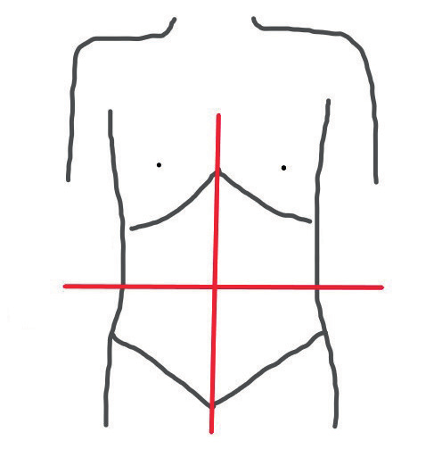

### Dokuz Kadran

Karın, bilateral spina iliaka anterior-süperiorlar ve bilateral kosta yaylarını birleştiren hayali horizontal çizgiler ile bilateral midklavikular hatlardan geçen hayali vertikal çizgilerle dokuz kadrana bölünür:

* Sol-sağ hipokondral bölge
* Sol-sağ lumbal bölge
* Sol-sağ ingüinal bölge
* Epigastrik, umblikal ve hipogastrik bölge

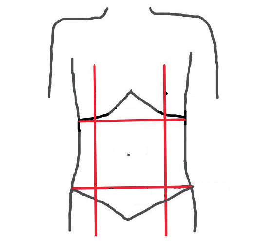

### Kadranlardaki Organlar

* **Sağ üst kadran:** Karaciğer, safra kesesi, hepatik fleksura, transvers kolon, pilor, duodenum, pankreas başı, sağ böbrek, sağ surrenal bez ve sağ akciğer alt lobu
* **Sol üst kadran:** Mide fundusu, dalak, karaciğer sol lobu, pankreas kuyruk kısmı, kolonun splenik fleksurası
* **Sağ alt kadran:** Çekum, apendiks, çıkan kolon, sağ over ve tubalar, sağ üreter ve ince bağırsaklar
* **Sol alt kadran:** İnen kolon, sigmoid kolon, sol over ve tubalar, sol üreter

> **⚠️ ÖNEMLİ:** Karın muayenesinde inspeksiyon, oskültasyon, palpasyon ve perküsyon yöntemleri kullanılır. Diğer sistem muayenelerinden farklı olarak palpasyon ve/veya perküsyon yöntemleri (bağırsak seslerini artıracağından dolayı) oskültasyondan sonra yapılır.

---

## 1. İNSPEKSİYON

İnspeksiyon için ortam ışığının yeterli olması ve mümkünse çocuk tamamen soyunukken yapılması gereklidir. İnspeksiyon hastanın genel durumunun, oryantasyonun ve kooperasyonun değerlendirilmesi ile başlar.

* Karaciğer yetmezliği olan bir hastada huzursuzluk, ajitasyon veya uykuya eğilim → hepatik ensefalopatiy düşündürür.
* Daha sonra baş boyundan başlayarak tüm vücut inspeksiyonu yapılmalıdır.

### Genel Vücut İnspeksiyonu

* **Skleral ikter:** Hemolitik anemi, karaciğer hastalığı, enfeksiyöz hepatit ve safra yolu patolojilerini düşündürür.
* **Saçların seyrek olması:** Malnütrisyon, mikro-makronütrient eksikliğini akla getirir.
* **Ağız içi ve dudak mukozasında hiperpigmente lezyonlar:** Peutz-Jeghers sendromu, HIV enfeksiyonunu düşündürebilir.
* **Sık tekrarlayan oral aftlar:** Behçet hastalığı, inflamatuvar bağırsak hastalığı, immün yetmezlik gibi hastalıkları düşündürebilir.
* **Çomak parmak, palmar eritem:** Kronik karaciğer hastalığı, pulmoner hipertansiyon, kalp yetmezliğinin bir bulgusu olabilir.
* **Jinekomasti, spider hemanjiom:** Karaciğer hastalığı, obezite, endokrin patolojiler, endokrin tümörler için ipucu olabilir.

### Karın İnspeksiyonu

Her yaş grubu çocukta karın inspeksiyonu ile aşağıdakiler açısından değerlendirilmelidir:

* Solunum sırasındaki karın hareketleri
* Göğüs deformitesi
* Batın distansiyon, deformiteler
* Skar izleri
* Vasküler yapılar
* Herni, lipom, fibrom, hemanjiom
* Cilt döküntüleri

### Görünür Pulsasyon

* Sağ kalp yetmezliğinde → epigastriumda
* Karaciğer hemanjiomunda → sağ üst kadranda
* Aort anevrizmasında → orta hatta gözlenebilir

### Görünür Peristaltizm

Pilor stenozu, ince-kalın bağırsak obstrüksiyonlarında gözlenebilir. Diastazis rektisi olan zayıf sağlıklı kişilerde de görülebilir.

### Prune Belly Sendromu

Karın kaslarının yokluğu (Prune Belly Sendromu), gastroşizis, omfalosel yenidoğan döneminde karın muayenesinin inspeksiyon ile tanı konulan dikkat çekici bulgularıdır.

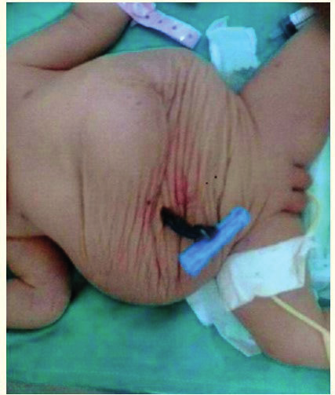

### Gastroşizis ve Omfalosel

> **Gastroşizis:** Umblikal bölge dışında, herhangi bir karın bölgesinden batın içi organların dışarı çıkmasıdır. Organların üzerinde periton yoktur.

> **Omfalosel:** Umblikal bölgeden karın içi organların dışarıya çıkmasıdır. Organlar periton zarı ile örtülüdür.

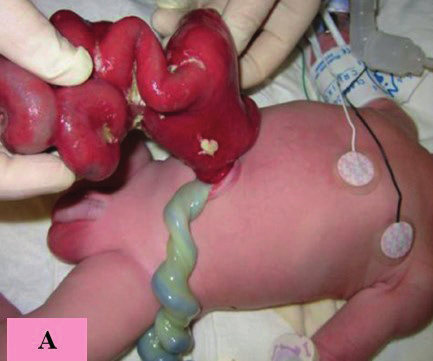

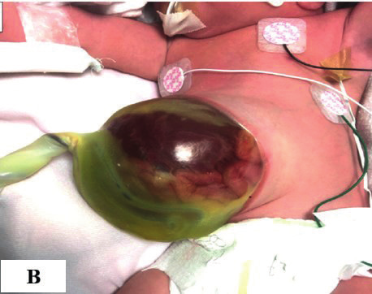

### Göbek Muayenesi

Yenidoğan döneminde göbeğin düşüp düşmediği, akıntı, pis koku, göbek etrafında hiperemi, granülom olup olmadığı incelenmelidir.

> **Omfalit:** Göbek çevresinde hiperemi, ısı artışı, göbekten pürülan akıntı ve pis koku ile kendini gösterebilir.

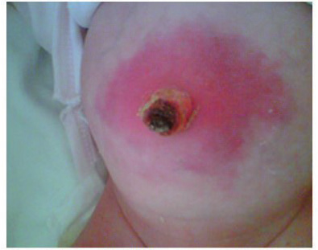

**Kabarık göbek:** Ikınma ve öksürmede belirginleşiyor ise göbek fıtığını düşündürürken, fıtık olmadan bu bulgu var ise intraabdominal basıncın sıvı veya kitle gibi durumlar sebebiyle artmasına işaret eder.

**Göbekte fistül:** Açık kalmış urakus kalıntısında göbekten idrar sızar, batın içi apse veya kolonik fistüllerde ise fekaloit akıntı gelebilir.

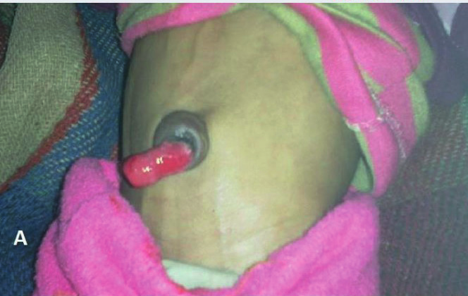

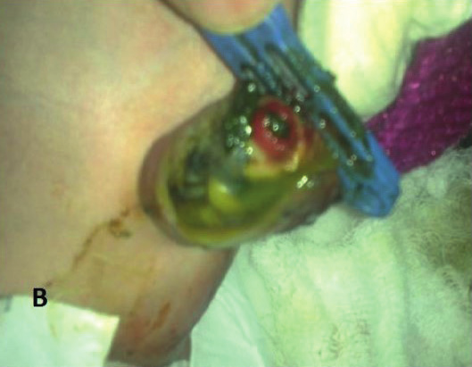

**Umblikal herni:** Göbek deliğinin silik olması ya da dışarıya doğru bombe olmasıdır. Asit, distansiyon gibi batın içi basınç artışı yapan durumlarda gözlenebilir.

**Göbekte nodül:** Mide kanseri eğer göbeğe metastaz yaparsa buna özel olarak **Sister Mary Joseph nodülü** denir.

### Karın Venleri ve Caput Medusa

Hidrops fetalis ile doğan ve asiti olan bir yenidoğanda batın gergin ve parlak olabilir. Normalde karın venleri görülmez veya deri altı yağ dokusu ince olan kişilerde çok ince mavi çizgiler şeklinde gözlenebilir.

* Karın 2/3 alt bölümünün venleri → aşağıya doğru akar
* 1/3 üst bölümün venleri → yukarıya doğru akar

> **Caput medusa:** Göbek çevresinde ışınsal tarzda damarsal yapıların olmasıdır.

Karın venlerinde belirginleşme ve/veya kollateral venöz yapıların varlığı **portal hipertansiyon** bulgusudur ve portal ven trombozu, karaciğer sirozu, Budd-Chiari sendromunda gözlenebilir.

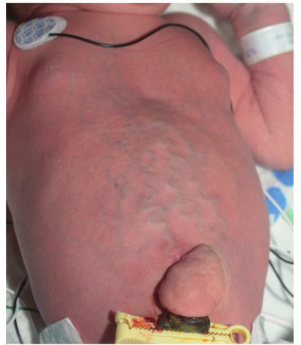

### Spider Nevus, Cullen ve Grey-Turner Belirtileri

Kronik karaciğer yetmezliği olan hastalarda ciltte örümcek ağı benzeri arteriyovenöz yapılar **spider nevus** olarak adlandırılır.

> **Cullen belirtisi:** Akut hemorajik pankreatitte göbek çevresinde görülen mavi-gri ekimotik renk değişikliğidir.

> **Grey-Turner belirtisi:** Cullen belirtisi ile birlikte aynı sebep ile karnın sol sulkusunda görülen büyük ekimozlardır.

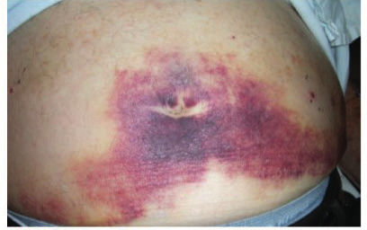

### Karın Distansiyonu ve Diğer Bulgular

**Karın distansiyonu:** Asit, bağırsaklarda gaz, organomegali veya batın içi kitlelerde gözlenebilir. Ayrıca malabsorbsiyonlarda, bağırsak obstrüksiyonlarında ve hipotiroidide karın distandü görünebilir.

**Karında çöküklük:** Karın kası yokluğu, diyafram hernilerinde gözlenebilir. Ayrıca çok zayıf çocuklarda, malabsorbsiyonda, bağırsak obstrüksiyonlarında, pilor stenozunda peristaltik hareketler gözle görülebilir.

> **Cutis marmaratus:** Karın cildindeki dalgalı görünümlerdir. Septik hastalarda ciltteki perfüzyon bozukluğuna bağlı gelişebilir.

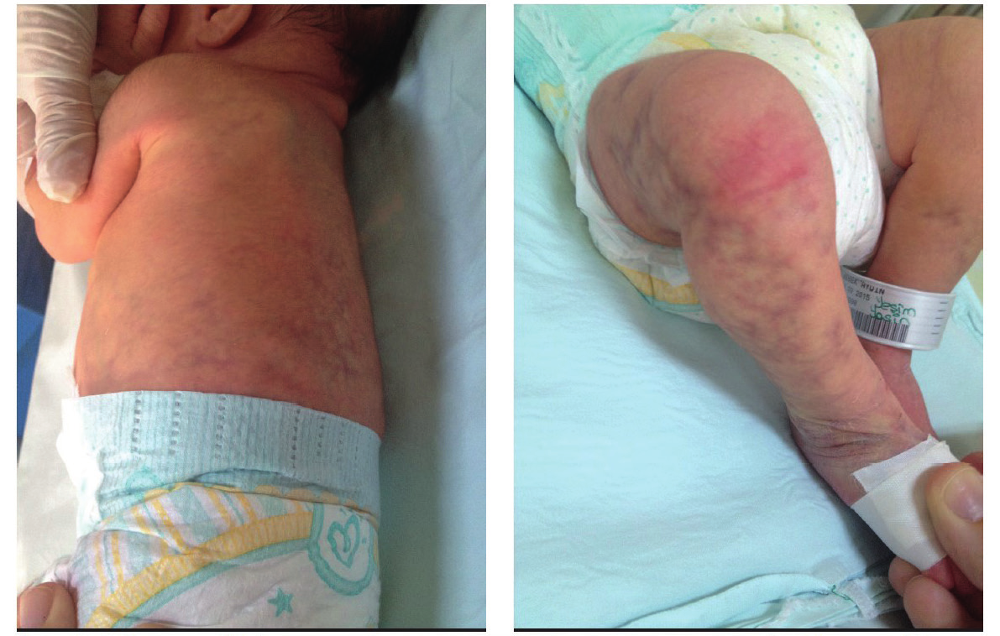

**Strialar:** Normal derinin aşırı ve sürekli gerilmesi sonunda epidermis altındaki kutisin retiküler tabakasındaki elastik liflerde kopma, yırtılma ve sonunda skar oluşumu ile ortaya çıkarlar. Cushing sendromu, gebelik sonrası, obezitede, aşırı kilo alımına sekonder gelişebilir.

**Skar izleri:** Yanıklar, cerrahi girişimler, travmalar sonrası gelişebilir.

### Cilt Lezyonları ve Enfeksiyon Hastalıklarına Özgü Döküntüler

Sistemik hastalıkların ve lokal deri hastalıklarının cilt lezyonları görülebilir (akne, fronkül, antraks, uyuz, ürtiker, sedef, cafe au lait lekeleri gibi).

* **Suçiçeği:** Papülo-veziküler görünüm
* **Kızamık:** Koplik lekesi
* **Kızıl:** Tavuk derisi görünümü, toplu iğne başı şeklinde maküler görünüm
* **Tifo:** Karında 1-2 mm çapında basınca kaybolan, **taş rose** adı verilen pembe lekeler
* **Zona (herpes) zoster:** Karnın bir yarısında, bir duyusal segment boyunca multiple veziküller görülür. Aynı zamanda o bölgede 3-4 gün öncesinden başlayan yanma, ağrı ve hassasiyet vardır.

---

## 2. OSKÜLTASYON

Diğer sistem muayenelerinden farklı olarak karın muayenesinde inspeksiyondan sonra oskültasyon gelir. Amaç palpasyon veya perküsyon ile bağırsak seslerini artırmamaktır.

### Bağırsak Sesleri

Göbeğin sağ alt kısmından veya dört kadrandan yaklaşık **1 dakika** kadar dinlenir. Normalde dakikada **4-6 ses** duyulur.

* Bağırsak obstrüksiyonunda, gastroenteritte → bağırsak sesleri **artar** ↑. Gurlama veya garguyman duyulur.
* Paralitik ileus, peritonit veya batın cerrahisi sonrası ilk 2 günde → bağırsak seslerinde **azalma** veya **kayıp** ↓
* Peritonitte önce bağırsak sesleri artar, sonra azalır ve hatta kaybolabilir.

### Diğer Oskültasyon Bulguları

**Borborigmus:** Bağırsak seslerinin dışarıdan duyulacak şekilde şiddetli olmasıdır. İshalde, gastrointestinal sistem kanamalarında ve obstrüksiyonlarda duyulabilir.

**Klepotaj (Çalkantı sesi):** Mide içeriğinin pilor stenozu gibi pilor darlığına sebep olan durumlarda mide duvarına çarpması sonrasında duyulan sestir.

**Cruveilher-Bamgharten sendromu:** Umblikus üzerinden steteskop ile dinlendiğinde üfürüm alınıyor ise umblikal venin konjenital olarak açık kalmış olabileceği düşünülmelidir. Normalde doğumdan sonra ilk 3 ay içerisinde kapanması gereken umblikal venin portal hipertansiyon nedeniyle rekanalize olması durumudur.

**Yutma sesi:** Normalde lokma veya bir yudum su yutulduktan 5-6 saniye sonra özefagus alt ucunda çift yutma sesi duyulur. Özefagusta darlık veya tıkanma varsa ilk ses hafif veya hiç duyulmaz; ikinci ses ise 15 saniyeden daha geç ve hafif duyulur.

**Abdominal üfürümler:** Abdominal arter anevrizmalarında, renal arter stenozunda, arteriovenöz fistüllerde, karaciğer veya diğer solid organ hemanjiomlarında duyulabilir.

---

## 3. PALPASYON

Hasta sırt üstü yatar, ellerini yanlarına uzatır ve iki dizini karnına çeker. Hastanın başının altında en fazla bir yastık olmalıdır.

**Palpasyon kuralları:**

* Palpasyon sırasında el ve ön kol aynı hizada olmalıdır.
* Palpasyon elin en hassas bölgeleri olan el ayası ve elin ulnar yüzü ile yapılır.
* Eller soğuk, ıslak ve tırnaklar uzun olmamalıdır.
* Hekim sağ elini kullanıyorsa hastanın sağından, sol elini kullanıyor ise solundan muayene etmelidir.
* Palpasyon öncesi karında ağrıyan bir bölge varsa hastanın göstermesi istenmelidir. ⚠️ Ağrıyan bölge en son palpe edilmelidir.

Yüzeyel ve derin palpasyon olmak üzere iki çeşit palpasyon vardır. Palpasyon önce yüzeyel yapılmalı, sonra derin palpasyona geçilmelidir. Palpasyonun amacı ağrılı noktaları, organomegalileri, batın içi kitleleri, derialtı kist, nodül, apse veya kitleleri tespit etmektir.

### 3.a. Yüzeyel Palpasyon

Bir elin ayası karın üzerinde en fazla **0.5-1 cm** bastırılarak hafifçe gezdirilir. Eğer ağrıyan veya şüpheli bir bölge yok ise ingüinal bölgeden başlayarak, hastanın solunum hareketinin olmadığı zamanlarda kosta yayına doğru yavaş yavaş ilerleyerek, solunum hareketinin olduğu dönemde durarak palpasyon gerçekleştirilir.

**Cornett manevrası:** Yüzeyel palpasyon ile palpe edilen bir kitlenin karın derisinde mi yoksa batın içinde mi olduğunu anlamak için yapılır. Hastanın başından tutularak 45 derecelik açı ile doğrulması söylenir; eğer kitle kaybolursa (rektus kası kitleyi örttüğü için) batın içinde, kaybolmaz ise karın cildinde olduğu düşünülür.

**Diyastasis rekti:** Ksifoid altında göbeğin üstünde rektüs kası fasiasının ayrılmasıdır. Klinik önemi yoktur. Hasta yatar pozisyondan oturur pozisyona geldiği sırada ksifoid ve umblikus arasında şişkinlik gözlenir.

**Deri turgoru:** Normalde karın derisi çimdiklendiğinde buruşup kalmaz, hemen eski haline gelir. Ancak dehidratasyonda çimdiklenme sonrasında buruşup kalır, normale gelmesi uzun sürer.

**Krepitasyon:** Karın derisi ve altındaki tabakalarda hava kabarcıklarının toplanmasına bağlı olarak kar üstüne basan bir ayağın çıkardığı çıtırtı sesi alınırsa buna krepitasyon denir. Pnömoperitoneum, cerrahi veya travma sonrası yaralanmalarda, kosta kırıklarında, gazlı gangrende görülebilir.

**İstemli - istemsiz defans ayırımı:** Yüzeyel palpasyon sırasında hastanın ellerini kullanmadan yattığı yerden doğrulması istenir; bu doğrulma sırasında ağrı hisseder ise istemsiz patolojik defans olduğu düşünülmelidir. Enfeksiyonlar, peritonit, akut apendisit ve bağırsak perforasyonlarında istemsiz defans görülür.

**Venöz akım yönü tespiti:** Normalde göbek altındaki venlerde akım aşağı, göbek üstü venlerde ise yukarı doğrudur. Vena kava süperior tıkanıklığında akım aşağı, vena kava inferior tıkanıklığında ise yukarıya doğru döner. Kan akım yönünü tespit etmek için iki parmak ile damarın bir noktasına bası yapılır. Parmaklardan biri damar üzerinde kaldırılmadan damarı sıvazlar tarzda diğer parmaktan uzaklaştırılır ve iki parmak arasında damarın görülmediği sırada parmaklardan biri kaldırılır. Eğer damar belirginleşiyor ise akım diğer parmağa doğrudur; eğer damar belirginleşmiyor ise akım kaldırılan parmağa doğrudur.

### 3.b. Derin Palpasyon

Sağ elin ayası karın üzerine temas ettirilir, parmaklar yüzeyel palpasyondan daha derin (**> 1 cm**) bastırılarak dairesel hareketlerle tüm karın, kasıklardan kot altına kadar taranır.

Derin palpasyon sırasında araştırılması gerekenler:

* Karında ağrı olup olmadığı ve karın topografisine göre hangi organ ile ilişkili olabileceği
* Organomegali var ise organın kıvamı, kontürleri, ağrılı olup olmadığı
* Kitle varsa şekli, lokalizasyonu, boyutları, mobilitesi, derinliği, pulsasyon verip vermediği

### Derin Palpasyon Bulguları

**Direk hassasiyet:** Palpasyonun yapıldığı yerde hissedilen ağrı.

**Defans:** Palpasyon sırasında karın kaslarının istemli veya istemsiz olarak kasılmasıdır. Çocuk ağrıyan bölgeyi gösterebiliyor ise muayeneye tarif edilen bu bölgeye en uzak yerden başlanmalıdır. Akut batını ekarte etmek için rebaund ve rovsing bulguları aranmalıdır.

**Rebaund:** Karında ağrılı bölgeye basılan elin aniden kaldırılması ile o bölgede ağrının daha şiddetli hissedilmesidir. Bu **peritonit** bulgusudur.

**Rovsing bulgusu:** Sağ alt kadrana basılması ile sol alt kadranda ağrı hissedilmesidir. Apandisite ve peritonite işaret eder.

**İndirek rebound (Blumberg belirtisi, Tepki ağrısı):** Karın içinde peritonu etkileyen bir iltihap varsa (örneğin serozaya yayılmış apandisitis) bu bölgenin karşı tarafındaki bölgeye parmak ucuyla diklemesine baskı yapılır ve sonra el birdenbire kaldırılırsa, hasarlı bölgede şiddetli ağrı duyulur.

**Sarsıntı hassasiyeti (Markle bulgusu, Topuk testi):** Hasta dizlerini bükmeden ayakta dururken ayak parmakları üzerinde yükselir, sonra aniden topukları üzerine kendini bırakarak tüm vücudunun sarsılması-titremesini sağlar. Akut apandisit, apseler, intraabdominal organların infarktüsü, akut divertikülit, regional ileitis, pelvik inflamasyon gibi peritoneal irritasyon yapan olaylarda bu manevra sonrasında şiddetli ağrı olur.

**Balotman (Ballottment):** Batın içinde yaygın serbest sıvı varsa karaciğer, dalak ve kitlenin el ile palpasyonu mümkün olmaz. Ancak balotman ile muayene edilebilir. Sağ elin parmakları ile kitleden şüphelenilen karın bölgesine yukarıdan aşağıya doğru derince, hızlı hızlı vurularak karın duvarı itilir. Böylelikle kitle veya organlar aşağı yukarı hareket eder ve hekimin parmak uçlarında hissedilir.

### Karında Özel Noktaların Palpasyonu

#### Pankreas Noktası

Göbekten orta çizgiye 45° bir açıyla sağ tarafa doğru bir çizgi çizilir. Sonra orta çizgide göbekten 4 ve 6 cm uzaklıktaki iki nokta işaretlenir. Bu noktadan sağdaki çizgiye dikey olarak indirilen iki çizgi arasında kalan bölge **duodenum-koledok-pankreas bölgesi** olarak tanımlanır.

Bu bölgede koledok (koledokta taş, kolanjit), pankreas (pankreatit, pankreas başı tümörleri) ve duodenum (duodenal ülser, kanser) hastalıklarında basmakla ağrı hissedilir.

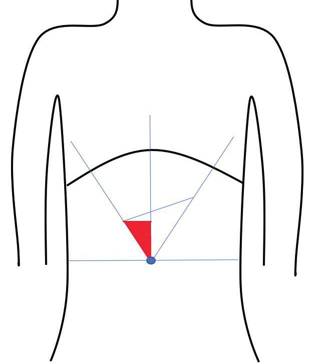

#### Safra Kesesi Noktası (Murphy Noktası)

Sağ kosta yayı ile sağ rektus kasının kesiştiği yere rastlayan bu nokta, safra kesesinin hastalıklarında (kolesistit, kolelitiazis, kolanjit) basmakla hassastır.

#### Apandiks Noktası (McBurney Noktası)

Göbeği sağ spina iliaca anterior superiora birleştiren hayali çizginin dış 1/3 kısmın kesiştiği noktadır. Akut apandisitte hassastır.

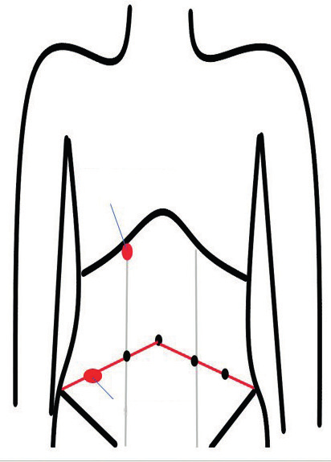

#### Lanz Noktası

Spina iliaca anterior superiorlar arasını birleştiren çizginin sağ rektus kasının dış kenarını veya belli değilse klavikula orta çizgisini kestiği yerdir. Pelvik yerleşimli apendikste ve orta üreter taşlarında bu nokta ağrılı palpe edilebilir.

#### Obturator Belirtisi

Apandisitten şüphelenilen büyük çocuklarda sağ uyluk fleksiyon halinde iken uyluğa içe ve dışa rotasyon hareketleri yaptırılır. Eğer obturator kas ile irtibatlı bir inflamasyon var ise hasta şiddetli ağrı hissedecektir. Bu test pelvik apandisit, pelvik hematom veya apse durumlarında ağrılı olur.

#### İleopsoas Testi

Retroçekal apandisitten şüphelenilen hastalarda değerli bir muayene bulgusudur. Hasta bacaklarını uzatmış durumda iken hekim sağ fossa iliaca'ya bastırır. Aynı zamanda hastadan sağ uyluğunu bükmesi istenir. Bu durumda psoas kası kasılırken hasta ağrının arttığından şikayet ederse test pozitiftir.

#### Overin Ağrılı Noktaları

Her iki inguinal bölgeye basmakla overlerin iltihabi veya tümöral hastalıklarında ağrı meydana getirilebilir.

#### Üreterlerin Ağrılı Noktaları

Her iki üreter trasesi boyunca hassasiyet aranır.

#### Böbreklerin Ağrılı Noktaları

Böbrek veya pelvis renalis taşlarında veya akut pyelonefritte kosto-lomber açıya elin ulnar kenarı ile vurmakla ağrı hissedilir.

**⚠️ ÖNEMLİ:** Organomegalileri tespiti için palpasyon ingüinal bölgeden başlanarak yukarıya doğru yapılır. Kot altına varınca ksifoide doğru ilerlenir. Böylelikle karaciğer sol lop hipertrofisi, splenomegali, gezici dalak ve böbrek gibi organ anomalileri de atlanmamış olur.

---

## 4. PERKÜSYON

Karın muayenesinde karaciğer, dalak gibi organların sınırlarını belirlemede, organomegalinin tespitinde, batın içi kitle, asit ve gaz varlığının tespitinde perküsyon önemli bir muayene yöntemidir.

Karın cildine yerleştirilen sol elin orta parmak 2. falanksına sağ elin orta parmağı çekiç gibi kullanılarak yapılan vuruşlar ile gerçekleştirilir.

* Batında normalde **timpanik ses** alınır.
* Asit, kitle ve karaciğer, dalak gibi organların olduğu bölgelerde **matite** alınır.
* Perküsyon ksifoitten başlanarak pubis ve kasıklara doğru ışınsal tarzda yapılır. Matite tespit edilen bölgeler işaretlenir.
* Batın içinde serbest sıvı varlığında → açıklığı yukarı bakan matite alınır.
* Dama tahtası şeklinde matite → tüberküloz peritoniti düşünülmelidir.

> 💡 Eğer hastada asitten şüpheleniliyor ancak sırt üstü yatar pozisyonda perküte edilemiyorsa, hasta hafif yan çevrilip ya da diz-dirsek pozisyonuna getirilerek perküsyon yapıldığında batın içinde az miktarda sıvı olsa dahi tespiti mümkün olabilir.

---

### 4.a. Karaciğer Muayenesi

Karaciğer boyutunun fizik muayene ile değerlendirilmesinde karaciğerin alt ve üst sınırının bilinmesi önemlidir.

**Üst sınırın belirlenmesi:** Midklavikular hat üzerinden kot aralıkları boyunca aşağıya doğru perküsyon yapılır. Karaciğer matitesi genellikle anterior **5. interkostal aralıkta** başlar ve sağ kostal yayın alt sınırına kadar devam eder.

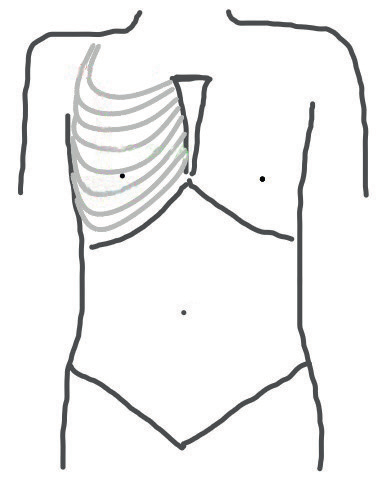

**Alt sınırın belirlenmesi:** Sağ ingüinalden başlayarak sağ kot altına ve oradan ksifoide doğru ilerleyerek palpasyonun yapılması ile karaciğer muayenesi tamamlanır.

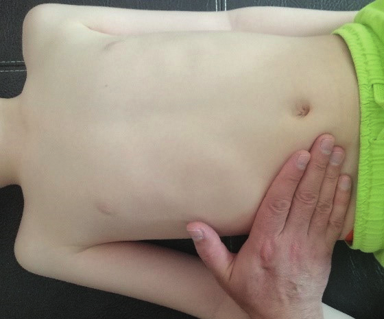

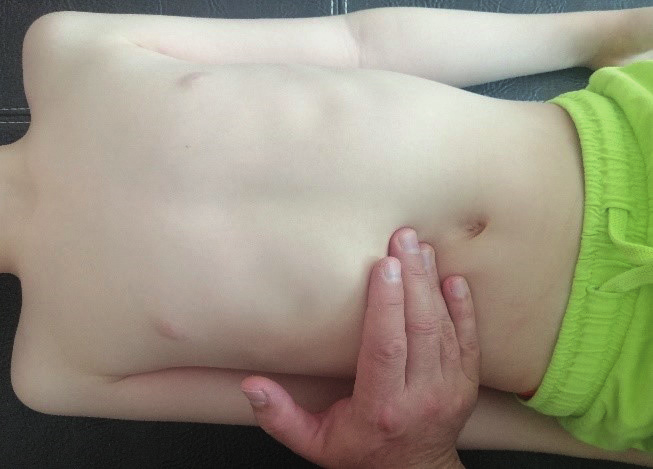

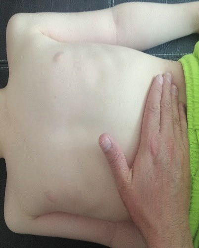

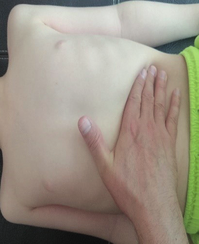

Karaciğer inspiryumda 1-3 cm aşağıya doğru hareket eder. Karaciğerin:

* Yenidoğan döneminde **3 cm**
* Bebeklik döneminde **2 cm**
* Çocukluk boyunca **1 cm** ve altında palpe edilmesi kabul edilebilir.

#### Hepatomegali Yapan Hastalıklar

| Kategori | Alt Grup | Hastalıklar |
|---|---|---|
| Enfeksiyonlar ve İnflamasyonlar | Hepatitler - Viral | HAV, HBV, HCV, HIV, CMV, EBV |
| | Hepatitler - Bakteriyel | Karaciğer absesi, posttravmatik, postoperatif komplikasyonlar |
| | Hepatitler - Paraziter | Amip absesi, kist hidatik, fasioliazis, kalaazar, malarya |
| | Hepatitler - Diğerleri | Leptospirozis, aktinomikozis |
| | Granülomatoz hastalıklar | Sarkoidozis, tüberküloz, bruselloz, histoplazmozis |
| | Toksik | Parasetamol, antiinflamatuvarlar, mantar |
| | Otoimmun | Otoimmun hepatitler |
| | Otoimmun kolanjitler | Primer, sekonder sklerozan kolanjit |
| Hemolitik anemiler | | Otoimmun hemolitik anemiler, eritrosit membran defektleri, hemoglobinopatiler (orak hücreli anemi) |
| Kalp hastalıkları | | Konjenital kalp hastalıkları, kalp yetmezlikleri, konstriktif perikarditler |
| Safra yolu hastalıkları | | Biliyer atrezi, Caroli hastalığı, koledok kistleri, konjenital hepatik fibrozis, Alagille sendromu |
| Vasküler hastalıklar | | Budd-Chiari sendromu, veno-oklüziv hastalık |
| Metabolik hastalıklar | Karbonhidrat metabolizması | Galaktozemi, herediter früktoz intoleransı, glikojen depo hastalıkları (Tip-1, III, IV, VI, IX) |
| | Aminoasit metabolizması | Tirozinemi, üre siklus defektleri |
| | Lizozomal depo hastalıkları | Mukopolisakkoridozlar (Hunter sendromu), lipidozlar (Niemann Pick, Gaucher hastalığı), glikoprotein hastalıkları |
| | Diğer metabolik | Progresif ailesel intrahepatik kolestaz (PFİC Tip-1, 2, 3), amiloidozis, hemokromatozis, porfiria, Wilson hastalığı |
| Tümörler ve kistler | | Hemanjiom, hepatoma, hepatoselüler kanser (HCC), hepatoblastoma, metastazlar (lösemi, lenfoma), karaciğer kistleri |
| Sistemik hastalıklar | | Obezite (steatoz, steatohepatit), diabetes mellitus, kistik fibrozis, malnütrisyon, sepsis, vitamin A toksisitesi |

#### Karaciğer Palpasyon Bulguları

* Palpe edilen karaciğer staza bağlı olarak **ağrılı** olabilir.
* Karaciğerin kontürlerinin düzenli olması, kıvamının yumuşak olması → karaciğer konjesyonu, akut hepatit
* **Siroz:** Karaciğer küçülür ve genellikle sol kompansatuar olarak büyür; sert kıvamda, kontürleri düzensiz ve lobüle ele gelir.
* **Depo hastalıkları:** Karaciğer-dalak masif büyümüş ve sert kıvamda ele gelir.

**⚠️ ÖNEMLİ:** Karaciğer, komşu yapılardan ve anatomik değişikliklerden etkilenir. Bu nedenle pnömotoraks, perihepatik apse, retroperitoneal kitle, kronik obstrüktif akciğer hastalığı, pectus ekscavatum, daralmış kostal açılar, pitotik karaciğer, Reidel lobu gibi durumlarda karaciğer normal boyutlarda olsa da büyümüş olarak algılanabilir. Bu nedenle karaciğerin **üst sınırının belirlenmesi** önemlidir.

---

### 4.b. Dalak Muayenesi

Dalak normalde palpe edilmez. Sol ingüinal bölgeden başlayarak sol kot altına ve ksifoide kadar palpasyona devam edilmelidir. Dalak orta koltuk altı çizgisi üzerinde **9. ve 11. kostalar** arasında perküte edilebilir. Ancak ön koltuk altı çizgisini geçmez. Bu nedenle dalak muayenesinde **Traube alanı** önemlidir.

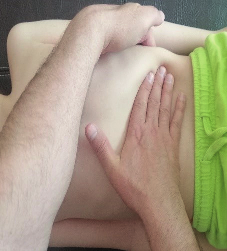

#### Traube Alanı

> **Traube alanı:** Ön aksiller çizgi, sol kosta yayı ve ksifoitten ön aksiller çizgiye dik olarak uzanan horizontal çizginin arasında kalan bir dik üçgendir.

Normalde bu üçgen içerisinde perküsyon ile **timpan ses** alınır. Ancak dalak büyüdüğünde bu üçgen dalak ile dolacağından **mat ses** alınır. Bu duruma **traube kapalı** denir.

Dalak kot altında palpe edilirse ve/veya ön aksiller çizgiyi geçerse ve traube kapalı ise dalak büyümüş demektir.

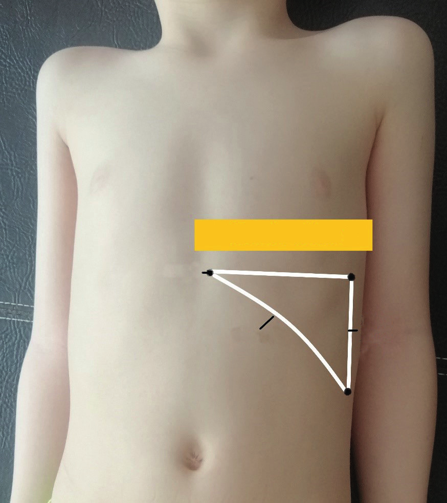

**Dalak palpasyonu yaşa göre normal değerler:**

* Yenidoğanların **%30**'unda kot altında palpe edilebilir.
* 6 aydan küçük infantların **%15**'inde kot altında palpe edilebilir.
* Daha sonraki yaşlarda sol kostanın 1 cm altında palpe edilmesi dalağın büyüdüğünü gösterir.
* Tokluk, sol alt lop pnömonisi ve o bölgedeki batın içi kitlelerde Traube bölgesinde matite alınabilir.
* Sol akciğerde pnömotoraks varlığında ise dalak büyümüş olmasına rağmen Traube açık algılanabilir.

#### Splenomegali Yapan Hastalıklar

| Kategori | Alt Grup | Hastalıklar |
|---|---|---|
| Enfeksiyonlar | Akut | Enfeksiyöz mononükleoz, viral hepatitler, sepsis, tifo, CMV, toxoplasma |
| | Subakut/kronik | Tüberküloz, endokardit, brucellozis, sifiliz, HIV |
| | Paraziter/tropikal | Malarya, leismaniasis, shistozomiyazis |
| Hematolojik hastalıklar | Myeloproliferatif | Myelofibrozis, kronik miyeloid lösemi, polistemia vera, trombositozis |
| | Lenfoma/lösemi | Non Hodgkin lenfoma, Hodgkin lenfoma, akut lenfositik lösemi, kronik lenfositik lösemi, hairy cell lösemi, polilenfositik lösemi |
| | Konjenital | Herediter sferositozis, herediter eliptositozis, orak hücreli anemi, talasemi majör |
| | Hemolitik | Otoimmun hemolitik anemiler, Rh uyuşmazlığı, ABO uyuşmazlığı |
| | Diğer | Megaloblastik anemiler, hemanjiomlar, metastatik tümörler |
| Portal hipertansiyon | Konjestif | Siroz, splenik/hepatik/vena cava inf./portal ven trombozu, konjestif kalp yetmezliği |
| İnflamatuar | Kollajen doku | Sistemik lupus eritematozus, romatoid artrit |
| | Granülomatoz | Sarkoidoz |
| İnfiltratif | | Gaucher hastalığı, amiloidozis |
| Diğer | | Kistik hastalıkları |

---

### 4.c. Böbrek Muayenesi

Böbrek retroperitoneal bir organdır, bu nedenle normalde palpe edilmezler. Ancak zayıf kişilerde, çok doğum yapmış kadınlarda, pitotik böbrekte ağrısız olarak palpe edilebilir.

**Palpe edilebilen böbrek durumları:**

* Hidronefroz, hiperplazi, tümör, polikistik böbrekler, soliter kistleri olan normalden büyük böbrekler → değişik sertlikte palpe edilebilir.
* Palpe edilen bir böbrek genellikle mobildir; iltihap veya tümöral yayılma ile fikse olabilir.
* Çok pitotik mobil bir böbrek periton arkasında aşağı-yukarı ve sağa-sola hareket gösterebilir → **gezici böbrek**
* Pitotik böbrekler ayakta daha kolay palpe edilir.
* Konjenital bir anomali olan **at nalı böbrek** promontorium üzerinde sabit ay şeklinde bir kitle olarak palpe edilebilir.

#### Böbrek Palpasyon Tekniği

Küçük çocuklarda tek elle yapılırken, büyük çocuklarda iki elle yapılması gereken bir muayenedir.

**Guyon metodu:** Solda sol el, sağda sağ el kosto-lomber açıdan böbreği öne doğru iterken, diğer el hipokondriumdan derin palpasyon yapar ve böbreğin fiziki özellikleri iki el arasında anlaşılmaya çalışılır.

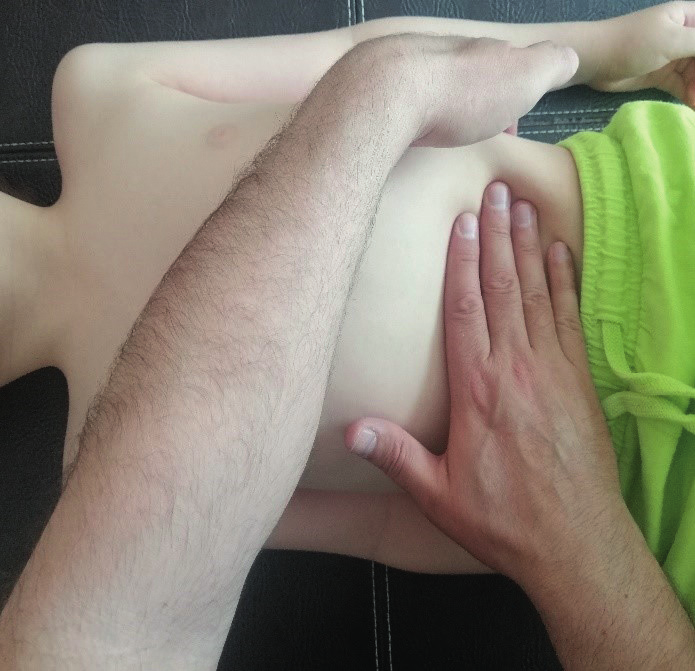

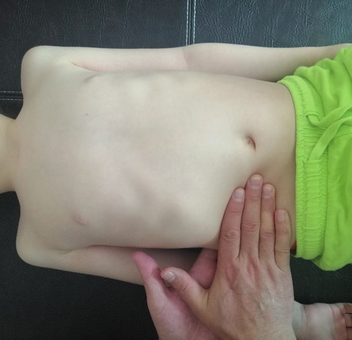

Böbrek ağrısı arkada kosto-lomber bölgede duyulur, yayılışı kasığa ve genital bölgeye doğrudur. Elin ulnar kenarı ile kosto-lomber bölgeye vurulduğunda ağrı duyuluyor ise, ağrının böbreğe ait olduğu düşünülmelidir.

---

## SONUÇ

Çocuk hastalarda anamnez ve fizik muayenenin yapılması zordur. Ancak öğrenilmesi hastanın tanı ve tedavisi için çok önemlidir. Bu nedenle çocuk hastalarda diğer sistem muayenelerinde olduğu gibi gastrointestinal sistem muayenesini yapabilme ve değerlendirme becerisinin kazanılması için öğrencilik döneminde sık sık pratik yapılmalıdır. Böylelikle anamnez ve fizik muayenede tespit edilen pozitif bulgular üzerinden ayırıcı tanıya gidebilme becerisi kazanılacaktır.
