# GENİTOÜRİNER SİSTEM MUAYENESİ

**Hazırlayan:** Doç. Dr. Dilek Yılmaz
**Bölüm:** Çocuk Sağlığı ve Hastalıkları

---

Genitoüriner sistem (GÜS) muayenesi, düzgün ve tam yapılmış fizik muayenenin bir parçasıdır. Her rutin poliklinik kontrolü ve fizik muayenede genitoüriner sistem muayenesi yapılmalıdır. Ancak, aile, çocuk ve adölesan genital muayene yapılacağında huzursuz olup, genelde yapılmasını istemezler. Bu sebeple, genitoüriner sistem muayenesi öncesi, hasta ve aile muayeneye hazırlanmalı ve yapılacak işlemle ilgili bilgi verilmelidir. Ayrıca, muayene sırasında çocuğun annesi veya hemşire üçüncü kişi olarak muayeneye eşlik etmelidir.

---

## GENEL GÖRÜNÜŞ

Muayene sırasında çocuğun genel görünüşünün (örneğin büyüme geriliği açısından boy ve kilonun) değerlendirilmesi önemlidir. Özellikle, kronik böbrek hastalığı (KBH), kronik idrar yolu enfeksiyonu, diabetes insipitus ve renal tübüler asidoz (RTA) hastalarında büyüme geriliği önemli bir ipucudur. Kronik böbrek hastalarında, anemiye bağlı solukluk veya üremiye bağlı sarımtırak bir renk görülür. Hematüri veya proteinüri için değerlendirilen çocukta; alopesi ve malar rash varlığında sistemik lupus eritematozis (SLE) akla gelmelidir.

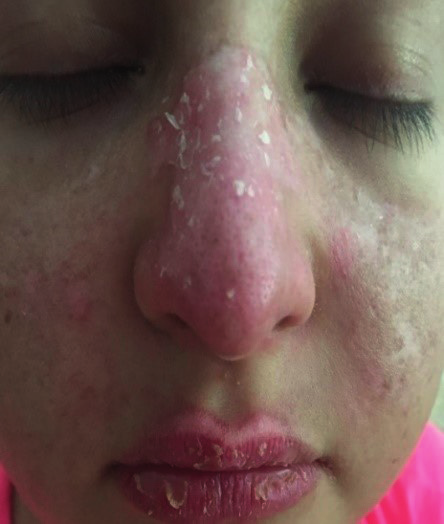

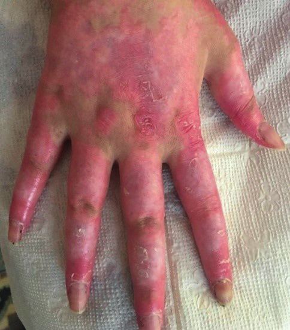

Alt ekstremite veya gluteal bölgede palpabl purpurası olan hastada beraberinde artralji, artrit, karın ağrısı ve/veya hematüri, proteinüri varlığında **IgA vaskuliti** düşünülmelidir. Yüzde, burun etrafında kelebek şeklinde adenoma sebaseumda **tüberoskleroz** akla gelmeli ve eşlik edebileceği renal tümörler açısından hasta değerlendirilmelidir. Son olarak, nörofibrom veya cafe-au-lait lekeleri olan ve beraberinde hipertansiyon (HT) olan çocuklarda, **renovaskuler HT** ve **feokromasitoma** tanıları düşünülmelidir. Ayrıca, diğer ciltle ilgili sorunlar (peteşi, purpura, vezikül, cafe-au-lait lekesi, hipo-hiper pigmentasyon, döküntüler vs) böbrek ve GÜS patolojisi olan çocukların muayenesinde karşımıza çıkabilir.

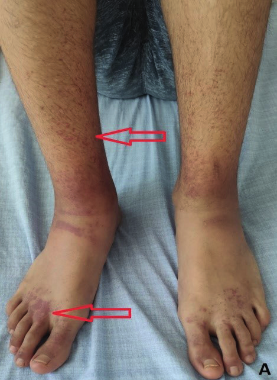

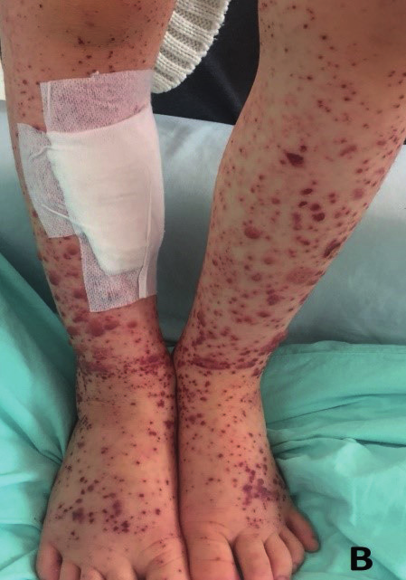

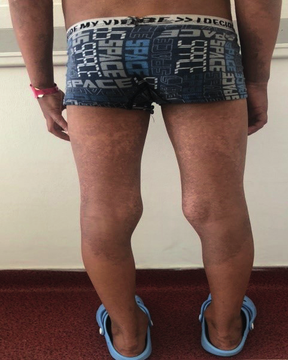

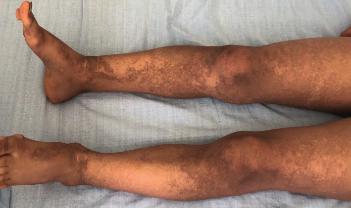

Obez çocuklarda, yüksek kan basıncı görülebileceği unutulmamalıdır. Kan basıncı ölçümü, rutin muayenenin bir parçası olup, yaş, cinsiyet ve boya göre en az 2 farklı ölçümde sistolik ve/veya diyastolik kan basıncının **>95 persentil** olması **hipertansiyon** olarak tanımlanmaktadır. Hidrasyon durumu ve ödem muayenede dikkatle incelenmelidir.

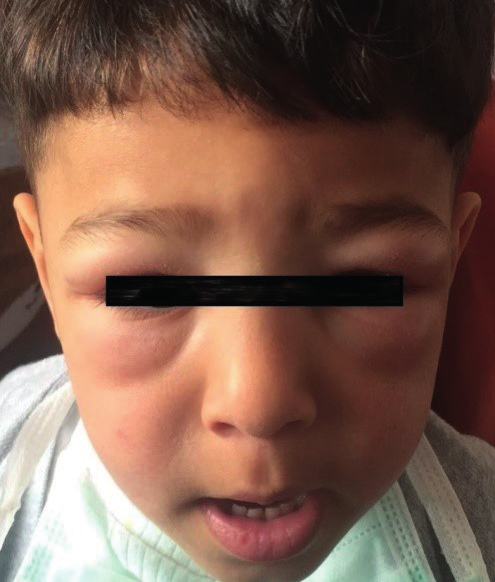

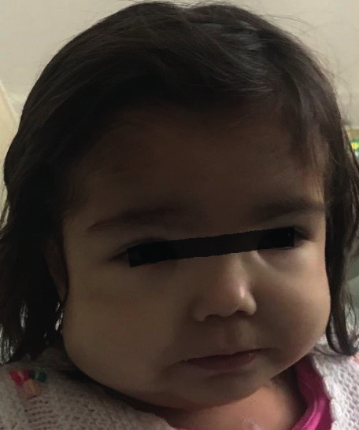

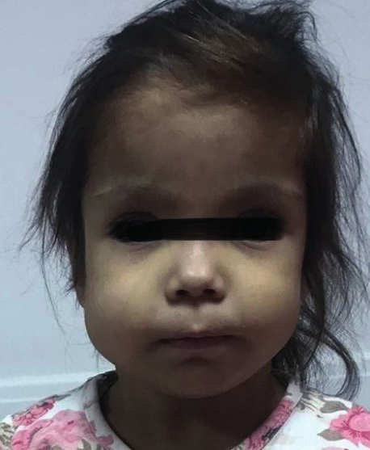

### Yüz Anomalileri ve Konjenital Renal Anomaliler

Yüz anomalilerinde, dış kulak ile ilgili malformasyonlar ve preavrikuler çukur (genelde proteinüri) varlığında, konjenital renal anomaliler araştırılmalıdır. Ayrıca, yenidoğan bebekte, **tek umblikal arter %27 vakada GÜS anomalileri ile beraberdir.** Yine erkek çocuklarda görülen laks abdominal kaslar veya abdominal kas yokluğu; **Prune-belly sendromunu** (bilateral kriptorşidizm, abdominal kas yokluğu, üst üriner sistemde kompleks malformasyonlar) destekler.

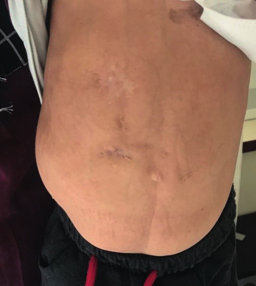

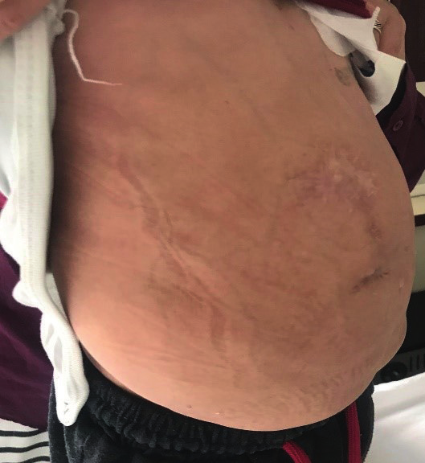

Birçok genetik sendrom, renal anomalilerle birlikte olup, bu sendromlarda hasta renal anomali açısından araştırılmalıdır. Aniridi, hemihipertrofi ve ambigus genitalyada **Wilms tümörü** görülebileceği unutulmamalıdır. Konjenital kalp hastalıklarından, özellikle ventriküler septal defekt (VSD) renal anomalilerle beraberdir. Ayrıca, gastrointestinal sistem anomalileri (imperfore anüs, özofagus veya anal atrezi) ve vertebra anomalileri de renal anomalilerle birlikte görülebilir.

**VACTERL sendromu:** Vertebra anomalisi, anal atrezi, kardiyak anomali, trakea-özofageal anomali, renal anomali ve ekstremite anomalileri.

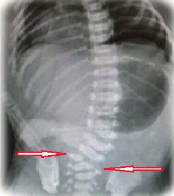

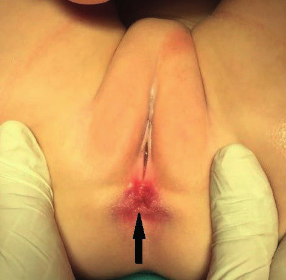

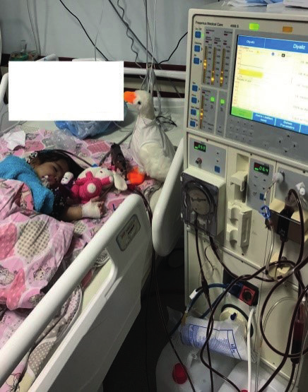

> **Potter sendromu:** Yüzün orta kısmında düzleşme, basık burun, birbirinden uzak göz yapısı, düşük kulak, ayakta clubbing, pulmoner hipoplazi ve bilateral renal agenezinin görüldüğü hayatla bağdaşmayan bir sendromdur.

---

## ERKEK GENİTALYA

**Penis:** Boyun, glans, korona (taç), meatus (açıklık) ve prepisyumdan (sünnet derisi, ön deri) oluşur. İnfantlarda, prepisyum ile glans arasında iç epiteldeki yapışıklıktan dolayı prepisyum geri çekilememesi **fizyolojik fimozise** neden olur. Yaklaşık 6 yaşında, aralıklı ereksiyona ikincil prepisyum ve glans arasındaki doku tabakalarının ayrılmasıyla üretra ağzı görülür. Erkeklerde üretra açılım yeri glans penisin tam ortasıdır ve üretral meatusun açıklığı 2-3 mm'dir.

**Skrotum ve Testis:** Skrotum, testisleri koruyan torba şeklinde yapıdır. Testislerde, sperm üretimi olur. Prostat bezi, ilk olarak adölesan dönemde elle palpe edilebilir. Pubertenin erkek çocuklarında başlamasıyla, ilk olarak testis ve skrotum büyür, ardından pubik kıllanma gelişir ve son olarak penis büyür.

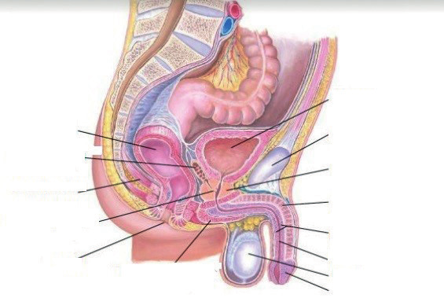

### İnspeksiyon

Hematüri ve piyüri gibi anormal idrar bulguları olan çocukta muayenenin en önemli parçası **eksternal genitalya muayenesidir.** İdrardaki hematüri varlığını açıklamak için, penisin yaralanması, eritem, lezyon ve döküntü varlığı kontrol edilmeli, üretral meatus ülserasyon açısından incelenmelidir. Ayrıca, hastanın sünnetli olup olmadığı muayenede kaydedilmelidir. İdrar yolu enfeksiyonu, sünnetsiz erkek çocuklarında daha fazla görülür.

Prepisyum, sünnetsiz bebeklerde ve küçük çocuklarda, genellikle altı yaşına kadar sıkı olması nedeni ile fizik muayenede geri çekilemez (**fizyolojik fimozis**). Geri çekmeye zorlanırsa, doku hasarlanıp ön deri ile glans arasında yapışıklıklar oluşup, **parafimozis** oluşabilir. Altı yaşından büyük çocuklarda ise prepisyum nazikçe geri çekilebilir.

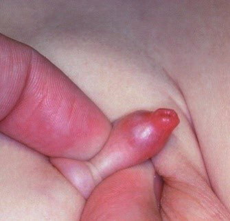

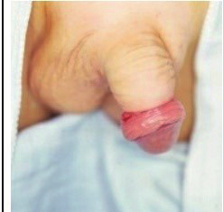

Ayrıca, çocuklarda seksüel taciz açısından muayenede dikkatli olunmalı, travmatik lezyonlar ve anüs muayenesi ayrıntılı incelenmelidir. Muayene sırasında tuvalet eğitimi almış çocuklarda, kilotun ıslak olması enürezis ve İYE açısından, yine dışkı kaçırma (enkoprezis) İYE görülmesi açısından önemlidir.

**⚠️ ÖNEMLİ:**

* Penis boyunun yaşa göre **-2 SDS** altı olması, **mikropenis** olarak tanımlanır.
* Mikropenis saptanan çocuklarda, genetik sendromlar araştırılmalıdır.
* Obez ve adölesan yaş grubundaki çocuklarda penis küçüklüğü şikayetiyle başvurularda, genelde pubik bölgedeki yağ dokusuna gömülmüş normal penis olduğu, gerçek mikropenis olmadığı muayenede saptanır.

Üretranın açılım yeri, farklı üretra ağız açılımları açısından kontrol edilmelidir:

* **Epispadias:** Üretranın penis dorsal kısmına açılması
* **Hipospadias:** Üretranın penis ventral kısmına açılması

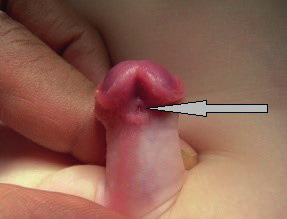

Skrotum, testislerin büyüklüğü ve pozisyonu da incelenmelidir. Ayrıca, **Tanner puberte evrelemesinde** pubik kıllanma miktarı ve dağılımı, penis uzunluğu, testis ve skrotum gelişimi değerlendirilmelidir.

### Palpasyon

İnguinal bölge, lenf nodları ve diğer kitleler açısından palpe edilmelidir. Lokalize enfeksiyonda, palpe edilen lenf nodlarında hassasiyet, ısı artışı veya şişlik olur.

Böbrekler anatomik olarak retroperitoneal yerleştiği için, normalde palpe edilemezler. Sadece, yenidoğan döneminde fizyolojik olarak ele gelebilir. Böbrek palpasyonu, **iki elle veya tost muayenesi yöntemi** ile yapılır. Bir el sırtta diğer el üstten bastırarak, aradaki yapı palpe edilmeye çalışılmalıdır. Sağ ve sol böbrek için ayrı ayrı muayene yapılmalıdır.

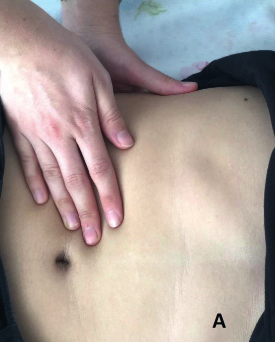

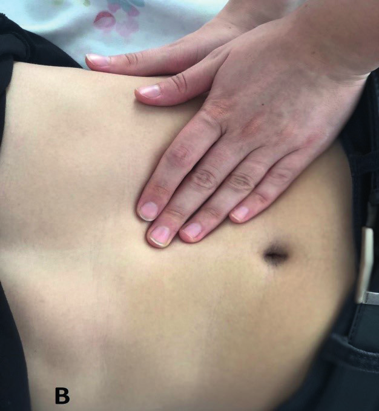

Böbrek lojunda ele gelen kitlelerde aşağıdaki durumlar akla gelmelidir:

* **Kistik renal hastalıklar:** Otozomal dominant polikistik böbrek hastalığı (ODPKBH), otozomal resesif polikistik böbrek hastalığı (ORPKBH), multikistik displastik böbrek
* **Hidronefroz:** Üreteropelvik darlık, nefrolitiazis
* **Renal tümörler:** Wilms tümörü, kistik nefroma, nöroblastoma
* **Renal ven trombozu**

İnfantlarda mesane, simfizis pubis üstünde palpe edilebilirken, büyük çocuklarda normalde palpe edilmez. Palpabl mesanede, **mesane distansiyonu** düşünülmeli ve ultrasonda mesane duvar kalınlığında artış saptanırsa, üretra obstrüksiyonu [**posterior üretral valv (PUV)**] açısından hasta değerlendirilmelidir.

Testis palpasyonu, iki elle nazikçe yapılmalıdır. Bir elle, inguinal kanal sıvazlanmalı diğer el ile skrotumda testis palpe edilmeye çalışılmalıdır. Testislerin büyüklüğü, **orşiometri** ile değerlendirilmelidir.

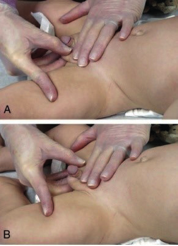

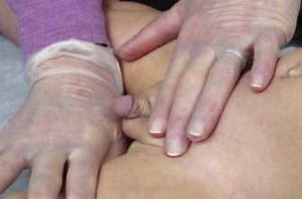

Testisler ile ilgili, palpasyonda saptanabilecek sorunlar **inmemiş testis (kriptorşidizm)**, **herni** ve **hidrosel**dir. İnmemiş testis, tek taraflı veya bilateral olabilir. İnmemiş testisi olan çocuklarda, testis kanseri ve infertilite riski olduğu için, saptanınca hemen çocuk cerrahi ile konsulte edilmelidir. Skrotal hernide, inkarserasyon (boğulmuş) riski olduğundan tanı konduğunda hemen cerrahi ile konsulte edilmelidir. Hidrosel ise prosesus vajinalisten sızan periton sıvısı nedeniyle skrotumda şişlik olması ve ışıkla yapılan **transluminasyon testinde** skrotumda şişlik sebebinin sıvı olduğunun kanıtlanmasıdır. Hidrosel çoğu zaman kendiliğinden düzeldiğinden, genelde cerrahi müdahale gerektirmez.

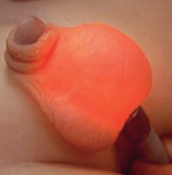

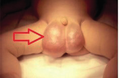

### Erkek Çocuklarda Konjenital Anomaliler

| Anomali | Tanımlama | Konsultasyon |
|---|---|---|
| Mesane ekstrofisi | Mesane arka duvarının eversiyonu (iç kısmın dışa dönmesi) | Çocuk cerrahi veya üroloji (**ACİL**) |
| Ambigus genitalya | Anormal seksüel organlar | Endokrin, genetik, üroloji ve cerrahi |
| Hipospadias | Üretranın penis ventral yüzüne açılması | Çocuk cerrahisi veya üroloji |
| Epispadias | Üretranın penis dorsal kısmına açılması | Çocuk cerrahisi veya üroloji |
| Hidrosel | 
Tunika vajinalisin paryetal ve visseral tabakaları arasındaki periton sıvısının, testis önünde birikmesi
 | 1 yıllık sürede rezolüsyon olmazsa cerrahi tamir yapılmalı |
| Kriptorşidizm | İnmemiş testis | 
Bilateral veya kanalda palpe edilemeyende acil cerrahi Tek taraflı ise 1 yıl içinde cerrahi yapılmalı
 |
| İnguinal herni | Skrotal ve inguinal bölgede şişlik, prosesus vajinalisin obliterasyonunda problem olması | Çocuk cerrahisi |

Cerrahiye konsulte edilmesi gereken erkek genitalya sorunları:

* **Testiküler torsiyon:** Testisin spermatik kord etrafında dönmesi
* **Fimozis:** Ön derinin sıkı olması nedeniyle görülemeyen üretra açıklığı
* **Penil/skrotal kitle**

Suprapubik bölgede, **mesane ekstrofisi** açıkça görülebilir.

---

## DİŞİ GENİTALYA

Kız çocuklarında genital muayene erkek çocuklarınkine benzerdir. Uygun şartlarda, hasta mahremiyetine dikkat edilerek ve çocukta kabul ederse anne refakatinde yapılmalıdır. Muayene, **kurbağa-ayağı** veya **diz-göğüs pozisyonu** şeklinde yapılmalıdır.

Dış dişi genitalyada, labium minus, labium majus, klitoris, üretra ve vajen açıklığı bulunmaktadır. Ayrıca, anüs de muayene edilmelidir. İç dişi genitalya ise, overler ve uterustan oluşmaktadır. Prematürelerde, labium majus labium minusu örtmez. Klitoris belirgindir. Doğumdan sonra ilk 10 gün beyaz-krem rengi salgı veya hafif kanlı vajinal akıntı olabilir. Bu anneden geçen östrojen hormonunun etkisiyle olup normaldir.

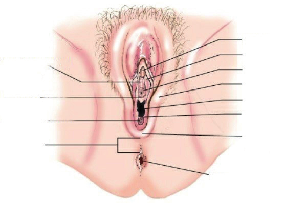

### İnspeksiyon

Mons pubis, labiumlar, renk, döküntü, simetri ve lezyonlar açısından incelenir. Labium minuslerde yapışıklık (**sineşi**) sık görülen ve asemptomatik bir problemdir. Muayenede saptanınca, hasta İYE açısından değerlendirilmelidir. Labial sineşide, başlangıçta östrojenli kremler kullanılır ancak açılmayan olgularda cerrahi olarak küçük bir işlemle açılır.

Ayrıca, infant döneminde **diaper dermatit (bez dermatiti)** sık karşılaşılan bir problemdir. Hafif lezyonlardan, lasere olmuş, enfekte cilt lezyonlarına kadar farklı şekillerde görülebilir. Bu vakalarda, uygun lokal tedaviler verilmelidir.

### Seksüel Farklılaşma Hastalıkları

Seksüel farklılaşma hastalıkları, yenidoğan döneminde **ambigus genitalya** ile tanı alıp, üçüncü merkezlerde multidisipliner takım çalışmasıyla değerlendirilmelidirler.

* **Dişi cinsiyette:** Labiumlarda kısmi füzyon ve kliteromegali → ambigus genitalya
* **Erkek cinsiyette:** Hipospadias ve bilateral kriptorşidizm → ambigus genitalya

### Puberte Gelişimi

Puberte gelişimi kız çocuklarında, **Tanner evrelemesine** göre yapılmalıdır. Tanner evrelemesinde, dişi seksüel gelişimde pubik kıllanma başlangıçta yoktur. Pubertal gelişim sırasında **adrenarş** (pubik ve aksiller kılların gelişimi), **telarş** (meme gelişimi) ile aynı zamanda, yaklaşık 9-10 yaşta başlar. Pubertenin başlamasıyla, yumuşak-düz kıllanma veya hafif kıvırcık kıllar labium majusta çıkar. Seksüel maturasyon tamamlanınca, pubik kıllar koyulaşıp, kıvrıklaşır önce mons pubise daha sonra kalçaya doğru yayılır.

### Palpasyon

İnguinal bölge, lenf nodları ve diğer kitleler açısından palpe edilmelidir. Lokalize enfeksiyonda palpe edilen lenf nodüllerinde hassasiyet, ısı artışı veya şişlik olur.

Böbrekler, anatomik olarak retroperitoneal olarak yerleştiği için, normalde palpe edilemezler. Sadece, yenidoğan döneminde fizyolojik olarak ele gelebilir. Böbrek palpasyonu, **iki elle veya tost muayenesi yöntemi** ile yapılır. Bir el sırtta diğer el üstten bastırarak, aradaki yapı palpe edilmeye çalışılmalıdır. Sağ ve sol böbrek için ayrı ayrı muayene yapılmalıdır.

Böbrek lojunda ele gelen kitlelerde aşağıdaki durumlar akla gelmelidir:

* **Kistik renal hastalıklar:** ODPKBH, ORPKBH, multikistik displastik böbrek
* **Hidronefroz:** Üreteropelvik darlık, nefrolitiazis
* **Renal tümörler:** Wilms tümörü, kistik nefroma, nöroblastoma
* **Renal ven trombozu**

Labium majusler, gonad varlığı veya herni için palpe edilmelidirler. Gonad palpe edilince, testis olarak düşünülmeli ve **seksüel farklılaşma hastalıkları** ayrıntılı araştırılmalıdır.

İdrar retansiyonuyla, **glob vezikale** saptanan çocuklarda nörolojik problem (serebral palsi ya da meningomyelosel) araştırılmalıdır.

---

## PERKÜSYON

Bilateral kostavertebral açı hassasiyeti değerlendirilmelidir. Özellikle, **piyelonefrit** ve **nefrolitiazis** hastalarında açı hassasiyeti pozitiftir.

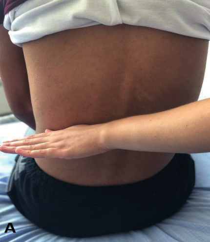

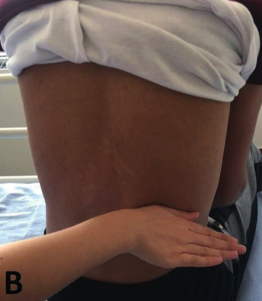

---

## OSKÜLTASYON

Özellikle HT olan çocuklarda, abdominal bölge umblikus sağ ve sol yanı, steteskopla üfürüm varlığı açısından sessiz bir ortamda dinlenebilir. Özellikle **renal arter stenozundan** şüphelenildiğinde değerlendirilebilir. Ancak, abdominal bölgede bağırsak sesleri sebebiyle üfürümün duyulmasının oldukça zor olduğu da unutulmamalıdır.
