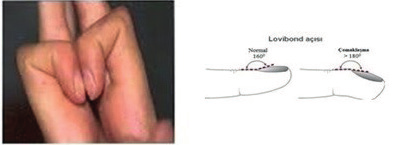
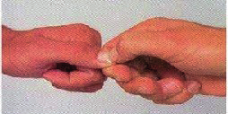
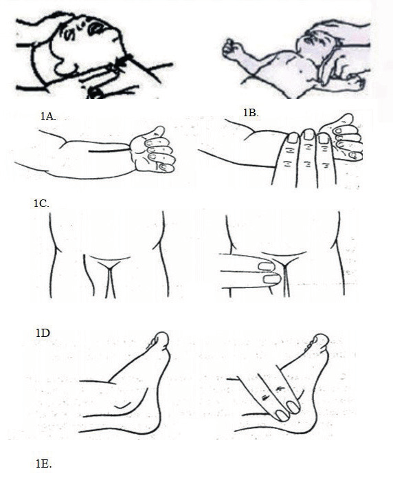
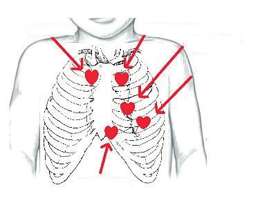
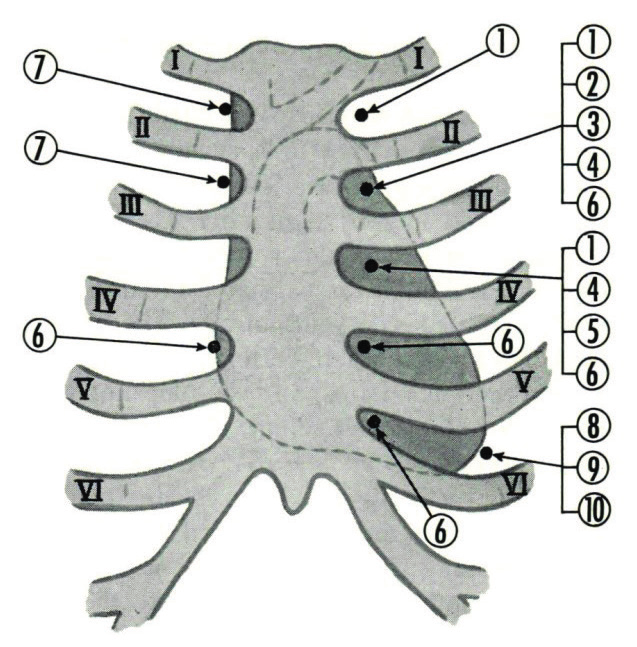

# KARDİYOVASKÜLER SİSTEM MUAYENESİ

**Hazırlayan:** Doç. Dr. Serkan Fazlı Çelik
**Bölüm:** Çocuk Sağlığı ve Hastalıkları

---

Bu bölümde, çocuklarda kardiyovasküler sistem muayenesi için standart bir yaklaşım sunulması hedeflenmiştir. Ancak tüm pediatrik muayenelerde olduğu gibi muayenenin çocuğun yaşına, gelişimine ve eğilimine uygun olmasına dikkat edilmelidir.

---

## AKUT DEĞERLENDİRME

Çocuk kritik hasta ise, detaylı bir öykü almadan önce akut sorunları ele almak gerekebilir. Çocuğun herhangi bir sıkıntı belirtisinin olup olmadığı (solukluk, terleme, siyanoz veya solunum sıkıntısı gibi), genel görünümünün nasıl olduğu, ebeveynleriyle ya da hekimle etkileşimi gözlemlenmelidir.

---

## ANAMNEZ

İyi alınmış bir pediatrik öykü, kardiyovasküler değerlendirme için esastır. Beslenme güçlükleri, büyümede gecikme ve azalan egzersiz toleransı dahil olmak üzere çocuğun genel sağlığı ile başlanmalıdır. Daha büyük bir çocukta, ebeveynden çocuğu aynı yaştaki akranlarıyla karşılaştırmasını istemek bu değerlendirmeye yardımcı olabilir.

Kardiyovasküler hastalığı gösterebilecek spesifik semptomlar arasında **siyanoz, terleme, nefes darlığı, çarpıntı ve ödem** yer alabilir. Göğüs ağrısı ve senkop, çocukluk yaş grubunda nispeten nadir olmakla birlikte, altta yatan kardiyak patolojiyi gösterebilir. Egzersiz sonrası çömelme, **Fallot Tetralojisi** gibi doğuştan kalp hastalığının göstergesi olabilir.

Doğum öncesi dönem hakkında detaylı bilgi alındığından emin olunmalıdır:

* Annenin gebelik döneminde **lityum, fenitoin** gibi ilaçlara ya da alkole maruz kalması, bebekte doğuştan kardiyak hastalıklara yol açabilir.
* **Sistemik lupus eritematozus, diyabet** veya **birincil kızamıkçık** gibi anneye ait hastalıklar da sorgulanmalıdır.
* Erken doğan çocuklar, **patent duktus arteriyozus** riskiyle karşı karşıyadır.
* Soy geçmişte doğuştan kalp hastalıkları veya erken başlangıçlı kardiyovasküler hastalığı olan diğer aile üyelerinin (ebeveynleri, büyükanne, büyükbaba, teyzeleri, amcaları ve kuzenleri gibi) genetik yatkınlık gösteren hastalıkları ve anne-baba arasında **kan akrabalığı** olup olmaması mutlaka sorgulanmalıdır.

Pediatride farklı yaşlardaki ve farklı gelişim aşamalarındaki çocuklarla karşılaşıldığından her çocuğun mahremiyet ihtiyacının bilincinde olunmalı ve buna uygun davranılmalıdır.

---

## GENEL MUAYENE

Herhangi bir fiziksel muayeneye başlamadan önce ellerin uygun şekilde yıkandığından emin olunmalıdır. Doğuştan kalp hastalığı ile ilişkili bir sendromu gösterebilecek herhangi bir **dismorfik özelliğe** dikkat edilmeli ve tüm vücut gözlemlenmelidir. Yaygın örnekler arasında **Trizomi 21, Di George ve Turner sendromu** sayılabilir.

Kalp atış hızı, solunum hızı, kan basıncı, boy, kilo ve 5 yaşın altındaki çocuklar için baş çevresi dahil olmak üzere eksiksiz bilgi edinilmelidir. Kalp atış hızı düzenli ise, 15 saniyede kalp atımları sayılıp 4 ile çarpılabilir. İdeal olarak, kan basıncı dört ekstremitenin hepsinde de ölçülmelidir. Büyümenin yaşa uygun bir grafik üzerinden değerlendirilmesine özen gösterilmelidir.

---

## KARDİYOVASKÜLER SİSTEM MUAYENESİ

Eller ve ayaklar incelenmelidir. Çarpma, kıymık kanamaları veya tırnaklarda diğer anormalliklerin varlığına dikkat edilmelidir. Çocuktan iki işaret parmağını bir arada tutması istenerek; **Lovibond açısına** bakarak çomak parmak varlığı değerlendirilmelidir.

**Kapiller geri dolum zamanı** ise tırnak yatağına bastırıp tekrar pembeleşmeye başladığı zamana kadar geçen süredir. Normali **2 saniyeden kısadır**.

> ⚠️ Sepsis, şok, akut kalp yetmezliği, akut arter tıkanması, kardiyak tamponat, hipotermi, periferik arter travması, periferik vasküler hastalık ve Raynaud sendromu gibi durumlarda kapiller geri dolum zamanı uzar.

Kardiyak anormallikler normalde solunum sıkıntısı olarak kendini gösterebilir. **Taşipne, interkostal veya suprasternal çekilme, burun kanadı solunumu** gibi artan solunum sıkıntısı belirtilerine dikkat edilmelidir. Yenidoğanlarda karın solunumu normaldir ancak büyük çocuklarda beklenmez.

* Sklerada sarılık veya solgunluk için gözlere bakılmalıdır.
* Santral siyanoz belirtileri için ağzın içine, dile ve dişetlerine bakılmalıdır.

**⚠️ ÖNEMLİ:**

* Şiddetli anemi varlığında arteriyel hipoksemi mevcut olsa bile siyanozun görülmeyeceği unutulmamalıdır.

Juguler venöz basınç artışı değerlendirmesi (genelde sağ kalp yetmezliği bulgusu) **8 yaşın altındaki** pediyatrik hastada rutin olarak yapılmamaktadır. Bununla birlikte, daha büyük yaştaki çocuk ve ergenlere uygulanabilir.

### Göğüs Muayenesi

Göğüsün dikkatli muayenesi ve palpasyonu çok önemlidir. Öncelikle göğüs inspeksiyonla aşağıdaki durumlar açısından dikkatle değerlendirilmelidir:

* **Prekordiyal şişkinlik** → sağ kalp büyümesini gösterebilir
* **Pektus karinatum** (güvercin göğsü) veya **pektus ekskavatum** (kunduracı göğsü) gibi iskelet deformiteleri
* Cilt lezyonu ya da ameliyat skarının varlığı

Dışarıdan görünür kardiyak atım genellikle normal çocukta, özellikle zayıf çocuklarda veya yüksek ateş durumlarında görülebilmektedir.

---

### Periferik Nabızların Palpasyonu

Başlanmadan önce, anlatılanları anlayabilecek çocuklara tam olarak ne yapılacağı açıklanmalıdır. Daha küçük çocukların ebeveynleri tarafından bakılırken muayene edilmesi ve daha esnek bir yaklaşım sergilenmesi gerekebilir.

**Radiyal, brakiyal ve femoral nabızlar** hız, ritim, hacim açısından değerlendirilmelidir.

**⚠️ ÖNEMLİ:**

* Femoral nabzın değerlendirilmesi son derece önemlidir.
* Bir elinizle femoral nabzı, diğer elinizle brakiyal nabzı palpe ederek iki nabzı kıyaslayın → **aort koarktasyonunu** gösterebilecek femoral gecikmeyi değerlendirmek mümkün olabilir.
* **Dorsalis pedis** ve **posterior tibial** nabızları hissederek periferik dolaşım kontrol edilmelidir.

Kalp ritmi değerlendirilirken, bir çocuğun nabzının solunumla önemli ölçüde değişebileceği unutulmamalıdır. Kalp ritmi genellikle **ekspirasyon** sırasında yavaşlar, **inspirasyon** sırasında ise hızlanır.

---

### Prekordiyum Palpasyonu

**Apeks vuruşunu** hissetmek için parmakların yumuşak kısmı kullanılmalıdır. Yedi yaşından büyük çocuklarda genellikle **orta klaviküler hatta 5. interkostal aralıkta** bulunur. Bu noktadan sapma sağ, sol veya genel ventriküler genişlemeyi gösterebilir.

* Tepe atımı tespit etmek zorsa, çocuktan sol tarafına dönmesi ve nefes alması istenebilir.
* Yüksek sesli üfürümlerin maksimum yoğunluğunun elle hissedilmesi **tril** olarak adlandırılır. Tril varlığı oskültasyon sırasında duyulan kalp sesi üfürümlerinin **en az 4. derece** olduğunu gösterir.
* **Karaciğerin palpasyonu**, sağ kalp fonksiyonunun bir göstergesi olabilir. Sağ kalp yetmezliği hızla karaciğerde büyümeye (**hepatomegali**) neden olabilir. Hepatomegali varsa dalak büyümesine de (**splenomegali**) bakılmalıdır.
* Alt ekstremitelerde ve sakral bölgede **ödem** değerlendirilmelidir. Ödemin mevcut olup olmadığına ilişkin en iyi değerlendirme yöntemlerinden biri de ebeveynine çocuklarının ödemli veya şişkin görünüp görünmediğini sormaktır.

---

### Oskültasyon

Kardiyak oskültasyon alanlarının her birinin geleneksel bir kapak adı vardır. Ancak belirli bir alanda birden fazla kökene ait üfürümlerin duyulabileceğini hatırlamak gerekir.

| Odak | Konum |
|---|---|
| **Aort odağı** | Sternumun yanındaki 2. sağ interkostal aralık |
| **Pulmoner odak** | Sternumun solundaki 2. interkostal aralık |
| **Triküspit odak** | Sol alt sternal sınır |
| **Mitral odak** | Sol meme bölgesi |

Sırt bölgesinde vertebraların sol yanı da dinlenilmelidir. **Aort koarktasyonunun** üfürümü bazen sadece burada duyulabilir ve özellikle dinlenilmezse gözden kaçabilir.

Bu boşlukların her biri stetoskopun hem **çan** hem de **diyafram** kısımlarıyla dinlenmelidir:

* **Diyafram** → Çoğu üfürümün yanı sıra perikardiyal sürtünme, S1 ve S2 gibi yüksek tiz sesleri daha iyi duymamızı sağlar.
* **Çan** (göğüsün üzerine hafifçe yerleştirilen stetoskop) → Dörtnala gibi düşük perdeli sesleri ve S2 bölünmesini işitmek için önemlidir.

Tüm bu sesleri duymak ve yorumlamak, pediatride önemli ölçüde zaman ve uygulama gerektirir.

#### Üfürüm Değerlendirmesi

Bir üfürüm duyulursa, kardiyak döngü ve yayılımını anlamak önemlidir. Üfürümün hangi alanda en yüksek olduğu belirlenmeli ve ardından hem koltuk altı hem de sırt dahil olmak üzere diğer tüm alanlara yayılım olup olmadığı dinlenmelidir.

**⚠️ ÖNEMLİ:**

* Çocukların **%50'sinden fazlasında** kardiyak üfürüm olabileceği, ancak **%1'den daha azında** doğuştan kalp hastalığı olduğu unutulmamalıdır.
* Patolojik üfürümleri iyi huylu üfürümlerden ayırt etmeyi öğrenmek son derece önemlidir ve çok pratik gerektirir.

#### Kalp Sesleri

Önce hız ve ritim not edilir.

* **Çok yüksek bir pulmonik ikinci ses (P2)** → pulmoner hipertansiyonu kuvvetle düşündürebilir.
* **P2'nin uzaması** → atriyal septal defektin yaygın bir bulgusu olan dal bloğunda görüldüğü gibi ventriküllerin anormal asenkronizasyonunu düşündürebilir.
* **P2'nin yokluğu** → pulmoner stenozun güçlü kanıtıdır. Pek çok pulmoner stenoz vakasında pulmoner odakta duyulan ikinci ses aslında aort kapakçığının kapanma sesi olabilir.
* **Mitral odakta ilk sesin (S1) baskın olması** → mitral stenozda yaygın olarak bulunur; pek çok konjenital lezyonda da görülür.
* **Apekste müzikal, sessiz veya zayıf S1** → miyokardit ile ilişkili olabilir.
* **Dörtnala (Gallop) ritmi** → zayıflamış bir kalbin bulgusu olabileceği gibi, fizyolojik bir üçüncü kalp sesiyle de karışabilir.

#### Sık Görülen Üfürümler

Üfürümlerin tanımlanması esas olarak zamanlamalarına ve en yoğun duyulduğu odağa bağlı olarak yapılır.

| No | Patoloji | Zamanlama |
|---|---|---|
| 1 | Valvüler pulmoner darlık | Sistolik |
| 2 | Atriyal septal defekt | Sistolik |
| 3 | Patent duktus arteriyozus | Sürekli |
| 4 | Pulmoner yetmezlik | Diyastolik |
| 5 | Aort yetmezliği | Diyastolik |
| 6 | Ventriküler septal defekt | Sistolik |
| 7 | Aort darlığı | Sistolik |
| 8 | Mitral yetmezlik | Sistolik |
| 9 | Nonspesifik | Diyastolik |
| 10 | Mitral darlık | Diyastolik |

**Pulmoner stenoz üfürümü** (1) → Genellikle sol 2. ve 3. interkostal aralıkta duyulur. Karakteristik olarak **kreşendo-dekreşendo** (artan-azalan) tarzındadır. Her iki aksillaya da yayılır. Sol klavikula kemiğinin hemen altında oldukça gürültülü duyulabilir.

**Ventriküler septal defekt üfürümü** (6) → Klasik olarak 3. veya 4. interkostal aralıkta duyulan yüksek sesli sistolik bir üfürümdür, ancak interskapüler alana ve sternumun sağına yayılır. Tüm ventriküler septal defektlerde güçlü bir üfürüm yoktur; hatta çok geniş olanlarda üfürüm dahi duyulmayabilir.

**Atriyal septal defekt üfürümü** (2) → Genellikle pulmoner bölgede duyulur. Bu üfürüm yumuşak olma eğilimindedir, kısa süreli ve değişken olup, organik bir üfürümden çok fonksiyonel bir üfürüme benzer.

**Patent duktus arteriyozus üfürümü** (3) → Klasik üfürümü geç sistolik ve üst üste binen yüksek bir pulmonik ikinci ses şeklindedir. Bu lezyon geniş değilse, altı veya yedi yaşından önce kalp siklusu boyunca duyulan sürekli bir üfürüme neden olmayabilir.

**Mitral yetmezlik üfürümü** (8) → En iyi apekste duyulan sistolik bir üfürümdür ve sol aksillaya yayılır. Çok yumuşak olabilir; hatta yalnızca sol lateral dekübitus pozisyonunda, tam ekspirasyon sırasında duyulabilir ve sistol boyunca devam eder. Bu konumdaki fonksiyonel üfürümler genellikle daha serttir ve süresi daha kısadır. Öte yandan, mitral yetmezlik üfürümü bazen çok yüksek ve sert olabilir (**martı kanadı sesi**).

---

## AKCİĞER DİNLEMESİ

Son olarak, akciğerler dinlenmelidir. Krepitasyon, ral varlığı **konjestif kalp yetmezliğine** sekonder pulmoner konjesyonun geç belirtisi olabilir.

---

## PRATİK İPUÇLARI

💡 İyi bir pediatrik kardiyovasküler muayene için öncelikle kalp anatomisinin ve olası konjenital anomalilerin iyi bilinmesi gerekir. Özellikle bebeklerde, muayenede seri ve hızlı olmak önemlidir.

**İlk önce üç "sessiz şeyi" yapın:**

1. Kalp seslerinin dinlenmesi
2. Solunum seslerinin dinlenmesi
3. Femoral nabızların palpasyonu

Tüm çocuklar için önceden tanımlanmış bir sırayı takip etmeyi beklemeyin. Ebeveynleri, kardeşleri ve oyuncakları dahil ederek muayeneyi bir oyuna dönüştürerek yaratıcı ve eğlenceli olun.
