# KAS-İSKELET SİSTEMİ VE EKLEM MUAYENESİ

**Hazırlayan:** Dr. Öğr. Üyesi Mediha Akcan
**Bölüm:** Çocuk Sağlığı ve Hastalıkları

---

## İÇİNDEKİLER

1. [Giriş](#giriş)
2. [Öykü](#öykü)
3. [Fizik Muayene](#fizik-muayene)
4. [Postür](#postür)
5. [Yürüyüş](#yürüyüş)
6. [Eklem Muayenesi](#eklem-muayenesi)
7. [pGALS Testi](#pgals-paediatric-gait-arms-legs-spine-testi)

---

## GİRİŞ

Kas-iskelet sistemi **kemikler, eklemler ve kas dokularından** oluşur. Fiziksel aktivite için gerekli olan dayanıklılık ve hareketi sağlar. Ayrıca yaşamsal iç organların (kalp, spinal kord, beyin vb.) etrafını sarar ve korur; kemikler içindeki kemik iliği mesafesinde bütün hematopoetik hücreler üretilir; kalsiyum ve fosfor gibi minerallerin kemik içinde depolanmasını sağlayarak bu mineraller için bir depo görevi görür.

Kas-iskelet sistemi vücudun dış güçlere karşı savunmasında da önemli rol oynadığı için sıklıkla kazalar, yaralanmalar görülmektedir. Kas-iskelet sistemi hastalıklarının erken tanınması **kalıcı biçim bozukluğu oluşmasını engellemek** açısından çok önemlidir. Erken tanı ve tedavi için ayrıntılı bir öykü almak ve dikkatli bir fizik muayene gerekir. Bu şekilde çoğu kas-iskelet sistemi hastalığına tanı konabilir. Tanı için öyküdeki bütün ipuçları değerlendirilmelidir. Hasta uygun muayene odasında (ışık, sıcaklık, düzen) çıplak olarak muayene edilerek bütün kas-iskelet sistemi değerlendirilmelidir.

**⚠️ ÖNEMLİ:** Kas-iskelet sistemindeki bulguların sistemik bir hastalığın ikincil bulgusu da olabileceği unutulmamalı, tam bir sistemik muayene yapılmalıdır.

Kas-iskelet sistemi şikayetlerini değerlendirirken şu sorulara cevap aranmalıdır:

1. Eklem-eklem dışı durumlarla mı ilişkili?
2. Akut (<6 hafta) veya kronik mi (genellikle >12 hafta)?
3. Yangısal veya yangısal olmayan durum mu?
4. Lokalize (monoartiküler) veya yaygın (poliartiküler) tutulum mu?
5. Birincil bir bulgu mu ikincil bir bulgu mu?

---

## ÖYKÜ

Çocukluk çağı kas-iskelet sistemi hastalıkları için öyküden yakalayabileceğimiz önemli bilgiler vardır. Çocukluk çağı hastalıklarında öykü **prenatal dönemden** başlar.

### Prenatal Dönem

Bebek hareketleri anne karnında yaklaşık olarak **16. gestasyonel haftadan** itibaren başlar. Bu haftadan itibaren bebek hareketlerinde azlık olması bilgisi bizi örneğin spinal muskuler atrofi gibi bazı kas-iskelet sistemi hastalıklarına yönlendirebilir.

### Natal Dönem

En önemli sorgulanması gereken konu **doğum şekli ve doğum kilosudur.** Makrozomik bir bebeğin vajinal yolla doğum sırasında doğum kanalında takılması ihtimali bilgisi bize çocukta **klavikula kırığı** veya **brakial pleksus zedelenmesi** açısından önemli bir ipucu olabilir. Doğum sırasında hipoksi-asfiksi de daha sonraki süreçte yürüme problemleri şeklinde karşımıza bir sekel olarak çıkabilir.

### Postnatal Dönem

Postnatal dönemde öyküde önemli olan bilgiler çocuğun **yaşı, cinsiyeti ve vücut ağırlığıdır.** Çocuğun gelişim basamaklarında gecikme olup olmadığı dikkatle değerlendirilmelidir. Bağ dokuya ait şikayetler olan ağrı, hareket kısıtlılığı, eklemlere ait şikayetler, yürüme bozuklukları ve kas güçsüzlüğü ayrıntılı sorgulanmalıdır. Şikayetin lokalizasyonu, başlangıç zamanı, ağrının yayılımı ve zamanla değişimi, travma varlığı, şikayeti artıran veya azaltan durumlar, sabah tutukluluğu gözden geçirilmelidir. Bu şikayetlerin günlük hayatı ne kadar etkilediği ve hastanın yaşam kalitesi de değerlendirilmesi gereken ayrı bir konudur.

### Eklem Tutulumu ile İlgili Tanımlar

Kas-iskelet sisteminde eklem tutulumu için önemli tanımlamalar şunlardır:

> **Artralji:** Eklem ağrısı

> **Artrit:** Eklemde ağrı dışında şişlik, kızarıklık, ısı artışı ve fonksiyon kaybının eşlik etmesi

> **Poliartiküler tutulum:** Etkilenen eklem sayısının **beş veya daha fazla** olması

> **Oligoartiküler-monoartiküler tutulum:** Etkilenen eklem sayısının **dört veya daha az** olması / tek eklem tutulumu

Eklem tutulumunun öyküsü alınırken; ağrı, tutulan eklemler (küçük-büyük eklemler), tutulan eklem sayısı, sürekli-aralıklı tutulum, eşlik eden semptomlar (ateş, döküntü, kas ağrısı vb.) ve gezici tutulum açısından ayrıntılı sorgulanmalıdır. Hastanın yaşadığı yer, son dönemde seyahat öyküsü, beslenme alışkanlıkları (çiğ süt veya pastörize olmamış süt ürünü tüketimi → 🚨 **brusella**) enfeksiyöz nedenler için ipucu verebilir.

**⚠️ ÖNEMLİ:** Eşlik eden belirtilerde tekrarlayan karın ağrısı ve ateş atakları tarif ediliyorsa özellikle ülkemizde **Ailevi Akdeniz Ateşi** mutlaka akla gelmelidir.

**Altı haftadan uzun** süren eklem tutulumları **kronik** olarak değerlendirilir. Kronik durumlarda yangısal hastalıklar açısından değerlendirme yapılması gerekir.

* **Yangısal ağrılar** → daha çok istirahat sonrası
* **Mekanik ağrılar** → daha çok hareket sonrasında
* **Kırık ve tümör ağrıları** → devamlı olan ağrılar

### Büyüme Ağrıları

Özellikle çocukluk çağında sık görülen büyüme ağrılarında, ağrı gün sonu başlar ve **geceleri olan bacak ağrıları** şeklindedir. Bazen analjezik gerektirecek kadar uykudan uyandıran ağrılar olabilir.

**⚠️ ÖNEMLİ:** Büyüme ağrısı tanısı, diğer ağrı nedenlerinin dışlanmasından sonra konması gereken bir **dışlama tanısıdır.**

Eklem ağrısına ateş, kilo kaybı, kemik ağrıları gibi şikayetler eşlik ediyorsa mutlaka **lösemi** vb. kötücül hastalıkların dışlanabilmesi için gerekli değerlendirmeler yapılmalıdır.

---

## FİZİK MUAYENE

Kas-iskelet sisteminin fizik muayenesinde kullanılacak temel muayene yöntemi **inspeksiyon ve palpasyondur.** Hastaların tam bir sistemik muayenesi yapılmalıdır. Bebek ve küçük çocuklar çıplak olarak, daha büyük çocuklar ise iç çamaşırları ile tüm vücutları inspeksiyon ile gözden geçirilmelidir.

Fizik muayenede özellikle gözden geçirilmesi gereken noktalar şunlardır:

* Çocuğun büyüme-gelişmesi
* Hastanın yürüyüşü, vücudunun duruş şekli
* Eşlik eden döküntüler, lezyonlar ve deri altı nodülleri yönünden derinin muayenesi
* Tüm eklemlerin ayrıntılı muayenesinin yapılması
* Kas kitlesi, tonusu ve kuvveti

---

## POSTÜR

> **Postür:** İskelet sisteminin doğru duruş şekli olarak tanımlanabilir. Amerikan Ortopedi Akademisi'nin tanımına göre postür; iskelet öğelerinin vücudun destek yapılarını zedeleme ve ilerleyici deformasyondan koruyacak şekilde düzgün ve dengeli dizilişidir.

Doğru postür için ligament ve kasların dengede olması gerekir. Doğru postür ile ağırlık vücudun her bölümüne dağılır, şok absorbe edilir, hareket açıklığı korunup stabilite ve mobilite için gerekli bağımsız hareketler kontrol edilir.

Postür **statik** ve **dinamik** olarak ikiye ayrılır:

* **Statik postür:** Hareketsiz postürdür. Oturma, yatma, ayakta durma sırasındaki postürümüzdür. Statik postürde kaslar eklemleri stabilize etmek için statik olarak kasılırlar ve yerçekimine karşı koyarlar.
* **Dinamik postür:** Hareket halindeki postürümüzdür. Yapılan harekete göre vücudun uyum sağlamasını sağlayan aktif bir postürdür.

Genel kabul gören standart postür kişinin karşıya baktığı, başı dik, kolların yana doğru sarktığı, avuç içlerinin öne çevrildiği ayakta olan duruş şeklidir. Ön, arka ve yan düzlemlerde hastanın çıplak ayakla ve uygun giysilerle kendini rahat hissettiği pozisyonda yapılmalıdır.

### Lateral Postür Analizi

Lateralde standart postür için sarkaç; kulak memesi, omuz çıkıntısının orta noktası, trokanter majör, patellanın hemen arkasından ve lateral malleolun 3-3.5 cm önünden geçmelidir. Bu postür analizi ile yakalanabilecek anormallikler şunlardır:

**Lordoz:** Vertebral kolonun lomber bölgede öne doğru eğiminin artması

**Kifoz:** Omurganın sagital planda normal sınırlar dışında posterior sapmasıdır. Omurganın dorsal bölgedeki normal eğilimi **20-40 derece** kifoz şeklindedir. Yapısal (Scheuermann kifozu) veya fonksiyonel kifoz görülebilir. Vertebra korpuslarında segmentasyon yokluğu veya korpus yokluğuna bağlı olarak konjenital kifoz olabilir. Dorsolomber bölgede kifoz ise **Hurler sendromunun** bir bulgusu olarak karşımıza çıkabilir.

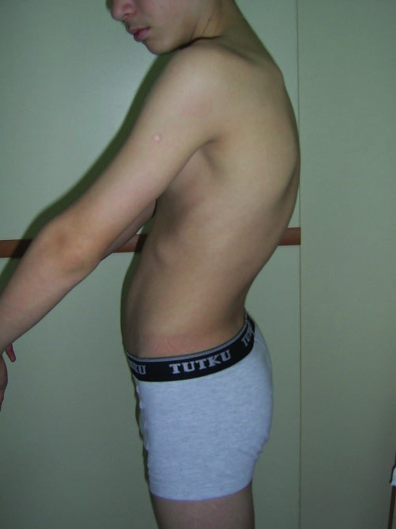

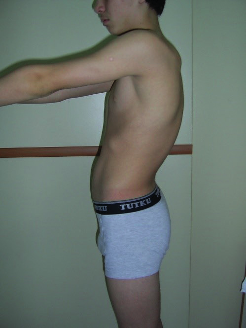

**Kifo-lordoz:** Hem bel çukurunda artma, hem de sırt eğriliğinin aynı anda görüldüğü durumu tanımlar.

**Genu recurvatum:** Yere basma sırasında diz ekleminde hiperekstansiyon olmasıdır. Ayakta dik duruşta yandan bakıldığında normalde uyluk ve bacak eksenleri arasında, önde bir açı gelişmesidir. Beş yaşından önce **5-10 derecelik** açılanma doğal olarak olabilir.

**Pes cavus:** Ayak arkı yüksektir. Ayak ağrısı en belirgin şikayettir.

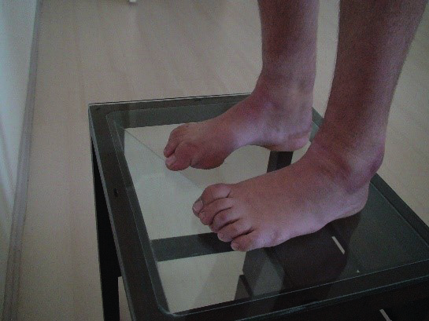

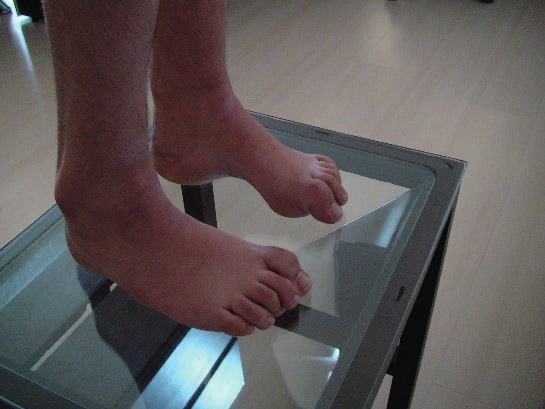

**Pes planus (düztabanlık):** Ayak longitüdinal arkının düz olması ve ayak tabanının yüzeyle tüm hat boyunca temas etmesidir. Ayak arkusu **üç yaş** civarında gelişir. Bu nedenle süt çocukluğu döneminde pes planus görülmesi normaldir.

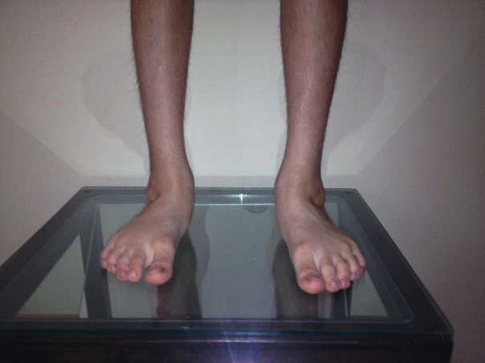

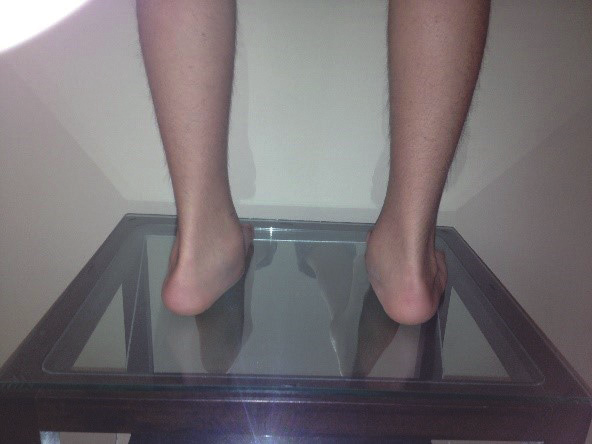

### Anterior Postür Analizi

Baş sağa veya sola kaymaz, omuzlar eşit seviyededir. Karın ve bel sağa veya sola kaymaz. Kollar eşit uzunlukta, kubital açıları eşit değerdedir. Kalçanın her iki tarafı da eşit yüksekliktedir. Dizler medial ve laterale kayma göstermez. Ayaklar normal açılımda, ayak parmakları laterale ve superiora kaymaz.

Anterior analizde şu deformiteler tespit edilebilir:

* Başın sağa veya sola fleksiyonu/rotasyonu
* Omuz yükseklikleri farkı
* Fıçı göğüs, pektus ekskavatum, pektus karinatum
* Bel seviyesinde eşitsizlik

**Genu valgum (X bacak):** Patellalar karşı karşıya bakacak şekilde dizler birbirine değerken ayaklar birbirinden uzaklaşır.

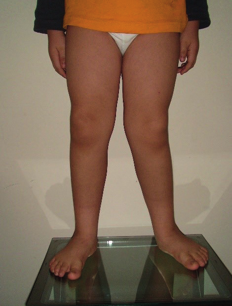

**Genu varum (O bacak):** Ayakta dururken femoral kondiller birbirinden uzaklaşırken medial malleoller birbirine değecek şekilde olmasıdır. İki yaşından küçük çocuklarda **fizyolojik** olarak görülebilir.

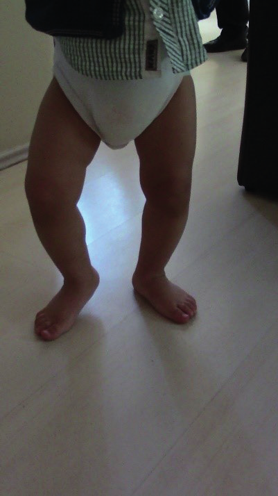

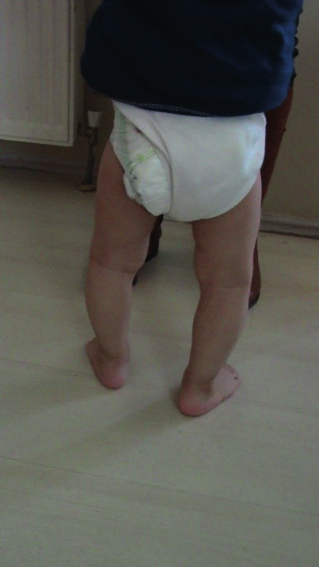

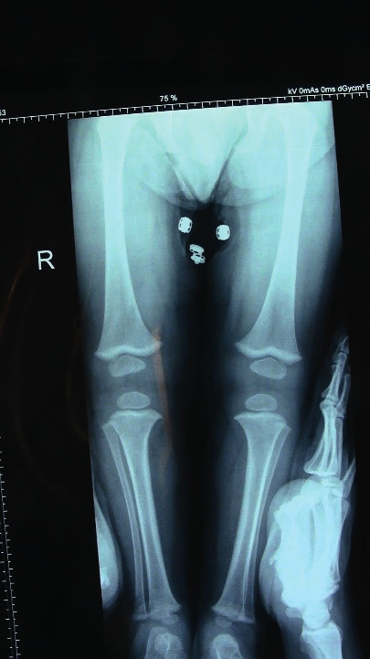

### Posterior Postür Analizi

Baş sağa ve sola rotasyon yapmaz, omurga nötrdür, omuzlar eşit seviyededir. Dizlerde medial veya laterale doğru çarpıklık yoktur. Ayaklar birbirine paraleldir.

Posterior analizde yakalanabilecek en önemli deformite **skolyozdur.**

> **Skolyoz:** Vertebral kolonda sağ veya sola doğru eğrilikle birlikte rotasyon olmasıdır.

Hasta ayakta serbest dururken arkadan frontal düzlemde bakıldığında omuz yüksekliğinde farklılık, belde asimetri ve kalça yüksekliğinde farklılık görülür. **Adam's öne eğilme testinde,** hastanın ayakta iken 90º eğilmesi istenir. Bu muayenede sırt ve bel bölgesinde fark edilen bir taraftaki asimetri skolyoz için tipiktir. Omurgada eğrilik **S** ve **C** şeklinde olabilir. Göğüs kafesinde de asimetri eşlik eder.

* **<3 yaş:** İnfantil skolyoz
* **3-10 yaş:** Juvenil skolyoz
* **>10 yaş:** Adolesan skolyozu (en sık görülen form)

Skolyoz eğriliğin yer aldığı anatomik bölge ve açıklığının yönüne göre tanımlanır. Skolyoz tanısında kullanılan ölçüm metodu **Cobb açısı** (üst uç vertebranın üst kenarı ve alt uçtaki vertebranın alt kenarına paralel olarak uzatılan çizgiler arasındaki açı) ölçümüdür. Skolyozlu kişilerde mutlaka **nörolojik muayene** yapılmalıdır.

**⚠️ ÖNEMLİ:** Eğrilik açısı **60 dereceden büyük** olan hastalarda kardiyopulmoner hastalıkların da görülebileceği unutulmamalıdır.

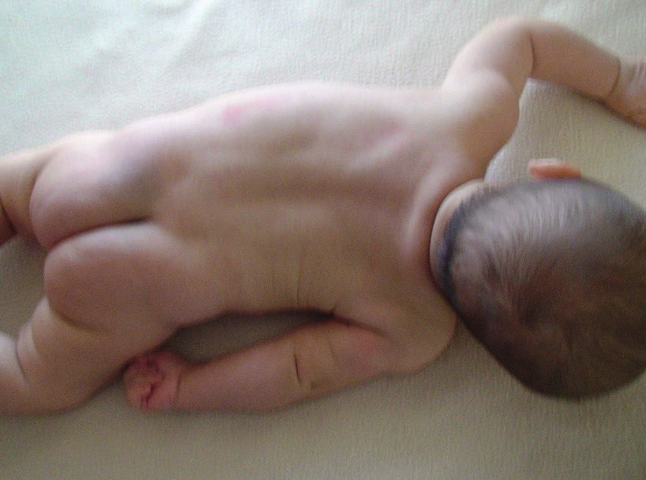

Doğuştan olan bazı vertebra anomalilerinin düzeltme operasyonları da yeni deformitelerin oluşmasına yol açabilir.

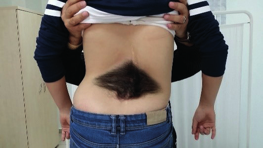

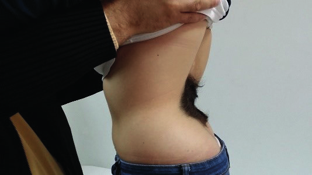

---

## YÜRÜYÜŞ

Fizik muayene sırasında yürüme gözlemsel olarak değerlendirilmelidir. Hasta düz bir zeminde en az **6-8 çift adım** uzunluğunda yürütülmeli ve bu esnada ayak dizilimi ve pozisyonu, diz pozisyonu, pelvik hareketlilik ve eksternal destek kullanımı açısından gözlenmelidir. Görülebilecek anormal yürüyüş şekillerinden bazıları:

* **Oraklayarak yürüme (hemiplejik yürüme):** Adım atarken hasta ayak bileğini ve dizini kıvıramadığı için, bacağına kalçadan dışa ve öne doğru geniş bir kavis çizerek adım atar.
* **Parmak ucunda yürüme:** Üç yaş altı çocuklarda normal olarak kabul edilebilir. Serebral palside görülür.
* **Trendelenburg yürüyüşü:** Kalça abduktör kaslarının zayıflığı sonucu üzerine ağırlık verilen ekstremite tarafına gövde lateral fleksiyon olur ve etkilenen tarafta pelvis aşağıya düşer. Bu çift taraflı olursa **ördekvari yürüyüş** olarak isimlendirilir. Gelişimsel kalça displazisinde ortaya çıkan yürüyüş şekli budur.
* **Antaljik yürüyüş:** Hasta ağrılı bölgeyi mümkün olduğu kadar çabuk hareket ettirerek ağırlığı üzerine vermemeye çalışır. Ağrılı ekstremite üzerinde duruş süresini kısaltır ve sekerek yürür.
* **Makaslayarak yürüme:** Her iki bacak yanlara yeterli derecede açılamaz ve hasta bacaklarını birbirine çaprazlayarak yürür.
* **Stepaj yürüyüşü:** Ayak bileği ve ayak parmakları ekstansiyon hareketi yapamaz. Hasta zemine düşük olan parmak ucu ile temas ederek, ayak ucunu yerden kurtarmak için dizine aşırı fleksiyon yaptırır. **Düşük ayakta** görülen yürüme şeklidir.

---

## EKLEM MUAYENESİ

Eklem muayenesinde eklemler **simetrik olarak**, üzerinde kızarıklık, şişlik, hassasiyet varlığı açısından değerlendirilmelidir. Eğer hasta aktif hareketleri yapamıyorsa o ekleme pasif hareketler yaptırılmalıdır.

> **Eklem hareket açıklığı (Range of Motion - ROM):** Eklem tam ekstansiyonda iken anatomik pozisyon baz alınarak ölçülmeli ve simetrik olarak değerlendirme yapılmalıdır.

Eklem hareket açıklığı **gonyometri** (açı ölçer) denilen özel bir cetvelle ölçülür. Hareket açıklığını değerlendirirken parmaklar eklem üzerine yerleştirilir, eklem hareketi sırasında krepitasyon ve deformite varlığı araştırılır.

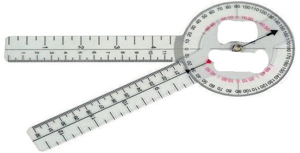

### Baş-Boyun Hareketlerinin Değerlendirilmesi

Normal boyun hareketleri; boynu **90º** sağa ve sola doğru omuz üzerinden çevirebilme, sağa ve sola doğru omuz üzerine doğru yatırabilme ve fleksiyon-ekstansiyon hareketlerinden oluşur.

Boyun hareketlerinde kısıtlılık nedeni olarak en sık görülen durum **tortikolistir.**

> **Tortikolis:** Sternokleidomastoid kasının kısalması neticesinde boynun tutulan tarafa doğru eğilmesi ve yüz ile çenenin karşı taraf omuza doğru dönmesini tanımlar.

Konjenital olarak doğum travmasına bağlı sternokleidomastoid kası içinde hematom oluşması sonucu oluşabilir veya daha ciddi bir durum olarak **intrakranial bir tümörün habercisi** de olabilir. Servikal vertebraların segmentasyonunda yetersizlik ile gelişen en az iki servikal segmentte füzyon sonucu ortaya çıkan konjenital bir malformasyon olan **Klippel-Feil sendromunda** da boyun hareketlerinde kısıtlılık görülür.

### Üst Ekstremite Değerlendirmesi

Üst ekstremite inspeksiyon ile bir anormallik var mı diye simetrik olarak değerlendirilmelidir. Hemihipertrofiden şüpheleniliyorsa üst-alt koldan çaplar ve kol uzunlukları ölçülmelidir. Simetrik olarak periferik dolaşım değerlendirilmelidir. Solukluk, ısı farkı, renk değişikliği mutlaka bakılmalıdır.

#### Ekstremite Anomalileri

İnspeksiyonla görülebilen ekstremite anomalilerine örnekler:

* **Amelia:** Bir ekstremitenin olmaması
* **Hemimelia:** Bir ekstremite yarısının olmaması
* **Fokomeli:** Ekstremitenin proksimal kısımlarının olmaması ve distal kısımlarının ise gövdeye yakın olması
* **Hemihipertrofi:** Vücudun bir yarısında veya aynı tarafta her iki ekstremite veya ekstremitelerden birinde hipertrofi olması
* **Adaktili:** Parmakların olmaması
* **Polidaktili:** Normalden fazla parmak olması
* **Sindaktili:** İki parmağın füzyonu veya bir perde yoluyla birleşmesi (en sık görülen konjenital el anomalisi)
* **Araknodaktili:** Parmakların ince ve uzun olması
* **Klinodaktili:** Elin küçük parmağının içe dönük olması
* **Brakidaktili:** Parmakların normalden kısa olması

Üst ekstremite muayenesinde **palmar eritem, çomak parmak, Osler nodülleri** bulunabilir. Diğer anormal bulgular:

* **Ebe eli (karpopedal spazm):** Hipokalsemi ve alkalozda görülür. El metakarpofalengeal eklemden fleksiyonda, parmaklar da adduksiyon durumundadır.
* **Raynaud fenomeni:** Ekstremite uçlarında görülen epizodik vazospazm ve iskemidir. Genellikle soğuk veya emosyonel stres gibi bir tetikleyici olur. Primer olabileceği gibi bağ doku hastalıklarının bir habercisi olabilir.

#### Omuz Eklemi

Omuz eklemi **en hareketli eklemdir.**

| Hareket | Açı |
|---|---|
| Ekstansiyon | 60º (skapula adduksiyonu gerekli) |
| Fleksiyon | 180º |
| Abduksiyon | 180º |
| Adduksiyon | 30-45º |
| İç rotasyon | 80º |
| Dış rotasyon | 95º |

Omuz eklemi muayenesi sırasında skapulalar simetri, büyüklük ve yerleşim yeri olarak değerlendirilmelidir.

> **Sprengel deformitesi:** Skapulanın intrauterin gelişim sırasında normal yerine inmesindeki yetersizlik sonucu yüksekte bulunmasıdır. Hastaya arkadan postürüne bakıldığında sağlam olan tarafın daha aşağıda olduğu, skapulaların yerleşim yerinin asimetrik olduğu görülür.

#### Dirsek Eklemi

Dirsek eklemi **135º fleksiyon**, **-5º ekstansiyon**, supinasyon ve pronasyon hareketlerini yapabilir. Anatomik pozisyonda humerusun uzun ekseniyle önkolun uzun ekseni arasında açıklığı dışa bakan bir açılaşma (**taşıma açısı - kubitus valgus**) bulunur. Taşıma açısı erkeklerde **10-15º**, kadınlarda **20-25º** dir.

* **Lateral epikondilit (tenisçi dirseği):** El bileği ekstansiyonu (dorsofleksiyonu) sırasında dirseğin lateralinde ağrı olması
* **Medial epikondilit (golfçü dirseği):** El bileği fleksiyonu sırasında dirsek medialinde ağrı olması
* **Bakıcı dirseği (pulled elbow):** Çocuklarda elin-kolun hızlıca çekilmesi sonucu radius başının çıkması durumu ile çocuğun kolunu kullanamama durumu

#### El Bileği Eklemi

El bileği **65-80º** fleksiyon, **55-70º** ekstansiyon yapabilir. Frontal düzlemde **45-55º** rotasyon, **0-30º** ulnar deviasyon, **0-15º** radial deviasyon yapabilir.

* **Higroma:** El sırtında ve el bileğinde ortaya çıkan sert kıvamlı şişlik
* **Tetik parmak:** Parmaklarda tetik çekme hareketlerinde tendonun kendi kılıfının içinde hareket edebilmesinin tendon kılıfının şişmesi veya kalınlaşmasıyla tendon kayma hareketinin yapılamaması ve zamanla parmağın kilitlenmesidir.
* **Dupuytren kontraktürü:** El ayasındaki elin parmaklarının hareketini sağlayan tendonların kalınlaşması nedeniyle zamanla elin 4. ve 5. parmaklarının kıvrık kalması
* **Karpal tünel sendromu:** Median sinirin kompresif nöropatisidir.
  - **Flick testi:** Hastanın ellerini sallayarak rahatlatması istenir.
  - **Tinel işareti:** Hastanın eli supin pozisyonda iken el bileği sabitlenip refleks çekici ile el bileğinin palmar yüzüne vurulduğunda ilk üç buçuk parmakta uyuşma varsa test pozitif kabul edilir.
  - **Phalen testi:** Her iki el bileğini fleksiyona getirip dorsal kısımları yapıştırarak bastırması söylenerek bu pozisyonda 60 sn tutması istenir. İlk üç buçuk parmakta uyuşma varsa test pozitiftir.
* **De Quervain tendiniti:** Başparmağın içe ve yana hareketlerini sağlayan tendonların el bileği düzeyinde sıkışmasıdır. El bileğinin başparmak tarafında kalan kısmında hassasiyet ve hareketlerinde ağrı vardır.
  - **Finkelstein testi:** Hastaya birinci parmağını avuç içine alacak şekilde yumruk yapması söylenir ve el bileği ulnar deviasyona getirildiğinde radius başı üzerinde şiddetli ağrı oluşursa test pozitif kabul edilir.

#### El Muayenesi

Muayene sırasında tenar-hipotenar bölge kasları, metakarpofalengeal ve proksimal-distal interfalengeal eklemler değerlendirilir.

***

### Alt Ekstremite Değerlendirmesi

Çocukluk çağında yürüyüş problemleri, topallama, aksama, parmak ucu yürüme, düz tabanlık, içe basma diz-ayak ağrıları gibi alt ekstremite problemleri ile daha sık karşılaşılmaktadır. Öncelikle inspeksiyon ile her iki alt ekstremite simetrik olarak değerlendirilmelidir.

#### Kalça Eklemi

> Asetabulum ve femur başı arasındaki uyum sayesinde güçlü ve stabil yapıda bir eklem yapısının ortaya çıkmasına yol açar.

Ayakta dururken yerçekimi merkezi, kalça rotasyon merkezinin arkasından geçer. Kalça eklemi omuz eklemi ile birlikte vücudun **en hareketli eklemidir.** Fakat yapısından dolayı daha stabil bir eklemdir.

> **Kollodiyafizer açı:** Femurun boyun ekseni ile femur gövde ekseni arasındaki açıdır. Normal değeri **120-130º** dir. Bu açının azalmasına **koksa vara**, artmasına **koksa valga** denir.

| Hareket | Açı |
|---|---|
| Fleksiyon | 135º |
| Ekstansiyon | 10-30º |
| Abduksiyon | 40-45º |
| Adduksiyon | 20-30º |
| İç rotasyon | 35-40º |
| Dış rotasyon | 45º |

#### Gelişimsel Kalça Displazisi (GKD)

Kalça eklemi muayenesi; özellikle yenidoğan döneminden itibaren başlayan, tedavi edilmediği takdirde engelli kalma olasılığı olan **gelişimsel kalça displazisinin (GKD)** erken tanınabilmesi için çocukluk çağında ayrı bir öneme sahiptir.

Ülkemizde Çocuk Ortopedi Derneği - T.C. Sağlık Bakanlığı Türkiye Halk Sağlığı Kurumu işbirliği ile 2013 yılında **"Gelişimsel Kalça Displazisi Ulusal Erken Tanı ve Tedavi Programı"** oluşturulmuş olup, bütün yenidoğanların taranması önerilmektedir.

Yenidoğan bebek kalçası fizyolojik pozisyon olarak **fleksiyon ve abduksiyonda** bulunur. Kalçanın ekstansiyon ve adduksiyona zorlandığı her durum GKD için risk oluşturur.

**Risk faktörleri:**
* Kız cinsiyet
* Makat gelişi
* Aile öyküsünün olması
* Çoğul gebelik
* Oligohidramniyoz
* Tortikolis ve ayak deformiteleri varlığı
* Kundak uygulaması

**⚠️ ÖNEMLİ:** GKD açısından fizik muayene özellikle **ilk 3-4 ay** içinde çok önemlidir.

**GKD açısından kalça muayenesi:**

1. **Pili asimetrisi:** Bacaklar önden ve arkadan uyluk ve kasık bölgesi cilt katlantılarının simetrik olması açısından değerlendirilmelidir. Normalde simetrik olması beklenir.
2. **Uzunluk farkı:** Bacaklar gevşek biçimde düz, sert bir zeminde sırt üstü yatırıldığında her iki bacak arasında uzunluk farkı olması. Hasta sırt üstü yatarken, kalça ve dizler fleksiyonda dururken karşıdan bakıldığında dizlerin yüksekliği arasında eşitsizlik olması ve çıkık taraftaki dizin daha aşağıda olması **Galeazzi (Allis) belirtisi** olarak tanımlanır.
3. **Ortolani testi:** Başparmaklar uyluk inferior medialinde, ikinci ve üçüncü parmaklar büyük trokanter üzerinde, kalçalar ve dizler 90º fleksiyonda iken abduksiyona alınırken kalçanın bir engelden atlayarak yerine girmesinin ikinci ve üçüncü parmak uçlarıyla hissedilmesi.
4. **Barlow testi:** Değerlendirilen kalçanın fleksiyonu azaltılıp adduksiyona alınırken arkaya doğru nazikçe itilir ve asetabulumdan arkaya doğru çıkıp çıkmadığının ikinci ve üçüncü parmak uçlarıyla hissedilmesidir.
5. **Abduksiyon kısıtlılığı**

Risk faktörü taşıyan ve/veya en az bir fizik muayene bulgusu pozitif olan bebeklere GKD açısından radyolojik bakı (USG) yapılmalıdır. Sonuçlara göre **Tip I kalça dışındaki** tüm bebekler bir ortopedi ve travmatoloji uzmanına yönlendirilmesi gerekir.

**⚠️ ÖNEMLİ:** Abduksiyon kısıtlılığı, pili asimetrisi, bacak uzunluk farkı bulgularının **çift taraflı kalça çıkıklarında yanıltıcı** olabileceği göz önünde bulundurulmalıdır.

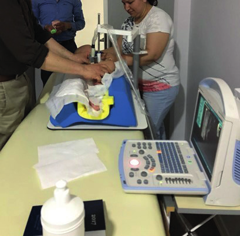

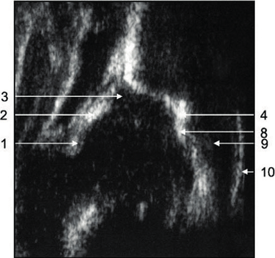

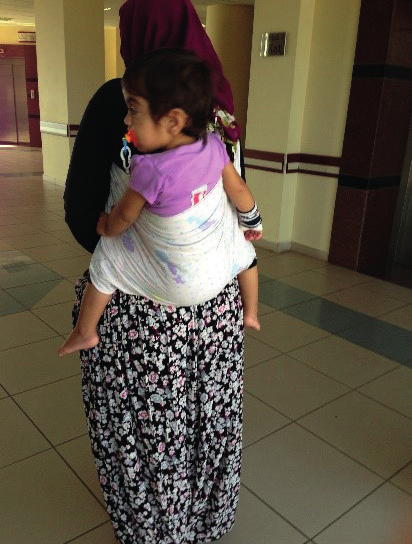

#### Kalça Eklemi Özel Testleri

Daha büyük çocuklarda kalça eklemi muayenesinde önce hasta sırt üstü yatarken bilateral olarak palpasyon yapılır. Spina iliaka anterior süperior ve krista iliaka palpe edilir. Kalça eklem hareket açıklığı fleksiyon, ekstansiyon, abduksiyon-adduksiyon, içe-dışa rotasyonu değerlendirilir.

* **Patrick (FABER) testi:** Kalça eklemine **F**leksiyon, **AB**duksiyon, **E**ksternal **R**otasyon yaptırılır. Sırt üstü yatan hastanın muayene edilecek kalça tarafındaki dizi kıvrılarak ayak karşı diz üzerine konur. Testin yapıldığı kalçada ağrı → aynı taraf kalça patolojisi; karşı tarafta veya sakroiliak eklem ağrısı → karşı taraf sakroiliak eklem patolojisi.
* **FADIR testi:** Kalça eklemine **F**leksiyon, **AD**duksiyon ve **İ**nternal **R**otasyon yaptırılır. Hasta sırt üstü yatarken diz ve kalça eklemi 90º fleksiyona getirilir. Diz ve ayak bileği desteklenirken tüm bacak nazikçe hastanın vücudunun orta hattı boyunca itilerek adduksiyona getirilir ve sonra diz pozisyonu korunurken ayak ve alt baldır vücuttan uzaklaştırılarak iç rotasyon yaptırılır. Testin uygulandığı kalçada ağrı olursa test **pozitif** kabul edilir ve aynı taraf kalça patolojisini gösterir.
* **Thomas testi:** Bir kalçadan bacağı fleksiyona getirirken diğer bacak da fleksiyona geliyorsa test pozitiftir. **Fleksiyon kontraktürünü** gösterir.
* **Trendelenburg bulgusu:** Tek ayak üzerinde dururken, kaldıraç kolunu azaltarak yükü azaltmak için pelvisin duruş ayağının karşısındaki tarafa düşmesi durumunda pozitif olarak kabul edilir. Kalçanın abdüktör kasları (gluteus medius ve gluteus minimus) zayıflığı veya felçli kişilerde görülür.

#### Diz Eklemi

İki yaş altındaki çocukların çoğunda **fizyolojik eğri bacak (fizyolojik genu varum)** vardır. Yaş ilerledikçe bu durum düzelir ve 3-4 yaş civarında genellikle normal görünüme sahip olurlar.

| Hareket | Açı |
|---|---|
| Normal hareket açıklığı | 155-160º |
| Sandalyeden kalkma ve merdiven çıkma | 90-120º fleksiyon |
| Çömelme ve diz çökme | 120-150º fleksiyon |
| Ekstansiyon | 0-20º |

İnspeksiyonla hasta yürürken, otururken, yatarken diz eklemi gözlenir. Genu varum-valgum gibi deformitelerin varlığı tespit edilebilir. **Genu recurvatum** dizin hiperekstansiyonudur. Diz ekleminde şişlik, kızarıklık değerlendirilir. Simetrik olarak çap farkından şüpheleniliyorsa ölçüm yapılmalıdır.

Palpasyon sırasında hasta muayene masasına sırt üstü yatarak bacağını uzatır. Palpasyonda **kuadriceps atrofisi** değerlendirmesi için her iki uylukta patella üst kenarından **10 cm yukarısı** işaretlenerek uyluk çevresi ölçülür.

Diz eklemi gevşek iken, patellanın 10 cm yukarısından başlayarak distale doğru eklem kavitesinin uzantısı olan **suprapatellar poş** palpe edilir. Suprapatellar poş üzerine bastırılınca sıvı başka tarafa gideceği için şişlik kayboluyorsa **patella şoku testi pozitif** olarak kabul edilir. Baskı kaldırılınca tekrar eski haline döner.

Hasta yüzüstü yatırılarak dizin arka yüzü muayene edilir. Dizin arka yüzünde bulunan **popliteal fossa** palpe edilir. Popliteal fossadaki şişlik çoğunlukla **popliteal ya da Baker kistini** gösterir.

**Ligament instabilite testleri:**

* **Kollateral bağ testleri:** Bir elle femur alt ucu stabilize edilirken diğer elle valgusa zorlanır ve parmakla medial eklem aralığı kontrol edilir. Dizin medialinde ağrı varsa **medial kollateral bağ lezyonunu** gösterir.
* **Çekmece testi:** Sırt üstü yatan hastanın dizi 90º fleksiyona getirilir. Hastanın ayakları stabilize edilirken her iki bacağı proksimal tibiadan tutarak öne doğru çekilir. Tibia öne doğru **6 mm'den fazla** kayarsa test pozitif kabul edilir ve **anterior krusiyet bağ yırtığının** bir bulgusudur.
* **McMurray testi:** Meniskus patolojisini göstermek için kullanılır. Hasta sırt üstü yatarken bir el ile ayak bileğinden, diğeriyle diz kavranır. Tibiaya iç rotasyon yaptırılırken diz ekstansiyona getirilir. **Lateral meniskus lezyonu** varsa bu sırada ağrı ve klik sesi ortaya çıkar. Medial meniskus için de test tibiaya dış rotasyon yaptırılırken tekrarlanır.

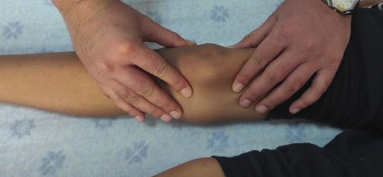

#### Ayak Bileği

Ayak ve ayak bileği muayenesinde inspeksiyonda ilk değerlendirilecek konu hastanın yürüyüşüdür. Yürüyüşle birlikte ayak deformiteleri görülebilir:

* **Pes ekinus:** Ayak parmaklarının üzerine basarak topuklar yere değmeden yürüme
* **Pes kavus:** Ayak longitudinal arkının normalden fazla yüksek olması
* **Pes varus:** Ayağın dış kenarına basarak yürüme
* **Pes valgus:** Ayağın iç kenarına basarak yürüme
* **Hallux valgus:** Başparmağın 1. metatarstan **10-15º'den fazla** laterale deviasyonu
* **Hallux varus:** Başparmağın 1. metatarstan mediale deviasyonu
* **Pes ekinovarus (çarpık ayak):** Topuk belirgin olarak ekin pozisyonunda iken, ayak içe doğru dönüktür.

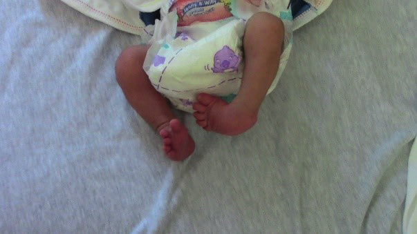

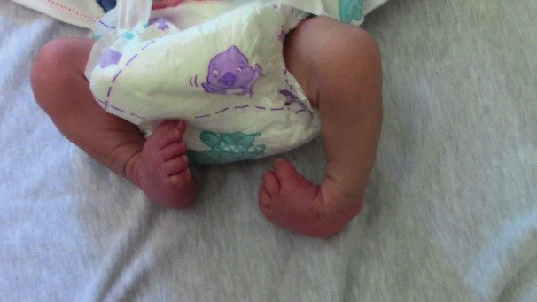

* **Pes kalkaneovalgus:** Ayağın üst ve dış yanlara doğru dönük olmasıyla oluşan şekil bozukluğudur.

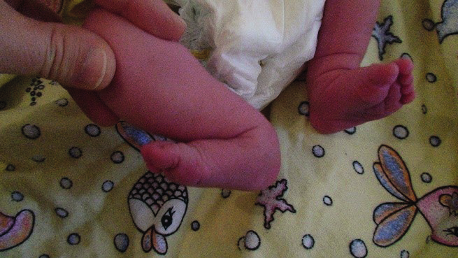

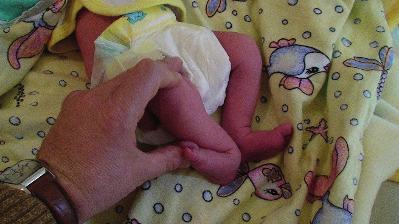

* **Metatarsus adduktus:** Ön ayağın arka ayağa göre medial deviasyonu. **Bebeklik çağının en sık görülen ayak deformitesidir.** İntrauterin hayatta iken bebeğin duruş bozukluğu, sıkışma suçlanmaktadır. Genellikle bir tedavi gerekmeksizin düzelmektedir.

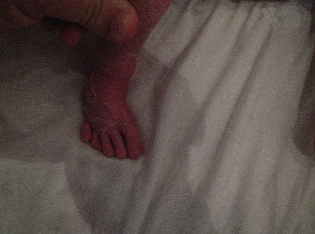

***

### Vertebral Kolon Değerlendirmesi

Çocuk ve özellikle adolesanlarda vertebral kolon değerlendirmesi sağlıklı çocuk muayenesinin önemli bir parçasıdır. Skolyoz muayenesinden postür analizinde bahsedilmiştir.

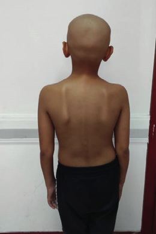

**Servikal omurga hareketlerini değerlendirmek için:**
* Hastadan sağ ve sol omuzdan geriye doğru bakması (**rotasyon**)
* Çenesini göğsüne değdirmesi (**fleksiyon**)
* Yukarıya bakarak başını arkaya kaldırması (**ekstansiyon**)
* Başını kulağını omzuna değdirecek şekilde eğmesi (**lateral fleksiyon**) istenir.

**Lomber vertebra muayenesi - Schober testi:** Hasta dik olarak ayakta dururken spina iliaka krista posterior superiorları birleştiren doğru işaretlenerek beşinci lomber vertebraların alt kenarı bulunur. Bu noktadan orta çizgide **10 cm** yukarıda nokta bulunarak işaretlenir. Hastadan dizlerini bükmeden yapabildiği kadarıyla belden öne eğilip ellerini yere değdirmeye çalışması istenir. Tekrar aynı ölçüm yapıldığında aradaki farkın **4 cm'den düşük** bulunması lomber vertebra hareket kısıtlılığını gösterir.

**Düz bacak kaldırma testi:** Bacak tam ekstansiyonda iken ekstremite bir elle yukarı doğru kaldırıldığında **60º'nin altında** kaldırmada belden bacağa doğru yayılan bir ağrı olması lomber disk hernisi gibi patolojilere işaret edebilir.

**Sakroiliak eklem muayenesi:** Lumbosakral bölgedeki iki çukurcuk (**Venüs çukurcukları**) sakroiliak eklemin yerini gösterir. Hasta yüzükoyun yatarken sakrum ve bu çukurcuklar üzerine basıldığında ağrı, hassasiyet varsa sakroiliak eklem hassasiyetini gösterir.

---

## pGALS (PAEDIATRIC GAIT, ARMS, LEGS, SPINE) TESTİ

> Uzmanlık alanı iskelet sistemi hastalıkları olmayan hekimler ve tıp öğrencileri için geliştirilmiş olan, lokomotor sistemin temel özelliklerinin basit, kolay, hızlı ve doğru değerlendirilmesini sağlayan muayene yöntemidir.

Burada amaç normal ile anormali kolayca ayırt edilmesini sağlayarak hastanın ilgili uzmanlık birimine yönlendirilmesini sağlamaktır.

**Sorulması gereken sorular:**

* Eklemlerinde, kaslarda ve sırtta ağrı-sertlik var mı?
* Yardımsız giyinirken zorlanıyor musunuz?
* Merdiven çıkarken veya inerken herhangi bir sorun yaşıyor mu?

### pGALS Muayene Tablosu

| Muayene | Ne Değerlendirilmeli? |
|---|---|
| Hastayı ayakta dururken inceleyin (önden, arkadan ve yanlardan) | Postür ve görünüş, cilt döküntüleri, deformiteler (bacak uzunluğu, diz veya bilekte valgus-varus, skolyoz, eklem şişliği, kas atrofisi, düz tabanlık) |
| Hastayı yürürken, topuk üzerinde yürürken ve parmak üzerinde yürürken gözlemleyin | Bilek, subtalar ve midtarsal ve ayak parmaklarındaki küçük eklemler, ayak postürü |

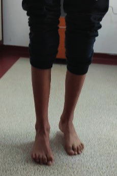

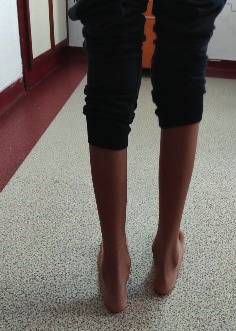

| Muayene | Ne Değerlendirilmeli? |
|---|---|
| "Ellerini önünde düz olarak tut" | Omuzların öne fleksiyonu, dirsek ekstansiyonu, el bileği ekstansiyonu, parmak küçük eklemlerinin ekstansiyonu |
| "Ellerini çevirip yumruk yap" | Dirsek supinasyonu, el bileği supinasyonu, parmak küçük eklemlerinin fleksiyonu |
| "İşaret parmağın ile başparmağını birleştir" | İşaret parmağı ile başparmağın küçük eklemlerinin koordinasyonu ve fonksiyonel kavrama |
| "Başparmağın ile diğer parmakların ucuna dokun" | El becerisi, parmaklar ve başparmak küçük eklemlerinin koordinasyonu |

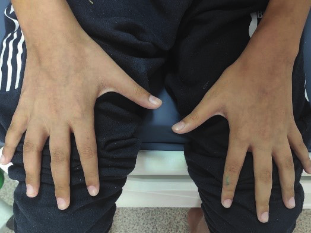

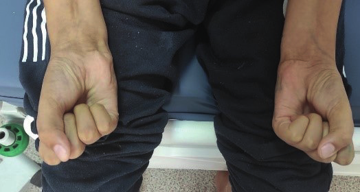

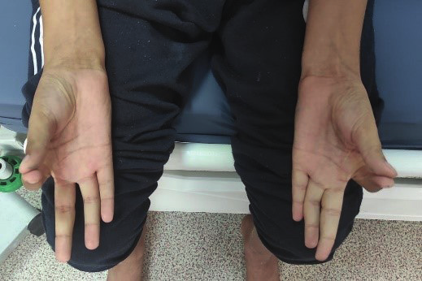

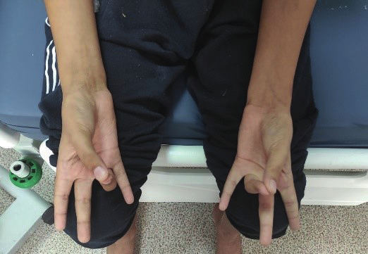

| Muayene | Ne Değerlendirilmeli? |
|---|---|
| Metakarpofalengeal eklemleri sıkın: hassasiyet varlığı? | Metakarpofalengeal eklemler |
| "Avuç içlerini karşılıklı birleştirin" / "El sırtını karşılıklı olarak birleştirin" | Parmakların küçük eklemlerinin ekstansiyonu, dirsek ekstansiyonu, el bileği ekstansiyonu |
| "Gökyüzüne dokunur gibi uzan" | Dirsek ekstansiyonu, el bileği ekstansiyonu, omuz abduksiyonu |
| "Tavana bak" | Boyun ekstansiyonu |
| "Ellerinin boynunun arkasında birleştir" | Omuz abduksiyonu, omuzların eksternal rotasyonu, dirsek fleksiyonu |
| "Kulağınla omzuna dokunmaya çalış" | Servikal vertebra fleksiyonu |
| "Ağzını açıp üç parmağını dikey olarak içine sok" | Temporomandibuler eklemler (çene hareketinde deviasyonu kontrol edin) |
| Dizdeki effüzyonu hissedebilmek için palpe edin (patellar vuru veya fluktasyon varlığı) | Dizde effüzyon (sadece patellar vuru muayenesi ile küçük effüzyonlar atlanabilir) |

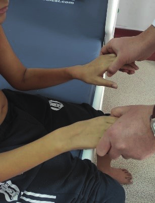

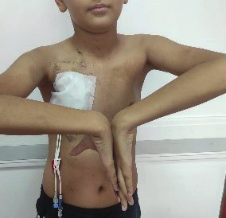

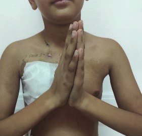

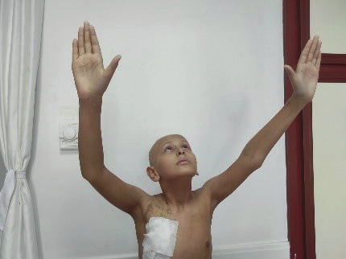

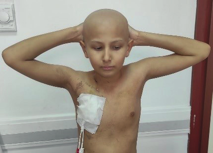

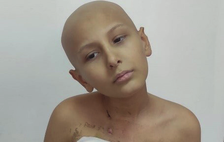

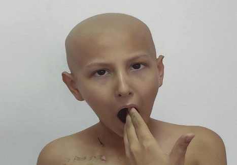
