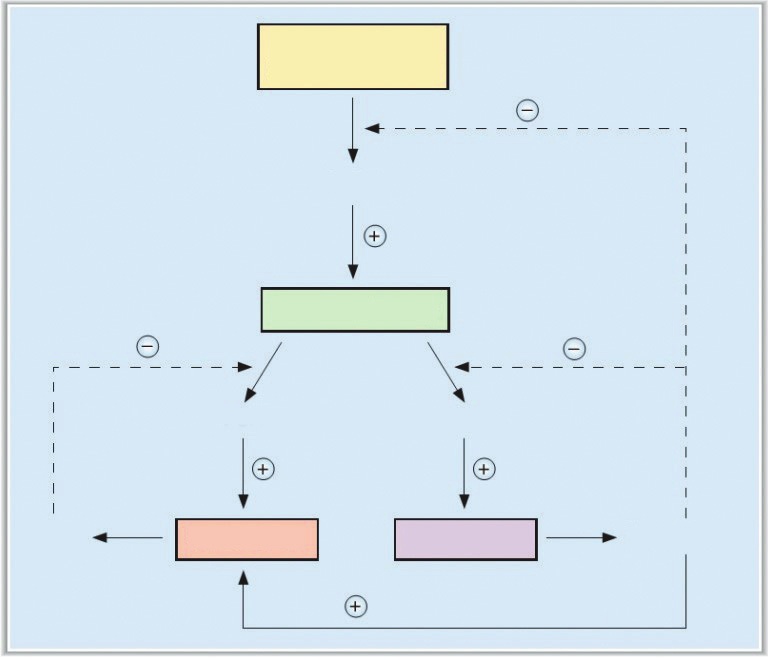
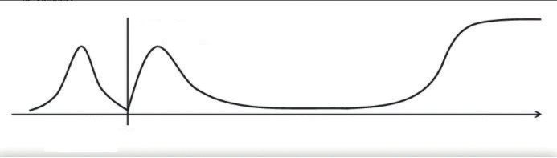
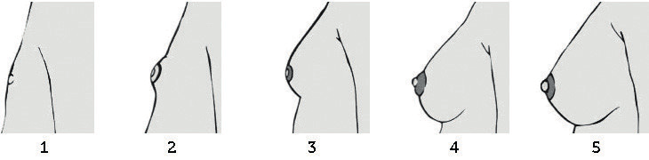
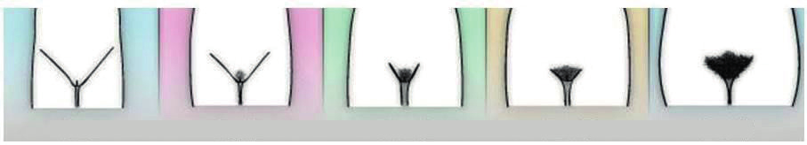
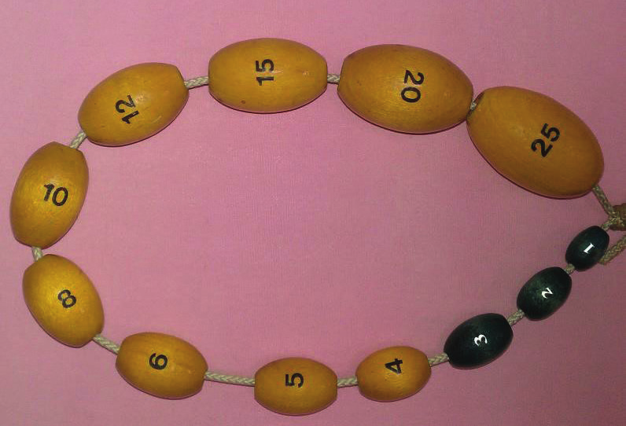
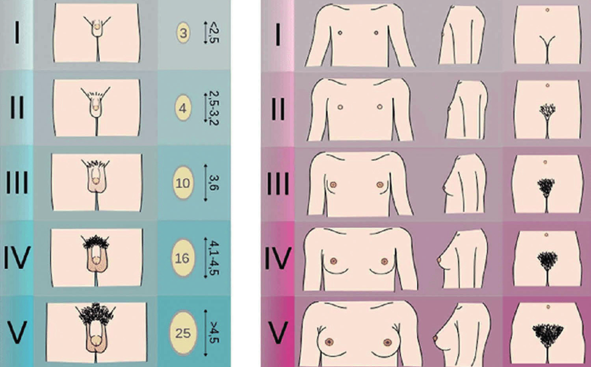

# NORMAL PUBERTAL GELİŞİM

**Hazırlayan:** Doç. Dr. Ahmet Anık
**Bölüm:** Çocuk Sağlığı ve Hastalıkları

---

## GİRİŞ VE TANIMLAMALAR

> **Puberte**, ikincil cinsiyet karakterlerinin (meme gelişimi, pubik kıllanma, ses değişikliği) geliştiği, çocukluktan genç erişkinliğe geçişin olduğu gelişim evresidir.

Bu dönemin tipik özellikleri arasında gametogenez, gonadal hormonlarda artış ve ikincil cinsiyet karakterlerinin ortaya çıkması yer alır.

**Temel tanımlar:**

* **Telarş:** Östrojen etkisi sonucu olan meme gelişimi
* **Pubarş:** Androjen etkisi sonucu pubik veya aksiller kıllanma
* **Menarş:** İlk menstrüel kanama
* **Adrenarş:** Pubarşa katkı sağlayan adrenal androjen üretimi

---

## HİPOTALAMUS-HİPOFİZ-GONAD AKSI

Normal puberte, hipotalamusta bulunan gonadotropin salgılatıcı hormon (GnRH) üreten özelleşmiş nöronların **pulsatil GnRH** üretmeleri ile başlar.

Hipotalamik nöronların GnRH'yi hipofizin portal venöz sistemine salması ile ön hipofizden **lüteinleştirici hormon (LH)** ve **follikül uyarıcı hormon (FSH)** adlı iki hormon pulsatil olarak salınır.

### Erkekte HHG Aksı

* **LH** → Leydig hücrelerini uyarır → **Testosteron** üretimi
* **FSH** → Sertoli hücrelerini uyarır → **Gametogenez** ve gonadal büyüme

### Dişide HHG Aksı

* **LH** → Teka hücrelerini uyarır → **Androjen prekürsörleri** üretimi
* **FSH** → Granüloza hücrelerini uyarır → Gametogenez, gonadal büyüme ve aromataz enzimi aracılığıyla androjenlerden **östrojen** üretimi
* FSH uyarısı ile üretimi artan bir diğer hormon da **inhibin**dir

### Negatif Geribildirim

Cinsiyet steroidleri (testosteron ve estradiol) hem GnRH hem de gonadotropinler üzerine, inhibin ise FSH üzerine **negatif geribildirim** (feedback) ile etki ederek salınımlarını baskılar. Puberte süresince LH, FSH ve testosteron/estradiol düzeyleri kademeli olarak artarak erişkin değerlerine ulaşır.

### Cinsiyet Steroidlerinin Etkileri

* Dolaşımdaki östrojen ve testosteronun en önemli kaynağı **gonadlar**dır
* Erkeklerde testosteronun, kızlarda östrojenin **%90'ından fazlası** gonadlarda üretilir
* **Östrojen** → Meme gelişimi + endometriyal büyüme
* **Androjenler** → Aksiller ve pubik kıllanma
* Her iki cinsiyet steroidi de hem epifiz plağına direkt etki ederek hem de büyüme hormonunu uyararak pubertedeki hızlı büyümeyi sağlar (**pubertal büyüme atağı**)
* Pubertede kızlarda daha çok **yağ dokusunda**, erkeklerde ise **yağsız vücut kitlesinde** artış ile karakterize vücut kitle indeksinde artış görülür

### HHG Aksının Aktif Olduğu Dönemler

HHG aksı yaşamın **üç döneminde** aktiftir:

1. **Fetal dönem**
2. **Neonatal dönem** (mini-puberte)
3. **Erişkin dönem** (puberte)

Gebeliğin son trimesterinde fetoplasental ünite tarafından üretilen yüksek miktardaki östrojenlerin negatif geribildirimi ile gonadotropin düzeyleri baskılıdır. Doğumla birlikte anneye ait östrojenlerin hızla düşüşü tekrar gonadotropin düzeylerinin artışına neden olur.

> **Mini-puberte:** Yaşamın ilk altı ayında görülen ve serum LH, FSH ve estradiol/testosteron düzeylerinin normal puberteye yakın değerlerde olduğu dönemdir. Bu dönemde puberteye ait klinik bulgular genellikle görülmez ancak telarş ve genital büyüme görülebilir.

Yaşamın altıncı ayından itibaren HHG aksı baskılıdır ve gonadotropin ile cinsiyet steroidlerinin kan düzeyleri çok düşüktür.

---

## PUBERTENİN BAŞLAMASI VE SÜRDÜRÜLMESİ

Pubertal gelişim, HHG ekseninin aktivasyon kazanması ile başlar. Pubertenin başlamasındaki bireysel farklılıkları **çevresel** ve **genetik** etmenler oluşturmaktadır. Karmaşık ve koordineli çalışan nöroendokrin mekanizmalar HHG ekseninin aktivasyonunu ve olgunlaşmasını sağlar.

### GnRH Düzenleyicileri

* **Majör baskılayıcılar:** GABA ve opioid
* **Majör uyaranlar:** Glutamat ve kisspeptinler

Puberte öncesi dönemde baskılayıcı sistemin hakim olması nedeni ile HHG aksı baskılı durumdadır; uyaran sistemin hakim hale gelmesi ile GnRH pulsatil salınmakta ve puberte başlamaktadır.

**⚠️ ÖNEMLİ:** Puberteyi başlatan tek bir tetikleyici yoktur. Pubertenin başlama zamanı birçok etmenle ilişkili olup, en önemli belirleyicilerden biri **genetik**tir.

Puberte sürecini etkileyen etmenler:

* Cinsiyet hormonları
* Çeşitli kimyasallar (endokrin bozucular)
* Çevresel uyaranlar (beslenme, büyüme hormonu-IGF aksı, tiroid hormonları)
* Genel sağlık durumu

### Kemik Yaşı ve Puberte

Pubertal evre takvim yaşından çok **kemik yaşı** ile korelasyon gösterir. Örnek vermek gerekirse:

* **Meme gelişimi** → Kemik yaşı yaklaşık **10 yaş**
* **Menarş** → Kemik yaşı yaklaşık **12,5 yaş**

Bu dönemde çocuğun takvim yaşı 9 da 14 de olabilir.

### Beslenme ve Leptin

Pubertenin başlaması ve sürdürülmesinde **ideal beslenme** çok önemlidir. Vücut ağırlığı, dolayısıyla da yağ dokusu belirli bir hacme ulaştığında pubertenin başlangıcı tetiklenmektedir.

* **Yetersiz beslenme** (gelişmekte olan ülkelerde daha sık) → Pubertede gecikme
* **Obezite** (gelişmiş ülkelerde daha sık) → Pubertenin erken başlaması

> **Leptin**, yağ hücrelerinden salgılanan, hipotalamus ve yağ dokusu arasındaki haberleşmeyi sağlayan ve puberte üzerinde önemli etkileri olan bir hormondur. Hipotalamustaki reseptörleri aracılığı ile iştahı baskılar ve gonadotropin üretimini uyarır.

Vücut ağırlığı belirli bir eşiğe ulaştığında kan düzeyi artan leptin, beslenme durumu ile ilgili sinyali hipotalamusa göndererek pubertenin başlamasına katkı sağlar.

**⚠️ ÖNEMLİ:** Doğuştan leptin eksikliği olan çocuklarda gonadotropin eksikliğine bağlı **pubertede gecikme** (hipogonadotropik hipogonadizm) ve **obezite** görülür.

---

## KIZLARDA NORMAL PUBERTAL GELİŞİM

Pubertenin normal başlama yaşları:

| Cinsiyet | Başlama Yaşı Aralığı |
|---|---|
| Kız | **8-13 yaş** |
| Erkek | **9-14 yaş** |

Kızlarda pubertenin **ilk bulgusu meme gelişimidir**. Kızlarda pubertal bulgular erkeklere göre genellikle **iki yıl** daha erken başlamaktadır.

### Kızlarda Pubertal Gelişim Zamanlaması

| Olay | Ortalama Yaş |
|---|---|
| Meme gelişimi (telarş) | 10-11 yaş |
| Pubik kıllanma (pubarş) | 11,0-11,5 yaş |
| Menarş | 12,5-13,0 yaş |

**Türk çocuklarında ortalama değerler:**

| Olay | Ortalama Yaş |
|---|---|
| Telarş | 10,1 ± 1,0 yıl |
| Pubarş | 11,0 ± 1,0 yıl |
| Menarş | 12,2 ± 0,9 yıl |

### Kızlarda Pubertal Büyüme Atağı

* Pubertenin erken evresinde, ortalama **11-12 yaşlarında**, Tanner Evre 2-3'de gerçekleşir
* Ortalama **2-3 yıl** sürer
* Evre 3'te uzama hızı ortalama **8,25 cm/yıl**
* Menarş sonrası boy uzaması yavaşlar
* Menarş sonrası ortalama boy kazancı **7 cm**

### Tanner-Marshall Evrelendirmesi

> Pubertenin evrelendirilmesinde **Tanner-Marshall evrelendirmesi** kullanılır. Bu evrelemede beş evre bulunmaktadır: **Evre 1** prepubertal olarak tanımlanırken, **Evre 5** pubertenin son evresidir.

### Kızlarda Meme Gelişim Evreleri

* **Evre 1:** Puberte öncesi dönemdir. Sadece meme başı (papilla) gözlenir. Subareolar disk (meme dokusu) palpe edilmez.
* **Evre 2:** Memelerde areola altında tomurcuklanma başlar. Meme başının hemen altında bozuk para şeklinde disk palpe edilir.
* **Evre 3:** Meme dokusu ve areola genişler, ancak konturları pek belirgin değildir ve meme dokusu ve areola birbirinden ayrılmaz.
* **Evre 4:** Memelerde büyüme daha belirgindir; areola, meme dokusunun üstünde ikinci bir çıkıntı oluşturur.
* **Evre 5:** Memeler erişkin görünümünü alır. Areolanın yapmış olduğu çıkıntı meme seviyesine geriler, sadece papilla çıkıntılı bir şekilde görülür.

### Kızlarda Pubik Kıllanma Evreleri

* **Evre 1:** Kıllanma yoktur.
* **Evre 2:** Labiumlar üzerinde, seyrek, düz, pigmente kıllar vardır.
* **Evre 3:** Monspubise doğru ve orta hatta yayılan, daha koyu renkte, daha sık ve kıvrık kıllar vardır.
* **Evre 4:** Erişkin tipi kıllanmaya benzer yoğun kıllanma vardır, kıllar bacakların iç kısmına yayılmamıştır.
* **Evre 5:** Erişkin tipi kıllanmadır, Evre 4'teki bulgulara ilave olarak kıllar bacakların iç kısmına da yayılmıştır.

---

## ERKEKLERDE NORMAL PUBERTAL GELİŞİM

Erkeklerde pubertenin **ilk bulgusu testis hacimlerinin artmasıdır** (≥4 mL veya uzun aksın ≥2,5 cm olması). Testis hacimlerinin ölçülmesinde en çok kullanılan yöntem **Prader orşidometresi**dir. Pubertenin başlangıç aşamasında testis büyümesi asimetrik olabilir.

**Türk erkek çocuklarında ortalama değerler:**

| Olay | Ortalama Yaş |
|---|---|
| Pubertenin başlaması | 11,6 ± 1,2 yıl |
| Pubik kıllanma | 12,3 ± 0,9 yıl |
| Aksiller kıllanma | 13,1 ± 1,0 yıl |

### Erkeklerde Pubertal Büyüme Atağı

* **13-15 yaşları** arasında, Tanner Evre 3-5 döneminde gerçekleşir
* Ortalama boy kazancı **9,5 cm/yıl**
* Kızlara göre **iki yıl daha geç** başlar ve **18 yaşına** kadar devam edebilir
* ⭐ Bu durum erkeklerin nihai boyunun kızlardan daha uzun olmasının temel nedenidir

### Penis Boyu Değerlendirmesi

Puberte muayenesi sırasında dikkat edilmesi gereken önemli bir nokta **penis boyunun ölçülmesi**dir. Gerdirilmiş penis boyu, penisin uzatılarak dorsal kısımdan sert bir cetvel aracılığıyla ölçülmesi ile değerlendirilir. Penis gergin boyu yaşla beraber artış gösterir.

> **Mikropenis:** Gerdirilmiş penis boyunun yaşa göre **-2 SDS'den küçük** olması

**⚠️ ÖNEMLİ:** Obezlerde yağ dokusu içine gömük olan penis yalancı mikropenis görünümüne neden olabilir (**psödomikropenis**).

### Erkeklerde Tanner'a Göre Pubertal Gelişim Evreleri

* **Evre 1:** Puberte öncesi dönemdir. Penis, testis ve skrotumda büyüme yoktur.
* **Evre 2:** Testisler ve skrotum büyümeye başlar, skrotum derisinde renk değişikliği/pembeleşme ve incelme görülür.

