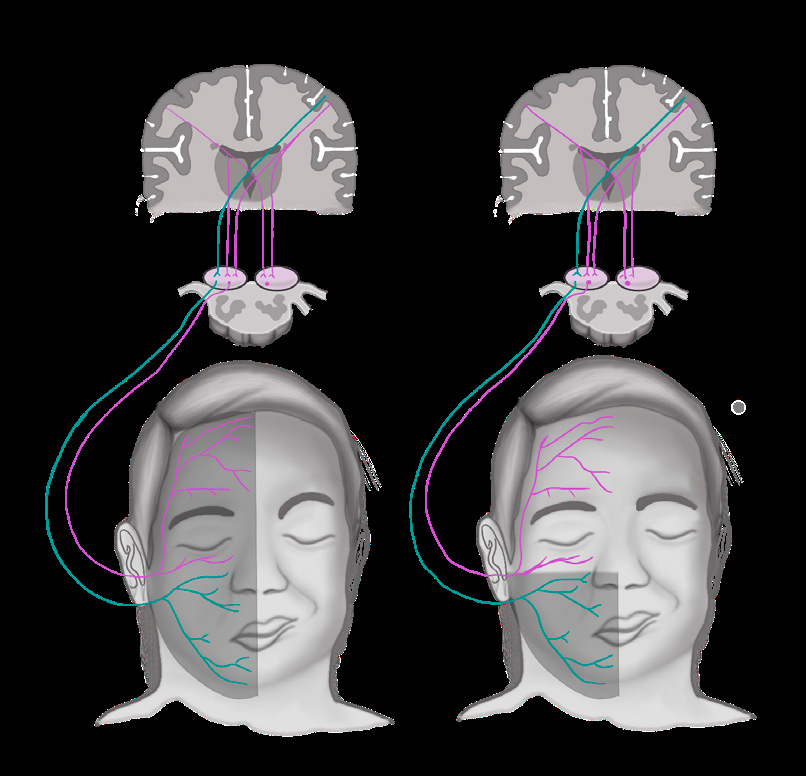
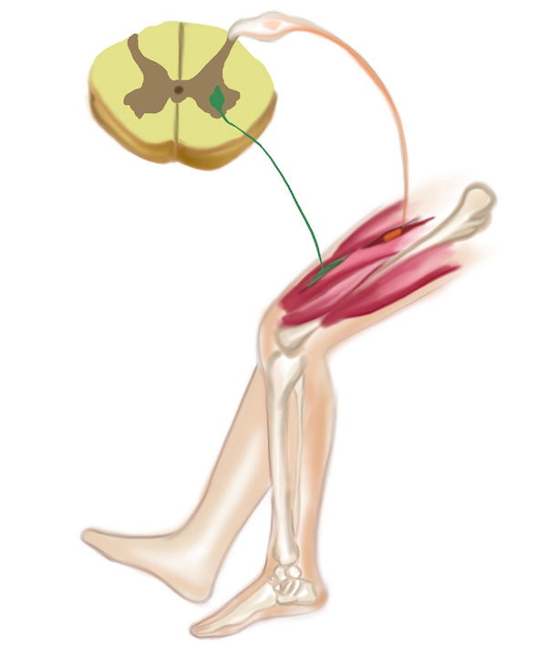
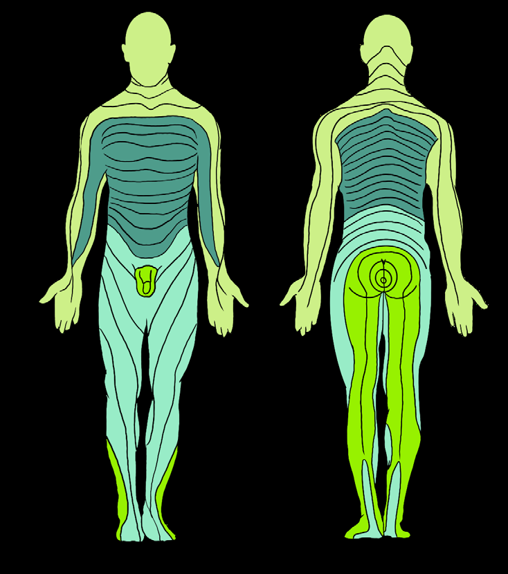

# NÖROLOJİK MUAYENE

**Hazırlayan:** Dr. Öğr. Üyesi Müge Ayanoğlu
**Bölüm:** Çocuk Sağlığı ve Hastalıkları

---

Sağlıklı bir nörolojik muayene, hasta ve hekim arasındaki iyi bir işbirliği ile gerçekleşir. Sağlıklı ve nörolojik gelişimi normal, dört yaşın altındaki bir çocukta nörolojik muayene için tam bir iş birliği sağlamak çoğunlukla mümkün olmaz. Ancak çocuğun genel görünümü, çevre ile etkileşimi, spontan hareketleri ve yürüyüş şeklinin gözlemi bize nörolojik gelişimi ve iyilik hali hakkında önemli bilgiler verir. Bu nedenle özellikle **4 yaş altı** çocuk hastaların nörolojik muayenesinde gözlem önemli bir yer tutar.

---

## BİLİNCİN DEĞERLENDİRİLMESİ

> **Bilinç**, bireyin kendisi ve çevresi hakkında farkında olması durumu olarak tanımlanmaktadır.

Nörolojik muayeneye bilincin değerlendirilmesi ile başlanmalıdır.

- **Letarji:** Uyanıklık halinin güçlükle sürdürülmesi durumu
- **Obtundasyon:** Sözlü uyaranla uyanık hale geçebilme durumu
- **Stupor:** Ağrılı uyaranla uyanık hale geçebilme durumu

Hastanın uyaranlara verdiği göz açma, motor ve sözel yanıtlar puanlandırılarak, bilinç durumu hakkında daha detaylı bilgi sahibi olunabilir. **Glasgow Koma Skalası (GKS)** olarak adlandırılan bu skalaya göre toplam puanın **7 ve altında** olması ⚠️ **koma** olarak tanımlanır. Uyaranlara verilen sözel ve motor yanıtlar 2 yaşından küçük çocuklar için farklılık gösterirken, gözlerin yanıtı 2 yaş altı ve üzerindeki yaş grubunda değişmez.

### Glasgow Koma Skalası

| Parametre | Puan | Yanıt |
|---|---|---|
| **Göz hareketleri (Eye)** | 4 | Gözler spontan açık |
| | 3 | Gözler sözel uyaranla açılır |
| | 2 | Gözler ağrılı uyaranla açılır |
| | 1 | Gözler açılmaz |
| **Motor yanıt (Movement)** | 6 | Komutlara uygun olarak hareket eder |
| | 5 | Orta hatta uygulanan ağrılı uyaranı lokalize eder |
| | 4 | Ekstremite uçlarına uygulanan ağrılı uyaranı uzaklaştırır |
| | 3 | Ağrılı uyarana fleksör yanıt (dekortike yanıt) |
| | 2 | Ağrılı uyaranlara ekstansör yanıt (deserebre yanıt) |
| | 1 | Ağrılı uyarana yanıt yok |
| **Sözel yanıt (Verbal)** | 5 | Normal, anlaşılır konuşma |
| | 4 | Karışık anlaşılması güç konuşma |
| | 3 | Uygunsuz sözcükler |
| | 2 | Sesler, anlaşılabilir kelime yok |
| | 1 | Yanıt yok |

### Glasgow Koma Skorlaması (2 Yaş Altı)

| Parametre | Puan | Yanıt |
|---|---|---|
| **Göz hareketleri (Eye)** | 4 | Gözler spontan açık |
| | 3 | Gözler sözel uyaranla açılır |
| | 2 | Gözler ağrılı uyaranla açılır |
| | 1 | Gözler açılmaz |
| **Motor yanıt (Movement)** | 6 | Spontan ve amaca uygun hareketler sergiler |
| | 5 | Dokunulduğunda ekstremitesini uzaklaştırır |
| | 4 | Ekstremite uçlarına uygulanan ağrılı uyaranı uzaklaştırır |
| | 3 | Ağrılı uyarana fleksör yanıt (dekortike yanıt) |
| | 2 | Ağrılı uyaranlara ekstansör yanıt (deserebre yanıt) |
| | 1 | Ağrılı uyarana yanıt yok |
| **Sözel yanıt (Verbal)** | 5 | Uygun anlaşılır konuşur, infant ise gülümser, göz teması kurabilir ve etrafla ilgilidir |
| | 4 | Sözcükler söyleyebilir, infant ise ağlar ancak avutulabilir |
| | 3 | Sesler çıkarabilir, infant ise sürekli irritabldır ve avutulamaz |
| | 2 | Huzursuz ve ajitedir, inler |
| | 1 | Yanıt yok |

---

## KRANİYAL SİNİRLERİN DEĞERLENDİRİLMESİ

### I. N. Olfactorius (I. Kraniyal Sinir)

Koku duyusunun iletilmesinde görevlidir.

> **Anosmi:** Koku alamama durumudur. Konjenital, edinsel, geçici ya da kalıcı olabilir.

- **En sık edinsel neden:** Alerjik rinit veya üst solunum yolu enfeksiyonuna ikincil nazal obstrüksiyon
- Olfaktor sinirin **travma, tümör invazyonu ve toksin maruziyeti** sonrası hasarlanması → edinsel ve kalıcı anosmi
- **Konjenital anosmi:** Hipogonadotropik hipogonadizm olarak da bilinen **Kallmann sendromu**nun bir komponenti ya da izole olarak görülebilir

**Muayene:** Anosmi yakınması olan hastaların olfaktor sinirleri, gözleri kapalı iken her bir burun deliğine tanıyabilecekleri çikolata, kahve veya nane gibi kokular yaklaştırılarak değerlendirilir. Değerlendirme sırasında diğer burun deliğinin kapatılması unutulmamalıdır.

### II. N. Opticus (II. Kraniyal Sinir)

Görme ile ilgili duysal bilginin algılanması ve bu bilginin oksipital kortekse taşınmasından sorumludur. **Pupil ışık reaksiyonu, görme keskinliği, görme alanı ve göz dibi** ile değerlendirilir.

#### a) Görme Keskinliğinin Değerlendirilmesi

- **Prematüre bebek:** 28. gestasyonel haftadan itibaren ışığı algılayabilir
- **32. gestasyonel hafta:** Sürekli verilen parlak ışığa göz kırpma yanıtını sürdürebilir
- **1. aydan itibaren:** Kırmızı cisimler gösterilerek cisimleri görsel olarak algılayıp algılamadığı gözlemlenir
- **4-6 yaş arası:** E levhaları kullanılabilir; 4-6 metre mesafeden gösterilen parmakları sayması ya da taklidi istenebilir
- Görme keskinliğinde azalma nedenleri: **Kırma kusuru, katarakt, optik atrofi, optik nörit**

#### b) Görme Alanının Değerlendirilmesi

- **Bebeklerde:** Her iki göze temporal bölgelerden kırmızı renkli cisimler sırayla yaklaştırılarak kabaca değerlendirilir
- **Büyük çocuklarda:** Konfrontasyon ve perimetre ile değerlendirilir

**Konfrontasyon testi:** Hekim ve hasta aynı boy hizasında olmalı ve aralarında 1 metre mesafe olmalıdır. Aynı taraf gözler kapatıldıktan sonra, hastadan gözlerini hekimin iki kaşının ortasından ayırmaması istenir. Hekim kalem gibi bir cismi dört ana kadran ve aralardaki oblik kadranlarda periferden merkeze doğru yavaşça hareket ettirir. Hastanın görme alanında daralma varsa göremez ya da hekimden daha geç görür.

#### c) Pupil Çaplarının ve Işık Refleksinin Değerlendirilmesi

- **İzokori:** Her iki pupil çapının eşit olması
- **Anizokori:** Pupil çaplarının farklı olması
- Pupil ışık refleksi **29-32. gestasyonel haftadan** sonra gelişir

**Pupil ışık refleksi mekanizması:**
- Bir göze ışık kaynağı tutulduğunda → optik sinir aracılığıyla algılanır (**afferent**) → okulomotor sinirin parasempatik lifleri aracılığıyla pupilde **miyozis** oluşur (**efferent**)
- **Direkt pupil ışık refleksi:** Işık kaynağının tutulduğu gözde alınan yanıt
- **İndirekt pupil ışık refleksi:** Işık kaynağının tutulmadığı diğer gözde alınan yanıt

**⚠️ ÖNEMLİ - Sallanan Fener Testi ve RAPD:**

* Bir gözde optik sinir etkilenmesi halinde (optik nörit) → o gözde ışık algısı azalır → her iki gözde zayıf miyozis
* Sağlam göze ışık tutulduğunda → daha iyi ışık algısı → her iki gözde daha güçlü miyozis
* Etkilenen göze tekrar ışık tutulduğunda → paradoksal olarak **midriyatik** yanıt elde edilir
* Bu durum **reaktif afferent pupil defekti (RAPD)** olarak adlandırılır

**Okulomotor sinir lezyonunda:** Aynı taraf gözde miyozis gerçekleşemez → o göz daha midriyatik görünür (anizokori) → hem direkt hem indirekt ışık refleksi alınamaz. Sağlam gözde miyozis yanıtı korunur.

#### d) Göz Dibi Muayenesi

Işığı kuvvetli bir oftalmoskop ile karanlık odada yapılır. Küçük çocukların sedatize edilmesi ve göz kapaklarının ekartasyonu gerekebilir.

- **Bilateral papil ödem** → ilk akla gelen: ⚠️ **kafa içi basınç artışı sendromu**
- **Optik nörit** varlığında da papil ödem görülebilir
- Spesifik göz dibi bulguları: Tuberoskleroziste **retinal hamartom**, lizozomal hastalıklarda **Japon bayrağı görünümü**

### III. N. Oculomotorius, N. Trochlearis ve N. Abducens (III, IV ve VI. Kraniyal Sinirler)

Oküler kasların innervasyonundan sorumlu olan bu üç kraniyal sinir birbiriyle senkronize çalışır ve aynı anda muayene edilir.

| Kraniyal Sinir | İnnerve Ettiği Kas | Sağladığı Göz Hareketi |
|---|---|---|
| **VI. sinir (N. Abducens)** | M. rectus lateralis | Dışa bakış |
| **IV. sinir (N. Trochlearis)** | M. obliquus superior | Aşağı içe bakış |
| **III. sinir (N. Oculomotorius)** | M. rectus superior | Yukarı bakış |
| | M. rectus inferior | Aşağı bakış |
| | M. rectus medialis | İçe bakış |
| | M. obliquus inferior | Yukarı içe bakış |

**Muayene:** Hastanın başı dik tutulduktan sonra bir cisim aşağı, yukarı, içe, dışa, yukarı içe ve aşağı içe hareket ettirilir ve hastadan başını hareket ettirmeden cismi izlemesi istenir. Herhangi bir yönde bakışın kısıtlı olması, o yöndeki hareketten sorumlu olan kas ya da sinirde patoloji olduğunu düşündürür.

**Okulomotor sinirin ek görevleri:**
- Parasempatik lifleri aracılığıyla pupil ışık refleksinin efferent yanıtı
- M. levator palpebra superior innervasyonu → göz kapağının kaldırılması

| Tutulum Tipi | Tutulan Lifler | Bulgular |
|---|---|---|
| **İnternal oftalmopleji** | Yalnızca parasempatik lifler | Aynı tarafta midriazis |
| **Eksternal oftalmopleji** | Motor lifler | Unilateral pitozis ve aşağı dışa yönde bakış |
| **Total oftalmopleji** | Tüm lifler | Her iki bulgu birlikte |

#### Nistagmus

> Gözlerin bir yöne doğru bakmasının hemen ardından, ters yöne hızlı bir düzeltici hareket şeklinde görülen osilasyon (titreme) hareketidir.

- **Fizyolojik:** Uç bakışta yalnızca 3-4 atımlık horizontal nistagmus sağlıklı bireylerde görülebilir
- **Horizontal nistagmus:** En sık görülen tip → en sık **serebellum veya vestibuler sistem** lezyonlarında
- **Vertikal nistagmus:** Sıklıkla antikonvülzan ilaç yan etkisi ya da **beyin sapı ve pineal bölge** lezyonları
- **Optik kiazma lezyonları:** Göz küresinin istemsiz aşağı ve yukarı yönde hareketleri

### IV. N. Trigeminus (V. Kraniyal Sinir)

Hem motor hem de duysal fonksiyonları vardır.

**Duysal dalları:** Kafatasının ve yüzün ön kısmının ağrı, ısı ve yüzeyel duyusu

| Dal | İnnervasyon Alanı |
|---|---|
| **Oftalmik dal** | Yüzün üst kısmı |
| **Maksiller dal** | Yüzün orta kısmı |
| **Mandibular dal** | Yüzün alt kısmı |

**Duysal muayene:** Hastanın gözleri kapalı iken bu bölümler ağrı, ısı ve dokunma duyuları ile sırayla muayene edilir, sağ ve sol tarafta farklılık olup olmadığı sorulur.

**Motor muayene:**
- Hastadan çenesini kuvvetlice sıkması istenir → **temporal ve masseter** kasları simetrik olarak palpe edilir
- Pterigoid kasın değerlendirilmesi: Hastadan çenesini açması istenir → simetrik açılma beklenir
- Bir tarafta motor fonksiyon kaybı varsa → çene açılırken **paralitik tarafa doğru kayar**

**Kornea refleksi:**
- **Afferent:** Trigeminal sinirin duyusal oftalmik dalı
- **Efferent:** Fasiyal sinir
- Ucu sivriltilmiş pamuk ile görme alanının dışından limbusa dokunulur → ani göz kapağı kapanması yanıtı

### V. N. Facialis (VII. Kraniyal Sinir)

Motor, duyusal ve parasempatik lifleri mevcuttur.

- **Parasempatik lifler:** Göz yaşı bezi ve tükrük bezlerinin sekresyonu
- **Duyusal lifler:** Dilin 2/3 ön tat duyusu
- **Motor lifler:** Yüzdeki mimik kaslarının motor innervasyonu

**Muayene:** Hastadan gülümsemesi, kaşlarını kaldırması, yanaklarını şişirmesi, dişlerini göstermesi ve gözlerini sımsıkı kapatması istenir → yüzdeki simetri gözlemlenir.

#### Santral ve Periferik Fasiyal Paralizi Ayrımı

- **1. çekirdek:** Serebral korteksin presentral girusu (supranukleer)
- **2. çekirdek:** Pons (nukleer)

Yüzün **üst kısmındaki** kasların innervasyonu → **her iki hemisferin** supranukleer lifleri ile
Yüzün **alt kısmındaki** kasların innervasyonu → **kontralateral** supranukleer lifler ile

**Santral tipte fasiyal paralizi (supranukleer lezyon):**
- Lezyonun karşı tarafında nazolabial sulkusun silinmesi ve ağız köşesinin sağlam tarafa çekilmesi
- Göz çevresindeki kaslar **etkilenmez** ✅
- Sıklıkla hemiparezi eşlik eder

**Periferik tipte fasiyal paralizi (nukleer/infraanikleer lezyon):**
- Yüzün hem üst hem de alt bölge kaslarının paralizisi
- Bulgular lezyonla **aynı taraftadır**
- Nazolabial sulkus siliktir, ağız köşesi sağlam tarafa çekilir
- Lezyon tarafında gözünü sıkıca kapatamaz, kaşını kaldıramaz ❌

💡 Muayene komutlarına uyum sağlamayacak çocuklar gülümserken ya da ağlarken gözlemlenerek fasiyal sinir hakkında fikir sahibi olunabilir.

### VI. N. Vestibulocochlearis (VIII. Kraniyal Sinir)

**Vestibuler parça:** Denge
**Kohlear parça:** İşitme

- Vestibuler sistem tutulumunda → **vertigo** (baş dönmesi), ataksi, nistagmus
- Yenidoğan bebeklerde odyometri ile işitme taraması **2008 yılı** itibariyle ülkemizde rutine girmiştir

**Yaşa göre işitme değerlendirmesi:**
- **Bebeklerde (ilk aylar):** Sese irkilme, hareketi durdurma tepkileri
- **3. aydan sonra:** Sesin geldiği yöne başını çevirebilir
- **Büyük çocuklarda:** Bir kulak kapatılarak fısıltı ile sözcükler söylenir, tekrar etmesi istenir

#### Rinne ve Weber Testleri

**Rinne testi:**
- Titreştirilen diyapozon bir taraf mastoid çıkıntının üzerine konulur
- Kemik yoluyla titreşim sonlandığında diyapozon kulak önüne getirilir
- **Rinne pozitif (normal):** Hava yoluyla iletim devam eder → hasta titreşimi duyar
- **Rinne negatif:** Hasta işitmediğini söylerse → iletim tipi işitme kaybı

**Weber testi:**
- Diyapozon titreştirilir ve **vertekse** konulur
- **İleti tipi işitme kaybı:** Etkilenen tarafta titreşim daha fazla duyulur (kemik iletimi daha iyi)
- **Nörosensoriyel işitme kaybı:** Etkilenen tarafta titreşim daha az duyulur

### VII. N. Glossofarengeus ve N. Vagus (IX ve X. Kraniyal Sinirler)

Birlikte seyir göstermelerinden dolayı tutulumları da genellikle birlikte olur.

**N. Glossofarengeus (IX):** Karma sinir (motor + duyusal)
- Duyusal: Farinks, orta kulak, dilin 1/3 arka kısmı, karotis gövde ve sinüsleri
- Motor: Parotis bezi, dilin arkasındaki salgı bezleri, stylofarengeous kası

**N. Vagus (X):**
- Motor: Farinks, larinks, damak kasları
- Duyusal: Larinks, farinks, özofagus, dura mater
- Parasempatik: Trakea, akciğerler, böbrekler, pankreas, mide, duodenum, desenden kolon haricindeki bağırsaklar

**Tutulumda görülebilen bulgular:** Ses kısıklığı, öğürme refleksinin kaybı, nazone/hım hım konuşma, nefes darlığı, yutma güçlüğü, sulu gıdaların nazal regürjitasyonu, bradikardi, solunum yolunu kontrol eden kasların felci

#### a) Öğürme (Farinks) Refleksi

Bir dil basacağı yardımıyla farinksin arka duvarına, dil arka kısmına, tonsillere ya da yumuşak damağa dokunulur. Bilateral bakılır ve her iki tarafta eşit alınmalıdır. Bir tarafta daha az alınması ya da alınamaması → IX. ve X. sinirlerin aynı tarafta tutulması.

#### b) Velum Palatinum Refleksi

Hastadan ağzını açması istenir. Her iki uvula yanına sırayla dil basacağı ile dokunulur. Velumun her iki tarafta da eşit olarak yukarı hareket etmesi beklenir. Hastadan **"A"** demesi istendiğinde de velumun eşit hareket etmesi gözlemlenir. Tutulum tek taraflı ise → tutulan taraf aşağı doğru sarkar → **uvula sağlam tarafa doğru yer değiştirir**.

### VIII. N. Accessorius (XI. Kraniyal Sinir)

**Kraniyal parçası:** Vagus sinirine katılarak yumuşak damak, larinks ve farinks kaslarının motor innervasyonuna katkı
**Spinal parçası:** Sternokleidomastoid ve trapez kasların innervasyonu

| Kas | Tek Taraflı Kasılma | İki Taraflı Kasılma | Tutulumda Bulgu |
|---|---|---|---|
| **Sternokleidomastoid** | Çenenin karşı tarafa çevrilmesi | Başın öne eğilmesi | Tortikolis |
| **Trapez** | Omuzun yukarı kaldırılması | - | Etkilenen tarafta omuz düşüklüğü |

**Muayene:** Hastadan başını dirence karşı sağa, sola ve öne eğmesi istenerek sternokleidomastoid, omuzlarını dirence karşı kaldırması istenerek trapez kasın gücü değerlendirilir.

### IX. N. Hypoglossus (XII. Kraniyal Sinir)

Dilin motor siniridir. Ağız içinde ve dışında dilin pozisyonuna, atrofi ya da fasikülasyon olup olmamasına bakılır.

**⚠️ ÖNEMLİ:**

* N. Hypoglossus lezyonlarında dil ağız içinde **sağlam tarafa**, ağız dışında ise **lezyon tarafına** doğru deviye olur

---

## MOTOR SİSTEM MUAYENESİ

### I. Kas Gücünün Değerlendirilmesi

Her bir kas grubuna sistematik ve simetrik olarak kuvvet uygulayarak hastanın uygulanan kuvvete direnç göstermesi (aktif hareket yapması) istenir. Özellikle güce karşı koyma komutuna uyum sağlayamayacak çocuklarda **gözlem** önemli bir yer tutar.

💡 Özellikle **iki yaştan önce** el tercihinin olması ve hareketlerde asimetri gibi durumlarda, hareketin azaldığı tarafta parezi düşünülmelidir.

#### Kas Gücünün Derecelendirilmesi (Medical Research Council Scale)

| Derece | Tanım |
|---|---|
| **0 (0/5)** | Hareket yok |
| **1 (1/5)** | Hareket yok, ancak ekstremite uçlarında titreşimler mevcut |
| **2 (2/5)** | Yatay düzlemde hareket var ancak yerçekimini yenemez |
| **3 (3/5)** | Yerçekimine karşı hareket var (havaya kaldırabilir) |
| **4 (4/5)** | Yerçekimine karşı hareket var, güç uygulandığında kısmi direnç gösterebilir ancak yenemez |
| **5 (5/5)** | Güç uygulandığında yeterli direnç gösterebilir ve yenebilir |

### II. Kas Tonusunun Değerlendirilmesi

> **Kas tonusu:** Kasların gerilmeye karşı gösterdikleri direnç olarak tanımlanır.

- **Fazik tonus:** Yüksek yoğunluklu bir gerilmeye karşı hızlı bir kasılma yanıtı (ör: derin tendon refleksleri)
- **Postüral (aksiyel) tonus:** Yerçekiminin kaslar üzerinde yarattığı düşük yoğunluklu sürekli gerilime karşı oluşturulan direnç

#### Postüral Tonusu Değerlendirme Manevraları

**Traksiyon manevrası:** Sırtüstü yatar pozisyondaki bebek, el bileklerinden yukarı yönde çekilerek oturma pozisyonuna doğru hareket ettirilir.
- ✅ **Normal:** Başını gövdesi ile aynı hizada hareket ettirebilir, oturma pozisyonuna ulaştığında başını birkaç saniyeliğine orta hatta tutabilir. Diz ve dirseklerde fleksiyon hareketi gözlenir.
- ❌ **Hipotonik:** Başı gövdesinden geride kalır, ekstremitelerinde fleksiyon hareketi gözlenmez.
- ⚠️ 33. gestasyonel haftanın altındaki bebeklerde fizyolojik olarak normal yanıt alınamayabilir.

**Aksiller asma manevrası:** Bebek her iki aksiller bölgesinden kavranır ve yukarı doğru kaldırılır.
- ✅ **Normal:** Omuz kuşağı kasları hekimin ellerine kuvvet uygular, baş orta hattadır, alt ekstremitelerde fleksiyon hareketi gözlenir.
- ❌ **Hipotonik:** Bebek adeta ellerden kayıp gidecekmiş gibi hissedilir, baş öne düşer, bacaklarda fleksiyon hareketi gözlenmez.

**Ventral süspansiyon manevrası:** Hekim bebeği her iki eli ile karın bölgesinden kavrar ve kaldırır.
- ✅ **Normal:** Başını kaldırarak gövdesi ile aynı hizada tutma çabası, ekstremitelerde hafif fleksiyon.
- ❌ **Hipotonik:** Baş öne düşer, ekstremiteler aşağı doğru sarkar, fleksiyon hareketi yoktur.

#### Periferik Kas Tonusu

Eklemler çevresine pasif hareketler yaptırılarak değerlendirilir. Kas tonusu **azalmış**, **normal** ya da **artmış** (spastisite ve rijidite) olarak belirtilir.

| Özellik | Spastisite | Rijidite |
|---|---|---|
| **Tutulan kaslar** | Genellikle üst ekstremitede fleksör, alt ekstremitede ekstansör | Hem fleksör hem ekstansör |
| **Direnç** | Hareketin bir yönünde | Hareketin her iki yönünde |
| **Fenomen** | 🔴 Sustalı çakı fenomeni (ciddi direnç → aniden azalır) | 🔴 Kurşun boru fenomeni (direnç hareket boyunca aynı) |
| **Lezyon yeri** | Piramidal lezyonlar | Bazal ganglion hastalıkları |

Periferik kas tonusunun azalması → eklem hareket açıklığının artması. **Medulla spinalis ön boynuz hastalıkları, kas hastalıkları ve bağ dokusu hastalıklarında** görülür.

### III. Kas Kitlesinin Değerlendirilmesi

Kas kitlesinin gözleme dayalı olarak değerlendirilmesidir.

- **Hipertrofi:** Kas güçlendirme antrenmanlarının sonucu, bazı primer kas hastalıklarında da görülebilir
- **Psödohipertrofi:** Atrofik kas dokusunun yerini bağ dokusunun alması → kaslar hipertrofik görünür ancak gerçek hipertrofi değildir
- **Atrofi:** O yaş ve cinsiyet için beklenen kas kitlesinden daha azına sahip olma → çoğunlukla **motor nöron hastalıkları ve periferik sinir sistemi** hastalıklarında

### IV. Refleksler

#### a) Derin Tendon Refleksleri

> Derin tendon refleksleri (DTR), ilgili spinal segmentin ön boynuz hücresinin innerve ettiği kasın tendonuna vurularak bakılır ve **33. gestasyonel haftadan** itibaren alınabilir.

**Refleks arkı:** Uyarı → nörotendinöz iğcik tarafından algılanır → afferent lifler ile posterior kök ganglionuna taşınır → ön boynuzda efferent lifler ile sinaps → nöromuskuler kavşak → kas yanıtı

**DTR yanıtlarının derecelendirilmesi:**

| Sembol | Tanım |
|---|---|
| **++++** | Artmış / Hiperaktif |
| **+++** | Canlı |
| **++** | Normoaktif |
| **+** | Hipoaktif |
| **-** | Alınamadı |

💡 DTR'ler hiperaktif alındığında artmış/canlı ayrımı yapılırken **patolojik refleks** (Hoffmann, Babinski, klonus) olup olmadığına bakılır. Patolojik refleks eşlik ederse → **artmış**, eşlik etmezse → **canlı** olarak not edilir.

**Muayene tekniği:** Perküsyon çekicinin uç kısmı yumuşak olmalıdır. Çekiç el bileğinden pandüler hareket yapılarak kullanılır. İlgili ekstremite gevşek bırakılmalı ve yerçekimi elimine edilmiş olmalıdır.

| Refleks | Tendon / Bölge | Beklenen Yanıt | Spinal Segment | Periferik Sinir |
|---|---|---|---|---|
| **Biseps** | Biseps tendonu (dirsek semifleksiyonda) | Ön kolda fleksiyon | C5-C6 | Muskulokutanöz sinir |
| **Triseps** | Olekranon üzeri (dirsek semifleksiyon ve semipronasyonda) | Ön kol ekstansiyonu | C7-C8 | Radiyal sinir |
| **Brakiyoradiyal (stiloradiyal)** | Radiyal çıkıntı üzeri (kol semipronasyonda) | Ön kol supinasyonu | C5-C6 | Radiyal sinir |
| **Patella (kuadriseps)** | Patellanın hemen altı (dizler fleksiyon/semifleksiyonda) | Bacakta ekstansiyon | L2-L3-L4 | Femoral sinir |
| **Aşil (triseps surae)** | Aşil tendonu (ayak bileği hafif dorsifleksiyonda) | Ayak bileğinde plantar fleksiyon | L5-S1-S2 | Tibial sinir |

#### b) Yüzeyel Refleksler

**i. Karın cildi refleksi:** Sırtüstü pozisyonda, dizler fleksiyonda. Karın cildi künt bir cisimle üç kadranda dıştan içe çizilir → çizilen tarafta kas kontraksiyonu gözlenir.

| Bölge | Spinal Segment |
|---|---|
| Epigastrik | T7-T8 |
| Umblikal | T9-T10 |
| İnguinal | T11-T12 |

İpsilateral spinal ya da kontralateral piramidal lezyonlarda karın cildi refleksi alınamayabilir.

**ii. Kremaster refleksi:** Erkek çocuklarda uyluk medial yüzü yukarıdan aşağıya çizilir → testislerin yukarıya hareketi beklenir. İlgili segment: **L1-L2**

**iii. Anal refleks:** Anüs çevresi çizilir → anal sfinkterde kontraksiyon beklenir. İlgili segment: **S2-S3-S4**

**iv. Taban cildi (plantar) refleksi:** Ayak tabanı topuktan başlanarak lateral boyunca başparmak altına kadar künt cisimle kuvvetlice çizilir.

- **Fleksör yanıt (normal):** Parmaklarda fleksiyon
- **Ekstansör yanıt (patolojik):** Başparmakta dorsifleksiyon ± diğer parmaklarda açılma (evantay) = ⚠️ **Babinski pozitif**

**⚠️ ÖNEMLİ:**

* 2 yaş altında fizyolojik olarak ekstansör yanıt alınabilir
* Ancak **asimetrik yanıt her zaman patolojiktir** ve piramidal lezyonu düşündürür
* Piramidal lezyonlarda → unilateral yanıt
* Periferik sinir lezyonlarında → hiçbir yanıt alınamayabilir ("ilgisiz/lakayt")

#### Babinski Eşdeğerleri

- **Oppenheim belirtisi:** Tibia ön yüzünden ayak bileğine doğru kuvvetlice sıvazlanır → başparmakta ekstansör yanıt
- **Gordon belirtisi:** Gastroknemius kası elle sıkılır → başparmakta ekstansör yanıt
- **Chaddock belirtisi:** Ayak bileği dış malleol ve lateral kenarı künt cisimle çizilir → ekstansör yanıt
- **Schaffer belirtisi:** Aşil tendonu sıkılır → başparmakta ekstansiyon

#### Patolojik Refleksler

**Hoffmann refleksi:** Hekim hastanın elini metakarpofalengeal eklemden dorsifleksiyon pozisyonunda tutarken, orta parmağın tırnak yatağını çizerek distal interfalengeal eklemden ani fleksiyona getirir. Başparmakta fleksiyon ve adduksiyon hareketi → **Hoffmann pozitif**.

**Aşil klonusu:** Sağlıklı term bebeklerde ilk 3 ayda fizyolojik olarak görülebilir (⚠️ ancak asimetrik olması 0-3 ay için de patolojiktir). Hasta sırtüstü, dizler 90° fleksiyonda. Ayak ucundan hızlı ve ardışık dorsofleksiyon hareketi → serbest bırakıldıktan sonra spontan dorsofleksiyon gözlenmesi → **klonus pozitif**.

---

## EKSTRAPİRAMİDAL SİSTEM MUAYENESİ

> Ekstrapiramidal sistem, istemli hareketlerin uyum içinde yapılabilmesinde ve postürün korunmasında görevlidir.

Ekstrapiramidal sistem lezyonlarında:
- **Hiperkinezi:** Hareketlerde artma
- **Bradikinezi:** Hareketlerde azalma (+ bradimimi, hareketi başlatmada zorlanma, assosiye hareketlerin azalması)
- Postür bozukluğu ve hareket bozuklukları

### I. Kore

Yüz, kol ve bacaklarda görülebilen **ani ve istem dışı hareketlerdir**.

- Hasta dilini dışarda tutamaz, hızlıca içeri çeker
- **Pronator sign:** Ellerini ileriye doğru, dirsekleri ekstansiyonda ve avuç içleri yukarıya bakacak şekilde uzattığında → ön kolda pronasyon hareketi
- **Milkman sign:** Elimizi sürekli sıkması istendiğinde → aralıklı olarak gevşetir

💡 Hafif olgular gözden kaçabilir, adeta kıpır kıpır yerinde duramayan bir çocuk izlenimi verebilir. İnce motor beceri gerektiren hareketlerde (yazı yazma, düğme ilikleme) bulgular daha çarpıcı hale gelir.

### II. Distoni

> Hem agonist hem antagonist kaslar aynı anda kasıldığında, ilgili ekstremite ya da bölgenin eğilip bükülmesi şeklinde görülen postür bozukluğu ve ağrılı tablodur.

İstemli hareketler esnasında veya istirahatte istemsiz görülebilir.

### III. Atetoz

Ekstremite distallerinde daha belirgin olmak üzere, yüz ve dilde de görülebilen **kıvrılma ve bükülme** şeklinde istemsiz hareketlerdir.

### IV. Ballismus

Büyük eklemlerde **ani düzensiz ve fırlatıcı** hareketlerin olmasıdır. Genellikle hastanın yemek yeme, su içme ve yazı yazma gibi işlemleri yapamadığı gözlenir.

### V. Tremor

Sıklıkla üst ekstremitelerde gözlenen, saniyede 4-6 kez olan küçük genlikli titreşim hareketleridir.

| Tremor Tipi | Ortaya Çıkış Şekli | İlişkili Durumlar |
|---|---|---|
| **Statik tremor** | İstirahatte | Parkinson hastalığı (erişkinlerde) |
| **Postüral tremor** | Ekstremite yerçekimine karşı kaldırıldığında | Sempatik aktivasyon, tirotoksikoz |
| **Aksiyon tremoru** | İstemli hareket esnasında | Serebellum hasarı, ilaç intoksikasyonu, esansiyel tremor (ailesel) |

⚠️ Ülkemizde sık görülen **Wilson hastalığında** (karaciğer, göz ve nörolojik tutulum) üç tremor tipinin de görülebileceği unutulmamalıdır.

### VI. Tik

Genellikle yüzde, nadiren ekstremitelerde görülen belli bir kas grubunu içeren **tekrarlayıcı ve düzensiz** hareketlerdir.

- **Motor tikler:** Göz kırpma, kaş kaldırma, omuz silkme, yüz buruşturma, dudak yalama
- **Vokal tikler:** Öksürme, boğaz temizleme

### VII. Myoklonus

Kısa süreli (<100 msn) silkinme ya da irkilme tarzında hareketlerdir.

- **Uyku myoklonusu:** Uykuya dalarken ilk dakikalarda görülür → fizyolojik bir durumdur
- Epileptik ya da nonepileptik olabilir → ensefalit, nörometabolik hastalık, hepatik koma, nöroblastomda görülebilir

### VIII. Fasikülasyon

Herhangi bir kas grubunda gözle görülebilen, istemsiz düşük amplitüdlü titreşim hareketleridir.

- **Görüldüğü hastalıklar:** Poliomyelit, amyotrofik lateral skleroz (ALS), spinal muskuler atrofi (SMA)
- ⭐ **Dil fasikülasyonu:** Spinal muskuler atrofide görülen tipik bir bulgudur

---

## DUYU MUAYENESİ

Duyu muayenesi önemli derecede kooperasyon gerektirdiğinden çocuklarda değerlendirilmesi **en zor** olan bölümdür. Bebeklerde veya yeterli kooperasyon kurulamayan çocuklarda hastanın yüz ifadesine bakılarak ya da ekstremitelere verilen uyaran sonrasında o ekstremitenin hareketi gözlemlenerek duyu muayenesi hakkında fikir sahibi olunabilir.

**Duyu kusurunun dağılımına göre lezyon yeri:**

| Duyu Kusurunun Dağılımı | Olası Lezyon Yeri |
|---|---|
| Eldiven-çorap tarzında | Periferik sinirler |
| Bir bacakta | Spinal kord, lumbal bölge, pleksuslar |
| Bir kolda | Aynı taraf brakiyal pleksus |
| İki bacakta | Spinal kord ya da periferik sinirler |
| Kol ve gövdede | Spinal kord |
| Tek taraflı kol ve bacakta | Beyin ve spinal kord |

### I. Yüzeyel Duyu Muayenesi

Hastanın gözleri kapalı iken, **proksimalden distale** doğru ve simetrik olarak dokunularak yapılır.

- **Dokunma duyusu:** Pamuk parçası ile
- **Ağrı duyusu:** Temiz bir toplu iğne ile
- Ağrı ve ısı duyusunu taşıyan lifler birlikte seyrettiğinden, ağrı duyusu test edildiğinde ısı duyusu hakkında da fikir sahibi olunur
- Detaylı ısı duyusu testi: İçi sıcak ve soğuk su dolu tüpler

### II. Derin Duyu Muayenesi

**Pozisyon duyusu:** Hastanın gözleri kapalı iken parmaklar distal falanksların her iki yanından tutulur ve aşağı ya da yukarı hareket ettirilir. Pozisyon duyusu sağlam olan hastanın hangi parmağa dokunulduğunu ve parmağının hangi yönde hareket ettirildiğini bilmesi beklenir.

**Vibrasyon duyusu:** Titreştirilen diyapozon olekranon, tuberositas tibia ya da iç/dış malleol gibi kemik çıkıntıların üzerine konulur. Hasta hissetmediğini ifade ediyorsa ve hekim hissediyorsa → vibrasyon duyusu alınamıyor demektir.

### III. Yüksek Kortikal Duyu Muayenesi

Patoloji saptanması **parietal lob lezyonları** ile ilişkilendirilir.

- **Astereognozi:** Gözleri kapalı iken eline verilen tanıyabileceği bir cismi tanıyamama durumu (en az 3 sorudan 2'sini bilmesi → normal)
- **Agrafestezi:** Okuma-yazmayı öğrenmiş bir çocuğun eline gözleri kapalı iken çizilen bir harfi tanıyamaması

---

## SEREBELLAR SİSTEM MUAYENESİ

Serebellar sistem ve ilgili yollarda lezyon olması halinde:
- **Ataksik yürüyüş**
- **Hipotoni**
- **Asteni** (kolay yorulma)
- **Ölçülü hareketlerde bozulma** (dismetri)
- **Tremor**
- **Nistagmus**

Serebellar sistem **ölçülü hareketlere, ardışık hareketlere ve dengeye** bakılarak değerlendirilir.

> **Disdiadokokinezi:** Ardışık hareketlerin uygun şekilde yapılamamasıdır.

Hastadan bir eline ardışık olarak pronasyon ve supinasyon hareketlerini yapması istenir. Küçük çocuklarda alkış yapması istenebilir.

### Parmak Burun Testi

Hastadan kolunu yana doğru açarak dirsekten tam ekstansiyona getirmesi, işaret parmağı ile burnunun ucuna dokunması ve bu hareketi ardışık olarak 5-6 kez yapması istenir. Sonra hekimin parmağına dokunması istenir.

- Hasta hedefi bulamıyorsa ve/veya hedefe yaklaşırken **intensiyonel tremor** gözleniyorsa → **dismetri**

### Diz-Topuk Testi

Hasta sırtüstü yatar, bacaklarını tam ekstansiyona getirir. Bir ayağının topuğu ile diğer bacağının dizinden başlayarak tibia ön yüzü boyunca ayak bileğine kadar sıvazlar.

- Dizini bulamaması ya da hareketi düzgün yapamaması → alt ekstremitede **dismetri**

---

## YÜRÜYÜŞ VE POSTÜR MUAYENESİ

> **Postür:** Bir kişinin ayakta duruş şeklidir; nörolojik, romatolojik ve ortopedik hastalıklarda bozulabilir.

Yürümenin normal olabilmesi için **iskelet sistemi, göz, görsel ileti yolları, propriosepsiyon duyusu, serebellum, spinal kord, periferik sinirler, nöromuskuler kavşak, kas ve sensori-motor korteks** sağlam olmalıdır.

**Muayene:** Hasta önce normal yürütülür ve assosiye hareketler gözlemlenir. Sonra düz çizgi üzerinde ardışık yürüme (**tandem yürüyüşü**) istenir ve hızlı dönüşler yaptırılır.

### I. Spastik Yürüyüş

Spastisitede üst ekstremitede fleksör, alt ekstremitede ekstansör grup kaslarda tonus artar.

**Hemiplejik serebral palsili hastanın postürü:**
- Omuzda adduksiyon
- Dirsek ve el bileğinde fleksiyon
- Ön kolda içe rotasyon
- Kalçada ekstansiyon
- Diz ve ayak bileğinde içe rotasyon

Hasta topuğunu tam yere basamadığı için bacağını **oraklayarak** (dıştan içe doğru dairesel hareket) öne atar. Spastisite her iki tarafta varsa → her iki diz birbirine yaklaşır → iki taraflı oraklama = **makaslama**

### II. Ataksik Yürüyüş

**Geniş tabanlı ve sarhoşvari** bir yürüyüştür. Tandem yürüyüşünde ve ani dönüşlerde düşme eğilimi artar.

- Serebellum lezyonlarında → lezyonla aynı tarafa düşme eğilimi
- Serebellar vermis lezyonunda → başta **titübasyon** (titreme) ve **trunkal ataksi** (gövde ataksisi)

#### Romberg Testi

Hastadan ayaklarını birleştirmesi ve kollarını ileri doğru uzatması istenir. Önce göz açıkken, sonra gözler kapalı iken yapılır. Birkaç yönde hafifçe itme kuvveti uygulanır.

| Durum | Sonuç | Anlamı |
|---|---|---|
| Dengesini sağlayabilir | **Romberg negatif** | Normal |
| Hem göz açık hem kapalı iken dengesini sağlayamaz | **Romberg göz açık ve kapalı pozitif** | Serebellum lezyonu |
| Yalnızca göz kapalı iken dengesini sağlayamaz | **Romberg göz kapalı pozitif** | Medulla spinalis arka kordon lezyonu (pozisyon duyusu bozulması) |

### III. Stepaj Yürüyüşü (Nöropatik Yürüyüş)

Periferik nöropatilerde genellikle distal kısımlar proksimale göre daha güçsüzdür. Hasta ayak parmak ucunu dorsifleksiyon ile yerden kaldıramadığı için, daha güçlü olan proksimal kasları kullanarak kaldırır. Basarken de yere önce **parmak ucu** sonra **topuk** temas eder.

### IV. Sensoriyel Ataksik Yürüyüş

Periferik sinirler, medulla spinalis arka kordon ve her iki parietal lob tutulumunda **pozisyon duyusu** bozulur. Hasta bedenin pozisyonundan haberdar değildir → bacağını fırlatırcasına çok yükseklere kaldırır ve aniden sert bir şekilde yere basar.

### V. Parkinsoniyen Yürüyüş

Ekstrapiramidal sistem lezyonlarında görülür. Hastalar yürümeye başlarken zorluk çekerler (**bradikinezi**). Assosiye hareketler bozulmuştur. **Baş-gövde öne eğik** ve **küçük adımlarla** yürürler.

### VI. Kas Hastalıklarında Postür ve Yürüyüş

Kas hastalıklarında periferik nöropatinin aksine genellikle **proksimal kas grubu** distal kas grubuna göre daha güçsüzdür. Paravertebral kasların güçsüzlüğü nedeniyle **lomber lordoz artmıştır**. Çömelip kalkmaları istendiğinde yakınında bir yerden ya da kendi dizlerinden güç alarak kalkabilirler (**Gower's bulgusu**).
