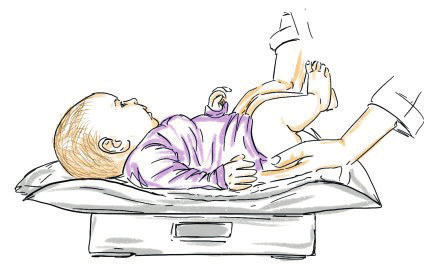
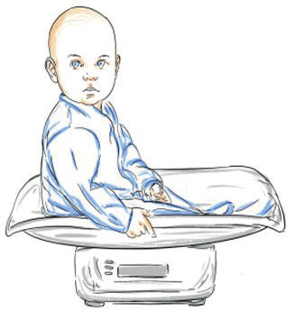
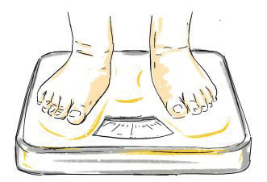
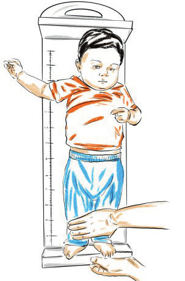
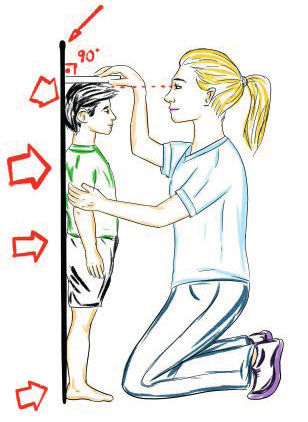
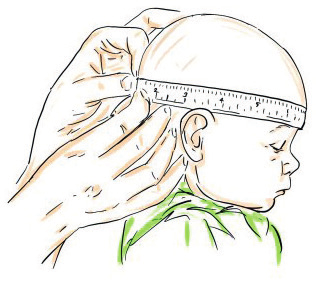

# PEDİATRİK MUAYENEDE STANDART ÖLÇÜMLER

**Hazırlayan:** Doç. Dr. Elif Çelik
**Bölüm:** Çocuk Sağlığı ve Hastalıkları

---

## GİRİŞ

Çocukluk döneminde büyüme, sürekli izlem gerektiren dinamik bir süreçtir ve bu nedenle izlemde tek bir ölçüm yerine belirli aralıklarla tekrarlanan ölçümler gereklidir.

> **Büyümenin izlenmesi**, bir çocuğun vücut ağırlığı, boy ve baş çevresinin doğumdan itibaren belirli aralıklarla ölçülerek standart büyüme eğrileri üzerinde işaretlenmesi ve bu eğrilerin değerlendirilmesi olarak tanımlanır.

---

## BÜYÜME EĞRİLERİ VE PERSENTİL KAVRAMI

Büyüme eğrisine **persentil eğrisi** adı da verilir. Büyüme eğrileri için öncelikle persentil değerleri saptanmalıdır.

> **Persentil**, çocuğun ağırlık, boy ve baş çevresi açısından yaşıtları ile karşılaştırıldığında yüzdelik sıralamadaki yerini belirten değerdir.

Büyüme eğrileri **3, 10, 25, 50, 75, 90 ve 97.** persentiller olmak üzere yedi persentil eğrisinden oluşur ve bu eğriler persentil cetvelinde yer alır.

* Ağırlık, boy ve baş çevresi açısından ölçülen değerin **3-97. persentil** eğrileri aralığında olması ✅ normal dağılım olarak kabul edilir.
* **3. persentilin altındaki** değerler ↓ yetersiz büyümeyi işaret eder.
* **97. persentilin üzerindeki** değerler ↑ aşırı büyümeyi işaret eder.

### Büyüme Eğrilerinin Hazırlanma Yöntemleri

Büyüme eğrileri iki yöntemle hazırlanabilir:

1. **Kesitsel yöntem:** Aynı yaş ve cinsiyetteki çok sayıda sağlıklı çocuktan elde edilen ve tek bir ölçüme dayalı olarak oluşturulur.
2. **Uzunlamasına (longitüdinal) yöntem:** Doğumdan adölesan dönemin sonuna kadar belirli aralıklarla izlenen daha az sayıdaki sağlıklı çocuktan elde edilen ölçümlere dayalı olarak oluşturulur.

### Hangi Büyüme Eğrileri Kullanılmalıdır?

Dünya Sağlık Örgütü (DSÖ), büyümenin izlenmesinde her ülkede DSÖ'nün uluslararası standart büyüme eğrilerinin kullanılmasını önermektedir. Ancak toplumda sağlıklı çocuklar arasında genetik yapılarına bağlı olarak ağırlık, boy ve baş çevresi büyümelerinin özellikle **2 yaşından sonra** toplumdan topluma farklılıkları olduğu gösterilmiştir. Bu nedenle eğer varsa, özellikle 2 yaşından sonra her ülkenin kendi güvenilir eğrilerinin kullanılması büyük önem taşımaktadır.

Ülkemizde büyümeyi değerlendirirken **Olcay Neyzi ve arkadaşları** tarafından Türk çocuklar için hazırlanmış ve geliştirilmiş olan ulusal büyüme eğrileri kullanılmaktadır.

**⚠️ ÖNEMLİ:**

* Hangi büyüme eğrilerinin kullanıldığından ziyade, tek bir ölçüm yapmak yerine her periyodik çocuk izleminde ölçümlerin düzenli ve belirli aralıklarla tekrarlanması, büyüme eğrileri üzerine persentillerin işaretlenmesi ve sapmaların erken fark edilmesi çok daha önemli ve yol göstericidir.
* Örneğin o anda ölçülen vücut ağırlığı 25 persentil olan bir çocuğun ağırlığı normal olarak değerlendirilebilir. Ancak daha önce ağırlığı **75 persentil** civarında seyrederken **25 persentile** gerilemiş olması çocukta akut ya da kronik bir beslenme bozukluğunun ya da kronik bir hastalığın habercisi olabilir.
* Amaç, normalden sapmaları ve büyümede duraklamayı erken dönemde fark ederek **malnütrisyonun** gelişmesini engellemektir.

Büyümeyi değerlendirmede en sık kullanılan antropometrik ölçümler:

* Yaşa göre ağırlık
* Yaşa göre boy
* Yaşa göre baş çevresi

---

## ANTROPOMETRİK ÖLÇÜMLER

### A. Vücut Ağırlığı

Vücut ağırlığı, antropometrik ölçümler içerisinde büyümenin değerlendirilmesinde en fazla kullanılan ölçümdür. Ölçme yöntemi çocuğun yaşına göre belirlenir:

* **Bebekler ve süt çocukları:** Yatarak veya oturabilenlerde oturarak dijital bebek terazilerinde ölçülür.
* **Daha büyük ve ayakta durabilen çocuklar:** Dijital veya normal baskülde ölçülür.

#### Ölçüm İlkeleri

* Bebek terazileri **10-20 grama** kadar, basküller **100 grama** kadar duyarlı olmalıdır.
* Ölçüm öncesi terazi ayarı sıfırlanmalıdır.
* Çocuğun mümkünse çıplak, değilse üzerinde en az giysinin kalması sağlanmalıdır.
* Islak alt bezi, alçı, atel varlığı gibi ağırlığın yanlış ölçülmesine neden olacak durumlarda gerekli düzeltmeler yapılmalıdır.
* Ağlayan ve hareketli olan çocuklarda ölçüm hatalı olabilir. Bu nedenle ya bebeğin sakinleşmesi beklenmeli ya da önce annenin kucağında ikisinin ağırlığı, sonra annesinin tek olarak ağırlığı ölçülerek aradaki fark hesaplanmalıdır.

Elde edilen değerin normal olup olmadığını değerlendirebilmek için çizelgede aynı yaş ve cinsiyetteki çocukların ağırlıkları ile elde edilen büyüme eğrileri üzerinde işaretlenerek ağırlık persentil değeri bulunur.

#### Doğum Ağırlığı ve Büyüme Hızı

Zamanında doğan bir yenidoğan bebeğin ortalama vücut ağırlığı:

* 👧 Kızlarda: **3200 gr**
* 👦 Erkeklerde: **3300 gr**

> **Fizyolojik ağırlık kaybı:** Doğumu izleyen ilk günlerde ödemin kaybolmasına bağlı olarak ağırlığın **%5-8**'i kaybedilir. Bebeklerin büyük çoğunluğu 7-14. günler arasında kilo almaya başlayarak **10-14 günlük** olduğunda doğum ağırlığına ulaşırlar.

| Yaş | Doğum Ağırlığına Göre |
|---|---|
| 4 ay | 2 katı |
| 12-15 ay | 3 katı |
| 2,5 yaş | 4 katı |
| 4 yaş | 5 katı |
| 10 yaş | 10 katı |

#### Prematüre Bebeklerde Ağırlık Değerlendirmesi

Prematüre doğan bebeklerde ölçümler **düzeltilmiş yaş** kullanılarak büyüme eğrilerine işaretlenmelidir. Düzeltilmiş yaş kavramı postkonsepsiyonel 40. hafta baz alınarak hesaplanır.

> **Düzeltilmiş yaş hesabı:** Postkonsepsiyonel yaş (gebelik haftası + postnatal hafta) - 40 hafta

💡 **Örnek:** 30. gebelik haftasında doğan bir bebek, doğduktan 16 hafta sonra kontrole gelmişse → Düzeltilmiş yaşı = (30 + 16) - 40 = **6 hafta**

Prematüre doğan bebeklerin **2 yaşına** kadar yaşıtlarının ağırlıklarını yakalamaları beklenir. Bu nedenle bu bebeklerde 2 yaşından sonra düzeltilmiş yaş hesabına gerek yoktur.

**⚠️ ÖNEMLİ:** Turner sendromu, Down sendromu gibi bazı hastalıklarda büyüme değerlendirilirken mutlaka **o hastalığa özel büyüme çizelgeleri** kullanılmalıdır.

---

### B. Boy (Uzunluk) Ölçümü

* **< 2 yaş:** Çocuk sırtüstü yatar pozisyondayken vücut uzunluğunun ölçülmesi tercih edilir.
* **≥ 2 yaş:** Boy ölçümü her zaman hasta ayakta iken yapılmalıdır.

Ölçüme başlamadan önce ölçümü etkileyebilecek ayakkabılar ve varsa toka gibi aksesuarlar çıkarılır.

#### Yatarak Boy Ölçümü (< 2 yaş)

Yatarak yapılan ölçümler, baş/bir tarafı sabit ve ayak/diğer tarafı hareketli olan özel bir boy ölçer ile ve mümkünse **iki kişi** ile yapılmalıdır:

1. Bebek/çocuk sırt üstü pozisyonda yatarken bir kişi, başı boy ölçerin sabit kısmına gözler tavana bakacak şekilde yerleştirir.
2. Diğer kişi dizleri ekstansiyonda ve ayak bileği eklemini **90° dorsofleksiyona** getirip ayak tabanını hareketli kısmına sabitler.
3. Hareketli kısmın bulunduğu hizada cetvelin gösterdiği rakam okunur ve boy uzunluğu olarak kaydedilir.

#### Ayakta Boy Ölçümü (≥ 2 yaş)

İki yaşından büyük çocuklarda ölçüm düz bir duvara tespit edilmiş cetvel üzerinde hareketli bir "baş tahtası" sistemi kullanılarak yapılır (**Harpenden stadiometre**).

Doğru pozisyon için aşağıdaki noktalar arkadaki duvara değdirilmelidir:

* Başın arkadaki en çıkıntılı bölgesi
* Omuzlar
* Gluteal bölge
* Bacakların arka yüzü
* Topuklar

Topuklar birbirine bitişik durumda olmalı ve çocuk tam karşıya bakmalıdır. Bu şekilde dururken baş tahtasının gösterdiği rakam okunur ve boy uzunluğu olarak kaydedilir.

**⚠️ ÖNEMLİ:** Ayakta ölçümde boy, yatarak yapılan ölçüme göre yaklaşık **1 cm daha kısadır**. Bu nedenle ayakta ölçüm yapılamayan 2 yaşından büyük çocukların boyundan 1 cm çıkarılarak persentil çizelgesine işaretlenir.

#### Doğum Boyu ve Büyüme Hızı

Zamanında doğmuş bebeklerin ortalama boyu:

* 👦 Erkek: **50 cm**
* 👧 Kız: **49 cm**

| Dönem | Uzama Miktarı |
|---|---|
| İlk 3 ay | 8 cm |
| 2. üç ay (3-6 ay) | 8 cm |
| 3. üç ay (6-9 ay) | 4 cm |
| 4. üç ay (9-12 ay) | 4 cm |
| **1 yaşında toplam** | **~75 cm (doğum boyunun 1,5 katı)** |

| Yaş | Doğum Boyuna Göre |
|---|---|
| 4 yaş | 2 katı |
| 7,5 yaş | 2,5 katı |
| 12 yaş | 3 katı |

| Yaş Aralığı | Yıllık Uzama |
|---|---|
| 1-2 yaş | 10 cm |
| 2-3 yaş | 7,5 cm |
| 3-4 yaş | 7,5 cm |
| 4 yaş → ergenlik | 5-6 cm/yıl |

💡 Çocuklar **2-2,5 yaş** arasında yetişkin boylarının yarısına ulaşır.

Prematüre doğan bebeklerin boyu **40 aylık** olana kadar düzeltilmiş yaş hesaplanarak persentil çizelgelerine işaretlenir.

Boy, uzun süreli yetersiz beslenme (malnütrisyon) dışında genetik, hormonal ve metabolik kemik hastalıklarından da etkilenir. Bu nedenle boy aslında çocuğun **o andaki değil, geçmişteki genel sağlık durumunun** bir göstergesidir.

---

### C. Baş Çevresi

> **Baş çevresi (oksipito-frontal çevre)**, beyin büyümesinin bir yansımasıdır.

Tüm sağlıklı çocuklarda beyin gelişiminin en hızlı olduğu **üç yaşına** kadar her muayenede ölçülmelidir. Nörolojik veya gelişimsel problemi olan çocuklarda ise yaştan bağımsız olarak muayenede ölçülmelidir.

💡 Küçük çocuklar genellikle başlarının ölçülmesinden hoşlanmadıklarından, ölçüm fizik muayenenin sonuna bırakılabilir.

#### Ölçüm Tekniği

* Baş sabit tutulmalıdır.
* Başın **en geniş çevresi** ölçülür.
* Esnemeyen bir mezura ile önde **kaşların hemen üzerinden** başlayıp arkada **oksipital bölgenin en çıkıntılı kısmını** içermelidir.
* Kulaklar mezuranın altında kalmamalıdır.

**⚠️ ÖNEMLİ:** Ölçümün yapılacağı yerde kaput suksadenum veya sefal hematom gibi bir şişlik varlığında ölçüm yaşamın **3. veya 4. gününde** yapılmalıdır.

Ölçümler, yaşa ve cinsiyete özgü persentil çizelgelerine işaretlenerek değerlendirilir.

#### Doğumda Baş Çevresi

* 👦 Erkek bebek: **34,5 cm**
* 👧 Kız bebek: **33,9 cm**
* Ortalama: **~35 cm**

Baş çevresindeki en hızlı büyüme, beyin büyümesine paralel olarak **ilk altı ayda** olur.
