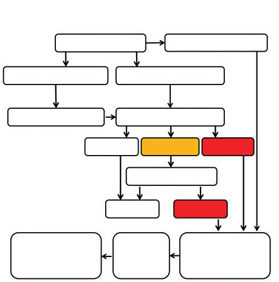
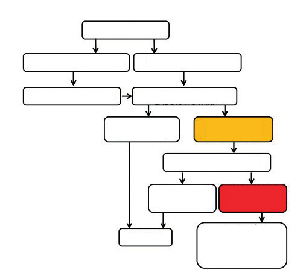
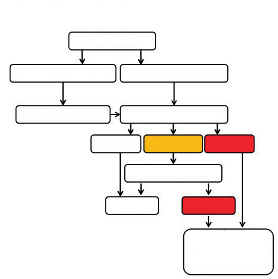
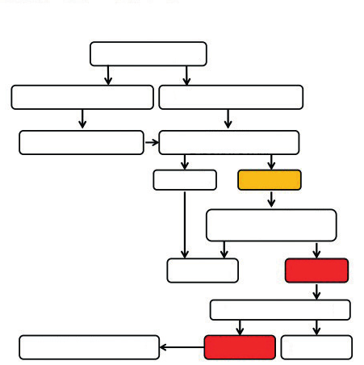
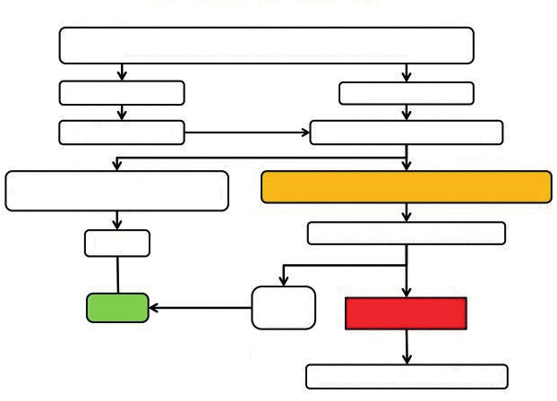
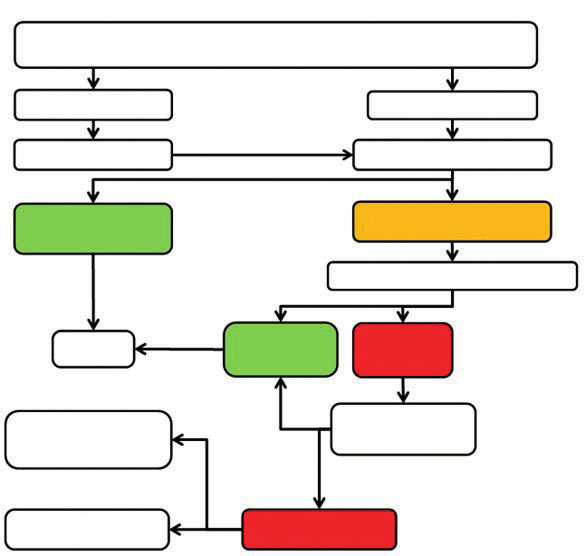
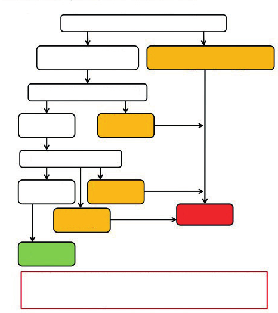
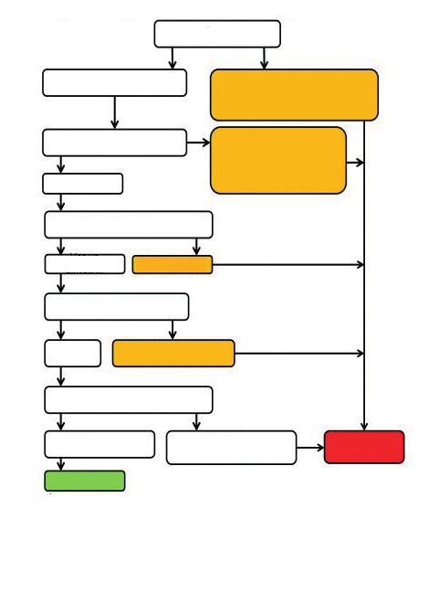

# SAĞLIKLI ÇOCUK İZLEMİ

**Hazırlayan:** Doç. Dr. Elif Çelik
**Bölüm:** Çocuk Sağlığı ve Hastalıkları

---

## GİRİŞ

Sağlıklı çocuk izlemi; bebek, çocuk ve ergenlere yönelik birinci basamak çocuk sağlığı ve hastalıkları hizmetlerinin temelini oluşturur. Ancak sadece sağlıklı çocukların değil, tüm çocukların büyüme ve gelişmelerinin izlendiği, sağlık durumunun değerlendirildiği, aşı, aile ve sağlık eğitimi gibi koruyucu hekimlik uygulamalarının sunulduğu bir sağlık izlemi ve hizmetidir. Bu hizmetten yararlanmak ise **her çocuğun hakkıdır.**

Sağlıklı çocuk izleminde amaç; çocuğun her açıdan (motor, duygusal ve entelektüel) sağlıklı büyümesinin sağlanması, bebek ve çocuk ölümlerinin, hastalık ve sakatlıkların azaltılması ve önlenmesidir. Bu amaçla gerçekleştirilen izlemlerin sıklığı ve zamanlaması çocuğa, çocuğun büyüme-gelişme dönemlerine, aşı programına ve ailesine göre belirlenir. Çocuk sağlığı izlemi **prenatal dönemden** başlar, **ergenlik (adölesan) döneminin sonuna** kadar devam eder.

Ülkemizde Sağlık Bakanlığı tarafından önerilen izlem sıklığı aşağıda gösterilmiştir:

| İzlem Zamanı |
|---|
| Doğumda ve doğumdan hemen sonra |
| Doğumdan sonra 3-5. günler veya doğum sonrası taburculuktan 48-72 saat içinde |
| 15.-41. gün ve 2. ay |
| 3.-4. ay |
| 6., 9. ve 12. ay |
| 13-36 ay arası 6 ayda bir |
| 4-9 yaş arası yılda bir |
| 10-18 yaş arası (10-14 yaş arasında bir kez, 15-18 yaş arasında bir kez) |

---

## ÇOCUK SAĞLIĞI İZLEM BASAMAKLARI

1. Aile ile doğru iletişim sağlama, görüşme ve öykü / aile, çevre, çocuk ilişkisi gözlemi
2. Riskli durumları belirleme
3. Fizik muayene
4. Büyüme ve gelişmeyi değerlendirme
5. Taramaları gerçekleştirme
6. Aşılama
7. Çocuk ile ilgili sorunları saptama ve çözüm planı oluşturma
8. Aileleri bilgilendirme, onlara kılavuzluk etme
9. Annenin soruları ve özetleme
10. Randevu oluşturma

---

## 1. AİLE İLE DOĞRU İLETİŞİM SAĞLAMA, GÖRÜŞME VE ÖYKÜ

Çocuk sağlığı izlemleri çocuklar için uygun bir ortamda, anne baba yanında veya bakımına yardımcı olan kişiler ile birlikte yapılmalıdır. Aile ile doğru iletişim kurulduğunda çocuk ile ilgili bilgiler doğru ve eksiksiz biçimde elde edilebilir. Samimi ve sıcak bir tavırla çocuk ve aile üyelerini karşılamak ve tanışmak, "hoş geldiniz" demek, görüşme esnasında aile üyeleri ile göz teması kurulacak şekilde aynı seviyede oturmak, henüz konuşamayan çocuklarla jestlerle, konuşabilen çocuklarla soru-cevap şeklinde iletişim kurmak, çocuğun ve ailenin kaygılarının doktorla paylaşılmasını, iş birliğini ve var olan olumlu uygulamaların sürdürülmesini sağlar.

Bu esnada bir yandan annenin bebeğine karşı tutumu ve duygu durumu, emzirme, emzik kullanımı, kundaklama, çocuk ihmal ve istismarı bulguları (bakımsız bebek, ilgisiz anne, annenin veya bakıcının bebeğe sert tavırları vb.) ve aile bireylerinin kendi aralarındaki ilişkileri gözlenmelidir. Ailenin çocuğa karşı olan olumlu davranışlarının fark edilerek övülmesi hem bu davranışların sürekliliğini sağlar hem de ailelerin özgüvenini arttırır.

Her izlemin başında ve sonunda ailenin ve çocuğun sorularını ve kaygılarını öğrenmeye çalışmak ve dinlemek oldukça önemlidir. Çocuğun bakımını sağlayan kişi çocukla en uzun süreyi geçirdiğinden kaygıları çocuk sağlığı anlamında önemli olmasa bile ciddi bir şekilde dinlenmeli ve değerlendirilmelidir. Çocuk sağlığı izleminin amacına ulaşabilmesi için her bir değerlendirmeye **en az 20 dakika** zaman ayrılmalıdır. İzlemler sırasında mutlaka düzenli kayıtlardan oluşan bir izlem dosyası oluşturulmalı, dosyaya çocuğun adı, soyadı, doğum tarihi, adres ve telefon bilgileri kaydedilmelidir. Çocuğun var olan dosyası (öyküsü, geçmiş muayene bulguları, aldığı tedaviler vb.) incelendikten sonra muayeneye başlanmalıdır.

Sorunların anlaşılması ve tanı konulmasında iyi alınmış bir öykü oldukça önemlidir. İlk başvuruda; ayrıntılı şekilde annenin gebeliği **(prenatal)**, çocuğun doğumu **(natal)** ve doğum sonrasına ilişkin bilgiler **(postnatal)** ile ailede mevcut olan (soygeçmiş) sağlık sorunları hakkında öykü alınarak kaydedilmeli ve varsa değişiklikler her ziyarette güncellenmelidir. Rutin kontrolde ise son başvurudan itibaren yaşanan gelişmelerin öyküsü alınır. Güncel şikayetleri, beslenme, aşı, aşı yan etkileri, gelişim basamakları, ev ortamı, yaşadığı çevre gibi çocuğun sağlığını yakından ilgilendiren konular da sorgulanmalıdır. İnce ve kaba motor gelişim ve dil gelişimiyle ilgili ayrıntılı sorular sorularak çocuğun gelişiminin hangi aşamada olduğu ve yaşına uygun olup olmadığı değerlendirilmelidir.

---

## 2. RİSKLİ DURUMLARI BELİRLEME

İlk izlemde öykü alınırken ileride gelişmesi olası hastalık riskleri ile ilgili aileye sorulması gereken sorular aşağıda verilmiştir:

**Gelişmesi muhtemel hastalık riskleri ile ilgili sorulması gereken sorular:**

* Yakın akrabalar arasında 3 yaşından önce görme veya işitme sorunu olan kimse var mı?
* Yakın akrabalar arasında gelişimsel kalça displazisi olan var mı?
* Yakın akrabalar arasında zihinsel gelişme geriliği olan var mı?
* Yakın akrabalar arasında yakın zamanda tüberküloz tedavisi almış olan veya almakta olan biri var mı?
* Yakın akrabalar arasında 50 yaşından önce iskemik kalp hastalığı gelişmiş kimse var mı?
* Yakın akrabalar arasında önceki sorular dışında önemli bir hastalığı olan var mı?

Ayrıca, kardeş ölümü, gebelik ve doğum ile ilgili bilgiler, annenin gebelikte geçirdiği ya da gebelik öncesinde var olan ve gebelikte de devam eden hastalıkları, kullandığı ilaçlar, gebelik izleminin uygun koşullarda yapılıp yapılmadığı, hastane dışı doğumlarda yenidoğan taramalarının ve K vitamini uygulamasının yapılıp yapılmadığı detaylı bir şekilde sorgulanarak öğrenilmelidir.

---

## 3. FİZİK MUAYENE

Sağlam çocuğun fizik muayenesi, çocuğun şikayetinin olup olmadığına bakılmaksızın **her ziyarette eksiksiz bir şekilde** yapılmalıdır.

Öncelikle çocuğun takvim yaşı doğru bir şekilde hesaplanmalıdır. Her kontrolde **vücut ağırlığı**, **boyu** ve **3 yaşına kadar baş çevresi** ölçümleri yapılmalıdır. Ölçümler mümkünse aynı kişi tarafından, ayarlanabilen, hassas ölçü aletleri ile yapılmalıdır (Bkz: Pediatrik muayenede standart ölçümler). Ölçümler her defasında büyüme eğrileri üzerine işaretlenerek büyüme parametreleri izlenmeli, büyüme ve gelişme değerlendirilmeli, yorumlanmalı ve aile ile paylaşılmalıdır. Her çocuğun kendisine ait büyüme eğrileri olması oldukça önemlidir.

Fizik muayene aynı zamanda kafa şekil bozuklukları, doğuştan kalp hastalığı, konjenital anomaliler, konjenital adrenal hiperplazi, büyüme-gelişme geriliği, gelişimsel kalça displazisi, inmemiş testis, umbilikal ya da inguinal herni, ürogenital anomaliler, yarık dudak-damak, orta hat defektleri ve diş çürüğü gibi pek çok hastalığın **tarama yöntemidir.**

---

## 4. BÜYÜME VE GELİŞMEYİ DEĞERLENDİRME

Büyüme ve gelişme, çocukları erişkinlerden ayıran en önemli özelliklerdir.

### 4.1. Büyümenin İzlenmesi

> **Büyüme**, her organ sistemindeki kütle ve hacim artışını belirtir ve büyümenin izlenmesi çocuk sağlığı izleminin en önemli parçalarından biridir.

Büyümenin izlenmesinde **kilo, boy ve baş çevresinin** değerlendirilmesi ve uygun biçimde yorumun yapılması çok önemlidir. Büyümenin değerlendirilmesi yaşla birlikte farklılıklar gösterir. Ergenlik döneminde ise büyümenin doğru olarak izlenebilmesi için puberte gelişiminin de değerlendirilmesi gerekir (Bkz: Normal pubertal gelişim). Büyümenin izlenmesinde çok çeşitli ulusal ve uluslararası büyüme eğrileri kullanılmaktadır (Bkz: Pediatrik muayenede standart ölçümler).

Çocuğun büyümesindeki hızlı ve yavaş dönemlere göre büyüme hızı da değişmektedir. Zamanında doğmuş sağlıklı çocuklar, yaşamlarının **6-18. ayları** arasında genetik temelleri nedeniyle izlendikleri büyüme eğrilerinde aşağı veya yukarı yönlü sapmalar yaşayabilir. Bu sapmalar genellikle iki majör persentil çizgisi arasında kalır ve buna **büyüme varyasyonu** denilir. Bu değişikliklerin olmasının normal olduğu aileye anlatılmalıdır.

**⚠️ ÖNEMLİ:**

* Boy veya kilo ölçülerinin **3. persentil altında** veya **95. persentil üzerinde** olması durumunda çocuklar mutlaka ayrıntılı bir şekilde değerlendirilmelidir.
* Ağırlık, boy ve baş çevresi eğrileri arasında **iki majör persentilden fazla fark** olması durumunda çocuklar mutlaka değerlendirilmelidir.
* Bir tam yıl içinde **25. persentilden az** büyüyen bir çocuğun yeterli büyümediği kabul edilir.

### 4.2. Gelişmenin İzlenmesi

> **Gelişme**, her organ sistemindeki işlevsellik artışını belirtir.

Gelişimsel izlem ve değerlendirme; öykü, gözlem, fizik muayene basamaklarını içeren, beraberinde uygun bir tarama testi ile tanısal yaklaşımı güçlendiren, tanısı henüz kesin olmasa da gereksinim üzerinden hemen erken müdahaleye yönlendirebilen, çocuğun, ailesi ve yaşadığı toplum ile birlikte değerlendirildiği bir yaklaşım bütünüdür.

Çocukların ilk yıllarda aylara göre, sonrasında ise yaşa göre yapması gereken beceriler değişir ve beklenen normal gelişim basamaklarına ulaşır. Gelişimin değerlendirilmesi genel olarak **4 temel alan** üzerindedir:

1. **Motor**
   * Kaba motor
   * İnce motor
2. **İletişim**
   * Dil (alıcı ve ifade edici dil)
3. **Bilişsel**
4. **Duygusal-Sosyal**

Her izlemde çocuklar bu temel alanlara göre sorgulanmalıdır. Bunların dışında hem bu alanları destekleyen hem de bu alanlardan etkilenen iki önemli alan daha vardır:

1. **Duyusal beceriler**
2. **Özbakım becerileri**

Gelişim, çevreyle etkileşim ile değişen, risklere her zaman açık, bireysel farklılıkların sıkça görülebildiği bir süreçtir. Bu nedenle çocukların gelişimsel olarak potansiyellerinin en üstüne ulaşabilmeleri için **tüm çocukların gelişiminin izlenmesi, değerlendirilmesi ve desteklenmesi** gereklidir. Bununla birlikte gelişimin sadece izlenmesinin tanı koymak ve yönlendirmekte yetersiz kaldığı gösterilmiştir. Bu nedenle **izlem ve tarama testleri birlikte** önerilmektedir.

Bir çocuğu en iyi tanıyan ailesi ve bakım verenlerine işitmesi, konuşması, ellerini kullanması, vücut hareketleri, isteklerini anlatabilmesi, iletişim kurması, oynadığı oyunlar hakkında sorular sorularak önemli bilgilere ulaşılabilir.

#### 4.2.1. Aylara ve Yaşlara Göre Gelişimin Değerlendirilmesi

**Yenidoğan dönemi gelişimi**

Uyanıkken ebeveyne bakar ve onları inceler; kucağa alındığında sakinleşir. Ağlama ve yüz ifadeleri, vücut hareketleri, kolların ve bacakların hareketi gibi davranışlar yoluyla rahatsızlığını iletir. Görsel veya işitsel uyaranlara yanıt olarak hareket eder. Moro ve tonik boyun reflekslerinde gözlenir. Kolları ve bacakları refleks olarak hareket ettirir. Ellerini yumruk şeklinde tutar; başkalarının verdiği parmağı veya nesneleri otomatik olarak kavrar (yakalama refleksi).

**1. ay gelişimi**

Ebeveyne bakar ve gözleri ile takip eder. Ellerini ağzına götürmek gibi kendini rahatlatan davranışlara sahiptir. Sıkıldığında telaşlanır, kucağa alındığında veya konuşulduğunda sakinleşir. Objelere kısa süre bakar. Kısa kısa sesler çıkarır. Beklenmeyen sese karşı uyarılıp susar veya ebeveynin sesine döner. Her iki kolu ve her iki bacağını birlikte hareket ettirir. Yüzüstü pozisyonda iken çenesini kaldırabilir. Dinlenme anında parmaklarını hafifçe açar.

**2. ay gelişimi**

Mutluluk ve üzüntüsünü gösteren sesler ile kısa mırıldanma sesleri çıkarır. Yüzüstü pozisyonda başını ve göğsünü kaldırır. Oturma pozisyonunda tutulduğunda başını sabit tutar. Ellerini açar ve kapatır.

**3. ay gelişimi**

Keyif sesleri çıkarır. Tanıdığı kişiye ve eşyaya uzanır. Beslenmeyi tanır. Elleri açıktır, eşyayı yakalar ve kendine çeker. Yüzüstü pozisyonda kolları ile gövdesini kaldırır. Başını net olarak dik tutar.

**4. ay gelişimi**

Yüksek sesle güler. Seslere döner. Yüzüstü pozisyonda iken kendini dirsek ve bileklerinden destekler ve sırtüstü pozisyona döner. Ellerini açık tutar, orta hatta parmakları ile oynar ve nesneleri kavrar.

**6. ay gelişimi**

İsmi ile çağrıldığında bakar. "ma", "ba" gibi sesler çıkarır. Sırtüstü pozisyondan yüzüstü pozisyona dönebilir. Desteksiz kısa bir süre oturur. Oyuncağını bir elinden diğerine geçirir.

**9. ay gelişimi**

Kaldırılmak için kollarını kaldırır. El sallayarak "bay bay" yapar. Düşen nesneleri arar. İsmi ile çağrıldığında döner. Net olmayan bir şekilde "baba" veya "anne" diyebilir. "Emziğin nerede?" veya "oyuncağın nerede?" gibi sorularda etrafına aramak için bakar. Ebeveynin çıkardığı sesleri taklit eder. Desteksiz oturur. Oturma ve yatma pozisyonu arasında rahat bir şekilde geçiş yapar. Emekleyebilir. Ayakta durmayı sever. Yemek için yiyeceğini ve küçük nesneleri baş ve işaret parmağı ile alır. Nesneleri bilinçli olarak bırakır ve nesneleri birbirine vurur.

**12. ay gelişimi**

Gizli nesneleri arar. Yeni hareketleri taklit eder. Anne-baba dışında da bir kelime kullanabilir. Basit emirleri anlar. İlk bağımsız adımlarını atar. Desteksiz ayakta durur. Baş ve işaret parmağını kıskaç gibi kullanarak küçük nesneleri toplar.

**15. ay gelişimi**

Yazı yazmayı taklit eder. Bardaktan çok az miktarda dökerek içebilir. Bir şey istemek için yardım alır. "Topun nerede?", "Oyuncağın nerede?" gibi sorulardan sonra anlamlı şekilde etrafına bakınır. İsimler dışında 3 kelime kullanır. Bilinmeyen bir dilde konuşuyor gibi sesler çıkarır. Koşar. Pastel boya ile boyama yapabilir. Nesneyi kutunun içine düşürüp oradan çıkarır.

**18. ay gelişimi**

Başkalarıyla oyun oynamak için etkileşim kurar. Kendisini giydirene yardımcı olur. Kaşık kullanmaya başlar. Yardım istemek için kelimeleri kullanır. Vücudunun en az 2 parçasını bilir. En az 5 tanıdık nesneyi adlandırır. Elinden tutularak merdivenden yukarı çıkar. Küçük sandalyede oturur. Yürürken oyuncak taşıyabilir. Küçük bir topu ayaktayken birkaç metre uzağa fırlatır.

**24. ay gelişimi**

Diğer çocuklarla birlikte oyun oynar. Kaşığı güzel bir şekilde kullanır. Kıyafetlerinin bir kısmını kendisi çıkarır. Yaklaşık 50 kelime kullanır; 2 kelimeyi kısa cümle şeklinde veya cümle halinde birleştirir. İki aşamalı komutları takip eder. En az 5 vücut parçasını bilir. Yabancılarla %50 oranında anlaşılır kelimelerle konuşur. Yerden iki ayakla zıplar. Dengeli bir şekilde koşar. Oyun alanında bir merdivene tırmanır. Nesneleri üst üste dizebilir, kitap sayfalarını çevirir. Kapak gibi nesneleri döndürmek için ellerini kullanır.

**2.5 yaş gelişimi**

Bir lazımlık veya tuvalete çişini yapar. Çatalla yemek yer. Ellerini yıkar ve kurutur. Ebeveynine "Bana bak!" diyerek onların izlemesini sağlamaya çalışır. Zamirleri doğru kullanır. Merdivenlerden yukarı, ayaklarını değiştirerek çıkar. Düşmeden iyi bir şekilde koşar. Boya kalemini yumruk yerine başparmak ve parmakları ile kavrar. Büyük topları yakalar.

**3 yaş gelişimi**

Kendi kendine çişini yapar. Tek başına ceket veya gömlek giyer. Bağımsız olarak yemek yer. Oyunları işbirliği içinde oynar ve oyuncaklarını paylaşır. Üç kelimelik cümleler kurar. Yabancılarla %75 oranında anlaşılır kelimelerle konuşur. Daha büyük veya daha kısa gibi kelimeleri kullanarak nesneleri karşılaştırır. Üç tekerlekli bisiklet sürebilir. Kanepe veya sandalyeye tırmanıp iner. İleri doğru atlar. Başı olan bir insan ve bir vücut parçası çizer. Çocuk makası ile keser.

**4 yaş gelişimi**

Banyoya girer ve tek başına kaka yapabilir. Dişlerini fırçalar. Kıyafetlerini fazla yardım almadan giyer ve çıkarır. "Üşüdüğünde, üzgün olduğunda veya acıktığında ne yaparsın?" gibi soruları yanıtlar. 4 kelimelik cümleler kullanır. Yabancılarla tamamen anlaşılır kelimelerle konuşur. Tahta ve kart oyunları oynarken basit kuralları takip eder. Tek ayak üzerinde zıplar. Merdivenleri, ayaklarını desteksiz olarak değiştirerek çıkar. En az 3 vücut parçası olan bir kişiyi çizer. Kalemi yumruk yerine başparmak ve parmaklarla kavrar.

**5 ve 6 yaş gelişimi**

Bir ayağın üzerinde atlar. Bir düğüm atabilir. En az 6 vücut parçası olan bir kişiyi çizebilir. Bazı harfleri ve sayıları yazabilir. Kareleri ve üçgenleri kopyalayabilir. İyi bir dil becerisine sahiptir ve 10'a kadar sayabilir; 4 veya daha fazla rengi bilir. Basit talimatları takip eder.

**7 ve 8 yaş gelişimi**

Sosyal ve duygusal ve özdenetim yeterliliği gösterir. Sağlıklı beslenme ve fiziksel aktivite davranışlarına katılım gösterir.

**9 ve 10 yaş gelişimi**

Problem çözme becerileri dahil bağımsız karar verme becerilerini kullanır. Özgüven ve umutsuzluk duygusunu gösterir.

**Erken ergenlik dönemi gelişimi (11-14 yaş)**

Fiziksel, bilişsel, duygusal, sosyal ve ahlaki yeterlilikleri gösterir. Şefkat ve empati sergiler.

**Orta ergenlik dönemi gelişimi (15-17 yaş)**

Fiziksel, bilişsel, duygusal, sosyal ve ahlaki yeterlilikleri gösterir. Şefkat ve empati sergiler.

***

#### Gelişmede Alarm Veren Bulgular

| Yaş | Alarm Bulgusu |
|---|---|
| 2 ay | Görüntü ve seslere doğru dönüp yanıt vermeme |
| 3 ay | Başını dik tutmama |
| 4-5 ay | Sosyal gülümseme ya da ses çıkarmanın olmaması |
| 8-9 ay | Eşyalara uzanamama ya da duygu/ifadeleri paylaşmama |
| 12 ay | Ebeveynleri veya bakıcısı ile ifade ya da taklit sesleriyle iletişim kurmama |
| 18 ay | İki aşamalı emirleri izlemenin olmaması |
| 24 ay | İhtiyaçlarının karşılanmasını istemede sözcükleri kullanmama |
| 36-48 ay | Bakıcıyla düşünsel paylaşımın olmaması (aynı anda ortak bir nesneye ya da oyuna ilgi göstermeme) |

---

## 5. TARAMALARI GERÇEKLEŞTİRME (ERKEN TANI VE TEDAVİ)

> **Taramalar**, toplumda sık görülen ve erken dönemde belirtisiz olan sağlık sorununun tespit edilmesine yönelik erken tanı yaklaşımlarıdır. Amaç; sorunun kalıcı bozukluklara neden olmadan tanınması ve düzeltilmesidir.

Çocuk sağlığı izleminde öykü, gözlem, fizik muayene, laboratuvar testleri ve sağlık sorununa özel yöntemler ile pek çok hastalık erken dönemde taranabilmektedir. Ayrıca, tüm yenidoğanlar önceden belirlenmiş standartlara uygun şekilde taranır.

### 5.1. Yenidoğan Taramaları

#### 5.1.1. Yenidoğan Topuk Kanı Tarama Programı

Ülkemizde doğan her bebek aşağıdaki hastalıklar yönünden taranmaktadır:

* Konjenital hipotiroidi
* Fenilketonüri
* Biotinidaz eksikliği
* Kistik fibrozis
* Konjenital adrenal hiperplazi

Ağızdan beslendikten en az **48 saat** sonra topuktan kan örneği alınır. Eğer bebek doğduğu sağlık kurumundan 48 saat tamamlanmadan taburcu edilecekse, ilk kan örneği taburcu edilmeden önce mutlaka alınmalı, bebek yeterince beslendikten sonra ilk hafta içinde yeni örnek alınması için mutlaka **aile hekimine yönlendirilmelidir.**

***

**5.1.1.a. Konjenital Hipotiroidi Taraması**

Ülkemizde tarama testi olarak **TSH düzeyine** bakılmaktadır.

* Uygun kan örneğinde TSH **<5,5 mIU/L** → Normal
* TSH **5,5-20 mIU/L** → Tekrar kan örneği alınır
  * Normal → Takip
  * **≥5,5 mIU/L** → İldeki uygun laboratuvarda serum T4 ve TSH bakılması, danışman hekim görüşü alınması
* TSH **>20 mIU/L** → Pediatrik endokrinoloji kliniğine sevk
* Bebek 1 aydan büyükse → Doğrudan venöz kanda T4 ve TSH birlikte bakılmalıdır

***

**5.1.1.b. Biotinidaz Eksikliği Taraması**

Biotinidaz eksikliği, otozomal resesif geçişli kalıtsal bir hastalıktır. **Fluorometrik test** yöntemi ile **biotinidaz enzim aktivitesine** bakılır.

* Enzim aktivitesi var (**65 MRU üzeri**) → Normal
* Enzim aktivitesi düşük veya yok (**65 MRU ve altı**) → Tekrar kan örneği alınır
  * Tekrarda enzim aktivitesi var → Normal
  * Tekrarda enzim aktivitesi düşük veya yok → **Pediatrik beslenme ve metabolizma kliniğine sevk**

> **MRU:** Measurement Response Unit

***

**5.1.1.c. Fenilketonüri Taraması**

Fenilalanin hidroksilaz enzim eksikliği nedeni ile fenilalaninin tirozine dönüşememesi sonucu biriken fenilalaninin neden olduğu hastalık tablosudur. **Fluorometrik immunoassay (FIA)** yöntemi ile **fenilalanin düzeyine** bakılır.

* Fenilalanin **≤2 mg/dl** → Normal
* Fenilalanin **2,1-3,9 mg/dl** → Tekrar kan örneği alınır
  * Normal → Takip
  * **≥2,1 mg/dl** → Pediatrik beslenme ve metabolizma kliniğine sevk
* Fenilalanin **≥4 mg/dl** → **Pediatrik beslenme ve metabolizma kliniğine sevk**

***

**5.1.1.d. Kistik Fibrozis Taraması**

Kistik fibrozis, otozomal resesif geçiş gösteren, tüm sistemlerdeki ekzokrin bezleri etkileyen kalıtsal bir hastalıktır. Tarama, **immünoreaktif tripsinojen (IRT) düzeyi** ölçülerek yapılır.

* IRT **<90 µg/L** → Normal
* IRT **≥90 µg/L** → 7-14. gün tekrar kan örneği alınır
  * Normal → Takip
  * **≥70 µg/L** → Ter testi için sevk
    * Ter testi normal → Takip
    * Ter testi şüpheli → **İlgili kliniğe sevk**

***

**Topuk kanı tarama testi yapılmamış çocuklara yaklaşım:**

* Yaşamın ilk 6 ayında tarama yapılmamış her bebekten **fenilketonüri ve biotinidaz** için kan alınmalıdır
* **Konjenital hipotiroidi** için bir ayını geçen bebeklerde venöz kanda T4 ve TSH birlikte bakılmalıdır
* **Kistik fibrozis** için üç aylıktan büyük çocuklarda tripsinojen düzeyi düştüğünden, doğrudan **ter testi** yapılmalıdır
* Uzamış sarılığı olan çocukta tarama sonuçları normal olsa da venöz kanda T4-TSH düzeyi bakılmalıdır

***

**5.1.1.e. Yenidoğanın Konjenital Adrenal Hiperplazi Taraması**

Konjenital adrenal hiperplazi (KAH), otozomal resesif geçiş gösteren, adrenal kortekste kortizol sentezi için gerekli enzim sentez basamaklarından birinde eksiklik olması sonucu gelişen bir grup hastalığı kapsar. Ülkemizde KAH taraması **Ocak 2022** yılı itibarıyla yenidoğan tarama programına girmiştir.

Bu taramada, tek örnekten **iki basamaklı** bir KAH taraması uygulanmaktadır:

* **Birinci basamak:** 17α-hidroksiprogesteron (17-OHP) düzeyi ölçülmektedir
* **İkinci basamak:** 17-OHP düzeyinin kesim seviyesinin üzerinde olduğu durumlarda eşzamanlı analiz ile steroid profili tayin edilmektedir

* Tüm term bebekler ile ≥32 hafta ve ≥1500 gr prematüre bebekler taranır
* **Birinci basamak analiz (17-OHP):**
  * ≥36 hafta ve ≥2500 gr bebekler: **<10 ng/mL** → Normal
  * 32-35 hafta ve 1500-2499 gr prematüre bebekler: **<15 ng/mL** → Normal
  * Eşik değerin üzerinde → Aynı örnekten ikinci basamak analiz
* **İkinci basamak analiz:**
  * Analiz sonucu normal → Takipten çıkar
  * **21S+17OHP/F ≥1** ve/veya **11S ≥10 ng/mL** → Pediatrik endokrinoloji kliniğine sevk

> **Kısaltmalar:** 17-OHP: 17-Hidroksiprogesteron, F: Kortizol, 21S: 21-Deoksikortizol, 11S: 11-Deoksikortizol

***

**5.1.1.f. Spinal Musküler Atrofi (SMA) Taraması**

Spinal musküler atrofi (SMA), kraniyal sinir motor çekirdekleri ve omurilikte yer alan ön boynuz motor nöron hücrelerinin geri dönüşümsüz kaybı ve bunun sonucunda ortaya çıkan kas atrofisi ve güçsüzlüğü ile karakterize olan bir grup genetik hastalıktır. En sık görülen hastalık formu **otozomal resesif** olarak kalıtılır. Ülkemizde **09.05.2022** tarihi itibarıyla yenidoğan tarama paneline eklenmiştir.

Bu taramada, alınan örnekten **SMN1 geni moleküler genetik analizi** yapılmaktadır. Kesin tanı, SMN1 moleküler genetik analizinde patojenik varyantın tespiti ile konur.

* Tüm bebeklerden ilk 48 saatte kan örneği alınır
* SMN1 geni moleküler analizi yapılır
* **Mutasyon saptanmadı** → Takipten çıkar, aile ve aile hekimine bilgi verilir, rapor E-Nabız'a düşürülür
* **Heterozigot ya da homozigot mutasyon var** → Aynı DNA örneğinden tekrar analiz
  * Tekrar analizde mutasyon saptanmadı → Takipten çıkar
  * **Homozigot mutasyon var** → Aynı örnekte farklı bir moleküler yöntemle doğrulama → **Pediatrik nöroloji kliniğine sevk**

***

#### 5.1.2. Yenidoğan İşitme Tarama Programı

Her yenidoğan bebeğin işitmesi doğumundan sonraki ilk **72 saat** içerisinde mutlaka tarama testi ile değerlendirilmelidir. Ülkemizde yenidoğanlara işitme taraması olarak, **beyin sapı işitsel uyarılmış yanıtı (ABR)** testi yapılmaktadır. Bu test, periferik işitmeyi değerlendirir, ancak işitme sinirindeki (santral) sorunları belirleyemez. Bu nedenle, işitme kaybı açısından riskli olan yenidoğanlar, taramadan geçse bile işitme testi tekrarlanmalı ve izlemlerde işitme yönünden değerlendirmelere devam edilmelidir.

**İşitme kaybı için risk faktörleri:**

* Ailede çocukluk çağında işitme kaybı öyküsünün varlığı
* ≥5 gün yenidoğan yoğun bakım ünitesinde yatmış olmak
* TORCH enfeksiyonu
* Doğum ağırlığının ≤1500 gr olması
* Kan değişimi gerektiren hiperbilirubinemi
* Aminoglikozid, diüretik gibi ototoksik ilaç kullanımı
* ECMO ile tedavi
* Bakteriyel sepsis/menenjit
* ≥5 gün mekanik ventilasyon tedavisi
* İşitme kaybı ile birlikte olabilecek sendromlar
* Travma

Risk faktörlerinden bir ya da daha fazlasını taşıyan çocuklara **24-30 ay** arasında en az bir kez işitme testi yapılmalıdır.

Risk faktörü olmasa da **4, 5, 6, 8 ve 10 yaş** izlemlerinde işitme taraması yapılması önerilmektedir.

***

#### 5.1.3. Yenidoğan Siyanotik Kalp Hastalığı Tarama Testi

Özellikle duktusa bağımlı sağdan sola şantlı siyanotik doğuştan kalp hastalıklarının (büyük arter transpozisyonu, total anormal venöz dönüş anomalisi, Fallot tetralojisi, pulmoner kapak atrezisi) erken dönemde tanınması için doğumun **24-48. saatleri** arasında **nabız oksimetre** ile tarama testi yapılmalıdır.

* Sağ el (preduktal) ve ayaklardan herhangi birinden (postduktal) ölçülen oksijen saturasyonları arasında **<%3 fark** olması ve saturasyonun herhangi birinde **>%95** olması → ✅ Testten geçti
* Testi geçemediği durumda → 1 saat sonra ölçüm tekrarlanmalı
* Değişiklik olmaması durumunda → ❌ Mutlaka **pediatrik kardiyoloji uzmanına** yönlendirilmelidir

---

### 5.2. Demir Eksikliği Anemisi (Hemoglobin) Taraması

Çocuklarda en sık görülen anemi **demir eksikliği anemisidir.** Demir eksikliği anemisi gelişiminden korunmak için:

* **Zamanında doğan bebekler:** 4. ayından itibaren **2-3 mg/kg/gün** dozunda koruyucu (profilaktik) demir tedavisi başlanmalıdır
* **Erken doğan bebekler:** 2. ayından itibaren **2-3 mg/kg/gün** dozunda koruyucu demir tedavisi başlanmalıdır

Ülkemizde Sağlık Bakanlığı tarafından önerilen demir eksikliği anemisi tarama uygulaması **9. ayda hemogram kontrolü** alınması şeklindedir. Hemoglobin değeri normalse (**>11 mg/dl**), profilaksi 12. ayda sonlandırılmaktadır.

**⚠️ ÖNEMLİ:**

* İlk 1 yaşta inek sütü verilmemelidir
* Anne sütü ile beslenemeyen bebeklere formül mama kullanılmalıdır
* Demirden zengin tamamlayıcı besinler kullanılmalıdır
* Besinlerin içeriğindeki demirin emilimini engelleyen içecekler çocuklara verilmemelidir

---

### 5.3. İdrar Yolu Enfeksiyonu Taraması

Çocuklarda idrar yolu enfeksiyonları belirti vermeden seyredebilmekte ve fark edilmediği durumlarda kronik böbrek hasarlarına neden olabilmektedir. Bu nedenle, izlem sırasında **6-12 ay arası** çocuklar **tam idrar tetkiki (TİT)** ile değerlendirilmeli, gerekli durumlarda idrar kültürü de alınmalıdır.

---

### 5.4. Hiperkolesterolemi Taraması

İki yaşından büyük ve riskli olan çocuklarda **total kolesterol düzeyi** bakılması, **200 mg/dl** üzerinde olanlara lipoprotein analizi yapılması önerilmektedir. Düzeyi normal gelse bile **3-5 yıl** ara ile kolesterol düzey izlemine devam edilmelidir.

**Hiperkolesterolemi için risk faktörleri:**

* Anne veya babada hiperkolesterolemi öyküsü
* Ailede <55 yaş iskemik kalp hastalığı öyküsü
* Ailede obezite, hipertansiyon, diyabetes mellitus gibi kardiyovasküler hastalık açısından risk faktörleri varlığı öyküsü

---

### 5.5. Hipertansiyon (Kan Basıncı Ölçümü) Taraması

Kan basıncı ölçümünün, hipertansiyon riski olmayan çocuklarda **3 yaşından itibaren yılda bir kez** olacak şekilde ölçülmesi ve persentil değerlerine göre değerlendirilmesi önerilmektedir. Riski olan çocuklarda ise yaştan bağımsız olarak **her izlemde** mutlaka kan basıncı ölçümleri yapılmalıdır.

**Üç yaşından önce kan basıncı ölçümü gereken hipertansiyon riski olan durumlar:**

* Yenidoğan döneminde göbek arter kateterizasyonu öyküsü
* Prematürite
* Çok düşük doğum ağırlığı
* Konjenital kalp hastalığı
* Tekrarlayan idrar yolu enfeksiyonu, hematüri veya proteinüri
* Ürolojik malformasyon
* Ailede konjenital böbrek hastalığı öyküsü
* Solid organ transplantasyonu
* Diyabet
* Obezite
* Çocuk veya ailede hiperlipidemi varlığı
* Ailede erken yaşta kalp krizi veya inme öyküsü

---

### 5.6. Görme Taramaları

Görme taramaları, görmenin normal gelişimini engelleyecek risk faktörlerinin ve yetersiz görmesi olan çocukların erken dönemde tanınması amacıyla yapılır. Görme; gerek öykü, gerek fizik muayene gerekse de belirli yaşlarda tanı testleri ile birlikte **her muayenede** değerlendirilmelidir.

#### Muayenede Kullanılan Testler

**5.6.a. Kırmızı Yansıma Testi Taraması**

Kırmızı yansıma testi (red refleks), pupilladan yansıyan kırmızı reflenin oftalmoskop ile değerlendirilmesidir. Bu test ile özellikle **katarakt** ve **retinoblastom** açısından değerlendirme yapılır. Görme sinirinin tam olarak gelişmesinin sağlanması ve nedenin erken tanınması açısından oldukça önemlidir. Doğumdan itibaren **ilk 3 ay** içinde tüm bebeklere bu test yapılmalıdır.

Bu test loş bir odada, oftalmoskop merceği "0"a ayarlanarak, ışık **30-45 cm** uzaklıktan her iki pupilla üzerine düşürülerek yapılır. Normalde retinadan yansıyan ışık nedeniyle her iki pupil kırmızı veya kırmızı-turuncu renkte görülür. Kırmızı yansıma olmazsa veya pupil siyah, opak ya da beyaz görünürse **acil olarak göz hastalıklarına** yönlendirilmelidir.

**5.6.b. Kornea Işık Yansıma Testi**

Bu test, **şaşılık (strabismus)** taraması için yapılır. Işık kaynağı **50-60 cm** uzaktan gözlere tutularak ışığın kornea üzerindeki yansımasının simetrik olup olmadığına bakılır. Şaşılık muayenesi en sağlıklı şekilde **2-3 aydan** sonra yapılabilmektedir.

**5.6.c. Örtme Testi**

Şaşılık tanısının en kolay ve temel yöntemidir. Testin başarılı olabilmesi için çocuk muayeneye uyumlu olmalı ve yeterli görme düzeyi bulunmalıdır. Dikkat çekebilecek bir nesne çocuğun gözünün önünde tutulur. Normal bir gözde her iki göz aynı yöne bakar ve kayma görülmez. Bir göz elle kapatılarak açık kalan göze bakılır. Açık kalan gözde kayma varsa, göz küresi kaydığı yerden merkeze doğru hareket eder.

**5.6.d. Hirschberg Testi**

Şaşılık tanısında kullanılan bir diğer testtir. Işık kaynağı burun kökünden **20-25 cm** uzaklıktan tutularak yapılır. Işığın yansıması her iki gözde simetrik değilse şaşılık düşünülmelidir.

**⚠️ ÖNEMLİ:** Üçüncü aydan sonra devam eden tüm şaşılıklarda göz doktoru muayenesi istenmelidir.

***

**0-3 Ay Bebekler İçin Göz Muayenesi Akış Şeması**

* Oftalmoskop ışığı ile bakıldığında gözler yapısal olarak doğal → Işık reaksiyonlarına bak
  * Var ve simetrik → Kırmızı refle testi
    * Her iki gözde var ve simetrik → ✅ Takip
    * Asimetrik veya tek/çift taraflı yok → ❌ Sevk edin
  * Simetrik değil → ❌ Sevk edin
* Gözler yapısal olarak doğal değil, nistagmus ya da şaşılık var → ❌ Sevk edin

> 32 hafta ve altındaki tüm prematüreler ve ≤1500 gr doğan tüm bebekler **4. haftada** prematüre retinopatisi açısından göz muayenesi için sevk edilmelidir. Retinoblastom, konjenital glokom ve konjenital katarakt şüphesi olan bebekler **acilen** göz hastalıkları uzmanına sevk edilmelidir.

***

**36-42 Ay Çocuklar İçin Göz Muayenesi Akış Şeması**

* Hikaye doğal → İnspeksiyon → Doğal → Işık reaksiyonlarına bak
  * Var ve simetrik → Kırmızı refle testi
    * (+) ve simetrik → Görme keskinliği testi (Lea Sembol Testi ile)
      * Her iki gözde **≥0,5** → ✅ Takip
      * Gözlerden birinde **<0,5** ya da iki göz arasında 2 sıra fark var → ❌ Sevk edin
    * Asimetrik ya da tek/çift taraflı refle yok → ❌ Sevk edin
  * Simetrik değil → ❌ Sevk edin
* Sistemik hastalık, kalıtımsal hastalık, şaşılık veya göz tembelliği/hastalıkları için aile hikayesi veya şikayet var → ❌ Sevk edin
* İnspeksiyonda pitoz, kapak/göz adneks anormallikleri, göz koroidleri anormallikleri, şaşılık, nistagmus ya da kafa pozisyonu → ❌ Sevk edin

> Serebral palsi, Down sendromu, genetik/metabolik hastalık varlığı, ailede konjenital glokom veya katarakt hikayesi varsa ya da ailenin bebeğin gözleri ile ilgili herhangi bir şikayeti olması halinde bebekler bir **göz hastalıkları uzmanına** sevk edilmelidir.

---

### 5.7. Gelişimsel Kalça Displazisi

Gelişimsel kalça displazisinin (GKD) erken tanısı kalıcı sakatlığın önlenmesini sağlamaktadır. Yenidoğanlar, GKD yönünden fizik muayene ile taranmalı ve kalça muayenesi **1 yaşına kadar her ziyarette** mutlaka tekrarlanmalıdır.

**GKD'de patolojik fizik muayene bulguları:**

* 2. ayda pili asimetrisi
* 3. aydan sonra abdüksiyon kısıtlılığı
* Asimetrik duruş
* Her yaşta etkilenmiş ekstremitede kısalık

Fizik muayenede patoloji saptanması veya riskli durumların varlığında görüntüleme yöntemleri uygulanmalıdır:

* **İlk 6 ayda:** Kalça ultrasonografisi
* **4-6 ay arasında:** Ultrasonografi ile görüntüleme
