# SOLUNUM SİSTEMİ MUAYENESİ

**Hazırlayan:** Uzm. Dr. Adnan Mercan, Prof. Dr. Duygu Erge
**Bölüm:** Çocuk Sağlığı ve Hastalıkları

---

## GİRİŞ

Solunum sistemi vücudumuzun biyolojik işlevlerinin devamı için oldukça hayati olan bir sistemdir. Solunum sistemi burun boşluğu, ağız içi, farinks, larinks, trakea, bronşlar, bronşioller ve alveollerin yanı sıra kaslar, sinirler, damarlar, plevral zarlar ve diyafragmayı içeren üst ve alt solunum yollarından oluşur. Dış ortamdaki hava ile bağlantılı olan bu sistem, hücrelerin oksidatif metabolizması için gerekli oksijenin temini ve metabolizmanın atık ürünü olan karbondioksitin vücuttan atılımını sağlayarak gazların doku ile hava arasında taşınma görevini gerçekleştirir.

---

## ÖYKÜ

Akciğer hastalıkları doğuştan ve edinsel hastalıklar olarak ikiye ayrılır. Semptomlar doğuştan hastalıklarda süreklilik gösterirken edinsel hastalıklarda aralıklı olarak ortaya çıkabilir. Çocukluk çağı solunum sistemine ait hastalıkların spektrumu esas olarak hastanın yaşı ile ilişkilidir. Bu yüzden yaş, ayırıcı tanıda oldukça önemlidir.

Solunum semptomlarını sorgularken; semptomların başlangıcı, ne kadar sürdüğü, gece-gündüz arasındaki farklılığı, sürekli veya aralıklı oluşu, egzersiz, gülme, ağlama, gıda vb. gibi tetikleyici etmenlerin varlığı ve diğer hastalıklar ile ilişkisi araştırılmalıdır. Hastanın bulunduğu çevre semptomlar açısından önemlidir. Hastanın bulunduğu ortamda sigara dumanı gibi irritanların ve aeroalerjenlerin varlığı ve hava kirliliği, soğuk hava vb. gibi dış ortamın özellikleri mutlaka sorgulanmalıdır. Ergenlerde çözücü madde inhalasyonu ve aktif sigara içimi araştırılmalıdır. Ek semptomlar ve verilen tedavilerin etkili olup olmadığı sorulmalıdır.

Doğum ve doğum sonrası öykü ayrıntılı bir şekilde alınmalıdır. Doğumda veya sonrasında solunum sıkıntısı olması doğuştan hava yolu hastalığını düşündürebilir.

Soygeçmiş ayrıntılı sorgulanmalıdır. Aile öyküsünden kistik fibrozis, alfa-1 antitripsin eksikliği, primer siliyer diskinezi, immün yetmezlik gibi kalıtsal olan veya kalıtsal eğilim oluşturabilen hastalıklar öğrenilebilir. Astım, alerjik rinit, atopik dermatit (egzema), gıda alerjisi olan aile bireyleri sorgulanmalıdır. Benzer yakınmaları veya tüberküloz, bronşektazi, pulmoner hemosideroz, interstisyel pnömoni vb. gibi akciğerle ilgili herhangi bir kronik hastalığı olan aile bireylerinin varlığı önemlidir.

**⚠️ ÖNEMLİ:** Solunum sistemi ile ilgili bir belirti veya bulgu; kardiyak sistem, sindirim sistemi, santral sinir sistemi, hematolojik ve immün sistemlerden kaynaklanabilir. Bu yüzden bütüncül yaklaşım önemlidir. Örneğin, gastroösefagial reflü, immün yetersizlik, nöromusküler hastalıklar, trakeoösefagial fistül, mineral ve vitamin eksikliği gibi nedenlerin hepsi tekrarlayan pnömoniye neden olabilir.

---

## SOLUNUM SEMPTOMLARI

Öksürük, dispne (nefes darlığı), siyanoz, hışıltı, stridor, göğüs ağrısı, hemoptizi ve parmaklarda çomaklaşma önemli solunum semptomlarındandır.

### A. Dispne

Sağlam çocuklarda soluk alıp verme spontan yapılır ve yardımcı solunum kasları kullanılmaz. Çocuk fiziksel aktivite dışında soluk alırken zorlanıyorsa dispne var demektir. Solunum sıkıntısı çeken hasta, bu sorununu çözmek için bütün solunum kaslarını kullanır, burun kanadı solunumu, inleme, çekilmeler ve takipne görülür.

Dispnenin sürekliliği ve şiddeti önemlidir. Çocuklarda pnömoni, plevral effüzyon, doğuştan kalp hastalıkları, göğüs travmaları ve diyafragmayı uyaran sinir denervasyonlarında dispne sıktır. Özellikle, gece sabaha karşı ortaya çıkan nefes darlığı ve öksürük astımda görülür. Dispne paroksismal ise ön planda astım akla gelmeli fakat süreklilik gösteriyorsa öncelikle yabancı cisim ya da giderek şiddetleniyorsa solunum yollarına bası yapan lenfoma, tüberküloz, lenfadenopati nedeniyle obstrüksiyon yapan durumlar düşünülmelidir. Bronkodilatatöre yanıt alınırsa ön planda astım düşünülmeli, yanıt alınamaması halinde daha çok basıya bağlı obstrüksiyon yapan nedenler akla gelmelidir.

### B. Öksürük

> Öksürük akciğerin önemli bir savunma mekanizmasıdır ve solunum sisteminin en sık görülen semptomudur.

Sağlıklı çocukların günde ortalama 10-20 kez öksürmesi normaldir. Solunum kas hastalığı olanlarda hem inspiratuar hem de ekspiratuar faz bozulur ve akciğerler temizlenmediğinden enfeksiyonlara yatkınlık oluşur.

Öksürük reseptörleri burun, farenks, paranazal sinüsler, dış kulak yolu, timpanik membran, alt hava yolu, plevra, perikard, diyafragma ve midede bulunmaktadır. Enfeksiyonlar, yabancı cisim, tümöral oluşumlar ve tahriş ediciler gibi nedenlerle reseptörlerin uyarılması sonucu öksürük meydana gelir.

Öksürük süresine göre **akut** veya **kronik** (dört haftadan uzun) olarak tanımlanabilir. Viral üst solunum yolu enfeksiyonları (ÜSYE) akut öksürüğün en sık sebebidir. Sıklıkla birkaç hafta içinde düzelen bu durum öksürük reseptörlerinde duyarlılık artışı meydana gelirse daha uzun süre devam edebilir. Sigara, hava kirliliği gibi irritanlarla temas sonrasında da akut öksürük gelişebilir. Tüberküloz, bakteriyel bronşit, mikoplazma ve boğmaca enfeksiyonları, yabancı cisim aspirasyonları ve astım çocuklarda kronik öksürük yapan önemli nedenlerdendir. Tekrarlayan öksürüğün sık görülen nedenleri arasında; bronşiyal reaktivitede artma, postnazal akıntı, aspirasyon sendromları, sık tekrarlayan viral ÜSYE sayılabilir.

**Öksürüğün niteliği önemlidir:**

* **Kuru öksürük** → Sigara dumanı ve marihuana vb. tahriş edici maddelerin inhalasyonunda, çim ve ağaç poleni, ev tozu ve hayvan tüyü vb. alerjen maruziyetinde, akut viral ÜSYE ve atipik bakteri enfeksiyonları (Chlamydia pneumoniae, Mycoplasma pneumoniae vb.) sonucunda görülebilir.
* **Ani başlangıçlı, boğulur gibi öksürük** → Beslenme sonrası gelişiyorsa yabancı cisim aspirasyonu akla gelmelidir.
* **Havlar tarzda öksürük** → Krup
* **Metalik öksürük** → Trakeit
* **Ses kısıklığı ve boğuklukla birlikte öksürük** → Alerjik krup veya larinks papillomu

Çocuklarda öksürük nedenleri Tablo I'de, öksürük özelliklerine göre olası nedenler Tablo II'de belirtilmiştir.

#### Balgam

> Solunum yollarındaki goblet hücrelerinden ve submukozal glandlardan üretilen, öksürük ile atılan sekresyona balgam denir.

Balgam, akciğerin mekanik savunmasının temelini oluşturur. Normal bireylerde balgam üretimi az olduğu ve istemsiz bir şekilde yutulduğundan semptom oluşturmaz. Küçük çocuklarda balgam seyrektir. Öykü alınırken balgamın miktarı, rengi, kıvamı ve kokusu sorgulanmalıdır. Balgamlı öksürük; pnömoni, bronşektazi, akciğer apsesi, ampiyem, pulmoner tüberküloz, kistik fibrozis, sinüzit gibi hastalıklarda görülebilir. Balgamlı öksürük, akut ise pnömoni, kronik ise bronşektazi, kistik fibrozis ve sinüzit akla gelebilir.

**Balgamın özellikleri ayırıcı tanıda yol göstericidir:**

* **Renksiz şeffaf (transparan)** → Akut bronşiyolit, akut trakeit, viral üst ve alt solunum yolu enfeksiyonları
* **Berrak yapışkan** → Astım
* **Pürülan** → Pulmoner tüberküloz, bronşektazi, bronkopulmoner fistül, akciğer apsesi, ampiyem
* **Paslı** → Lober pnömoni
* **Soğan zarına benzer berrak** → Kist hidatik perforasyonu
* **Siyah** → Pnömokonyoz

**Tablo I. Çocuklarda öksürük nedenleri**

| Kategori | Nedenler |
|---|---|
| Enflamatuar | Astım |
| Kronik akciğer hastalıkları | Bronkopulmoner displazi, bronşektazi, kistik fibrozis, bronşiolitis obliterans, granülomatöz akciğer hastalıkları, trakeomalazi - bronkomalazi, primer siliyer diskinezi, pulmoner sekestrasyon, trakeoösefagial fistül, diğer kronik akciğer hastalıkları |
| Diğer kronik hastalıklar veya doğuştan bozukluklar | Gastroösefagial reflü, hava yolu kompresyonu (vasküler halka - hemanjiom), doğuştan kalp hastalığı, pulmoner hemosiderozis, yutma problemleri, hava yolu malformasyonu (laringeal yarık) |
| Enfeksiyon veya immün bozukluklar | Tüberküloz, immün yetmezlik, alerji, sinüzit, tonsillit - adenoidit, C. pneumoniae, Bordetella pertusis, M. pneumoniae |
| Kazanılmış | Yabancı cisim aspirasyonu |

**Tablo II. Çocuklarda öksürüğün özelliklerine göre nedenleri**

| Öksürük Tipi | Olası Nedenler |
|---|---|
| Paroksismal | Boğmaca, kistik fibrozis, astım, yabancı cisim aspirasyonu, C. pneumoniae, M. pneumoniae |
| Havlar tarzda | Viral ve spazmotik krup |
| Boğuk | Laringeal papillom, enfeksiyon, laringeal sinir tutulumu |
| Ani başlangıç | Yabancı cisim aspirasyonu, pulmoner emboli |
| Boğaz temizleme | Postnazal akıntı (rinosinüzit) |
| Egzersizle artan | Reaktif hava yolları, astım |
| Beslenme sonrası | Aspirasyon, trakeoösefagial fistül, gastroösefagial reflü |
| Mevsimsel | Alerjik rinit, astım |
| Gündüz var, gece yok | Psikojenik, alışkanlık |
| Geceleri en belirgin | Sinüzit, geniz akıntısı, gastroösefagial reflü |
| Sabahları belirgin | Bronşektazi |
| Gece sabaha karşı | Astım |

---

### C. Hemoptizi

> Öksürük veya balgamla birlikte akciğerlerden gelen taze, kırmızı kana hemoptizi denir.

Hemoptizi, burun, dişeti, nazofarinks, larinks, ösefagus iltihaplanmaları ve yaralanmalarından ayırt edilmelidir. Hematemez ise hemoptiziden farklı olarak mide asidiyle karıştığından kahve telvesi görünümündedir.

**Tablo III. Çocuklarda hemoptizi nedenleri**

| Kategori | Olası Nedenler |
|---|---|
| Enfeksiyonlar | Pnömoni, bronşektazi, tüberküloz, kistik fibrozis, primer silier diskinezi, immün yetmezlik, nekrotizan pnömoni, akciğer apsesi, parazit, mantar |
| Travma | Aspirasyon katateri, solunum yolu travmaları, yabancı cisim, trakeostomi, inhalasyon hasarı |
| Doğuştan kalp hastalığı | Atriyal septal defekt, ventriküler septal defekt, Fallot tetralojisi, trunkus arteriyozus, büyük arter transpozisyonu |
| Vasküler hastalıklar | Pulmoner emboli/tromboz, pulmoner arteriovenöz malformasyon, pulmoner hemanjiom, telenjiektazi |
| Pıhtılaşma bozuklukları | Von Willebrand hastalığı, trombositopeni, antikoagülan kullanımı, yaygın damar içi pıhtılaşması |
| Doğuştan akciğer malformasyonları | Kistik adenomatoid malformasyon, bronkojenik kist, neoplaziler, alveoler kanama sendromları, sekestrasyon |

---

### D. Siyanoz

> Siyanoz deri ve muköz membranlardaki mavimsi mor renk değişikliğidir.

Siyanoz, patofizyolojik mekanizmasına göre **santral** ve **periferik** olarak ikiye ayrılır.

* **Santral siyanoz:** Siyanoz mukozalar ve tırnak yatağında görülür. Perifere gelen kanda oksijen konsantrasyonu azalmıştır. Sağ-sol şantlı doğuştan kalp hastalıklarında, akciğer problemlerinde, methemoglobinemide ve solunum merkezinin baskılandığı santral sinir sistemi bozukluklarında gelişebilir.
* **Periferik siyanoz:** Oksijen satürasyonunun yüksek olduğu periferik siyanoz; kalp yetmezliği ve şok gibi nedenlerle dolaşımın yavaşlaması ve dokuların normalden daha fazla oksijeni çekmesi sonucu gelişir. Parmak uçlarında görülen periferik siyanoz, soğuğa bağlı vazokonstrüksiyon sonucu da gelişebilir.

💡 Vücudu ısıtmakla santral siyanoz geçmezken periferik siyanoz düzelir.

---

### E. Hışıltı (Vizing)

> Hışıltı, intratorasik hava yolundaki hava akımının engellenmesi nedeniyle ortaya çıkar. Küçük çaplı solunum yollarının parsiyel obstrüksiyonu söz konusudur.

Çıplak kulakla özellikle ekspirasyonda duyulan bu ses, daha ağır obstrüksiyonu olan olgularda hem inspirasyon hem de ekspirasyonda saptanabilir. Üç yaş altı çocuklar hışıltıya daha yatkındır. Çocukların hava yollarının yapısal olarak dar olması nedeniyle hafif sekresyon, ödem veya bronkospazm şiddetli tıkanıklığa neden olabilir. Akut (<4 hafta), kronik veya tekrarlayan hışıltı atakları gelişebilir.

**Tablo IV. Çocukta hışıltı nedenleri**

| Nedenler |
|---|
| Bronşiolit |
| Yabancı cisim aspirasyonu |
| Konjestif kalp yetersizliği |
| Reaktif hava yolları / astım |
| Anatomik veya bası yapan nedenler (trakeobronkomalazi, vasküler halka, kistik adenomatoid malformasyon, hava yollarına dıştan bası yapan anomaliler) |
| Kistik fibrozis |
| Gastroösefagial reflü |
| Laringeal yarık |
| Bronkopulmoner displazi |
| Primer siliyer diskinezi |
| Alfa-1 antitripsin eksikliği |
| Bronşektazi |
| Bronşiolitis obliterans |
| Heiner sendromu |
| İnterstisyel pnömoni |

---

### F. Stridor

> Farinks, larinks veya trakea üst kesimi gibi ekstratorasik hava yolundaki daralma nedeni ile oluşan, yüksek frekanslı, müzikal bir sestir.

İnspiratuar, ekspiratuar veya bifazik olabilir. Önce inspiryumda, darlık artınca ekspiryumda da duyulur. Stridor ile beraber havlar tarzda öksürük ve seste boğukluk görülebilir.

Çocuklarda viral - spazmotik krup, yabancı cisim aspirasyonu ve büyük hava yollarının doğuştan anomalileri en sık stridor nedenleridir. Doğuştan yapısal anomalilerde stridorun yenidoğan döneminden itibaren işitilmesi beklenir. Laringomalazi ve bronkomalazi gibi yapısal bozukluklarda sırt üstü pozisyonda stridor şiddetlenir. Vokal kordun etkilendiği patolojilerde ise ses kısıklığı ve afoni stridora eşlik eder.

**Tablo V. Çocukta stridor nedenleri**

| Nedenler |
|---|
| Alerjik (spazmotik) krup |
| Viral krup |
| Solunum yolu enfeksiyonları |
| Laringomalazi |
| Laringeal obstrüksiyon |
| Laringeal hemanjiom, papillom, kist |
| Yabancı cisim aspirasyonu |
| Vokal kord paralizisi |
| Büyük tiroit bezi |
| Trakeal tümörler |
| Trakeomalazi |
| Subglotik trakeal stenoz |
| Mediastinal kitleler |
| Vasküler halka |
| Laringosel |
| Ösefagusta yabancı cisim |
| Trakeoösefagial fistül |
| Gastroösefagial reflü |
| Herediter anjioödem |
| Anafilaksi |
| Histerik veya psikojenik |

---

### G. Göğüs Ağrısı

Göğüs ağrısı olan bir çocuk; göğüs sıkışması, göğüste yanma, batma, baskı hissi ve çarpıntı şikayetleri ile de gelebilir. Göğüs ağrısı; göğüs duvarı, pariyetal plevra, miyokard, perikard, mediastinal ve abdominal yapıların problemlerinden kaynaklanabilir.

Büyük çocuklarda daha sık görülen göğüs ağrısının çoğunlukla **psikojenik** kaynaklı olduğu bilinmektedir. Psikojenik kaynaklı göğüs ağrısı; ani başlayan, egzersizle ilişkisi olmayan, uykudan uyandırmayan, kısa süreli bir ağrı olup göğsün herhangi bir yerinde görülebilir. Küçük çocuklarda ise göğüs ağrısının daha ciddi nedenlerden kaynaklandığı bilinmektedir.

Göğüs ağrısı kalp veya kalp dışı sebeplerle ortaya çıkabilir. Çocuklarda yetişkinlerin aksine göğüs ağrısının **yalnızca %4-6'sı** kardiyak orijinlidir. Kardiyak kökenli göğüs ağrısı, sıklıkla efor sonrası sol göğüs üzerinde oluşan, sol kola, boyna ve çeneye yayılabilen, sıkışma, baskı şeklinde bir ağrıdır.

**Tablo VI. Çocuklarda göğüs ağrısı nedenleri**

| Kategori | Nedenler |
|---|---|
| Göğüs duvarı (Kas-iskelet) | Egzersiz, aşırı kullanım, travma, cilt, kas, kemik lezyonları, jüvenil romatoid artrit, fibromiyalji |
| Solunum sistemi lezyonları | Plörezi, pulmoner emboli, astım, bronşit, pnömotoraks, pnömomediastinum, trakeit, pnömoni, tümör, yabancı cisim, orak hücreli anemi, diyafragma irritasyonu |
| Gastrointestinal sistem lezyonları | Ösefajit, gastroösefagial reflü, ösefagial spazm, ösefagial rüptür, hiatus hernisi, peptik ülser, kolesistit, pankreatit, yabancı cisim, akalazya, subdiyafragmatik abse |
| Psikolojik nedenler | Panik bozukluk, hiperventilasyon, anksiyete, depresyon, konversiyon |
| Nörolojik sistem lezyonları | Radiküler sendrom, sinir kökü basısı, kafa içi basınç artması |
| Kardiyak nedenler | Aort ve pulmoner kapak darlığı, mitral valv prolapsusu, perikardit, hipertrofik kardiyomiyopati, aort kökü diseksiyonu, sinüs valsalva rüptürü, koroner arter hastalığı, Kawasaki hastalığı, Wolff Parkinson White sendromu, supraventriküler taşikardi, ventriküler taşikardi, tümörler, pulmoner emboli, pulmoner hipertansiyon, sempatomimetik ilaçlar, kokain kullanımı |

**Ağrının lokalizasyonuna göre değerlendirme:**

* Akciğer parankimi ve visseral plevra ile ilgili problemlerde ağrı hissedilmez.
* **Pariyetal plevra** ağrıya duyarlıdır → Nefes almakla ve öksürmekle artan, bıçak saplanır tarzda batıcı ağrı. Plevral ağrı patolojinin olduğu yerde lokalizedir.
* **Trakea kaynaklı ağrı** → Öksürük sonrasında göğüs ön yüzünde substernal bölgede yanma şeklinde hissedilir.
* **Diyafragmatik ağrı (santral kısım)** → Frenik sinirin dağılımına uygun şekilde omuz, boyun gibi yukarı bölgelere yayılır.
* **Diyafragmatik ağrı (periferik kısım)** → Göğsün aşağı kısımları, lomber bölge ve karna doğru yayılır.
* **Göğüs duvarı kas-kemik ağrısı** → Patolojinin olduğu bölgede, genellikle künt nitelikte, hareketle ve dokunma ile artar.
* **Gastrik patolojiler** → Sternum arkasında, yanma şeklinde hissedilir.

---

## FİZİK MUAYENE

Toraks muayenesinde göğüs kafesinin nokta, çizgi ve bölgelerle tanımlanması herkes tarafından anlaşılmasını kolaylaştırmaktadır. Göğüs kafesinin her iki yanında akciğerler, orta bölümde ise mediasten bulunur. Üst mediastende trakea ve ösefagus, orta mediastende aort arkı, pulmoner arterler, sağ-sol ana bronşlar ve lenf bezleri, alt mediastende ise kalp yer almaktadır.

Sağ akciğer, sol akciğere göre biraz daha büyük olup, oblik ve horizontal fissürlerle üst, orta ve alt olmak üzere **üç loba** ayrılır. Sol akciğer ise üst ve alt olmak üzere **iki loptan** oluşur. Plevra kıvrımları olan fissürlerden oblik fissür (büyük fissür) her iki akciğerde de bulunurken, üst ve orta lobu ayıran horizontal fissür (küçük fissür) sadece sağ akciğerde bulunur.

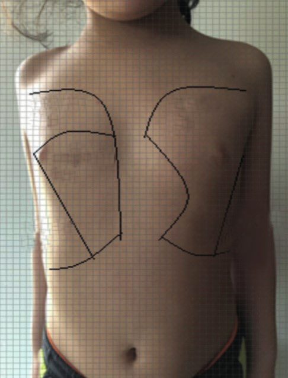

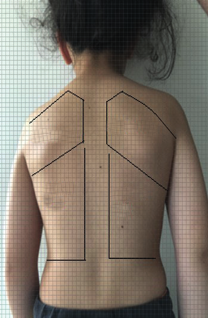

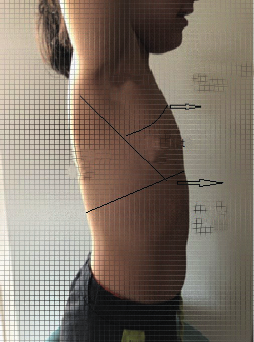

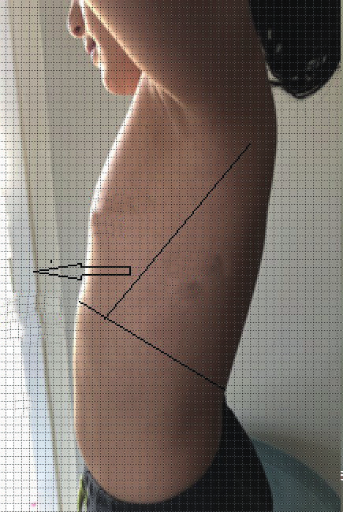

---

### Çizgiler ve Bölgeler

#### Çizgiler

**Önde:**

* **Orta sternal çizgi:** Sternumun tam ortasında yukarıdan aşağı doğru inen dikey çizgidir.
* **Orta klaviküler çizgi:** Sağ ve solda klavikulanın tam ortasından geçecek şekilde yukarıdan aşağı doğru inen dikey çizgidir.

**Arkada:**

* **Arka orta çizgi:** Arkada processus spinosusların tam ortasından geçerek yukarıdan aşağıya doğru inen dikey çizgidir.
* **Skapula çizgisi:** Arkada sağ ve solda skapulaların alt uçlarından geçecek şekilde çizilen çizgidir.

**Yanda:**

* **Ön koltuk altı çizgisi:** Sağ ve sol yanda koltuk altı ön sınırından geçer. Pektoralis majör kası alt kenarının oluşturduğu katlantıdan geçecek şekilde inen dikey çizgidir.
* **Arka koltuk altı çizgisi:** Sağ ve sol yanda koltuk altının arka sınırından geçer. Latissimus dorsi kasının tendonu tarafından oluşturulan katlantıdan geçecek şekilde inen dikey çizgidir.

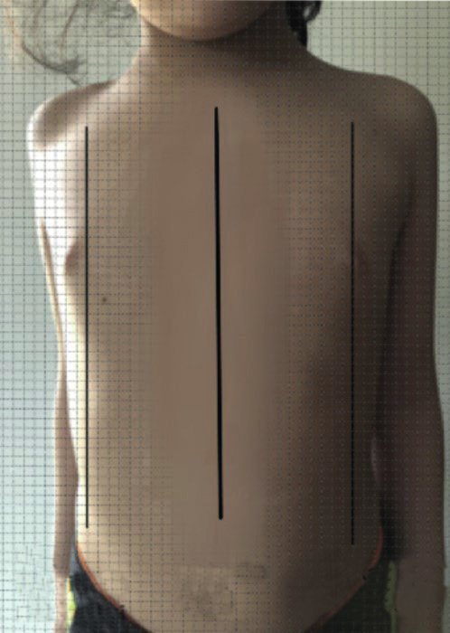

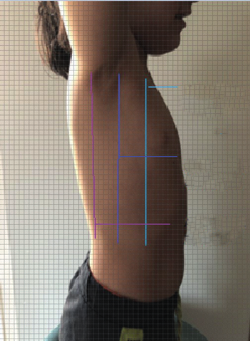

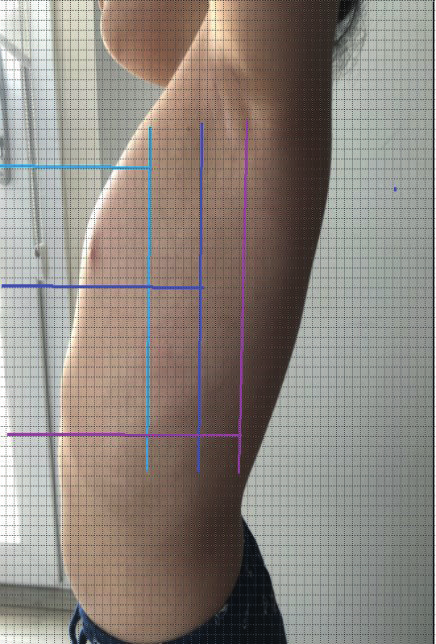

#### Bölgeler

* **Supraklaviküler bölge:** Klavikulanın üstündeki bölge olup burada akciğer apeksi, karotisler, juguler venler, subklaviyan arter ve veni bulunur.
* **İnfraklaviküler bölge:** Klavikula ile üçüncü kostanın alt kenarı arasında kalan alandır.
* **Suprasternal çukur:** Önde manubrium sterninin üstü ile klavikulaların çıkıntılı iç uçları arasındaki alandır.
* **Koltuk altı bölgesi:** Ön ve arka koltuk altı çizgileri arasında, yukarıda koltuk altı çukuru, aşağıda altıncı kosta arasında kalan alandır.
* **İnfraaksiller bölge:** Ön ve arka koltuk altı çizgileriyle altıncı kosta ile son kosta arasındaki alandır.
* **Supraskapular bölge:** Spina skapula (ikinci sırt omurga hizası) üstünde kalan alandır.
* **Skapulavertebral bölge:** Skapulaların iç kenarları ile omurganın processus spinosuslarına dikey geçen çizgi arasında kalan alandır.
* **Skapular bölge:** Skapulaların iç kenarları ile arka aksiller çizgisi arasında kalan alandır.
* **İnfraskapular bölge:** Skapulaların alt uçlarından son kostaya kadar uzanan alandır.

---

### Muayene Ortamı

Solunum muayenesi **inspeksiyon, palpasyon, perküsyon ve oskültasyon** sırası ile yapılmalıdır.

* Muayene odası sessiz, iyi aydınlatılmış ve normal oda ısısında olmalıdır.
* Eller ve steteskop ılık olmalıdır.
* Küçük ve huzursuz çocuklar tercihen ebeveyn kucağında muayene edilmelidir.
* Uyuyan çocukta solunum sayısı ve nefes darlığının değerlendirilmesi için çocuk sırt üstü pozisyona getirilerek hırıltının daha belirgin hale gelmesi sağlanmalıdır.
* Solunum seslerini iyi duyabilmek için özellikle süt çocuğu ve küçük çocuklar emerken veya ağladıkları sırada (eforun arttığı zamanda) dinlenmelidir.
* Ergenlerin özel hayatını korumak adına muayene paravan ardında ve bir sağlık personeli eşliğinde, ebeveynin olmadığı ortamda yapılmalıdır.

---

## İNSPEKSİYON

İnspeksiyonla; göğüs duvarına ait deri ve yumuşak dokular, göğsün anatomik yapısı ve şekil bozuklukları, göğsün ekspansiyonu, solunum sayısı, derinliği, ritmi ve zorlu solunum olup olmadığı değerlendirilmelidir.

* Derinin renk değişikliği, solukluk, ciltte siyanoz veya pletorik görünüm tanı açısından önemlidir.
* Vena kava süperior sendromu gibi durumlarda; yüz, boyun, göğsün üst kısmı ve üst ekstremitelerde lokal ödem, yüzeyel venlerin kollaterallerinde artma ve dolgunluk tipik klinik bulgulardır.
* Meme derisindeki renk değişikliği, meme simetrisinde ve sınırlarında değişme, meme başı retraksiyonu değerlendirilmelidir.
* Meme uçlarının yerleşimi ve birbirinden uzaklığı önemlidir (kız çocuklarında Turner sendromunda, kız ve erkeklerde Noonan sendromunda meme başları normalden daha ayrık).
* Meme gelişimi değerlendirilmelidir.
* Kalp vurusu gözle görülebilir. Atriyal septal defekt, sağ ventrikül hipertrofisi gibi durumlarda prekordial kabarıklık saptanabilir.

### Çomak Parmak

> El ve ayak parmaklarının uç falankslarındaki yumuşak dokunun genişlemesi ve tırnakların saat camı şeklindeki bombeleşmesine çomak parmak denir.

Bir hastalık sonrasında gelişebileceği gibi doğuştan veya idiyopatik olarak da görülebilir.

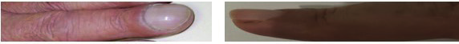

**Çocuklardaki en sık nedenler:** Kistik fibrozis, bronşektazi, siyanotik doğuştan kalp hastalığı ve ampiyem.

**Diğer nedenler:** Ekstrensek alerjik vaskülit, siroz, pulmoner arteriyovenöz malformasyonlar, bronşiolitis obliterans, tüberküloz, primer siliyer diskinezi, sarkoidoz, akciğer apsesi, tiroid hormon eksikliği, tirotoksikoz, Crohn hastalığı, ülseratif kolit, Çölyak hastalığı ve hipertrofik osteoartropati.

💡 Akciğer apsesi ve ampiyemde bazen kısa sürede (haftalar içinde) oluşur ve uygun tedavi ile düzelebilir. Nadiren parmaklarda çomaklaşma ailevi olabilir ve herhangi bir patoloji eşlik etmez.

### Toraks Yapısı ve Simetrisi

Yenidoğan bir bebekte yuvarlak bir toraks yapısı vardır, çocuk büyüdükçe göğsün transvers çapı artar. Altı yaş üzerindeki bir çocukta toraksın yuvarlak yapıda olması, göğüs ön arka çapının arttığı **fıçı göğüs**ü düşündürür.

* **Fıçı göğüs** → Kronik obstrüktif akciğer hastalıkları ve kas-iskelet sistemi bozuklukları (raşitizm, Morquio ve Noonan sendromu vb.)
* **Tek taraflı asimetri** → Tek akciğer, sağ ventrikül hipertrofisi, pnömotoraks, skolyoz, hemihipertrofi, tek taraflı akciğer tümörü ve doğuştan büyük pektoral kas yokluğu (Poland sendromu)
* **Kunduracı göğsü (pektus ekskavatum)** → Sternum alt ucu içeri çöker. Marfan, Noonan, Hurler ve Turner sendromlarında, osteogenezis imperfekta, raşitizm gibi hastalıklarda veya ailevi olarak görülebilir.
* **Güvercin göğüs (pektus karinatum)** → Sternum kemiği dışarı doğru bombeleşmiştir. Kronik akciğer hastalıklarında, Noonan, Schwartz ve Morque sendromlarında, osteogenezis imperfekta hastalığında veya ailevi ya da doğuştan saptanabilir.
* **Raşitizmde** aynı zamanda kostokondral eklemlerde **raşitik rozary** denilen şişlikler ve diyafragmanın kostalara yapıştığı yerde **Harrison Oluğu** denen çukurluk oluşabilir.
* **Kifoz** → Omurganın torasik kısmındaki kavsin fazla olması
* **Skolyoz** → Omurganın yanlara doğru kavis yapması
* **Kifoskolyoz** → Kifoz ve skolyozun bir arada bulunması

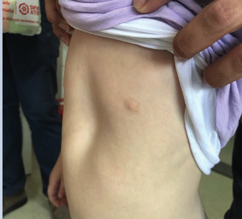

### Hemitoraksların Solunuma Katılımı

Hemitoraksların solunuma katılımının eşit olup olmadığı değerlendirilmelidir.

* Pnömotoraks, atelektazi, pnömoni ve plörezi gibi durumlarda akciğerlerin solunuma katılması **tek taraflı** olarak azalabilir.
* Astım alevlenmesi, amfizem gibi obstrüktif akciğer hastalıklarında **her iki hemitoraks** solunuma az katılır.

### Solunum Tipi

* Süt çocukluğu döneminde torasik solunum gözlenmez. Bu dönemde solunum **abdominal veya diyafragmatik**tir.
* Süt çocukluğu döneminde torasik solunum gözlenmesi distansiyon, kitle gibi abdominal patolojilere veya akciğerle ilgili hastalıklara işaret eder.
* Yaşla beraber göğüs kaslarının da solunuma katılımı artar ve altı yaşından sonra **torasik solunum** daha belirgin hale gelir.

### Solunum Sayısı

Solunum sayısını değerlendirmek için çocuk sakinken göğüs hareketleri izlenir. Çocuklarda solunum sayısı yaşla azalmaktadır.

**Tablo VII. Yaşlara göre dakikadaki normal solunum sayıları**

| Yaş | Solunum Sayısı (/dk) |
|---|---|
| Prematür | 40-70 |
| 0-3 ay | 35-55 |
| 3-6 ay | 30-45 |
| 6-12 ay | 25-40 |
| 1-3 yaş | 20-30 |
| 3-6 yaş | 20-25 |
| 6-12 yaş | 14-22 |
| 12 yaş üstü | 12-18 |

**Solunum sayısı terminolojisi:**

* **Takipne (taşipne):** Solunum sayısı normalden fazla → Alt hava yolu hastalıklarında (pnömoni, bronşiolit)
* **Bradipne:** Solunum sayısı normalden az → Solunum merkezini etkileyen zehirlenmeler, KİBAS, kafa içi tümörler ve enfeksiyonlar
* **Apne:** ≥20 saniye solunum durması veya bradikardi, satürasyon düşüklüğü ve siyanozun eşlik ettiği <20 saniye solunum durması
* **Hiperpne:** Solunum derinliğinin artması → Yüksek ateş, anemi, metabolik asidoz ve akciğerde ölü boşluğun arttığı durumlar
* **Hipopne:** Solunum derinliğinin azalması → Solunumsal asidoz, bilateral diyafragma paralizisi ve SSS depresyonu

### Dispne Bulguları

> Zorlanma olmadan yapılan normal solunum **eupne** olarak tanımlanır. Dispne ise yardımcı solunum kaslarının kullanıldığı zorlu solunumu ifade eder.

**Dispne bulguları:** Burun kanatlarının solunuma katılımı, göğüste çekilmeler (suprasternal, supraklaviküler, substernal, interkostal, subkostal vb.), takipne, vizing, stridor, siyanoz, ortopne, yenidoğanlarda inleme ve baş sallama.

* **Ortopne:** Hasta sırt üstü yatamaz, oturmayı tercih eder.
* Dispnesi olan hastalarda hipoksiye bağlı huzursuzluk ve ileri dönemde letarji, uykuya meyil görülebilir.

**İnspiratuar dispne:** Üst hava yolu obstrüksiyonu sonucu özellikle nefes alırken meydana gelen zorlu solunum (akut larenjit, larinkste ödem, subglottik stenoz, laringeal sinir paralizisi, yabancı cisim, dıştan hava yoluna bası vb.). İnspiryumda suprasternal çekilme görülebilir ve stridor duyulabilir.

**Ekspiratuar dispne:** Nefes verirken yardımcı solunum kaslarının kullanıldığı alt solunum yolunun obstrüksiyonu sonucu gelişen zorlu solunum. İlk iki yaşta; bronşiolit, kistik fibrozis, bronkopnömoni, daha büyüklerde; astım, yabancı cisim aspirasyonu ve kalp yetmezliğine bağlı akciğer ödemi ve dıştan hava yoluna bası sık sebeplerdendir. Ekspiryumda uzama ve infrasternal, subkostal, interkostal kaslarda çekilmeler sıklıkla eşlik eder.

### Patolojik Solunum Tipleri

* **Periyodik solunum:** Yenidoğanda özellikle prematür bebeklerde normal olarak kabul edilen, bradikardi ve siyanozun görülmediği, 5-10 saniye süren solunum durması sonrasında 10-15 saniye süren solunum hızlanmasıyla karakterize bir solunum tipidir.
* **Cheyne-Stokes solunumu:** Düzensiz, patolojik bir solunum tipi olup solunum derinliği giderek artar, sonra azalarak apne görülür. Serebral travma, KİBAS, beyin ödemi, menenjit, intrakraniyal kanama ve tümör, narkotik zehirlenmeler ve konjestif kalp yetmezliğinde gözlenebilir.
* **Biot tipi solunum:** Apne dönemlerinin eşlik ettiği, solunum sayısı ve derinliğinin değişken olduğu bir solunum tipidir. Ciddi santral sinir sistemi lezyonlarından (ağır beyin hasarı, ensefalit, bulber poliomiyelit vb.) kaynaklanır.
* **Kussmaul solunumu:** Derin ve hızlı solunum tipi olup üremi, diyabetik ketoasidoz, salisilizm, metabolik asidoz gibi durumlarda gözlenebilir.

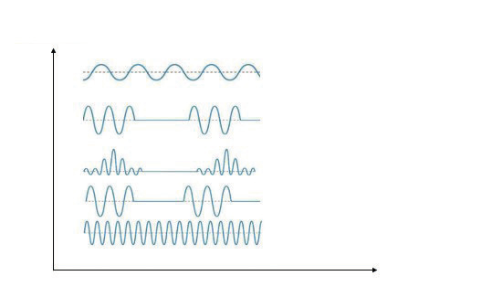

💡 Normal solunumda inspirasyonda göğüs kafesi genişler, diyafragma alçalır, ekspirasyonda ise diyafragma yükselir. **Paradoksal solunum**da ise inspirasyon sırasında diyafragmada yükselme görülür (interkostal kasların paralizisi, çoklu kaburga kırıkları vb.).

---

## PALPASYON

Palpasyonda parmak uçları ve avuç içi ile mevcut hassas sahalar, ağrılı noktalar, kırıklar, kitleler, meme dokusu, lenf bezleri, raşitik değişiklikler, göğüs duvarının yapısı, kalp tepe atımının yeri, skapula ve trakeanın pozisyonu değerlendirilmelidir.

### Göğüs Ekspansiyonunun Değerlendirilmesi

Koopere olan bir çocukta akciğer alt loblarının solunuma katılımının değerlendirilmesi için her iki el, başparmak uçları omurga üzerinde orta hatta birbirine değecek şekilde toraks üzerine konur ve çocuğun derin nefes alıp vermesi istenir.

* **Orta lob ve lingula ekspansiyonu:** Göğsün ön tarafında başparmaklar alt kostalar üzerinde, uçları ksifoidde birbirine değecek şekilde yerleştirilerek yapılır.
* **Üst lob ekspansiyonu:** Başparmak sternum üst ucunda orta çizgide birbirine yaklaştırılır, diğer dört parmak klavikulaların üzerine gelecek şekilde apikal alana gergin bir şekilde yerleştirilir ve derin nefes alınırken sternum üzerindeki başparmak hareketi gözlemlenir.

Göğüs ekspansiyonu azalmışsa, solunuma az katılan taraftaki parmak orta hattan az uzaklaşır veya hareket etmez. Tek taraflı lober pnömoni, plevral efüzyon, plevra kalınlaşması, atelektazi, pnömotoraks gibi durumlarda patolojinin olduğu tarafta; amfizem ve astım alevlenmesi gibi obstrüktif hastalıklarda, bilateral plevral efüzyonda ve ampiyemde her iki tarafta ekspansiyon azalır.

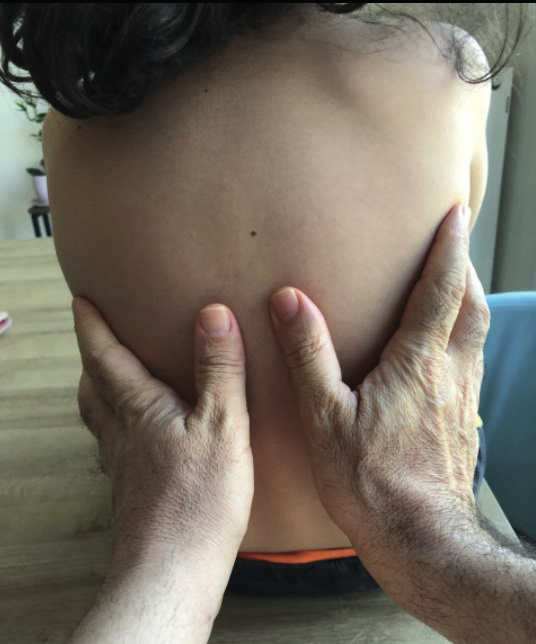

### Vibrasyon Torasik (Taktil Fremitus)

> Göğüs duvarına iletilen seslere ait titreşimlerin palpasyonla hissedilmesine vibrasyon torasik (taktil fremitus) denir.

Vibrasyon torasik muayenesi için parmakların palmar ya da ellerin ulnar yüzleri kullanılır. Göğüs duvarı ön ve arkadan simetrik olarak palpe edilirken hastanın **"araba - araba"** veya **"kırk - kırk bir"** gibi net titreşim yaptıran kelimelerden birini tekrar tekrar söylenmesi istenir. Normalde avucu tırmalayan bir titreşim olarak alınır.

* **Vibrasyon torasik artar** → Konsolidasyon yapan durumlar (lober pnömoni, ağır tüberküloz, akciğer enfarktüsü vb.)
* **Vibrasyon torasik azalır** → Amfizem, plörezi, pnömotoraks, atelektazi

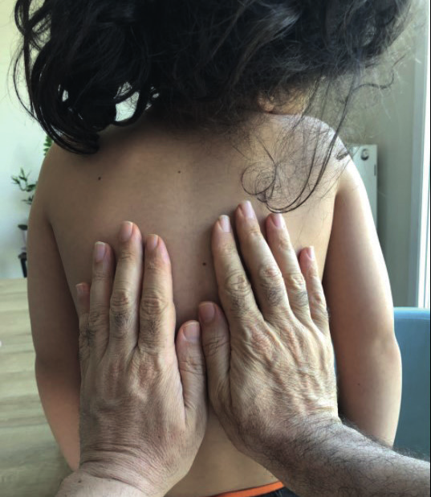

### Diğer Palpasyon Bulguları

* **Krepitasyon:** Deri altı yumuşak dokularda hava bulunması durumunda (cilt altı amfizemi) palpasyon sırasında çıtırtı hissedilir. Toraksa ait travmalarda görülebilir.
* **Kosta pulsasyonu:** Kosta damarlarının pulsasyonu aort koarktasyonun bir bulgusudur.
* **Thrill:** Kalpte üfürümün en şiddetli olduğu yerde hissedilen titreşimdir.
* **Plevral frotman:** Plevra yaprakları iltihaplandığında kayganlığını kaybeden plevra yapraklarının birbirine sürtünmesiyle oluşan titreşimler, göğsün anterolateralinde ve aksiller bölgede palpasyonla hissedilebilir.

### Trakea ve Kalp Tepe Atımı

Trakea ve kalp tepe atımının yerinin değerlendirilmesi, mediastenin pozisyonu hakkında ipucu verir.

**Trakea palpasyonu:** Hasta oturur pozisyonda, baş orta hatta ve hafif öne eğik iken yapılır. Küçük çocuklarda tek, büyük çocuklarda iki parmak kullanılır. Küçük bir çocukta elin işaret parmağı suprasternal çukura yerleştirildiğinde, parmağın tam trakea üzerinde olması beklenir. Eğer trakeada bir sapma varsa, parmak trakeanın dışına kayar ve boşluğa oturur. Büyük çocuklarda elin orta ve işaret parmağı trakeayı kavrayacak şekilde suprasternal çukura konur.

* **Trakea karşı tarafa itilir** → Pnömotoraks, plevral efüzyon, tek taraflı amfizem
* **Trakea hastalıklı tarafa çekilir** → Atelektazi, fibrozis

**Kalp tepe atımı:**

* 3-4 yaşına kadar → Orta klaviküler hattın solunda **dördüncü** interkostal aralık
* Daha büyük çocuklarda → Orta klaviküler hatta **beşinci** interkostal aralık

---

## PERKÜSYON

> Göğüs duvarına hafifçe vurularak yapılan muayenedir.

Göğsün arka duvarının perküsyonu oturarak, ön duvarının perküsyonu ise en iyi hasta sırt üstü yatarken yapılır. Küçük çocuklarda elin işaret veya orta parmağının pulpası kullanılarak **direkt perküsyon** yapılabilir. Büyük çocuklarda **indirekt yöntem** tercih edilir.

**İndirekt perküsyon tekniği:** Bir elin orta parmağı interkostal aralıklara tamamen yerleştirilir ve diğer elin işaret veya orta parmağı ile göğse temas ettirilen parmağın tırnak dibi ile birinci falanksının arasına veya distal interfalangeal eklemine el bilekten hareket ettirilerek kısa süreli darbeler ile vurulur.

**Perküsyon sırası:**

* **Arkada:** Apeksten başlanır. Skapulalar ile vertebra arasındaki bölgede parmaklar dik olarak yerleştirilerek mukayeseli perküsyon yapılır. Skapulaların altındaki bölgede parmaklar paralel yerleştirilerek 8-10. kaburga seviyesine kadar devam edilir.
* **Önde:** Klavikula üstünden başlanır, klavikulalar perküte edildikten sonra ikinci interkostal aralıktan itibaren orta klaviküler hat boyunca matite alıncaya kadar devam edilir.
* **Yanda:** Ön koltuk çizgisinden arka koltuk çizgisine doğru ve yukarıdan aşağıya yapılır.

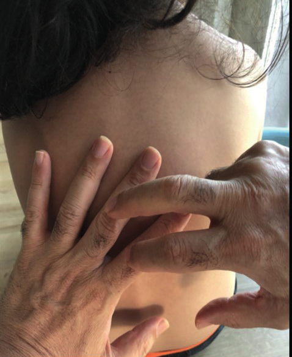

### Kostodiyafragmatik Sinüs Değerlendirmesi

Arka koltuk altı çizgisinden aşağıya doğru yapılan perküsyona matite alınıncaya kadar devam edilir. Sırtta 10. interkostal aralık civarında matite alındığında çocuğun derin nefes alması istenir. Bu durumda diyafragma bir iki interkostal aralık kadar aşağıya iner ve sonorite alınır. Plevral efüzyon, plevral yapışıklık, frenik sinir paralizisi gibi durumlarda diyafragma hareketi azalır, mat ses alınır.

### Perküsyon Sesleri

* **Sonor ses** → Normal göğüs perküsyonu
* **Hipersonor ses** → Amfizem, pnömotoraks, astım alevlenmesi (hava hapsi olan durumlar). Akciğer hava kistleri, hava sıvı seviyesi bulunan akciğer apseleri, diyafragma hernisinde lokalize hipersonor ses alınabilir.
* **Matite** → Plevrada sıvı, konsolidasyon, atelektazi, tümör ve akciğer kollapsı
* **Timpanik ses** → Diyafragma hernisi, pnömotoraks ve dev akciğer kaviteleri

### Organ Matiteleri

* **Kalp, karaciğer, diyafragma ve skapula** üzerinde sonor seste azalma olur veya matite alınır.
* **Karaciğer matitesi:** Sağda orta klaviküler çizgi üzerinde submatite beşinci, matite altıncı interkostal aralıkta alınır. Diyafragmanın yükseldiği durumlarda (abdominal distansiyon, hepatomegali, sağ akciğer alt lob atelektazisi vb.) daha yüksekte; diyafragmanın aşağı itildiği durumlarda (plevral efüzyon, amfizem, sağ akciğerde pnömotoraks vb.) daha aşağıda saptanabilir. Situs inversus durumunda karaciğer matitesi sol altıncı interkostal aralıkta alınır.
* **Kalp matitesi:** Sternumun solunda üçüncü ve beşinci interkostal aralıkta üçgen şeklinde saptanır.
* **Traube alanı:** Kalp matitesinin altında; üstte sol akciğer alt kenarı, lateralde sol ön koltuk altı çizgisi, altta sol inferior kosta yayı ile sınırlanmış alan olan mide fundusu bölgesinde **timpanik ses** alınır. Burada matite alınması splenomegali, karaciğerin sol lobunun büyümesi veya plevral kalınlaşmayı düşündürür.

---

## OSKÜLTASYON

Akciğer oskültasyonu, çocuk sırt üstü yatarken veya oturur vaziyette baş orta hatta iken yapılmalıdır. Steteskop göğüs duvarına tam olarak bastırılmalıdır. Hastaya oskültasyon sırasında ağızdan derin nefes aldırılmalıdır. Ağzın açık olması solunum sırasında burun ve farinksten çıkacak seslere bağlı karışıklığı engeller.

**Oskültasyon sırası:**

* **Önde:** Supraklaviküler bölgeden başlanır, solunum sesleri interkostal aralıklardan karşılaştırmalı olarak dinlenerek aşağıya doğru inilir.
* **Yanlarda:** Aksillalardan başlanarak aşağıya doğru yapılır.
* **Arkada:** Karşılaştırmalı olarak apeksler, skapulalar arasındaki bölge ve her iki hemitoraks oskülte edilir.

💡 Çocuklarda göğüs duvarının ince oluşu nedeniyle solunum sesleri erişkine göre daha güçlü işitilir.

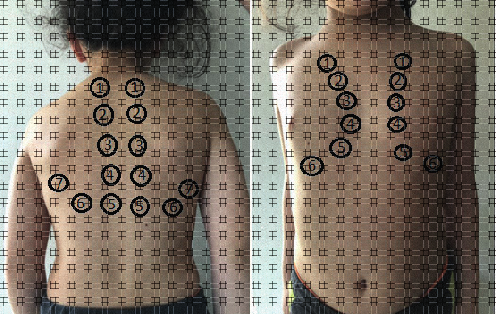

### Normal Solunum Sesleri

Çocuklarda normalde duyulan solunum sesleri trakeal, bronşiyal, bronkoveziküler ve veziküler seslerdir.

* **Trakeal ses:** Steteskop trakea üzerine konarak dinlendiğinde duyulan yüksek tondaki sestir. Trakeal sesin inspiryum ve ekspiryum süreleri eşittir.
* **Bronşiyal solunum sesi:** Trakeal sese benzer niteliktedir, ekspiryum süresi inspiryum süresinden daha uzundur. Ana bronşlardaki titreşimlerden kaynaklanır. Manubrium sterni üzerinden dinlenebilir. Akciğerin periferinde duyulması patolojiktir. **Tuber sufl** - bronşial solunum sesi bronşun açık olduğu konsolidasyonda duyulabilir.
* **Bronkoveziküler solunum sesleri:** Trakea ve bronşların göğüs duvarına yakın olduğu yerlerin oskültasyonu sırasında duyulan sestir. Sırtta skapulalar arası bölge, önde sternumun sağ ve solunda birinci ve ikinci interkostal aralıklarda ve apikal bölgelerde duyulur. Veziküler ve bronşiyal seslerin karışımıdır. Bronşiyal solunum seslerine göre daha yumuşaktır. İnspiryum ve ekspiryum süreleri birbirine yakındır.
* **Veziküler solunum sesleri:** Akciğerlerin periferik bölgelerinde duyulan düşük frekanslı solunum sesleridir. İnspiryum süresi ekspiryum süresinden daha uzun duyulur. Obstrüktif tipte akciğer hastalıklarında ekspiryum süresi uzar.

### Solunum Seslerinde Değişiklikler

Solunum seslerinin her yerde eşit alınıp alınmadığı değerlendirilmelidir.

* **Solunum seslerinde azalma** → Plevrada sıvı - kalınlaşma, pnömotoraks, atelektazi, astım alevlenmesi, amfizem ve tümör varlığında
* **Sessiz akciğer** → Ağır astım atağında saptanabilir
* **Solunum seslerinde artma** → Ateş, egzersiz, anemi, metabolik asidoz, kompanzasyon (tek akciğer) durumlarında
