# ALERJİK RİNİT VE ASTIM

**Hazırlayan:** Prof. Dr. Songül Çildağ
**Bölüm:** Aydın Adnan Menderes Üniversitesi Tıp Fakültesi — İmmünoloji ve Alerji Hastalıkları Bilim Dalı

---

## İÇİNDEKİLER

1. [Rinit — Tanım ve Sınıflama](#rinit--tanım-ve-sınıflama)
2. [Alerjik Rinit](#alerjik-rinit)
3. [Gell-Coombs Aşırı Duyarlılık Sınıflaması](#gell-coombs-aşırı-duyarlılık-sınıflaması)
4. [Alerjik Rinit Patogenezi — Tip 1 Reaksiyon](#alerjik-rinit-patogenezi--tip-1-reaksiyon)
5. [Alerjik Rinit — Klinik ve Sınıflama](#alerjik-rinit--klinik-ve-sınıflama)
6. [Ayırıcı Tanı](#ayırıcı-tanı)
7. [Tanı — Öykü, Fizik Muayene, Laboratuvar](#tanı--öykü-fizik-muayene-laboratuvar)
8. [Alerjik Rinit Tedavisi](#alerjik-rinit-tedavisi)
9. [Çevresel Faktör Kontrolü](#çevresel-faktör-kontrolü)
10. [Alerjen Spesifik İmmünoterapi](#alerjen-spesifik-i̇mmünoterapi)
11. [Astım — Tanım ve Epidemiyoloji](#astım--tanım-ve-epidemiyoloji)
12. [Astım Endotip ve Fenotipleri](#astım-endotip-ve-fenotipleri)
13. [Astım Tanısı](#astım-tanısı)
14. [Astım Tedavisi — GINA 2024](#astım-tedavisi--gina-2024)

---

## RİNİT — TANIM VE SINIFLAMA

### Tanım

**Rinit (rinosinüzit):** Nazal mukozanın inflamasyonu. Klinik olarak:

* **2 veya daha fazla ardışık gün** boyunca
* **1 saatten uzun süren**
* **Burun akıntısı, burun tıkanıklığı, kaşıntı ve hapşırık** ile karakterize bir tablodur.

> **💡 Pratik not:** Birden fazla rinit tipi **bir arada** bulunabilir. Örneğin alerjik rinit + viral enfeksiyöz rinit, ya da alerjik + rinitis medikamentoza.

### Rinit Sınıflaması

**1. Enfeksiyöz rinit** (viral, bakteriyel)

**2. Non-enfeksiyöz rinit**

**a) Kombine tip (nazal hipersensitivite):**
* **Alerjik rinit** — intermittant / persistan
* **Nonalerjik (idiyopatik / vazomotor) rinit** / NARES (nonalerjik eozinofilik rinit)
* **Mesleki rinit**

**b) Rinore tipi:**
* Gustatuar rinit (yemek yerken)
* Soğuk inhalasyon riniti
* Yaşlılığa bağlı rinit

**c) Konjestif tip:**
* **İlaç ilişkili rinit:** Lokal inflamatuar (NSAİD), nörojenik, idiyopatik, **rinitis medikamentosa** (dekonjestan bağımlılığı)
* Psikojenik rinit
* **Gebelik rinopatisi**
* Hormonal rinit

**d) Kuru tip**

**3. Diğerleri:**
* Atrofik rinit
* Spesifik granülomatöz rinit (GPA, sarkoidoz vb.)

---

## ALERJİK RİNİT

* **En sık görülen alerjik hastalık.**
* **IgE aracılı (Tip 1 aşırı duyarlılık reaksiyonu).**
* Nonenfeksiyöz rinitin en sık formu.

### Epidemiyoloji

| Grup | Prevalans |
|---|---|
| **Tüm erişkinler** | **%10-30** |
| **Çocuklar** | **%40** |

### Önemli Birliktelikler

* **Sinüzit ve astım** sıklıkla eşlik eder.
* Alerjik rinitli hastada **astım gelişme riski 1/3'tür** (yaklaşık %33).

> **💡 "One airway, one disease":** Üst hava yolu (rinit) ve alt hava yolu (astım) **tek bir hastalığın** iki yüzü kabul edilir. Alerjik rinit kontrolü astım kontrolünü de iyileştirir.

### Patogenez

* **Solunum yolu alerjenleri** ile temas sonrası **alerjen spesifik IgE** oluşumu.
* **Epitel bariyer bütünlüğünün bozulması** predispozan faktördür.

**Başlıca solunum yolu alerjenleri:**

* **Polenler** (ağaç, çimen, yabani ot)
* **Ev içi alerjenleri:**
    * **Ev tozu akarları** (Dermatophagoides pteronyssinus, D. farinae)
    * **Evcil hayvanlar** (kedi, köpek)
    * **Hamamböceği**
* **Mantar sporları** (Alternaria, Cladosporium, Aspergillus)

---

## GELL-COOMBS AŞIRI DUYARLILIK SINIFLAMASI

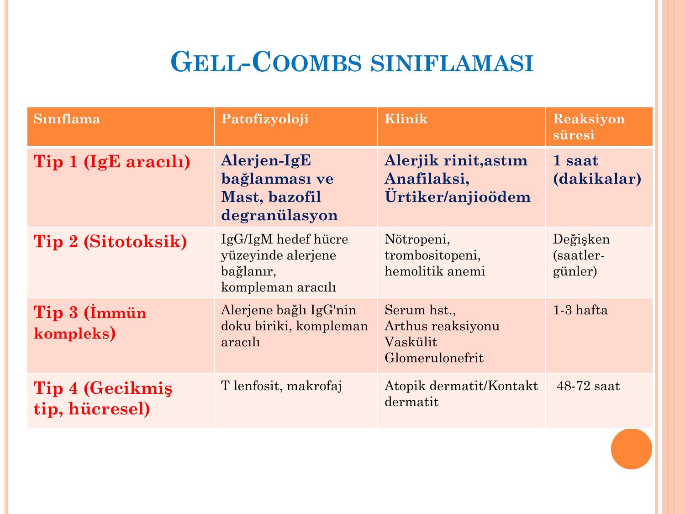

| Tip | Patofizyoloji | Klinik | Süre |
|---|---|---|---|
| **Tip 1 (IgE aracılı)** | Alerjen + IgE bağlanması → mast hücresi ve bazofil **degranülasyonu** | **Alerjik rinit, astım, anafilaksi, ürtiker/anjioödem** | **Dakikalar – 1 saat** |
| **Tip 2 (Sitotoksik)** | IgG/IgM hedef hücre yüzeyinde alerjene bağlanır; **kompleman aracılı** | Nötropeni, trombositopeni, hemolitik anemi | **Değişken (saatler-günler)** |
| **Tip 3 (İmmün kompleks)** | Antijen + IgG immün kompleksi doku birikimi; kompleman aracılı | Serum hastalığı, Arthus reaksiyonu, vaskülit, glomerulonefrit | **1-3 hafta** |
| **Tip 4 (Gecikmiş, hücresel)** | **T lenfosit, makrofaj** | Atopik dermatit, kontakt dermatit | **48-72 saat** |

> **💡 Alerjik rinit ve astım → Tip 1 reaksiyon.** Atopik dermatit Tip 4 bileşeni de taşır.

---

## ALERJİK RİNİT PATOGENEZİ — TİP 1 REAKSİYON

Tip 1 reaksiyon **3 fazda** gelişir:

### 1. Duyarlanma Fazı

* Alerjen ile **ilk temas** sonucunda **alerjen spesifik IgE** üretilir.
* IgE → **mast hücreleri ve bazofillerin yüzeyindeki FcεRI reseptörüne** bağlanır.
* **Asemptomatik dönem** — bu aşamada henüz bulgu yoktur.

### 2. Erken Faz Reaksiyon

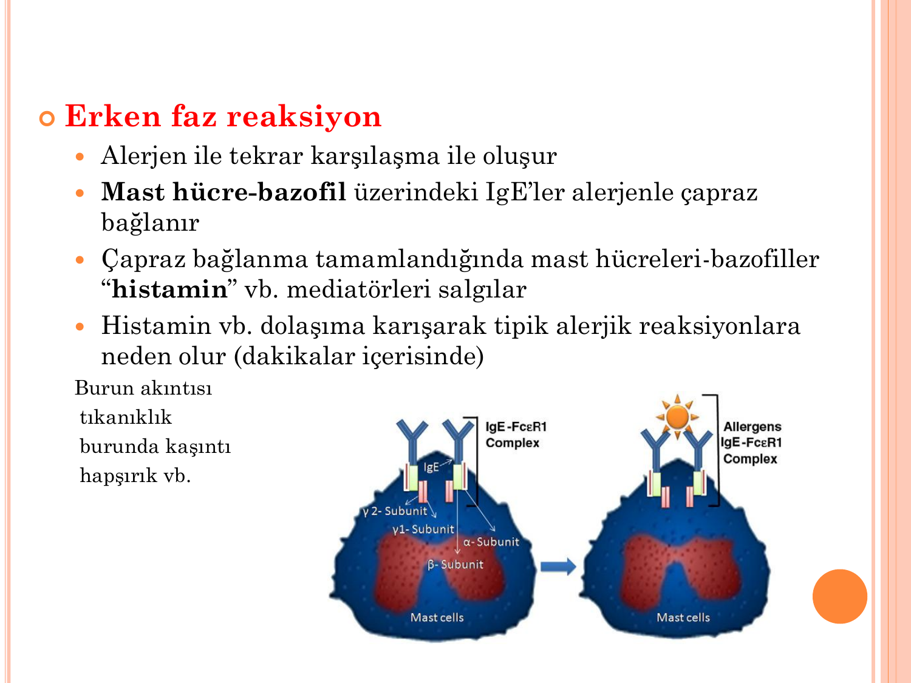

* **Alerjen ile tekrar karşılaşma** ile oluşur.
* Mast hücresi-bazofil yüzeyindeki IgE'ler **alerjenle çapraz bağlanır**.
* **Degranülasyon** → **histamin** vb. mediatörler dolaşıma karışır.
* **Dakikalar içinde** klasik semptomlar: burun akıntısı, tıkanıklık, kaşıntı, hapşırık.

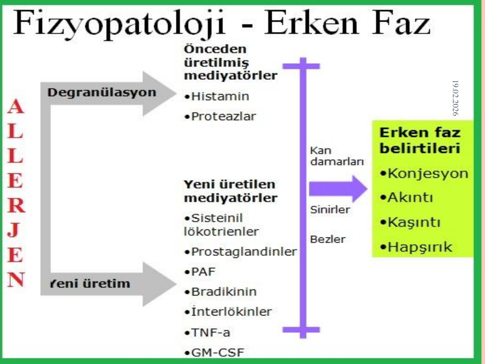

**Erken faz mediatörleri:**

| **Önceden üretilmiş** | **Yeni üretilen** |
|---|---|
| **Histamin** | **Sisteinil lökotrienler** (LTC4, LTD4, LTE4) |
| Proteazlar (triptaz, kimaz) | **Prostaglandinler** (PGD2) |
| | **PAF** (platelet-activating factor) |
| | **Bradikinin** |
| | **İnterlökinler** (IL-4, IL-5, IL-13) |
| | **TNF-α, GM-CSF** |

**Hedef dokularda etkiler:**

* **Kan damarları:** Vazodilatasyon, plazma ekstravazasyonu → konjesyon, ödem
* **Sinirler:** Kaşıntı, hapşırık refleksi
* **Bezler:** Mukus hipersekresyonu → akıntı

### 3. Geç Faz Reaksiyon

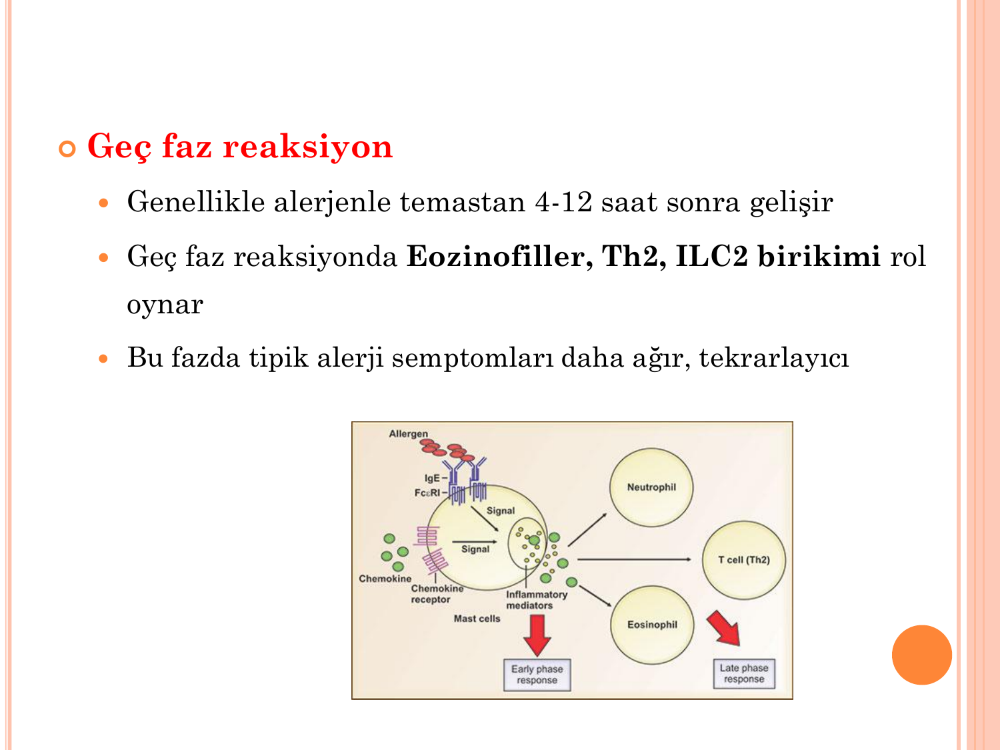

* **Alerjenle temastan 4-12 saat sonra** gelişir.
* Dokuya **eozinofil, Th2 hücreleri, ILC2** birikimi rol oynar.
* Bu fazda semptomlar **daha ağır ve tekrarlayıcıdır**.
* Kronik rinit ve kronik astım semptomlarından sorumludur.

> **💡 Neden önemli?** Erken fazı antihistaminikler durdurabilir; **geç fazı yalnızca antiinflamatuar tedaviler** (özellikle **intranazal / inhale kortikosteroidler**) kontrol edebilir.

---

## ALERJİK RİNİT — KLİNİK VE SINIFLAMA

### ARIA Sınıflaması (Süre + Şiddet)

**Süreye göre:**

| | Tanım |
|---|---|
| **İntermittan** | Semptomlar **haftada <4 gün** veya **<4 hafta** |
| **Persistan** | Semptomlar **haftada >4 gün** ve **>4 hafta** |

**Şiddete göre:**

| | Tanım |
|---|---|
| **Hafif** | Aşağıdakilerden hiçbiri yoktur |
| **Orta-ağır** | Aşağıdakilerden bir ya da daha fazlası mevcuttur: |
| | • **Uyku bozukluğu** |
| | • **Günlük aktivitelerde bozulma** |
| | • **İş/okul performansında bozulma** |
| | • **Rahatsız edici semptomlar** |

> **💡 Mevsim ayırımı:** **Mevsimsel** (polenler — güneşli, sıcak, rüzgarlı havada artar) ve **yıl boyu** (perennial — ev tozu akarları, hamamböceği, evcil hayvanlar) ayrımı klasik olarak kullanılır.

---

## AYIRICI TANI

Alerjik rinitle karışabilen tablolar:

* **Enfeksiyöz rinosinüzit** (viral, bakteriyel)
* **Anatomik varyasyonlar** — septum deviasyonu, konka bülloza, adenoid hipertrofisi
* **Travma**
* **Yarık damak, koanal atrezi**
* **Nazal polipler** (özellikle NSAİD duyarlılığı, CRSwNP)
* **Burun tümörleri**
* **Yabancı cisimler** (özellikle tek taraflı pürülan akıntı — çocuk!)
* **BOS akıntısı** (travma sonrası berrak tek taraflı akıntı)
* **Laringofaringeal / faringonazal reflü**
* **Silier disfonksiyon** (primer silier diskinezi, Kartagener)
* **Üst solunum yolunu tutan sistemik hastalıklar:** Wegener (GPA), Sjögren, sarkoidoz, Churg-Strauss, tekrarlayan polikondrit, amiloidoz, orta hat granülomu, granülomatöz enfeksiyonlar

---

## TANI — ÖYKÜ, FİZİK MUAYENE, LABORATUVAR

### Öykü

**Semptomlar:**

* **Berrak burun akıntısı**, burun tıkanıklığı, **hapşırık**, burun kaşıntısı
* Damak, boğaz, kulak kaşıntısı
* **Gözlerde kaşıntı, kızarıklık, sulanma, fotofobi** (alerjik konjonktivit eşlik eder)
* Horlama, anosmia, tad bozukluğu
* Öksürük, boğaz temizleme hareketleri (özellikle çocuklarda)

**Tetikleyen faktörler:**

* **Duyarlı alerjenle maruziyet** → semptom tetiklenir, uzaklaşma ile azalır.
* **Mevsimsel** (polen) veya **yıl boyu** (ev tozu akarı, hamamböceği, evcil hayvan) dağılım.
* **Nazal hiperaktivite:** Parfüm, deterjan, kimyasallar, hava kirliliği, soğuk/nem/ısı değişiklikleri.

**Sorgulanması gerekenler:**

* Çevresel faktörler (ev-iş ortamı)
* Geçmiş tedaviler ve etkinliği (özellikle rinitis medikamentosa yapan ilaçlar — dekonjestanlar)
* **Atopi öyküsü** (astım, atopik dermatit)
* **Aile öyküsü** — hastaların **~%50'sinde (+)**
* Ev özellikleri (rutubet, bahçe, evcil hayvan)

### Fizik Muayene

**Klasik alerjik rinit bulguları (patognomonik değil ama yönlendirici):**

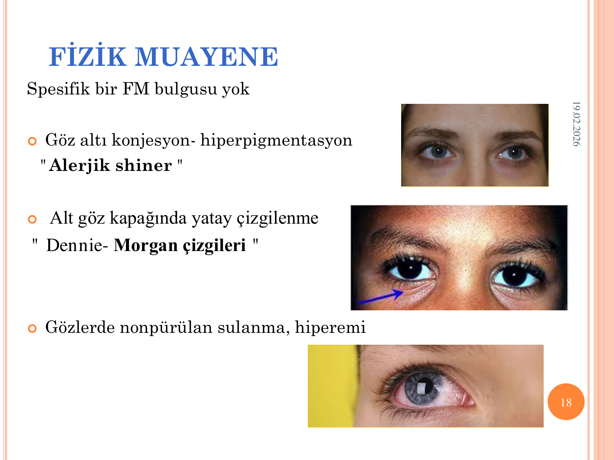

* **Alerjik shiner:** Göz altı konjesyon ve hiperpigmentasyon (venöz staz).
* **Dennie-Morgan çizgileri:** Alt göz kapağında yatay çizgilenme.
* **Gözlerde non-pürülan sulanma, hiperemi** (alerjik konjonktivit).

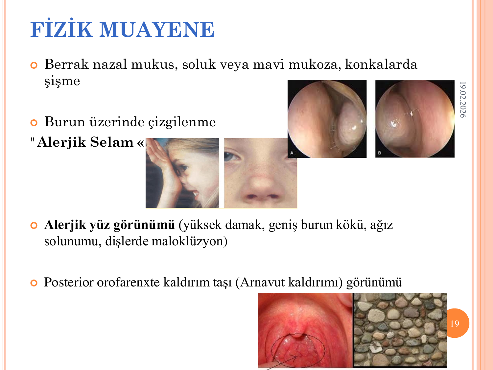

* **Berrak nazal mukus, soluk veya mavi mukoza**, konkalarda şişme.
* **"Alerjik selam":** Burun üzerinde enine çizgilenme — çocukların eliyle burnunu yukarı doğru sürekli sürtmesinden.
* **Alerjik yüz görünümü:** Yüksek damak, geniş burun kökü, ağız solunumu, dişlerde maloklüzyon.
* **Posterior orofarenkste "kaldırım taşı" (Arnavut kaldırımı) görünümü:** Lenfoid hiperplaziye bağlı.

### Laboratuvar

* **Rutin testler genellikle normal.**
* **Eozinofili** — ~%30-40 hastada periferik kan eozinofilisi
* **Total IgE** — hastaların **%30-40'ında yüksek** (normal olması alerjiyi dışlamaz)

**Alerjeni tespit eden testler:**

#### Deri Prik Testi (SPT — in-vivo)

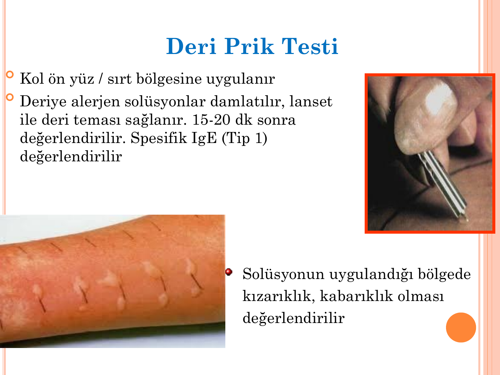

* **Kol ön yüzü / sırt** bölgesine uygulanır.
* Deriye alerjen solüsyonlar damlatılır, **lanset** ile deri teması sağlanır.
* **15-20 dakika sonra** değerlendirilir.
* **Kızarıklık ve kabarıklık (wheal-flare)** ölçülür.
* **Spesifik IgE (Tip 1)** yanıtını gösterir.

**Avantajlar:**

* **Kolay ve hızlı**
* **Ucuz**
* **Yüksek sensitivite**

**Dikkat edilmesi gerekenler:**

* Bazı ilaçlar sonucu baskılayabilir: **antihistaminikler, antidepresanlar** (özellikle TCA), **uzun süreli kortikosteroid** kullanımı.
* Test öncesi antihistaminikler **en az 5-7 gün** önceden kesilir.

#### Serum Alerjen Spesifik IgE (in-vitro)

Şu durumlarda tercih edilir:

* Deri testi uygulanamıyorsa
* **Antihistaminik** kullanan ve kesemeyen hasta
* **Ekzema veya dermografizm** gibi deri hastalıkları
* Hasta kooperasyon gösteremiyorsa (bebek, bilinç bulanıklığı)
* **Anafilaksiden sonraki 6 hafta içinde** (mast hücre depolarının boşalmış olabilir → yanlış negatif)

**Diğer testler:** Bileşene dayalı tanısal testler (CRD), bazofil aktivasyon testi, nazal provokasyon testi, rinomanometri.

---

## ALERJİK RİNİT TEDAVİSİ

Tedavi **üç ayak** üzerine kuruludur:

```
         ALERJİK RİNİT TEDAVİSİ
    ┌──────────────┼──────────────┐
    ↓              ↓              ↓
 Tetikleyiciden   Farmakoterapi   İmmünoterapi
  kaçınma,         (Medikal        (Alerjen
  çevresel         tedavi)          spesifik)
  faktör kontrolü
```

### Medikal Tedavi — İlaç Sınıfları

#### 1. Antihistaminikler (H1 Reseptör Antagonistleri)

| | **1. Kuşak** | **2. Kuşak** |
|---|---|---|
| **Selektivite** | Düşük | **Yüksek** |
| **Etki süresi** | Kısa | **Uzun** |
| **Sedatif etki** | **Belirgin** | Az/yok |
| **Antikolinerjik etki** | **Belirgin** | Yok/az |
| **Örnekler** | Doksepin, klorfeniramin, difenhidramin, hidroksizin | **Setirizin, levosetirizin, loratadin, desloratadin, rupatadin, bilastin** |

**Klinik kullanım:**

* **Hafif alerjik rinitte ilk basamak.**
* **Oral kullanım:** Burun kaşıntısı, hapşırık, burun akıntısı, oküler semptomlarda etkili.
* **İntranazal kullanım** (azelastin): Burun tıkanıklığında belirgin etki.

> **⚠️ Pratik uyarı:** 1. kuşak antihistaminikler **sedasyon ve antikolinerjik etki** nedeniyle tercih edilmez, özellikle **sürücüler ve yaşlılarda**. Tercih **2. kuşak** ajanlar olmalıdır.

#### 2. Kortikosteroidler

| | Kullanım |
|---|---|
| **İntranazal kortikosteroid (İNKS)** | **Orta-ağır AR'de en etkili ilaç.** Özellikle **nazal konjesyon**, akıntı, oküler semptomlar, eşlik eden astım bulgularında etkili |
| **Oral / sistemik KS** | **Çok ciddi nazal semptomlar** varlığında **5-7 gün** gibi kısa süreli; yan etkileri nedeniyle tercih edilmez |

> **💡 Önemli:** İNKS'nin maksimum etkisi 7-14 günde ortaya çıkar — hastaya beklemesi söylenmelidir.

#### 3. Dekonjestanlar

| | Kullanım |
|---|---|
| **Oral** | Burun tıkanıklığına etkili; yan etki (HT, uykusuzluk, palpitasyon) nedeniyle tercih edilmez |
| **İntranazal** | Burun tıkanıklığında **hızlı etki**, ancak **kısa süreli (≤3 gün)** kullanıma uygun. **Sürekli kullanımda rinitis medikamentoza** gelişir. |

#### 4. Lökotrien Reseptör Antagonistleri

* **Montelukast, zafirlukast**
* Nazal tıkanıklıkta etkilidir.
* **Özellikle astım + rinit birlikteliğinde tercih edilir** (tek ilaçla iki hastalık kontrolü).
* Kombinasyon tedavisinde yer alır.

> **⚠️ Uyarı:** Montelukastın nöropsikiyatrik yan etkileri (depresyon, intihar düşünceleri, kabuslar) hakkında FDA black-box uyarısı vardır — özellikle çocuklarda dikkat.

#### 5. İntranazal Antikolinerjikler

* **İpratropium bromür**
* Alerjik ve non-alerjik rinitte **burun akıntısı** üzerine etkili.
* **Hızlı etki** başlar.

#### 6. Kromolin Sodyum (İntranazal)

* Mevsimsel AR'de **maruziyet öncesi kullanıma uygun** (profilaktik).
* Etkisi geç başlar, yarı ömrü kısa → günde 4-6 kez dozlama gerekir.
* Güvenli, yan etkisi az (gebelikte tercih).

#### 7. Salin İrrigasyonu

* **Farmakolojik tedaviye ek olarak** önerilir.
* Nazal mukozayı temizler, alerjen yükünü azaltır, mukosilier klirensi iyileştirir.
* Yan etkisi yok, gebelikte güvenlidir.

---

## ÇEVRESEL FAKTÖR KONTROLÜ

### Ev Tozu Akarları

**Önemli özellikleri:** Sıcak ve nemli ortamı severler, hızla çoğalırlar. En sık ev alerjeni.

**Önlemler:**

* Odalar **sık sık havalandırılmalı**
* Yatak, yastık, yorgan; yün, kaz/kuş tüyü **olmamalı** → **akar geçirmeyen (anti-akar) kılıflar**
* **Halı, perde** kullanılmamalı (ince kilim, store perde tercih)
* Az eşya, kitap/biblo/oyuncak **kapalı dolaplarda**
* **Peluş oyuncaklar** uzaklaştırılmalı
* Haftada en az 1 kez **HEPA filtreli elektrik süpürgesi** ile temizlik (hasta odada olmamalı)
* **Nemli bezle** toz alınmalı (kuru süpürme havaya uçurur)
* Ev içi nem **%30-40** aralığında tutulmalı
* **Yatak odasında evcil hayvan bulundurulmamalı**

### Polenler

**Özellik:** En yoğun **sabah ve öğle saatlerinde**; **yağmurdan sonra** azalır.

**Önlemler:**

* Polenlerin yoğun olduğu mevsimde, özellikle sabah ve öğle saatlerinde, **kuru ve rüzgarlı günlerde** dışarı çıkılmaması
* Açık hava aktivitelerinden kaçınma → **kapalı alanda** spor
* **Şapka, gözlük** kullanımı
* Uzun kollu giysiler, eve dönünce kıyafet değişimi + **duş**
* **Çamaşırlar ev içinde** kurutulmalı (polen taşır)
* Polen yoğun saatlerde **pencere kapalı**
* Ev ve arabada **polen filtreli klima**
* Araba kullanırken **camlar kapalı**

### Küf Mantarları

**Özellik:** Sporları havayla uçuşur. Sıcak ve nemli havada, yaz sonu/erken sonbaharda pik yapar.

**Önlemler:**

* Küf yoğun günlerde dışarı çıkılmamalı
* Banyoda havalandırma, ıslak zemin silinmesi, çamaşır suyu ile temizlik
* Mutfakta yemek sonrası havalandırma, çöp uzun süre tutulmaması
* Saksı toprakları kontrol edilmeli
* **Bahçede yaprak yığınları** temizlenirken **maske**
* Ev içi nem **%30-40**

---

## ALERJEN SPESİFİK İMMÜNOTERAPİ

### Endikasyon

* **Orta-ağır alerjik rinit**
* Deri prik testi ve/veya alerjen spesifik IgE ile **duyarlılık tespit edilmiş** aeroalerjen maruziyeti
* Korunma ve farmakoterapiyle **hastalık kontrol altına alınamıyor** veya hasta düzenli ilaç kullanmak istemiyorsa

### Prensip ve Uygulama

* Klinik olarak duyarlı bireylere **artan dozlarda**, duyarlı olduğu **alerjen ekstraktlarının** verilmesi.
* **Alerjen spesifik IgE aracılı (Tip 1)** hastalıkların tedavisinde endikedir.
* En sık kullanıldığı hastalıklar: **alerjik rinit, alerjik astım, arı alerjisi**.

**Uygulama yolları:**

* **Subkutan immünoterapi (SCIT)** — klasik
* **Sublingual immünoterapi (SLIT)** — daha yeni, ev koşullarında kullanılabilir

> **💡 Avantajlar:** İmmünoterapi hastalığı **modifiye eden** tek tedavidir. Alerjik riniti olan hastalarda **astım gelişimini önleyebileceği** gösterilmiştir.

---

## ASTIM — TANIM VE EPİDEMİYOLOJİ

### Tanım

**Astım:** Hava yollarının **kronik inflamatuar** hastalığıdır. Şu bulgularla karakterizedir:

* Özellikle **gece ve sabaha karşı** tekrarlayan **hışıltılı solunum (wheezing)**
* **Nefes darlığı**
* **Göğüste sıkışma hissi**
* **Öksürük**
* Altta yatan mekanizma: **Bronş hiperreaktivitesi**

### Prevalans

**%1-29** (coğrafya, yaş ve tanımlamaya göre değişkenlik)

### Tetikleyiciler

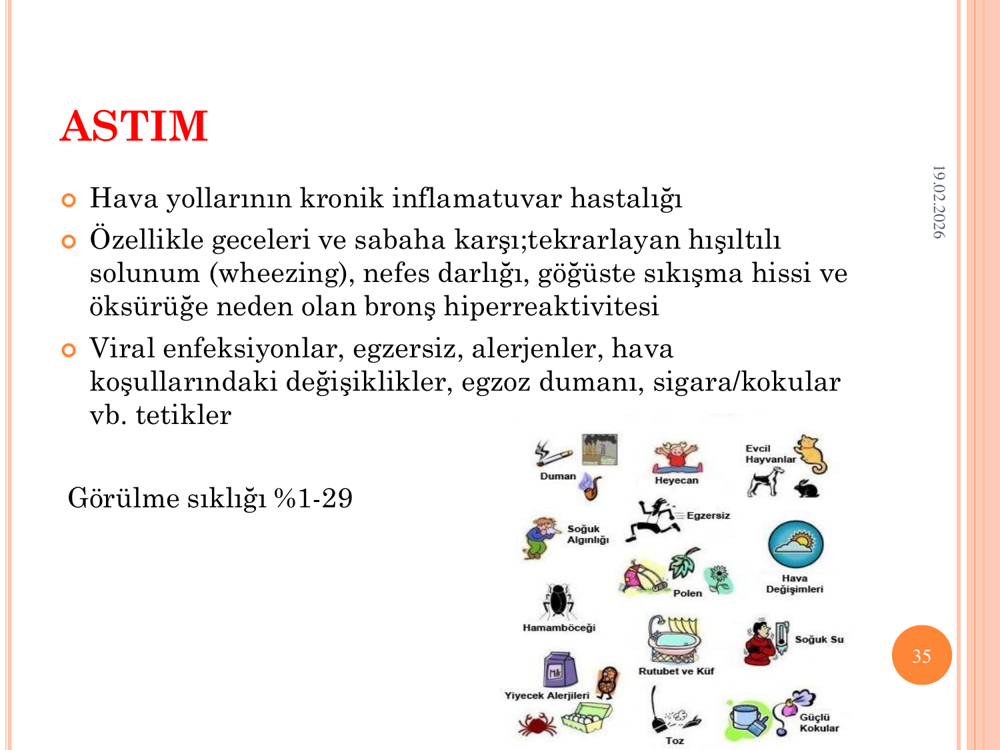

* **Viral enfeksiyonlar** (RSV, rhinovirus, parainfluenza) — en sık pediatrik astım tetikleyicisi
* **Egzersiz** (egzersizle indüklenen bronkokonstriksiyon)
* **Alerjenler** (pollen, ev tozu akarı, evcil hayvan, hamamböceği, mantar)
* **Hava koşulları** (soğuk, nem, ısı değişiklikleri)
* **Egzoz dumanı, sigara, kokular**
* **Gıda alerjileri**
* **Yiyecek katkı maddeleri** (sülfitler)
* Stres, heyecan, güçlü duygular

### Risk Faktörleri

* **Aile hikayesi ve genetik**
* **Çevresel faktörler** (hava kirliliği, aeroalerjenler, sigara)
* **Atopi** ve ekzema
* **Enfeksiyonlar** (RSV, parainfluenza)

---

## ASTIM ENDOTİP VE FENOTİPLERİ

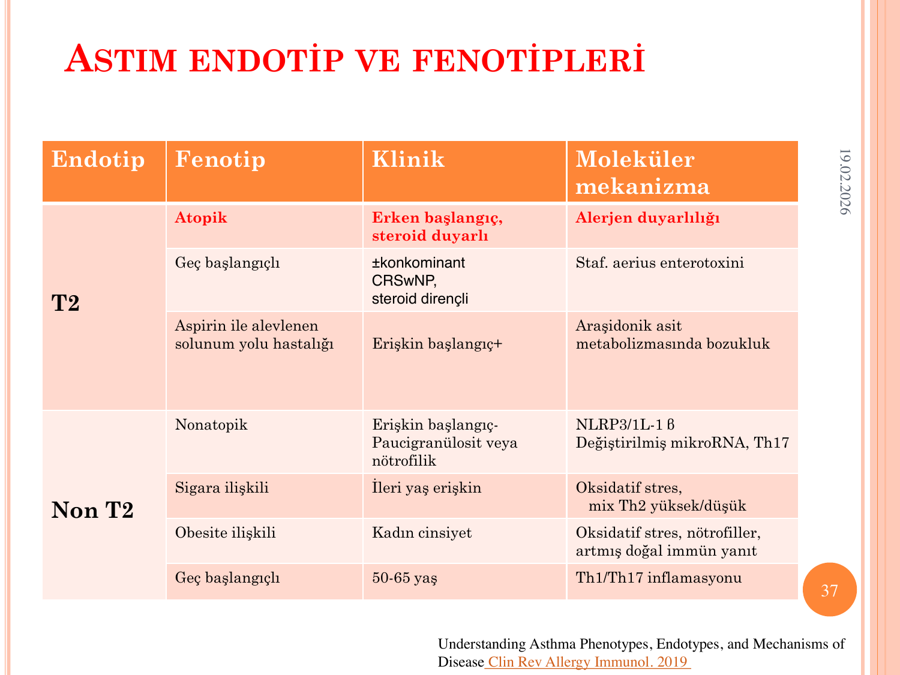

Astım homojen bir hastalık değildir. **Endotip** (altta yatan mekanizma) ve **fenotip** (klinik sunum) farklılıkları vardır:

### T2 (Type 2) Astım

**Ana mekanizma:** Th2/ILC2/eozinofil aracılı inflamasyon — IL-4, IL-5, IL-13.

| Fenotip | Klinik | Mekanizma |
|---|---|---|
| **Atopik** | **Erken başlangıçlı, steroid duyarlı** | Alerjen duyarlılığı |
| **Geç başlangıçlı** | ± konkomitan **CRSwNP**, steroid dirençli | Staph. aureus enterotoksini |
| **Aspirin ile alevlenen solunum yolu hastalığı (AERD)** | Erişkin başlangıçlı; NSAİD duyarlılığı + nazal polipler + astım | **Araşidonik asit metabolizmasında bozukluk** (↑ sisteinil lökotrienler) |

### Non-T2 Astım

**Ana mekanizma:** Nötrofilik veya paucigranülositik inflamasyon — Th1/Th17.

| Fenotip | Klinik | Mekanizma |
|---|---|---|
| **Nonatopik** | Erişkin başlangıçlı, paucigranülositik veya nötrofilik | NLRP3/IL-1β, Th17, mikroRNA değişiklikleri |
| **Sigara ilişkili** | İleri yaş erişkin | Oksidatif stres, mix Th2 |
| **Obezite ilişkili** | Kadın cinsiyet | Oksidatif stres, nötrofiller, doğal immün aktivasyon |
| **Geç başlangıçlı (non-T2)** | 50-65 yaş | Th1/Th17 inflamasyonu |

### T2 vs Non-T2 İnflamasyon Yolakları

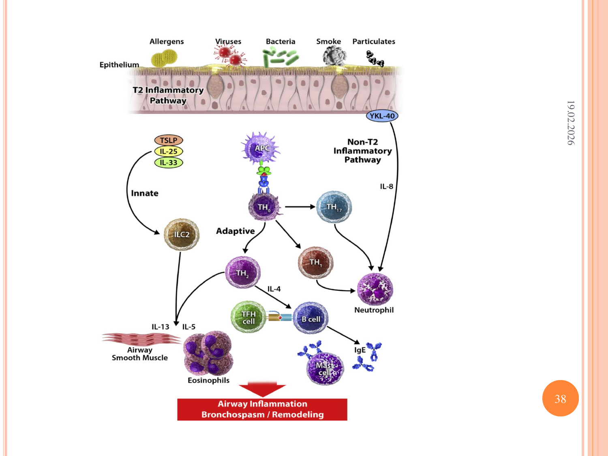

```
Alerjen/Virüs/Bakteri/Duman/Partikül
            ↓
     EPİTEL HASARI
            ↓
   ┌────────┴────────┐
   ↓                 ↓
TSLP, IL-25,         IL-8
IL-33 (alarminler)   ↓
   ↓                 ↓
T2 yolağı         Non-T2 yolağı
   ↓                 ↓
ILC2 / TH2          NÖTROFİLİK
   ↓                 inflamasyon
IL-4, IL-5, IL-13
   ↓
Eozinofil, IgE
   ↓
Bronkospazm, remodelling
```

> **💡 Neden önemli?** **Biyolojik tedaviler** (omalizumab, mepolizumab, benralizumab, dupilumab, tezepelumab) **T2 astımda** etkilidir. Non-T2 astımda biyolojik yanıt daha zayıftır → fenotiplendirme tedavi seçimini yönlendirir.

### Alerjik Astım (Atopik Astım)

* **Erken başlangıçlı**
* **Öksürük, nefes darlığı, hışıltılı solunum**
* **IgE aracılı (Tip 1)** reaksiyon
* **Etkenler:** Polenler, ev tozu akarları, mantarlar, evcil hayvanlar, hamamböceği

---

## ASTIM TANISI

**Tanı için kesin bir tek test yoktur.** Klinik + PFT + alerjik değerlendirme ile tanı konur.

### Öykü

* **Tetikleyici maruziyetiyle semptomların ortaya çıkması**
* **Semptomların epizodik olması**
* **Spontan ya da tedavi ile düzelme**
* **Mesleki maruziyet sorgulaması**
* **Aile öyküsü**
* **Atopi öyküsü** (alerjik rinit, atopik dermatit)

### Fizik Muayene

* **Hışıltılı solunum (wheezing)** — özellikle ekspirium
* **Uzamış ekspiryum** (inspiryum/ekspiryum = 1/4 - 1/6)
* **Yardımcı solunum kaslarının kullanımı**
* **Pulsus paradoksus**
* **Alerjik belirtiler** (AR, ekzema)
* **Şiddetli astım bulguları:** Taşikardi, takipne, **siyanoz, uykuya meyil**, pulsus paradoksus → acil müdahale!

> **⚠️ ÖNEMLİ — Sessiz akciğer:** Çok ağır astımda hışıltı **KAYBOLABİLİR** (hava girişi minimal). Bu **ölümcül bir bulgudur** — hastayı hemen entübasyon / YBÜ düşünmeye yöneltmelidir.

### Akciğer Fonksiyon Testleri

Astım, **obstrüktif patern** gösterir:

| Parametre | Astımda |
|---|---|
| **FEV1** | **Azalmış ↓** |
| **FVC** | Normal ya da artmış |
| **FEV1/FVC** | **Azalmış ↓** (<%70 obstrüksiyon göstergesi) |
| **PEF** | Azalmış ↓ |
| **FEF25-75** | Azalmış ↓ |
| **Akım-volüm eğrisi** | **Kavisli (konkav) çizgi** |
| **TLC** | Normal ya da artmış |
| **DLCO** | Normal ya da artmış (KOAH'tan farkı!) |

**Ek testler:**

* **Reversibilite testi:** Kısa etkili β2-agonist (salbutamol) sonrası FEV1'de **≥%12 ve ≥200 mL artış** → reversibl obstrüksiyon (astım lehine)
* **Bronş provokasyon testi** (metakolin, mannitol): Bronş hiperreaktivitesini gösterir. Özellikle **normal spirometri olan hastada** tanı koydurucu.

### Laboratuvar

* **Eozinofili** (periferik kan)
* **Total IgE yüksekliği**
* **Alerjen spesifik IgE**
* **Solunum yolu sekresyonları** (indüklenmiş balgam eozinofili, FeNO — fraksiyone ekshale NO)

---

## ASTIM TEDAVİSİ — GINA 2024

### Tedavinin Genel Prensibi

Astım tedavisi **basamak tedavisi** ilkesine dayanır. **Kontrol durumuna göre** basamaklar arasında çıkılır/inilir.

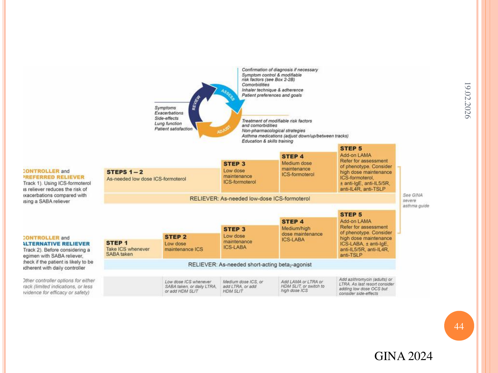

### GINA 2024 — Erişkin Astım Basamakları (Track 1 — Tercih Edilen)

**Reliever (rahatlatıcı):** Tüm basamaklarda **düşük doz İKS-formoterol** (maksimum 72 mg/gün formoterol).

| Basamak | Kontrol Tedavisi |
|---|---|
| **1-2** | **Gerektiğinde düşük doz İKS-formoterol** |
| **3** | **Düzenli düşük doz İKS-formoterol (bakım)** |
| **4** | **Düzenli orta doz İKS-formoterol (bakım)** |
| **5** | **Yüksek doz İKS-formoterol + LAMA** + fenotip değerlendirmesi → **anti-IgE (omalizumab)**, **anti-IL-5/5R (mepolizumab, benralizumab)**, **anti-IL-4Rα (dupilumab)**, **anti-TSLP (tezepelumab)** |

### GINA 2024 — Track 2 (Alternatif, SABA Reliever)

| Basamak | Kontrol | Reliever |
|---|---|---|
| **1** | SABA alındığında **düşük doz İKS** | SABA |
| **2** | **Düzenli düşük doz İKS** | SABA |
| **3** | **Düşük doz İKS-LABA** | SABA |
| **4** | **Orta/yüksek doz İKS-LABA** | SABA |
| **5** | LAMA ekle → yüksek doz İKS-LABA + biyolojik tedaviler | SABA |

> **⚠️ GINA 2019'dan beri büyük değişiklik:** **Yalnız başına SABA (kısa etkili β2 agonist)** kullanımı **önerilmez**. Her bir astım atağı tedavisine **mutlaka İKS eşlik etmelidir** — çünkü SABA monoterapisi astım atak riskini ve mortaliteyi artırır.

### Astım Tedavisinin Döngüsü (Kontrol Bazlı Yönetim)

```
       ┌──────── DEĞERLENDİR ────────┐
       │  • Tanının doğrulanması     │
       │  • Kontrol & risk faktörü   │
       │  • Komorbiditeler           │
       │  • İnhaler tekniği & uyum   │
       │  • Hasta tercihleri         │
       └──────────────┬──────────────┘
                      ↓
       ┌──────── AYARLA ─────────────┐
       │  • İlaçları düzenle         │
       │  • Farmakoloji dışı         │
       │    stratejiler               │
       │  • Modifiye edilebilir      │
       │    risk faktörü tedavisi     │
       └──────────────┬──────────────┘
                      ↓
       ┌──────── İZLE ───────────────┐
       │  • Semptomlar                │
       │  • Ataklar / yan etkiler    │
       │  • Akciğer fonksiyonu       │
       │  • Hasta memnuniyeti        │
       └──────────────┬──────────────┘
                      ↓
                (döngü tekrar başa)
```

### Ek Noktalar

* **İmmünoterapi:** Hafif-orta alerjik astımda, duyarlı olunan alerjen varsa düşünülür.
* **İnhaler teknik kontrolü** her vizitte yapılmalıdır — "tedavinin en önemli bileşeni".
* **Komorbiditeler:** **Alerjik rinit, nazal polip, GERD, obezite, OSAS** aktif olarak tedavi edilmelidir — kontrolsüz astımın sık nedenleri.

---

## SINAV NOTLARI — ANAHTAR HATIRLATMALAR

> **📋 En Sık Sorulan Noktalar:**
>
> **ALERJİK RİNİT:**
>
> 1. **AR = Tip 1 aşırı duyarlılık** (IgE aracılı) — en sık alerjik hastalık.
> 2. **Astım birlikteliği 1/3 hastada**; AR kontrolü astım kontrolünü iyileştirir.
> 3. **Sınıflama (ARIA):** İntermittan (<4 gün/hafta veya <4 hafta) vs persistan; hafif vs orta-ağır (uyku/aktivite/iş).
> 4. **Klasik semptomlar:** Berrak akıntı, tıkanıklık, hapşırık, kaşıntı.
> 5. **Klasik FM bulguları:** Alerjik shiner, Dennie-Morgan çizgileri, alerjik selam, alerjik yüz görünümü, kaldırım taşı orofarenks.
> 6. **Tanı altın standartı: Deri prik testi** (IgE aracılı, 15-20 dk'da sonuç). Antihistaminik 5-7 gün önce kesilir.
> 7. **Hafif AR tedavisinde ilk basamak:** 2. kuşak oral antihistaminik (setirizin, loratadin, bilastin).
> 8. **Orta-ağır AR'de en etkili ilaç: İntranazal kortikosteroid (İNKS).**
> 9. **İntranazal dekonjestan** max **3 gün** — yoksa **rinitis medikamentoza**.
> 10. **Lökotrien reseptör antagonistleri** → rinit + astım birlikteliğinde tercih.
> 11. **İmmünoterapi** — hastalığı modifiye eden TEK tedavi; astım gelişimini önleyebilir.
>
> **ASTIM:**
>
> 12. **Astım = kronik havayolu inflamasyonu + bronş hiperreaktivitesi** (reversibl obstrüksiyon).
> 13. **T2 astım (atopik, eozinofilik)** → IKS + biyolojiklere duyarlı. **Non-T2** → biyolojik yanıt zayıf.
> 14. **AERD:** Astım + NSAİD duyarlılığı + nazal polip (Samter triad, aspirin-exacerbated respiratory disease).
> 15. **PFT:** FEV1 ↓, FEV1/FVC ↓ (obstrüktif patern), **reversibilite: FEV1 artışı ≥%12 ve ≥200 mL** salbutamol sonrası.
> 16. **Normal spirometri varsa:** Bronş provokasyon testi (metakolin, mannitol).
> 17. **Sessiz akciğer ağır astımın ölümcül bulgusudur.**
> 18. **GINA 2019+:** **SABA monoterapisi önerilmez**. Tüm basamaklarda **İKS içeren tedavi** zorunlu.
> 19. **Tercih edilen reliever: Düşük doz İKS-formoterol** (Track 1).
> 20. **Biyolojikler (basamak 5):** Omalizumab (anti-IgE), mepolizumab/benralizumab (anti-IL-5/5R), dupilumab (anti-IL-4Rα), tezepelumab (anti-TSLP).
> 21. **Erken faz (histamin)** → antihistaminikler; **geç faz (eozinofil, Th2)** → kortikosteroidler etkili.
> 22. **Komorbiditeler:** AR + nazal polip + GERD + obezite + OSAS — kontrolsüz astımın sık nedenleri.

---

> **Kaynaklar:**
>
> 1. **ARIA Guidelines** (Allergic Rhinitis and its Impact on Asthma)
> 2. **GINA 2024 Main Report** — Global Strategy for Asthma Management and Prevention
> 3. **UpToDate** — Allergic rhinitis: Clinical manifestations, epidemiology, and diagnosis (2024)
> 4. **Alerjik Rinit Tanı ve Tedavi Rehberi 2022**
> 5. A Lippincott Manual — Alerji ve İmmünoloji El Kitabı
> 6. Prof. Dr. Songül Çildağ — Alerjik Rinit ve Astım ders notları 2024-2025
