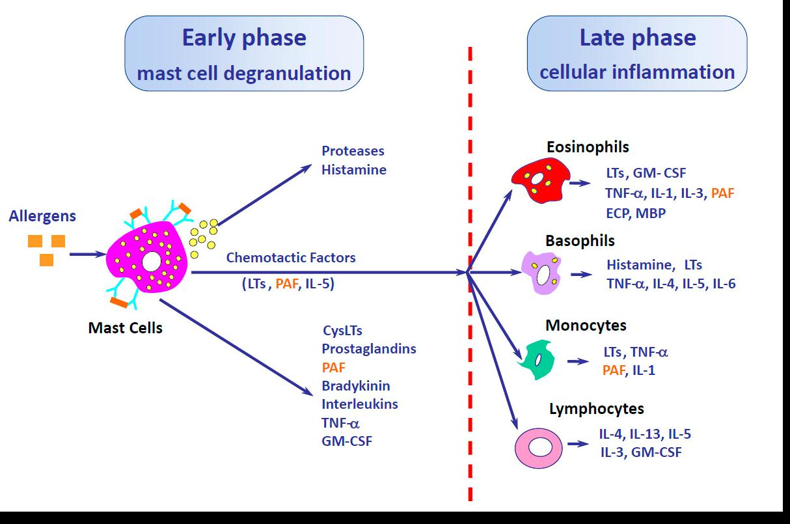
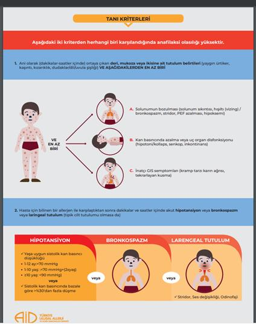
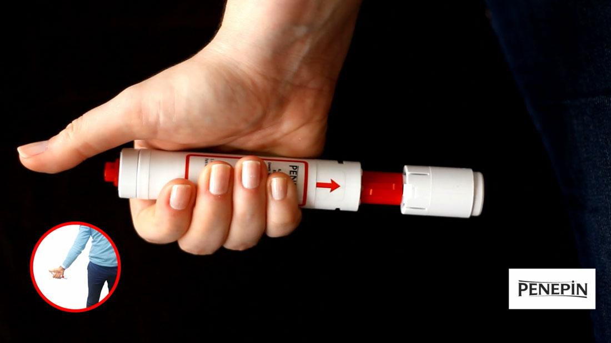

# ANAFİLAKSİ

**Hazırlayan:** Prof. Dr. Songül Çildağ
**Bölüm:** ADÜ Tıp Fakültesi - İmmünoloji ve Alerji Hastalıkları Bilim Dalı

---

## İÇİNDEKİLER

1. [Tanım ve Epidemiyoloji](#tanim-ve-epidemiyoloji)
2. [Patofizyoloji](#patofizyoloji)
3. [Tetikleyiciler](#tetikleyiciler)
4. [Etkileyen Faktörler ve Kofaktörler](#etkileyen-faktörler-ve-kofaktörler)
5. [Semptomlar ve Bulgular](#semptomlar-ve-bulgular)
6. [Tanı](#tani)
7. [Ayırıcı Tanı](#ayirici-tani)
8. [Tedavi](#tedavi)
9. [Takip ve Taburculuk](#takip-ve-taburculuk)

---

## TANIM VE EPİDEMİYOLOJİ

* Mast hücre ve bazofillerden salınan mediyatörlerin yol açtığı, **akut başlangıçlı** (dakikalar-saatler içerisinde), yaşamı tehdit eden, **sistemik aşırı duyarlılık reaksiyonu**dur
* Prevalansı: **3-5.1/1000**
* Mortalite oranı:
  - 0.05-0.5/milyon hasta/yıl/ilaç
  - 0.03-0.3/milyon hasta/yıl/gıda
  - 0.09-0.1/milyon hasta/yıl/venom
* **%26-54** anafilaksi tekrarlamaktadır

---

## PATOFİZYOLOJİ

| Mekanizma | Alt Tip | Tetikleyiciler |
|---|---|---|
| **İmmünolojik** | IgE aracılı (en sık) | Besinler, ilaçlar, venom, lateks |
| | IgE aracılı olmayan | Kompleman sistemi (anafilatoksinler C3a, C5a), kontakt ve koagülasyon sistem aktivasyonu, IgG aracılı |
| **Nonimmünolojik** | Direkt mast hücre/bazofil uyarımı | Fiziksel faktörler (egzersiz), alkol, bazı ilaçlar (opioidler, radyokontrast madde vb.) |

### Mast Hücre ve Bazofil Mediyatörleri

**Önceden sentezlenmiş mediyatörler:**
* Histamin, triptaz, heparin, karboksipeptidaz

**Yeni üretilen mediyatörler:**
* PAF, PGD2, LTB4, sisteinil lökotrienler (LTC4, LTD4, LTE4)

**Mediyatörlerin etkileri:**
* **Histamin:** Belirtilerin çoğundan sorumlu - vazodilatasyon, vasküler geçirgenlikte artış, bronkospazm, mukus sekresyonunda artış, GIS ve uterus spazmı, taşikardi, kaşıntı
* **Triptaz:** Anjioödem, hipotansiyon, DIC vb.
* **LT, PG, PAF:** Bronkospazm, hipotansiyon, eritem

---

## TETİKLEYİCİLER

* **Gıdalar** (çocuklarda sık)
  - Süt, yumurta, buğday, soya, fıstık (çocuklarda sık)
  - Kabuklu kuruyemişler (yer fıstığı, fındık), deniz kabukluları, balık (erişkinde sık)
* **İlaçlar** (erişkinde sık)
  - Antibiyotikler (beta-laktam sık)
  - Analjezikler (NSAİİ sık)
  - Biyolojik ilaçlar vb.
* **Böcek sokmaları** - Bal arısı, yaban arısı, ateş karıncaları (erişkinde sık)
* **İdiyopatik** (%20)
* Ayrıca:
  - Latekse bağlı anafilaksi
  - Egzersize bağlı anafilaksi
  - Alerji testleri sırasında
  - İmmünoterapi ilişkili
  - Sistemik mastositoz

---

## ETKİLEYEN FAKTÖRLER VE KOFAKTÖRLER

### Yaşa Bağlı Faktörler

* **Bebekler:** Belirtileri tanımlayamaz
* **Ergenler ve genç-erişkinler:** Risk alma, bilinen uyaranlardan kaçınmayabilir, adrenalin otoenjektörü taşımayabilir
* **Gebelik:** İlaç kullanımı ve tıbbi/cerrahi girişim olasılığı nedeniyle perioperatif ve lateks anafilaksisi riski
* **Yaşlılar:** Ek hastalıklar ve ilaçlar nedeniyle ölüm riskleri yüksek

### Ek Hastalıklar

* Astım ve diğer kronik solunum yolu hastalıkları
* Kardiyovasküler hastalıklar
* Mastositozis
* Alerjik rinit ve atopik dermatit gibi atopik hastalıklar
* Psikiyatrik/psikolojik hastalıklar (riskli davranış eğilimi)

### Eş Zamanlı İlaçlar / Alkol

* **Beta-adrenerjik blokörler**
* **ACE inhibitörleri**
* NSAİİ
* Sedatifler, antidepresanlar, narkotikler, alkol (hasta uyaranları ve belirtileri fark edemez)

### Diğer Kofaktörler

* **Egzersiz:** Besin veya ilaç (NSAİİ) ilişkili veya sadece egzersiz ile
* Akut enfeksiyonlar
* Stres
* Rutinin bozulması
* Premenstrüel dönem

---

## SEMPTOMLAR VE BULGULAR

| Sistem | Sıklık | Bulgular |
|---|---|---|
| **Deri** (en sık) | %80-90 | Ürtiker ve anjioödem, kızarıklık, kaşıntı |
| **Solunum sistemi** | %70 | Rinit, üst solunum yolu tıkanıklığı, wheezing, dispne |
| **Gastrointestinal** | %30-45 | Bulantı, kusma, ishal, kramp şeklinde karın ağrısı |
| **Kardiyovasküler** | %10-45 | Baş dönmesi, senkop, hipotansiyon, aritmi, anjina, MI |
| **Diğer** | - | Baş ağrısı, substernal ağrı, konvülziyon, yaygın damar içi pıhtılaşması |

### Atak Tipleri

* **Tek evreli atak** (en sık) - 1-2 saat içinde yatışır ve geri dönmez
* **İki evreli (bifazik) atak** (>%20) - İlk semptomlardan 4-12 saat sonra tekrarlama, daha ağır tablo (adrenalin uygulamasında gecikme, yetersiz kortikosteroid uygulaması nedeniyle)
* **Uzamış atak** (nadiren) - Atağın saatler, günler sürmesi

---

## TANI

### Öykü ve Fizik Muayene

* Son 4-6 saatte alınan ilaçlar, gıdalar
* Venom sokma öyküsü
* Egzersiz durumu
* Sıcak, soğuk maruziyeti, cinsel aktivite
* Menstrüel siklus
* Atopi öyküsü

### Tanısal Testler

* Anafilaksi tanısı asıl olarak **klinikle** konulur
* **Serum triptaz düzeyi** - 60-90 dk sonra zirve, 24 saate kadar yüksek kalabilir (en ideali 1.-2. saatlerde ölçüm)
* **Plazma histamin** - 5-10 dk yükselir, 60 dk normale döner (yararı kısıtlı); 24 saatlik idrarda histamin ve metabolitleri
* **Spesifik IgE testleri** - Etyolojiye yönelik
* **Provokasyon testleri** - Tanısal şüphe varsa

### Tanı Kriterleri

Aşağıdaki iki kriterden herhangi biri karşılandığında anafilaksi olasılığı yüksektir:

**Kriter 1:** Ani olarak (dk-saatler içerisinde) **deri, mukoza veya her ikisine ait tutulum bulguları** (yaygın ürtiker, kaşıntı, kızarıklık, dil-dudak-uvulada şişme) **VE aşağıdakilerden en az 1 tanesinin varlığı:**

* A - Solunumun bozulması (dispne, wheezing/bronkospazm, stridor, PEF azalması, hipoksemi)
* B - Kan basıncında azalma veya uç organ disfonksiyonu (hipotoni, kollaps, senkop, inkontinans)
* C - İnatçı-ciddi GIS semptomları (kramp tarzı karın ağrısı, tekrarlayan kusma)

**Kriter 2:** Tipik deri tutulumu olmasa bile hasta için bilinen veya yüksek olasılıklı bir alerjenle karşılaştıktan sonra, dakikalar ve saatler içerisinde **akut hipotansiyon** veya **bronkospazm** veya **laringeal tutulum**

> **Hipotansiyon tanımı:**
> * 12 ay: <70 mmHg
> * 1-10 yaş: <70 mmHg + (2 x yaş)
> * ≥10 yaş: <90 mmHg
> * veya sistolik kan basıncında bazale göre >%30 düşme

> **Laringeal tutulum:** Stridor, ses kısıklığı, odinofaji

### Anafilaksinin Sınıflandırılması

| Derece | Deri | GIS | Solunum | KVS | Nörolojik |
|---|---|---|---|---|---|
| **Hafif** | Göz/burunda kaşıntı, yaygın kaşıntı, kızarıklık, ürtiker, anjioödem | Ağızda kaşıntı, karıncalanma, dudakta hafif şişlik, bulantı/kusma, hafif karın ağrısı | Burun tıkanıklığı, hapşırık, boğazda kaşıntı/sıkışma hissi, hafif hışıltı | Taşikardi (>15/dk artış) | Aktivite azalması, anksiyete |
| **Orta** | Yukarıdakilerden herhangi biri | Kramp tarzı karın ağrısı, ishal, tekrarlayan kusma | Boğuk ses, havlar gibi öksürük, yutma güçlüğü, stridor, dispne, orta derece hışıltı | Yukarıdaki gibi | Baş dönmesi, ölüm korkusu |
| **Ağır** | Yukarıdakilerden herhangi biri | Barsak kontrol kaybı | Siyanoz veya SpO₂ <%92, solunum durması | Hipotansiyon ve/veya kollaps, disritmi, şiddetli bradikardi, kalp durması | Konfüzyon, bilinç kaybı |

---

## AYIRICI TANI

| Kategori | Durumlar |
|---|---|
| **Yaygın karışabilen durumlar** | Akut astım, senkop, anksiyete/panik atak, akut jeneralize ürtiker, yabancı cisim aspirasyonu, kardiyovasküler (MI, pulmoner emboli), nörolojik olaylar (nöbet, SVO) |
| **Aşırı endojen histamin salınımı** | Mastositoz/klonal mast hücre hastalıkları, bazofilik lösemi |
| **Nonorganik hastalıklar** | Vokal kord disfonksiyonu, hiperventilasyon, psikosomatik epizod |
| **Postprandiyal sendromlar** | Skombroidozis, polen-alerji sendromu, monosodyum glutamat, sülfit, gıda zehirlenmesi |
| **Flush sendromları** | Perimenopoz, karsinoid sendrom, otonomik epilepsi, tiroid medüller karsinomu |
| **Şok** | Hipovolemik, kardiyojenik, distributif (dağıtıcı) şok, septik şok |
| **Diğer** | Nonalerjik anjioödem (HAÖ, ACE inh. ilişkili), sistemik kapiller kaçış sendromu, kırmızı adam sendromu (vankomisin), feokromositoma |

---

## TEDAVİ

### İlk Müdahale

* **A** (airway), **B** (breath), **C** (circulation) kontrolü
* Alerjenle temas kesilmeli
* Mental durum, deri, vücut ağırlığı değerlendirilmeli
* Acil yardım istenmeli
* Hasta sırt üstü yatar pozisyonda, baş aşağıda, bacaklar baş hizasının yukarısında olmalı

### Medikal Tedavi

#### 1. Adrenalin (İlk Seçenek)

**⚠️ ÖNEMLİ:** Adrenalin anafilakside **ilk ve en önemli** ilaçtır

* 1/1000'den (1 mg/mL) **0.01 mg/kg** intramusküler
* 5-15 dk arayla tekrarlanabilir (2 kez)
* **Erişkin ve >12 yaş:** 0.5 mg İM
* **<12 yaş:** 0.3 mg İM

**Adrenalin otoenjektörü:**
* \>25 kg: 0.3 mg/0.3 mL
* 10-25 kg: 0.15 mg/0.3 mL

#### 2. İntravenöz Sıvı Replasmanı

* Hızlı infüzyon (SF veya Ringer laktat)
* **Erişkin:** 1-2 L (ilk 5-10 dk 5-10 mL/kg)
* **Çocuk:** 10 mL/kg, gerekirse 20 mL/kg bolus
* Hastayı monitörize et, gerekirse her aşamada KPR

#### 3. Antihistaminik

* **Difenhidramin veya Feniramin:**
  - Çocuk: 1 mg/kg (maks: 50 mg) İV, 10 dk'dan uzun sürede
  - Erişkin: 25-50 mg İV, 5 dk'dan uzun sürede
* **Famotidin (H2 bloker):**
  - Çocuk: 0.25 mg/kg (maks: 20 mg) İV, 2 dk'dan uzun sürede
  - Erişkin: 20 mg İV, 2 dk'dan uzun sürede
* H1 + H2 birlikte (10 dk'dan uzun sürede)

#### 4. Kortikosteroid

* **Çocuk:** Metilprednizolon 1 mg/kg (maks: 125 mg) İV/İO
* **Erişkin:** Metilprednizolon 1-2 mg/kg İV/İO
* Geç faz reaksiyon için önemli

#### Ek Tedaviler

* **Bronkospazm** (İM adrenaline dirençli ise): Salbutamol nebül (0.15 mg/kg)
* **Üst solunum yolu obstruksiyonu:** İnhaler adrenalin - 0.5 mL/kg (maks: 5 mL) 1/1000 adrenalin

#### 5. Glukagon

* Özellikle **beta bloker kullanan** hastalarda, adrenaline optimal yanıt yoksa İV uygulanabilir
* **Çocuk:** 20-30 mcg/kg (maks: 1 mg) 5 dk'dan uzun sürede İV infüzyon, sonra 5-15 mcg/dk
* **Erişkin:** 1-5 mg 5 dk'dan uzun sürede İV infüzyon, sonra 5-15 mcg/dk

### Dirençli Anafilaksi

2 kez İM adrenalin ve İV sıvı yüklemesine rağmen hipotansiyon ve şok bulguları devam ediyorsa **adrenalin infüzyonu** başlanır:

* 1/1000'lik adrenalin 1 mg, 250 mL %5 dekstroz veya SF içinde (4 mcg/mL)
* 1-4 mcg/dk infüzyon hızında, kan basıncına göre ayarlanır
* Maksimum 10 mcg/dk doza kadar çıkılır
* Hasta yoğun bakımda izlenir, mutlaka monitörize edilir

**Dirençli anafilakside düşünülecek diğer tedaviler:** Dopamin, vazopressin, atropin ve metilen mavisi vb.

---

## TAKİP VE TABURCULUK

* Taburcu edilene kadar **yatar pozisyonda** izlenmeli
* Anafilaksi hastası **en az 8 saat** takip edilmeli
* Dolaşım bozukluğu, bronkospazm ve laringeal tutulum (stridor, ses değişikliği, odinofaji) olanlar **24 saat yatırılarak** izlenmelidir
* Taburculuk öncesi bilgilendirme yapılmalı, adrenalin otoenjektörü kullanımı açısından değerlendirilmeli
* **Alerji uzmanına yönlendirilmeli**
