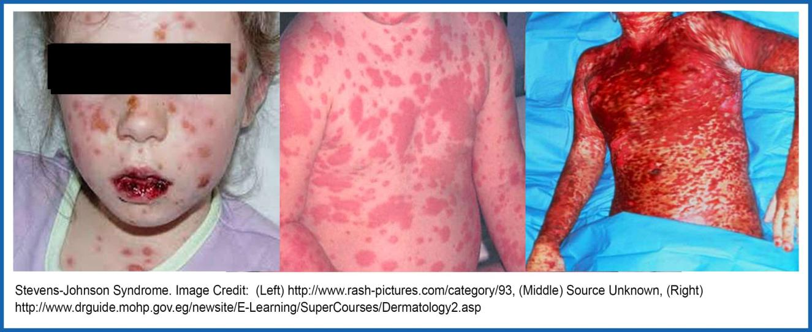
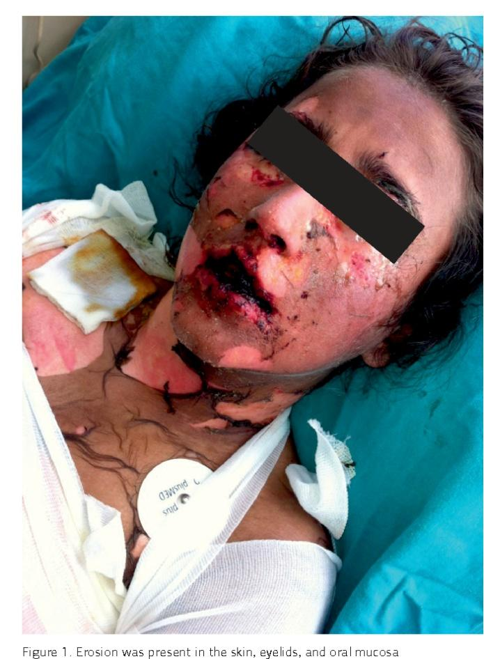
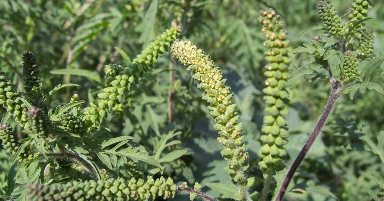

# İLAÇ VE GIDA ALERJİSİNE YAKLAŞIM

**Hazırlayan:** Prof. Dr. Songül Çildağ
**Bölüm:** ADÜ Tıp Fakültesi - İmmünoloji ve Alerji Hastalıkları Bilim Dalı

---

## İÇİNDEKİLER

1. [İstenmeyen İlaç Reaksiyonları](#istenmeyen-ilaç-reaksiyonlari)
2. [İlaç Alerjisi](#ilaç-alerjisi)
3. [İlaç Aşırı Duyarlılık Reaksiyonları Sınıflaması](#siniflandirma)
4. [Risk Faktörleri](#risk-faktörleri)
5. [Nonalerjik İlaç Aşırı Duyarlılık Reaksiyonları](#nonalerjik-reaksiyonlar)
6. [Tanı](#tani)
7. [Gıda Alerjisi](#gida-alerjisi)

---

## İSTENMEYEN İLAÇ REAKSİYONLARI

Bir ilacın amaçlanan etkisine ek olarak, amaçlanmamış, istenmeyen ve zararlı etkiler:
* Hastane başvurularının **%3-6**'sı
* Hastanede yatan hastaların **%10-15**'i

| A Tipi (%80) - Farmakolojik/Toksik | B Tipi (%15-20) - Aşırı Duyarlılık |
|---|---|
| Öngörülebilir | Öngörülemez |
| Doz bağımlı | Doz bağımsız |
| Herkeste görülebilir | Hassas kişilerde görülebilir |
| Farmakolojik aktivite ilişkili | Farmakolojik aktivite ilişkisiz |
| Örn: 1. kuşak AH'lerin sedatif etkisi, doz fazlalığı-toksisite, sitotoksik ilaçlarla saç dökülmesi | **İlaç alerjisi (immünolojik)** veya nonalerjik aşırı duyarlılık (nonimmünolojik) |

---

## İLAÇ ALERJİSİ

* İmmün sistem aracılı aşırı duyarlılık reaksiyonları
* Tüm istenmeyen ilaç reaksiyonlarının **%10**'u
* Erişkinlerin **%6-7**'si ilaç alerji öyküsü
* En sık etken: **Beta-laktam** ve **NSAİİ**

### İlaç Alerjisinin Özellikleri

* Beklenen farmakolojik etkilerden farklı - alerjik semptomlar
* Etken ilaç ve çapraz reaktivite gösteren benzeri ilaçlar
* İlaca karşı antikorlar veya hassaslaşmış T lenfositler
* İlk kullanımda reaksiyon olmaz, duyarlanma için latent dönem (>1 hafta, 7-10 gün); potent ilaçlar daha erken (RKM, genel anestezik)
* İlacın yeniden alınmasıyla reaksiyon
* İlacın kesilmesiyle geriler

---

## SINIFLANDIRMA

### Süreye Göre

* **Erken tip reaksiyonlar:** <1 saat (1-6 saat) - Tip 1
  - Kızarıklık, ürtiker/anjioödem, rinit, bronkospazm, anafilaksi
* **Gecikmiş tip reaksiyonlar:** >6 saat - birkaç hafta - Tip 4
  - **Makülopapüler ekzantem (MPE)** (en sık)
  - Akut jeneralize ekzantematöz püstülozis (AGEP)
  - Fix ilaç erüpsiyonu
  - **Ciddi kutanöz ilaç reaksiyonları:** Stevens-Johnson Sendromu (SJS), Toksik Epidermal Nekrolizis (TEN), DRESS
* **Diğer gecikmiş tip:** Hepatit, sitopeni, otoimmün hastalıklar (SLE vb.) - Tip 2, Tip 3

### Patomekanizmaya Göre

* **Alerjik aşırı duyarlılık - erken tip** (Gell-Coombs Tip 1, IgE aracılı, 0-6 saat)
* **Nonalerjik aşırı duyarlılık** (psödoalerjik, duyarlanma gerekmiyor, ilk doz olabilir, dk içinde)
* **Alerjik aşırı duyarlılık - gecikmiş tip** (Gell-Coombs Tip 4, T hücre aracılı, 24-72 saat)
* **İmmünolojik aşırı duyarlılık diğer formları** (Gell-Coombs Tip 2, Tip 3; IgG, IgM, IgA aracılı, ≥24 saat)
* **Tedavi altında yeni duyarlanma** (Tip 1-4 duyarlanma süresi, ≥5-7 gün - haftalar)

### Gell-Coombs Sınıflaması

| Tip | İmmün Cevap | Patofizyoloji | Klinik | Duyarlanma | Reaksiyon Süresi |
|---|---|---|---|---|---|
| **I** | IgE | Mast h. ve bazofil degranülasyonu | Anafilaktik şok, AÖ/ürtiker, bronkospazm | 1-2 hf | 1-6 saat |
| **II** | IgG ve kompleman | Kompleman bağımlı sitotoksisite | Sitopeni | 1-2 hf | 5-15 gün |
| **III** | IgM/IgG ve kompleman/FcR | İmmün kompleks depolanması | Serum hastalığı, vaskülit | 10-21 gün | 7-8 gün |
| **IVa** | Th1 (IFNγ) | Monositik inflamasyon | Ekzema/KD | 7-21 gün | 1-21 gün |
| **IVb** | Th2 (IL-4, IL-5) | Eozinofilik inflamasyon | MPE, DRESS | 1 gün - 6 hf | 1 gün - 6 hf |
| **IVc** | T sitotoksik (perforin/granzim B) | Keratinosit ölümü | MPE, FİE, AGEP, **SJS/TEN** | 1-2 hf | 4-28 gün |
| **IVd** | T hücreleri (IL-8/CXCL8) | Nötrofilik inflamasyon | AGEP | 1-2 hf | 1-2 gün |

### Klinik Tablolar ve İlişkili İlaçlar

| Tip | Klinik | İlişkili İlaçlar |
|---|---|---|
| **Tip 1 (IgE)** | Ürtiker, anjioödem, anafilaksi, bronkospazm, rinit | **Beta-laktam antibiyotikler**, monoklonal antikorlar |
| **Tip 2 (Sitotoksik)** | Hemolitik anemi, trombositopeni, granülositopeni | Penisilin, kinin, sülfonamid |
| **Tip 3 (İmmün kompleks)** | Lupus, vaskülit, serum hastalığı | Hidralazin, prokainamid, izoniazid, infliksimab |
| **Tip 4 - MPE** | Makülopapüler ekzantem | Aminopenisilinler, sefalosporinler, allopürinol, antiepileptikler |
| **Tip 4 - FİE** | Fix ilaç erüpsiyonu | Tetrasiklin, NSAİİ, karbamazepin |
| **Tip 4 - AGEP** | Akut jeneralize ekzantematöz püstülozis | Antibiyotikler, kalsiyum kanal blokerleri |
| **Tip 4 - DRESS** | Eozinofili, sistemik semptomlar, döküntü | Antikonvülzanlar, sülfonamidler, minosiklin, allopürinol |
| **Tip 4 - SJS/TEN** | SJS: <%10 epidermal ayrılma; TEN: >%30 epidermal ayrılma | Antibakteriyel sülfonamidler, antikonvülzanlar, NSAİİ, lamotrijin |

> **⚠️ ÖNEMLİ:** IgE duyarlılığı yıllar boyu kalıcıdır. T-hücre hafızası geç reaksiyonlar için daha güçlü bile olabilir. İlaç alerjisi olduğunda ilaçtan ve çapraz reaktif ilaçlardan **hayat boyu** kaçınma önerilmektedir.

---

## RİSK FAKTÖRLERİ

| İlaçla İlişkili | Bireyle İlişkili |
|---|---|
| Uygulanma sıklığı | Cinsiyet (kadın) |
| Veriliş yolu | Yaş (erişkin/orta yaş) |
| Molekül yapısı | **Genetik yatkınlık** |
| Tüketilme oranı | HLA B*1502 → Karbamazepin, fenitoin |
| İmmün sistemi uyarabilme yeteneği | HLA B*5801 → Allopürinol |
| | Önceye ait ilaç alerji öyküsü |
| | Komorbidite/astım, kronik ürtiker |
| | ASA/NSAİİ, HIV+, kistik fibroziste AB |
| | Atopi (özellikle RKM) |

---

## NONALERJİK REAKSIYONLAR

* Anafilaktoid/psödoalerjik reaksiyon
* İmmünolojik temeli olmayan reaksiyonlar
* IgE aracılı reaksiyon kadar sık, benzer klinik (genellikle hafif form, anafilaksi olabilir)
* İlacın immünolojik olmayan bir mekanizma ile mast-bazofil uyarması
* **Herhangi bir dozda / ilk dozda** olabilir

**Örnekler:**
* **Radyokontrast madde (RKM)** anafilaksisi
* **Opioidler** ilişkili ürtiker
* **ASA** ile alevlenen ürtiker-astım

| Özellik | Alerjik (Tip 1, IgE aracılı) | Nonalerjik (Psödoalerjik) |
|---|---|---|
| Duyarlanma süresi | 1-2 hafta | Gerekmiyor |
| İlk dozda | Olmaz | **Olabilir** |
| Reaksiyon zamanı | İlk 1 saat | Dakikalar içinde |
| Şiddet | Daha ciddi | Genellikle hafif form |

---

## TANI

### Öykü (En Önemli)

1. Aşırı duyarlılık reaksiyonu vs diğer istenmeyen etki ayrımı
2. Reaksiyon ne zaman olmuş? Acil servis/hastaneye yatış olmuş mu?
3. Son 1 ay içerisinde kullanılan tüm ilaçlar
4. Reaksiyon sırasında kullanılmakta olan ilaçlar, kullanım süresi ve yolu
5. Kullanım dozu ve sıklığı
6. Daha önce aynı ilacı kullanım öyküsü
7. Hangi dozdan ne kadar süre sonra reaksiyon?
8. İlaç kesilmiş mi? Kesilmişse düzelmiş mi?
9. Daha sonra tekrar kullanılmış mı? Tekrar reaksiyon olmuş mu?
10. Çocuklarda enfeksiyon öyküsü (viral ekzantem - MPE ayrımı)
11. Atopik hastalık öyküsü

### Tanısal Testler

**İn vivo testler:**
* **Erken tip reaksiyon:** Önce deri prik testi, sonra intradermal test - erken okuma (20 dk)
  - Şiddetli reaksiyonda deri testi öncesinde serum spesifik IgE ölçümü
* **Gecikmiş tip reaksiyon:** Deri yama testi (48-72 saat) ve intradermal test - geç okuma (48-72 saat)
* **İlaç provokasyon testi:** Hepsi negatifse, kontrendikasyon yoksa (altın standart)

**İn vitro testler:**
* **Erken tip:** İlaç spesifik IgE, CAST (sisteinil lökotrien salınım testi), 15-HETE, bazofil aktivasyon testi (CD63, CD203c)
* **Gecikmiş tip:** Lenfosit transformasyon testi, T hücre aktivasyon analizi

**İn vitro testler ne zaman tercih edilir?**
* Provokasyon testi yapılamadığında
* Cilt testinin kendisi potansiyel tehlike oluşturduğunda (örn. beta-laktam antibiyotiğe karşı anafilaktik reaksiyondan sonra)
* Negatif cilt testleri ve şiddetli ilaç reaksiyonları durumlarında

> İlaç alerji testleri reaksiyondan sonraki **4 hf - 6 ay** içerisinde yapılmalı

### İlaç Provokasyon Testleri

* İlaç alerji tanısı için **altın standart**
* Bölünmüş artan dozlarda ilacı uygulama
* Her hasta için risk/yarar düşünülmeli
* Tedavide kullanılacak uygulama yolu tercih edilmeli (genellikle oral)
* Tam doza çıkılmalı

**Endikasyonları:**
* Aşırı duyarlılık düşünülen hastada; test negatif veya test yapılamıyorsa tanı koymak/dışlamak
* Nonspesifik bulgular olan hastada; aşırı duyarlılığı dışlamak (lokal anestezi/vazovagal ayrımı)
* Yapısal ilişkisiz ilaçla alternatif bulmak
* Kanıtlanmış ilaçla çapraz reaksiyonu dışlamak (penisilin-sefalosporin)

**Kontrendikasyonları:**
* Gebelik
* Akut enfeksiyon, kontrolsüz komorbid hastalıklar
* Tip 2, 3, ciddi Tip 4 aşırı duyarlılık reaksiyonları (FİE ve MPE hariç)
* Anafilaksi

### Reaksiyon Tipine Göre Tanısal Yaklaşım Özeti

| Reaksiyon Tipi | Deri Testi | İn Vitro Test | Provokasyon | Desensitizasyon |
|---|---|---|---|---|
| **Tip 1 (IgE)** | Prick ve intradermal | Sp IgE, triptaz, CAST, bazofil akt. | Yapılabilir | Yapılabilir |
| **Nonimmünolojik** | - | CAST, bazofil akt. | Yapılabilir | Yapılabilir |
| **Tip 2 (IgG)** | - | TKS, coombs | **Kontrendike** | **Kontrendike** |
| **Tip 3 (İK)** | - | Sed, CRP, İK, kompleman | **Kontrendike** | **Kontrendike** |
| **Tip 4 (T hücre)** | Yama testi, İD geç okuma | LTT, CD69 | Sadece MPE, FİE, dermatit | MPE?? |

### Test Dozu vs Desensitizasyon

* **Test dozu:** Alerjik olduğu düşünülmeyen ilacın kullanımdan hemen önce uygulanması (bölünmüş artan doz)
* **Desensitizasyon:** Alerjik ilacın kullanılabilir duruma getirilmesi (tolerans indüksiyonu)
  - Tolerans **geçicidir**
  - Her tip reaksiyonda yapılmaz

---

## GIDA ALERJİSİ

* Sıklıkla **Tip 1 - IgE aracılı** reaksiyon
* Her yaşta görülme sıklığı: **%3**
  - **Çocuklarda %4-8:** İnek sütü, yumurta, soya, buğday, yer fıstığı ve diğer kabuklu yemişler, balık
  - **Erişkinde %1-2:** Kabuklu deniz ürünleri, kabuklu kuruyemişler, sebze, meyveler

### Klinik Bulgular

* **Anafilaksi** (en ciddi)
* Yaygın kaşıntı
* Ürtiker
* Rinokonjunktivit
* Bulantı, kusma, karın ağrısı, ishal
* Atopik dermatit

### Gıda Alerjisi ve Anafilaksi

* Gıda alımını takiben **2 saat** içinde ortaya çıkar
* **%80** akut ürtiker ve anjioödem eşlik eder
* Rinit ve alt solunum yolu belirtileri (öksürük, hışıltı)
* Bulantı, kusma, karın ağrısı, kramp, ishal
* En sık: İnek sütü, yumurta, kabuklu kuruyemişler, kabuklu deniz hayvanları, soya, buğday

### Gıda Alerjisi ve Atopik Dermatit

* Erken süt çocukluğu döneminde
* Yoğun kaşıntılı
* Kronik tekrarlayıcı
* Astım ve alerjik rinit birlikteliği
* 1/3'ünde besin alerjisi

### Polen İlişkili Besin Alerji Sendromu (Oral Alerji Sendromu)

* **Orofarenksle sınırlıdır**, diğer organlar nadiren etkilenir
* Taze meyve ve sebzeler alındıktan sonra dudak, dil, yumuşak damak, boğazda kaşıntı ve/veya şişlik
* Besin proteinleri ve polenler arasındaki **çapraz reaktivite** sonucu

| Polen | Çapraz Reaktif Besinler |
|---|---|
| Huş ağacı poleni | Elma, kiraz, armut, kereviz, havuç vb. |
| Ragweed (kanarya otu) poleni | Kavun, muz, kivi |

### Tanı

* **Öykü ve FM:** Besin tipi, besin alımından reaksiyona kadar geçen süre, semptomlar, tekrar karşılaşma ile benzer semptomlar, egzersiz varlığı, eliminasyon diyeti ile semptomların durumu
* **Laboratuvar:** Spesifik IgE varlığı; deri prik ve/veya spesifik IgE
* **Oral besin yükleme testi**

### Tedavi

* Alerjik reaksiyona neden olan gıdanın diyetten çıkartılması (**eliminasyon**)
* Mevcut alerjik reaksiyonun tedavisi
* Hasta ve yakınlarını bilgilendirme-eğitim
* **Adrenalin otoenjektör** kullanımı
