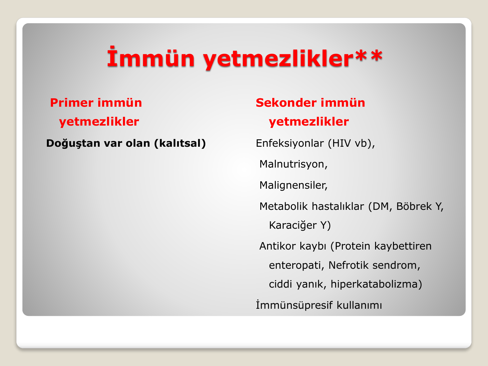
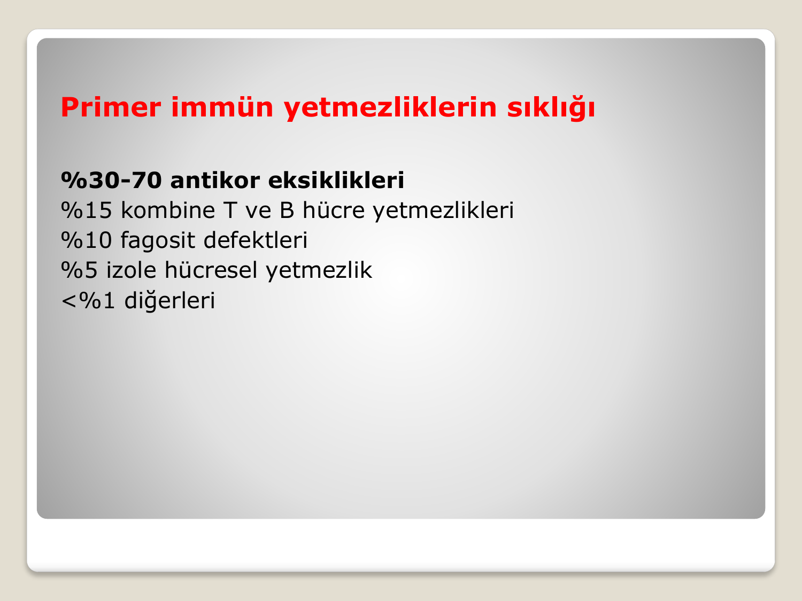
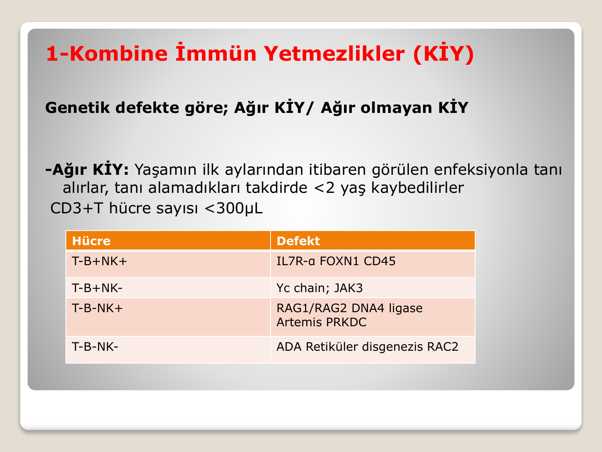
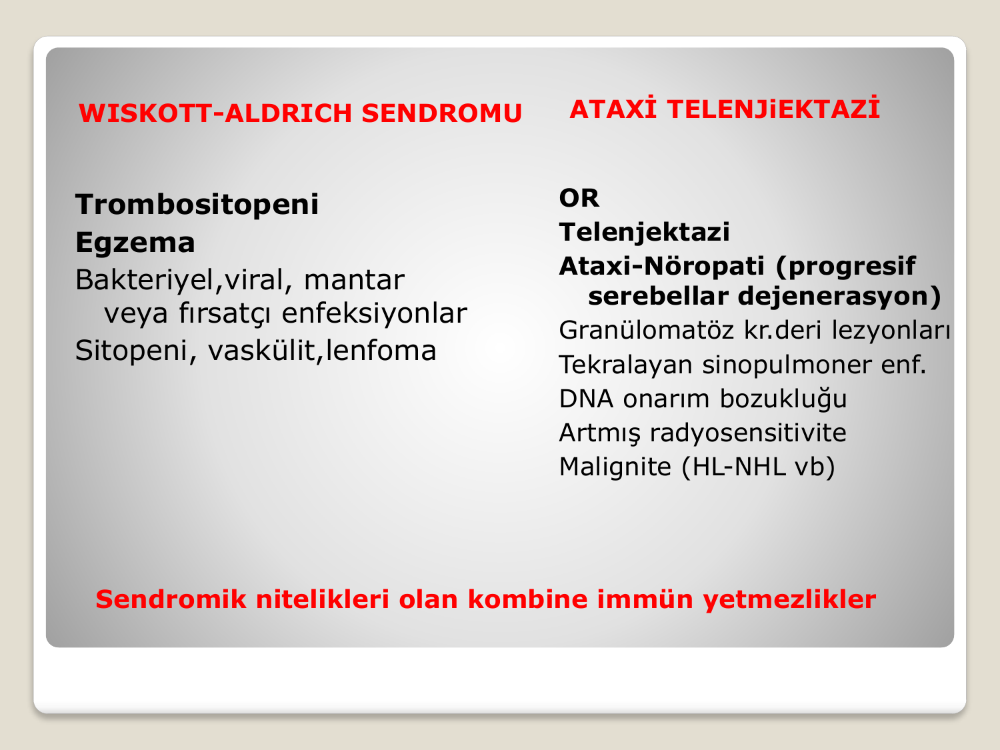
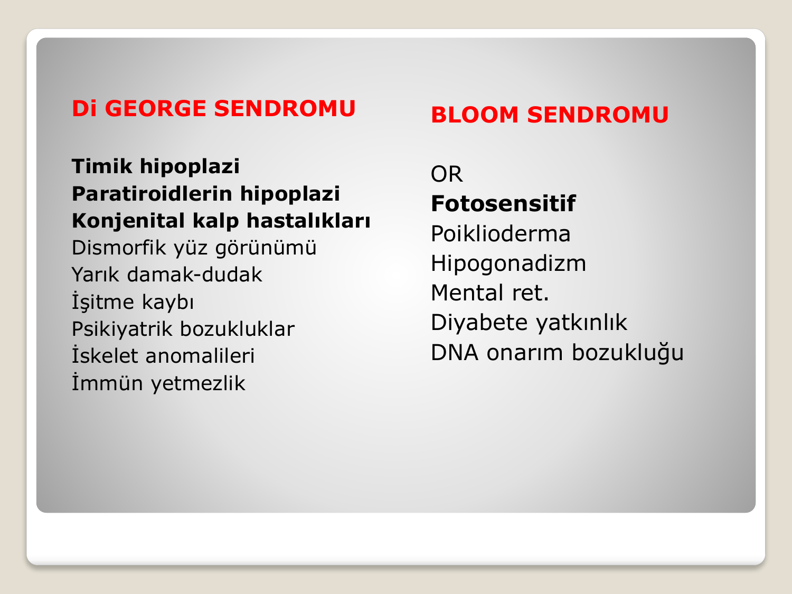
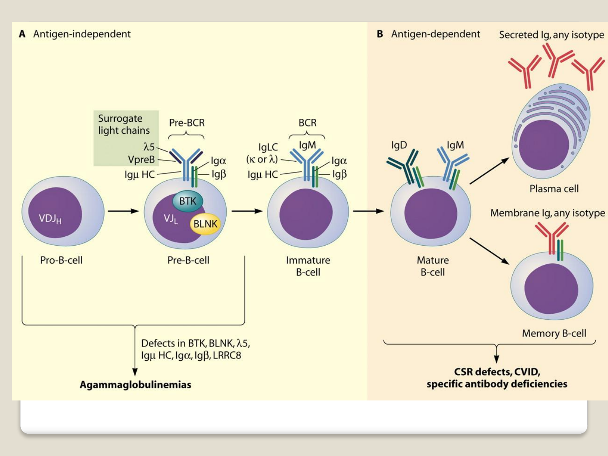
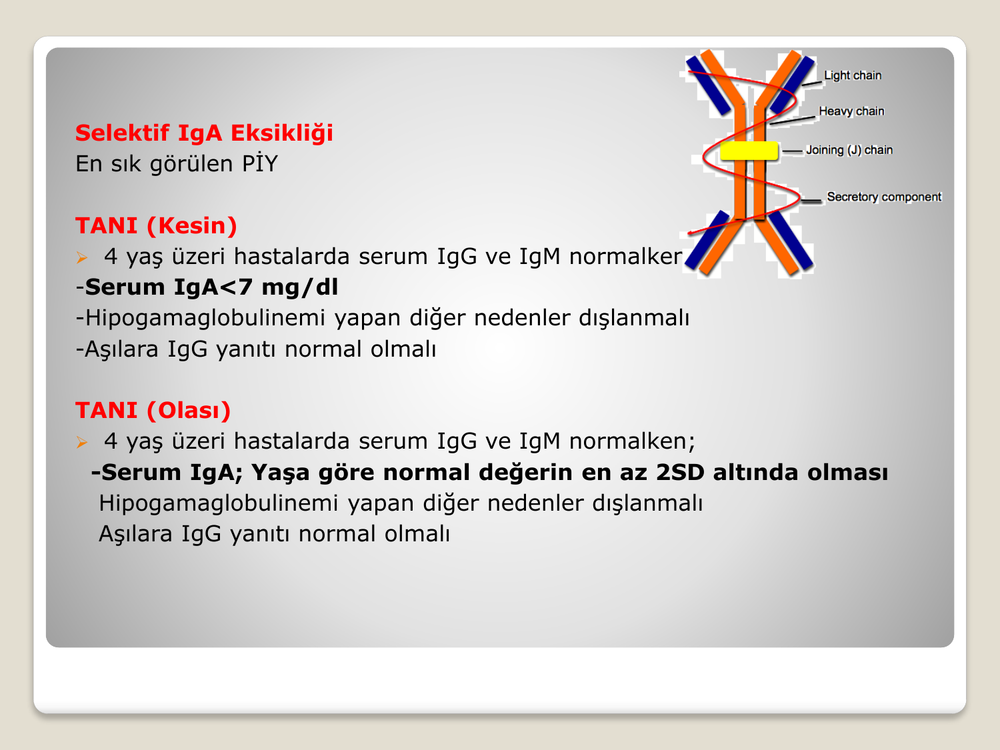
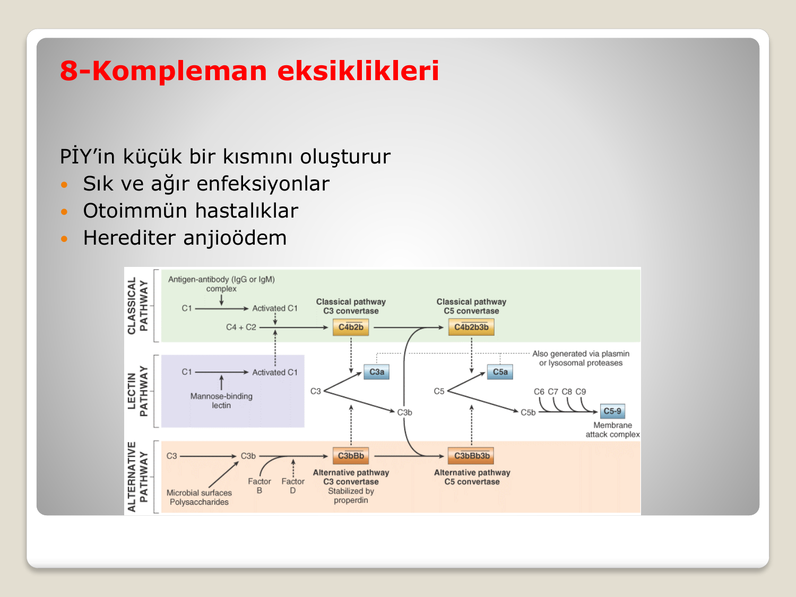
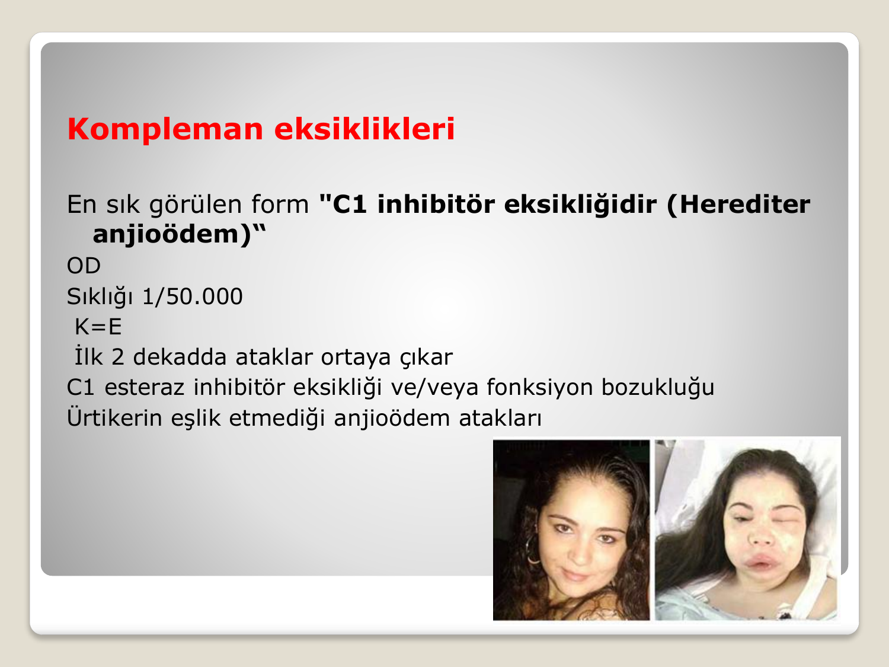
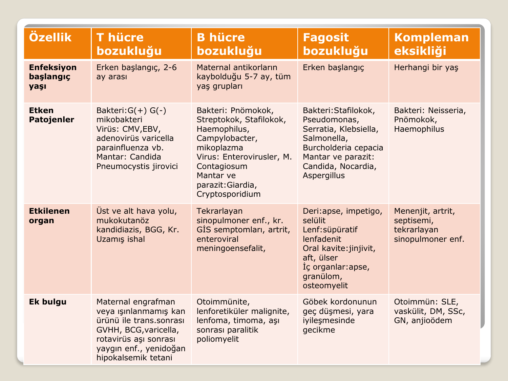

# ERİŞKİNDE PRİMER İMMÜN YETMEZLİKLER

**Hazırlayan:** Prof. Dr. Songül Çildağ
**Bölüm:** Aydın Adnan Menderes Üniversitesi Tıp Fakültesi — İmmünoloji ve Alerji Hastalıkları Bilim Dalı

---

## İÇİNDEKİLER

1. [Giriş — İmmün Yetmezliklere Genel Bakış](#giriş--i̇mmün-yetmezliklere-genel-bakış)
2. [Primer İmmün Yetmezlikler (PİY)](#primer-immün-yetmezlikler-piy)
3. [Klinik ve Komplikasyonlar](#klinik-ve-komplikasyonlar)
4. [Alarm Semptomlar (Erişkin)](#alarm-semptomlar-erişkin)
5. [ESID / IUIS Sınıflaması](#esid--iuis-sınıflaması)
6. [Kombine İmmün Yetmezlikler (KİY)](#kombine-i̇mmün-yetmezlikler-kiy)
7. [Sendromik Özellikli Kombine İmmün Yetmezlikler](#sendromik-özellikli-kombine-i̇mmün-yetmezlikler)
8. [Antikor Eksikliğinin Baskın Olduğu İmmün Yetmezlikler](#antikor-eksikliğinin-baskın-olduğu-i̇mmün-yetmezlikler)
9. [İmmün Disregülasyon Hastalıkları](#i̇mmün-disregülasyon-hastalıkları)
10. [Fagosit Bozuklukları](#fagosit-bozuklukları)
11. [Doğal İmmün Sistem Bozuklukları](#doğal-i̇mmün-sistem-bozuklukları)
12. [Otoinflamatuar Hastalıklar](#otoinflamatuar-hastalıklar)
13. [Kompleman Eksiklikleri](#kompleman-eksiklikleri)
14. [Kemik İliği Yetmezliği ve Fenokopiler](#kemik-i̇liği-yetmezliği-ve-fenokopiler)
15. [Klinik Ayırıcı Tanı — Hangi Kol Bozuk?](#klinik-ayırıcı-tanı--hangi-kol-bozuk)
16. [PİY Tanı Algoritması](#piy-tanı-algoritması)
17. [Tedavi İlkeleri](#tedavi-i̇lkeleri)

---

## GİRİŞ — İMMÜN YETMEZLİKLERE GENEL BAKIŞ

### İmmün Yetmezliklerin Sınıflaması



İmmün yetmezlikler iki ana grupta incelenir:

**1. Primer İmmün Yetmezlikler (PİY)**
* **Doğuştan var olan (kalıtsal)**
* İmmün sistemle ilişkili genlerdeki mutasyonlar sonucu gelişir.

**2. Sekonder İmmün Yetmezlikler**
* **Enfeksiyonlar** (HIV vb.)
* **Malnütrisyon**
* **Malignensiler**
* **Metabolik hastalıklar** (DM, böbrek yetmezliği, karaciğer yetmezliği)
* **Antikor kaybı** (protein kaybettiren enteropati, nefrotik sendrom, ciddi yanık, hiperkatabolizma)
* **İmmünsüpresif ilaç kullanımı**

> **⚠️ Tanı ilkesi:** PİY tanısı koyabilmek için **önce sekonder nedenler mutlaka dışlanmalıdır** (özellikle erişkinde — HIV, malignite, nefrotik sendrom, ilaç).

### Enfeksiyon Tipine Göre Hangi Kol Bozuk?

> **💡 Çok önemli klinik kural:** Gelişen enfeksiyon tipi, **hangi immün sistem kolunun bozuk olduğunu** söyler.

* **Tekrarlayan bakteriyel enfeksiyonlar** → **Humoral (B hücresi), fagositik sistem, kompleman, lökosit** defektleri
* **Viral, fungal, mikobakteriyel ve parazitik enfeksiyonlar** → **T hücre bozukluğu**

---

## PRİMER İMMÜN YETMEZLİKLER (PİY)

### Prevalans

| Bölge | PİY Prevalansı |
|---|---|
| **Genel (dünya)** | 1-5/1000 |
| **ABD** | 1/2.000 |
| **Avrupa** | 1/10.000 |
| **Türkiye** | 3/10.000 |

* **485 PİY fenotipi** tanımlanmıştır (IUIS 2022 güncellemesi).

### Genetik Mutasyon Tipleri ve Fenotip

Aynı gen üzerinde farklı mutasyon tipleri çok farklı fenotiplere yol açabilir:

* **Null mutasyon** → Fonksiyon tam kaybı
* **Hipomorfik mutasyon** → Kısmi fonksiyon kaybı
* **Fonksiyon artışı (GOF)**
* **Somatik (hipermorfik) mutasyon**

> **💡 Örnek:** RAG ve ARTEMİS gen mutasyonları:
>
> * **Null mutasyon** → **Ağır kombine immün yetmezlik (SCID)**
> * **Hipomorfik mutasyon** → **Yaygın Değişken İmmün Yetmezlik (YDİY)** veya **geç başlangıçlı kombine immün yetmezlik**

### Erişkinde PİY — Ne Zaman Akla Gelir?

* **Çocukluk döneminde tanılı PİY**'in erişkin döneme taşınması
* **PİY'in geç klinik sunumu**

> **⚠️ İlginç gerçek:** PİY'lerin **%25-40'ı erişkin dönemde** tanı konulmaktadır. Bu nedenle erişkin hekimler de PİY'i akılda tutmalıdır.

### PİY Sıklığının Dağılımı



| Grup | Oran |
|---|---|
| **Antikor eksiklikleri** | **%30-70** (en sık) |
| Kombine T ve B hücre yetmezlikleri | %15 |
| Fagosit defektleri | %10 |
| İzole hücresel yetmezlik | %5 |
| Diğerleri | <%1 |

### Erişkinde Klasik Görülen PİY'ler

> **⭐ Klasik olarak erişkin dönemde ortaya çıkanlar:**
>
> * **Yaygın Değişken İmmün Yetmezlik (YDİY)** ⭐⭐⭐
> * **Selektif IgA eksikliği** (en sık PİY)
> * **Good Sendromu** (timoma + hipogamaglobulinemi)
> * **Geç başlangıçlı kombine immün yetmezlik**
> * **İdiyopatik CD4+ lenfositopeni**
> * **GATA2 eksikliği**
>
> **Diğerleri:**
> * IgG subgrup eksikliği, spesifik antikor eksikliği, Hiper IgE sendromu, Mendelian enfeksiyon duyarlılığı, periyodik ateş sendromları, **herediter anjioödem (HAÖ)**

---

## KLİNİK VE KOMPLİKASYONLAR

PİY çok yönlü bir tablodur; sadece enfeksiyonla değil, **otoimmünite, alerji, malignite** ile de prezente olabilir.

### 1. Enfeksiyonlar (En Sık)

* **Tekrarlayan, şiddetli, kronik**
* **Açıklanamayan / alışılmadık** enfeksiyonlar
* **Oral antibiyotiğe dirençli**, IV antibiyotik için hastaneye yatış gerektiren
* **Kronik enfeksiyon** → cerrahi müdahale gerektirebilir

**Tipik tablolar:**

* **En tipik:** Tekrarlayan ÜSY/ASY enfeksiyonları (rinosinüzit, otit, bronşit, pnömoni)
* **Ciddi enfeksiyonlar:** Menenjit, septisemi, deri/organ apseleri, endokardit, selülit, osteomiyelit
* **Fırsatçı enfeksiyonlar, inatçı mantar cilt enfeksiyonu**
* Canlı aşılardan sonra enfeksiyon ya da aşılara yanıt olmaması

### 2. Pulmoner Hastalıklar

* Tekrarlayan pulmoner enfeksiyonlar
* **Bronşektazi**
* **Granülomatöz inflamasyon**
* **İnterstisyel akciğer hastalığı**
* Bronşiyolit obliterans
* Mediastinal lenfadenopati

### 3. GİS Hastalıkları

* Enfeksiyonlar (Giardia, CMV)
* **İnflamatuar barsak hastalığı** benzeri tablo
* Şiddetli malabsorpsiyonla ilişkili **villus atrofisi**
* Granülom oluşumu
* **Nodüler rejeneratif hiperplazi** → karaciğer hasarı, portal hipertansiyon
* **Nodüler lenfoid hiperplazi (NLH)** ve **lenfoma** gibi lenfoproliferatif bozukluklar
* Mide kanseri ve diğer GİS maligniteleri ↑

### 4. Otoimmün Hastalıklar

PİY'li hastaların önemli bir kısmında otoimmünite eşlik eder:

* **Sitopeniler:** İmmün trombositopeni, otoimmün nötropeni, **otoimmün hemolitik anemi**, **Evans sendromu**
* **Otoimmün GİS hastalıkları:** Çölyak, otoimmün enteropati, otoimmün hepatit, pernisyöz anemi
* **Otoimmün endokrinopatiler:** Otoimmün tiroidit, Tip 1 DM, Addison
* **Romatolojik hastalıklar:** SLE, RA, Sjögren, PM/DM, SSc, MKDH
* **Cilt:** Psöriazis, vitiligo, alopesi, liken planus
* **Otoimmün akciğer hastalıkları**

### 5. Malignite

**Artmış risk:**

* **Non-Hodgkin lenfoma (NHL)** — en sık
* **GİS malignite** (özellikle mide Ca)
* Hodgkin lenfoma (HL)
* Cilt kanserleri
* Genitoüriner sistem

### 6. Alerjik Hastalıklar

Atopi, ekzema, gıda / ilaç alerjisi, alerjik astım

---

## ALARM SEMPTOMLAR (ERİŞKİN)

> **🚨 Erişkin PİY Alarm Semptomları (ESID):**
>
> 1. **1 yıl içinde ≥4 antibiyotik** gerektiren enfeksiyon (otit, bronşit, sinüzit, pnömoni)
> 2. **Tekrarlayan veya uzamış** antibiyotik gerektiren enfeksiyonlar
> 3. **≥2 ciddi bakteriyel enfeksiyon** (osteomiyelit, menenjit, sepsis, selülit, septik artrit)
> 4. **3 yıl içinde ≥2 radyolojik olarak ispatlanmış pnömoni**
> 5. **Alışılmadık lokalizasyonda alışılmadık patojenlerle** enfeksiyon
> 6. **Ailede PİY öyküsü**

Bu kriterlerden bir veya daha fazlasının varlığında **immünolojik inceleme** başlatılmalıdır.

---

## ESID / IUIS SINIFLAMASI

IUIS 2022'ye göre 10 ana kategori:

1. **Kombine immün yetmezlikler** (hücresel + humoral)
2. **Sendromik özellikleri olan / ilişkili** kombine immün yetmezlikler
3. **Antikor eksikliğinin baskın olduğu** immün yetmezlikler ⭐ (en sık)
4. **İmmün disregülasyon** hastalıkları
5. **Fagositlerin** sayısal ve/veya işlevsel konjenital bozuklukları
6. **Doğal (innate) immün sistem** konjenital bozuklukları
7. **Otoinflamatuar** hastalıklar
8. **Kompleman eksiklikleri**
9. **Kemik iliği yetmezliği**
10. **PİY fenokopileri** (kazanılmış mekanizmalar)

---

## KOMBİNE İMMÜN YETMEZLİKLER (KİY)

### Genel Sınıflama

Kombine immün yetmezlikler, **hücresel ve humoral** bağışıklığı etkileyen bozukluklardır. Genetik defektin şiddetine göre:

* **Ağır KİY (SCID)**
* **Ağır olmayan KİY**

### Ağır Kombine İmmün Yetmezlik (SCID)

* **Yaşamın ilk aylarından itibaren** ciddi enfeksiyonlarla tanı alırlar.
* Tanı alamayan hastalar **<2 yaş kaybedilir**.
* **CD3+ T hücre sayısı <300/μL**

### SCID Fenotipleri ve Gen Defektleri



| Fenotip | Gen Defekti |
|---|---|
| **T⁻ B⁺ NK⁺** | **IL7R-α**, FOXN1, CD45 |
| **T⁻ B⁺ NK⁻** | **γc zinciri (X'e bağlı)**, JAK3 |
| **T⁻ B⁻ NK⁺** | **RAG1/RAG2**, DNA ligase, Artemis, PRKDC |
| **T⁻ B⁻ NK⁻** | **ADA**, retiküler disgenezis, RAC2 |

> **💡 Öğrenci ezberi:** **γc zinciri mutasyonu** X'e bağlı SCID'dir; T⁻B⁺NK⁻ fenotipinde, erkek çocuklarda en sık görülür. **ADA eksikliği** tüm hücre hatlarını (T, B, NK) tutar — tedavide **gen terapisi** uygulanabilir.

### SCID Tanı Kriterleri

**Kesin tanı:** **<2 yaş** kız/erkek hastada;

(a) Dolaşımda **maternal lenfositlerin** gösterilmesi ya da
(b) **<%20 CD3+ T hücresi**, **<3000/mm³ mutlak lenfosit sayısı**

**ve** aşağıdakilerden en az biri:
* **γc zinciri mutasyonu**
* **JAK3 mutasyonu**
* **RAG1 veya RAG2 mutasyonu**
* **IL-7Rα mutasyonu**
* **ADA aktivitesi <%2** (kontrole göre) ya da her iki ADA alelinde mutasyon

> **⚠️ NOT:** **Tanı için genetik inceleme şarttır.**

**Olası tanı:** Aynı klinik + <%20 CD3+ T + mitojenlere **proliferatif yanıt <%10** (kontrole göre).

### Ağır Olmayan KİY

* **CD3+ T hücre sayısı 300-1500/μL**, lenfoproliferatif yanıt %10-50
* **Yaşamın ilk yılında ölümcül değildir.**
* **Geç çocukluk / genç erişkin** dönemde bulgu verebilir.
* Klinik, T hücre sayı ve fonksiyon bozukluğunun derecesi ile ilişkilidir.

**Örnekler:** Omenn sendromu, CARD11 eksikliği, **CD40 ligand eksikliği**, **MHC sınıf I/II eksikliği**, ZAP-70 eksikliği, CD8 eksikliği, **DOCK8 eksikliği**.

---

## SENDROMİK ÖZELLİKLİ KOMBİNE İMMÜN YETMEZLİKLER

Bu grup, immün yetmezliğe **ek olarak sendromik özelliklerin** (nörogelişim, iskelet, cilt, yüz anomalileri) eşlik ettiği tablolardır. Hafif formlar erişkin dönemde tanı alabilir.

**Alt gruplar:**

* Konjenital trombositopeniler (Wiskott-Aldrich)
* **DNA tamir defektleri** (Ataksi telenjiektazi, Bloom sendromu)
* **İmmün-osseöz displaziler**
* Timik defektlerle birlikte konjenital anomaliler (**DiGeorge**)
* Anhidrotik ektodermal displazi
* **Hiper IgE sendromu**
* Vit B12 ve folat mekanizma defektleri

### Hiper IgE Sendromu

**Klasik triad:**

1. **Belirgin yüksek serum IgE**
2. **Ekzema**
3. **Cilt (soğuk apseler — S. aureus)** ve **sinopulmoner enfeksiyonlar** (bakteriyel, viral, fungal)



**İki ana form:**

| | **Otozomal Dominant (Job Sendromu)** | **Otozomal Resesif** |
|---|---|---|
| **Gen** | **STAT3 mutasyonu** | **DOCK8**, PGM3 mutasyonları |
| **Kraniofasial anomali** | ✓ | — |
| **Kas-iskelet anomalisi** | ✓ | — |
| **Vasküler anomali** | ✓ | — |
| **Parankimal beyin lezyonu** | ✓ | — |
| **Konnektif doku tutulumu** | ✓ | — |
| **Viral deri enfeksiyonu** (HPV, HSV, VZV) | — | **Sık** |
| **Atopik hastalıklar (eozinofili)** | — | **Sık** |
| **Otoimmünite** | — | ✓ |
| **SSS (menenjit, apse, ensefalit)** | — | ✓ |
| **Malignite** | HL-NHL ↑ | HPV/EBV ilişkili ↑ |

> **💡 Tanı için gen mutasyonları önemlidir.**

**Tedavi:**

* Enfeksiyonların tedavisi ve **profilaksi**
* Alerjik hastalıkların tedavisi
* **Sık enfeksiyon geçirenlerde IVIG replasmanı**
* **Viral enfeksiyonlar için IFN-α**
* **Kök hücre nakli — DOCK8 eksikliğinde küratif** ✓

### Wiskott-Aldrich, Ataksi Telenjiektazi, DiGeorge ve Bloom Sendromu



**Wiskott-Aldrich Sendromu (WAS):**

* **X'e bağlı resesif**
* **Klasik triad:**
    * **Trombositopeni** (küçük trombositler — mikrotrombositopeni)
    * **Ekzema**
    * **Tekrarlayan enfeksiyonlar**
* Sitopeni, vaskülit, lenfoma
* WASp gen mutasyonu

**Ataksi Telenjiektazi:**

* **Otozomal resesif**
* **Telenjiektazi** (konjonktiva, cilt)
* **Serebellar ataksi** (progresif serebellar dejenerasyon)
* Granülomatöz kronik deri lezyonları
* Tekrarlayan sinopulmoner enfeksiyonlar
* **DNA onarım bozukluğu** (ATM gen mutasyonu)
* **Artmış radyosensitivite** — BT/röntgenden kaçın!
* **Malignite:** HL, NHL ↑



**DiGeorge Sendromu:**

* **22q11.2 delesyonu**
* **Timik hipoplazi** → T hücre eksikliği
* **Paratiroid hipoplazisi** → hipokalsemi, tetani
* **Konjenital kalp hastalıkları** (özellikle konotrunkal — TOF, trunkus arteriyozus)
* **Dismorfik yüz**, yarık damak/dudak
* İşitme kaybı, iskelet anomalileri, psikiyatrik bozukluklar

> **💡 DiGeorge mnemoniği — "CATCH 22":** **C**ardiac defects, **A**bnormal facies, **T**hymic aplasia, **C**left palate, **H**ypocalcemia, **22**q11 deletion.

**Bloom Sendromu:**

* **Otozomal resesif**
* **Fotosensitivite, poikiloderma**
* Hipogonadizm
* Mental retardasyon
* Diyabet yatkınlığı
* **DNA onarım bozukluğu** (BLM geni)

---

## ANTİKOR EKSİKLİĞİNİN BASKIN OLDUĞU İMMÜN YETMEZLİKLER

En sık görülen PİY grubudur (%30-70). Klinik, B lenfosit gelişim/fonksiyon bozukluğunun derecesi ile paralellik gösterir.

### B Hücre Gelişimi ve Defekt Noktaları


```
Pro-B → Pre-B → İmmatür B → Matür B → Plazma hücresi / Bellek B hücresi
   ↓        ↓          ↓           ↓              ↓
                    BTK, BLNK, λ5, Igμ HC,     CSR defektleri
                    Igα, Igβ defektleri        YDİY
                                                Spesifik antikor eks.
                    ↓
             **AGAMMAGLOBULİNEMİLER**
```

### Alt Gruplar

**Hipogamaglobulinemi (IgG ↓, IgA ↓ ve/veya IgM ↓):**

* **B hücre yokluğu:** **X'e bağlı agamaglobulinemi (Bruton — BTK mutasyonu)**
* **B hücre >%1:** **Yaygın Değişken İmmün Yetmezlik (YDİY)**

**Diğer antikor eksiklikleri:**

* **Hiper IgM sendromu:** IgG ↓, IgA ↓, **IgM normal/artmış**, B hücre sayısı normal (CSR defekti — CD40L)
* **İzotip, hafif zincir veya fonksiyonel eksiklikler** (B hücre sayısı normal):
    * **Selektif IgA eksikliği** (en sık PİY)
    * **Selektif IgM eksikliği**
    * **Yenidoğanın geçici hipogamaglobulinemisi**
    * **IgG subgrup eksikliği**
    * IgA + IgG subgrup eksikliği birlikte
    * **Spesifik antikor eksiklikleri**

---

### Selektif IgA Eksikliği



**En sık görülen PİY.**

**Kesin tanı:**

* **>4 yaş** hastada serum **IgG ve IgM normal**
* **Serum IgA <7 mg/dl**
* Hipogamaglobulinemi yapan diğer nedenler dışlanmış
* **Aşılara IgG yanıtı normal** olmalı

**Olası tanı:**

* >4 yaş, IgG ve IgM normal; **serum IgA yaşa göre 2 SD altında**

### Klinik

* **Genellikle asemptomatik** (tesadüfen saptanır)
* **IgG2 eksikliği** eşlik edebilir
* Üst solunum yolu enfeksiyonları
* **Otoimmün hastalıklar (%10-30)** — özellikle **çölyak**
* **Alerjik hastalıklar (%48-52)**
* **⚠️ Kan ürünü transfüzyonu sırasında anafilaksi** — hastaların **%17'sinde anti-IgA antikoru** mevcuttur. IgA içeren ürünlerle transfüzyonda **anafilaksi riski!**
* Nadiren malignite (lenfoid ve GİS)

### Prognoz ve Tedavi

* Tek başına IgA eksikliği prognozu **çok iyidir**.
* **Nadiren YDİY'e dönüşebilir** → düzenli aralıklarla takip!
* Tesadüfen saptanan asemptomatik hastalara **tedavi gerekmez**.
* Sık enfeksiyon öyküsü → **profilaktik antibiyotik**
* Ek hastalıkların tedavisi (otoimmünite, alerji)

> **⚠️ Klinik uyarı:** IgA eksikliği olan hastaya transfüzyon gerekiyorsa **yıkanmış eritrosit** veya **IgA'dan fakir kan ürünleri** tercih edilir.

---

### Selektif IgM Eksikliği

**Tanı:** Serum IgG ve IgA normal iken **IgM yokluğu veya düşüklüğü**.

**Klinik:**

* Enfeksiyonlar (intraselüler bakteriyel, viral, fungal)
* ÜSYE, ASYE
* **Alerjik hastalıklar (ikinci sıklıkta)** — AR, astım
* **Otoimmünite** — SLE, RA, çölyak, Hashimoto
* Malignite

**Tedavi:** Enfeksiyon ve ek hastalık tedavisi. Prognoz komorbiditelere bağlıdır.

---

### Yaygın Değişken İmmün Yetmezlik (YDİY / CVID)

> **⭐ Erişkinde en semptomatik PİY**

* **K = E** (kadın/erkek eşit)
* **Bimodal yaş dağılımı:** **<10 yaş** ve **20-45 yaş** arasında iki pik
* **Prevalans:** 1/10.000 - 1/100.000
* Hastaların **~%5'inde** sık enfeksiyon olmadan **otoimmün veya inflamatuar bulgular** ile başvuru
* Bozulmuş / yetersiz Ig üretimi + B hücre farklılaşma bozukluğu

### YDİY — Tanı Kriterleri

1. **Serum IgG'de belirgin düşüklük + IgA ve/veya IgM düşüklüğü** (en az 2 ayrı ölçüm, yaşa göre 2 SD altı)
2. **2 yaşından sonra başlangıç**
3. **Aşılara yetersiz antikor yanıtı ve/veya izohemaglütinin olmaması**
4. **Hipogamaglobulinemi yapan diğer nedenler dışlanmalıdır** (sekonder nedenler, lenfoma, ilaçlar)

### YDİY — Klinik

* **Tekrarlayan enfeksiyonlar** (özellikle bakteriyel — kapsüllü organizmalar)
* **Otoimmün hastalık (~%50)** — ITP, OİHA, çölyak, tiroidit en sık
* **GİS hastalıkları** — villus atrofisi, NLH, Giardiazis
* **Lenfoproliferasyon** — splenomegali, lenfadenopati
* **Kronik akciğer hastalığı** — bronşektazi, interstisyel akciğer hastalığı (GLILD)
* **Artmış malignite riski** (özellikle NHL, mide Ca)

### YDİY — Prognoz

**IVIG tedavisi ile prognoz iyidir.** Mortalitenin başlıca nedenleri **enfeksiyon değil**, **interstisyel akciğer hastalığı ve malignite**dir.

### YDİY — Tedavi

1. **IVIG / SKIG replasmanı:**
    * **400-600 mg/kg**
    * **Total doz 3-4 haftada bir IV** ya da **haftalık SC** dozlar
2. **Antimikrobiyal tedavi** (enfeksiyonda)
3. **Enfeksiyon profilaksisi**
4. **Enfeksiyöz olmayan hastalığın tedavisi** (örn. otoimmün komplikasyonlar)

---

### IgG Subgrup Eksikliği

**Serumun IgG dağılımı:**

| Subgrup | Oran | Özgüllük |
|---|---|---|
| **IgG1** | %65 | **Protein antijenler** |
| **IgG2** | %25 | **Polisakkarid antijenler** |
| IgG3 | %6 | Kompleman aktivasyonu, protein antijenler |
| IgG4 | %4 | Ekstrasellüler parazitler |

**Tanı:**

* Tekrarlayan enfeksiyonlar + **toplam IgG, IgM, IgA normal**
* IgG subgruplarından bir veya daha fazlasında **2 SD altında düşüklük**
* Geçirilmiş enfeksiyonlara veya aşılara **yetersiz antikor yanıtı**

**Klinik özellikler:**

* Antikor eksikliklerinin **%15'ini** oluşturur.
* **Çocuklarda > erişkinde:** IgG2 eksikliği sık
* **Erişkinde > çocukta:** IgG3 eksikliği sık
* **IgG4 eksikliği** yaygındır, genellikle **asemptomatik**

**Tedavi:**

* IgG2 eksikliğinde **konjuge aşı + ek doz**
* Alerji/enfeksiyon tedavisi
* Profilaktik antibiyotik
* **Seçilmiş vakalarda IVIG** (özellikle IgG2 eksikliğinde)

**Prognoz:**

* Eksikliğin derecesine ve yaşa bağlı.
* **<6 yaş çocukta düzelebilir.**
* **Erişkinde genellikle düzelmez, YDİY'e dönüşebilir.**
* **İzlem:** Yıllık Ig ve IgG subgrup ölçümü.

---

### Spesifik Antikor Eksikliği (Selektif Polisakkarid Antikor Eksikliği)

**Tanı:**

* Serum Ig değerleri ve IgG subgrupları **normal**
* **Protein antijenlere normal yanıt**, **polisakkarid antijenlere yetersiz antikor yanıtı**
* Standart test: **Pnömokok aşılamasına yanıt değerlendirme**

**Klinik:** Sinopulmoner enfeksiyonlar, alerjik hastalıklar. **YDİY açısından takip edilmeli.**

**Tedavi:** Sık enfeksiyonda profilaktik antibiyotik; antibiyotik dirençli vakalarda **IVIG replasmanı**.

---

### Good Sendromu

> **⭐ Erişkine özgü bir PİY**

**Triad:**

1. **Timoma**
2. **Hipogamaglobulinemi**
3. **İmmün yetmezlik**

**Özellikler:**

* **4-5. dekadda** görülür (40-70 yaş)
* **Erişkin başlangıçlı hipogamaglobulinemilerin %7-10'u**
* **Olgun B hücre azlığı veya yokluğu**
* **%60 T hücre defekti** eşlik eder
* **CD4+ T lenfopeni**

**Klinik:**

* **Timoma ilişkili:** Öksürük, göğüs ağrısı, disfaji, dispne, ses kısıklığı, **VCSS (süperior vena kava sendromu)**, Horner sendromu
* **Enfeksiyonlar:** Bakteriyel, viral, fungal (özellikle **kapsüllü bakteriler** ve fırsatçı ajanlar), diyare
* **Otoimmünite (~%50):** **Pure red cell aplazisi**, M. Graves, oral liken planus
* %30 otoantikor (+), ANA %50 (+)

**Tedavi:**

1. **Timoma tedavisi (timektomi)**
2. **Antimikrobiyal tedavi**
3. **IVIG replasmanı**

---

## İMMÜN DİSREGÜLASYON HASTALIKLARI

Bu grup, immün sistem regülasyonundaki bozukluklar nedeniyle **otoimmünite, lenfoproliferasyon, enflamasyon** tabloları oluşturur.

**Alt gruplar:**

**1. Hemofagositik Lenfohistiyositozis (HLH) ve EBV duyarlılığı:**

* **Ailevi HLH:** Chediak-Higashi, Griscelli sendromu, Hermansky-Pudlak, **perforin eksikliği**
* **EBV duyarlılığı:** XLP (SAP eksikliği — Duncan sendromu), CTPS1 eksikliği, RLTPR eksikliği

**2. Otoimmün ve diğer hastalıkların eşlik ettiği sendromlar:**

* **ALPS** (otoimmün lenfoproliferatif sendrom — FAS gen mutasyonu)
* **APECED** (otoimmün poliendokrinopati-kandidiyazis-ektodermal distrofi — AIRE mutasyonu)
* **IPEX** (immün disregülasyon, poliendokrinopati, enteropati, X'e bağlı — **FOXP3** mutasyonu)
* **CTLA-4 eksikliği**
* Caspase 8, CD25 eksiklikleri

**3. Kolitle birlikte immün disregülasyon:**

* **IL-10 / IL-10R eksikliği**
* TGFBI eksikliği

---

## FAGOSİT BOZUKLUKLARI

### Sınıflama

**1. Nötropeni** — Absolü nötrofil sayısı <1500/μL

| | Mutlak Nötrofil Sayısı |
|---|---|
| **Hafif** | 1000-1500 |
| **Orta** | 500-1000 |
| **Ağır** | **<500** |

Enfeksiyona yatkınlık **kemik iliği rezervine bağlıdır**.

**Sendromla ilişkili nötropeniler:**

* **Shwachman-Diamond sendromu** — pansitopeni, pankreas yetmezliği, kondrodisplazi
* **Cohen sendromu** — dismorfizm, MR, sağırlık, obezite
* **Glikojen depo hastalığı Tip 1b**
* **Barth sendromu** — kardiyomiyopati, miyopati, büyüme geriliği

**Sendromla ilişkisiz nötropeniler:**

* **Ağır konjenital nötropeni** — Elastaz (ELANE) mutasyonu; MDS/lösemi duyarlılığı
* **Siklik nötropeni** — 21 günlük döngüsel dalgalanmalar (3-5 gün süren nötropeni); peryodik ateş, mukozal ülserler
* **Kostmann hastalığı** — kognitif/nörolojik defekt, MDS/lösemi duyarlılığı
* **G-CSF reseptör eksikliği**, CXCR2 eksikliği

### 2. Fagositik Fonksiyon Defektleri

**Motilite eksiklikleri:**

* **LAD Tip 1** — CD18 (β2-integrin) defekti, **göbek kordonunun geç düşmesi, lökositoz, yara iyileşmesinde gecikme**, pürülan inflamasyon yok
* **LAD Tip 2** — GDP fukoz taşıyıcı (sialyl-Lewis X yokluğu)
* **LAD Tip 3** — KINDLIN3
* **RAC2 eksikliği**

**Oksidatif patlama eksiklikleri:**

* **Kronik Granülomatöz Hastalık (KGH):**
    * **X'e bağlı:** CYBB (gp91phox) — en sık form
    * **OR:** NCF1, CYBA, NCF4, NCF2
    * **Klinik:** Katalaz pozitif organizmalarla (S. aureus, Aspergillus, Burkholderia, Serratia, Nocardia) tekrarlayan enfeksiyonlar, granülom oluşumu
    * **Tanı:** **DHR (Dihidrorodamin) akış sitometri testi** / **NBT testi** — oksidatif patlama ölçümü
    * **Tedavi:** Profilaktik TMP-SMX + itrakonazol, **IFN-γ**, seçilmiş vakalarda kök hücre nakli
* **G6PD eksikliği Sınıf I**
* **Pulmoner alveolar proteinozis**
* Papillon-Lefèvre sendromu

---

## DOĞAL İMMÜN SİSTEM BOZUKLUKLARI

Patojene özgü yatkınlık yaratan doğuştan bozukluklar:

* **Bakteriyel enfeksiyona yatkınlık** (menenjit, osteomiyelit, artrit, apse) — IRAK-4, MYD88, IRAK1 eksikliği, **izole konjenital aspleni**
* **Mikobakteriyel enfeksiyona yatkınlık** (MSMD) — **IFNγR1/R2**, IL12p40, TYK2, STAT1 eksiklikleri
* **Parazitik ve fungal enfeksiyona yatkınlık** (kronik mukokutanöz kandidiyazis) — **IL-17** ve reseptör eksiklikleri, CARD9, **STAT1 GOF**
* **Viral enfeksiyonlara yatkınlık** (HPV, HHV-6, EBV, HSV ensefaliti) — EVER1/EVER2, STAT1, STAT2, **CD16** eksiklikleri

---

## OTOİNFLAMATUAR HASTALIKLAR

**Ortak özellikler:**

> * **Kendi kendini sınırlar**
> * **Ataklar şeklinde**
> * **Otoantikorlar negatif**
> * **Ateş, döküntü, LAP, serözit, kas-iskelet sistemi tutulumu**

### Alt Gruplar

**1. Tekrarlayan inflamasyon ve ateş sendromları:**

* **FMF (Ailevi Akdeniz Ateşi)** — **MEFV** mutasyonu
* **TRAPS** (TNF reseptör ilişkili peryodik sendrom) — TNFRSF1A
* **Hiper IgD sendromu (MKD)** — MVK (mevalonat kinaz)

**2. Cilt bulgularının baskın olduğu sistemik inflamasyon:**

* **CAPS** (Kriyopirin ilişkili peryodik sendromlar) — **NLRP3**
    * Familial cold autoinflammatory syndrome
    * Muckle-Wells sendromu
    * NOMID / CINCA

**3. Tip 1 interferonopatiler:**

* **Aicardi-Goutières sendromu**
* **ADA2 eksikliği**

**4. Steril inflamasyon (deri, kemik, eklem):**

* **PAPA** sendromu (piyojenik artrit, pyoderma gangrenozum, akne)
* **Majeed sendromu**
* **DIRA** (IL-1 reseptör antagonisti eksikliği)
* **Blau sendromu** — NOD2

**5. Diğerleri:**

* **CANDLE** sendromu (PSMB8)
* **Pediatrik SLE** (DNASE1L3)
* **Makrofaj aktivasyon sendromu** (NLRC4)

---

## KOMPLEMAN EKSİKLİKLERİ



Kompleman sistemi **3 yolak** üzerinden aktive olur: **klasik, lektin, alternatif**. Tüm yolaklar **C3** ve **C5 konvertaz** aracılığıyla **MAC (membran atak kompleksi)** oluşumuna yönelir.

### Enfeksiyon Duyarlılığı Yüksek Eksiklikler

**Yaygın Neisseria enfeksiyonları:**

* **Geç komponent eksiklikleri (C5, C6, C7, C8, C9)** → **CH50 ve AH50 düşük**
* **Properdin, Faktör D** eksiklikleri → CH50 normal, AH50 düşük

**Tekrarlayan piyojenik enfeksiyonlar:**

* **C3**, MASP2, Ficolin 3, Faktör B eksiklikleri

### Enfeksiyon Duyarlılığı Düşük Eksiklikler

**SLE benzeri sendromlar + kapsüllü organizma enfeksiyonları:**

* **C1q, C1r, C1s, C2, komplet C4 eksikliği**

> **💡 Mnemonic:** **"Early C = Lupus, Late C = Neisseria"** — erken komponent eksikliği SLE benzeri otoimmün hastalıklara, geç komponent eksikliği Neisseria enfeksiyonlarına yatkınlaştırır.

**Atipik Hemolitik Üremik Sendrom (aHUS):**

* **C3 GOF**, Faktör B GOF, **Faktör H eksikliği**, Faktör I eksikliği

**Diğerleri:**

* **C1 inhibitör eksikliği (SERPING1)** → **Herediter Anjioödem**
* **MAC inhibitörü (CD59) eksikliği** → hemolitik anemi, polinöropati
* **CD55 eksikliği** → protein kaybettiren enteropati, tromboz
* Periodontal Ehler-Danlos sendromu — C1R, C1S

### Herediter Anjioödem (HAÖ)



> **⭐ En sık görülen kompleman eksikliği.**

* **Otozomal dominant**
* **Sıklık: 1/50.000**
* **K = E**
* **İlk 2 dekadda** ataklar ortaya çıkar
* **C1 esteraz inhibitör (C1-INH) eksikliği ve/veya fonksiyon bozukluğu**
* **Ürtikerin eşlik etmediği anjioödem atakları** (klasik ürtiker yok!)

**Klinik:** Tekrarlayan, saatlerce-günlerce süren ağrısız şişlikler — yüz, ekstremiteler, GİS (karın ağrısı/kusma), **larinks (ölümcül!)**.

**Tanı:** C4 düşük, **C1-INH düzeyi/fonksiyonu düşük**.

**Tedavi:**

* **Akut atak:** **C1-INH konsantresi**, ekallantid (kallikrein inhibitörü), ikatibant (bradikinin B2 reseptör antagonisti), taze donmuş plazma
* **Uzun dönem profilaksi:** C1-INH, danazol (attenue androjen), **lanadelumab** (anti-kallikrein monoklonal)
* **⚠️ Adrenalin, antihistaminik, steroidler etkisizdir** (alerjik anjioödem değil, bradikinin aracılıdır).

---

## KEMİK İLİĞİ YETMEZLİĞİ VE FENOKOPİLER

### Kemik İliği Yetmezliği

* **Fanconi anemisi** — SSS, iskelet, deri, kardiyak, GİS, GUS anomalileri; **artmış kromozomal kırılma**, pansitopeni
* **Diskeratoz konjenita** — IUGG, mikrosefali, pulmoner/hepatik fibroz, **tırnak distrofisi**, saç/kirpik seyrekliği, palmar hiperkeratoz, premalign oral lökoplaki, pansitopeni
* Myelodisplazi + immün yetmezlik + doğuştan sağırlık
* **MIRAGE sendromu**, Ataksi-pansitopeni, Osteopetrozis

### PİY Fenokopileri

Doğuştan olmayan; **somatik mutasyonlar** veya **otoantikorlar** nedeniyle benzer fenotip oluşturan durumlar:

**Somatik mutasyon ilişkili:**

| Mutasyon | Fenotip |
|---|---|
| TNFRSF6 (FAS) | ALPS-SFAS |
| NLRP3 | CAPS |
| STAT5b | Hipereozinofilik sendrom |
| **UBA1** | **VEXAS** sendromu |
| ILR8 GOF | — |

**Otoantikor ilişkili:**

| Otoantikor | Fenotip |
|---|---|
| IL-17 / IL-22 | Kronik mukokutanöz kandidiyazis |
| **IFN-γ** | Mikobakteri duyarlılığı (erişkin başlangıçlı) |
| IL-6 | Tekrarlayan cilt enfeksiyonları |
| **GM-CSF** | Pulmoner alveolar proteinozis |
| **C1 inhibitör** | **Kazanılmış anjioödem** |
| Faktör H | Atipik HÜS |
| **Tip I IFN (IFN-α, IFN-ω)** | **Ciddi COVID-19** (≥%15 ağır vaka) |

---

## KLİNİK AYIRICI TANI — HANGİ KOL BOZUK?



> **⭐ ÖĞRENCİ İÇİN EN ÖNEMLİ TABLO:** Klinik özelliklere göre hangi immün kolun bozuk olduğunu saptayın.

| Özellik | **T hücre bozukluğu** | **B hücre bozukluğu** | **Fagosit bozukluğu** | **Kompleman eksikliği** |
|---|---|---|---|---|
| **Başlangıç yaşı** | Erken (2-6 ay) | **Maternal antikor kaybolunca (5-7 ay)**, tüm yaşlar | Erken | Herhangi bir yaş |
| **Etken patojen** | **Bakteri:** G(+), G(−), mikobakteri<br>**Virüs:** CMV, EBV, adenovirus, VZV, parainfluenza<br>**Mantar:** Candida, Pneumocystis jirovecii | **Bakteri:** **Pnömokok**, streptokok, stafilokok, **Haemophilus**, campylobacter, mikoplazma<br>**Virüs:** Enterovirüsler, M. contagiosum<br>**Mantar/parazit:** **Giardia**, Cryptosporidium | **Bakteri:** Stafilokok, **Pseudomonas**, **Serratia**, Klebsiella, Salmonella, **Burkholderia cepacia**<br>**Mantar/parazit:** Candida, Nocardia, **Aspergillus** | **Bakteri:** **Neisseria**, pnömokok, Haemophilus |
| **Etkilenen organ** | Üst ve alt hava yolu, **mukokutanöz kandidiyazis**, BCG, **uzamış ishal** | Tekrarlayan sinopulmoner enf., kronik GİS semptomları, artrit, **enteroviral meningoensefalit** | Deri (apse, impetigo, selülit), lenf (süpüratif lenfadenit), oral kavite (jinjivit, aft), iç organ apseleri, granülom, osteomiyelit | Menenjit, artrit, septisemi, tekrarlayan sinopulmoner enf. |
| **Ek bulgu** | **Maternal engraftman** ya da ışınlanmamış kan ürünü sonrası **GVHH**, BCG/varicella/rotavirüs aşı sonrası yaygın enf., yenidoğan hipokalsemik tetani | **Otoimmünite**, lenforetiküler malignite, lenfoma, **timoma (Good S.)**, aşı sonrası paralitik poliomyelit | **Göbek kordonunun geç düşmesi (LAD)**, yara iyileşmesinde gecikme | **Otoimmün: SLE, vaskülit, DM, SSc, GN, anjioödem** |

> **💡 Altın kural — Klinik İpuçları:**
>
> * **Pnömokok / Haemophilus menenjiti + otit / sinüzit** → **B hücre / antikor eksikliği** → **Ig düzeylerine bak!**
> * **Pneumocystis jirovecii, CMV, kandida** → **T hücre bozukluğu** → **akış sitometri!**
> * **Staph aureus apseleri, Aspergillus, granülom** → **fagosit (KGH)** → **DHR testi!**
> * **Tekrarlayan Neisseria menenjiti** → **geç kompleman (C5-C9) eksikliği** → **CH50 ve AH50!**
> * **LAD ipucu:** Göbek kordonunun geç düşmesi (>30 gün) + lökositoz + pürülan enfeksiyon yok.

---

## PİY TANI ALGORİTMASI

### 1. Basamak — Temel Tetkikler

* **Öykü, fizik muayene**
* **Tam kan sayımı** (lenfopeni, nötropeni?)
* Biyokimya, sedimentasyon, CRP
* **PA akciğer grafisi**
* **Serum immünoglobulin düzeyleri** (IgA, IgM, IgG, IgE)

### 2. Basamak

* **IgG alt grupları**
* **Akım sitometri ile lenfosit subgrup analizi:**
    * CD3+ T, CD3+CD4+, CD3+CD8+, CD19+/CD20+ B lenfosit, CD16+/CD56+ NK hücre sayıları
* **Daha önceki aşılara antikor yanıtı**
* **İzohemaglütinin titresi (anti-ABO)** — natürel antikor üretimi
* **Kompleman seviyeleri** — C3, C4, **CH50**

### 3. Basamak

* **DHR (Dihidrorodamin) / NBT testi** — oksidatif patlama (fagosit fonksiyonu)
* Detaylı akış sitometri
    * Kombine immün yetmezlik için: **CD40 ligand (CD154)**, CD40, **CD45RA (naif T)**, CD45RO (bellek T)
* **Diğer kompleman testleri** — AH50, properdin, Faktör D, lektin yolu fonksiyonu
* Kemik iliği, intestinal veya lenf nodu biyopsisi

### 4. Basamak

* **Genetik testler** — hedef gen panelleri veya tam ekzom sekanslama

> **⚠️ ÖNEMLİ:** PİY tanısı için **sekonder nedenler mutlaka dışlanmalıdır** (HIV, malignite, protein kaybettiren durumlar, ilaç).

---

## TEDAVİ İLKELERİ

### 1. İmmünoglobulin Replasmanı

**IgG eksikliklerinde IVIG / SKIG:**

* **IVIG:** **400-600 mg/kg**, **3-4 haftada bir** IV
* **SCIG:** Haftalık dozlara bölünerek subkutan
* Serum IgG hedefi: **>500 mg/dl** (mümkünse >700)

### 2. Kök Hücre Nakli

* **Ağır kombine immün yetmezlikte (SCID)** — **küratif**
* **DOCK8 eksikliğinde** — küratif
* WAS, CGD, LAD gibi seçilmiş vakalarda

### 3. Profilaksi

* **TMP-SMX** — PCP, bakteriyel profilaksi (KGH, hiper IgE)
* **Antifungal** — itrakonazol (KGH)
* **Asiklovir** — viral profilaksi

### 4. Tek Gen Defektlerinde Gen Terapisi

Özellikle **ADA-SCID**, **X-SCID**, **WAS**, **KGH** için klinik uygulama alanına girmiştir.

### 5. KGH'de İnterferon Gama

Profilaksi amaçlı IFN-γ.

### 6. Aşılamada Uyarılar

> **⚠️ KRİTİK:** **Orta-şiddetli PİY'lerde** (kompleman eksiklikleri hariç) **tüm viral ve bakteriyel canlı aşılar kontrendikedir.**
>
> **Yasak canlı aşılar:** BCG, OPV (canlı oral polio), MMR (kızamık-kızamıkçık-kabakulak), varicella, sarı humma, rotavirüs, canlı tifo.

### 7. Transfüzyon Uyarıları

* **IgA eksikliğinde** → yıkanmış eritrosit / IgA'dan fakir ürünler (anafilaksi riski)
* **T hücre bozukluğunda** → **ışınlanmış, CMV negatif** kan ürünleri (GVHH riski)

---

## SINAV NOTLARI — ANAHTAR HATIRLATMALAR

> **📋 En Sık Sorulan Noktalar:**
>
> 1. **PİY'in %25-40'ı erişkinde tanı alır** — tipik olarak **YDİY, Selektif IgA, Good S., CD4 lenfopeni**.
> 2. **En sık görülen PİY: Selektif IgA eksikliği** (>4 yaş, IgA <7 mg/dl, IgG/IgM normal). Anti-IgA → **transfüzyonda anafilaksi**.
> 3. **En semptomatik erişkin PİY: YDİY** — bimodal pik (<10 ve 20-45 yaş), tedavisi **IVIG 400-600 mg/kg 3-4 haftada bir**.
> 4. **SCID fenotipleri:** γc → X-SCID (T⁻B⁺NK⁻); ADA → T⁻B⁻NK⁻; RAG1/2 → T⁻B⁻NK⁺.
> 5. **X'e bağlı agamaglobulinemi = Bruton:** BTK mutasyonu, B hücre yok, 6 aydan sonra enfeksiyonlar.
> 6. **Hiper IgM sendromu:** CD40L defekti, IgG↓ IgA↓ **IgM normal/yüksek**, B hücre sayısı normal.
> 7. **Good sendromu:** Timoma + hipogamaglobulinemi → timektomi + IVIG.
> 8. **WAS triad:** Trombositopeni (küçük plt), ekzema, enfeksiyon. X'e bağlı.
> 9. **Ataksi telenjiektazi:** ATM mutasyonu, DNA onarım bozukluğu, **radyosensitif — BT'den kaçın**.
> 10. **DiGeorge (CATCH 22):** Kardiyak, dismorfizm, timik hipoplazi, yarık damak, hipokalsemi, 22q11.
> 11. **Hiper IgE (Job S.):** STAT3 mutasyonu, **soğuk S. aureus apseleri**, ekzema, yüksek IgE, kraniofasiyal anomaliler.
> 12. **KGH:** NADPH oksidaz defekti, **katalaz-pozitif mikroorganizmalar**, **DHR/NBT testi** tanı. Tedavi: TMP-SMX + itrakonazol + IFN-γ.
> 13. **LAD Tip 1:** CD18 defekti, **göbek kordonunun geç düşmesi**, lökositoz, püy oluşamaz.
> 14. **Erken kompleman (C1-C4) eksikliği → SLE**; **geç kompleman (C5-C9) eksikliği → Neisseria menenjiti (CH50 ve AH50 ↓)**.
> 15. **HAÖ:** C1-INH eksikliği, **otozomal dominant**, **ürtikersiz anjioödem**, **adrenalin/steroid etkisiz** → C1-INH konsantresi / ikatibant / lanadelumab.
> 16. **ALPS:** FAS (TNFRSF6) mutasyonu, lenfoproliferasyon + otoimmün sitopeniler.
> 17. **IPEX:** FOXP3 mutasyonu, Treg defekti, X'e bağlı, enteropati + endokrinopati.
> 18. **APECED:** AIRE mutasyonu, otoimmün poliendokrinopati + kandidiyazis + ektodermal distrofi.
> 19. **FMF:** MEFV mutasyonu, **kolşisin tedavisi**, ateş + serözit atakları.
> 20. **Orta/şiddetli PİY'de canlı aşılar kontrendike** (BCG, OPV, MMR, varicella, rotavirüs).
> 21. **Enfeksiyon tipi → hangi kol bozuk?** Kapsüllü bakteri → B hücre/kompleman; Candida/PCP/CMV → T hücre; Staph/Aspergillus/granülom → fagosit; Neisseria → geç kompleman.

---

> **Kaynaklar:**
>
> 1. Lippincott Manual — Alerji ve İmmünoloji Kitabı
> 2. **IUIS Expert Committee, The 2022 Update of IUIS Phenotypical Classification for Human Inborn Errors of Immunity.**
> 3. **European Society for Immunodeficiencies (ESID) — Primary Immunodeficiency Diseases in Adults, 2024.**
> 4. Prof. Dr. Songül Çildağ — Erişkin Primer İmmün Yetmezlikler ders notları 2024-2025.
