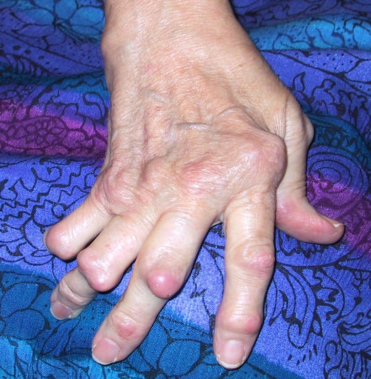

# ROMATOİD ARTRİT

**Hazırlayan:** Prof. Dr. Taşkın Şentürk
**Bölüm:** ADÜ Tıp Fakültesi - İmmünoloji ve Alerji Hastalıkları Bilim Dalı

---

## İÇİNDEKİLER

1. [Tanım ve Epidemiyoloji](#tanim-ve-epidemiyoloji)
2. [Etyopatogenez](#etyopatogenez)
3. [Başlangıç Şekilleri](#baslangiç-şekilleri)
4. [Eklem Tutulumu](#eklem-tutulumu)
5. [Eklem Dışı Tutulumlar](#eklem-disi-tutulumlar)
6. [Laboratuvar Bulguları](#laboratuvar-bulgulari)
7. [Radyoloji](#radyoloji)
8. [2010 ACR/EULAR Klasifikasyon Kriterleri](#2010-acreular-klasifikasyon-kriterleri)
9. [Tedavi Prensipleri](#tedavi-prensipleri)
10. [EULAR 2022 Tedavi Algoritması](#eular-2022-tedavi-algoritmasi)
11. [Biyolojik Ajanlar](#biyolojik-ajanlar)
12. [Morbidite ve Mortalite](#morbidite-ve-mortalite)

---

## TANIM VE EPİDEMİYOLOJİ

* Nedeni belli olmayan **sistemik, inflamatuvar** bir hastalık
* Ana bulgusu **kronik, simetrik, destrüktif poliartrit**

| Parametre | Değer |
|---|---|
| Prevalans | ~ %1 |
| Kadın/Erkek | 3/1 |
| En sık görülme yaşı | 30-50 yaş |

---

## ETYOPATOGENEZ

* **Cinsiyet:** Kadınlarda ve nulliparlarda daha sık
* **Enfeksiyonlar:** Viral enfeksiyonlar (EBV, Parvovirus B19, HIV, HTLV-1 vb.)
* **Genetik faktörler:**
  * İkiz çalışmaları: Risk 5 kat artmış
  * Dizigot ikizlerde %3-4, monozigot ikizlerde %15-30 konkordans
  * **HLA-DR4** hastaların %70'inde pozitif (normalde %28)
  * **Ortak Epitop:** DR-beta zincirinin 67-74. aminoasitleri arası

---

## KLINIK SEYIR

### Hastalığın İlerlemesi

```
Eklem İnflamasyonu → Eklem Harabiyeti → Fonksiyonel Sınırlanma → Fiziksel Sınırlanma → Prematür Mortalite
```

**⚠️ ÖNEMLİ:** Umulan yaşam süresi ortalama **10-12 yıl** kısalır. Ölüm oranları DM, Hodgkin ve 3 damar KAH ile eşdeğerdir.

### Klinik Seyir Tipleri

* **Tip 1 - Kendini sınırlayan:** %5-10
* **Tip 2 - Minimal progresif:** %5-10
* **Tip 3 - Progresif:** %80-90

---

## BAŞLANGIÇ ŞEKİLLERİ

### Başlangıç Hızına Göre

| Tip | Oran |
|---|---|
| Yavaş ve sinsi (aylar) | %65-70 |
| Subakut (haftalar) | %15-20 |
| Akut (günler) | %8-15 |

### Tutulum Şekline Göre

| Tip | Oran |
|---|---|
| Poliartiküler | %35 |
| Oligoartiküler | %44 |
| Monoartiküler | %21 |

### Sistemik Bulgular

* Ateş
* Halsizlik, yorgunluk
* Kilo kaybı

---

## EKLEM TUTULUMU

RA genellikle eklemleri **simetrik** olarak tutar. Başlangıçta birkaç eklemde ortaya çıkar.

**En sık tutulan eklemler:** El bilekleri, eller, dirsekler, dizler ve ayak bilekleri

### El ve El Bileği Tutulumu



* Yumuşak doku şişliği
* **Kuğu boynu deformitesi**
* **Düğme iliği deformitesi**
* **Ulnar deviasyon**

### Ayak ve Ayak Bileği Tutulumu

* Ayak parmaklarında pençeleşme
* Tabanlarda nasırlaşma ve bursite bağlı kronik infeksiyonlar
* Valgus deformitesi

### Diz Eklemi

* Şişlik
* **Baker kisti** ve rüptürü

### Kalça Eklemi

* Genellikle geç dönem tutulumu
* Erken dönemde iç rotasyon kısıtlılığı, daha sonra tüm hareketlerde azalma
* Asetabüler protrüzyon
* Bazen protez gereksinimi

### Atlanto-Aksiyel Tutulum

* **Lhermitte belirtisi** (uyuşukluk, sızlama, baş fleksiyonda iken elektriklenme hissi)
* Kuadriparezi
* ⚠️ Anestezi problemleri

---

## EKLEM DIŞI TUTULUMLARI

### Romatoid Nodüller

* Deri altı nodülleri **%20**
* Visseral nodüller (larinks, kalp, akciğer, skleralar vb.)

### Pulmoner Tutulum

* Plörezi (%1)
* İnterstisyel akciğer hastalığı
* Pulmoner nodüller
* Pulmoner hipertansiyon

### Kardiak Tutulum

* Perikardit (%1)
* Miyokardit (nadir)
* Endokardit (en sık mitral ve aort)
* Koroner arterit (vaskülit sonucu olabilir, AMI gelişebilir)

### Göz Tutulumu

* **Keratokonjunktivitis sikka** (%10-35)
* Episklerit, sklerit
* Skleromalazi perforans
* İyatrojenik:
  * Subkapsüler katarakt (kortizon)
  * Keratopati, retinopati (altın, klorokin)

### Romatoid Vaskülit

* Uzun süreli, eroziv ve RF(+) hastalarda görülür
* Mononöritis multipleks
* Tırnak yatağı enfarktları
* Parmak ülserasyonları

---

## LABORATUVAR BULGULARI

### İnflamasyona Bağlı Bulgular

Anemi, trombositoz, lökositoz, yüksek ESH ve CRP

### Serolojik Testler

| Test | Erken RA | Geç RA |
|---|---|---|
| Romatoid faktör (RF) | %40 | %75-80 |
| Anti-CCP | %50 | %75 |
| ANA | %25-30 (genellikle ağır vakalarda) | |

---

## RADYOLOJİ

### Erken Dönem Bulguları

* Yumuşak doku şişliği
* Periartiküler osteoporoz
* Eklem aralığında daralma
* Yüzeyel erozyonlar ve psödokistler

### Geç Dönem Bulguları

* Eklem yüzeyinde aşırı düzensizlik
* Subluksasyon ve luksasyonlar, deformiteler
* Genel osteoporoz
* Kemik ankilozu

### MR Görüntüleme

* Kemik erozyonları daha erken saptanabilir
* Kemik iliği ödemi bulgusu, erozyonların öncüsü olabilir
* Sinovya inflamasyonu ve hipertrofisi de saptanabilir

---

## 2010 ACR/EULAR KLASİFİKASYON KRİTERLERİ

**Kesin RA ≥ 6/10 puan**

### A. Eklem Tutulumu

| Tutulum | Puan |
|---|---|
| 1 büyük eklem | 0 |
| 2-10 büyük eklem | 1 |
| 1-3 küçük eklem (büyük eklem tutulumu var veya yok) | 2 |
| 4-10 küçük eklem (büyük eklem tutulumu var veya yok) | 3 |
| > 10 eklem (en az 1 küçük eklem) | 5 |

### B. Seroloji (en az 1 test sonucu gereklidir)

| Sonuç | Puan |
|---|---|
| Negatif RF ve negatif ACPA* | 0 |
| Düşük pozitif RF veya düşük pozitif ACPA | 2 |
| Yüksek pozitif RF veya yüksek pozitif ACPA | 3 |

### C. Akut Faz Reaktanları (en az 1 test sonucu gereklidir)

| Sonuç | Puan |
|---|---|
| Normal CRP ve normal ESR | 0 |
| Anormal CRP veya anormal ESR | 1 |

### D. Semptom Süresi

| Süre | Puan |
|---|---|
| < 6 hafta | 0 |
| ≥ 6 hafta | 1 |

*ACPA = anticitrullinated protein antibodies*

---

## TEDAVİ PRENSİPLERİ

### Non-farmakolojik Tedavi

* Hasta eğitimi
* İstirahat ve egzersiz
* Sigara içilmemesi (içiliyorsa bırakılması)
* Eklem bakımı
* Sağlıklı beslenme
* Rutin izlem ve bakımın devamlılığı

### Cerrahi Tedavi

* Sıkışma nöropatileri
* El cerrahisi
* Kalça ve diz protezi
* Tendon tamiri
* Eklem zarının çıkarılması (ankiloz, yapıştırma)

### Medikal Tedavi

* **Analjezikler ve NSAİİ:** Ağrı ve şişliğin semptomatik tedavisi
* **Kortikosteroidler**
* **Temel tedavi ajanları (DMARD):**
  * Klorokin / Hidroksiklorokin
  * Metotreksat
  * Leflunamid
  * Salazoprin (Sulfasalazin)
* **Biyolojik ajanlar**

### Güncel RA Tedavisi - Özet

```
Başlangıç tedavisi: Klasik DMARD'lar
              ↓
        Cevap yoksa
       ┌─────┴──────┐
       ↓             ↓
  Yeni bir       Biyolojik
  DMARD ekle     ajan ekle
```

### Erken Agresif Tedavinin Önemi

**⚠️ Hastaların %50'sinde ilk 2 yıl içinde radyolojik hasar delilleri görülür.**

> "Fırsat penceresi" - Erken dönemde tedaviye başlanması sakatlık ve organ hasarını önlemeye, normal yaşam sağlamaya yöneliktir.

---

## EULAR 2022 TEDAVİ ALGORİTMASI

### Faz I

```
RA'nın klinik tanısı
        ↓
MTX başlayın + Kısa dönemli kortikosteroid ile kombine edin
        ↓
3 ayda gelişme görüldü ve 6 ayda hedefe ulaşıldı mı?
        ↓                          ↓
      EVET                       HAYIR
        ↓                          ↓
  Devam edin               Leflunomid ya da
  (uzun süreli             sulfasalazin başlayın
  remisyonda doz                   ↓
  azaltımı/interval          FAZ II'ye geç
  arttırımı)
```

### Faz II

```
Kötü prognostik faktörler mevcut mi?
(RF/ACPA yüksek seviyeler, yüksek hastalık aktivitesi,
erken eklem hasarı, ≥2 csDMARD başarısızlığı)
        ↓                          ↓
      EVET                       HAYIR
        ↓                          ↓
bDMARD ya da              İkinci bir csDMARD'a
JAK-inhibitörü             değiştirin ya da ekleyin
ekleyin                    (leflunomid, sulfasalazin,
        ↓                  tek başına ya da csDMARD
3 ayda gelişme             kombinasyonunda + GK)
görüldü ve 6 ayda                  ↓
hedefe ulaşıldı mı?       3 ayda gelişme görüldü ve
        ↓        ↓        6 ayda hedefe ulaşıldı mı?
      EVET     HAYIR               ↓        ↓
        ↓        ↓               EVET     HAYIR
  Devam edin  FAZ III'e geç   Devam edin  FAZ III'e geç
```

### Faz III

* bDMARD ya da JAK-inhibitörünü değiştirin (aynı ya da farklı sınıftan)
* 3 ayda gelişme ve 6 ayda hedefe ulaşılırsa devam edin
* Uzun süreli remisyonda doz azaltımı / interval arttırımı

**Kısaltmalar:**
* **csDMARD:** Konvansiyonel sentetik hastalık modifiye edici antiromatizmal ilaçlar
* **bDMARD:** Biyolojik hastalık modifiye edici antiromatizmal ilaçlar
* **tsDMARD:** Hedefli sentetik hastalık modifiye edici antiromatizmal ilaçlar

---

## BİYOLOJİK AJANLAR

### TNF-alfa Antagonistleri

| İlaç | Yapı | Ticari Ad |
|---|---|---|
| İnfliximab | Şimerik TNF-alfa MoAb | Remicade (biyobenzer: Remsima, Ixifi) |
| Etanercept | Rekombinant TNF-alfa reseptörü | Enbrel (biyobenzeri mevcut) |
| Adalimumab | İnsan anti-TNF MoAb | Humira (biyobenzer: Amgevita) |
| Certolizumab pegol | PEGylated Fab fragmanı | Cimzia |
| Golimumab | İnsan anti-TNF mAb | Simponi |

### Sitokin İnhibitörleri

* **Anakinra** (Kineret): IL-1Ra
* **Tocilizumab** (Actemra): Anti-IL-6R antikoru

### B Hücre Hedefli Tedaviler

* **Rituximab** (Mabthera): Anti-CD20 MoAb

### T Hücre Hedefli Tedaviler

* **Abatacept** (Orencia): CTLA4-Ig (kostimülasyon inhibitörü)

### JAK İnhibitörleri (Hedefe Yönelik Küçük Moleküller)

* **Tofasitinib** (Xeljanz)
* **Barisitinib** (Unamity)
* **Upadasitinib** (Rinvoq)

---

## MORBİDİTE VE MORTALİTE

* Ortalama umulan yaşam süresi **5-15 yıl** kısalır
* MI veya SVO insidansı **2 kat** fazladır
* İnfeksiyon riski artmıştır
* Genel populasyona göre **lenfoma riski 3 kat** fazladır

### RA'da Disabilite

* Yaşam boyu ortalama kazanç kaybı = **%50**
* Hastalığın başlangıcından sonra 8-10 yıl içinde RA hastalarının **%40-85** kadarı iş yapamaz hale gelir
