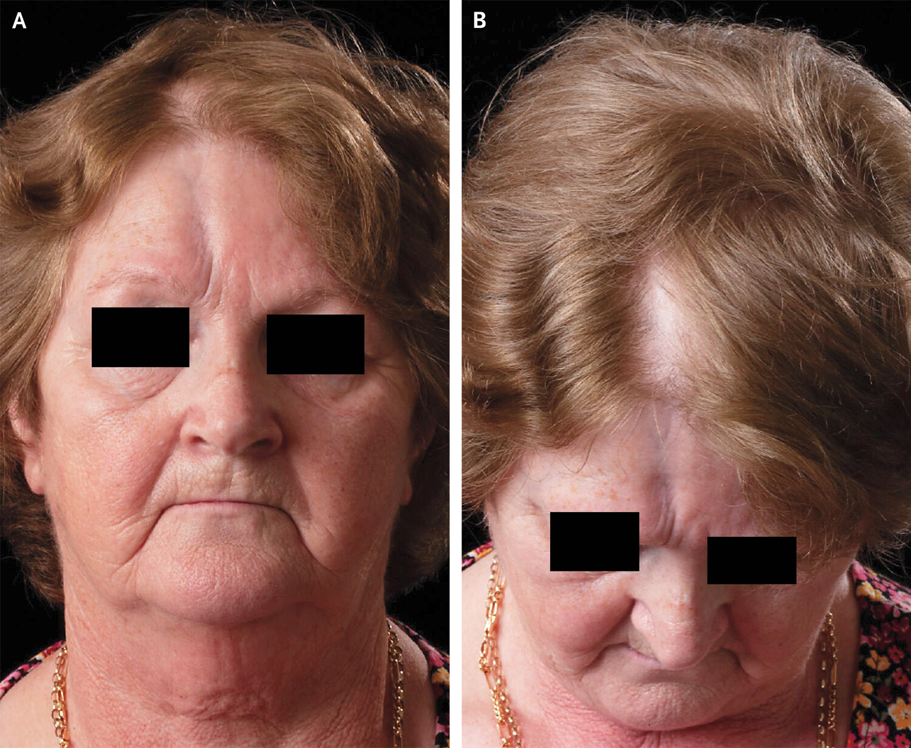
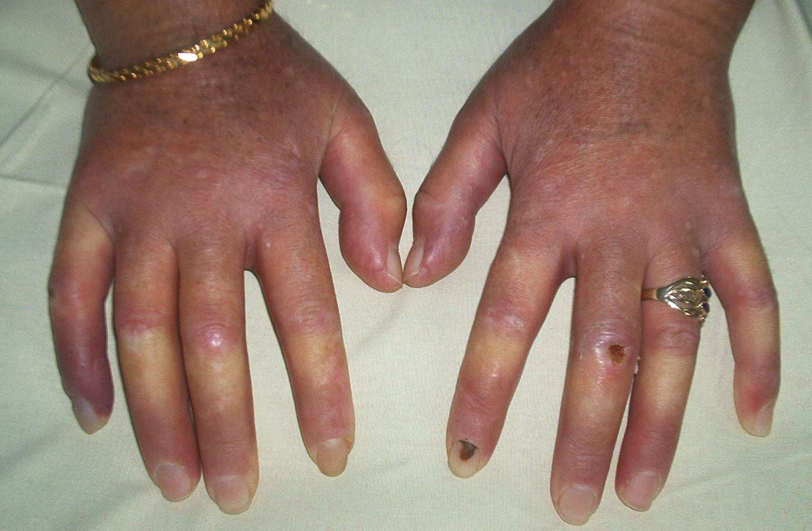

# SİSTEMİK SKLEROZ

**Hazırlayan:** Prof. Dr. Taşkın Şentürk
**Bölüm:** ADÜ Tıp Fakültesi - İmmünoloji ve Alerji Hastalıkları Bilim Dalı

---

## İÇİNDEKİLER

1. [Tanım ve Epidemiyoloji](#tanim-ve-epidemiyoloji)
2. [Patogenez](#patogenez)
3. [Sınıflama](#siniflandirma)
4. [Kapilleroskopi](#kapilleroskopi)
5. [Klinik Özellikler](#klinik-ozellikler)
6. [Tanı](#tani)
7. [Otoantikorlar](#otoantikorlar)
8. [Ayırıcı Tanı](#ayirici-tani)
9. [Tedavi](#tedavi)

---

## TANIM VE EPİDEMİYOLOJİ

* Deri ve iç organların **yaygın fibrozu** ile karakterize, **kronik otoimmün inflamatuar** bir hastalıktır

### Epidemiyoloji

* İnsidans: **10-20 / 1 milyon**
* En sık **30-50 yaş** arasında görülür
* Kadın/erkek oranı: **8/1**

| Özellik | Kadın | Erkek |
|---|---|---|
| Başlangıç yaşı | Genç yaş | - |
| Tutulum tipi | Sınırlı tutulum | Yaygın tutulum |
| Eşlik eden | RF ve vasküler hastalık, PH sık | Daha ciddi İAH ve KVS komplikasyonu |

---

## PATOGENEZ

Birbiri ile ilişkili **3 temel mekanizma** düşünülmektedir:

### 1. Vasküler Değişiklikler (Mikrovaskülopati)

* Küçük damar hasarı **en önemli** ve muhtemelen **ilk olay**dır
* Çeşitli dokuların küçük arter, arteriol ve kapillerlerinde yaygın damar endotel aktivasyonu ve/veya hasarı oluşur
* Klinik olarak çoğunlukla ilk semptom olan **Raynaud fenomeni** ile kendini gösterir
* Süreç: Reversible mikrovaskülopati (RF) → diğer risk faktörleri ve artmış immün yanıt → irreversible damar hasarı → fibrozis

### 2. İmmün Sistemin Aktivasyonu

* T, B, makrofaj ve diğer tüm hücrelerin aktivitesi artar
* **Humoral immünite bozuklukları:** ANA pozitifliği, hipergamaglobulinemi
* Çeşitli sitokin ve solübl mediatörler artar

### 3. Fibroblast Aktivasyonu - Fibrozis

* Deri ve iç organlarda görülen aşırı kollajen ve ekstrasellüler matriks yapımından **aktive olmuş fibroblastlar** asıl sorumludur
* Sonuçta **kollajen, fibronektin ve GAG** yapımı artar
* Aşırı ekstraselüler matriks sentezi gerçekleşir

```
     Vaskülopati ←→ İmmün Aktivasyon
          ↓                ↓
          └───────┬────────┘
                  ↓
       Fibroblast Aktivasyonu
                  ↓
       Aşırı Kollajen / ECM
                  ↓
             FİBROZİS
```

---

## SINIFLANDIRMA

### Lokalize Skleroderma

Visseral tutulum **yapmaz**, Raynaud fenomeni **yoktur**. Sadece cilt, cilt altı dokusu ve bazen kasları tutar.

| Tip | Alt Tipler |
|---|---|
| **1. Plak morfea** | Plak morfea, guttat morfea, Pasini ve Perini atrofodeması, keloid morfea |
| **2. Yaygın morfea** | - |
| **3. Büllöz morfea** | - |
| **4. Derin morfea** | Subkutanöz morfea, eozinofilik fasiit, morfea profunda |
| **5. Lineer skleroderma** | Lineer morfea, **en coup de sabre** |



### Sistemik Skleroderma

#### Sınırlı Skleroderma (sSSk)

* Hastalığın tanısından **yıllar önce** Raynaud ortaya çıkar
* Cilt tutulumu **dirsek-diz distali** ve **yüz-boyuna** sınırlıdır
* **%50-60** anti-sentromer pozitifliği
* **CREST sendromu** bu grubun klasik alt tipidir:
  - **C**alcinosis
  - **R**aynaud's phenomenon
  - **E**sophageal dysmotility
  - **S**clerodactyly
  - **T**elangiectasia

#### Diffüz Skleroderma (dSSk)

* Raynaud ortaya çıkışından sonra **bir yıl içinde** tanı konulur
* **Gövde tutulumu**, tendon krepitasyonları
* Kapilleroskopi bulguları belirgin
* **Erken dönemde iç organ tutulumu**
* Anti-Scl 70 (%30), anti-RNA Pol III (%12-15)

#### Sklerodermasız SSc (Sine Skleroderma)

* Hastaların **<%5**'inde görülür
* Cilt tutulumu **olmadan** seyreder
* RF veya dijital ülser-skar, anormal tırnak yatağı kapilleri
* ANA pozitifliği (benekli-nükleoler)
* İç organ tutulumu ile seyreder: AC fibrozisi, PH, özefagus dismotilitesi, skleroderma renal krizi vb.

#### Pre-skleroderma

* Raynaud fenomeni ve/veya anormal kapilleroskopi bulguları olan, henüz tam skleroderma kriterlerini karşılamayan hastalar
* SSk'ye ilerleme riski taşır

#### Çakışma (Overlap) Sendromları

* SSk ile diğer bağ dokusu hastalıklarının (RA, SLE, polimiyozit/dermatomiyozit vb.) birlikte görülmesi
* Mikst bağ dokusu hastalığı (MCTD) ile ayrım önemli

### SSk Taklitçileri

* Skleromiksödem
* Skleroödem
* Eozinofilik fasiit
* GVHD (Graft versus Host Hastalığı)
* Nefrojenik sistemik fibrozis

---

## KAPİLLEROSKOPİ

* Tırnak yatağı kapilleroskopisi tanıda önemli bir araçtır
* Anormal kapiller yapılar SSk için karakteristiktir
* Erken tanıda ve hastalık takibinde değerlidir

---

## KLİNİK ÖZELLİKLER

Tutulan bölgelerde **fibröz yapı** ile karakterizedir.

* Konstitüsyonel semptomlar (ağrı, yorgunluk belirgin)
* Vaskülopati bulguları
* Sistemik tutuluma ait bulgular

### Cilt Tutulumu

| Dönem | Özellik |
|---|---|
| **Ödematöz dönem** | Dermiste hidrofilik GAG birikimi |
| **İnduratif dönem** | Ciltte sertleşme ve gerginlik |
| **Atrofik dönem** | Dermis yumuşar, normalden ince olarak kalır |

**Cilt bulguları:**
* Ciltte sertleşme ve ödem
* Atrofi
* Kalsinozis
* Telenjektaziler
* Ülser ve gangren
* Pulpa atrofisi
* Hipo-hiperpigmentasyon

### Raynaud Fenomeni

**Semptomlar:**
* ⚠️ **Trifazik renk değişimi** (beyaz → mavi → kırmızı)
* Soğukluk
* Hissizlik
* Ağrı
* Ülser, dijital nekroz

**Tutulum bölgeleri:** Eller, burun, kulaklar, diz, ayaklar, ayak parmakları

**Atakları tetikleyen faktörler:** Soğuk, emosyonel stres, inaktivite



### Fizik Muayene Bulguları

* Parmaklarda puffy ödem / ellerde non-pitting ödem
* Ciltte sertlik-kalınlaşma
* Ağız orifisinde daralma, perioral ciltte sertleşme
* Dijital ülser, pitting skar, DIF-PIF üzerinde ülserler
* Anormal kapilleroskopi bulguları
* Kalsinozis kutis, mukokutanöz telenjektazi, kutanöz hiperpigmentasyon
* Parmak, bilek, dirsek, diz tendon sürtünme sesi
* Sistemik bulgular

### Kas-İskelet Sistemi Bulguları

* Ellerde ödem, artralji, miyalji → erken hastalık bulgusu
* Artrit (nadir-destrüktif, artrite eşlik eden RA?)
* Tendinit
* Eklem kontraktürleri

**Radyolojik bulgular:**
* Yumuşak doku kalsifikasyonu
* Akro-osteolizis (terminal falanksların rezorpsiyonu)
* Fleksiyon deformiteleri - deri sertliğine sekonder
* Eklem aralığında daralma
* Erozyonlar

### Gastrointestinal Sistem

* **Gastroözefageal reflü** ⭐ (en sık GİS tutulumu)
  - Yanma ve yutma güçlüğü sık ve genel popülasyonda görülenden daha ciddi
  - Sık mikroaspirasyon → İAH'a katkı
* **Mide boşalmasında gecikme** (%80)
  - Bazı hastalarda **"watermelon (karpuz) mide"** (GAVE sendromu) gözlenir
  - Midede dilate kan damarlarından dolayı kırmızı çizgili alanlar → yavaş kanama ve anemi

| Tutulum | Bulgular |
|---|---|
| **Özefagus** | Özefageal striktürler, disfaji, dilatasyon |
| **Mide** | Şişkinlik, çabuk doyma, kanama |
| **İnce barsaklar** | Diyare, muhtemel malnutrisyon, peristaltizm eksikliği |
| **Kalın barsaklar** | Diyare, konstipasyon, obstrüksiyon, perforasyon |

### Pulmoner Tutulum (%80)

#### İnterstisyel Akciğer Hastalığı (AC Fibrozisi)

* **Yaygın cilt tutulumu** ile ilişkili
* Nefes darlığı (egzersiz-istirahat)
* Nonprodüktif öksürük
* Bibaziller fibrozis:
  - Buzlu cam görünümü
  - Retiküler opasiteler ve interlobüler septal kalınlaşma
  - Bal peteği görünümü ve traksiyon bronşiektazileri
* ❌ Plevral efüzyon **yoktur**

#### Pulmoner Vasküler Hastalık (Pulmoner HT)

* **Sınırlı cilt tutulumu** (CREST) ile ilişkili ⭐
* Efor dispnesi, egzersiz intoleransı
* Progresif seyir → kor pulmonale
* Pulmoner arter trombüsü

### Renal Tutulum (%60)

* Vasküler fibrozis
* İnterstisyel kollajen birikimi
* Glomerülonefrit
* Mikroalbüminüri
* Kreatinin yüksekliği / HT
* Yavaş progresyon, KBY nadir

**🚨 Renal Kriz:**
* Çok ciddidir, **diffüz SSc'li hastaların %10**'unda ve genellikle **erken evrede** görülür
* **Malign HT + hızlı ilerleyen ABY = SSk renal kriz**
* Hastaların **%5**'inde görülür
* Tedavisiz 1 ve 5 yıllık sağ kalımlar sırasıyla **%15** ve **%10**
* **ACE inhibitörleri** ile bu oranlar **%76** ve **%66**'ya kadar çıkmıştır ⭐
* Mikroanjiopatik hemolitik anemi ve trombositopeni de görülebilir

### Kardiak Tutulum

* Genellikle ciddi kardiak problemler görülmez (diffüz tipte **%15**)
* Tüm kardiyak yapılar etkilenebilir: miyokard, perikard, ileti sistemi
* Ritm bozuklukları, KKY ve perikardit riski artar
* Hastalığın **ilk 3 yılı** içinde görülme olasılığı yüksektir

### Diğer Sistem Tutulumları

* **%20-25** Sjögren sendromu
* Primer bilier siroz, Hashimoto tiroiditi
* Seksüel disfonksiyon
* Müsküler atrofi, nöropati, tek veya çift taraflı trigeminal nevralji
* ⚠️ Artmış malignite riski (akciğer kanseri, hematolojik, özefagus, orofarengeal)
* Tromboemboli

---

## TANI

Tanı; **öykü, fizik muayene, laboratuvar ve görüntüleme** bulgularının birlikte değerlendirilmesiyle konulur.

### Laboratuvar Bulguları

* Hipergamaglobulinemi
* Anemi
* Akut faz yanıtlarında artış
* Otoantikorlar
* Pulmoner fonksiyon testleri ve YÇBT
* EKO (pulmoner arter basıncı - pulmoner arteryel hipertansiyon için)

### ACR Sınıflama Kriterleri

**Majör kriter:**
* MCP-MTP eklemlerin proksimalinde, herhangi bir lokalizasyonda sklerodermatöz deri değişikliği

**Veya aşağıdakilerden herhangi ikisi (minör kriterler):**
* Sklerodaktili
* Dijital iskemi-ülser, parmak uçlarında pitting skar-atrofi
* Bibaziller pulmoner fibrozis

* Sensitivite: **%91**
* Spesifite: **%99**

### ACR/EULAR 2013 Klasifikasyon Kriterleri

| Kriter | Puan |
|---|---|
| Her iki elde parmaklar ve MKF eklemlerin proksimalinde deri kalınlaşması **(yeterli kriter)** | **9** |
| **Parmaklarda deri kalınlaşması** (yalnızca yüksek olanı skorlayın) | |
| - Şiş (puffy) parmaklar | 2 |
| - Sklerodaktili | 4 |
| **Parmak ucu lezyonları** (yalnızca yüksek olanı skorlayın) | |
| - Parmak ucu ülserleri | 2 |
| - Pitting skar | 3 |
| Telenjektazi | 2 |
| Anormal tırnak yatağı kapilleri | 2 |
| **PAH ve/veya İnterstisyel Akciğer Hastalığı** (maksimum skor 2) | |
| - PAH | 2 |
| - İnterstisyel Akciğer Hastalığı | 2 |
| Raynaud fenomeni | 3 |
| **Sistemik skleroz ilişkili otoantikorlar** (maksimum skor 3) | |
| - Anti-sentromer | 3 |
| - Anti-Scl 70 | 3 |
| - Anti-RNA polimeraz III | 3 |

**⚠️ Tanı = ≥9 puan**

---

## OTOANTİKORLAR

| Otoantikor | İlişkili Form | Klinik Önem |
|---|---|---|
| **Anti-sentromer** | Sınırlı SSk (CREST) | %50-60 pozitiflik, pulmoner HT ile ilişkili |
| **Anti-Scl 70 (Anti-topoizomeraz I)** | Diffüz SSk | %30 pozitiflik, İAH ile ilişkili |
| **Anti-RNA polimeraz III** | Diffüz SSk | %12-15 pozitiflik, renal kriz ile ilişkili |

---

## AYIRICI TANI

| Hastalık | Özellik |
|---|---|
| Sklerodermanın lokalize formları (morfea) | Sadece cilt tutulumu |
| Nefrojenik sistemik fibrozis | Böbrek yetmezliği zemininde gadolinyum maruziyeti |
| Amiloidoz | Organ infiltrasyonu |
| Eozinofilik fasiit | Kol ve bacaklarda ciltte gerginlik ve şişlik |
| Skleroödem | İdiyopatik, DM, enfeksiyon ilişkili |
| Skleromiksödem (papüler müsinözis) | Monoklonal gamapati ilişkili |
| İlaçlar | Bleomisin, dosetaksel, lokalize K vitamini |
| Kronik GVHH | Kök hücre nakli sonrası |

---

## TEDAVİ

**⚠️ ÖNEMLİ:**

* Günümüzde sklerodermanın herhangi bir formu için **kesin bir tedavi veya kür yoktur**
* Tedavi **semptomatik** veya **hastalık modifiye edici** ajanlardan biridir

### Raynaud Fenomeni Tedavisi

**1. Koruyucu tedavi:**
* Vücudu sıcak tutmak, soğuktan kaçınma
* Agreve edici faktörlerden kaçınma:
  - ❌ Sigara
  - ❌ İlaçlar (dekonjestanlar vb.)

**2. Vazodilatör ajanlar:**
* Kalsiyum kanal blokerleri
* PDE-5 inhibitörleri
* İV iloprost
* Endotelin reseptör antagonistleri (bosentan)
* Topikal nitrat, ARB

### Sistemik Hastalık Tedavisi

| İlaç Grubu | Endikasyon |
|---|---|
| **NSAİİ** | Kas-iskelet semptomları |
| **Kortikosteroid** | Endikasyonu sınırlı; dirençli artritte, ödematöz fazda, miyopatide düşük doz; aktif alveolit varsa yüksek doz |
| **ACE inhibitörleri** | Renal tutulum - renal kriz tedavisi ⭐ |

### Hastalık Modifiye Edici İlaçlar

* **Metotreksat**
* **Siklofosfamid**
* **Mikofenolat mofetil**
* **Rituksimab**
* **IVIG**
* **Akciğer nakli** (son basamak)
