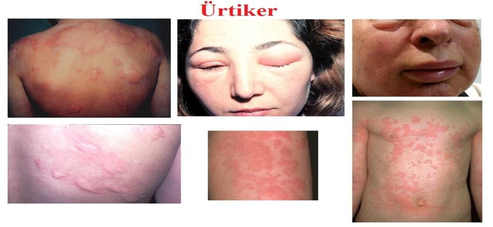
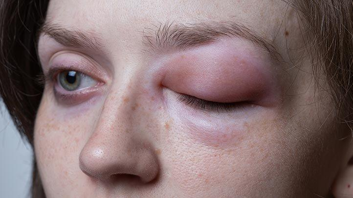
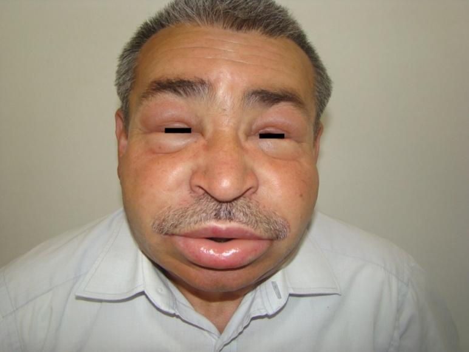
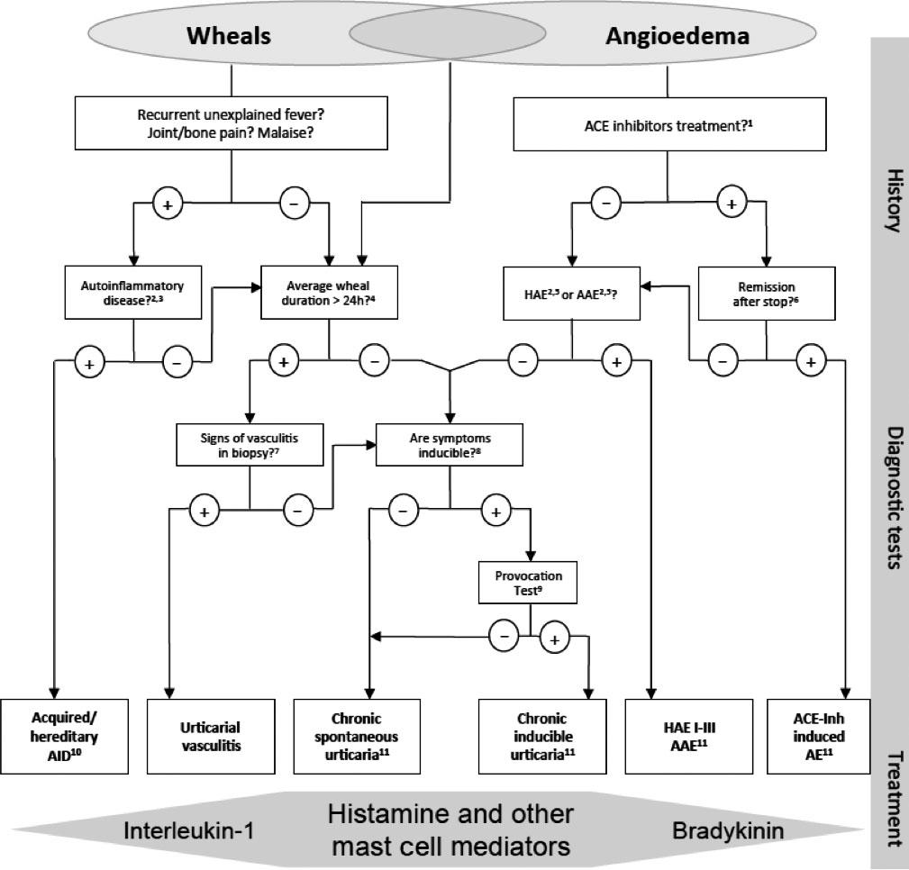
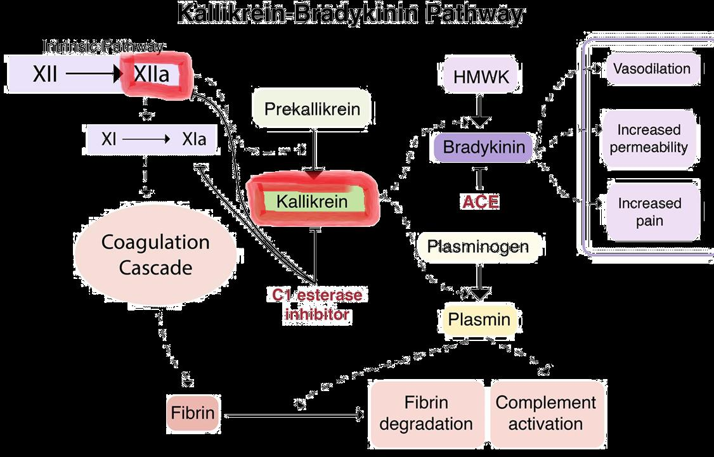

# ÜRTİKER VE ANJİOÖDEM

**Hazırlayan:** Prof. Dr. Songül Çildağ
**Bölüm:** ADÜ Tıp Fakültesi - İmmünoloji ve Alerji Hastalıkları Bilim Dalı

---

## İÇİNDEKİLER

1. [Ürtiker](#ürtiker)
2. [Anjioödem](#anjioödem)
3. [Sınıflama](#siniflandirma)
4. [Tanı](#tani)
5. [Ayırıcı Tanı](#ayirici-tani)
6. [Tedavi](#tedavi)
7. [Herediter Anjioödem (HAÖ)](#herediter-anjioödem)
8. [Kazanılmış ve İlaçla İndüklenen Anjioödem](#kazanilmis-ve-ilacla-indüklenen-anjioödem)

---

## ÜRTİKER



* Değişen boyutlarda, eritemle çevrili, sınırları belirgin, **kaşıntılı kabarıklık**
* Kaşıntı tipik, bazen yanma hissi
* 30 dk-24 saat düzelme (iz bırakmaz)
* Basmakla solar
* **Histamin** temel mediyatör (ayrıca PG, LT, triptaz vb.)
* Üst-orta dermiste küçük venül ve kapillerlerin vazodilatasyonu, artmış vasküler geçirgenlik

### Epidemiyoloji

* Yaşam boyu ürtiker görülme sıklığı: **%15-24**
* Akut ürtiker: K = E, her yaş grubu
* Kronik ürtiker: erişkinde, **K sık**, 3.-5. dekadda sık
* Kronik ürtiker prevalansı: **%0.5-5**, insidansı yıllık %1.4
* Primer effektör hücreler: Mast hücreleri, bazofiller, ayrıca lenfositler, PMNL
* Ürtikere **%40-50** anjioödem eşlik edebilir

---

## ANJİOÖDEM





* Geçici damar geçirgenliği artışı sonucunda subkutan veya submukozal dokularda, kendini sınırlayan, intermittan, **lokalize ödem**
* Karıncalanma, yanma, gerginlik, ağrı hissi
* Daha yavaş düzelme (**72 saate kadar**)
* Derin dermis/subkutan veya mukozal şişlik

### Anjioödem Lokalizasyonu

Genellikle gevşek bağ dokunun olduğu bölgeleri etkiler (asimetrik):
* Yüz, dudaklar, ağız
* Larenks, uvula
* Ekstremiteler
* Genital sistem
* GIS

> En sık gözlenen anjioödem **akut alerjik anjioödem**dir (tüm anjioödemlerin **%70**'i)

### Anjioödemin Diğer Ödem Tiplerinden Farkları

| Özellik | Anjioödem | Diğer Ödem Tipleri |
|---|---|---|
| Seyir | Kendini sınırlar, asimetrik dağılım | Kronik, persistan, simetrik |
| Başlangıç | Dk-saatler içinde başlar | Yavaş |
| Düzelme | Saatler-günler içinde spontan çözünür | Kronik |
| Yerçekimi | Yerçekimine bağlı değil, pozisyona bağlı değil | Yerçekimine bağımlı |
| Lokalizasyon | Bağ dokunun gevşek olduğu bölgelerde (yüz, dudak, göz kapakları) | Altta yatan duruma bağlı |
| Eşlik eden | Alerji veya anafilaksi belirtileri eşlik edebilir | Alerji/anafilaksi belirtileri bulunmaz |

---

## SINIFLANDIRMA

### Süreye Göre

* **Akut ürtiker/anjioödem:** ≤6 hafta
  - Etyoloji çoğunlukla bellidir
  - Genellikle alerjik, genellikle IgE aracılı
  - Gıda, ilaç, lateks alerjisi, böcek sokması, kontakt alerjenler, enfeksiyonlar
  - Tek başına veya anafilaksi ile birlikte
* **Kronik ürtiker/anjioödem:** >6 hafta
  - Etyoloji çoğunlukla belli değildir
  - Spontan veya indüklenebilir form
  - Nadiren alerjik

### Kronik Ürtiker Sınıflandırması (>6 hafta)

| Kronik Spontan Ürtiker | İndüklenebilir Ürtiker |
|---|---|
| Sebebi bilinen (otoantikorlar) veya bilinmeyen (idiyopatik) | Semptomatik dermografizm |
| | Soğuk ürtikeri |
| | Gecikmiş basınç ürtikeri |
| | Solar ürtiker |
| | Sıcak ürtikeri |
| | Vibratuar anjioödem |
| | Kolinerjik ürtiker |
| | Kontakt ürtikeri |
| | Aquajenik ürtiker |

---

## TANI

* Ayrıntılı öykü
* Fizik muayene
* Tetikleyicilere yönelik testler (spesifik IgE ölçümü)
* Laboratuvar

### Kronik Ürtiker Tanısal Yaklaşım

| Tip | Rutin Tanısal Testler | Öyküye Göre (nedene yönelik) |
|---|---|---|
| **Akut spontan ürtiker** | -- | -- |
| **Kronik spontan ürtiker** | Tam kan sayımı, sed, CRP, IgG-anti TPO, total IgE | Şüpheli tetikleyiciden kaçınma, enfeksiyon (H. pylori vb.), fonksiyonel otoantikorlar (bazofil aktivasyon testi), TFT ve otoantikorları, alerji testi, eşlik eden kronik indüklenebilir ürtiker, ciddi hastalık (triptaz), cilt biyopsisi |
| **İndüklenebilir ürtiker** | İlgili provokasyon testi (soğuk PT, basınç PT, sıcak PT, UV/ışık testi, dermografizm sağlama, vibrasyon testi) | Tam kan sayımı, sed, CRP, enfeksiyon, ayırıcı tanı |



---

## AYIRICI TANI

* Makülopapüler kutanöz mastositoz (urticaria pigmentosa), cilt tutulumlu sistemik mastositoz
* **Ürtikeryal vaskülit**
* Bradikinin aracılı anjioödem (HAÖ vb.)
* Egzersizle indüklenen anafilaksi
* Otoinflamatuar sendromlar (CAPS, FCAS, MWS, NOMID)
* Schnitzler sendromu (ürtiker, monoklonal gamopati, sistemik bulgular)
* Gleich sendromu (epizodik anjioödem ve eozinofili)
* Well sendromu (eozinofilik selülit)
* Büllöz pemfigoid
* Erişkin başlangıçlı Still hastalığı

### Ürtikeryal Vaskülit - Ürtiker ile Ayırıcı Özellikler

* Lezyonlar **>24 saat** sürer
* **Yanma ve ağrı** hissi (kaşıntıdan çok)
* **Hiperpigmentasyonla** iyileşme
* Basmakla **solmaz**
* Lezyonlar akral bölgelerden ziyade gövde ve proksimal ekstremitelerde
* Hipokomplementemi olabilir
* Sistemik bulgular eşlik edebilir

---

## TEDAVİ

### Genel Prensipler

* Tetikleyicilerden uzak durmak
* **2. kuşak H1 antihistaminikler** (AÜ, KÜ) - **ilk seçenek**
* Kortikosteroidler (AÜ, KÜ kısa süreli)
* Adrenalin (akut ataklarda larenks ödeminde)
* Lökotrien antagonistleri (KÜ)
* Biyolojik ajanlar (KÜ, **omalizumab** - anti-IgE monoklonal antikor)
* İmmünsüpresif tedavi (KÜ, siklosporin vb.)

### Kronik Ürtiker Basamak Tedavisi

```
2. kuşak H1 antihistaminik / gerekirse doz artışı (4 kata kadar)
                    ↓
        2-4 hafta sonra yanıt yoksa
                    ↓
2. kuşak H1 antihistaminik + Omalizumab
                    ↓
        6 ay içerisinde yanıt yoksa
                    ↓
2. kuşak H1 antihistaminik + Siklosporin
```

---

## HEREDİTER ANJİOÖDEM

### Anjioödem Sınıflandırması

| Tip | Alt Tip | Özellik |
|---|---|---|
| **HAÖ - C1 INH eksikliğine bağlı** | **Tip 1 (%80-85)** | C1 INH üretim defekti - seviyesi düşük, fonksiyonu düşük |
| | **Tip 2 (%15-20)** | C1 INH seviyesi normal veya artmış, fonksiyonel bozukluk - fonksiyonu düşük |
| **HAÖ - Normal C1 INH** | Çok nadir | C1 INH seviyesi normal, fonksiyonu normal |
| | | HAÖ-FXII mutasyonu, HAÖ-ANGPT1, HAÖ-PLG, HAÖ-KNG1, HAÖ-MYOF, HAÖ-HS3ST6, HAÖ-UNK |

### Epidemiyoloji ve Patogenez

* İnsidansı ort. **1:50.000**
* **11. kromozom** lokalize >850 C1 INH gen mutasyonu (**SERPING1** mutasyonu)
* **Otozomal dominant**
* %25 spontan mutasyon
* Cinsiyet farkı yok (kadınlarda daha şiddetli klinik)
* Kallikrein-kinin sistemi inhibisyonunda sorun



### C1 INH Görevleri

* Kompleman otoaktivasyonunu önlemek
* Kontakt sistem proteazlarını inhibe etmek (Faktör XIIa, XIa inaktive etmek, aktif kallikreini direkt inhibe etmek)
* Minimal olarak fibrinolitik proteaz plazmini inhibe etmek
* Temel mediyatör: **BRADİKİNİN**
  - Akut atakta bradikinin 2-12 kat artar
  - Bradikinin B2 reseptörü aracılığı ile vasküler permeabilite artışı

### Klinik

* Ataklar C1 INH düzeyi **<%50 (<%35)** başlar
* İlk bulgular genellikle yaşamın **ilk 2 dekadında**
* %5 asemptomatik
* Puberte ile kötüleşir
* Tedavi edilmeyen hastalarda en az **ayda bir** atak
* \>12 ay ataksız dönem çok nadir

**Ödem özellikleri:**
* Ciltte derin tabakalarda ve mukoza ödem
* İçi boş iç organ duvarında ödem
* Ataklar **2-5 günde** düzelir
* Ödem pitting bırakmaz, ağrısız, kaşıntısız

**Tetikleyici faktörler:** Travma, basınç (1/3), tıbbi prosedür, stres (1/3), menstrüasyon, östrojen, enfeksiyonlar, ACE inh., nadiren spontan

### Klinik Bulgular

* **Kutanöz anjioödem** (%75 ilk bulgu) - Sıklıkla ekstremiteler (%90), yüz (%80), genital, gövde, boyun; asimetrik; 2-5 gün
* **Abdominal bulgular** (%70-80) - Tüm atakların %50'sine eşlik eder; bulantı, kusma, karın ağrısı; yanlış tanı - akut batın?
* **Larenks ödemi** - Hayatı tehdit edici, asfiksi; %50 en az bir kez; <3 yaş nadiren; HAÖ ataklarının <%1

### Normal C1 INH Seviyeli HAÖ

* 2. dekadda başlangıç
* Daha uzun semptomsuz dönem
* Eritema marginatum yok
* Yüz ve GIS tutulumu belirgin
* Uvula-dil ödemi - larenks ödemi
* Kadınlarda sık, OKS ve gebelikte alevlenme

**Östrojen etkisi ve mekanizması:**

Östrojen bradikinin yolağını birkaç noktada etkiler:

| Artıranlar | Azaltanlar |
|---|---|
| Faktör XII (F12) | C1 INH |
| Kininojen-kallikrein | ACE |
| B2 reseptör ekspresyonu | Karboksipeptidaz N |
| Plazmin, F7, F9, F10 | |

### Tanı

**Öykü:**
1. Aile öyküsü (%25 spontan mutasyon)
2. Atakların çocukluk-adolesan dönemde başlaması
3. Tekrarlayan ve ağrılı karın semptomları
4. Tekrarlayan kutanöz, üst solunum yolu ödemi
5. **Alerji tedavisine yanıtsızlık** (antihistaminik, kortikosteroid, adrenalin)
6. Prodromal semptomlar
7. **Ürtikerin eşlik etmemesi**

**Laboratuvar:**
* **C4** (en iyi tarama testi) - <%30N; %1-2 ataklar arası normal olabilir; negatif prediktif değer %96
* Akut atakta C4, C2 seviyesi
* C1 INH düzeyi ve fonksiyonu
* **Genetik:** SERPING1 mutasyonu; Normal C1 INH HAÖ'de FXII, anjiopoetin 1, plazminojen mutasyonu vb.

### HAÖ vs FMF Ayırıcı Tanı

| Özellik | FMF | HAÖ |
|---|---|---|
| Atak süresi | 2-5 gün | 2-5 gün |
| Aile öyküsü | + | + |
| Başlangıç yaşı | Çocukluk | Çocukluk |
| Cinsiyet | E > K | E = K |
| Genetik geçiş | **OR** | **OD** |
| Karın atağı | + (Seroza) | + (Barsak duvarı) |
| Ateş | + | - |
| Ekstremite | Artrit | Difüz anjioödem |
| Anjioödem (baş-boyun) | - | + |
| C4 | Normal-artmış | **Düşük** |
| C1 INH/fonk | Normal-artmış | Normal-düşük (Tip 1-2) |
| Akut faz yanıtı | Artmış | Normal |
| Kolşisine yanıt | + | - |
| Mutasyon | M694V, diğer | SERPING1 |

### HAÖ Tedavisi

**Korunma:**
* Eğitim
* Cerrahi prosedürlerde dikkat
* İlaçlar: Östrojen içeren OKS ve **ACE inh. yasaklanmalı**
* Aile taraması

**Akut atak tedavisi:**

**⚠️ ÖNEMLİ:** Antihistaminik ve steroid tedavide yeri **yoktur**

* İV sıvı, analjezik, antiemetik
* Solunum yolu muayenesi dikkat
* **C1 INH (İV)** - ilk seçenek
* **Kinin yolağı inhibitörleri:**
  - Bradikinin-2 reseptör antagonistleri (**icatibant**) SC
  - Kallikrein inhibitörü (**ecallantide**) SC
* Taze donmuş plazma (TDP)

**Kısa süreli profilaksi** (diş çekimi, cerrahi girişimler, travma sonrası):
* C1 INH - girişimden hemen önce 1000 IU
* TDP - cerrahiden 1 gece önce veya cerrahi günü 2 ünite (1-12 saat, 15-20 mL/kg)
* Androjenler - cerrahiden 5 gün önce - 2-3 gün sonra 600 mg/gün danazol

**Uzun dönem profilaksi** (ayda >1 atak, yaşam kalitesi etkilenen, solunum yolu atağı olan hastalar):
* C1 INH (1000 IU, haftada 2 kez)
* Androjenler
* Antifibrinolitikler (zorunlu durumlarda)

---

## KAZANILMIŞ VE İLAÇLA İNDÜKLENEN ANJİOÖDEM

### Kazanılmış C1 INH Eksikliğine Bağlı Anjioödem (AAE)

* Prevalansı HAÖ prevalansının ~1/10
* Otoimmün hastalıklarla, **lenfoproliferatif** hastalıklarla ilişkili
* Genetik mutasyon yok / Aile öyküsü yok
* Semptomlar genellikle **4. dekadda** veya daha sonra
* C1 INH metabolizmasında artış veya anti-C1 INH antikor
* C4 düşük, C1 INH normal veya düşük, C1 INH fonksiyonu düşük, **C1q düşük**, anti-C1 INH otoantikor (+)

### İlaçlarla İndüklenen Anjioödem

En önemli grup: **ACE inhibitörleri**
* ACE'in 2 önemli substratı: Anjiotensin 1 ve bradikinin
* ACE inh. → bradikinin akümülasyonu → vazodilatasyon, kapiller geçirgenlikte artış, ödem
* Sıklıkla ilaç başlandıktan 1 hf-10 gün sonra AÖ gelişir, nadiren birkaç yıl sonra
* İlaç kesildikten 48-72 saat sonra semptomlarda gerileme, AÖ birkaç ay devam edebilir
* C1 INH normal, C1 INH fonksiyonu normal, C4 normal
* Tedavi: **ACE inh. kesmek**

> **⚠️ ÖNEMLİ:** ACE inh. HAÖ ataklarını da tetikleyebilir

Diğer ilaçlar: ARB, NSAİİ, rekombinant doku plazminojen aktivatörleri, DPP4 inh.

### Anjioödem Tiplerinde Laboratuvar Karşılaştırması

| Tip | C1 INH Düzeyi | C1 INH Fonk. | C4 | C2 | C1q | Otoantikor |
|---|---|---|---|---|---|---|
| **HAÖ Tip 1 (%85)** | ↓ | ↓ | ↓ | ↓ | N | Yok |
| **HAÖ Tip 2 (%15)** | N/↑ | ↓ | ↓ | ↓ | N | Yok |
| **HAÖ-nC1INH** | N | N | N | N | N | Yok |
| **AAE** | N/↓ | ↓ | ↓ | ↓ | **↓** | **Var** |
| **ACEİ-AÖ** | N | N | N | N | N | Yok |
| **İdiyopatik** | N | N | N | N | N | Yok |
